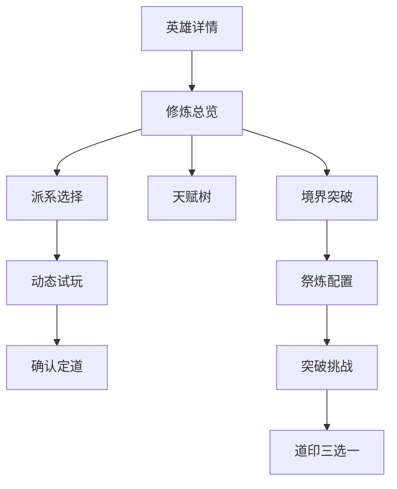

# 竖版城市幸存者：妖族英雄十六修行派系与升阶玩法完整方案

> 适用项目：竖版单手操作、自动普攻与自动技能、手动终极技能、战斗升级永久选卡、英雄长期养成、城市建造循环。
>
> 本文用于替换旧方案中“只有修仙、修魔、修身、修神且主要增加数值”的修炼部分，并与既有 36 名英雄、12 种攻击原型、装备随机词条、先天命格和永久卡牌系统直接兼容。

---

## 1. 重构目标

### 1.1 当前问题

旧修炼系统存在五个明显问题：

1. 只有四个选择，同一账号培养多个英雄时很快重复。
2. 天赋节点大量是伤害、生命、冷却等纯数值，战斗中看不出角色修了什么。
3. 修炼体系没有真正改变御剑、斩击、回旋、飞弹等基础攻击方式。
4. 升阶只是交材料、打高战力敌人、提高等级上限，缺少玩法记忆点。
5. 玩家通常只会查询“哪个系伤害最高”，无法形成个人套路与角色复用价值。

### 1.2 新版一句话定义

**修行派系不是额外属性页，而是安装在英雄攻击系统上的一套规则改写器。**

它至少要改变下列内容中的两项：

- 攻击从哪里生成。
- 攻击何时重复或延迟。
- 武器如何飞行、回收、环绕或连接。
- 命中后留下什么可再次利用的战场对象。
- 玩家为什么要改变走位方式。
- 终极技能如何与普攻、自动技能联动。
- 升阶挑战如何检验该派系的核心操作。

### 1.3 设计验收标准

隐藏所有数值与名称，只观看十秒战斗录像，也应能辨认英雄正在修炼什么：

- 修仙者身后有残影同步出招。
- 修体者逐步巨大化，武器与攻击范围同步扩张。
- 阵道者在战场留下阵眼并连接成阵。
- 符道者头顶有符序，满足配方后整组引爆。
- 梦道者会重演数秒前的攻击轨迹。
- 星道者身边星宿轮转并以星线切割敌群。
- 因果道者先种“因”，再由不同攻击结“果”。

如果一个派系只在伤害统计中可见，而在战斗画面和走位决策中不可见，则该派系设计不合格。

---

## 2. 新修炼系统的总体结构

### 2.1 十六个正式派系

首轮完整设计为 16 个派系，其中 12 个作为常规成长内容，4 个作为高阶奇门道途。上线时可以分批制作，但数据结构一次预留完整。

| 分类 | 派系 | 核心玩法器官 | 最鲜明表现 | 操作难度 |
|---|---|---|---|---:|
| 基础大道 | 修仙 | 仙影记录器 | 残影延迟同步攻击 | 2 |
| 基础大道 | 修体 | 巨灵法相 | 角色巨大化、范围扩张 | 1 |
| 基础大道 | 修魔 | 血债与心魔 | 以血换力、心魔共战 | 4 |
| 基础大道 | 修神 | 神敕与神像 | 背后神像执行敕令 | 3 |
| 妖族大道 | 修妖 | 本相与妖性 | 返祖兽化、双形态攻击 | 2 |
| 兵刃大道 | 剑道 | 剑意与剑痕 | 攻击归一、剑域切割 | 3 |
| 造物大道 | 器道 | 本命法器槽 | 武器复制、蓄能与合器 | 3 |
| 术法大道 | 阵道 | 阵眼网络 | 三点成阵、区域重构 | 4 |
| 术法大道 | 符道 | 符序配方 | 攻击事件组成符文连招 | 4 |
| 役使大道 | 御灵 | 灵契与合灵 | 灵兽协同、附体换招 | 3 |
| 生死大道 | 魂道 | 魂火库存 | 敌魂复现、魂体续命 | 3 |
| 奇诡大道 | 蛊道 | 感染生态 | 植蛊、孵化、传播与收割 | 4 |
| 奇门道途 | 梦道 | 梦轨回放 | 数秒前的攻击再次发生 | 5 |
| 奇门道途 | 星道 | 星位与连线 | 星宿环绕、星线切割 | 4 |
| 奇门道途 | 音道 | 节拍与乐句 | 攻击合拍、战场脉冲 | 3 |
| 奇门道途 | 因果道 | 因印与果报 | 延迟结算、伤害转移 | 5 |

难度仅表示理解和构筑成本，不表示强度。低难度派系同样可以成为终局方案。

### 2.2 每名英雄的完整构筑公式

```text
英雄基础攻击原型
× 英雄固定普攻与技能
× 先天命格
× 修行派系规则改写
× 永久卡牌路线
× 武器、装备词条与套装
= 最终战斗套路
```

各系统职责必须分开：

| 系统 | 决定什么 | 是否随机 | 示例 |
|---|---|---:|---|
| 英雄模板 | 基础攻击方式 | 否 | 月芽使用回旋轮刃 |
| 先天命格 | 该个体天生的偏置 | 是且不可改 | 回程伤害提高但去程变慢 |
| 修行派系 | 战斗规则和长期大方向 | 玩家选择 | 梦道重演上一条回旋轨迹 |
| 永久卡牌 | 逐级完善细节 | 战斗三选一 | 轮刃 +1、回程穿透、远点爆炸 |
| 装备 | 可替换的属性和套装联动 | 随机词条 | 回旋半径、利器伤害、命中回能 |

### 2.3 四境不再只是等级门槛

每个派系仍保留四个境界，分别对应 1～20、21～40、41～60、61～80 级，但每一境承担不同的玩法职责。

| 境界层 | 解锁内容 | 设计要求 |
|---|---|---|
| 第一境 | 道种 | 获得派系资源与最小可玩的核心循环 |
| 第二境 | 道术 | 在三条分支中选择主路线，改变攻击触发方式 |
| 第三境 | 道形 | 攻击原型发生结构性变化，而非只提高倍率 |
| 第四境 | 大道显化 | 获得法相、领域或全场规则，形成终局画面 |

### 2.4 每个派系必须具备的六项内容

1. 一种可在 HUD 上看懂的派系资源。
2. 一种会留在战场上的派系对象。
3. 三条互斥或半互斥构筑分支。
4. 至少四种攻击原型的专属变体。
5. 三场不以战力碾压为核心的突破挑战。
6. 一套独立动画、特效、音效和跳字语言。

### 2.5 定道与重修

- 英雄修为 5 级开放“定道”。
- 定道前可以进入无消耗试玩秘境，使用该英雄当前武器体验所有已解锁派系。
- 系统只推荐 3 个适配派系，不禁止自由选择。
- 20 级前免费更换，第一次突破后锁定。
- 后期使用可通过活动、城市和玩法获得的“轮回丹”重修。
- 重修保留修为经验、悟性等级、先天命格和祭炼档位；派系节点返还，专属悟道词条封存。
- 新派系必须完成对应的“道种试炼”，不能支付货币立即跳过。

### 2.6 十六派系四境称号

| 派系 | 第一境 | 第二境 | 第三境 | 第四境 |
|---|---|---|---|---|
| 修仙 | 练气 | 通玄 | 明道 | 真仙 |
| 修体 | 锻体 | 金刚 | 无阻 | 不灭 |
| 修魔 | 灭气 | 化魔 | 寂灭 | 真魔 |
| 修神 | 斩我 | 渡劫 | 化神 | 真神 |
| 修妖 | 启血 | 返祖 | 显圣 | 妖祖 |
| 剑道 | 养锋 | 剑心 | 剑域 | 剑圣 |
| 器道 | 炼胚 | 化器 | 器界 | 天工 |
| 阵道 | 定枢 | 连星 | 衍界 | 阵祖 |
| 符道 | 描箓 | 通篆 | 言法 | 天符 |
| 御灵 | 结契 | 共鸣 | 融灵 | 万灵 |
| 魂道 | 点魄 | 聚魂 | 轮转 | 魂主 |
| 蛊道 | 养卵 | 成巢 | 万噬 | 蛊祖 |
| 梦道 | 入梦 | 织梦 | 化境 | 梦主 |
| 星道 | 观星 | 列宿 | 周天 | 星君 |
| 音道 | 听律 | 合拍 | 玄音 | 天籁 |
| 因果道 | 识因 | 承果 | 断业 | 命主 |

旧存档中的“修身”统一迁移为“修体”，锻体、金刚、无阻、不灭的等级、品质、祭炼数量和已投入天赋点全部保留；原纯数值节点按成本全额返还，让玩家重新选择新版玩法节点。修仙、修魔、修神沿用原境界称号和进度。

---

## 3. 攻击原型与修行规则的结合方式

### 3.1 十二种基础攻击原型

| 简称 | 原型 | 关键事件 |
|---|---|---|
| 御剑 | `HomingWeapon` | 离匣、追踪、命中、归鞘 |
| 斩击 | `SectorSweep` | 蓄力、扇形判定、收招 |
| 回旋 | `Boomerang` | 去程、远点转向、回程、接住 |
| 飞弹 | `Projectile` | 发射、飞行、命中、穿透/爆炸 |
| 落点 | `TargetAOE` | 选区、预警、落下、持续/引爆 |
| 环绕 | `Orbit` | 生成、绕行、接触、换轨 |
| 突刺 | `LineThrust` | 对齐、贯穿、收枪 |
| 震波 | `Shockwave` | 砸地、中心命中、波前扩散 |
| 冲锋 | `Charge` | 锁向、位移、撞击、终点 |
| 陷阱 | `Trap` | 布置、待机、触发、生效 |
| 召唤 | `Summon` | 召出、指令、攻击、消亡/融合 |
| 连锁 | `ChainBounce` | 首击、搜索下个目标、弹射、结束 |

### 3.2 修炼改写器的执行顺序

为了防止“残影复制残影、召唤物再次召唤召唤物”等无限循环，统一按以下顺序执行：

```text
基础攻击请求
→ 英雄技能模块
→ 修炼派系生成或改写
→ 永久卡牌修改数量、路径和效果
→ 装备及套装修正
→ 最终命中事件
→ 命中后派系结算
```

所有派系额外攻击都携带来源层级：

- `SourceDepth = 0`：英雄本体攻击，可触发全部合法机制。
- `SourceDepth = 1`：残影、法器、星线等派系攻击，只能触发标记、资源和普通命中效果。
- `SourceDepth = 2`：二次爆炸、传播、果报等结算，不再生成新的派系攻击。

### 3.3 不是所有“复制攻击”都相同

| 机制 | 复制什么 | 是否占用武器实体 | 是否复制玩家位置 | 核心玩法 |
|---|---|---:|---:|---|
| 修仙仙影 | 下一次攻击指令 | 否，使用幻影代理 | 使用过去的位置 | 多角度同步 |
| 梦道梦轨 | 过去已经发生的攻击事件 | 否 | 完整重演过去轨迹 | 时间延迟与路线规划 |
| 修神化身 | 按敕令执行特定技能 | 有独立神像对象 | 位于神位或玩家身后 | 指令和领域 |
| 器道法器 | 装备武器的简化模板 | 占用法器槽 | 围绕或固定在器位 | 蓄能与合器 |
| 御灵灵兽 | 灵兽自己的攻击表 | 独立召唤单位 | 有独立移动 | 协同与附体 |

这样可避免十六个派系最后都变成“多发一次攻击”。

### 3.4 适配评级含义

- **S**：攻击原型会产生新的操作与构筑套路。
- **A**：有清晰联动，适合主流构筑。
- **B**：能够正常游玩，但不是该派系最具代表性的组合。
- 不设置“不可用”。低评级只影响推荐，不锁死自由选择。

---

## 4. 四境升阶的统一重构

### 4.1 每次突破的三段结构

每次突破不再是进入一张房间击败 Boss，而是由三段组成：

1. **悟道演练**：无失败惩罚，学习本境新机制。
2. **本命试炼**：根据英雄攻击原型生成目标，检验走位与机制运用。
3. **道心决断**：在三个永久“道印”中选择一个，直接决定下一境的玩法分支。

本命试炼的胜利条件至少 60% 来自机制目标，最高战力也不能完全跳过。

### 4.2 三次突破分别改变什么

| 突破 | 等级上限 | 玩法奖励 | 挑战重点 |
|---|---:|---|---|
| 第一境 → 第二境 | 20 → 40 | 选择主分支，解锁核心道术 | 正确使用派系资源 |
| 第二境 → 第三境 | 40 → 60 | 获得“攻击形变”，改写基础原型 | 使用英雄攻击特点解题 |
| 第三境 → 第四境 | 60 → 80 | 获得法相、领域或终局规则 | 多阶段综合考核 |

### 4.3 普通、人、地、天境界品质不再只加倍率

仍沿用玩家提出的祭炼结构：不吞噬为普通、吞噬 1 张同稀有度卡为人、2 张为地、3 张为天。差异改为“机制槽位为主，数值为辅”。

| 品质 | 新增内容 | 纯数值差建议 |
|---|---|---:|
| 普通 | 获得本境完整基础机制 | 基准 |
| 人阶 | 解锁 1 个“人道印”槽，可选择操作便利或触发方式 | +2%～3% |
| 地阶 | 再解锁 1 个“地脉变体”，让派系对象与地形、陷阱或领域联动 | 累计 +4%～6% |
| 天阶 | 解锁 1 个“天象异变”，改变法相/领域表现与终极技能 | 累计 +7%～9% |

天阶不能简单获得 30%伤害，否则所有特殊机制都会被重复卡牌的数值差掩盖。

### 4.4 祭炼与挑战关系

- 祭品在点击“启封挑战”时锁定，挑战成功才消耗。
- 每张祭品提供一个“缘印候选”，让玩家从三个本派系变体中多看一个，不直接降低挑战难度。
- 普通挑战失败不损失体力；人、地、天品质每日前三次失败不损失挑战券。
- 支持后续补祭，补祭只需要完成新增品质对应的短挑战，不重打全部三段。
- 已培养英雄作为祭品时沿用经验、装备、货币返还规则，并有二次确认和锁定保护。

### 4.5 攻击原型自适应试炼模块

同一派系的试炼会根据英雄攻击原型插入不同机关：

| 原型 | 自适应目标 |
|---|---|
| 御剑 | 控制飞剑归返路线，同时命中内外两个剑门 |
| 斩击 | 用一次扇形攻击覆盖指定数量目标，避免误伤禁像 |
| 回旋 | 通过走位改变回程，使去程和回程分别命中两组目标 |
| 飞弹 | 按威胁顺序击破移动靶，利用穿透或爆炸处理阵列 |
| 落点 | 预测移动敌群并让区域覆盖阵眼，不允许连续空放 |
| 环绕 | 贴近激活目标后及时脱离，维持命中而不承受过量伤害 |
| 突刺 | 将多列敌人对齐后一次贯穿，考验站位而非伤害 |
| 震波 | 让扩散波前在指定时刻同时经过多个共鸣柱 |
| 冲锋 | 规划起点和终点，穿过目标且不能冲入危险区 |
| 陷阱 | 预判路线布置有限数量机关，禁止直接堵出生点 |
| 召唤 | 通过指令保护、集火或召回灵体，不允许本体单独完成 |
| 连锁 | 按正确顺序排列目标，使弹射链抵达最后的核心 |

### 4.6 突破奖励必须可见

突破成功时依次展示：

1. 旧攻击方式的 2 秒短演示。
2. 新机制接入身体、武器或战场对象的变化。
3. 新攻击方式的 3 秒演示。
4. 新道印三选一。
5. 境界称号、品质边框和角色外观更新。

不能只显示“攻击 +120、等级上限 +20”。

---

## 5. 修仙：仙影周天流

### 5.1 核心定位

修仙不再等于“法术伤害和剑气数量提高”，而是利用吐纳记录自身攻击，在过去的位置留下仙影，由仙影延迟同步下一次攻击。

- 核心资源：`灵息`，上限 100。
- 产生方式：本体有效攻击 +6，移动经过灵息痕迹 +3，技能命中多个目标有 0.5 秒内置冷却。
- 消耗方式：生成仙影消耗 25，仙影复制核心技能消耗 40。
- 战场对象：最多 3 个仙影点位。
- 操作变化：玩家主动走出角度，让本体与过去位置形成交叉火力。

### 5.2 三条主分支

| 分支 | 玩法 | 强项 | 代价 |
|---|---|---|---|
| 叠影 | 多个低倍率残影连续跟招 | 清群、覆盖、多方向 | 单体倍率较低 |
| 合影 | 收回所有残影，下一击合并为一次重击 | Boss、暴击、破甲 | 攻击频率下降 |
| 移形 | 闪避或急转时交换本体与仙影位置 | 生存、拉扯、回旋路线 | 需要更多走位理解 |

### 5.3 四境成长

| 境界 | 称号 | 新机制 |
|---|---|---|
| 第一境 | 练气 | 每积满 50 灵息，在 1.2 秒前的位置留下仙影；仙影复制下一次普攻，造成 35%伤害 |
| 第二境 | 通玄 | 选择叠影、合影或移形；仙影可识别普攻的去程、回程和落点事件 |
| 第三境 | 明道 | 获得“多身同念”：核心自动技能可由最近仙影以 45%效果同步一次，8 秒内置冷却 |
| 第四境 | 真仙 | 开启“万象同身”8 秒，三个仙影固定在三角点，同步本体所有 Depth 0 攻击，单影 30%效果 |

### 5.4 与攻击原型的专属结合

| 原型 | 修仙形变 |
|---|---|
| 御剑 | 仙影从过去位置发射无实体幻剑，不占本体剑槽；本体飞剑与幻剑可夹击同一目标 |
| 斩击 | 仙影朝各自记录的旧朝向挥砍，玩家走弧线可形成连续圆形清场 |
| 回旋 | 仙影只复制回程或去程之一，避免复制完整实体；三条返回线随玩家走位交叉 |
| 落点 | 仙影把上一次落点以 45%范围再次显现，形成延迟二次区域 |
| 突刺 | 过去位置向当前目标刺出灵线，可从不同方向对齐敌群 |
| 冲锋 | 仙影重演冲锋路径并造成伤害，本体不会被再次位移 |

### 5.5 专属突破挑战

1. **灵台纳气**：在不断移动的灵脉上积累灵息，利用一个仙影同时激活两座道门。
2. **问道镜廊**：镜像怪只能被仙影伤害，本体怪只能被本体伤害，玩家需要安排交叉火力。
3. **九重照影劫**：雷劫依次锁定本体和三个仙影；玩家用移形、合影或叠影完成不同处理，最后由四身同时打破天门。

### 5.6 表现规范

- 主色：青白、淡金；仙影边缘使用水墨散边，不做完全透明的廉价复制。
- 仙影不播放完整移动动画，只保留站姿、上半身出招和飘带延迟。
- 同步攻击跳字使用较小青色数字，合并计入本体总伤害统计。
- 仙影生成使用一声短促玉磬；多影同步只播放一次主音，避免音效堆叠。

### 5.7 平衡限制

- 仙影攻击 `SourceDepth = 1`，不能再次生成仙影、法器或梦轨。
- 仙影复制数量越多，单影倍率越低，总收益控制在本体输出的 25%～38%。
- 复制御剑时使用幻剑代理，不占用实体飞剑归返状态。

---

## 6. 修体：巨灵法相流

### 6.1 核心定位

修体围绕贴身战斗、气血沸腾和逐段巨大化展开。体型增长不是纯视觉：武器长度、斩击半径、环绕半径、震波宽度和冲锋碰撞宽度都会改变。

- 核心资源：`血气`，三段阈值为 30、65、100。
- 产生方式：近距离命中、受到可承受伤害、精准穿过敌群、破坏护甲。
- 衰减方式：离开敌人 3 秒后缓慢下降。
- 战场对象：巨大化法相轮廓与落脚震尘。
- 操作变化：越靠近敌群越强，但体型越大转向和加速越慢。

### 6.2 巨大化的安全规则

| 血气阶段 | 角色视觉尺寸 | 攻击范围 | 受击碰撞体 | 移动影响 |
|---|---:|---:|---:|---:|
| 常态 | 100% | 100% | 100% | 无 |
| 沸血 | 112% | 115% | 102% | 转向 -3% |
| 巨灵 | 128% | 135% | 105% | 加速 -6% |
| 法相 | 155%视觉轮廓 | 165% | 108% | 转向 -10%，免疫轻击退 |

不能让碰撞体随模型同比放大，否则“变强”会变成更容易受伤。法相阶段主要放大攻击表现和范围。

### 6.3 三条主分支

| 分支 | 玩法 | 强项 | 代价 |
|---|---|---|---|
| 巨灵 | 快速巨大化、极限范围 | 斩击、震波、环绕 | 机动和攻速较慢 |
| 金刚 | 血气转护体层，格挡后爆发 | 守城、抗压、Boss | 清怪速度一般 |
| 破军 | 移动速度与血气转冲击力 | 冲锋、突刺、破甲 | 需要持续冒险穿群 |

### 6.4 四境成长

| 境界 | 称号 | 新机制 |
|---|---|---|
| 第一境 | 锻体 | 血气达到 30 后进入沸血，近战范围 +15%，每次重击产生小范围风压 |
| 第二境 | 金刚 | 选择巨灵、金刚或破军；血气达到 65 时武器模型和判定同步增大 |
| 第三境 | 无阻 | 达到 100 血气后下一次核心技能“超限”，范围扩张并附带破势，随后血气降至 50 |
| 第四境 | 不灭 | 手动终极技能期间召唤完整巨灵法相 10 秒，本体在法相胸口位置，攻击由法相武器同步放大 |

### 6.5 与攻击原型的专属结合

| 原型 | 修体形变 |
|---|---|
| 斩击 | 武器实际变长，扇形角度略收窄但半径大增；满血气一击形成外层风刃 |
| 环绕 | 环绕半径随体型增加，武器尺寸增大但数量不变；适合主动穿群 |
| 突刺 | 生成更宽的长胶囊判定，命中重型敌人不会提前停止 |
| 震波 | 法相脚步和砸地同时生成内外两层波前，中心破势大幅提高 |
| 冲锋 | 化为巨兽轮廓推进，轻型敌人被带至终点再统一抛飞 |
| 御剑/飞弹 | 法相不复制弹量，而是把下一把飞剑或飞弹压缩为巨型重弹，保持玩法差异 |

### 6.6 专属突破挑战

1. **百锤炼身**：不能躲开全部攻击，需要在安全上限内承受指定重击来积累血气，再用风压击碎炼体桩。
2. **负岳开门**：巨大化后搬动石门会降低移动，需要选择缩小穿隙或维持巨灵击破道路。
3. **不灭镜战**：与自己的巨灵法相战斗；只有用范围扩大后的攻击同时击中本体镜像与四个气穴才能破防。

### 6.7 表现与平衡

- 主色：铜金、赤红、土黄；肌肉和毛发边缘出现气血蒸汽，不做写实肌肉膨胀。
- 摄像机随体型最多后拉 8%，避免玩家误以为移动变慢。
- 法相脚步只产生弱震屏；重击和终极落地才使用强震屏。
- 远程英雄选择修体时也有巨弹玩法，但总收益略低于斩击、震波和冲锋，仍可正常构筑。

---

## 7. 修魔：血债心魔流

### 7.1 核心定位

修魔不再只是“血越少伤害越高”。角色主动借取力量形成血债，并必须通过击杀指定目标、命中被诅咒目标或在时限内完成爆发来偿还；无法偿还时心魔会实体化并干扰玩家。

- 核心资源：`魔意` 0～100 与 `血债` 0～5 层。
- 借力：技能可借取 5%当前生命或积累 1 层血债，立即强化本次攻击。
- 还债：击杀血印目标、打断精英技能、完成多杀可清除血债。
- 战场对象：血印目标、心魔影、血池。
- 操作变化：玩家需要选择什么时候借力，以及优先追杀哪个债主目标。

### 7.2 三条主分支

| 分支 | 玩法 | 强项 | 代价 |
|---|---|---|---|
| 血海 | 生命转血池，过量吸血引爆 | 范围续航、守点 | 需要控血 |
| 心魔 | 召出危险心魔同步攻击 | 极限输出、多方向 | 心魔未驯服时会反噬 |
| 吞噬 | 标记精英并夺取临时能力 | 精英、Boss、成长 | 普通小怪收益较低 |

### 7.3 四境成长

| 境界 | 称号 | 新机制 |
|---|---|---|
| 第一境 | 灭气 | 每 12 秒可让下一技能借血强化；命中目标获得血印，击杀返还一半生命成本 |
| 第二境 | 化魔 | 选择血海、心魔或吞噬；血债达到 3 层时出现可被攻击的心魔影 |
| 第三境 | 寂灭 | 玩家可主动“纵魔”6 秒，心魔复制普攻；期间每秒增加血债，结束前完成还债则无反噬 |
| 第四境 | 真魔 | 终极技能进入真魔解体：生命锁定不低于 1，所有血印连成血网；结束时按偿还比例恢复或受罚 |

### 7.4 与攻击原型的专属结合

| 原型 | 修魔形变 |
|---|---|
| 回旋 | 轮刃去程给敌人种血印，回程收割血印并偿债，迫使玩家规划返回线 |
| 飞弹 | 借血后弹体穿过第一个血印目标会分裂，但分裂弹不能再次分裂 |
| 落点 | 血印目标死亡留下血池，下一次落点法术可以消耗血池扩大范围 |
| 冲锋 | 冲锋经过血印目标会拖出血路，终点统一引爆；未击中目标则额外负债 |
| 召唤 | 可献祭临时召唤物偿还血债，或让心魔附在召唤物上强化其攻击 |
| 连锁 | 弹射优先寻找血债目标，每成功跨越一个血印提高最终收割倍率 |

### 7.5 专属突破挑战

1. **血池夺魄**：借血才能伤害敌人，但必须在生命耗尽前击杀带血印的偿债者。
2. **心魔双生**：心魔同步玩家攻击，也会伤害场内封印；玩家需要让它打敌人而不是打破禁制。
3. **万魔噬心**：三阶段 Boss 分别诱导过量借血、错误击杀和失控；通关评价取决于最终偿债率而非剩余血量。

### 7.6 表现与公平性

- 主色：暗红、黑紫；血液使用能量化墨液，不做写实喷血。
- 血债显示为角色背后逐条亮起的裂纹，不长期占据生命条区域。
- 心魔与修仙仙影的区别：心魔有独立生命、会吸引敌人，也可能反噬；仙影只是同步攻击代理。
- 自动战斗中提供“保守、均衡、纵魔”三种借血策略，避免离线 AI 无脑自杀。
- 一命通关模式禁止自动真魔解体，必须由玩家手动确认终极技能。

---

## 8. 修神：神敕化身流

### 8.1 核心定位

修神者在战场积累愿力，在背后凝聚一尊与角色兽相、职业和武器对应的神像。神像不会无脑复制全部技能，而是执行玩家预设的“神敕”：诛、镇、护三种命令。

- 核心资源：`愿力`，通过保护目标、控制敌人、击杀神印目标获得。
- 战场对象：神像、神印、香火领域。
- 三种敕令：诛令优先精英，镇令控制密集区，护令保护英雄或城市核心。
- 操作变化：战前预设主敕令，战斗中终极技能按钮旁可短按切换，长按仍释放终极技能。

### 8.2 三条主分支

| 分支 | 玩法 | 强项 | 代价 |
|---|---|---|---|
| 神罚 | 神像周期执行攻击和标记 | 精英、落点、连锁 | 防护较弱 |
| 护国 | 建立随玩家或建筑移动的香火领域 | 守城、生存、震波 | 离开领域收益下降 |
| 役神 | 神像拆分为数个小神使 | 召唤、覆盖、多目标 | 单次威力降低 |

### 8.3 四境成长

| 境界 | 称号 | 新机制 |
|---|---|---|
| 第一境 | 斩我 | 普攻为目标施加神印；每积满 50 愿力，神像按当前敕令执行一次弱化神术 |
| 第二境 | 渡劫 | 选择神罚、护国或役神；神像获得独立神位，玩家可围绕神位作战 |
| 第三境 | 化神 | 神像可把英雄核心自动技能转译成神术：伤害技能变天罚，防御技能变结界，召唤技能变神使 |
| 第四境 | 真神 | 展开神国 10 秒；神像从背景降临战场，所有神印目标受敕令约束并触发派系终局效果 |

### 8.4 与攻击原型的专属结合

| 原型 | 修神形变 |
|---|---|
| 落点 | 神印可作为神罚落点，敌人移动也不会让法术完全空放 |
| 震波 | 护国神像与本体同时砸出相向波前，交汇点产生镇压区 |
| 召唤 | 每类召唤物获得诛、镇、护中的一个职责，终极时列阵朝拜并强化 |
| 连锁 | 神罚只在神印之间弹射，玩家要先用普攻安排链路 |
| 环绕 | 小神使在外环运行，本体武器在内环运行，形成双轨防线 |
| 飞弹 | 诛令锁定最高威胁目标，神像周期发射不会被普通小怪吸走的审判弹 |

### 8.5 专属突破挑战

1. **斩念台**：分别用诛、镇、护三种敕令完成击杀、控制和保护目标，不能只用一种通关。
2. **雷劫护魂**：神像被锁定，玩家要用神印引导雷击敌人，同时维持神像愿力。
3. **众生愿域**：多路居民幻影需要保护；击杀并非唯一目标，神国强度取决于最终存活和被净化数量。

### 8.6 表现规范

- 主色：象牙白、鎏金、少量角色代表色。
- 神像不是通用人形，应提取猫耳、犬吻、鹿角、龟甲等英雄轮廓，并放大核心武器特征。
- 诛令图形为向下剑锋，镇令为方印，护令为圆环；色盲模式依靠形状识别。
- 神国展开时降低背景饱和度 15%，不使用全屏白闪遮挡敌方预警。

---

## 9. 修妖：返祖本相流

### 9.1 核心定位

修妖是妖族世界观最重要的专属派系。角色在人形化身与返祖本相之间循环，不同动物种族拥有不同的本相动作，但统一使用同一套妖性资源和形态规则。

- 核心资源：`妖性`，移动贴近敌人、擦身闪避、连续追击时增长，远离战斗时下降。
- 两种状态：化形态重视武器技巧，本相态重视兽性动作和范围。
- 战场对象：气味猎痕、蜕皮、羽痕或爪印，根据种族替换外观。
- 操作变化：主动保持追猎路线积累妖性，并在合适时机触发返祖。

### 9.2 八类种族本相模块

| 种族模块 | 代表英雄 | 本相特性 | 攻击形变 |
|---|---|---|---|
| 猫科 | 凌锋、震岳、铃爪、赤彪 | 扑跃、连击、背袭 | 快速换位后下一击分为两段 |
| 犬科 | 霜牙、铁哨、阿忠 | 追猎、锁味、护主 | 对同一猎物持续攻击逐步提速 |
| 熊/大型兽 | 岩掌、坤岳、竹影 | 重压、抱摔、霸体 | 范围和破势提高，转向略慢 |
| 鸟类 | 青翎、苍隼、乌玄 | 滑翔、俯冲、羽群 | 移动时短暂越过低矮障碍，远程获得俯角 |
| 蛇/鳞甲 | 墨鳞、砾甲、龟镇 | 蜕皮、盘绕、反刺 | 受控时留下蜕壳，短时免疫同类控制 |
| 有蹄类 | 青角、驰风、铁犇、象山、石角 | 奔踏、顶撞、蓄势 | 连续直线移动积累冲击层 |
| 小型啮齿/灵巧类 | 米仓、雷栗、巧栗、月芽 | 储能、急转、机关亲和 | 急转弯后缩短下一次技能准备时间 |
| 水生/两栖类 | 飞獭、蓝涟 | 滑行、水迹、回流 | 沿自己的水迹移动更快，回程物受水迹引导 |

种族模块只提供动作和基础规则，真正的强度仍由派系分支、卡牌和装备决定，不能让某种动物天然成为唯一最优。

### 9.3 三条主分支

| 分支 | 玩法 | 强项 | 代价 |
|---|---|---|---|
| 猎性 | 锁定猎物并持续追击 | 单体、冲锋、回旋 | 转火成本高 |
| 祖血 | 返祖时间延长，身体与武器一同异化 | 范围、韧性、持续战 | 常态较弱 |
| 万化 | 频繁在人形和本相间切换，切换触发技能 | 灵活、卡牌联动 | 操作和构筑复杂 |

### 9.4 四境成长

| 境界 | 称号 | 新机制 |
|---|---|---|
| 第一境 | 启血 | 妖性满后短暂显露局部本相，下一次普攻获得种族形变 |
| 第二境 | 返祖 | 选择猎性、祖血或万化；返祖持续 6 秒并替换移动与普攻动作 |
| 第三境 | 显圣 | 核心技能获得“人形版本”和“本相版本”，两种版本分别计算冷却并共享 50%进度 |
| 第四境 | 妖祖 | 终极技能唤出巨大祖兽虚影，本体保持正常操作，祖兽根据种族同步扑击、俯冲、奔踏或盘绕 |

### 9.5 与攻击原型的专属结合

| 原型 | 修妖形变 |
|---|---|
| 斩击 | 猫科变爪风双斩，大型兽变重压拍击，鸟类变翼刃环扫 |
| 回旋 | 本相态投出带气味的猎刃，回程优先穿过猎物；水生种沿水迹回流 |
| 环绕 | 环绕武器变为祖灵爪、鳞片或羽刃，贴身动作更具兽群感 |
| 突刺 | 有蹄类在刺击前踏步蓄势，蛇类把直线突刺转为可轻微弯曲的蛇形穿刺 |
| 冲锋 | 直接替换为种族奔袭，猫科可二次扑跃，有蹄类终点产生踏浪，熊类抓住首个重型目标 |
| 召唤 | 召唤物被包装为同源幼灵，返祖时跟随祖兽一同变形 |

### 9.6 专属突破挑战

1. **闻血追猎**：视野被雾遮挡，只能根据猎痕追踪真目标；错误追击会降低妖性。
2. **化形问心**：人形机关只能用武器破解，本相机关只能用种族动作破解，要求频繁切换。
3. **万兽祖坛**：面对自身种族祖兽，必须先学习其三种动作，再在最终阶段用相同动作反制。

### 9.7 表现规范

- 本相不是换成四足普通动物，而是保留人形战斗结构并强化兽头、脊背、爪、尾、角和毛发轮廓。
- 返祖动作使用 0.25 秒骨骼比例过渡和能量外轮廓，避免模型瞬间缩放。
- 俯视镜头下优先强化耳、角、尾和背部纹样，不依赖面部细节。

---

## 10. 剑道：剑意归一流

### 10.1 核心定位

剑道的玩法不是简单提高利器伤害，而是通过攻击角度和连续命中累积剑痕，再选择“万剑分化”或“归一断杀”。装备不是剑时，会由本命剑意生成一把幻形剑，但适配效率略低。

- 核心资源：`剑意` 0～100。
- 目标状态：`剑痕`，每个目标最多 5 层。
- 产生方式：从新的方向命中、命中弱点、飞行武器归返、贯穿多个目标。
- 消耗方式：万剑分化每次消耗 20；归一斩消耗全部剑意与剑痕。
- 操作变化：通过走位改变攻击角度，决定继续叠痕还是引爆归一。

### 10.2 三条主分支

| 分支 | 玩法 | 强项 | 代价 |
|---|---|---|---|
| 万剑 | 剑痕生成小剑并自动追击 | 清群、御剑、多目标 | 单体爆发较低 |
| 归一 | 收束弹量和攻击范围形成重剑 | Boss、破甲、暴击 | 覆盖下降 |
| 无锋 | 钝器、法杖等也转化为剑势，强调无形剑气 | 武器自由、震波、法术 | 核心剑器加成较低 |

### 10.3 四境成长

| 境界 | 称号 | 新机制 |
|---|---|---|
| 第一境 | 养锋 | 同一目标叠至 3 层剑痕时，下一次不同方向的攻击引出一道 30%剑气 |
| 第二境 | 剑心 | 选择万剑、归一或无锋；HUD 出现收/放姿态指示 |
| 第三境 | 剑域 | 剑痕目标之间形成短暂剑线；玩家穿过剑线会将其转向当前面对方向 |
| 第四境 | 剑圣 | 终极展开剑域 9 秒：所有攻击留下可见剑路，结束时按分支分化为万剑或收束为一剑 |

### 10.4 与攻击原型的专属结合

| 原型 | 剑道形变 |
|---|---|
| 御剑 | 实体剑负责叠痕，剑意小剑负责分化；归一时所有未归剑强制回收合成巨剑 |
| 斩击 | 每次挥砍在外缘留下剑路，后续从不同角度交叉时切出十字伤害 |
| 回旋 | 去程叠剑痕，回程消耗；若玩家不想消耗，可选择“藏锋”卡让回程继续叠层 |
| 突刺 | 贯穿每个目标都会延长归一剑长度，适合排线清怪和 Boss 弱点 |
| 飞弹 | 箭弹命中后留下无形剑标，第三枚弹将标记连成一线 |
| 连锁 | 弹射不是直接增伤，而是沿剑痕之间的最短剑路移动 |

### 10.5 专属突破挑战

1. **养剑崖**：武器每次离手都会降低剑意，只有正确归鞘、接住或收招才能继续蓄势。
2. **一线天**：移动石像不断改变站位，玩家必须从不同角度叠痕，最后让归一剑同时贯穿。
3. **剑域问锋**：先后面对万剑镜像、归一镜像和无锋镜像，最终选择一种道心并永久记录为外观印记。

### 10.6 表现与武器适配

- 主色：银白、靛青；剑痕是一道细而稳定的切线，不能用大面积亮光遮挡怪物。
- 核心剑类武器适配系数 1.20；其他利器 1.00；非利器通过无锋分支为 0.90～1.00。
- 剑道额外剑气使用统一代理模型，外观采样当前武器的材质与主色，不需要为每把装备制作完整飞剑。

---

## 11. 器道：本命法器流

### 11.1 核心定位

器道把装备中的主武器炼成本命器，并在角色身边生成 1～3 个法器槽。法器会记录本体攻击、独立蓄能，在合适时机释放简化版本；玩家也可选择把全部法器合成为一次巨型攻击。

- 核心资源：`炉温` 0～100。
- 战场对象：器位、浮游法器、临时机关部件。
- 产生方式：本体攻击、拾取材料、法器正确命中。
- 过热规则：达到 100 后继续攻击会积累过热，必须释放或合器，否则法器短暂停机。
- 操作变化：选择持续多器输出，或控制炉温等待合器爆发。

### 11.2 三条主分支

| 分支 | 玩法 | 强项 | 代价 |
|---|---|---|---|
| 多宝 | 法器槽更多，各自低倍率攻击 | 多目标、覆盖、触发 | 同屏对象多、单击较弱 |
| 本命 | 只有一个高继承法器，可与武器合一 | Boss、装备词条、爆发 | 覆盖有限 |
| 机巧 | 法器落地变为炮台、锯轮或阵枢 | 陷阱、守城、区域 | 需要布置位置 |

### 11.3 四境成长

| 境界 | 称号 | 新机制 |
|---|---|---|
| 第一境 | 炼胚 | 获得一个器位；每积累 40 炉温，法器执行一次 30%普攻模板 |
| 第二境 | 化器 | 选择多宝、本命或机巧；法器获得当前武器的一个核心标签 |
| 第三境 | 器界 | 法器可记录核心自动技能的“动作摘要”，蓄满后释放简化版本 |
| 第四境 | 天工 | 终极开启百炼炉：多宝临时复制器位，本命合成巨器，机巧把场上装置连成器械网络 |

### 11.4 与攻击原型的专属结合

| 原型 | 器道形变 |
|---|---|
| 御剑 | 法器槽直接成为额外剑匣，但法器剑必须归器位后才可再次使用 |
| 飞弹 | 浮游炮口从不同角度交替射击；本命分支把多发压缩为蓄力重炮 |
| 环绕 | 法器自身成为外环，武器成为内环；过热时外环扩张并降低转速 |
| 陷阱 | 机巧法器落地成为可回收机关，回收时返还炉温 |
| 回旋 | 法器在回旋武器远点建立临时接力器位，使返回路线出现折角 |
| 召唤 | 法器可附着在召唤物身上提供一种武装，召唤物死亡后器位返回本体 |

### 11.5 专属突破挑战

1. **百炼炉心**：通过攻击控制炉温在指定区间，过冷无法锻造，过热会烧毁器胚。
2. **万器择主**：场内提供三类临时法器，玩家要根据敌人阵列切换器位而不是固定使用一种。
3. **天工器劫**：巨型失控法器会拆成多个部件；必须先用本体攻击为部件充能，再决定多宝分散击破或合器一击封炉。

### 11.6 表现与性能

- 主色：铜金、青绿、炽橙；使用妖族木器、铜器、符纹结构，不做现代科幻无人机。
- 法器模型采样武器轮廓并使用简模，最多 3 个高精模型；额外数量用残影代理。
- 同一帧多个器位射击时合并音效，只保留左右方位差。

---

## 12. 阵道：阵眼衍界流

### 12.1 核心定位

阵道把玩家移动和攻击命中位置转化为阵眼。三个阵眼连接成阵，不同几何结构决定效果。玩家要主动把敌群引入阵中，而不是站在原地获得光环。

- 核心资源：`阵势`，布置阵眼和阵内命中获得。
- 战场对象：阵眼、阵线、阵域。
- 基础上限：6 个阵眼、2 个完整阵。
- 形成规则：最近且合法的三个阵眼自动成阵；新阵眼超过上限时回收最早一个。
- 操作变化：走位决定阵形，攻击落点决定阵眼位置。

### 12.2 三条主分支

| 分支 | 玩法 | 强项 | 代价 |
|---|---|---|---|
| 杀阵 | 阵线切割、阵内爆发 | 落点、飞弹、清群 | 防御较弱 |
| 困阵 | 减速、牵引、封路 | 守城、陷阱、控制 | Boss收益需转破势 |
| 行阵 | 阵眼跟随玩家或武器移动 | 回旋、环绕、机动 | 单阵范围较小 |

### 12.3 四境成长

| 境界 | 称号 | 新机制 |
|---|---|---|
| 第一境 | 定枢 | 每 4 次有效攻击在命中点或玩家脚下生成阵眼，三点成小阵 |
| 第二境 | 连星 | 选择杀阵、困阵或行阵；可同时维护两个阵，阵线获得伤害或控制判定 |
| 第三境 | 衍界 | 核心技能可“改阵”：落点移动阵眼、震波推动阵线、回旋武器拖拽行阵节点 |
| 第四境 | 阵祖 | 终极把所有阵眼展开为衍界大阵，内含的小阵仍按原分支独立工作 |

### 12.4 与攻击原型的专属结合

| 原型 | 阵道形变 |
|---|---|
| 落点 | 法术中心直接成为阵眼，三个不同落点连接后触发对应元素杀阵 |
| 陷阱 | 陷阱兼任阵眼；阵线穿过陷阱时为其充能，触发后阵眼暂时失活而非消失 |
| 环绕 | 每隔一定角度投下短时行阵节点，玩家移动会画出连续阵线 |
| 回旋 | 远点转向时生成阵眼，回程穿过阵线会给轮刃附加一次阵势斩 |
| 震波 | 波前经过阵眼会再次折射小波，但每个阵眼每次震波只能折射一次 |
| 召唤 | 召唤物可以携带移动阵眼；死亡时阵眼落地并持续 3 秒 |

### 12.5 专属突破挑战

1. **三才定枢**：用有限攻击在指定位置留下阵眼，组成三角形困住移动妖影。
2. **八门演阵**：敌人分别只能被阵内、阵线和阵眼爆发伤害，要求不断拆阵重组。
3. **周天衍界**：地图分为多块危险地面，玩家必须用行阵移动安全区，并在最终阶段把全部小阵连成完整大阵。

### 12.6 可读性与限制

- 主色：靛蓝、鎏金；友方阵线使用实线，敌方预警使用虚线和红色，不只依靠颜色。
- 阵线宽度不得超过角色脚底直径的 15%，避免遮住敌人。
- 阵眼查询使用空间哈希；不允许每帧遍历全部敌人。
- 自动挂机提供“脚下阵、敌群阵、路径阵”三种策略。

---

## 13. 符道：符序敕令流

### 13.1 核心定位

符道把战斗事件转化为符文字符，并按顺序组成配方。玩家不是等待冷却，而是在普攻、技能和走位中“写出”下一张符。

- 核心资源：`符序槽`，基础容纳 3 个字符。
- 字符来源：命中为“击”、穿透为“贯”、回程为“归”、暴击为“破”、击杀为“灭”、区域命中为“域”、召唤攻击为“灵”。
- 战场对象：悬浮符纸、贴在敌人或地面的符印。
- 触发方式：三个字符组成合法配方时自动成符；无配方则最早字符被新字符挤出。
- 操作变化：通过卡牌和装备改变事件频率，主动追求想要的符序。

### 13.2 基础符序示例

| 配方 | 成符 | 效果 |
|---|---|---|
| 击 → 击 → 破 | 破军符 | 下一次攻击扩大并获得破甲 |
| 贯 → 贯 → 灭 | 穿云符 | 从被击杀目标继续发射一条贯穿攻击 |
| 归 → 击 → 归 | 回风符 | 回程武器再次绕远点一周后返回 |
| 域 → 灭 → 域 | 镇地符 | 在击杀位置生成短时控制区域 |
| 灵 → 击 → 灵 | 通灵符 | 最近召唤物复制本体下一次普攻摘要 |
| 破 → 灭 → 破 | 诛邪符 | 对精英或 Boss 施加可积累的诛邪印 |

配方可以由天赋解锁，但同时装备的主动配方最多 6 个，防止玩家无法理解触发来源。

### 13.3 三条主分支

| 分支 | 玩法 | 强项 | 代价 |
|---|---|---|---|
| 速箓 | 两字符即可成小符，触发频繁 | 高频、飞弹、连锁 | 单符威力低 |
| 重篆 | 四字符组成大符，可锁定一个字符 | 爆发、回旋、落点 | 成符速度慢 |
| 禁符 | 可保存一张禁符手动随终极释放 | Boss、策略、特殊效果 | 占用一个符序槽 |

### 13.4 四境成长

| 境界 | 称号 | 新机制 |
|---|---|---|
| 第一境 | 描箓 | 开放 3 格符序和 3 个基础配方，成符后强化下一次普攻 |
| 第二境 | 通篆 | 选择速箓、重篆或禁符；可替换配方并在 HUD 固定追踪一个目标配方 |
| 第三境 | 言法 | 核心技能产生专属字符；成符可贴在敌人、地面、武器或召唤物上 |
| 第四境 | 天符 | 终极进入“言出法随”8 秒，符序不会被错误字符挤出，已装备配方首次完成时触发天符版本 |

### 13.5 与攻击原型的专属结合

| 原型 | 符道形变 |
|---|---|
| 飞弹 | 连续命中快速书写“击”，穿透提供“贯”，可稳定组成连珠穿云套路 |
| 回旋 | 去程写“击”，转向写“归”，回程再次写“归”，天然形成回风配方 |
| 落点 | 区域生成“域”，区域击杀生成“灭”，可以把法术区变为镇地符 |
| 连锁 | 每次合法弹射写“连”字符，完整链条结束才结算，避免一条链刷满所有配方 |
| 陷阱 | 布置时可把当前首字符封入陷阱，触发后归还并置于符序最前端 |
| 御剑 | 离匣写“出”、归鞘写“归”，可构筑“出出归”的分剑符或“归归破”的藏锋符 |

### 13.6 专属突破挑战

1. **百符廊**：系统给出三个目标配方，玩家通过不同敌人和机关生成正确字符。
2. **倒书天篆**：符序从右向左结算，迫使玩家理解事件来源而不是机械等待。
3. **无字天书**：Boss 每阶段封锁一种字符，玩家要临时更换配方，最终亲手完成一张天符。

### 13.7 UI与可读性

- HUD 在英雄经验条下方显示 3～4 枚大字符，不显示长文本。
- 当前可完成的配方用轮廓闪烁提示，绝不弹窗打断战斗。
- 符纸使用米黄、朱砂、墨黑；友方符与敌方符使用不同外形。
- 自动战斗可指定“优先配方”，AI会调整索敌与技能优先级，但不修改伤害规则。

---

## 14. 御灵：灵契合身流

### 14.1 核心定位

御灵者与一只主灵和若干从灵签订契约。灵体不是普通召唤物堆数量，而是会读取本体行为、执行指令，并在共鸣满后附着到英雄、武器或核心技能上改变攻击形态。

- 核心资源：`灵契共鸣` 0～100。
- 主灵职责：攻灵、护灵、辅灵三选一，可在城内调整。
- 战场对象：主灵、从灵、灵契线、附体轮廓。
- 产生方式：本体与主灵在 1 秒内命中同一目标、保护彼此、执行召回。
- 操作变化：围绕主灵位置作战，在“独立协同”和“合灵附体”之间切换。

### 14.2 三条主分支

| 分支 | 玩法 | 强项 | 代价 |
|---|---|---|---|
| 万灵 | 主灵分出数个低继承从灵 | 清群、覆盖、召唤 | 单体较弱 |
| 合灵 | 共鸣满后附体本体或武器 | 爆发、攻击形变 | 失去独立灵体 |
| 养灵 | 主灵在一场战斗中学习敌人特性并进化 | 长局、Boss、冒险 | 短局启动慢 |

### 14.3 四境成长

| 境界 | 称号 | 新机制 |
|---|---|---|
| 第一境 | 结契 | 获得主灵；主灵在本体攻击后进行一次固定职责动作 |
| 第二境 | 共鸣 | 选择万灵、合灵或养灵；短按终极技能旁的灵契键可发出集火/召回命令 |
| 第三境 | 融灵 | 共鸣满后选择附着身体、武器或核心技能，分别提供移动、普攻或技能形变 |
| 第四境 | 万灵 | 终极打开万灵门，主灵获得完整祖灵外观并号令场上召唤物执行一次联合技 |

### 14.4 与攻击原型的专属结合

| 原型 | 御灵形变 |
|---|---|
| 召唤 | 主灵成为召唤队长；本体指令先发给主灵，再由主灵广播给其他召唤物 |
| 飞弹 | 攻灵附着武器后在弹体命中处扑击；辅灵则把首个命中转为弹道修正 |
| 环绕 | 主灵沿外环巡游，可主动扑向精英再返回，不改变本体环绕武器的轨道 |
| 落点 | 灵体先到达预测落点吸引敌人，法术随后落下；护灵会留在区域提供短时减伤 |
| 回旋 | 主灵可接住回旋武器并从另一方向返还，形成一次可控折返 |
| 连锁 | 灵契线可作为一次额外弹射节点，但同一链条只使用一次主灵节点 |

### 14.5 专属突破挑战

1. **初契灵原**：不能直接攻击部分目标，必须通过集火、召回和守护命令让主灵完成。
2. **同心迷途**：本体与主灵被分隔在地图两侧，双方命中同色机关才能建立共鸣桥。
3. **万灵朝宗**：主灵会暂时失控进化，玩家需要识别其三种情绪并用对应命令安抚，最终完成合灵联合技。

### 14.6 灵体生产规范

- 每名英雄不需要制作独占灵兽，可先生产 8 个通用祖灵种族，再根据英雄主色、耳角和纹样换装。
- 主灵必须有明显的待机、确认指令、受伤、附体和联合技动作。
- 灵体攻击使用独立小跳字，联合技使用英雄主色大跳字。
- 主灵受致命伤不会永久死亡，而是化为灵火进入 8 秒恢复，避免玩法突然完全失效。

---

## 15. 魂道：百魂轮转流

### 15.1 核心定位

魂道利用敌人的死亡记忆。击杀会产生魂火，玩家可以把魂火炼成三类“魂式”，临时复现被击杀敌人的战斗功能：群怪形成游魂弹，重怪形成护魂，精英形成一次魂技。

- 核心资源：`魂火`，最多 9 点。
- 战场对象：死亡魂点、魂式、离体魂身。
- 产生方式：本体参与击杀；Boss按阶段掉落而非死亡一次性掉落。
- 消耗方式：游魂 1 点、护魂 3 点、精英魂技 5 点。
- 操作变化：决定立即消费魂火清场，还是保留作为防死和精英爆发资源。

### 15.2 三条主分支

| 分支 | 玩法 | 强项 | 代价 |
|---|---|---|---|
| 聚魂 | 大量游魂沿本体攻击路线追加 | 清群、连锁、飞弹 | 对无小怪Boss启动慢 |
| 轮回 | 消耗魂火抵挡致命伤并短暂离体 | 生存、一命玩法 | 输出收益低 |
| 幽冥 | 绑定精英魂式，释放敌方能力的玩家化版本 | 精英、变化、长局 | 需要先击杀精英 |

### 15.3 四境成长

| 境界 | 称号 | 新机制 |
|---|---|---|
| 第一境 | 点魄 | 击杀有概率生成魂火；每 3 点自动放出一只游魂追击最近目标 |
| 第二境 | 聚魂 | 选择聚魂、轮回或幽冥；可在战前设定自动消费阈值 |
| 第三境 | 轮转 | 核心技能会把魂式塑造成对应攻击原型，而非统一追踪弹 |
| 第四境 | 魂主 | 终极开启百魂夜行，所有储存魂火化为队列依次执行；轮回分支则进入可穿越敌人的魂身 |

### 15.4 与攻击原型的专属结合

| 原型 | 魂道形变 |
|---|---|
| 召唤 | 死亡敌魂成为短时从军，保留体型和职责标签但使用统一玩家伤害模板 |
| 连锁 | 每个死亡魂点可充当一次弹射中继；链条经过后魂点消失 |
| 飞弹 | 游魂沿上一枚飞弹轨迹飞行，重魂会挡住一枚敌方投射物再消散 |
| 震波 | 魂火附在波前上，被波前击杀的敌人让外圈延长但不增加波前数量 |
| 落点 | 区域内死亡的魂火被阵地吸收，区域结束时统一释放魂爆 |
| 回旋 | 回程收集路径附近魂火，每收集 1 点略微扩大本次回程外观与伤害 |

### 15.5 专属突破挑战

1. **引魂渡桥**：敌人死亡后魂火会走向错误出口，玩家要用自身攻击路线引导魂火过桥。
2. **轮回无门**：角色必定经历一次“死亡”，需要在魂身状态穿过敌群找回三魂，期间不能普通攻击。
3. **百鬼夜行**：不能消灭所有魂体；需要识别怨魂、善魂和战魂，分别净化、护送或收服。

### 15.6 与一命通关的关系

- 轮回分支的致命伤保护必须在进入一命模式前明确显示。
- 一命模式中轮回只允许生效一次，消耗全部魂火且降低通关奖励修正，避免成为零代价保险。
- 没有足够魂火时仍按原一命规则结算死亡。

---

## 16. 蛊道：虫巢共生流

### 16.1 核心定位

蛊道不是普通中毒 DOT。攻击会把蛊卵植入敌人，蛊卵在特定条件下孵化、传播或被主动收割。敌群密度、目标寿命和攻击路径会改变整个感染生态。

- 核心资源：`巢温` 0～100。
- 目标状态：蛊卵、幼蛊、成蛊三个阶段。
- 战场对象：宿主标记、虫巢、蛊云。
- 孵化条件：累计命中、宿主进入低血量、经过蛊云或被特定技能命中。
- 操作变化：先培养宿主再引爆，或利用移动敌群传播，不再见怪就立即击杀。

### 16.2 三条主分支

| 分支 | 玩法 | 强项 | 代价 |
|---|---|---|---|
| 爆蛊 | 主动收割宿主体内蛊虫造成连爆 | 爆发、Boss、回旋 | 传播能力低 |
| 瘟巢 | 宿主死亡向附近传播蛊卵 | 密集清群、陷阱、区域 | 稀疏敌人较弱 |
| 共生 | 部分蛊寄生自身或召唤物，提供能力并在受伤时脱落 | 生存、召唤、长局 | 需要管理负面层数 |

### 16.3 四境成长

| 境界 | 称号 | 新机制 |
|---|---|---|
| 第一境 | 养卵 | 每第 4 次本体命中植入蛊卵；宿主死亡时向最近目标转移一次 |
| 第二境 | 成巢 | 选择爆蛊、瘟巢或共生；解锁巢温与主动收割触发条件 |
| 第三境 | 万噬 | 核心技能可让蛊虫适应该攻击原型，例如随回程收割、随链条传播 |
| 第四境 | 蛊祖 | 终极召出祖蛊母巢 10 秒，所有宿主进入快速孵化；结束时按分支爆发、传播或回收共生 |

### 16.4 与攻击原型的专属结合

| 原型 | 蛊道形变 |
|---|---|
| 回旋 | 去程植卵、回程收割，去回路线覆盖得越好，单次循环越完整 |
| 飞弹 | 穿透弹在首个目标植成蛊，后续目标只植蛊卵；爆炸弹将卵均匀分散而不直接孵化 |
| 落点 | 区域成为恒温孵化场，停留越久阶段越高；区域结束不自动引爆 |
| 陷阱 | 陷阱转为虫巢，敌人经过带走幼蛊并成为移动传播源 |
| 召唤 | 共生蛊可附在召唤物上，召唤物攻击传播，死亡时蛊虫返回本体或就地成巢 |
| 连锁 | 链条优先寻找不同感染阶段目标，用“卵→幼→成”的顺序完成传播升级 |

### 16.5 专属突破挑战

1. **百虫瓮**：三种宿主分别适合植卵、孵化和收割，错误顺序会令蛊虫反噬。
2. **移巢渡河**：敌群不断迁移，玩家要利用移动宿主把感染带过无法通行的区域。
3. **蛊母争巢**：Boss 会吞噬过量蛊虫进化；玩家必须在爆发、传播和回收之间保持生态平衡。

### 16.6 表现与舒适度

- 主色：琥珀、翡翠绿、暗金；避免密集写实昆虫，主要用符号化光点、甲壳轮廓和叶片状翅影。
- 提供“低虫群表现”选项，把虫群替换为能量颗粒和巢纹，不改变判定。
- 宿主头顶只显示一个三阶段图标，不为每层蛊卵显示独立数字。

---

## 17. 梦道：梦轨重演流

### 17.1 核心定位

梦道记录过去数秒内真正发生过的攻击、位置与方向，并在延迟后重演。它与修仙仙影的区别是：仙影复制“下一次指令”，梦轨重放“已经发生的完整事件序列”。

- 核心资源：`梦深` 0～100。
- 记录窗口：基础 2.5 秒，最多记录 12 个关键攻击事件。
- 重演延迟：基础 5 秒，每次只重演一个压缩梦段。
- 战场对象：梦轨路径、梦门、梦中攻击代理。
- 操作变化：玩家会提前为数秒后的战场布置攻击路线。

### 17.2 三条主分支

| 分支 | 玩法 | 强项 | 代价 |
|---|---|---|---|
| 叠梦 | 多次低倍率回放同一梦段 | 持续覆盖、回旋、落点 | 爆发较低 |
| 噩梦 | 记录敌人受到的控制和伤害，在回放末端统一惊醒爆发 | Boss、控制、因延迟爆发 | 启动慢 |
| 清梦 | 可清除当前记录并保留最理想的一个事件 | 稳定、精准、飞弹 | 上限低于叠梦 |

### 17.3 四境成长

| 境界 | 称号 | 新机制 |
|---|---|---|
| 第一境 | 入梦 | 每积满 50 梦深，记录上一秒最后一个本体攻击，3 秒后以 35%效果重演 |
| 第二境 | 织梦 | 选择叠梦、噩梦或清梦；记录扩展为连续梦段并显示路径预览 |
| 第三境 | 化境 | 核心自动技能可进入梦段；玩家急转或停步会插入“梦门”，改变回放起点 |
| 第四境 | 梦主 | 终极让最近 6 秒战斗进入大梦回环：压缩后在 4 秒内重演一次，所有攻击使用梦境代理 |

### 17.4 与攻击原型的专属结合

| 原型 | 梦道形变 |
|---|---|
| 回旋 | 完整记录投出、转向和回程路径；玩家之后移动不会改变梦中轮刃路线 |
| 冲锋 | 梦中本体沿旧路线冲锋造成伤害，真实角色不位移，可提前制作交叉冲锋 |
| 落点 | 记录当时的落点而非当前敌人位置，适合预判刷新点和守城路线 |
| 陷阱 | 梦中陷阱只存在一次触发，不占现实陷阱数量上限 |
| 御剑 | 记录飞剑离匣到归鞘的摘要，梦剑按旧目标方向飞行，不占实体剑槽 |
| 斩击 | 记录角色旧朝向和挥砍范围，绕敌一周后可形成延迟环斩 |

### 17.5 专属突破挑战

1. **梦回旧径**：场内目标只会在数秒后出现，玩家需要提前记录能覆盖其未来位置的攻击。
2. **真假两界**：真实敌人与梦中敌人交替可被伤害，玩家要判断当前攻击应立即命中还是留待重演。
3. **一梦千年**：Boss 会抹除当前场景并复原过去布局；玩家必须把关键攻击保存在梦段中带入下一阶段。

### 17.6 技术与平衡限制

- 不记录完整 GameObject，只记录攻击模板 ID、位置、方向、时间戳、随机种子和必要目标快照。
- 梦中攻击 `SourceDepth = 1`，不触发新的梦段、仙影、法器或召唤。
- 记录事件超过上限时按重要度保留核心技能、终极联动和高伤事件，合并普通多段命中。
- 大梦回环总伤害控制在记录期本体伤害的 28%～40%，不是把六秒输出完整复制一次。

---

## 18. 星道：周天列宿流

### 18.1 核心定位

星道让若干星位围绕英雄或固定在战场。攻击会点亮星位，三颗以上亮星形成星宿连线；敌人穿过星线时受伤，完整星图还会触发对应星象。

- 核心资源：`星辉`，用于点亮、移动和升阶星位。
- 战场对象：最多 7 个星位、星线和星图。
- 生成方式：攻击远点、落点中心、环绕换轨点或连锁结束点可成为临时星位。
- 操作变化：玩家通过转向、移动和攻击落点排列星图，而非只叠元素伤害。

### 18.2 三条主分支

| 分支 | 玩法 | 强项 | 代价 |
|---|---|---|---|
| 七杀 | 星线伤害和断裂爆发 | 清群、环绕、飞弹 | 防护较弱 |
| 北斗 | 星位围绕本体并提供导航、减速和护体 | 生存、回旋、近战 | 固定区域能力低 |
| 紫微 | 固定主星统领落点与召唤物 | 守城、落点、召唤 | 离开主星范围收益下降 |

### 18.3 四境成长

| 境界 | 称号 | 新机制 |
|---|---|---|
| 第一境 | 观星 | 获得 3 颗绕身星；本体攻击依次点亮，三颗全亮后形成一次短时星线 |
| 第二境 | 列宿 | 选择七杀、北斗或紫微；可把部分星位固定在攻击远点或落点 |
| 第三境 | 周天 | 达成三角、直线、斗形等星图时触发不同星象，不再只是线伤 |
| 第四境 | 星君 | 终极展开周天星图，七颗星位覆盖屏幕安全区域，攻击事件会让对应星宿降下星辉 |

### 18.4 星图配方

| 星图 | 构成 | 效果 |
|---|---|---|
| 三垣 | 三角形 | 内部敌人减速，三角边周期切割 |
| 一线天 | 三星近似共线 | 沿线发射贯穿星光 |
| 北斗 | 五颗以上折线 | 星线依次亮起并把敌人引向末端主星 |
| 环天 | 星位围绕玩家近似成环 | 获得一次星辉护盾并扩大环绕半径 |
| 坠星 | 三星在同一区域快速点亮 | 在中心降下一次延迟星陨 |

### 18.5 与攻击原型的专属结合

| 原型 | 星道形变 |
|---|---|
| 环绕 | 星位进入武器轨道，武器经过亮星会充能，连续穿过三颗形成星弧 |
| 飞弹 | 飞弹终点或最大距离生成短时星位，多角度射击可以画出星线 |
| 落点 | 每个法术中心成为固定星，三个落点可组成三垣或坠星 |
| 连锁 | 弹射路径点亮最近星位，完整链抵达主星时触发一次逆向星链 |
| 回旋 | 远点转向生成星位，回程穿过的星线附着在轮刃上形成切割尾迹 |
| 震波 | 波前经过星位后让其升起，成为只持续数秒的高位星并改变连线层级 |

### 18.6 专属突破挑战

1. **观星台**：在移动中让三颗绕身星依次照亮三座星门，学习控制相位。
2. **列宿迷图**：根据敌人阵型拼出三垣、一线天和环天，不允许用同一星图完成全部阶段。
3. **周天星劫**：陨星会摧毁错误星位，玩家需要维持七星布局并在最终时刻主动断线躲避全屏星爆。

### 18.7 表现规范

- 主色：深蓝、银白、少量紫金；星线保持细、亮、短，非激活星线透明度低于 25%。
- 星位使用不同几何外框表示序号，不能要求玩家仅靠颜色区分。
- 低画质时减少星尘与拖尾，不减少星位、星线和判定。

---

## 19. 音道：战律共鸣流

### 19.1 核心定位

音道让自动战斗产生可预期的节奏。普攻和技能会吸附到很短的节拍窗口，不需要玩家玩音乐游戏；在正确节拍发生的攻击积累音符，组成乐句后触发战场脉冲。

- 核心资源：`音符`，分重音、轻音、延音三类。
- 全局节拍：根据英雄基础攻速自动选择 80～140 BPM，不强制固定攻速。
- 吸附上限：攻击时间最多调整 ±0.08 秒，不能让操作感觉迟钝。
- 战场对象：音波环、节拍标记、乐句轨道。
- 操作变化：玩家可以在强拍时手动释放终极技能获得额外形变，但错过不会扣除基础效果。

### 19.2 三条主分支

| 分支 | 玩法 | 强项 | 代价 |
|---|---|---|---|
| 战鼓 | 慢拍重击，每四拍产生大震波 | 斩击、震波、守城 | 高频英雄需要降速换威力 |
| 疾弦 | 高频音符组成连奏，连续命中提速 | 飞弹、环绕、连锁 | 被打断后需要重新起奏 |
| 梵音 | 延音形成持续领域，友方在拍点获得强化 | 召唤、生存、控制 | 直接爆发较低 |

### 19.3 四境成长

| 境界 | 称号 | 新机制 |
|---|---|---|
| 第一境 | 听律 | 每第 4 次本体攻击成为重音，命中后产生小音波环 |
| 第二境 | 合拍 | 选择战鼓、疾弦或梵音；攻击事件开始生成三类音符并组成两小节乐句 |
| 第三境 | 玄音 | 核心技能拥有独立声部；普攻与技能在同一强拍命中会触发和声形变 |
| 第四境 | 天籁 | 终极开启天籁乐章 10 秒，场上攻击、召唤物和派系对象按节拍执行联合段落 |

### 19.4 与攻击原型的专属结合

| 原型 | 音道形变 |
|---|---|
| 震波 | 砸地为重音，扩散波前按后续节拍再脉冲两次，但同一敌人有独立命中间隔 |
| 斩击 | 每四拍一次完整圆斩，普通拍保持扇形；命中数量决定下一小节重音强度 |
| 飞弹 | 疾弦让射击形成短连奏，最后一发为收束音，命中后把散乱跳字聚合成一次显示 |
| 环绕 | 武器每经过角色正前方视为一拍，反向旋转的内外环可形成切分节奏 |
| 召唤 | 每种召唤物负责一个声部，同拍命中同一目标触发合奏而非简单乘伤 |
| 连锁 | 每次弹射为一个音阶，链条完整结束后按长度播放收束脉冲 |

### 19.5 专属突破挑战

1. **听风辨律**：画面不显示节拍，只用环境鼓点提示安全区与攻击窗口，之后逐步恢复视觉辅助。
2. **百兽合奏**：三组灵兽分别负责重音、轻音和延音，玩家通过站位让它们在同一小节完成攻击。
3. **天籁无声**：Boss 会周期封锁一种声部，玩家必须用剩余攻击组成替代乐句，最终在强拍释放终极完成合奏。

### 19.6 辅助设置

- 提供节拍光圈、手柄震动、音效三种提示，可分别开关。
- 听障玩家开启视觉节拍后不损失任何战斗信息。
- 关闭背景音乐时保留低音量机制节拍；可单独调节。
- 自动技能不会因为节拍吸附延误超过 0.08 秒，危险保命技能完全不吸附。

---

## 20. 因果道：业印果报流

### 20.1 核心定位

因果道把第一次攻击记录为“因”，把后续不同类型的攻击记录为“果”。只有完成合法因果对，伤害、控制或击杀收益才会被转移、延迟或放大。它是高阶构筑派系，不推荐新手第一名英雄选择。

- 核心资源：`业力` 0～100。
- 目标状态：因印、果印、业线。
- 触发要求：同一目标先被一种事件施加因，再被不同事件结算果。
- 战场对象：目标间的红白业线、延迟果报点。
- 操作变化：改变索敌顺序和技能先后，规划伤害何时、在哪个目标上结算。

### 20.2 基础因果对

| 因 | 果 | 结算 |
|---|---|---|
| 普攻命中 | 核心技能命中 | 把部分普攻伤害延迟到技能后统一结算 |
| 去程命中 | 回程命中 | 将路径内其他因印目标拉入同一次果报 |
| 控制 | 重击/暴击 | 控制无法作用于 Boss 时转为破势伤害 |
| 区域伤害 | 离开区域 | 在目标离开位置留下迟发果报 |
| 召唤命中 | 本体命中 | 业线在召唤物与本体之间切割一次 |
| 击杀 | 下一目标受击 | 把合理比例的溢出伤害转移，不携带处决效果 |

### 20.3 三条主分支

| 分支 | 玩法 | 强项 | 代价 |
|---|---|---|---|
| 报应 | 大量种因，等待一次连锁结算 | 群怪、回旋、连锁 | 延迟较长 |
| 改命 | 消耗业力重写一次错误目标、空放或非暴击结果 | 稳定、落点、Boss | 上限受业力约束 |
| 断缘 | 主动切断业线，把全部果报压到单一目标 | 单体、突刺、爆发 | 清群能力降低 |

### 20.4 四境成长

| 境界 | 称号 | 新机制 |
|---|---|---|
| 第一境 | 识因 | 每个目标首次被本体普攻命中时获得因印，核心技能命中结算一次小果报 |
| 第二境 | 承果 | 选择报应、改命或断缘；解锁两种额外因果对并显示业线 |
| 第三境 | 断业 | 果报可以在目标之间转移；攻击原型的关键事件被纳入因果系统 |
| 第四境 | 命主 | 终极进入“因果倒悬”8 秒，先记录所有果而不结算，结束时按选择的分支统一追溯到因 |

### 20.5 与攻击原型的专属结合

| 原型 | 因果形变 |
|---|---|
| 回旋 | 去程种因、回程结果；玩家改变返回线可以让多个因印并入同一果报 |
| 连锁 | 首击种因、末击结果，中间目标作为业线节点；链条越完整越容易转移溢出伤害 |
| 落点 | 预警圈出现时种因，真正落下时结果；改命可小幅修正一次落点而非直接必中 |
| 突刺 | 沿线收集因印并在最远目标结算；断缘分支把整条线压缩成单体穿心果 |
| 斩击 | 第一次半圆斩种因，从相反方向的下一斩结果，鼓励绕敌转向 |
| 御剑 | 离匣命中种因、归鞘前最后一次命中结果；剑未归还时因果保持悬而未决 |

### 20.6 专属突破挑战

1. **因果棋局**：敌人带有明确先后关系，错误击杀会强化后续目标，必须按因果链排序处理。
2. **业镜还身**：玩家造成的部分攻击会延迟返还自身，需要通过改命转移或断缘提前结算。
3. **无相命轮**：最终 Boss 不直接受伤，玩家要在四个化身上种下不同的因，再让一次终极果报追溯到真身。

### 20.7 防失控规则

- 因果延迟伤害最多保存 4 秒，超时自动按基础倍率结算，不能永远欠账。
- 溢出转移不携带斩杀、即死、掉落翻倍或再次转移标记。
- UI默认只显示当前目标最关键的一条业线，其余使用地面细线，避免屏幕变成线团。
- 伤害统计必须分别列出原攻击、暂存伤害、果报增量，避免玩家误判装备收益。

---

## 21. 十六派系 × 十二攻击原型适配矩阵

### 21.1 总矩阵

| 派系 | 御剑 | 斩击 | 回旋 | 飞弹 | 落点 | 环绕 | 突刺 | 震波 | 冲锋 | 陷阱 | 召唤 | 连锁 |
|---|:---:|:---:|:---:|:---:|:---:|:---:|:---:|:---:|:---:|:---:|:---:|:---:|
| 修仙 | S | A | S | A | S | A | A | B | A | A | A | A |
| 修体 | B | S | B | B | B | A | A | S | S | B | B | B |
| 修魔 | A | A | S | A | A | B | A | A | S | A | A | S |
| 修神 | A | B | B | A | S | A | B | S | B | A | S | S |
| 修妖 | B | S | A | B | B | A | A | A | S | B | A | B |
| 剑道 | S | S | S | A | B | A | S | B | B | B | B | A |
| 器道 | S | B | A | S | B | S | B | B | B | S | A | B |
| 阵道 | A | B | A | B | S | S | B | S | B | S | A | A |
| 符道 | A | B | S | S | S | B | B | B | B | S | B | S |
| 御灵 | B | B | A | A | A | A | B | B | B | A | S | A |
| 魂道 | A | B | A | A | A | B | B | A | B | A | S | S |
| 蛊道 | B | A | S | S | S | A | B | B | B | S | S | S |
| 梦道 | S | A | S | A | S | A | A | B | S | S | B | A |
| 星道 | A | B | A | S | S | S | B | A | B | A | A | S |
| 音道 | B | S | A | S | A | S | B | S | B | A | S | S |
| 因果道 | A | A | S | A | S | B | S | B | B | A | B | S |

### 21.2 矩阵使用规则

- S不是额外获得倍率，而是该组合拥有专属行为或更丰富的构筑节点。
- B组合仍须达到基准强度的 95%以上，不能成为错误选择。
- 英雄详情页默认展示 3 个推荐派系：一个稳健、一个高操作、一个特殊玩法。
- 先天命格可能改变推荐。例如“巨大化时攻速不降低”会明显提高修体评级，但不会改变派系底层规则。
- 新增英雄时不得只选择S组合；每个攻击原型至少要有一种非常规派系样板。

### 21.3 组合强度的统一预算

同等培养下，派系对战斗的总贡献目标为：

| 贡献来源 | 目标占比 |
|---|---:|
| 第一境基础机制 | 本体基准输出/生存的 10%～15% |
| 第二境分支 | 再增加 6%～10%等价价值 |
| 第三境攻击形变 | 再增加 8%～12%等价价值 |
| 第四境终局机制 | 平均再增加 8%～12%，爆发窗口可更高 |

满境派系平均贡献控制在 30%～42%的等价战力，但其中至少一半必须来自范围、路径、控制、节奏或资源效率，而不是面板乘区。

---

## 22. 十二种攻击原型的代表套路

### 22.1 御剑 × 修仙：万影御剑

**适合英雄：** 凌锋、青翎、玄尾。

```text
本体离匣追踪
→ 玩家绕向敌群侧翼留下仙影
→ 飞剑归鞘恢复剑槽
→ 仙影从旧位置释放幻剑
→ 本体与仙影形成交叉剑路
→ 万象同身时三角万剑齐发
```

- 核心道印：叠影、幻剑不占槽、不同方向命中额外积累灵息。
- 永久卡牌：实体剑 +1、归返加速、剑痕、仙影同步间隔缩短。
- 武器词条：御器伤害、归返速度、追踪角速度、利器穿透。
- 优点：移动清群和多角度打 Boss 非常突出。
- 弱点：站桩时仙影重叠，收益明显下降；窄走廊不容易拉出角度。

### 22.2 范围斩击 × 修体：法相圆斩

**适合英雄：** 震岳、岩掌、红鬃。

```text
贴近敌群积累血气
→ 武器与斩击半径逐段扩大
→ 满血气让核心斩击超限
→ 外层风压补足边缘伤害
→ 不灭法相期间进行全屏级但有前摇的巨刃圆斩
```

- 核心道印：巨灵、血气不因多目标重复溢出、法相外圈破势。
- 永久卡牌：斩击角度、重击蓄力、外圈风刃、近身减伤。
- 武器词条：范围、重击、破甲、命中回复架势。
- 优点：最直观的巨大化和范围成长，适合新手理解修炼差异。
- 弱点：对高速远程 Boss 需要先贴近，转向与攻速受到限制。

### 22.3 回旋投掷 × 梦道：三重回月

**适合英雄：** 月芽、飞獭、霜牙。

```text
第一次投出并绕行改变回程
→ 梦道记录完整去回轨迹
→ 玩家移动到另一侧再次投出
→ 旧轨迹在五秒后自动重演
→ 现实轮刃与梦轮形成交叉回程
→ 大梦回环重放最近最优路径
```

- 核心道印：叠梦、梦门保留远点、回程事件优先记录。
- 永久卡牌：回旋数量、最大距离、回程穿透、接住爆发。
- 武器词条：回程伤害、飞行速度、回旋半径、利器伤害。
- 优点：走位越好，数秒后回报越高，角色特点非常清晰。
- 弱点：敌人刷新位置变化大时旧轨迹可能落空；需要路径预判。

### 22.4 直线飞弹 × 符道：连珠天篆

**适合英雄：** 铁哨、米仓、苍隼。

```text
连续命中书写“击”
→ 穿透书写“贯”
→ 击杀书写“灭”
→ 组成穿云符
→ 从死亡目标继续发射贯穿符弹
→ 天符阶段首次完成的每种配方强化为大符
```

- 核心道印：速箓或重篆、锁定“贯”字符、符弹不重复成符。
- 永久卡牌：穿透、弱点、装填、爆头引爆。
- 武器词条：弹速、穿透保留、暴击、装填时间。
- 优点：高频攻击真正进入一套“写符”玩法，而不是单纯攻速流。
- 弱点：不理解配方时收益不稳定；需要在详情页提供一键推荐符组。

### 22.5 敌方落点法术 × 阵道：三才天火阵

**适合英雄：** 绯月、墨鳞、玄角。

```text
第一次AOE落点留下阵眼
→ 第二、第三次落点组成三角
→ 敌群被吸引或减速在阵内
→ 法术继续轰击阵内积累阵势
→ 三个阵眼同时过载触发天火阵
```

- 核心道印：杀阵、落点阵眼、阵内击杀延长阵线。
- 永久卡牌：区域持续、范围、延迟爆炸、目标密度预测。
- 武器词条：法术范围、持续伤害、控制强度、阵眼充能。
- 优点：把自动落点法术变成可规划的区域布局。
- 弱点：频繁移动的 Boss 会离开阵域，需选择行阵或控场装备补足。

### 22.6 环绕武器 × 星道：周天刃环

**适合英雄：** 铃爪、龟镇、空空。

```text
三颗星进入环绕轨道
→ 武器经过亮星获得充能
→ 连续穿过三颗星形成星弧
→ 玩家贴身穿群让刃环与星线同时命中
→ 环天星图生成护盾并扩大轨道
```

- 核心道印：北斗、轨道星位、换轨保留星辉。
- 永久卡牌：环绕数量、半径切换、反向内环、接触冷却。
- 武器词条：环绕速度、利器伤害、近身减伤、星辉获取。
- 优点：主动贴身和轨道管理并存，战斗画面辨识度极高。
- 弱点：远程作战收益低，屏幕线条需要严格控制。

### 22.7 直线突刺 × 剑道：一线断岳

**适合英雄：** 青角、驰风、竹影。

```text
从不同方向刺击同一精英叠剑痕
→ 小怪沿突刺线被贯穿
→ 剑痕目标之间形成剑路
→ 玩家重新对齐目标
→ 归一剑收束所有剑意沿一线断杀
```

- 核心道印：归一、异角叠痕、贯穿延长剑身。
- 永久卡牌：突刺长度、弱点、蓄力、归一暴击。
- 武器词条：贯穿、破甲、对精英伤害、蓄力速度。
- 优点：强化“对齐一列敌人”的原型操作，不靠增加弹量。
- 弱点：散乱敌群效率一般；自动索敌需要加入队列对齐评分。

### 22.8 砸地震波 × 音道：八荒战鼓

**适合英雄：** 坤岳、铁犇、象山。

```text
普通砸地提供重音
→ 波前按后续两拍产生弱脉冲
→ 四拍完成一个战鼓小节
→ 第四拍核心技能生成内外双震波
→ 天籁阶段召唤物与图腾跟随鼓点共振
```

- 核心道印：战鼓、强拍破势、波前延音。
- 永久卡牌：震波速度、内圈重击、外圈范围、破甲。
- 武器词条：钝器、震波、控制、重击冷却。
- 优点：声音、震屏和攻击节奏高度统一，重武器反馈最强。
- 弱点：攻速过快或过慢都需要系统自动换算 BPM，不能直接套固定节拍。

### 22.9 冲锋撞击 × 修妖：祖相猎冲

**适合英雄：** 赤彪、胡烈、石角。

```text
沿敌群边缘移动积累妖性
→ 锁定精英为猎物
→ 返祖后发动种族冲锋
→ 猫科二次扑跃/有蹄类踏浪/大型兽携敌撞墙
→ 妖祖虚影重复一次终点打击
```

- 核心道印：猎性、猎痕不因转向丢失、本相终点形变。
- 永久卡牌：冲锋宽度、撞墙、第二段、终点震波。
- 武器词条：移动速度、冲撞、破势、受击减伤。
- 优点：每个动物种族的战斗形象被直接放大。
- 弱点：狭窄地图和危险地形要求导航投影非常可靠。

### 22.10 陷阱机关 × 蛊道：行巢猎场

**适合英雄：** 灰尾、丝罗、巧栗。

```text
在敌人路径布置虫巢陷阱
→ 首批敌人带走幼蛊成为移动宿主
→ 宿主进入下一片陷阱提高巢温
→ 大群感染后主动收割或等待瘟巢传播
→ 祖蛊母巢把整条路径变为孵化带
```

- 核心道印：瘟巢、移动宿主、旧陷阱回收返巢温。
- 永久卡牌：陷阱存量、触发半径、延时、连锁触发。
- 武器词条：陷阱持续、异常传播、区域范围、机关冷却。
- 优点：守城路线和高密度战斗具有独特生态玩法。
- 弱点：短局和单体 Boss 需要改用爆蛊分支。

### 22.11 召唤单位 × 御灵：万灵合契

**适合英雄：** 阿忠、白蘅、乌玄。

```text
主灵给场上召唤物分配职责
→ 本体与主灵同时命中积累共鸣
→ 集火命令让所有召唤物攻击神印目标
→ 共鸣满后主灵附体核心召唤物
→ 终极开启万灵门执行联合技
```

- 核心道印：万灵或合灵、队长广播、召回恢复。
- 永久卡牌：召唤上限、继承比例、攻击间隔、死亡效果。
- 武器词条：召唤伤害、持续时间、指令冷却、护主范围。
- 优点：解决召唤物各打各的、难以表现协同的问题。
- 弱点：同屏单位量高，需要性能代理与清晰职责图标。

### 22.12 连锁弹射 × 因果道：报应天雷

**适合英雄：** 雷栗、蓝涟、砾甲。

```text
首个目标被种因
→ 连锁沿未命中目标传播
→ 中间目标成为业线节点
→ 末端目标承受第一层果报
→ 溢出伤害沿业线逆向追溯
→ 因果倒悬时先记录所有链，结束后统一报应
```

- 核心道印：报应、链尾结算、溢出逆流。
- 永久卡牌：弹射次数、搜索半径、伤害递减、回弹。
- 武器词条：连锁范围、对标记增伤、溢出转移、元素触发。
- 优点：把目标顺序和弹射路径变成真正的构筑内容。
- 弱点：单目标环境需要断缘分支，否则链路价值不足。

---

## 23. 36 名首发英雄的派系推荐

推荐只用于界面引导，不构成职业限制。每名英雄提供“稳健推荐、特色推荐、高阶推荐”三种答案，避免攻略只剩唯一派系。

| 攻击原型 | 英雄 | 稳健推荐 | 特色推荐 | 高阶推荐 | 三种体验差异 |
|---|---|---|---|---|---|
| 御剑 | 凌锋 | 修仙 | 剑道 | 器道 | 多角度幻剑 / 剑痕归一 / 多剑匣法器 |
| 御剑 | 青翎 | 修仙 | 星道 | 梦道 | 羽影御剑 / 飞剑列星 / 旧轨迹梦剑 |
| 御剑 | 玄尾 | 剑道 | 符道 | 因果道 | 符剑叠痕 / 出归成符 / 归鞘结果 |
| 斩击 | 震岳 | 修体 | 修妖 | 音道 | 巨刃法相 / 虎祖双扑 / 四拍圆斩 |
| 斩击 | 岩掌 | 修体 | 修神 | 阵道 | 金刚重斧 / 护国镇压 / 斩击画阵 |
| 斩击 | 红鬃 | 剑道 | 修魔 | 修仙 | 交叉剑路 / 血债狂斩 / 残影补刀 |
| 回旋 | 月芽 | 梦道 | 符道 | 修仙 | 梦轨回月 / 去归符序 / 多角度仙影 |
| 回旋 | 飞獭 | 器道 | 阵道 | 修妖 | 器位折返 / 远点阵眼 / 水迹回流 |
| 回旋 | 霜牙 | 修妖 | 修魔 | 因果道 | 猎物回刃 / 去种回收 / 去因回果 |
| 飞弹 | 铁哨 | 符道 | 器道 | 音道 | 连珠成符 / 浮游火铳 / 疾弦射击 |
| 飞弹 | 米仓 | 器道 | 星道 | 魂道 | 机关弩位 / 终点列星 / 游魂箭路 |
| 飞弹 | 苍隼 | 修妖 | 剑道 | 因果道 | 俯冲箭雨 / 无形剑标 / 弱点果报 |
| 落点 | 绯月 | 阵道 | 修仙 | 星道 | 月火成阵 / 残影复现 / 落点列宿 |
| 落点 | 墨鳞 | 蛊道 | 修魔 | 因果道 | 毒域孵化 / 血池毒爆 / 离域果报 |
| 落点 | 玄角 | 修神 | 符道 | 梦道 | 神印落雷 / 域灭成符 / 延迟复阵 |
| 环绕 | 铃爪 | 星道 | 修体 | 修妖 | 周天刃环 / 巨灵外环 / 猫祖爪环 |
| 环绕 | 龟镇 | 修体 | 修神 | 阵道 | 金刚护环 / 护国双轨 / 行阵龟甲 |
| 环绕 | 空空 | 音道 | 器道 | 梦道 | 双环切分拍 / 内外器位 / 旧轨棍环 |
| 突刺 | 青角 | 剑道 | 修仙 | 因果道 | 一线归一 / 仙影夹刺 / 收因断业 |
| 突刺 | 驰风 | 修妖 | 修体 | 音道 | 奔踏枪势 / 破军宽刺 / 强拍连枪 |
| 突刺 | 竹影 | 剑道 | 修神 | 梦道 | 点枪剑痕 / 神像定线 / 旧位复刺 |
| 震波 | 坤岳 | 修体 | 音道 | 修神 | 巨灵双震 / 八荒战鼓 / 神像对波 |
| 震波 | 铁犇 | 修神 | 阵道 | 修妖 | 护国图腾 / 阵眼折射 / 牛祖奔踏 |
| 震波 | 象山 | 音道 | 修体 | 星道 | 钟鸣多拍 / 象祖法相 / 波前升星 |
| 冲锋 | 赤彪 | 修妖 | 修魔 | 梦道 | 虎祖二扑 / 血路纵魔 / 旧路再冲 |
| 冲锋 | 胡烈 | 修体 | 修妖 | 魂道 | 携敌撞墙 / 野猪奔袭 / 重魂护冲 |
| 冲锋 | 石角 | 修体 | 修神 | 因果道 | 巨灵破军 / 镇守神冲 / 终点果报 |
| 陷阱 | 灰尾 | 器道 | 蛊道 | 符道 | 机巧网络 / 行巢传播 / 封字机关 |
| 陷阱 | 丝罗 | 阵道 | 蛊道 | 因果道 | 困阵蛛网 / 宿主传播 / 离网结果 |
| 陷阱 | 巧栗 | 器道 | 星道 | 梦道 | 百器炮台 / 装置列星 / 梦中陷阱 |
| 召唤 | 阿忠 | 御灵 | 修神 | 魂道 | 灵犬队长 / 护主神使 / 战魂护卫 |
| 召唤 | 白蘅 | 御灵 | 蛊道 | 阵道 | 花灵合契 / 共生灵植 / 移动阵眼 |
| 召唤 | 乌玄 | 魂道 | 修魔 | 音道 | 百魂鸦群 / 万魂血债 / 鸦群声部 |
| 连锁 | 雷栗 | 因果道 | 星道 | 符道 | 报应天雷 / 星宿逆链 / 连字雷符 |
| 连锁 | 蓝涟 | 星道 | 修仙 | 蛊道 | 水星链路 / 仙影水弹 / 感染传播 |
| 连锁 | 砾甲 | 因果道 | 魂道 | 修妖 | 鳞刃报应 / 魂点中继 / 鳞祖反弹 |

### 23.1 推荐界面的表达方式

每个推荐项必须显示 4 秒动态预览，而不是只放“推荐”二字：

- 显示角色当前武器与派系机制结合后的真实攻击。
- 使用“操作关键词”描述，例如“绕行留影”“贴身巨大化”“去程种因、回程结果”。
- 显示优点与代价各一条。
- 显示当前已有装备、先天命格与该派系的实际匹配数量。
- 玩家仍可点“查看全部 16 派系”自由选择。

---

## 24. 天赋树从数值树改为玩法树

### 24.1 节点比例

每棵树约 36～42 点总需求，满级只能取得约 65%。节点内容比例应为：

| 节点内容 | 数量占比 | 示例 |
|---|---:|---|
| 规则节点 | 35% | 回程事件可以成为符字 |
| 形变节点 | 25% | 震波经过阵眼会折射 |
| 资源节点 | 20% | 改变资源来源、消费或上限 |
| 条件数值节点 | 15% | 位于阵内时冷却恢复提高 |
| 纯数值节点 | 不超过 5% | 基础生命 +4% |

纯数值节点只能用作树枝连接，不能成为玩家点击一整层后的主要收获。

### 24.2 通用四环结构

```text
第一环：资源来源三选一
    ↓ 至少投入4点
第二环：主分支三选一，可在分支内继续扩展
    ↓ 总投入10点
第三环：按攻击原型出现三个“本命形变”候选
    ↓ 总投入18点
第四环：法相/领域三选一，最多取得一个
```

第三环不是固定内容。系统读取英雄主攻击原型，从本派系的 12 组适配节点中抽取 3 个候选，其中至少 1 个直接服务主攻击，另外 2 个服务核心技能或装备标签。

### 24.3 十六派系的关键节点样例

| 派系 | 分支核心一 | 分支核心二 | 分支核心三 | 第四境天象节点 |
|---|---|---|---|---|
| 修仙 | 叠影：多影低倍率 | 合影：归一重击 | 移形：交换位置 | 万象同身：三影同步 |
| 修体 | 巨灵：快速巨大化 | 金刚：血气护体 | 破军：速度转冲击 | 不灭法相：全武器放大 |
| 修魔 | 血海：血池收支 | 心魔：纵魔共战 | 吞噬：夺精英魂技 | 真魔解体：延迟清算血债 |
| 修神 | 神罚：诛令 | 护国：护令领域 | 役神：小神使 | 神国：神像降临 |
| 修妖 | 猎性：锁味追击 | 祖血：长返祖 | 万化：切换触发 | 妖祖：种族祖兽虚影 |
| 剑道 | 万剑：剑痕分化 | 归一：收剑重斩 | 无锋：武器泛化 | 剑域：剑路统一结算 |
| 器道 | 多宝：多器位 | 本命：单器高继承 | 机巧：器位落地 | 百炼炉：复制或合器 |
| 阵道 | 杀阵：阵线切割 | 困阵：区域控制 | 行阵：节点移动 | 衍界：全部阵眼成大阵 |
| 符道 | 速箓：双字小符 | 重篆：四字大符 | 禁符：手动保存 | 言出法随：配方天符化 |
| 御灵 | 万灵：从灵分化 | 合灵：附体变招 | 养灵：战内学习 | 万灵门：联合技 |
| 魂道 | 聚魂：游魂队列 | 轮回：魂身续命 | 幽冥：精英魂式 | 百魂夜行：库存释放 |
| 蛊道 | 爆蛊：主动收割 | 瘟巢：死亡传播 | 共生：自身寄生 | 祖蛊母巢：全场孵化 |
| 梦道 | 叠梦：重复梦段 | 噩梦：惊醒爆发 | 清梦：筛选记录 | 大梦回环：六秒压缩回放 |
| 星道 | 七杀：星线输出 | 北斗：绕身护航 | 紫微：固定主星 | 周天星图：七宿显化 |
| 音道 | 战鼓：慢拍重音 | 疾弦：高速连奏 | 梵音：延音领域 | 天籁乐章：多声部合奏 |
| 因果道 | 报应：群体追溯 | 改命：修正一次结果 | 断缘：单体归一 | 因果倒悬：先果后因 |

### 24.4 道印选择规则

- 每次突破最后固定出现 3 个道印，只能选择 1 个。
- 道印不是随机品质，三个候选都具有同等预算。
- 至少一个与英雄主攻击原型直接相关。
- 至少一个改变操作方式。
- 至少一个解决当前分支弱点，但降低部分上限。
- 可用“悟道尘”重选，但需要重新完成 2～3 分钟的道心短试炼，不能只付金币秒换。

### 24.5 攻击形变示例

同一个“范围 +20%”节点应改造成具备行为差异的形变：

| 原纯数值节点 | 新玩法节点 |
|---|---|
| 斩击范围 +20% | 第三次斩击外缘生成风压，但内圈伤害降低 10% |
| 投射物数量 +1 | 法器记录每第三枚弹，在另一器位延迟发射 |
| 召唤物伤害 +15% | 主灵集火后，其他召唤物下一击转向同一目标 |
| 法术持续 +25% | 区域结束时留下一个阵眼，而非直接延长 |
| 冲锋伤害 +20% | 冲锋终点留下梦门，下一次梦轨从该点开始 |

---

## 25. 高阶旁修与双修

### 25.1 为什么不能直接开放两棵完整树

如果角色同时运行两套完整派系资源和法相，会出现三个问题：

- HUD需要同时显示两套资源，竖屏战斗过于拥挤。
- 残影、梦轨、法器、召唤物可能递归生成，性能和规则失控。
- 双修组合达到 120 种以上，任何一次平衡修改都会产生大量连锁问题。

因此采用“主修完整派系 + 旁修一枚道印”的轻量方案。

### 25.2 开放规则

- 主修达到第三境 60 级后开放旁修任务。
- 旁修只有一个被动道印，不生成第二套资源条，也不解锁旁修法相。
- 旁修效果统一为主修同类机制的 20%～30%预算。
- 同源递归组合自动禁用，例如梦道主修不能选择“再回放一次梦中攻击”的旁修节点。
- 旁修可以重选，保留已完成的派系见闻，不需要重新升等级。
- 旁修作为 P2 内容制作，首发阶段先隐藏入口。

### 25.3 十六枚旁修道印

| 旁修派系 | 旁修道印 | 简化效果 |
|---|---|---|
| 修仙 | 一息留影 | 每第 8 次本体普攻由旧位置以 20%效果重现一次 |
| 修体 | 血气外放 | 连续近身命中后，下一次攻击范围提高并产生弱风压 |
| 修魔 | 血契 | 每 12 秒可借取 3%当前生命强化下一核心技能，击杀返还 |
| 修神 | 一纸神敕 | 每 15 秒对最高威胁目标执行一次弱诛令 |
| 修妖 | 祖血一瞬 | 擦身闪避后下一次普攻获得种族本相形变 |
| 剑道 | 藏锋 | 同一目标第三次受击出现一层剑痕，核心技能可消耗 |
| 器道 | 小器胚 | 获得一个小器位，每第 6 次攻击执行 15%普攻摘要 |
| 阵道 | 三才残阵 | 三次核心技能落点可组成一个持续 3 秒的小阵 |
| 符道 | 定式符 | 每完成固定的“普攻→技能→普攻”顺序触发一张小符 |
| 御灵 | 随行小灵 | 获得不可受击的小灵体，每 5 秒执行一次职责动作 |
| 魂道 | 引魂 | 每 8 次击杀生成一只游魂，自动攻击后消失 |
| 蛊道 | 寄卵 | 每第 6 次命中植入蛊卵，宿主死亡时小范围爆开 |
| 梦道 | 一梦 | 每 10 秒重演最近一次本体普攻，效果为 20% |
| 星道 | 客星 | 获得 3 颗弱星，依次点亮后产生一条短星线 |
| 音道 | 重拍 | 每第 4 次普攻成为重音并产生小音波 |
| 因果道 | 小因果 | 普攻种因、核心技能结果，6 秒内每目标一次 |

### 25.4 代表双修套路

| 主修 | 旁修 | 套路 |
|---|---|---|
| 修体 | 修仙 | 巨灵重击后由旧位置出现一个小型法相残影补击 |
| 阵道 | 蛊道 | 阵内击杀植入蛊卵，敌人离开阵域后把感染带向下一阵 |
| 星道 | 音道 | 星位按四拍轮流点亮，强拍时星线统一脉冲 |
| 梦道 | 剑道 | 梦中攻击保留一层剑痕，现实攻击负责归一结算 |
| 修妖 | 器道 | 返祖时小器胚附在角、爪或羽翼上改变一次攻击 |
| 御灵 | 修神 | 主灵可承接弱护令，但不会生成第二尊神像 |
| 符道 | 因果道 | 成符视为结果事件，可结算之前由普通攻击种下的因 |
| 修魔 | 魂道 | 还清三层血债时释放一只游魂，不能依靠献祭无限循环 |

---

## 26. 与城市建造循环的结合

### 26.1 不建十六座互相重复的建筑

主城只新增一座核心建筑“万法道院”，通过可替换的院落模块承载不同派系，避免城市中出现十六座功能几乎相同的升级建筑。

```text
万法道院
├─ 主殿：定道、重修、天赋树、悟道尘产出
├─ 东院槽：安装一个派系院落模块
├─ 西院槽：安装一个派系院落模块
├─ 后山槽：突破秘境入口
└─ 典籍阁：试玩、图鉴、构筑方案和伤害测试
```

### 26.2 派系院落模块

| 派系 | 院落模块 | 城市外观核心 | 城市功能 |
|---|---|---|---|
| 修仙 | 镜湖仙台 | 水镜、浮石、残影练功 | 仙影试玩、灵息研究 |
| 修体 | 百炼武场 | 巨木桩、铜鼎、重石门 | 法相范围测试、血气训练 |
| 修魔 | 镇魔洞 | 封链、血玉、心魔镜 | 血债策略设置、失控训练 |
| 修神 | 香火祠 | 兽首神像、香炉、金印 | 敕令预设、守城神位配置 |
| 修妖 | 万兽祖坛 | 图腾柱、兽骨纹、祖灵火 | 种族本相预览与动作图鉴 |
| 剑道 | 藏锋剑冢 | 插剑石、风铃、剑路 | 剑痕与角度训练 |
| 器道 | 百炼器阁 | 铜炉、木制器架、浮游器位 | 法器外观和器位策略 |
| 阵道 | 周天演阵台 | 三角阵坪、阵旗、节点石 | 自定义试摆阵眼 |
| 符道 | 天符楼 | 符墙、朱砂桌、悬纸 | 配方编辑和模拟触发 |
| 御灵 | 祖灵苑 | 灵兽窝、契石、灵草 | 主灵职责与外观选择 |
| 魂道 | 引魂灯楼 | 蓝灯、渡桥、魂幡 | 自动消费阈值与魂式图鉴 |
| 蛊道 | 百蛊园 | 竹瓮、叶巢、琥珀灯 | 低虫表现设置、宿主测试 |
| 梦道 | 一梦亭 | 镜门、雾池、倒置家具 | 梦轨回放查看与清梦筛选 |
| 星道 | 观星台 | 浑天仪、星盘、夜幕顶 | 星图配方和轨道预览 |
| 音道 | 百兽乐坊 | 鼓、钟、弦架、音波旗 | BPM、节拍辅助与声部试听 |
| 因果道 | 业镜台 | 红白线轮、黑白镜、命盘 | 因果对编辑与伤害追溯 |

### 26.3 建筑等级

| 等级 | 解锁 |
|---:|---|
| Lv1 | 基础四大道试玩、定道、第一境天赋 |
| Lv2 | 安装 1 个派系院落，开放该派系第一突破 |
| Lv3 | 第二院落槽、伤害测试木桩、构筑保存 |
| Lv4 | 后山秘境、自适应第三境挑战、院落外观升级 |
| Lv5 | 奇门道途、旁修任务、全服派系研究展示 |

### 26.4 建造—战斗—升级循环

```text
城市产出木材、金币与悟道尘
→ 建造或升级万法道院及院落模块
→ 解锁派系试玩、天赋研究和突破秘境
→ 英雄进入战斗使用新规则获得派系见闻
→ 见闻解锁新道印、外观和挑战
→ 新派系构筑提高守城与资源战效率
→ 城市获得更多升级材料
```

### 26.5 派系解锁节奏

| 阶段 | 开放派系 | 获取原则 |
|---|---|---|
| 新手 | 修仙、修体、修魔、修神 | 主线直接开放 |
| 城市中期 | 修妖、剑道、器道、阵道 | 建造对应院落后开放 |
| 冒险中期 | 符道、御灵、魂道、蛊道 | 完成派系支线和机制教学 |
| 终局奇门 | 梦道、星道、音道、因果道 | 完成高阶秘境，不通过招募或充值独占 |

派系本身不进入抽卡池。商业化可以出售外观、便捷重修材料和额外方案页，但不能出售独占战斗派系。

---

## 27. 与永久卡牌、装备和先天命格联动

### 27.1 永久卡牌池防膨胀

每个派系设计 14 张专属卡，但单次战斗不会把 224 张派系卡全部混入卡池。

| 卡牌层 | 数量 | 进入条件 |
|---|---:|---|
| 核心引擎 | 3 | 选择派系后进入池，负责资源循环 |
| 分支卡 | 每分支 3，共9 | 只进入当前主分支的3张，其他隐藏 |
| 攻击形变卡 | 6～12套候选 | 只加入英雄主原型和核心技能标签相关的2～3张 |
| 安全卡 | 2 | 构筑缺少续航、回收或防失控时提高权重 |

战斗中实际新增的派系候选不超过 8～10 张。

### 27.2 十六派系卡牌样例

| 派系 | 引擎卡 | 形变卡 | 收益卡 | 代价 |
|---|---|---|---|---|
| 修仙 | 周天加速 | 仙影复制回程 | 多角度命中返灵息 | 同点重叠伤害衰减 |
| 修体 | 近身沸血 | 巨型外缘风压 | 满血气破势 | 转向略慢 |
| 修魔 | 主动借血 | 心魔复制普攻 | 偿债回血 | 欠债降低治疗 |
| 修神 | 神印愿力 | 神像转译核心技能 | 护住目标返愿力 | 离开神位衰减 |
| 修妖 | 擦身妖性 | 种族本相普攻 | 切形态刷新一半冷却 | 返祖后转向改变 |
| 剑道 | 异角剑意 | 剑路交叉 | 归一消耗剑痕 | 弹量下降 |
| 器道 | 法器蓄炉 | 器位复现飞弹 | 回器降温 | 过热停机 |
| 阵道 | 命中留枢 | 震波折阵 | 阵内击杀延长阵 | 阵外收益低 |
| 符道 | 锁定字符 | 回程写“归” | 完成配方返冷却 | 错字挤出 |
| 御灵 | 同击共鸣 | 主灵接回旋武器 | 合灵延长 | 独立灵体消失 |
| 魂道 | 击杀魂火 | 波前携魂 | 库存转护魂 | Boss启动慢 |
| 蛊道 | 命中植卵 | 回程收蛊 | 成蛊传播 | 过早击杀宿主收益低 |
| 梦道 | 梦深积累 | 记录冲锋旧路 | 梦段命中返梦深 | 旧路可能落空 |
| 星道 | 攻击点星 | 环绕穿星 | 完整星图降星辉 | 星位被破坏 |
| 音道 | 四击重音 | 震波延音 | 合奏返资源 | 受控打断连奏 |
| 因果道 | 普攻种因 | 回程结果 | 溢出逆流 | 结算延迟 |

### 27.3 新增装备词条家族

| 词条家族 | 适用派系 | 示例 | 限制 |
|---|---|---|---|
| 资源效率 | 全派系 | 灵息获取 +12%、血气衰减 -10% | 同类词条递减叠加 |
| 对象容量 | 仙影、器道、阵道、星道 | 阵眼上限 +1 | 史诗以上，最多一条生效 |
| 触发条件 | 符、音、因果 | 重音间隔改为第5击但重音更强 | 必须同时显示代价 |
| 形变范围 | 修体、阵、星 | 法相攻击范围 +8% | 不扩大受击碰撞体 |
| 回收效率 | 御剑、回旋、器道、魂道 | 归返或回收时返资源 | 每事件内置冷却 |
| 风险转化 | 修魔、蛊、魂 | 血债上限 +1并提高偿还收益 | 不能出现在新手白装 |

装备不能直接写“修仙伤害 +30%”。优先让词条改变派系资源、对象或触发方式。

### 27.4 先天命格与派系

先天命格可以形成派系偏好，但不能让角色不选某派系就报废。

| 命格 | 效果 | 适配 | 负面平衡 |
|---|---|---|---|
| 身外身 | 第一个派系代理伤害提高 | 修仙、梦、器 | 本体普攻略降 |
| 巨灵骨 | 巨大化攻击范围额外提高 | 修体 | 常态移动加速降低 |
| 返祖迅猛 | 返祖时立即重置一次普攻 | 修妖 | 返祖持续缩短 |
| 天生剑心 | 剑痕上限 +1 | 剑道 | 非剑痕目标伤害略降 |
| 符忆 | 每场保留上次成功的首字符 | 符道 | 符序最大槽不增加 |
| 百灵亲和 | 主灵恢复时间缩短 | 御灵 | 本体召唤继承略低 |
| 命薄业重 | 果报上限提高 | 因果道 | 果报超时更快 |
| 无梦者 | 不能记录多段梦轨，但单次梦攻大幅增强 | 梦道 | 失去叠梦路线 |

### 27.5 套装联动原则

- 两件套解决派系启动问题。
- 四件套改变一个互动方式。
- 六件套提供视觉明显的终局联动，但不替代第四境法相。
- 同一套装最多服务 2～3 个派系，不制作 16 套完全封闭的职业套装。
- 示例“镜天套”：两件提高代理攻击资源获取，四件让仙影/梦轨/法器首次出现获得护盾，六件使终极结束后保留一个弱代理。

---

## 28. 修炼界面 UI 与 UX

### 28.1 信息架构



### 28.2 修炼总览页

竖版 1080×1920 参考布局：

| 区域 | 高度占比 | 内容 | 美观规则 |
|---|---:|---|---|
| 顶部资源栏 | 6% | 金币、悟道尘、突破券，均为图标 + 数字 | 不显示长名称，点击弹出来源 |
| 英雄与法相展示 | 34% | 英雄3D/2D立绘、当前武器、派系法相背景 | 法相在角色后方，不遮脸和武器 |
| 境界身份条 | 8% | 派系图标、境界称号、普通/人/地/天底框 | 头像 + 品质底框 + 短文字，不用纯文本块 |
| 核心机制卡 | 16% | 资源环、战场对象、操作关键词和4秒预览 | 一张主卡表达“怎么玩” |
| 功能入口 | 24% | 天赋、突破、试玩、旁修、见闻图鉴 | 2×3图标按钮，未开放显示条件 |
| 底部导航 | 12% | 英雄、装备、技能、修炼、命格 | 当前页图标抬起并发光 |

### 28.3 十六派系选择页

不能把十六个名字排成文本列表。采用四个类别页签，每页四张大卡：

- 基础大道：仙、体、魔、神。
- 妖兵大道：妖、剑、器、阵。
- 术灵大道：符、灵、魂、蛊。
- 奇门道途：梦、星、音、因果。

每张派系卡包含：

1. 具象图标，例如修体是巨拳法相，不使用抽象圆点。
2. 派系名称与四境称号。
3. 4 秒循环战斗动图或实时预览。
4. 三枚“玩法标签”，如“残影、多角度、延迟同步”。
5. 当前英雄适配评级与原因。
6. 一条明确代价，如“站桩收益降低”。
7. 已拥有匹配装备和命格的小图标数量。

### 28.4 派系详情页

详情页不是百科长文，分成三个滑页：

| 页签 | 核心内容 | 交互 |
|---|---|---|
| 怎么玩 | 资源循环动画、操作关键词、优缺点 | 拖动时间轴观看一次完整循环 |
| 怎么成长 | 四境横向台阶、三分支卡、法相预览 | 点击每境切换角色外观和技能 |
| 怎么搭配 | 当前英雄普攻形变、推荐卡牌、武器和命格 | 一键套用测试构筑进入试玩 |

### 28.5 攻击形变对比

选择派系前必须展示“原攻击 → 新攻击”双栏短演示：

- 左侧灰底：英雄当前普攻和核心技能。
- 中间派系图标：显示哪一个事件被改写。
- 右侧彩色底：实际装备模型、当前攻击范围和派系效果。
- 下方仅显示三条变化，不超过两行，例如“旧位置生成仙影”“仙影同步下一次普攻”“站桩时灵息获取较慢”。

### 28.6 天赋树布局

- 采用竖向上升的四层山径/星图，不使用横向无限拖动画布。
- 每层主分支用大图标和动态微缩图表示，连接节点才使用小图标。
- 当前分支始终居中，其他分支折叠到两侧，减少手机小屏拥挤。
- 长按节点显示完整说明；单击显示简述和下一等级变化。
- 规则变化用橙色关键词，数值用白色，代价用紫红色并配警示图标。
- 点下规则节点后，右上角微缩演示立即播放新旧差异。

### 28.7 突破面板

突破面板的视觉中心是英雄头像、当前境界底框与下个法相轮廓，不是材料数字。

| 区域 | 内容 |
|---|---|
| 上部 | 当前境界 → 下一境界，显示新攻击形变动态图 |
| 中部 | 普通、人、地、天四档祭炼轨道，每格为卡牌头像槽 |
| 左下 | 三段挑战路线和机制目标 |
| 右下 | 成功奖励：等级上限、玩法机制、道印候选数、外观变化 |
| 底部主按钮 | “启封试炼”，按钮旁显示体力/挑战券图标与数字 |

吞噬卡牌头像必须显示稀有度底框、等级、命格数量和锁定状态；任何已培养或高命格角色默认不可选。

### 28.8 战斗 HUD

派系资源只占用一处统一槽位，根据派系换皮和换结构：

| 派系类型 | HUD形态 | 示例 |
|---|---|---|
| 连续资源 | 半圆环 | 灵息、血气、魔意、愿力 |
| 队列 | 3～4格横槽 | 符序、魂火、音符 |
| 场地对象 | 小型节点图 | 阵眼数、星位数、器位温度 |
| 目标关系 | 当前目标旁图标 | 蛊阶段、剑痕、因果印 |
| 时间记录 | 细时间带 | 梦轨记录和回放倒计时 |

- 位于角色等级/经验条附近，不再增加新的顶部货币栏。
- 资源满时只闪一次并发出短音，不持续高亮。
- 玩家首次触发新机制时出现 1.5 秒图标教学，后续不再弹窗。
- 可在设置中选择“完整、简化、只显示关键触发”三档。

### 28.9 窗口与转场动效

| 操作 | 动效 | 时长 |
|---|---|---:|
| 打开修炼总览 | 派系纹样从英雄脚下展开，面板由下上移并淡入 | 0.28秒 |
| 打开派系卡 | 卡片轻抬 6%，背景法相由虚到实 | 0.18秒 |
| 切换类别 | 前页向侧面退场，新页以错峰卡片进入 | 0.22秒 |
| 选择分支 | 道路线条沿节点点亮，角色预览同步换招 | 0.35秒 |
| 关闭窗口 | 内容先缩小 3%，纹样收回角色脚下 | 0.20秒 |
| 进入试炼 | 派系核心对象覆盖屏幕作为遮罩转场 | 0.45秒 |
| 突破成功 | 旧框裂开、新境界框从法相核心推出 | 1.2～1.8秒 |

所有关闭按钮同时支持点击遮罩、系统返回键和右上角关闭图标；祭炼确认等高风险窗口禁止点击遮罩关闭。

### 28.10 新手UX

- 第一次定道只展示 3 个推荐派系与“更多派系”入口，避免同时塞给新手16张卡。
- 推荐不是默认自动确认，必须完成至少一次4秒试玩。
- 试玩场内提供无限复活、固定小怪阵列和一键切换派系。
- 离开试玩后保留最后三个对比项，玩家可并排查看。
- 定道确认窗口再次显示“20级前免费更换，第一次突破后锁定”。

---

## 29. 动画、特效、音效、镜头与跳字

### 29.1 十六派系视觉语言

| 派系 | 主色 | 核心材质 | 轮廓识别 | 主音色 |
|---|---|---|---|---|
| 修仙 | 青白、淡金 | 水墨光、薄雾 | 身后多重残影 | 玉磬、剑鸣 |
| 修体 | 铜金、赤红 | 气血蒸汽、岩尘 | 巨大法相与大武器 | 低鼓、骨鸣、重击 |
| 修魔 | 暗红、黑紫 | 墨血、裂纹 | 心魔影与血网 | 反向呼吸、低频裂响 |
| 修神 | 象牙白、鎏金 | 神光、金印 | 背后神像 | 钟、印落、合唱垫音 |
| 修妖 | 祖灵绿、兽纹橙 | 毛发能量、爪痕 | 返祖兽形 | 兽吼、风切、踏地 |
| 剑道 | 银白、靛青 | 细剑线、金属光 | 剑痕与剑域 | 清脆剑鸣、短停顿 |
| 器道 | 铜、青绿、炽橙 | 木铜机关、炉火 | 浮游器位 | 齿轮、炉响、机关扣合 |
| 阵道 | 靛蓝、金 | 几何线、阵石 | 三点连阵 | 石铃、低频共振 |
| 符道 | 米黄、朱砂、墨黑 | 纸、墨、印 | 符序与贴符 | 毛笔划纸、印章声 |
| 御灵 | 玉绿、青蓝 | 半透明灵体 | 主灵与契线 | 兽铃、柔和回应声 |
| 魂道 | 蓝紫、幽白 | 魂火、烟尾 | 魂点和魂身 | 远风、空灵低语 |
| 蛊道 | 琥珀、翡翠 | 甲壳光点、巢纹 | 三段宿主标记 | 细碎沙响、壳裂声 |
| 梦道 | 薰紫、粉蓝 | 折射、雾镜 | 旧轨迹重叠 | 反向铃音、磁带回卷感 |
| 星道 | 深蓝、银紫 | 星尘、细光线 | 星位和星图 | 玻璃音、宇宙低鸣 |
| 音道 | 橙金、青 | 音波、节拍环 | 四拍脉冲 | 鼓、弦、钟分声部 |
| 因果道 | 黑白、绛红 | 红白线、命盘 | 因印、果印、业线 | 线轮、木鱼、延迟回响 |

### 29.2 动画分层

角色不需要为 16 派系各做一套完整移动动画，使用四层组合：

1. **基础移动层**：原角色移动、受击、死亡。
2. **武器动作层**：原型普攻与技能动作。
3. **派系附加层**：指诀、蓄血、敕令、写符、结印等上半身或附属骨骼动作。
4. **法相代理层**：巨大法相、神像、祖兽、魂身使用独立代理动画。

派系附加动作不能延长基础攻击判定时长，除非节点明确改变前摇并显示代价。

### 29.3 关键动作模板

| 派系动作 | 前摇 | 生效点 | 收尾 | 说明 |
|---|---:|---:|---:|---|
| 仙影生成 | 0.10秒 | 0.12秒 | 0.15秒 | 本体无需停步，只播放指尖亮起 |
| 巨灵进阶 | 0.18秒 | 0.20秒 | 0.25秒 | 骨骼缩放与法相轮廓同步 |
| 借血 | 0.08秒 | 0.10秒 | 0.12秒 | 不能打断普攻，使用胸口裂纹表现 |
| 神敕切换 | 0.12秒 | 0.15秒 | 0.18秒 | 神像手印切换，不锁玩家移动 |
| 返祖 | 0.20秒 | 0.22秒 | 0.28秒 | 动作融合，不闪白换模 |
| 成符 | 0.06秒 | 0.10秒 | 0.10秒 | 符纸从字符槽飞向目标 |
| 梦轨回放 | 0.12秒 | 按记录时间 | 0.20秒 | 起点出现梦门，便于预判 |
| 因果结算 | 0.10秒 | 0.18秒 | 0.20秒 | 业线先收紧再出现果报跳字 |

### 29.4 法相与模型规则

- 法相位于本体后上方或包裹本体，不能挡住玩家脚底危险圈。
- 巨灵法相的武器判定必须与视觉边缘误差小于 8%。
- 神像和祖兽终极期间降低自身透明度的依据是与摄像机遮挡关系，而非固定透明。
- 仙影、梦身和心魔使用不同材质、轮廓与动作，禁止共用只换色。
- 法相结束采用粒子回收或轮廓碎散，不让模型突然关闭。

### 29.5 镜头规则

| 事件 | 镜头表现 |
|---|---|
| 修体进入法相 | 摄像机平滑后拉最多8%，0.35秒完成 |
| 真仙万象同身 | 轻微拉高，确保三个仙影同时入镜 |
| 真神神像降临 | 0.25秒向神像偏移后立即回到玩家中心 |
| 周天星图 | 不拉远，用背景暗化显示星图范围 |
| 突破最终成功 | 先0.3秒慢动作，再切近景展示新轮廓 |

普通派系触发不震屏。只有重击、法相落地、阵域完成和终极结算使用震屏，且提供“降低/关闭震屏”设置。

### 29.6 跳字规则

| 类型 | 表现 |
|---|---|
| 本体直接伤害 | 原有白/黄伤害字 |
| 派系代理伤害 | 较小的派系主色数字，0.15秒内同目标聚合 |
| 资源获取 | 不跳数字，只在资源HUD产生流光 |
| 血债偿还 | 绿色小型“偿”图标 + 恢复数字 |
| 剑痕/蛊卵/因印 | 使用目标状态图标，不显示“+1”文字 |
| 合器、归一、果报等重结算 | 大字但只显示一次总值，并带机制图标 |
| 伤害被延迟 | 原命中显示空心小数字，真正结算显示实心总值 |

同一目标 0.2 秒内超过 4 个派系跳字时强制合并，避免仙影、星线、蛊虫和装备特效把屏幕填满。

### 29.7 音频混音

- 本体攻击保持最高优先级，派系代理音量降低 4～8 dB。
- 同一帧 3 个以上仙影、法器或召唤物攻击时合并为一个层叠音。
- 派系资源满只播放一次短提示，连续满溢不重复。
- 音道拥有机制节拍侧链，但不能压低敌方危险技能的提示音。
- 突破成功使用角色种族叫声、派系主音色和境界重音三层组合。

---

## 30. Unity 技术架构与预制体

### 30.1 英雄运行时层级

```text
HeroRoot
├─ HeroCombatController
├─ TargetingController
├─ SkillRunner
├─ CultivationRuntime
│  ├─ PathResourceController
│  ├─ AttackMutationPipeline
│  ├─ PathStateMachine
│  ├─ BattlefieldObjectRegistry
│  └─ TrialObjectiveReporter
├─ CultivationVisualRoot
│  ├─ BodyOverlay
│  ├─ ProxyActorRoot
│  ├─ GroundMarkRoot
│  └─ PathHUDAnchor
└─ HeroSaveBinding
```

`CultivationRuntime`只读取英雄事件并提交修改，不直接控制英雄移动、普攻冷却或生命系统，避免修炼代码侵入所有旧系统。

### 30.2 攻击改写接口

```csharp
public interface IAttackMutationOperator
{
    int Priority { get; }
    bool CanProcess(in AttackContext context);
    void OnAttackPrepared(ref AttackContext context);
    void OnAttackSpawned(in AttackInstance attack);
    void OnHit(in HitEvent hit);
    void OnKill(in KillEvent kill);
    void OnAttackReturned(in ReturnEvent returnEvent);
    void OnAreaCreated(in AreaEvent area);
    void OnSummonCommand(in SummonCommandEvent command);
    void OnUltimate(in UltimateEvent ultimate);
}
```

`AttackContext`必须包含：

- `SourceEntityId`
- `SourceDepth`
- `AttackPrototype`
- `SkillId`
- `OriginPosition`
- `AimDirection`
- `TargetSnapshot`
- `DamagePacket`
- `ProcCoefficient`
- `RandomSeed`
- `Tags`

### 30.3 统一事件钩子

| 事件 | 使用派系示例 |
|---|---|
| `OnAttackPrepared` | 修体扩大范围、音道节拍吸附 |
| `OnAttackSpawned` | 修仙记录攻击、器道法器复现 |
| `OnHit` | 剑道叠痕、蛊道植卵、因果种因 |
| `OnKill` | 魂道生成魂火、修魔偿还血债 |
| `OnAttackReturned` | 回旋符字、修魔收割、因果结果 |
| `OnAreaCreated` | 阵道生成阵眼、星道固定星位 |
| `OnSummonCommand` | 御灵广播、音道召唤声部 |
| `OnUltimate` | 法相、神国、星图、大梦回环 |

新增攻击原型时，只要正确发送统一事件，就能被十六派系读取，不需要在每个派系脚本里硬编码英雄名称。

### 30.4 ScriptableObject 配置

```text
CultivationPathConfig
├─ PathId
├─ Category
├─ RealmTitles[4]
├─ ResourceConfig
├─ Branches[3]
├─ PrototypeMutations[12]
├─ SideCultivationSeal
├─ VisualProfile
├─ AudioProfile
└─ TrialSet[3]

CultivationBranchConfig
├─ BranchId
├─ CoreOperatorIds
├─ TalentGraph
├─ CardPoolRules
├─ EquipmentTagWeights
└─ AutoBattlePolicy

RealmMutationConfig
├─ RealmIndex
├─ UnlockOperatorIds
├─ HumanSealChoices
├─ EarthMutationChoices
├─ HeavenPhenomenonChoices
└─ PresentationTimeline
```

### 30.5 示例配置

```json
{
  "pathId": "path_dream",
  "resource": {
    "type": "DreamDepth",
    "max": 100,
    "resetOnBattleStart": true
  },
  "runtimeLimits": {
    "maxRecordedEvents": 12,
    "maxReplayActors": 3,
    "maxSourceDepth": 1
  },
  "prototypeMutations": {
    "Boomerang": "dream_replay_full_route",
    "Charge": "dream_replay_path_no_displacement",
    "TargetAOE": "dream_replay_snapshot_position"
  },
  "branches": [
    "dream_layered",
    "dream_nightmare",
    "dream_clear"
  ]
}
```

### 30.6 战斗状态与永久存档

| 内容 | 是否跨战斗保存 |
|---|---:|
| 选择的主修、旁修 | 是 |
| 境界、品质、道印、天赋点 | 是 |
| 解锁的卡牌和构筑方案 | 是 |
| 灵息、血气、魔意、愿力等即时资源 | 否 |
| 剑痕、血债、蛊卵、因果印 | 否 |
| 主灵类型与职责 | 是 |
| 主灵战内共鸣、魂火库存、梦轨 | 否 |
| 突破挑战进度 | 分阶段检查点保存 |

战斗异常退出时只恢复到当前波次安全检查点，不保存可被反复读取的血债、魂火或符序，防止刷资源。

### 30.7 自适应突破挑战框架

```text
BreakthroughTrialDirector
├─ PathTrialModule       派系固定机制
├─ PrototypeTrialModule  十二攻击原型之一
├─ HeroConstraintModule  英雄技能与移动条件
├─ QualityModifier       普通/人/地/天额外规则
└─ ObjectiveEvaluator    机制目标、战斗目标、时间目标
```

- 派系模块决定本关“学什么”。
- 原型模块决定用御剑归返、回旋路线、突刺对齐等方式“怎么考”。
- 英雄模块避免生成该英雄无法完成的目标。
- 品质模块增加规则复杂度，不只提高敌人生命。
- 目标评估器把通关拆成机制、战斗和生存三项评分。

### 30.8 自动战斗与离线模拟

每个派系配置 2～3 个自动策略：

| 派系 | 自动策略示例 |
|---|---|
| 修仙 | 分散留影 / 合影Boss |
| 修体 | 保持巨灵 / 满血气释放 |
| 修魔 | 保守借血 / 均衡 / 纵魔 |
| 阵道 | 脚下阵 / 敌群阵 / 路径阵 |
| 符道 | 优先配方 |
| 御灵 | 集火 / 护主 / 自由 |
| 梦道 | 记录核心技能 / 记录高伤事件 |
| 因果道 | 群体报应 / 单体断缘 |

离线挂机不模拟每把剑和每条星线，而使用经实战标定的派系效率曲线：地图密度、战斗时长、敌人类型和构筑完成度共同决定收益。离线模拟结果应与同配置自动实战的长期均值误差低于 8%。

### 30.9 性能上限

| 派系 | 逻辑上限 | 高画质表现 | 低画质表现 |
|---|---:|---|---|
| 修仙 | 3仙影 | 3完整残影 | 1完整 + 2轮廓 |
| 修体 | 1法相 | 完整法相与尘效 | 简化轮廓与脚尘 |
| 修魔 | 1心魔、5血债 | 完整血网 | 只显示当前目标业线式血线 |
| 修神 | 1神像、3神使 | 完整神像 | 半身神像代理 |
| 修妖 | 1祖兽 | 完整祖兽虚影 | 轮廓剪影 |
| 剑道 | 12剑路 | 细光线与剑痕 | 合并相近剑路 |
| 器道 | 3高精器位 | 3简模法器 | 1简模 + 2图标代理 |
| 阵道 | 6阵眼、2阵 | 完整阵纹 | 关键边线和节点 |
| 符道 | 4符序、12场上符 | 符纸飞行 | 图标化符印 |
| 御灵 | 1主灵、7从灵 | 4完整 + 代理 | 2完整 + 代理 |
| 魂道 | 9魂火、12游魂 | 轨迹魂体 | 聚合魂流 |
| 蛊道 | 200宿主状态 | 局部虫群 | 仅巢纹与状态图标 |
| 梦道 | 12记录事件、3梦身 | 完整路径残影 | 合并连续普通攻击 |
| 星道 | 7星位、10星线 | 星尘与连线 | 无星尘，保留连线 |
| 音道 | 4同时音波 | 多层声部环 | 单色轮廓环 |
| 因果道 | 12可见业线 | 当前链完整显示 | 主目标一条 + 地面简线 |

低画质只能减少表现，不能减少命中次数、范围或总伤害。

### 30.10 随机与复现

- 所有分裂目标、魂式选择、符序随机候选使用战斗随机种子。
- 录像、战斗回放和Bug报告保存种子、派系配置版本和攻击事件摘要。
- 梦道尤其不能依赖帧率记录 Transform，必须使用固定步长和逻辑时间戳。
- 跨版本改动时通过 `CultivationConfigVersion` 迁移旧存档，不静默删除道印。

---

## 31. 数值与平衡框架

### 31.1 派系伤害结算原则

```text
最终伤害 = 本体伤害
         + 派系代理基础伤害 × 代理系数
         + 派系条件收益
         + 控制、范围、生存等非伤害等价价值
```

不能将“残影数量 × 武器数量 × 卡牌多发 × 套装复制”全部作为独立乘区。

### 31.2 触发系数

| 来源 | `ProcCoefficient`建议 | 可触发内容 |
|---|---:|---|
| 本体普攻 | 1.00 | 全部合法命中效果 |
| 本体核心技能 | 0.8～1.0 | 全部合法效果，按技能频率调整 |
| 仙影/梦轨/法器 | 0.20～0.45 | 状态、少量资源，不生成同类代理 |
| 星线/阵线 | 0.15～0.30 | 元素和目标状态，禁止递归场地对象 |
| 召唤物/灵体 | 0.25～0.60 | 依攻击间隔配置 |
| 蛊爆/果报/魂爆 | 0～0.20 | 默认只造成伤害，不再次传播主机制 |

### 31.3 派系必须保留弱点

| 派系 | 明确弱点 |
|---|---|
| 修仙 | 站桩、窄地形或残影重叠时收益下降 |
| 修体 | 贴身风险和转向压力，不擅长持续远程追击 |
| 修魔 | 血债、治疗和失控管理，有失败成本 |
| 修神 | 愿力与神位布置，离开领域后衰减 |
| 修妖 | 形态周期和种族动作差异，需要追猎路线 |
| 剑道 | 需要叠痕与角度，散乱目标效率不稳定 |
| 器道 | 炉温和过热，法器停机窗口 |
| 阵道 | 需要成阵时间，敌人离场会损失布局 |
| 符道 | 配方理解成本，错误字符降低效率 |
| 御灵 | 主灵恢复与命令节奏，合灵后失去独立单位 |
| 魂道 | 无小怪场景启动慢，库存使用存在机会成本 |
| 蛊道 | 宿主过早死亡会损失孵化价值 |
| 梦道 | 延迟回放可能落空，需要预测 |
| 星道 | 星位被破坏或布局不完整时无法成图 |
| 音道 | 连奏可被控制打断，重拍构筑节奏固定 |
| 因果道 | 结算延迟和目标顺序复杂，单次失误影响大 |

### 31.4 S、A、B适配不能形成强度阶级

- S组合的优势主要是操作上限和玩法完整度。
- A组合目标为S组合最佳实战输出的 95%～102%。
- B组合目标为S组合的 92%～98%，但通常具备更低操作、更稳定或更安全的优势。
- 如果B组合长期低于90%，应补充形变节点，而不是简单加一条“伤害 +20%”。

### 31.5 四类基准测试房

| 测试房 | 敌人 | 检验 |
|---|---|---|
| 单体木桩 | 静止Boss、移动Boss各一 | 单体、延迟机制、追击 |
| 密集潮 | 100只低血小怪 | 清群、传播、性能 |
| 稀疏精英 | 8只高血分散精英 | 转火、布局、启动 |
| 守城路线 | 三路敌人与建筑核心 | 阵地、召唤、控制、自动策略 |

每个派系至少用一名S适配英雄和一名B适配英雄完成四类测试。

### 31.6 突破挑战数值归一

- 挑战内将英雄基础攻击、生命和敌人强度归一到推荐区间，装备机制词条保留，纯数值只保留30%效果。
- 机制目标占评价60%，战斗效率25%，生存15%。
- 高战力可提高容错，但无法绕过成阵、偿债、正确符序、星图或因果顺序。
- 失败后显示“哪一项机制未完成”和5秒失败片段，不只显示推荐战力。

### 31.7 关键数据指标

| 指标 | 健康区间 | 异常含义 |
|---|---:|---|
| 定道后7日派系集中度 | 任一派系不超过25% | 出现绝对最优或推荐误导 |
| 首次突破失败率 | 15%～30% | 太低无教学，太高不理解 |
| 机制伤害/收益占比 | 20%～40% | 太低无存在感，太高压过英雄本体 |
| B适配使用率 | 总选择的20%以上 | 过低说明自由选择是假象 |
| 重修率 | 8%～18% | 太高说明定道信息不足 |
| 战斗HUD关闭率 | 低于15% | 太高说明资源显示干扰 |
| 奇门道途放弃率 | 低于35% | 太高说明复杂度或教学失败 |

---

## 32. 分阶段制作规划

### 32.1 不一次制作全部组合

16 派系 × 12 攻击原型理论上有 192 组组合。首版不为每组制作独占资源，而是先完成统一改写器和每个派系 4～6 个高辨识形变，其余组合由通用规则覆盖。

### 32.2 M0：底层验证

先完成以下系统：

- `AttackMutationPipeline` 与 `SourceDepth` 防递归。
- 派系资源统一HUD槽。
- 战场对象注册与数量上限。
- 原型事件：离匣/归鞘、去程/回程、落点、换轨、冲锋终点等。
- 试玩秘境与伤害记录。
- 突破挑战模块化导演。

用四组极端样板验证：

| 样板 | 英雄 | 验证内容 |
|---|---|---|
| 修仙 × 御剑 | 凌锋 | 代理攻击、实体剑槽、归返状态 |
| 修体 × 斩击 | 震岳 | 模型缩放、范围判定、镜头 |
| 阵道 × 落点 | 绯月 | 战场对象、几何连接、区域查询 |
| 梦道 × 回旋 | 月芽 | 事件记录、轨迹回放、固定时间 |

这四组全部稳定后再批量制作其他派系。

### 32.3 M1：首发八派系

优先完成：修仙、修体、修魔、修神、修妖、剑道、器道、阵道。

| 派系 | 首测英雄 | 必做攻击形变 |
|---|---|---|
| 修仙 | 凌锋 | 御剑、回旋、落点、冲锋 |
| 修体 | 震岳 | 斩击、震波、冲锋、环绕 |
| 修魔 | 霜牙 | 回旋、飞弹、连锁、召唤 |
| 修神 | 玄角 | 落点、震波、召唤、连锁 |
| 修妖 | 赤彪 | 冲锋、斩击、环绕、突刺 |
| 剑道 | 青角 | 御剑、斩击、回旋、突刺 |
| 器道 | 巧栗 | 飞弹、陷阱、环绕、御剑 |
| 阵道 | 绯月 | 落点、陷阱、震波、回旋 |

### 32.4 M2：术灵四派系

完成符道、御灵、魂道、蛊道，并补齐派系卡牌、装备词条和城市院落。

| 派系 | 首测英雄 | 核心风险 |
|---|---|---|
| 符道 | 铁哨 | 符序UI和卡池复杂度 |
| 御灵 | 阿忠 | 召唤AI、指令和同屏数量 |
| 魂道 | 乌玄 | 击杀依赖和Boss补偿 |
| 蛊道 | 灰尾 | 大量宿主状态与传播性能 |

### 32.5 M3：奇门四派系与旁修

完成梦道、星道、音道、因果道。奇门道途必须在底层事件稳定后制作，因为它们大量依赖记录、队列、几何和延迟结算。

| 派系 | 首测英雄 | 核心风险 |
|---|---|---|
| 梦道 | 月芽 | 轨迹记录、回放一致性 |
| 星道 | 铃爪 | 线条可读性、星图判断 |
| 音道 | 象山 | 攻速与BPM适配、音频混音 |
| 因果道 | 雷栗 | 延迟伤害、目标链和统计解释 |

完成四个奇门派系后，再开放旁修。不要同时开发奇门和双修组合。

### 32.6 单个派系的标准制作包

每个派系交付必须包含：

- 1个资源控制器。
- 1套核心机制和3个分支。
- 4层境界机制。
- 至少4个高适配攻击形变与8个通用适配。
- 14张派系永久卡牌。
- 8～12条装备词条或共享词条映射。
- 3场突破挑战。
- 1套院落模块和试玩场。
- 1套HUD皮肤、派系图标与状态图标。
- 1套法相/领域终极表现。
- 自动战斗策略和离线模拟参数。
- 全部QA用例和性能降级方案。

### 32.7 美术复用策略

- 法相共用一套代理骨骼，再用猫科、犬科、鸟类、大型兽、有蹄类、鳞甲类六种轮廓包调整。
- 仙影、梦身、心魔共用渲染技术框架，但材质、行为、动作和生成逻辑独立。
- 阵线、星线、业线共用线渲染器和裁剪方案，但形状、颜色、动画频率不同。
- 法器、符纸、魂火、蛊群使用对象池。
- 每个派系先制作一个SSR展示样板，再为R/SR降低特效密度而不降低机制完整度。

---

## 33. 主要风险与解决方案

### 风险1：派系多到玩家无法选择

解决：首次定道只展示三个推荐项；完整十六系放入分类页。每个选项以4秒真实攻击预览、一个玩法句和一个代价说明表达。

### 风险2：特殊机制最后仍被最优数值答案替代

解决：纯数值节点控制在5%以内；S/A/B通过操作上限区分，优化后的平均强度保持接近；周度统计派系集中度。

### 风险3：代理攻击引发无限递归

解决：统一 `SourceDepth`、`ProcCoefficient` 和派系对象预算；Depth 1不能生成同类代理，Depth 2默认不再触发派系攻击。

### 风险4：竖屏战斗HUD过满

解决：全派系统一占用一个资源槽；目标状态贴在目标附近；提供简化显示；符序、魂火、梦轨不会同时存在，因为角色只有一个主修。

### 风险5：突破仍然被战力碾压

解决：属性部分归一，机制目标占评分60%；关键门、阵眼、符序、星图等目标不能被普通伤害跳过。

### 风险6：巨大化遮挡或变得更容易受伤

解决：视觉、攻击判定和受击碰撞体使用不同缩放曲线；法相阶段视觉155%、攻击165%、受击仅108%。

### 风险7：修仙、梦道、心魔看起来都是残影

解决：修仙复制下一次指令并固定旧位置；梦道完整重演过去事件和路径；心魔是独立可受击、可能反噬的单位。三者在材质、动作和音色上也完全不同。

### 风险8：低适配组合成为陷阱

解决：B组合仍有完整通用规则和至少一个专属节点；强度目标不低于S组合的92%，并提供稳定性或生存优势。

### 风险9：抽到重复英雄后修错派系造成损失

解决：20级前免费换；高阶提供轮回丹；重复同名英雄可以选择不同派系形成用途差异；定道前提供真实试玩和装备适配分析。

### 风险10：奇门道途复杂但回报不可理解

解决：逐层引入机制。因果第一境只教“普攻种因、技能结果”；梦道第一境只重演一次普攻；复杂队列到第三境再开放。

### 风险11：商业化逼迫玩家吞卡升天阶

解决：普通品质获得100%核心机制；人地天主要提供道印槽和外观异变，累计纯数值差不超过9%；后续可补祭，不制造永久错过。

### 风险12：离线挂机与真实战斗差异过大

解决：为每个派系建立四类基准房标定效率曲线；自动策略可见可改；离线长期均值误差目标低于8%。

---

## 34. 完整验收与QA清单

### 34.1 核心差异

- [ ] 隐藏名称后，仅看录像可以辨认十六派系中的至少14个。
- [ ] 每个派系至少改变两项攻击规则，而非只加属性。
- [ ] 每个派系至少有一种明确代价或操作条件。
- [ ] 修仙仙影、梦道梦轨、修魔心魔、器道法器和御灵主灵逻辑互不替代。
- [ ] 修体巨大化同步修改攻击视觉和判定，但受击碰撞体只小幅变化。

### 34.2 十二攻击原型

- [ ] 每个派系可在十二原型上正常运行，不出现不可释放技能。
- [ ] 每个派系至少有四种原型专属形变。
- [ ] 御剑归返、回旋去回、冲锋位移等状态不会被代理攻击破坏。
- [ ] 梦中冲锋和仙影冲锋不会移动真实角色。
- [ ] 阵眼、星位和陷阱都能正确识别导航边界。

### 34.3 递归与数值

- [ ] Depth 1攻击不能再次生成同类代理。
- [ ] 蛊爆、果报、魂爆不会彼此无限触发。
- [ ] 召唤物不能通过御灵或器道递归武装新召唤物。
- [ ] 多发、分裂、复制和套装联动的总实体数受预算限制。
- [ ] S、A、B组合均完成四类基准房测试。

### 34.4 升阶挑战

- [ ] 三次突破均包含演练、本命试炼和道心决断。
- [ ] 十二攻击原型均有对应自适应目标。
- [ ] 高战力无法跳过机制目标。
- [ ] 普通、人、地、天品质改变规则槽位，而非只提高敌人血量。
- [ ] 挑战失败不会消耗已锁祭品。
- [ ] 补祭只重打新增品质短试炼。

### 34.5 UI/UX

- [ ] 十六派系使用分类卡和动态预览，不是纯文本列表。
- [ ] 每张卡显示玩法关键词、当前适配理由和明确代价。
- [ ] 原攻击与形变攻击可并排观看。
- [ ] 战斗中派系HUD只占一个统一槽位。
- [ ] 目标状态不重复显示图标和文字。
- [ ] 点击遮罩、返回键与关闭按钮行为一致。
- [ ] 祭炼等高风险窗口不能误触关闭或误选英雄。

### 34.6 表现与无障碍

- [ ] 每个派系有独立颜色、材质、轮廓和音色。
- [ ] 颜色之外还有形状区分阵线、星线、业线与敌方预警。
- [ ] 音道在听障视觉模式下信息完整。
- [ ] 蛊道提供低虫群表现。
- [ ] 震屏、闪光、节拍震动均可降低或关闭。

### 34.7 性能与存档

- [ ] 同屏100个以上敌人时阵眼、蛊状态、业线和星线无明显尖峰。
- [ ] 低画质只减少表现，不改变命中和伤害。
- [ ] 梦轨使用固定逻辑时间，不受帧率影响。
- [ ] 战斗中断不会保存可被复制利用的即时资源。
- [ ] 修炼配置版本升级后旧道印可正确迁移或补偿。

### 34.8 自动战斗

- [ ] 修魔AI不会在无偿债目标时持续借血。
- [ ] 阵道AI能选择脚下阵、敌群阵或路径阵。
- [ ] 御灵AI会在主灵危险时召回。
- [ ] 因果道AI不会频繁转火导致所有因印都不结算。
- [ ] 离线模拟与自动实战长期均值误差低于8%。

---

## 35. 后续可扩展的八条候选道途

十六派系足以构成第一阶段长期内容。以下方向只作为资料片或赛季储备，必须在现有派系稳定后再选择，不能继续无上限堆系统。

| 候选 | 核心玩法 | 与现有派系的差异 |
|---|---|---|
| 丹道 | 战斗中收集火、草、兽三类精华，在丹炉队列即时炼出不同丹效 | 重点是配料和临场炼丹，不是符序攻击事件 |
| 地脉道 | 震击地面抬升土墙、沟壑与地脉，主动改变敌人行走路径 | 重点是地形编辑，不是阵眼区域 |
| 空道 | 成对布置空间门，重新导向飞弹、回旋、冲锋和敌方投射物 | 重点是空间重定向，不是梦轨回放 |
| 兵道 | 在疾、守、破三种兵势间切换，武器原型随阵势改变 | 重点是战斗姿态和武器战术 |
| 尸傀道 | 从精英残骸选择头、身、武器模块，战内拼装一具傀儡 | 重点是模块拼装，不是魂道复现死亡记忆 |
| 食道 | 吞食战场素材获得短时器官适应，例如甲壳、羽翼、毒囊 | 重点是临场适应，不是修妖固定种族本相 |
| 时道 | 借用未来冷却，提前释放技能并在之后进入偿还期 | 重点是冷却债务，不是梦道复制过去攻击 |
| 酒道 | 积累醉意改变移动曲线与攻击偏角，越危险越容易触发绝技 | 重点是可控偏移和风险，不应做成纯随机 |

建议未来优先考虑地脉道和空道，因为它们能继续扩展走位与攻击路径，而不是再增加一种伤害颜色。

---

## 36. 最终推荐结构

```text
36名妖族英雄
    ↓
12种本质不同的攻击原型
    ↓
16个拥有独立战斗器官的修行派系
    ↓
每派：资源 + 战场对象 + 三分支 + 四境机制
    ↓
每次突破：演练 + 本命试炼 + 永久道印选择
    ↓
普通/人/地/天：机制槽位为主，数值差为辅
    ↓
永久卡牌细化套路，装备改变触发，命格形成个体偏置
    ↓
高阶可选一枚旁修道印，但不运行第二套完整系统
```

新版修炼系统的核心，不是把四个名字扩写成十六个名字，而是让每个派系都重新回答一次“这个英雄为什么要这样移动、为什么要这样攻击、下一次升阶究竟改变了什么”。

最适合优先做成可玩原型的四组是：

1. **凌锋 × 修仙**：走位留下仙影，多角度同步御剑。
2. **震岳 × 修体**：气血巨大化，武器与攻击范围真实扩大。
3. **绯月 × 阵道**：法术落点变阵眼，三个区域组成杀阵。
4. **月芽 × 梦道**：记录完整回旋轨迹，数秒后再次重演。

只要这四组在实际战斗中已经让玩家产生完全不同的走位与构筑决策，底层方向就是正确的；之后再依次扩充到十六派系和全部十二攻击原型。
