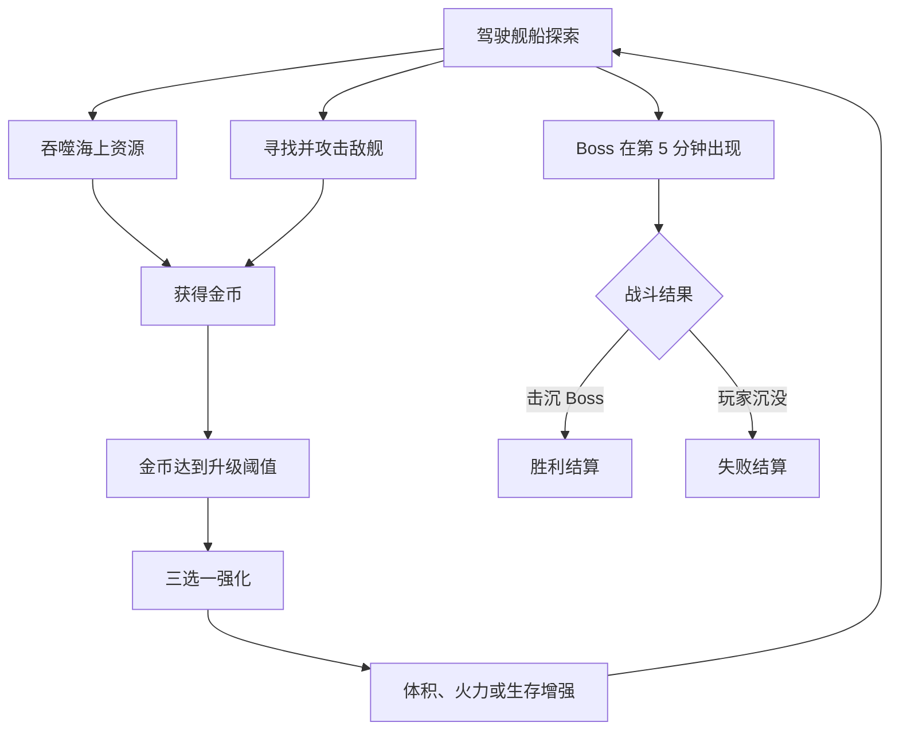
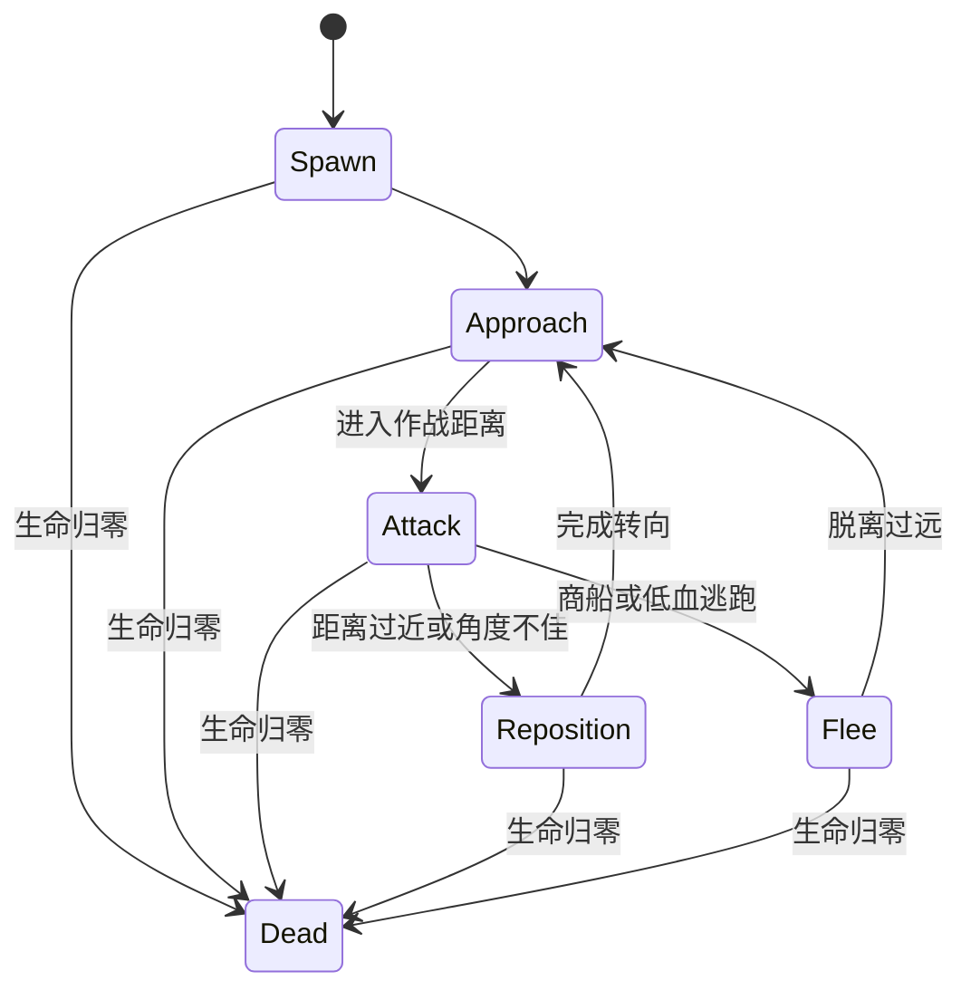

# 《吞吞舰船》最小可玩 Demo 实现文档

> 文档版本：V0.1  
> 目标引擎：Unity 3D（建议 Unity 2022 LTS 或 Unity 6）  
> Demo 平台：先做 PC 键鼠版，输入层预留手柄与移动端摇杆  
> 单局目标时长：5～8 分钟  
> 核心验证：驾驶一艘移动舰船，在海面吞噬资源、击败敌舰、获得金币、局内升级，并最终击败 Boss 舰。

---

## 1. 项目定位

### 1.1 一句话玩法

玩家驾驶一艘具有巨大吞噬口和侧舷武器的移动舰船，在开放海域中吞噬漂浮物与弱小单位、击沉敌舰、收集金币，并在单局内不断扩张舰体和强化武装。

### 1.2 参考玩法提炼

《Wanderburg》的核心体验可拆成五个部分：

1. 载具式移动：玩家控制的不是可以原地灵活转向的角色，而是一台有速度、转弯半径和朝向要求的载具。
2. 碾压/吞噬：低威胁目标既是资源，也是玩家主动移动的理由。
3. 自动战斗：武器承担持续攻击，玩家主要负责航线、距离和射击角度。
4. 局内成长：金币快速转化为新模块或强化，让舰船从弱小逐步变成大型战争机器。
5. 生态压迫：小目标可以吞，大目标要躲或打；玩家变强后，原本危险的目标会变成猎物。

舰船版不应只是把城堡模型换成船。它需要利用“船头、船尾、左舷、右舷”和惯性转向，形成自己的战斗节奏。

### 1.3 Demo 的核心体验目标

玩家在前 60 秒内必须完成以下体验：

- 学会加速、减速和转向。
- 吞噬至少 5 个海上资源。
- 看到金币增长。
- 触发第一次三选一升级。
- 用侧舷炮击沉第一艘敌舰。

玩家在一局结束前必须感受到：

- 舰船外观或体积至少发生 2 次明显变化。
- 武器火力明显增强。
- 原本需要躲避的小型敌舰，后期可以直接吞噬或撞毁。
- 最后有一个明确的 Boss 战和结算界面。

---

## 2. 最小可玩范围

## 2.1 本版必须实现

| 系统 | 最小内容 |
| --- | --- |
| 玩家舰船 | 1 艘基础舰船，生命、速度、转向、吞噬等级 |
| 驾驶 | W/S 控制前进与倒船，A/D 控制船舵转向 |
| 摄像机 | 俯视斜角跟随、速度前瞻、轻微平滑 |
| 海域 | 1 张固定海图，约 300m × 300m |
| 可吞噬物 | 浮木、鱼群、货箱、木筏，共 4 类 |
| 敌人 | 小海盗艇、炮艇、武装商船，共 3 类 |
| Boss | 1 艘重型装甲舰 |
| 战斗 | 左右侧舷自动索敌、自动开炮、炮弹伤害 |
| 掉落 | 吞噬和击杀均掉落金币，金币自动或近距离吸附 |
| 升级 | 金币达到阈值后出现三选一，至少 6 种升级 |
| 胜负 | 击沉 Boss 获胜；玩家生命归零失败 |
| UI | 生命、金币/升级进度、计时、Boss 血条、升级面板、结算 |
| 表现 | 吞噬反馈、受击闪烁、炮口火焰、命中特效、金币飞入 |

## 2.2 本版明确不做

- 不做真正的海浪流体和浮力模拟。
- 不做无限地图和复杂程序化岛屿。
- 不做舰船模块自由拼装编辑器。
- 不做局外科技树、装备背包和永久养成。
- 不做多人联机。
- 不做复杂阵营、任务、剧情和港口经营。
- 不做炮手、船员、舱室等模拟经营系统。
- 不做完整物理破碎；敌舰死亡先用动画、碎片与特效表现。

这些内容都可以后续扩展，但不应阻塞第一版玩法验证。

---

## 3. Demo 核心循环



### 3.1 决策关系

- 吞噬弱小目标：安全、稳定、金币少。
- 攻击敌舰：有风险、金币多、可能掉落治疗。
- 追求金币：需要进入资源密集或敌人密集区域。
- 保持船头对准资源：方便吞噬，但侧舷不一定有射击角度。
- 横向经过敌人：侧舷火力最强，但会暴露较大的受击面积。

这个矛盾是舰船版最重要的操作乐趣：船头负责吃，船侧负责打。

---

## 4. 玩家舰船控制

## 4.1 操作映射

| 输入 | 功能 |
| --- | --- |
| W | 加速前进 |
| S | 减速；低速后继续按可倒船 |
| A / D | 左转舵 / 右转舵 |
| Space | 主动技能，Demo 可先做短时加速 |
| Esc | 暂停 |

第一版不要加入鼠标瞄准。武器自动攻击，让玩家只关注开船和站位。

## 4.2 移动规则

采用“街机船舶”手感，而非真实航海模拟：

- 舰船不能横向平移。
- 转向必须结合当前前进速度。
- 中速时转向效率最高；完全静止时只能非常缓慢地原地调整。
- 高速转向会略微侧滑，但不能像汽车漂移一样夸张。
- 松开 W 后保留惯性并缓慢减速。
- 倒船最大速度约为前进速度的 30%。
- 撞到地图边缘或大型礁石时降低速度，不要立即完全停死。

### 推荐初始参数

| 参数 | 初始值 | 说明 |
| --- | ---: | --- |
| 最大前进速度 | 12 m/s | Demo 偏快，减少赶路时间 |
| 最大倒船速度 | 3.5 m/s | 仅用于脱困和修正位置 |
| 前进加速度 | 7 m/s² | 约 1.7 秒接近最高速 |
| 自然减速度 | 2.5 m/s² | 松开油门后仍有惯性 |
| 制动减速度 | 8 m/s² | 按 S 时快速减速 |
| 基础转向速度 | 55°/s | 会乘以速度系数 |
| 最低转向系数 | 0.2 | 静止时仍可缓慢摆头 |
| 最佳转向速度区间 | 35%～75% | 操控最舒服的速度段 |
| 侧滑保持 | 0.15 | 数值越低，横向速度消除越快 |
| 船体质量 | 10 | 只用于相对碰撞关系 |

### 推荐实现方式

使用 `Rigidbody`，但由脚本控制主要速度：

- 在 `FixedUpdate` 中计算目标前向速度。
- 将当前速度拆成前向分量与横向分量。
- 前向分量根据油门逐渐接近目标速度。
- 横向分量每帧衰减，保留少量船体侧滑感。
- 根据速度比例计算本帧偏航角并通过 `MoveRotation` 转向。
- 视觉船体可以在转向时做 2°～4° 的侧倾，碰撞体不跟随侧倾。

不要直接用 `transform.Translate` 硬推，否则碰撞、击退和移动反馈会不稳定。

### 速度与转向伪代码

```csharp
throttle = Input.GetAxisRaw("Vertical");
steer = Input.GetAxisRaw("Horizontal");

forwardSpeed = Dot(rb.velocity, transform.forward);
targetSpeed = throttle >= 0
    ? throttle * maxForwardSpeed
    : throttle * maxReverseSpeed;

forwardSpeed = MoveTowards(
    forwardSpeed,
    targetSpeed,
    GetAcceleration(throttle) * fixedDeltaTime
);

sideVelocity = Project(rb.velocity, transform.right) * sideSlipRetention;
rb.velocity = transform.forward * forwardSpeed + sideVelocity;

speedRatio = Clamp01(Abs(forwardSpeed) / maxForwardSpeed);
turnFactor = Lerp(minTurnFactor, 1, EvaluateTurnCurve(speedRatio));
turnDirection = Sign(forwardSpeed == 0 ? 1 : forwardSpeed);
yaw = steer * turnSpeed * turnFactor * turnDirection * fixedDeltaTime;
rb.MoveRotation(rb.rotation * Quaternion.Euler(0, yaw, 0));
```

## 4.3 摄像机

- 视角：俯视 50°～60°，略看向船头。
- 距离：18～24m，根据船体等级逐渐拉远。
- 跟随：位置平滑时间 0.15～0.25 秒。
- 前瞻：摄像机焦点向舰船前方偏移 3～6m，偏移量随速度增加。
- 战斗反馈：被重炮命中时轻微屏幕震动；普通命中不要每次震动。
- 升级时：暂停世界，镜头轻微拉近并旋转展示新增模块。

---

## 5. 吞噬系统

## 5.1 舰船吞什么

为了符合海上题材，第一版用以下目标替代庄稼和草地：

| 目标 | 行为 | 金币 | 威胁 |
| --- | --- | ---: | --- |
| 漂浮木料 | 固定漂浮，成片分布 | 1 | 无 |
| 鱼群 | 缓慢游动，靠近后逃跑 | 1 | 无 |
| 货箱 | 零散分布，可被吸入口 | 3 | 无 |
| 木筏/小渔船 | 看到玩家后逃跑 | 5 | 极低 |
| 已残血小型敌艇 | 血量低于吞噬线后可吞 | 8～12 | 中 |

其中鱼群和小船会逃跑，能制造追逐感；漂浮木料和货箱保证玩家不会因为操作不熟而断粮。

## 5.2 吞噬判定

玩家船头放置一个 `BowIntakeTrigger`：

- 形状使用 Box Collider 或扇形近似触发器。
- 只检测 `Consumable` 层。
- 目标进入后先判断 `target.RequiredDevourLevel <= player.DevourLevel`。
- 可直接吞噬的目标进入 0.15～0.25 秒吸入动画。
- 不可吞噬目标显示红色反馈和短促碰撞音，不销毁。
- 大型单位不能因碰撞立即死亡，必须通过战斗降低生命。

### 吸入表现

1. 目标禁用自身 AI 与碰撞。
2. 沿曲线快速飞向船头入口。
3. 目标缩小到 0。
4. 播放“吞入”粒子和音效。
5. 生成金币数字与金币飞入 UI 表现。
6. 回收到对象池。

吞噬动画期间就锁定奖励，避免目标重复进入触发器造成重复结算。

## 5.3 吞噬等级

| 玩家吞噬等级 | 可吞噬目标 |
| ---: | --- |
| 1 | 浮木、鱼群、货箱、木筏 |
| 2 | 残血小海盗艇、完整木筏 |
| 3 | 残血炮艇、小型防御塔碎片 |

Demo 中吞噬等级由“扩建舰体”升级获得。吞噬等级变化必须同时改变船体比例或加装船首吞噬结构，否则纯数值成长不够直观。

---

## 6. 战斗系统

## 6.1 战斗原则

- 玩家不需要逐个瞄准。
- 武器自动寻找攻击范围和射界内的敌人。
- 舰船朝向决定哪些武器能射击。
- 左右侧舷各有独立冷却和目标。
- 玩家通过绕行，让敌人进入侧舷射界。

## 6.2 侧舷炮基础规则

每一侧设置一个 `WeaponGroup`：

- 左舷射界：船体左侧 100° 扇形。
- 右舷射界：船体右侧 100° 扇形。
- 射程：18m。
- 开火间隔：1.2 秒。
- 每轮炮击：同侧 2 门炮依次间隔 0.08 秒发射。
- 优先目标：最近的敌舰；Boss 出现后仍以最近目标为默认。
- 目标离开射界后立刻停止锁定。

### 索敌实现

不要让每一门炮都独立执行全场 `FindObjectsOfType`：

1. 玩家周围用一个范围触发器维护 `NearbyEnemies` 列表。
2. 左右 `WeaponGroup` 分别遍历该列表。
3. 通过距离、方向点积和夹角判断目标是否在射界内。
4. 每 0.1～0.2 秒重新选一次目标，不必每帧选敌。
5. 炮口只负责朝向目标和发射。

## 6.3 炮弹

- 使用对象池。
- 基础速度：25m/s。
- 存活时间：2 秒。
- 基础伤害：10。
- 命中后播放小型水花/火花并回收。
- 第一版可以使用直线炮弹，不做弹道预判。
- 后续再加入抛物线、穿透、爆炸范围和元素弹药。

## 6.4 玩家生命与受击

| 属性 | 初始值 |
| --- | ---: |
| 最大生命 | 100 |
| 受击无敌 | 0 秒；依赖炮弹碰撞频率控制 |
| 碰撞伤害 | 按双方体型和相对速度计算，上限 15 |
| 击杀治疗掉落率 | 20% |
| 沉船判定 | 生命 ≤ 0 |

受击必须至少提供三种反馈：

- 船体材质快速闪白或闪红。
- 显示伤害数字。
- 播放命中音和小型碎片。

生命低于 30% 时增加持续黑烟，但不要降低移动速度，避免形成无法翻盘的负反馈。

---

## 7. 敌人设计

## 7.1 小海盗艇

用途：第一只教学敌人。

- 生命：25
- 速度：9m/s
- 攻击：靠近后从侧面发射单炮，伤害 5
- AI：接近玩家至 12m，横向经过并远离，再次掉头
- 金币：8
- 特点：容易击杀，生命低于 25% 时进入可吞噬状态

## 7.2 炮艇

用途：让玩家学习绕开正面火力。

- 生命：60
- 速度：7m/s
- 攻击：正前方双炮，伤害 8
- AI：船头朝向玩家，在 14～18m 之间保持距离
- 金币：15
- 特点：正面危险，玩家应从侧面切入

## 7.3 武装商船

用途：高价值追逐目标。

- 生命：80
- 速度：10m/s
- 攻击：船尾投放水雷，伤害 12
- AI：优先远离玩家，低频转向，沿途投雷
- 金币：25
- 特点：需要追赶；吞噬和追击玩法结合

## 7.4 Boss：重型装甲舰

- 出现时间：第 5 分钟
- 生命：600
- 速度：5.5m/s
- 第一阶段：左右侧舷齐射，每 2 秒一轮
- 第二阶段：生命低于 50% 后增加船头冲撞与扇形炮击
- 金币：Boss 不需要掉金币，死亡直接胜利
- 场地：Boss 出现后关闭普通敌人生成，只保留少量资源供玩家恢复节奏

Boss 的目的不是复杂招式，而是检验玩家是否掌握：

- 与敌人保持距离。
- 绕到合适侧舷角度输出。
- 避开敌舰船头和明显攻击范围。

## 7.5 敌人 AI 状态机



第一版 AI 不使用 NavMesh：海面基本没有复杂障碍，采用目标方向转向和简单射线避障即可。

---

## 8. 金币与升级

## 8.1 金币规则

- 吞噬目标：金币直接计入，但表现上播放金币飞入。
- 击沉敌舰：在死亡点散落 3～6 枚金币。
- 金币进入玩家 6m 范围后自动吸附。
- 金币吸附速度逐渐加快，避免玩家回头捡拾过久。
- 金币既是本局货币，也是升级进度，不单独再做经验值。

## 8.2 升级阈值

| 升级次数 | 需要新增金币 | 累计金币 |
| ---: | ---: | ---: |
| 1 | 20 | 20 |
| 2 | 35 | 55 |
| 3 | 50 | 105 |
| 4 | 70 | 175 |
| 5 | 90 | 265 |
| 6 | 120 | 385 |

达到阈值时暂停时间，弹出三选一。选择后扣除本次升级进度，但总获得金币可继续用于结算统计。

## 8.3 Demo 升级池

| 升级 | 效果 | 可重复 | 外观反馈 |
| --- | --- | --- | --- |
| 扩建舰体 | 最大生命 +25，吞噬等级每 2 次 +1，体积 +8% | 3 | 船体加长或增加甲板 |
| 加装侧舷炮 | 左右侧各增加 1 门炮 | 3 | 新炮模型出现 |
| 火药改良 | 炮弹伤害 +25% | 4 | 炮口火焰更强 |
| 快速装填 | 开火间隔 -15% | 4 | 炮组装填特效 |
| 强化引擎 | 最大速度 +12%，加速度 +10% | 3 | 船尾增加烟迹/水花 |
| 磁力打捞 | 金币吸附范围 +50%，吞噬范围 +15% | 2 | 船头出现吸入气流 |
| 装甲修补 | 立即恢复 35 生命，最大生命 +10 | 3 | 修复亮光 |
| 火药桶 | 主动技能：向船尾丢下爆炸桶 | 1 | 新技能图标 |

最小版可以只实现前 6 个。三选一时：

- 从仍可升级的项目中随机抽取。
- 同一组不能出现重复项。
- 玩家满血时可以出现“装甲修补”，因为它仍提高最大生命。
- 如果候选不足 3 个，允许出现“立即获得 20 金币”作为保底。

## 8.4 舰体成长表现

不要在 Demo 阶段实现自由拼装。使用 3 个预制外观等级：

- 舰体 Lv.1：小型吞噬船，左右各 2 门炮。
- 舰体 Lv.2：船体变长，增加一层甲板和更大的船首入口。
- 舰体 Lv.3：重型母舰，船尾与侧面出现额外装甲。

升级时切换或激活对应模块，保持所有武器挂点、入口和碰撞体位置可配置。

---

## 9. 关卡与节奏

## 9.1 地图结构

第一版使用固定圆形海域：

- 可玩半径约 150m。
- 外圈使用雾墙、风暴或深海暗区作为软边界。
- 放置 6 个资源区和 4 个敌人出生区。
- 中央相对安全，外围资源与敌人密度更高。
- 放置少量大型礁石提供绕行，但不能形成狭窄迷宫。

## 9.2 单局时间线

| 时间 | 内容 | 设计目的 |
| --- | --- | --- |
| 0:00～0:30 | 资源密集、无主动攻击敌人 | 熟悉驾驶和吞噬 |
| 0:30～1:30 | 出现小海盗艇 | 教会侧舷自动攻击 |
| 1:30～3:00 | 增加炮艇，资源仍充足 | 建立打与吃的循环 |
| 3:00～4:30 | 武装商船、敌人数量增加 | 追逐、走位和成长验证 |
| 4:30～5:00 | 屏幕提示海面震动，停止刷强敌 | 给玩家整理状态 |
| 5:00 | Boss 出现 | 最终检验 |
| 5:00～8:00 | Boss 战 | 击杀胜利；超过 8 分钟可让 Boss 狂暴 |

## 9.3 生成规则

- 所有单位出生在摄像机外 25～40m。
- 不要直接出生在玩家正前方 10m 内。
- 同屏普通敌舰上限 8 艘。
- 同屏可吞噬资源建议 40～70 个。
- 每 5 秒检查一次资源密度，低于阈值才补充。
- 使用对象池生成资源、敌人、炮弹、金币和命中特效。

---

## 10. UI 与信息反馈

## 10.1 战斗 HUD

- 左上：玩家生命条，显示当前值/最大值。
- 顶部中央：本局计时。
- 屏幕下方：金币升级进度条，显示距离下一次升级还差多少。
- 右下：主动技能图标与冷却。
- Boss 出现后：顶部显示 Boss 名称和长血条。
- 屏幕边缘：Boss 或高威胁敌人在画面外时显示方向提示。

## 10.2 升级面板

- 世界暂停，保留水面和船体轻微动画。
- 中间横向排列 3 张升级卡。
- 每张卡显示图标、名称、当前等级、简短效果、升级后的变化值。
- 鼠标点击选择；键盘可用 1/2/3。
- 选中后先播放卡片飞向舰船，再关闭面板。

## 10.3 必须明确的反馈

| 事件 | 反馈 |
| --- | --- |
| 可吞噬目标靠近船头 | 目标出现淡色轮廓或被吸引 |
| 目标等级过高 | 红色碰撞反馈和“无法吞噬”短提示 |
| 金币达到升级值 | 音效、进度条发光、升级面板弹出 |
| 武器进入射界 | 炮口转向并出现短暂瞄准线，可选 |
| 玩家低血 | 黑烟、生命条闪烁、低频警报 |
| Boss 出现 | 镜头拉远、名称条、方向提示 |

---

## 11. Unity 工程结构

```text
Assets/
├── Art/
│   ├── Models/
│   ├── Materials/
│   ├── VFX/
│   └── UI/
├── Audio/
├── Prefabs/
│   ├── Player/
│   ├── Enemies/
│   ├── Consumables/
│   ├── Projectiles/
│   ├── Pickups/
│   └── UI/
├── Scenes/
│   ├── Boot.unity
│   └── Demo_Ocean.unity
├── Scripts/
│   ├── Core/
│   ├── Player/
│   ├── Combat/
│   ├── AI/
│   ├── Progression/
│   ├── Spawning/
│   ├── UI/
│   └── Utilities/
└── ScriptableObjects/
    ├── Ships/
    ├── Weapons/
    ├── Enemies/
    └── Upgrades/
```

## 11.1 场景层级

```text
Demo_Ocean
├── GameManager
├── GameSystems
│   ├── InputManager
│   ├── SpawnDirector
│   ├── UpgradeManager
│   ├── PoolManager
│   └── AudioManager
├── Environment
│   ├── Ocean
│   ├── Boundary
│   ├── Reefs
│   └── SpawnPoints
├── PlayerShip
├── RuntimeObjects
│   ├── Enemies
│   ├── Consumables
│   ├── Projectiles
│   ├── Pickups
│   └── VFX
├── MainCamera
└── Canvas
    ├── HUD
    ├── UpgradePanel
    ├── PausePanel
    └── ResultPanel
```

## 11.2 玩家 Prefab 层级

```text
PlayerShip
├── VisualRoot
│   ├── Hull_Level1
│   ├── Hull_Level2
│   ├── Hull_Level3
│   ├── LeftCannons
│   └── RightCannons
├── Colliders
│   ├── BodyCollider
│   └── BowIntakeTrigger
├── Sensors
│   ├── EnemySensor
│   └── PickupSensor
├── WeaponRoots
│   ├── LeftWeaponGroup
│   └── RightWeaponGroup
├── VFX
│   ├── WakeVFX
│   ├── DamageSmoke
│   └── DevourVFX
└── Audio
```

## 11.3 主要脚本职责

| 脚本 | 职责 |
| --- | --- |
| `GameManager` | 控制准备、游玩、升级暂停、胜利、失败状态 |
| `ShipMotor` | 油门、惯性、转向、侧滑和速度限制 |
| `ShipHealth` | 受伤、治疗、死亡与事件通知 |
| `DevourController` | 吞噬判定、吸入流程和奖励 |
| `EnemySensor` | 维护附近敌人列表 |
| `WeaponGroup` | 射界检测、选敌、冷却与开火 |
| `Cannon` | 炮口旋转和炮弹生成 |
| `Projectile` | 移动、碰撞、伤害与回收 |
| `EnemyShipAI` | 敌舰状态机和驾驶指令 |
| `Consumable` | 吞噬等级、金币值和被吸入状态 |
| `CurrencyManager` | 金币总量与本级升级进度 |
| `UpgradeManager` | 抽取三选一、应用效果和等级上限 |
| `SpawnDirector` | 根据时间控制资源、敌人和 Boss |
| `CameraFollow` | 平滑跟随、速度前瞻、缩放和震动 |
| `PoolManager` | 炮弹、金币、资源、敌人与 VFX 对象池 |

## 11.4 推荐接口

```csharp
public interface IDamageable
{
    bool IsAlive { get; }
    void TakeDamage(DamageData damage);
}

public interface IConsumable
{
    int RequiredDevourLevel { get; }
    int CoinReward { get; }
    bool CanBeConsumed { get; }
    void BeginConsume(Transform intake, Action onComplete);
}

public interface IPoolable
{
    void OnSpawned();
    void OnDespawned();
}
```

数据通过 `ScriptableObject` 配置，避免把敌人生命、速度、金币和武器伤害散落在脚本中。

---

## 12. 游戏状态

| 状态 | 时间缩放 | 玩家输入 | 敌人行为 |
| --- | ---: | --- | --- |
| Ready | 0 | 禁止 | 禁止 |
| Playing | 1 | 开启 | 开启 |
| UpgradeSelection | 0 | 只允许选择升级 | 暂停 |
| Paused | 0 | 只允许菜单 | 暂停 |
| Victory | 0.2 后归 0 | 禁止驾驶 | 停止 |
| Defeat | 0.2 后归 0 | 禁止驾驶 | 停止 |

升级界面使用非缩放时间播放 UI 动画。炮弹、吸入动画和金币飞入在进入升级状态前完成结算，防止暂停时出现一半状态。

---

## 13. 分阶段实现顺序

## 阶段 1：灰盒驾驶（0.5～1 天）

- 创建海面、玩家方块船和跟随摄像机。
- 完成 W/S/A/D 船舶移动。
- 调整最大速度、转弯半径、惯性和碰撞。
- 添加地图软边界。

验收：只开船 3 分钟也不会频繁失控、卡墙或镜头眩晕。

## 阶段 2：吞噬与金币（1 天）

- 制作 2 种灰盒可吞噬物。
- 添加船头触发区和吸入动画。
- 添加金币数值、金币飞入和升级进度条。
- 加入对象池。

验收：连续吞 50 个目标不会重复结算、漏结算或明显掉帧。

## 阶段 3：侧舷战斗（1～1.5 天）

- 实现附近敌人列表。
- 完成左右射界判断、自动索敌和炮弹。
- 加入敌人生命、伤害和死亡掉落。
- 制作第一种简单追逐敌舰。

验收：玩家必须改变航向才能让左右炮攻击，侧舷站位清晰可理解。

## 阶段 4：升级成长（1 天）

- 建立 6 个升级数据。
- 制作三选一界面。
- 应用伤害、射速、舰体、移速和吸附升级。
- 激活舰体外观等级。

验收：一局内至少触发 5 次升级，且前后战斗效率差异明显。

## 阶段 5：敌人与 Boss（1～2 天）

- 加入炮艇和武装商船。
- 完成按时间刷怪。
- 制作 Boss 两阶段行为。
- 加入胜负与结算。

验收：完整一局 5～8 分钟，有明确开局、成长、高潮和结束。

## 阶段 6：反馈与调参（1～2 天）

- 补充水花、炮口、命中、吞噬、沉船和升级表现。
- 增加音效、屏幕震动和低血反馈。
- 调整金币供给、敌人生命、刷怪量和 Boss 难度。
- 使用 Profiler 检查 CPU、GC 和同屏对象数量。

---

## 14. 最小数据表

### 14.1 `ShipConfig`

| 字段 | 类型 |
| --- | --- |
| Id | string |
| MaxHealth | float |
| MaxForwardSpeed | float |
| MaxReverseSpeed | float |
| Acceleration | float |
| BrakeAcceleration | float |
| TurnSpeed | float |
| SideSlipRetention | float |
| DevourLevel | int |
| DevourRadius | float |
| CoinAttractRadius | float |

### 14.2 `EnemyConfig`

| 字段 | 类型 |
| --- | --- |
| Id | string |
| MaxHealth | float |
| MoveSpeed | float |
| TurnSpeed | float |
| PreferredRange | float |
| ContactDamage | float |
| CoinReward | int |
| RequiredDevourLevel | int |
| AIProfile | enum |

### 14.3 `WeaponConfig`

| 字段 | 类型 |
| --- | --- |
| Id | string |
| Damage | float |
| Cooldown | float |
| Range | float |
| FireArc | float |
| ProjectileSpeed | float |
| ProjectilesPerVolley | int |
| MuzzleInterval | float |

### 14.4 `UpgradeConfig`

| 字段 | 类型 |
| --- | --- |
| Id | string |
| DisplayName | string |
| Description | string |
| Icon | Sprite |
| MaxLevel | int |
| Weight | int |
| UpgradeType | enum |
| ValuePerLevel | float |

---

## 15. 性能底线

即使是灰盒 Demo，也从一开始遵守以下规则：

- 炮弹、金币、敌舰、资源和粒子全部使用对象池。
- 不在 `Update` 中调用 `FindObjectsOfType`、`GameObject.Find` 或频繁 `GetComponent`。
- 索敌每 0.1～0.2 秒执行一次，而非每帧执行。
- 远处敌人降低 AI 更新频率。
- 海面先使用单平面材质和简单 UV 动画，不使用昂贵实时海浪。
- 目标数量通过 `SpawnDirector` 设硬上限。
- 伤害数字使用对象池，且同一目标短时间受到大量小伤害时可合并显示。

建议 Demo 性能目标：1080p 下稳定 60 FPS；同屏 8 艘敌舰、70 个资源物、80 发炮弹时无明显卡顿。

---

## 16. 调试工具

建议第一版就提供一个简单开发者面板：

- 增加 100 金币。
- 玩家无敌开关。
- 立即触发升级。
- 立即生成 Boss。
- 清除全部敌人。
- 显示左右舷射界。
- 显示吞噬触发区。
- 显示敌人当前 AI 状态。
- 修改游戏时间倍率。

这些功能能大幅减少升级、Boss 和后半局内容的重复测试时间。

---

## 17. Demo 验收清单

### 驾驶

- [ ] 舰船不能横向自由移动。
- [ ] 中速转向明显比静止转向灵活。
- [ ] 松开油门后有惯性，但不会滑行过久。
- [ ] 倒船方向与真实车辆逻辑一致。
- [ ] 撞击礁石后能脱困，不会永久卡住。

### 吞噬

- [ ] 可吞噬物只结算一次。
- [ ] 不可吞噬目标有明确反馈。
- [ ] 吞噬动画不影响玩家继续开船。
- [ ] 金币数值和 UI 表现一致。
- [ ] 体型成长后能吞噬新的目标类型。

### 战斗

- [ ] 敌人在左舷时只由左舷炮组攻击。
- [ ] 敌人离开射界后停止攻击。
- [ ] 炮弹不会伤害发射者。
- [ ] 击杀、金币掉落和对象回收只执行一次。
- [ ] 玩家能通过走位避开敌人的主要攻击。

### 成长

- [ ] 每次升级稳定出现 3 个有效选项。
- [ ] 已满级升级不会继续出现。
- [ ] 升级时游戏暂停，UI 动画仍正常。
- [ ] 武器数量、舰体大小或特效能体现成长。
- [ ] 5 分钟内正常玩家可完成约 5 次升级。

### 流程

- [ ] 开局 30 秒内获得第一批金币。
- [ ] 60 秒内触发第一次升级。
- [ ] 5 分钟时 Boss 正确生成。
- [ ] Boss 死亡进入胜利结算。
- [ ] 玩家死亡进入失败结算。
- [ ] 可从结算界面重新开始一局且不残留旧数据。

---

## 18. 最优先验证的三个问题

完成 Demo 后，不要先根据“内容多不多”评价，而要回答以下问题：

1. 船头吞噬、船侧开炮的方向冲突是否有趣？  
   如果有趣，它就是《吞吞舰船》区别于普通幸存者游戏的核心。

2. 舰船操作是否既有重量感，又不会因为转弯太慢而烦躁？  
   如果玩家经常错过资源或无法重新对准敌人，优先优化操控，不要急着增加武器。

3. 每次升级是否让舰船“看起来和打起来都更大”？  
   如果只有数值上涨而外观没变化，吞噬成长的满足感会明显不足。

---

## 19. Demo 完成后的扩展顺序

只有在上述核心验证成立后，再按以下顺序扩展：

1. 增加不同船首吞噬器、侧舷炮、舰尾陷阱等模块。
2. 从固定舰体等级升级为插槽式模块搭建。
3. 增加冰海、群岛、风暴海、腐化海等区域。
4. 增加体型生态：小船逃离玩家，大船主动猎杀玩家。
5. 增加舰长、神器和局外解锁，扩展 Roguelite 重玩性。
6. 增加事件船、商船、港口和风险交易。
7. 最后再评估移动端控制、手柄震动与平台适配。

第一版最重要的不是模块数量，而是先让“开船去吃、横船去打、变大后反过来猎杀强敌”这一分钟循环成立。

---

## 20. 参考资料说明

本方案对参考游戏的提炼基于其公开商店介绍与公开试玩信息：移动要塞会吞噬村庄、牲畜和较小要塞，通过战斗与资源获得成长，并逐步安装模块化武器；舰船版在此基础上重新设计为船首吞噬与左右侧舷射击的空间关系。实现时应继续保持自己的题材、美术、数值、敌人、升级和关卡设计，避免直接复刻对方具体素材与表现。
