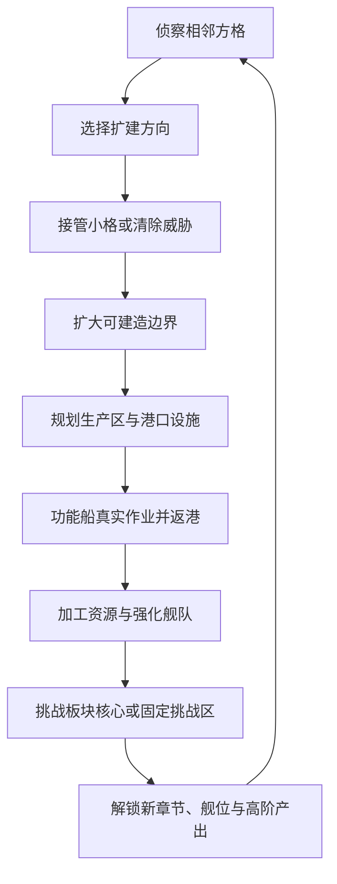
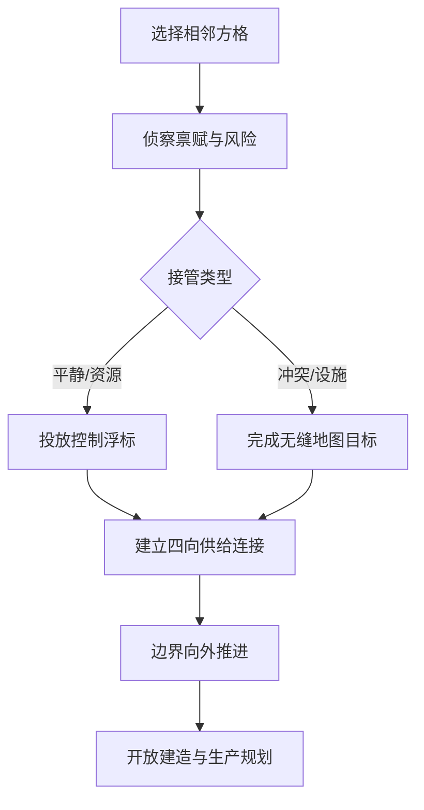
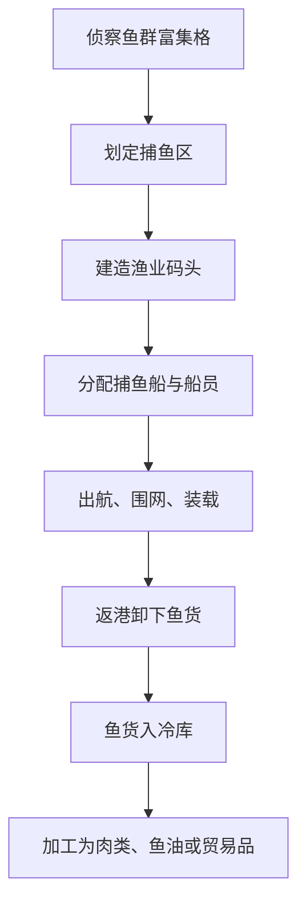

# 《吞吞舰船》方形小海域扩建、生产区、固定挑战与成长流程重构完整设计文档

> 文档类型：海盗生涯模式增量重构文档  
> 适用范围：无缝世界、领土扩建、港口建造、资源生产、功能船、固定挑战、成长解锁、地图与建造 UI  
> 核心目标：让领土扩建与方形建造网格完全对齐，并用更多、更小的区域持续提供空间、资源、事件、挑战与成长目标

---

## 0. 本文与旧文档的关系

本文不修改旧文件，但在发生冲突时拥有更高优先级。

### 0.1 被本文正式替换的规则

以下旧规则废止：

1. 六边形海域坐标、六方向邻接与六边形边框。
2. 用一块大型六边形同时承担领土、建造容量、资源加成和核心挑战。
3. 每首次占领一块大海域就解锁一个主舰席位。
4. 六边形边界与方形建造格并存的跨边界判定。
5. 以“第几圈六边形”作为全部难度和解锁条件。
6. 每块海域手动选择“渔业区、工业区、居住区”等单一职能并直接获得固定产量加成。
7. 所有主动副本只以临时按钮或随机事件出现。
8. 鱼群、木材、矿物等资源只作为地图事件或装饰，不能形成大型可规划生产区域。

### 0.2 继续保留的核心规则

以下规则继续有效：

- 世界、港口、航行、战斗和生产处于同一张无缝地图。
- 地图缩放只改变显示层级，不切换成二级战斗场景。
- 主舰切换只切换镜头、输入对象和 HUD，不传送舰船。
- 功能船需要真实出航、作业、装载、返港和卸货。
- 一艘主舰由1名船长与4名作战英雄组成。
- 最多拥有6个主舰编制席位。
- 装备主要来自长期刷取，装备不进入抽奖池。
- 英雄与主舰的收藏和重复进阶规则继续沿用商业化文档。
- 固定挑战、世界事件和特殊玩法不能被付费商城替代。
- 建造、升级、生产、战斗和关键事件继续使用已有的气泡、表情、镜头和视效导演系统。

### 0.3 新旧名词迁移

| 旧名词 | 新名词 | 说明 |
| --- | --- | --- |
| 六边形海域 | 领海方格 | 最小领土单位 |
| 海域圈层 | 区域板块与航海章节 | 不再使用六边形距离圈 |
| 海域核心 | 板块控制核心 | 可被击败并接管 |
| 海域职能 | 资源禀赋 + 生产区 | 不再手动一键指定整格职能 |
| 暴露边 | 边境线段 | 方格四边形成的连续外轮廓 |
| 海域开发等级 | 板块开发度 | 由多个小格与设施共同构成 |
| 随机副本 | 漂移事件 | 仍会移动或周期出现 |
| 固定副本 | 固定挑战区 | 永久存在、不能占领、可选难度 |

---

## 1. 当前问题与重构目标

### 1.1 六边形领土与方形建造天然冲突

当前建造逻辑以方形格为基础，但领土以六边形划分，容易产生：

- 建筑预览跨越六边形斜边时出现细碎不可用区域。
- 玩家看到区域属于自己，却无法完整放下矩形建筑。
- 边缘地基、道路、水道和防御墙难以对齐。
- 程序需要同时处理六边形邻接和方形建筑占用。
- 美术边界无法自然融入方形港口布局。
- 自动寻路、供给、炮塔射界和边境出生点使用不同空间规则。

### 1.2 大型区域导致扩建反馈过慢

旧海域单格过大，一次占领会突然获得大量空间，随后很长时间没有新的扩张反馈。

新版需要做到：

- 玩家频繁看到边界向外推进。
- 每次扩建都能解决一个眼前问题。
- 小格价值可以是空间、资源、航道、防御或事件，不必每格都打大型 Boss。
- 大量小格组合后仍能形成有主题的大区域。
- 领土形状会影响边境、防守、物流和生产，但不鼓励极端蛇形扩张。

### 1.3 生产玩法缺少“占空间的选择”

旧版生产主要依靠建筑列表和功能船自动采集，玩家缺少以下判断：

- 哪片海面值得划为渔场。
- 是先扩建高产鱼区，还是先抢矿区。
- 大型生产区会占掉多少未来建造空间。
- 如何让加工、仓储、码头和作业区形成完整链路。
- 怎样根据海流、鱼群、矿脉和沉船密度调整布局。

### 1.4 随机挑战缺少长期世界锚点

如果所有副本都随机出现：

- 玩家无法形成“我要去那里刷某件装备”的空间记忆。
- 产出追踪只能跳到菜单，无法指向真实世界位置。
- 高难挑战缺少地标感和长期目标。
- 世界地图看起来只有可占领格，没有不可征服的危险或神秘区域。

### 1.5 新版一句话体验

> 玩家从一座小型海上港口出发，以方形小领海不断向外扩建；根据每格的鱼群、漂木、矿脉、沉船和宝藏禀赋规划大型生产区，派遣功能船真实作业，同时在不可占领的固定挑战区选择不同难度反复挑战，逐步解锁六艘主舰、更多英雄、装备、建筑和海洋主题内容。

---

## 2. 新版核心循环



### 2.1 四个不同时间尺度

| 时间尺度 | 玩家目标 | 反馈 |
| --- | --- | --- |
| 1～3分钟 | 完成一次小格侦察、接管或生产调度 | 边界推进、资源入库、事件反应 |
| 10～20分钟 | 完成一条局部生产链或拿下一个关键位置 | 新建筑、新生产区、新战术空间 |
| 30～90分钟 | 控制一个区域板块、挑战一次固定地标 | 新主舰席位、主题玩法、高阶产出 |
| 多日与长期 | 完成章节地图、构筑六舰队、刷目标装备 | 新阵容、新套装、终局难度与赛季目标 |

### 2.2 每次扩建必须至少提供一种明确价值

小格不允许只有“面积+1”。

每格至少包含以下一项：

- 适合摆放大型建筑的开阔水面。
- 高鱼群禀赋。
- 高漂木或海上林木禀赋。
- 高矿脉禀赋。
- 高沉船与宝藏禀赋。
- 航线交汇点。
- 防守咽喉。
- 稀有生态。
- 板块核心外围。
- 固定挑战区通道。
- 剧情与角色事件。
- 能源、盐、油、珊瑚或药用藻类等特殊资源。

---

## 3. 方形世界网格结构

## 3.1 三层方形网格

为同时满足领土、生产区和建筑精度，世界使用三层严格对齐的方形网格。

| 层级 | 推荐尺寸 | 用途 |
| --- | ---: | --- |
| 领海方格 | 48米 × 48米 | 占领、边境、资源禀赋、板块归属 |
| 生产区格 | 12米 × 12米 | 渔场、矿场、漂木区、挖宝区等大型水面区域 |
| 建筑基础格 | 2米 × 2米 | 地基、建筑、道路、管线、防御和装饰 |

换算关系：

```text
1个领海方格 = 4 × 4个生产区格
1个生产区格 = 6 × 6个建筑基础格
1个领海方格 = 24 × 24个建筑基础格
```

优势：

- 所有边界都是直线，没有三角形碎片。
- 生产区可以跨越多个领海方格，并准确计算每格加成。
- 普通建筑可以跨越己方方格边界连续摆放。
- 领土、建造、供给、边境和存档坐标可以互相整数换算。

## 3.2 领海方格坐标

统一使用：

```text
SquareCoord(x, y)
```

四方向相邻：

```text
东：(x + 1, y)
西：(x - 1, y)
北：(x, y + 1)
南：(x, y - 1)
```

四个斜角格只用于：

- 视野传播。
- 远景对象聚合。
- 部分范围事件。
- 鱼群与天气迁移。
- 炮塔射程和战斗单位移动。

斜角接触不用于：

- 领土接管。
- 建造权限连接。
- 供给网络连接。
- 主港连续领土判定。
- 边境封闭判断。

## 3.3 初始领土

玩家开局拥有中心3×3领海方格，共9格。

其中：

- 中心格放置港口核心。
- 2格为基础建造水面。
- 1格拥有明显鱼群加成。
- 1格拥有基础漂木加成。
- 其余格作为航道、防守和后续布局空间。
- 开局不要求把9格全部铺满地基。

3×3起始领土的优点：

- 能完成前20～30分钟的核心教学。
- 边界规则清晰。
- 港口不会开局就被压缩成一条直线。
- 玩家向四个方向扩张都有空间。

## 3.4 世界规模

首发建议：

| 参数 | 数值 |
| --- | ---: |
| 完整世界 | 35 × 35领海方格 |
| 总方格数 | 1225 |
| 区域板块 | 7 × 7个 |
| 每个板块 | 5 × 5领海方格 |
| 首阶段开放 | 中心3 × 3板块 |
| 首阶段理论范围 | 15 × 15领海方格 |
| 开局已占领 | 中心3 × 3领海方格 |

说明：

- 1225格不是要求全部能占领。
- 固定挑战区、深渊、礁岛、永久航道和世界边界会占用部分格。
- 首发制作可只完成15×15核心区域，外围以迷雾和航海章节锁定。
- 后续版本可新增新的35×35地图群，而不是无限向旧地图外生成。

## 3.5 区域板块

每5×5领海方格组成一个区域板块。

板块用于承载：

- 主题美术。
- 基础难度。
- 板块控制核心。
- 区域故事。
- 主要资源倾向。
- 固定挑战地标。
- 主舰席位里程碑。
- 板块开发度。

小格负责高频扩张，板块负责阶段性目标。

### 3.5.1 板块不等于旧大海域

板块不是一个整体建造格，也不会一次性全部占领。

玩家需要：

1. 从相邻边进入板块。
2. 逐步接管若干小格。
3. 侦察并削弱板块控制力。
4. 击败板块控制核心。
5. 继续接管剩余资源格和战略格。
6. 提升板块开发度。

## 3.6 水面空间的四种逻辑层

同一位置可以同时参与不同系统，但必须遵守层级。

| 层 | 内容 | 是否阻挡航行 |
| --- | --- | --- |
| 领土层 | 已占领、可扩建、固定挑战、禁建 | 否 |
| 固体建造层 | 地基、建筑、码头、炮塔、挡板 | 是或按碰撞体决定 |
| 水面生产层 | 渔场、矿区、漂木区、挖宝区 | 否 |
| 航行与战斗层 | 舰船、鱼群、敌人、投射物 | 动态 |

关键规则：

- 水面生产区会占用建造规划空间。
- 普通建筑不能直接放在生产区保留范围内。
- 生产区本身没有实体墙，不影响主舰与功能船航行。
- 自动航行可以为了视觉自然略微偏离密集浮标，但不能因生产区判定“无路”。
- 生产区边缘的实体码头、采矿平台和装卸建筑会正常参与碰撞。

---

## 4. 领海方格类型与状态

## 4.1 方格主类型

| 类型 | 能否占领 | 能否建造 | 说明 |
| --- | --- | --- | --- |
| 普通开阔海 | 是 | 是 | 基础扩建空间 |
| 资源富集海 | 是 | 是 | 具有一种或多种高禀赋 |
| 航道格 | 是 | 有限制 | 建筑需保留主航道 |
| 浅礁格 | 是 | 有限制 | 适合采集、防守，不适合大型主舰 |
| 深水格 | 是 | 有限制 | 适合深海渔业、海底采矿 |
| 岛礁格 | 部分 | 部分 | 固体岛礁占据部分建造空间 |
| 板块核心格 | 击败后可占领 | 击败后开放 | 阶段战斗与板块接管 |
| 固定挑战格 | 否 | 否 | 永久世界地标，可选难度 |
| 永久禁航格 | 否 | 否 | 深渊中心、世界边界、剧情禁区 |
| 中立保护格 | 否或条件占领 | 否或有限 | 商城、聚落、生态保护区 |

## 4.2 方格主状态

| 状态 | 玩家可见信息 | 可执行操作 |
| --- | --- | --- |
| 未知 | 仅迷雾 | 不可选 |
| 已发现 | 轮廓、主类型 | 查看简略信息 |
| 已侦察 | 禀赋、威胁、事件 | 规划、追踪 |
| 可接管 | 成本、接管方式 | 建立信标或发起战斗 |
| 接管中 | 进度、敌方反应 | 保护信标、继续行动 |
| 已占领 | 全部数据 | 建造、生产、驻防 |
| 受压制 | 建造保留，部分功能停用 | 防守、修复 |
| 固定中立 | 挑战或交互信息 | 选择挑战、交易、剧情 |
| 永久封锁 | 解锁条件 | 暂不可进入 |

## 4.3 次级状态

可叠加：

- 鱼群迁入。
- 漂木聚集。
- 矿脉活跃。
- 沉船浮现。
- 宝藏热点。
- 雷暴。
- 浓雾。
- 赤潮污染。
- 海盗巡逻。
- 商路经过。
- 功能船作业中。
- 生产区停工。
- 敌人正在侦察。
- 主舰驻防。
- 固定挑战开放奖励周期。

---

## 5. 小格扩建与接管规则

## 5.1 可接管条件

普通领海方格需要同时满足：

1. 与至少一块己方方格共享完整边。
2. 已被侦察。
3. 不属于固定挑战或永久禁区。
4. 与港口核心存在四方向连续供给路径。
5. 玩家拥有足够的扩建许可与基础资源。
6. 当前没有冲突中的接管信标。

仅斜角接触不能接管。

## 5.2 小格不是每格都打一场Boss

小格接管方式按内容分配：

| 接管类型 | 建议占比 | 耗时 | 内容 |
| --- | ---: | ---: | --- |
| 平静水面 | 35% | 10～20秒 | 放置信标、播放边界展开 |
| 资源勘测 | 25% | 30～90秒 | 扫描、护送勘测艇、识别禀赋 |
| 小型冲突 | 20% | 1～3分钟 | 清除巡逻艇、海兽或水雷 |
| 战略设施 | 10% | 3～5分钟 | 修复灯塔、夺取浮台、保护拖船 |
| 板块核心外围 | 7% | 4～8分钟 | 摧毁模块、切断补给、削弱核心 |
| 剧情或稀有格 | 3% | 可变 | 英雄事件、世界谜题、特殊选择 |

目的：

- 保持扩建频率。
- 让战斗、探索和建设交替出现。
- 避免玩家连续占领十格时重复打十次相同关卡。

## 5.3 接管流程



## 5.4 扩建许可

扩建不只消耗木材，使用三类成本：

| 成本 | 作用 |
| --- | --- |
| 扩建许可 | 控制领土增长速度，由任务、板块进度和港口发展获得 |
| 建材 | 建立控制浮标、连接设施与基础平台 |
| 补给 | 中远距离接管时消耗肉类与燃料 |

禁止使用充值货币直接购买高阶领土控制权。

商城可以提供：

- 基础建材补充。
- 不超过日常产量的追赶包。

商城不能提供：

- 固定挑战区占领。
- 板块核心跳过。
- 终局区域直接解锁。
- 永久独占资源格。

## 5.5 扩建成本

推荐公式：

```text
ClaimCost =
BaseCost
 ChapterCost
 OwnedTileStepCost
 ThreatSurcharge
 SpecialTerrainCost
- CompactExpansionDiscount
- FirstTimeDirectionDiscount
```

设计规则：

- 同一阶段相邻小格成本只缓慢增长。
- 跨入新板块时成本明显增加。
- 扩建到现有领土凹口或补齐内部空洞时获得10%～20%折扣。
- 形成一格宽长蛇形领土时，补给和防守成本提高。
- 首次向一个新方向扩建有一次轻度折扣，鼓励探索。

## 5.6 连续领土与飞地

首版不允许直接购买远方飞地。

所有可建造领土必须通过四方向连接到港口核心。

若剧情临时给予远方前哨：

- 不计入主港建造范围。
- 只能放置预设临时设施。
- 需要真实补给航线。
- 不能作为继续扩张的起点，直到与主领土连通。

## 5.7 内部空洞

被玩家领土四面包围但尚未占领的小格：

- 不自动变为己方。
- 不产生普通外海入侵。
- 接管成本降低20%。
- 可能生成潜伏海怪、遗失货物、黑市小艇等内部事件。
- 接管后可提高领土紧凑度和物流效率。

---

## 6. 边境、防守与方格轮廓

## 6.1 边境线段

每个已占领方格拥有北、东、南、西四条边。

若某条边相邻格不是己方可建造领土，该边即为边境线段。

```text
FrontierSegment =
OwnedTile.Edge
where NeighborTile is not OwnedBuildable
```

固定挑战区相邻边：

- 会形成领土边界。
- 不生成普通占领提示。
- 默认不作为常规海盗轮次出生边。
- 可以触发固定挑战专属威胁。

## 6.2 防区

连续边境线段可被合并成防区。

默认提供：

- 北防区。
- 东防区。
- 南防区。
- 西防区。

玩家可重命名和重新划分。

防区显示：

- 边境线长度。
- 主要相邻威胁。
- 炮塔覆盖率。
- 挡板覆盖率。
- 守卫舰响应时间。
- 最近主舰距离。
- 维修与补给覆盖。
- 航道宽度。
- 推荐应对类型。

## 6.3 入侵生成

敌人从连续边境线段外侧生成，不从方格中心凭空出现。

生成流程：

1. 收集所有边境线段。
2. 排除固定挑战边、世界边界和无有效水路的边。
3. 将相邻同方向线段合并为候选进攻带。
4. 根据威胁、薄弱度、最近受袭和路线多样性计算权重。
5. 选择一条或多条进攻带。
6. 在边界外显示远方船影、海浪、烟柱或背鳍。
7. 敌人真实驶入港口领海。

## 6.4 紧凑度

推荐：

```text
Compactness = OwnedTileCount / Max(1, FrontierSegmentCount)
```

紧凑领土收益：

- 平均运输距离较短。
- 防线更短。
- 修理和供给覆盖更容易。

细长领土价值：

- 更快接触稀有资源。
- 更早连接固定挑战与商路。

代价：

- 防线更长。
- 功能船更难护航。
- 边境预警方向更多。

不能对蛇形扩张施加硬性禁止，只通过物流与防守形成自然代价。

---

## 7. 方格资源禀赋系统

## 7.1 禀赋不是直接产量

领海方格只描述自然条件。

玩家必须在对应位置：

1. 占领方格。
2. 划定生产区。
3. 建造配套设施。
4. 分配工人或功能船。
5. 完成作业与运输。
6. 返港卸货或通过连通的装卸点入库。

资源不会因为占领一格就自动进入仓库。

## 7.2 核心禀赋

每格保存以下0～100数值：

| 禀赋 | 影响 |
| --- | --- |
| FishRichness | 鱼群密度、捕鱼量、稀有鱼概率 |
| TimberDrift | 漂木、浮木林、树脂和纤维 |
| MineralDensity | 浅层矿、深海矿、金属品质 |
| WreckDensity | 废料、零件、沉船事件 |
| TreasurePotential | 金币、宝箱、古物、遗迹线索 |
| OilPotential | 燃料、油脂、火油资源 |
| SaltQuality | 海盐、腌制和贸易产物 |
| CoralVitality | 珊瑚、珍珠、装饰与繁荣 |
| MedicinalBiomass | 海藻、药材和医疗原料 |
| CurrentStrength | 作业效率、鱼群迁移、航行方向 |
| WaterDepth | 可用渔法、矿法和船型 |
| EcologicalStability | 恢复速度、过度开采耐受 |

## 7.3 UI简化等级

玩家默认不看0～100的原始值，而看五级图标：

| 等级 | 数值 | 显示 |
| ---: | ---: | --- |
| 0 | 0～9 | 无资源标记 |
| 1 | 10～29 | 贫瘠 |
| 2 | 30～49 | 普通 |
| 3 | 50～69 | 丰富 |
| 4 | 70～84 | 富集 |
| 5 | 85～100 | 极盛 |

高级侦察可显示更精确的区间和预计产量。

## 7.4 主禀赋与副禀赋

每格最多突出显示：

- 1个主禀赋图标。
- 2个副禀赋小图标。
- 1个环境风险图标。

避免地图上同时显示十多个资源数字。

## 7.5 组合禀赋

组合会产生特殊价值：

| 组合 | 结果 |
| --- | --- |
| 高鱼群 + 暖流 | 鱼群迁入频率提高 |
| 高鱼群 + 高生态稳定 | 适合长期大型渔场 |
| 高漂木 + 强洋流 | 漂木到达快，但部分会漂走 |
| 高矿物 + 深水 | 产高级矿，需要深海采矿船 |
| 高沉船 + 高宝藏 | 适合大型挖宝与打捞复合区 |
| 高油 + 雷暴 | 产量高但存在起火风险 |
| 高珊瑚 + 浅水 | 珍珠、观光和繁荣度提高 |
| 高药用生物 + 赤潮 | 可生产净化材料，但作业危险 |

---

## 8. 大型生产区统一规则

## 8.1 生产区定义

生产区是一种由玩家在水面划定的建造内容。

它具有：

- 明确边界。
- 建造成本。
- 占用面积。
- 等级。
- 作业容量。
- 配套建筑需求。
- 可视化作业过程。
- 对应资源禀赋。
- 维护和风险。

生产区不是一个普通建筑模型，也不是纯菜单加成。

## 8.2 生产区尺寸

以12米生产区格为单位：

| 规模 | 常见占用 | 实际尺寸示例 | 定位 |
| --- | --- | --- | --- |
| 小型 | 2×2～2×3 | 24×24～24×36米 | 教学、补缺 |
| 标准 | 3×3～3×4 | 36×36～36×48米 | 主力生产 |
| 大型 | 4×4～4×6 | 48×48～48×72米 | 专业化生产 |
| 巨型 | 6×6～6×8 | 72×72～72×96米 | 后期地标项目 |

生产区允许跨越领海方格边界，但覆盖的全部位置必须满足：

- 已占领。
- 可建造。
- 不属于固定挑战区。
- 不与其他互斥生产区重叠。
- 满足水深和环境条件。

## 8.3 航行规则

所有水面生产区默认：

- 不生成阻挡航行的整体碰撞体。
- 不参与NavMesh障碍烘焙。
- 不降低主舰基础航速。
- 不禁止战斗单位进入。
- 不因船只穿过而立即损坏或停产。

视觉处理：

- 船只靠近浮标时，自动驾驶会轻微调整路线。
- 手动驾驶可以直接穿过。
- 作业船看到大型主舰穿过时会暂停抛网、收起吊臂或发出表情气泡。
- 密集鱼群会受惊分开，再从船尾合拢。
- 浮标、网绳和小型作业物使用可断开或无碰撞表现。

实体配套设施仍会阻挡：

- 装卸码头。
- 采矿浮台。
- 固定吊机。
- 储油平台。
- 大型加工平台。

## 8.4 建造占用规则

生产区占用“水面生产层”和对应的建造保留范围。

在其范围内不能放置：

- 住宅。
- 工坊。
- 仓库。
- 普通炮塔。
- 大型地基。
- 另一种互斥生产区。

可以放置：

- 该生产区专属浮标。
- 轻型灯标。
- 可穿越装饰。
- 专属采集节点。
- 指定的维护浮台。
- 生产区升级组件。

## 8.5 跨格加成计算

生产区覆盖多个领海方格时，按实际覆盖面积加权。

```text
WeightedAptitude =
Σ(TileAptitude × CoveredAreaInTile)
/ TotalZoneArea
```

示例：

- 50%面积位于鱼群等级5方格。
- 30%面积位于鱼群等级4方格。
- 20%面积位于鱼群等级2方格。

则渔场不会只读取中心点，而会按全部覆盖面积计算。

## 8.6 生产公式

```text
FinalOutput =
BaseOutput
× ZoneSizeFactor
× WeightedAptitudeFactor
× ZoneLevelFactor
× WorkerAndShipFactor
× SupportBuildingFactor
× LogisticsFactor
× EcologyFactor
× WeatherFactor
× SafetyFactor
```

推荐范围：

| 因子 | 常规范围 |
| --- | ---: |
| 禀赋 | 0.65～1.60 |
| 等级 | 1.00～2.20 |
| 人员与功能船 | 0.30～1.20 |
| 配套建筑 | 0.60～1.35 |
| 物流 | 0.50～1.10 |
| 生态 | 0.70～1.15 |
| 天气 | 0.60～1.30 |
| 安全 | 0.40～1.00 |

产量不允许单靠一个乘区无限堆叠。

## 8.7 生产区等级

| 等级 | 解锁 | 主要变化 |
| ---: | --- | --- |
| 1 临时作业区 | 建造完成 | 1支作业队、基础产物 |
| 2 稳定生产区 | 完成一定作业次数 | 2支作业队、基础自动调度 |
| 3 专业生产区 | 配套加工与仓储 | 专业模式、稀有副产物 |
| 4 区域产业 | 板块开发度达标 | 大型船、事件处理、效率提升 |
| 5 地标产业 | 专属任务与高级材料 | 独特外观、长期板块效果 |

升级不会扩大碰撞，只会：

- 增加可用生产区组件。
- 改变浮标、平台、灯光和作业船数量。
- 提高吞吐与自动化。
- 解锁新作业方式。

---

## 9. 生产区内容总览

## 9.1 十二类生产区

| ID | 生产区 | 推荐面积 | 主产出 | 关键禀赋 | 是否通航 |
| --- | --- | --- | --- | --- | --- |
| P01 | 近海捕鱼区 | 2×3～3×4 | 鱼货、肉类 | 鱼群、水深 | 是 |
| P02 | 深海拖网区 | 3×4～4×6 | 大量鱼货、优质肉、鱼油 | 鱼群、深水 | 是 |
| P03 | 海上养殖区 | 3×3～4×4 | 稳定肉类、贝类 | 生态、平静水面 | 是 |
| P04 | 漂木采集区 | 3×3～4×6 | 木材、纤维、树脂 | 漂木、洋流 | 是 |
| P05 | 浮林培育区 | 4×4～6×6 | 稳定木材、药材 | 漂木、生态 | 是 |
| P06 | 浅层采矿区 | 3×3～4×4 | 矿石、金属 | 矿物、浅水 | 是 |
| P07 | 深海采矿区 | 4×4～6×8 | 高级矿、深海合金 | 矿物、深水 | 是 |
| P08 | 沉船打捞区 | 3×3～4×6 | 废料、齿轮、装备残件 | 沉船密度 | 是 |
| P09 | 挖宝勘探区 | 3×4～6×6 | 金币、宝箱、古物 | 宝藏、遗迹 | 是 |
| P10 | 海盐晒制区 | 3×3～4×4 | 海盐、保存材料 | 盐质、日照 | 是 |
| P11 | 浮油采集区 | 3×4～4×6 | 燃料、火油 | 油藏 | 是 |
| P12 | 珊瑚与药藻区 | 3×3～4×6 | 珍珠、珊瑚、药材 | 珊瑚、药用生物 | 是 |

首发不必一次制作12类。

推荐首发顺序：

1. 近海捕鱼区。
2. 漂木采集区。
3. 浅层采矿区。
4. 挖宝勘探区。
5. 沉船打捞区。
6. 海上养殖区。

其余随主题章节解锁。

---

## 10. 捕鱼与肉类生产

## 10.1 捕鱼区完整链路



## 10.2 鱼货与肉类

捕鱼区直接产出“鱼货”，卸货后按加工方式转换：

| 加工方式 | 产物 | 用途 |
| --- | --- | --- |
| 简单处理 | 肉类 | 船员食物、扩建补给 |
| 冷藏分拣 | 优质鱼肉 | 高级食物、任务、贸易 |
| 油脂压榨 | 鱼油 | 燃料、医药、工业 |
| 腌制 | 腌鱼 | 长期航行、离线补给 |
| 珍稀拍卖 | 金币 | 稀有鱼与特殊事件 |

## 10.3 捕鱼模式

| 模式 | 特点 | 适用 |
| --- | --- | --- |
| 均衡捕捞 | 产量与恢复平衡 | 默认 |
| 集中捕捞 | 短期产量高，生态下降快 | 急需肉类 |
| 稀有筛选 | 总量下降，稀有鱼概率提高 | 任务、贸易 |
| 保护性捕捞 | 产量较低，生态恢复加快 | 长期经营 |
| 夜间诱捕 | 夜间效率高，需要灯船 | 特殊鱼类 |

## 10.4 捕鱼船数量

生产区不能无限塞船。

| 规模 | 基础作业船 | 升级后上限 |
| --- | ---: | ---: |
| 小型 | 1 | 2 |
| 标准 | 2 | 4 |
| 大型 | 3 | 6 |
| 巨型 | 5 | 9 |

超过容量：

- 不增加产量。
- 船只排队。
- UI提示“作业位不足”。

## 10.5 鱼群视觉表现

鱼群显示分三层：

### 装饰层

- 水面阴影。
- 小鱼跃出。
- 海鸟俯冲。
- 局部水花。
- 水下闪光。

装饰鱼不参与实际产量计算。

### 资源层

- 2～6组可见鱼群代理。
- 与鱼群禀赋和当前存量相关。
- 捕鱼船会真实靠近、展开网具、收拢鱼群。

### 稀有事件层

- 大型金枪鱼群。
- 发光鱼群。
- 鲨鱼伴随群。
- 鲸群经过。
- 巨型鱼影。

稀有事件使用独立世界对象和奖励。

## 10.6 海面生动性

高鱼群方格应明显出现：

- 更多水面鱼影。
- 海鸟聚集和跟随捕鱼船。
- 偶尔跃鱼。
- 捕捞后短暂减少。
- 暖流边缘形成长条鱼群。
- 鲨鱼或海兽在外围盘旋。
- 捕鱼船满载时船体吃水更深。
- 返港时船员头像出现兴奋、疲惫或抱怨表情。

---

## 11. 木材生产区

海上世界的“采木材”不等于在海面直接伐普通森林。

木材来源包括：

- 洋流漂来的浮木。
- 被洪水冲入海中的树干。
- 浮岛和红树林。
- 海上人工浮林。
- 沉船中的可用木料。
- 敌方木船残骸。

## 11.1 漂木采集区

特点：

- 依赖漂木禀赋和洋流。
- 使用拦木索、浮标与打捞船。
- 洋流越强，到达量越多，但漏失概率也更高。
- 不影响航行，主舰穿过时浮木会向两侧散开。

生产模式：

- 自动拦截。
- 高品质木料筛选。
- 快速清障。
- 风暴后集中打捞。

## 11.2 浮林培育区

中期解锁：

- 通过浮床、红树林和快速生长木种形成稳定木材来源。
- 产量低于极盛漂木事件，但更稳定。
- 可副产树脂、纤维和药材。
- 需要淡水、生态维护与更大面积。
- 提供明显绿色视觉，改善港口生活感。

## 11.3 木材链

```text
漂木/浮林
→ 打捞船或养护船作业
→ 木材堆场卸货
→ 锯木工坊
→ 建造木料 / 地基组件 / 高级树脂
```

---

## 12. 采矿生产区

## 12.1 浅层采矿区

适用于：

- 浅礁矿。
- 露出水面的矿石。
- 浮矿。
- 小型海底矿脉。

特点：

- 解锁早。
- 产普通矿石与金属。
- 使用小型钻探艇和起重浮台。
- 平台实体会阻挡局部航行，但整个区域仍可穿过。

## 12.2 深海采矿区

适用于：

- 深海矿脉。
- 星落矿。
- 深海合金。
- 雷云导电矿。

需求：

- 深海采矿船。
- 声呐测绘。
- 大型起重平台。
- 更高能源。
- 护航或危险策略。

风险：

- 钻探噪音吸引海怪。
- 海底喷流。
- 缆绳损坏。
- 敌对采矿舰争夺。

## 12.3 矿物加工

```text
原矿
→ 返港卸货
→ 破碎与分选
→ 冶炼
→ 金属 / 精密零件 / 深海合金
```

深海合金必须保留原有“第二阶段以后核心与高危打捞”的价值。

普通采矿区只能稳定提供基础量，高阶合金仍需要：

- 高禀赋深海格。
- 高级生产区。
- 对应章节解锁。
- 高危事件或板块核心材料。

---

## 13. 挖宝与沉船打捞

## 13.1 挖宝区不是无限金币泉

挖宝区可以长期产出金币，但采用“勘探周期”：

1. 扫描热点。
2. 派遣潜水员、无人艇或打捞船。
3. 挖掘普通货币与古物。
4. 热点暂时枯竭。
5. 等待潮汐、风暴或重新勘探刷新。

稳定产出以金币为主，大奖以事件形式出现。

## 13.2 挖宝区产物

| 品质 | 常见产物 |
| --- | --- |
| 普通 | 金币、旧货、贸易品 |
| 稀有 | 宝箱、古物、藏宝图碎片 |
| 史诗 | 英雄故事物、装备锻造图、固定挑战钥匙 |
| 传奇 | 世界谜题线索、特殊舰体部件、唯一外观 |

传奇内容不能仅靠挂机概率直接获得，必须触发并完成对应事件。

## 13.3 沉船打捞区

主要产出：

- 废料。
- 强化钢片。
- 精密齿轮。
- 装备残件。
- 舰体研究点。
- 小概率完整过渡装备。

完整高阶装备仍来自：

- 敌舰。
- Boss。
- 固定挑战。
- 世界事件。
- 遗迹。

打捞区不能取代装备长期刷取。

## 13.4 视觉表现

- 海面可见断桅、木箱和油膜。
- 水下显示模糊沉船轮廓。
- 打捞船放下吊钩与潜水钟。
- 大型残骸被吊起时有水流和重量反馈。
- 发现宝箱时船员、建筑和附近功能船可以弹出表情气泡。
- 稀有发现触发局部FOV收缩与短暂聚焦，不使用全屏长时间闪光。

---

## 14. 其他专业生产区

## 14.1 海盐晒制区

- 需要较强日照和较平静水面。
- 产海盐、腌制材料和贸易品。
- 暴雨期间效率降低。
- 可提升肉类保存和远征补给时长。

## 14.2 浮油采集区

- 产燃料与火油。
- 易燃，需要消防船和隔离浮标。
- 战斗投射物不会随机无限引爆整个区域。
- 只有明确的火焰攻击和风险事件触发燃烧状态。

## 14.3 珊瑚与珍珠区

- 产珊瑚、珍珠和装饰材料。
- 提高港口繁荣与贸易价值。
- 过度采集会降低生态。
- 可切换为观光保护模式，减少资源产量但增加金币与幸福度。

## 14.4 药用海藻区

- 产药材、净化材料和船员恢复品。
- 在赤潮与污染章节具有额外价值。
- 需要定期清理杂藻和污染。

---

## 15. 生产区配套建筑

## 15.1 通用结构

每个生产区至少需要：

1. 生产区边界。
2. 一个管理节点。
3. 一个装卸点或绑定码头。
4. 工人或功能船。
5. 对应仓储。

缺少任何一项时：

- 区域可以建成。
- 但状态显示为“未形成闭环”。
- UI明确指出缺少的环节。

## 15.2 配套建筑总表

| 建筑 | 作用 |
| --- | --- |
| 渔业码头 | 分配捕鱼船、卸鱼货 |
| 冷库 | 延长鱼货保存，减少损耗 |
| 鱼肉工坊 | 将鱼货加工为肉类 |
| 木材堆场 | 漂木卸货与分类 |
| 锯木工坊 | 木材加工与地基组件 |
| 矿物码头 | 原矿卸货 |
| 冶炼工坊 | 金属与合金加工 |
| 打捞协会 | 分配打捞任务、兑换打捞声望 |
| 宝物鉴定所 | 古物估价、事件识别 |
| 拍卖浮台 | 将稀有货物转换为金币 |
| 燃料罐区 | 储存燃料与火油 |
| 海洋研究站 | 提高侦察与生态恢复 |
| 调度中心 | 自动分配功能船 |
| 维修浮台 | 降低作业船中断时间 |
| 护航哨站 | 提高远端生产区安全 |

## 15.3 邻接加成

邻接加成只读取实际距离和连接，不读取“是否同一旧海域”。

示例：

| 组合 | 效果 |
| --- | --- |
| 捕鱼区 + 渔业码头 | 解锁卸货 |
| 渔业码头 + 冷库 | 鱼货损耗下降 |
| 冷库 + 鱼肉工坊 | 肉类加工提高 |
| 漂木区 + 木材堆场 | 返港排队缩短 |
| 矿区 + 冶炼工坊 | 原矿加工提高 |
| 打捞区 + 鉴定所 | 古物价值提高 |
| 任意远端生产区 + 护航哨站 | 安全度提高 |
| 任意生产区 + 调度中心 | 自动化策略增加 |

邻接不应超过3层乘算，避免玩家为了最优解堆成固定模板。

---

## 16. 功能船与生产区

## 16.1 功能船真实作业

保留完整状态机：

```text
待命
→ 接收任务
→ 前往生产区
→ 寻找作业点
→ 作业
→ 装载
→ 返航
→ 排队卸货
→ 维修/补给
→ 再次出航
```

## 16.2 功能船类型

| 船型 | 对应生产区 |
| --- | --- |
| 小型捕鱼船 | 近海捕鱼、养殖 |
| 围网船 | 大型鱼群 |
| 深海拖网船 | 深海拖网 |
| 漂木打捞船 | 漂木采集 |
| 浮林养护船 | 浮林培育 |
| 浅层钻探艇 | 浅层采矿 |
| 深海采矿船 | 深海采矿 |
| 重型打捞船 | 沉船打捞 |
| 勘探艇 | 挖宝与遗迹 |
| 盐业驳船 | 海盐区 |
| 储油船 | 浮油采集 |
| 生态维护船 | 珊瑚、药藻、保护区 |

## 16.3 作业调度评分

```text
TaskScore =
ResourcePriority
× ZoneEfficiency
× ShipCompatibility
× DistanceFactor
× StorageDemand
× SafetyFactor
× EventUrgency
```

## 16.4 返港与卸货

资源进入仓库的条件：

- 船只抵达有效卸货点。
- 卸货点连接对应仓储。
- 仓储存在剩余容量。
- 卸货流程完成。

若仓库满：

- 功能船优先等待短时间。
- 超时后转向备用仓库。
- 没有备用仓库则停止继续出航。
- 不允许资源在船上无限叠加。

## 16.5 远端生产

距离港口越远：

- 往返时间越长。
- 护航需求越高。
- 更适合建设前线装卸点和仓库。
- 可通过板块物流站减少空驶。

远端高禀赋区应高产，但不能因为运输时间完全失去意义。

推荐通过以下方式补偿：

- 高禀赋倍率。
- 大型功能船。
- 前线仓库。
- 区域加工。
- 护航编队。
- 洋流顺向航线。

---

## 17. 生态存量、恢复与过度开采

## 17.1 温和管理原则

生产区需要长期规划，但不能因玩家离线或一次错误操作永久废掉。

每种生态资源拥有：

- 当前存量。
- 最大存量。
- 自然恢复。
- 迁入量。
- 开采压力。
- 环境事件修正。

## 17.2 产量下限

普通生产区因过度开采最低降到基准产量的70%，不会归零。

高阶稀有副产物可以暂停出现。

恢复方式：

- 切换保护模式。
- 暂停部分作业船。
- 建造研究站。
- 完成生态事件。
- 等待鱼群迁入或洋流刷新。

## 17.3 资源轮换

玩家可以保存生产预设：

- 白天采矿、夜间捕鱼。
- 两个渔场交替休养。
- 风暴后集中打捞漂木。
- 商路活跃时提高珍珠和古物贸易。
- 战前优先肉类与燃料。

---

## 18. 海面生态与场景表现升级

## 18.1 方格不能被画成棋盘

常态近景下：

- 不显示实线方格。
- 用水色、鱼群、漂浮物、浪向、海鸟和地标表达差异。
- 已占领相邻格之间完全隐藏内部边界。
- 只有建造、资源、领土和防守覆盖层中显示方格。

## 18.2 鱼群密度表现

鱼群视觉密度与资源存量不做1:1实体模拟。

推荐：

```text
VisibleSchoolCount =
BaseDecorativeCount
+ ResourceStateProxyCount
+ EventSchoolCount
```

单个高鱼群方格近景建议：

- 2～4组水下装饰鱼代理。
- 1～3组资源鱼群代理。
- 0～1组稀有事件鱼群。
- 2～8只远近混合海鸟。

同屏多个方格时由生态表现导演统一限流。

## 18.3 生产区工作状态

| 状态 | 场景表现 |
| --- | --- |
| 待建设 | 半透明浮标、测量线、施工船 |
| 缺船员 | 空码头、问号气泡 |
| 正常作业 | 船只往返、网具、吊机、货箱 |
| 高产 | 更多货物、兴奋表情、快速装卸 |
| 仓库满 | 船只排队、红色货箱标记 |
| 危险 | 警灯、护航船、船员紧张气泡 |
| 停工 | 收起网具、熄灯、工具覆盖 |
| 升级 | 新浮台拖入、吊机安装、局部回弹 |

## 18.4 动态海面事件

新增：

- 大鱼群迁入。
- 鲨鱼追逐鱼群。
- 鲸群经过。
- 海鸟异常聚集。
- 漂木潮。
- 风暴后残骸带。
- 浮矿喷涌。
- 海底热泉活跃。
- 沉船上浮。
- 宝藏热点重新定位。
- 珊瑚产卵季。
- 赤潮扩散与净化。
- 海盗偷捕。
- 敌对采矿船争夺。
- 商会高价收购。

## 18.5 事件联动表现

“稀有鱼群迁入”可同时驱动：

- 海面鱼群增加。
- 海鸟从远处聚集。
- 捕鱼船请求改派。
- 船长头像给出判断。
- 渔业码头出现兴奋表情。
- 地图资源覆盖层闪烁一次。
- 追踪栏显示剩余时间。

表现导演限制同屏气泡数量，避免所有建筑同时说话。

---

## 19. 板块控制与开发

## 19.1 板块控制核心

每个5×5板块最多设置1个主要控制核心。

控制核心可以是：

- 海盗港口。
- 主舰锚地。
- 海怪巢穴。
- 雷暴塔。
- 沉钟守卫。
- 污染母巢。
- 军事要塞。

核心被击败后：

- 该核心所在格可占领。
- 板块剩余普通格接管成本下降。
- 敌方巡逻密度下降。
- 解锁板块开发度。
- 开放板块主题生产建筑。
- 可能推进主舰席位里程碑。

## 19.2 板块控制条件

板块达到“已控制”需同时满足：

1. 击败板块控制核心。
2. 占领可占领方格的60%。
3. 建立至少1个供给节点。

固定挑战格、永久禁区与中立保护格不计入可占领分母。

## 19.3 板块开发度

| 等级 | 条件 | 解锁 |
| ---: | --- | --- |
| 0 未进入 | 未接触 | 只有迷雾 |
| 1 前哨 | 占领至少3格 | 基础物流与侦察 |
| 2 控制 | 核心击败且占领60% | 板块基础加成 |
| 3 产业 | 建成1条完整生产链 | 专业建筑与委托 |
| 4 繁荣 | 生产、防守、人口达标 | 高阶事件与商路 |
| 5 地标 | 完成板块专属工程 | 独特外观和长期效果 |

## 19.4 板块加成

板块加成不再来自一键选择职能。

由以下部分组成：

```text
板块加成 =
自然禀赋
+ 实际生产区
+ 配套产业
+ 开发度
+ 地标工程
+ 当前政策
```

板块政策只提供方向性调整，例如：

- 生产优先。
- 生态保护。
- 军事戒备。
- 商贸开放。

政策不能把贫瘠鱼区瞬间变成顶级渔场。

---

## 20. 固定不可占领挑战区

## 20.1 定义

固定挑战区是世界地图上的永久地标。

特征：

- 位置固定。
- 名称固定。
- 主题固定。
- 不可占领。
- 不可建造。
- 不计入连续领土。
- 可选择多个难度。
- 挑战完成后仍然存在。
- 拥有明确的装备、材料、英雄或舰体产出。
- 战斗仍发生在无缝世界中的软战区。

## 20.2 与板块控制核心的区别

| 项目 | 板块控制核心 | 固定挑战区 |
| --- | --- | --- |
| 是否可击败 | 是 | 是，可重复 |
| 击败后是否消失/接管 | 接管核心格 | 不接管 |
| 是否解锁建造 | 是 | 否 |
| 是否重复挑战 | 低频或特定复战 | 是 |
| 是否选择难度 | 通常按章节固定 | 是 |
| 主要作用 | 扩张与板块控制 | 长期刷取与高难目标 |
| 地图状态 | 敌对→己方 | 永久中立/危险 |

## 20.3 地图占用

固定挑战区可占用：

- 小型：1×1领海方格。
- 标准：2×2领海方格。
- 大型：3×3领海方格。

规则：

- 玩家领土可以包围它。
- 包围后不会自动占领。
- 它不算领土内部空洞。
- 普通入侵不从其边界生成。
- 固定挑战专属敌人可从内部出动。
- 地图需预留绕行水道，不能把玩家领土永久切断。

## 20.4 固定挑战进入方式

玩家可以：

1. 在世界中驾驶主舰靠近入口。
2. 点击地图地标并选择舰队集结。
3. 从装备或材料详情页点击“前往产出”。

开始前：

- 主舰真实航向挑战集结区。
- 选择先锋主舰。
- 可选择0～2艘支援主舰。
- 检查英雄疲劳和任务冲突。
- 选择难度。
- 查看主要机制与推荐流派。
- 点击开始后激活软战区。

不会：

- 传送到独立关卡。
- 把附近世界对象全部隐藏。
- 将舰船位置重置到虚拟出生点。

## 20.5 难度级别

| 难度 | 解锁条件 | 目标玩家 | 奖励定位 |
| --- | --- | --- | --- |
| I 侦察 | 发现地标 | 首次体验 | 基础材料、机制教学 |
| II 标准 | 通关I | 成型单舰 | 稀有装备、稳定材料 |
| III 危险 | 通关II + 板块控制 | 双舰协同 | 史诗装备、专属兑换 |
| IV 灾厄 | 通关III + 章节要求 | 多舰构筑 | 高阶史诗、传奇进度 |
| V 传说 | 通关IV + 高阶条件 | 终局舰队 | 传奇装备、独特外观 |
| VI 赛季变体 | 周期开放 | 终局挑战 | 排名、称号、赛季奖励 |

难度是固定配置，不根据玩家当前战力动态作弊式缩放。

## 20.6 奖励结构

每个固定挑战包含：

- 首次通关奖励。
- 每周首次奖励。
- 常规重复掉落。
- 难度进度奖励。
- 保底兑换材料。
- 机制成就。
- 最高难度外观或称号。

高难奖励提高：

- 掉落品质。
- 目标套装概率。
- 高阶材料数量。
- 保底进度。

不提高：

- 抽卡概率。
- 充值货币返还。
- 付费商品折扣。

## 20.7 扫荡

允许扫荡：

- 已三星通关的I～III难度。
- 使用正常体力/挑战次数。
- 结算与手动挑战相同掉落表。

不允许扫荡：

- 首次通关。
- IV～VI高难。
- 世界首领。
- 需要动态多人/多舰协同的挑战。

## 20.8 固定挑战地标建议

| ID | 地标 | 主题 | 主要产出对接 |
| --- | --- | --- | --- |
| C01 | 黑帆炮港 | 海盗追逐、破炮塔 | E09破城者、M09黑帆战章 |
| C02 | 雷云导塔 | 导电链、能源管理 | E10雷云导体、M15雷云导芯 |
| C03 | 沉钟遗迹 | 声波、机关、打捞 | E11沉钟回响、M14遗迹回响 |
| C04 | 鲸王回游场 | 护鲸、巨兽部位 | E12鲸歌守护、M13/M24 |
| C05 | 熔油炼海炉 | 火油、过热、工业破坏 | E13熔油焚舰、M16 |
| C06 | 寒潮破冰门 | 冰障、护航、减速 | E14寒潮破冰、M17 |
| C07 | 墓舰大教堂 | 幽灵舰、残骸迷宫 | E15墓舰还魂、M18 |
| C08 | 赤潮净化井 | 污染、生存、净化 | E16赤潮净化、M19 |
| C09 | 星落观测站 | 测绘、潜航、星磁 | E17星落观测、M20 |
| C10 | 王冠风暴眼 | 多舰连续核心战 | E18风暴王冠、M21 |
| C11 | 深渊母猎场 | 潜航舰、深海猎杀 | E19深渊猎手、M22 |
| C12 | 世界巨兽巢 | 巨兽轮换、部位破坏 | E21世界巨兽、M24 |

## 20.9 固定挑战与动态玩法并存

动态玩法继续保留：

- 漂移海盗舰队。
- 临时鱼群事件。
- 航线拦截。
- 风暴事件。
- 随机海怪。
- 无尽航路入口。
- 浮动市场。

区别：

- 固定挑战提供可追踪、可重复、稳定目标。
- 动态玩法提供世界变化、惊喜和临时高收益。

---

## 21. 十二个主题内容包向方格世界迁移

旧“十二海域”改为十二个主题板块包。

| 主题包 | 主要方格特征 | 主要生产 | 固定/核心挑战 | 内容产出 |
| --- | --- | --- | --- | --- |
| 漂木浅湾 | 开阔、漂木、浅水 | 捕鱼、漂木 | 新手控制台 | H01～H03、E01 |
| 黑帆航路 | 航道、海盗哨站 | 贸易、打捞 | 黑帆炮港 | S03/S04/S07、E02/E07/E09 |
| 盐雾礁群 | 礁石、浓雾 | 海盐、珊瑚 | 盐雾伏击点 | E03、M04/M05 |
| 雷云海沟 | 深水、雷暴 | 深海采矿、能源 | 雷云导塔 | S08/S15、E10、M15 |
| 沉钟遗迹 | 沉船、遗迹 | 打捞、挖宝 | 沉钟遗迹 | S27、E11、M14 |
| 鲸歌洋流 | 暖流、鱼群 | 渔业、生态 | 鲸王回游场 | S17/S28、E12、M13 |
| 熔油群岛 | 油面、工业浮台 | 浮油、金属 | 熔油炼海炉 | S10/S20、E13、M16 |
| 寒潮裂海 | 冰障、寒流 | 冷藏、深海鱼 | 寒潮破冰门 | S21、E14、M17 |
| 亡船墓场 | 大量残骸 | 打捞、挖宝 | 墓舰大教堂 | S18、E15、M18 |
| 赤潮禁区 | 污染、药藻 | 净化、药材 | 赤潮净化井 | S29、E16、M19 |
| 星落深渊 | 极深水、星磁矿 | 深海采矿、勘探 | 星落观测站 | S23/S24、E17/E19 |
| 王冠风暴眼 | 巨浪、雷塔 | 终局特产 | 王冠风暴眼 | S26/S30、E18、M21 |

地图来源按钮改为：

```text
物品详情
→ 前往产出
→ 打开方格大地图
→ 定位主题板块或固定挑战地标
→ 显示最近可用入口、难度、前置与保底
```

---

## 22. 六艘主舰解锁规则重构

## 22.1 为什么不能继续“每占一小格解锁一艘”

小格数量显著增加后，如果继续沿用旧规则：

- 玩家十几分钟内就会得到6艘主舰。
- 英雄数量无法支撑满编。
- UI、调度和养成一次性全部展开。
- 主舰解锁失去阶段感。

因此主舰席位改为“领土数量 + 板块核心”的双里程碑。

## 22.2 新主舰席位里程碑

| 主舰席位 | 条件 | 推荐时间 | 新体验 |
| ---: | --- | --- | --- |
| 1 | 初始 | 0分钟 | 基础驾驶与英雄编成 |
| 2 | 拥有12格且击败首个板块教学核心 | 30～60分钟 | 探索与驻防分离 |
| 3 | 拥有25格且控制2个板块 | 第1～2日 | 航线护航、功能船保护 |
| 4 | 拥有49格且控制4个板块 | 第3～5日 | 多方向防守、流派分工 |
| 5 | 拥有81格且控制6个板块 | 第一周后 | 高危远征、多舰攻坚 |
| 6 | 拥有121格且控制9个板块 | 中长期 | 完整舰队调度与终局 |

条件数值可根据实际节奏调整，但必须同时检查：

- 领土规模。
- 板块核心进度。

## 22.3 席位奖励

沿用商业化文档：

- 解锁的是主舰编制席位，不是指定高阶舰体。
- 第2～6席位各赠送一个基础舰体选择箱。
- 玩家也可使用已经通过任务、卡池、特殊玩法或商城获得的舰体。
- 商城舰不是最强舰。

## 22.4 旧存档保护

如果玩家已拥有更多主舰席位：

- 绝不回收。
- 直接保留席位和舰体。
- 自动补齐相应领土里程碑显示为“历史达成”。
- 后续席位条件从当前最高进度继续。

---

## 23. 建筑与生产内容解锁节奏

## 23.1 解锁原则

前6小时每10～20分钟至少出现一种新体验，但不同时开放所有菜单。

新体验可以是：

- 新方格类型。
- 新生产区。
- 新功能船。
- 新加工链。
- 新固定挑战。
- 新主舰席位。
- 新英雄养成页。
- 新装备来源。
- 新地图覆盖层。

## 23.2 推荐完整节奏

### 0～5分钟：先看到资源真的进入船上

玩家：

1. 控制初始主舰。
2. 获得船长与2名作战英雄。
3. 清除起始港口附近的小型敌人。
4. 看到起始鱼群格。
5. 划定第一个小型捕鱼区。
6. 建造简易渔业码头。
7. 派出第一艘捕鱼船。
8. 看到捕鱼船收网、装载、返港。
9. 鱼货卸下后加工为肉类。

本阶段不开放：

- 多生产区自动策略。
- 深海采矿。
- 固定挑战高难。
- 六主舰总览。
- 复杂装备重铸。

### 5～15分钟：第一次边界推进

解锁：

- 相邻方格侦察。
- 平静水面接管。
- 控制浮标。
- 漂木采集区。
- 木材堆场。
- 第一次建筑升级。

体验：

- 玩家因缺木材主动向漂木格扩建。
- 接管后建造漂木区。
- 打捞船与捕鱼船在同一海面穿行。
- 新领土边界清晰向外推进。

### 15～30分钟：生产链出现取舍

解锁：

- 浅层采矿区。
- 矿物码头与基础冶炼。
- 调度中心Lv.1。
- 第一个仓储容量问题。
- 小型边境袭击。
- 第一件带随机词条的装备。

玩家开始判断：

- 扩鱼区还是抢矿区。
- 建加工厂还是扩仓库。
- 功能船先服务哪条链。

### 30～60分钟：第二艘主舰与第一个固定挑战

目标：

- 拥有12格。
- 击败教学板块核心。
- 解锁2号主舰席位与基础舰体选择箱。
- 获得足够英雄完成两舰基础编组。
- 发现C01黑帆炮港固定挑战。
- 完成难度I。
- 获得第一件明确可追踪的Boss套装部件。

新增体验：

- 1号舰主动探索。
- 2号舰驻防或护航。
- 地图出现“固定不可占领”特殊边框。
- 玩家第一次从装备详情点击“前往产出”回到世界地标。

### 1～2小时：挖宝与真实金币生产

解锁：

- 挖宝勘探区。
- 宝物鉴定所。
- 金币周期产出。
- 宝藏热点枯竭与重新勘探。
- 第一条动态商路。
- 第一次稀有鱼群迁入。

### 2～4小时：自动化与生产区升级

解锁：

- 调度中心Lv.2。
- 生产优先级。
- 自动返港阈值。
- 生产区Lv.2。
- 远端前线仓库。
- 功能船护航。
- 装备套装追踪。

### 4～6小时：内容开始循环但不断开新口

解锁：

- 沉船打捞区。
- 打捞协会。
- 固定挑战难度II。
- 板块开发度3。
- 第一个专业生产模式。
- 英雄天赋树。
- 第二套舰组流派。

6小时后核心长期循环：

```text
扩建新方格
→ 找高禀赋位置
→ 建生产区
→ 强化功能船和产业
→ 刷取装备与材料
→ 挑战更高难固定地标
→ 形成更多主舰与英雄流派
→ 进入更危险主题板块
```

### 第一天

玩家应拥有：

- 16～25个领海方格。
- 2艘主舰。
- 2～3条生产链。
- 3～5艘功能船。
- 2个可重复固定挑战。
- 至少1套2件或4件装备效果。
- 对地图上鱼、木、矿、宝四种禀赋形成清晰认知。

### 第2～3天

解锁：

- 第3艘主舰。
- 深海拖网。
- 深海采矿前置。
- 板块物流站。
- 固定挑战难度III。
- 多舰协同攻坚。
- 第一项板块地标工程。

### 第一周

玩家应：

- 拥有3～4艘主舰。
- 控制4～6个板块。
- 建成至少4种生产区。
- 拥有一个Lv.4产业区。
- 能定向刷取多套装备。
- 遇到鲸群、风暴、赤潮或遗迹等主题内容。
- 开始对资源区做轮换与保护。

### 长期

长期目标：

- 121格与6艘主舰完整编制。
- 12个主题包逐步解锁。
- 30套180件装备定向刷取。
- 36艘主舰与60名英雄形成阵容组合。
- 固定挑战V难度。
- 巨型生产区与板块地标。
- 世界巨兽、无尽航路和赛季变体。
- 港口从小木筏发展为多区域海上城市。

---

## 24. 资源经济与产量定位

## 24.1 核心资源

| 资源 | 主来源 | 核心用途 |
| --- | --- | --- |
| 肉类 | 捕鱼、养殖、加工 | 船员、出征、扩建补给 |
| 木材 | 漂木、浮林、残骸 | 地基、建筑、基础升级 |
| 金属 | 浅矿、深矿、打捞 | 高级建筑、舰体、装备强化 |
| 金币 | 挖宝、贸易、任务 | 建筑升级、常规服务 |
| 燃料 | 浮油、鱼油、任务 | 主舰航行、功能船、发电 |
| 废料 | 沉船、战斗残骸 | 维修、强化钢片、制造 |
| 繁荣物资 | 珍珠、珊瑚、贸易品 | 板块繁荣、装饰、声望 |
| 专题材料 | 固定挑战与主题玩法 | 高阶装备、舰体和特殊内容 |

## 24.2 各来源占比建议

以玩家中期一日总获得为例：

| 资源 | 生产区 | 战斗/挑战 | 任务/贸易 | 其他 |
| --- | ---: | ---: | ---: | ---: |
| 肉类 | 70% | 10% | 15% | 5% |
| 木材 | 60% | 20% | 15% | 5% |
| 金属 | 45% | 35% | 15% | 5% |
| 金币 | 25% | 30% | 35% | 10% |
| 燃料 | 40% | 25% | 25% | 10% |
| 装备 | 0%完整毕业装 | 75% | 15% | 10%锻造/商城过渡 |

说明：

- 挖宝区能产金币，但不能替代战斗、任务和贸易。
- 生产区能提供强化材料的原料，但不能挂机掉落毕业装备。
- 特殊玩法材料继续绑定固定挑战和世界事件。

## 24.3 卡关保护

若玩家因资源选择失误卡住：

- 首次拆除生产区返还100%基础建材。
- 前3个生产区可免费移动一次。
- 新手期鱼、木、矿各提供一个最低禀赋保底格。
- 任务提供一次生产区重规划券。
- 仓库满时给出明确跳转，不直接吞掉全部产物。
- 连续缺少关键材料时，地图推荐最近可扩建来源。

---

## 25. 地图与建造UI

## 25.1 五级缩放

| 层级 | 视图 | 主要显示 |
| --- | --- | --- |
| L0 | 建筑近景 | 船员、鱼群、作业动作、建筑状态 |
| L1 | 港口战术 | 建筑、生产区、航道、防区 |
| L2 | 方格领土 | 小格边界、禀赋、接管、相邻事件 |
| L3 | 板块战略 | 5×5板块、控制度、固定挑战、舰队 |
| L4 | 世界地图 | 主题章节、主要航线、世界事件、终局地标 |

## 25.2 地图覆盖层

提供：

- 领土。
- 可扩建。
- 资源总览。
- 鱼群。
- 木材。
- 矿物。
- 宝藏与沉船。
- 生产效率。
- 航行通道。
- 物流距离。
- 防守覆盖。
- 固定挑战。
- 世界事件。

同一时间默认只启用一个主覆盖层和一个辅助覆盖层。

## 25.3 领海方格详情

右侧面板显示：

- 名称与坐标。
- 所属板块。
- 主类型。
- 占领状态。
- 主禀赋。
- 副禀赋。
- 环境风险。
- 当前事件。
- 预计接管成本。
- 接管方式。
- 可放置生产区建议。
- 与港口的物流距离。
- 边境状态。
- “侦察”“接管”“追踪”“前往”按钮。

## 25.4 生产区建造流程

```text
打开建造
→ 选择“生产区”
→ 选择捕鱼/木材/矿业/挖宝等类型
→ 选择规模
→ 在12米生产区格上拖拽
→ 预览覆盖的领海禀赋
→ 显示产量、配套缺口与物流
→ 确认划区
→ 播放浮标投放与施工表现
```

## 25.5 生产区预览

预览必须同时显示：

- 占地尺寸。
- 覆盖领海格数量。
- 加权禀赋。
- 基础产量。
- 当前配套后的预计产量。
- 需要的功能船。
- 最近装卸点。
- 往返时间。
- 是否跨越未占领区域。
- 是否与其他生产区或实体建筑冲突。
- 是否满足水深。
- 是否会占用规划中的大型建筑空间。

颜色：

| 状态 | 颜色 |
| --- | --- |
| 可建且高效 | 青绿 |
| 可建但效率一般 | 蓝色 |
| 可建但缺配套 | 黄色 |
| 禀赋不匹配 | 橙色 |
| 越界或冲突 | 红色 |

## 25.6 生产区管理页

布局：

- 左侧：生产区列表与筛选。
- 中央：地图定位与实时作业画面。
- 右侧：产量、禀赋、船只、库存、风险。
- 底部：生产模式、升级、暂停、移动、拆除。

卡片信息：

- 生产区图标。
- 名称。
- 等级。
- 主产物。
- 每分钟产量。
- 当前状态。
- 船只占用。
- 仓库状态。
- 风险角标。

## 25.7 固定挑战界面

右侧主面板：

- 地标大图或实时世界预览。
- 名称与主题。
- 难度页签I～VI。
- 推荐战力。
- 主要机制。
- 推荐武器和阵容标签。
- 首通奖励。
- 常规掉落。
- 保底进度。
- 本周奖励状态。
- 最快通关与成就。
- “追踪”“集结”“开始挑战”按钮。

不显示“占领”按钮。

## 25.8 领土里程碑界面

显示：

- 当前领海方格数。
- 下一个主舰席位条件。
- 已控制板块数。
- 下一项生产区解锁。
- 下一固定挑战难度。
- 最近三个可实现目标。

示例：

```text
主舰席位 2/6
下一席位：
领海方格 19/25
控制板块 1/2

推荐目标：
1. 接管东侧富矿格
2. 击败盐雾板块核心
3. 建立第二个供给节点
```

---

## 26. UI动效与场景反馈

## 26.1 小格接管

时长建议2～4秒：

1. 控制浮标从运输艇或半空吊机落下。
2. 浮标压入水面并上下回弹。
3. 四方边界线沿水面快速展开。
4. 新格内部出现一圈淡色水纹。
5. 相邻己方内部边界淡出。
6. 资源禀赋图标短暂出现后收进地图层。
7. 船员头像根据性格说一句短台词。

## 26.2 生产区建成

- 浮标按拖拽轮廓逐个落水。
- 工作船拉开网具或缆绳。
- 管理浮台缩放回弹。
- 资源鱼群、漂木或矿点逐渐进入工作状态。
- HUD产量从0滚动到预计值。
- 不使用全屏金光。

## 26.3 升级

不同生产区使用不同方式：

- 渔场：新渔网船驶入、灯塔点亮。
- 漂木区：新拦木索展开。
- 矿区：钻机模块被吊装。
- 挖宝区：声呐阵列展开。
- 油区：储油浮囊充气。
- 珊瑚区：生态灯与保护浮标亮起。

## 26.4 固定挑战解锁

使用L3关键事件强度：

- 镜头向地标平滑拉近。
- FOV轻微收缩。
- 画面颜色向主题色偏移0.3～0.6秒。
- 地标轮廓由迷雾中显现。
- 挑战名称和难度I出现。
- 船长或瞭望员提供一句判断。

不使用长时间色散，不强制锁镜头超过3秒。

## 26.5 点击与选择

| 操作 | 动效 |
| --- | --- |
| 点击方格 | 轮廓快速收缩一次 |
| 切换覆盖层 | 颜色在0.15～0.25秒内过渡 |
| 选择生产区 | 卡片上浮2～4像素，图标轻回弹 |
| 拖拽划区 | 每跨一个生产格产生轻微水纹 |
| 确认建造 | 区域从虚线变实线并出现施工船 |
| 选择难度 | 难度牌横向滑动，奖励列表交叉淡入 |
| 集结舰队 | 舰船头像沿路线飞入编队栏 |
| 领取高阶掉落 | 只对物品卡做主题光效和音效 |

---

## 27. 固定挑战、装备与内容产出的完整对接

## 27.1 装备来源原则不变

- 普通航线与敌舰产出基础套装。
- 板块控制核心产出章节核心装备。
- 固定挑战提供可定向重复刷取的主题套装。
- 世界事件提供特殊玩法套装。
- 商城仅售固定过渡装备。
- 装备不进入抽奖池。

## 27.2 固定挑战的目标追踪

玩家选择某套装备后：

1. 设置目标套装。
2. 打开对应固定挑战。
3. 选择需要的部位。
4. 每次通关积累目标保底。
5. 未掉落目标部位时保底提高。
6. 达到阈值可在该挑战兑换。

## 27.3 生产玩法与装备玩法的边界

生产区可产：

- 基础强化原料。
- 修理材料。
- 锻造辅料。
- 金币。
- 挑战补给。

生产区不可直接稳定产：

- 传奇毕业装备。
- 特殊英雄。
- 特殊主舰。
- 固定挑战首通奖励。
- 世界Boss唯一材料。

---

## 28. 任务与目标体系

## 28.1 主线目标

主线围绕：

- 扩建到指定方向。
- 建立一条完整生产链。
- 控制主题板块。
- 解锁主舰席位。
- 发现并挑战固定地标。
- 进入新航海章节。

## 28.2 生产委托

示例：

- 在高鱼群格建立标准渔场。
- 一次返港卸下500鱼货。
- 在不新增捕鱼船的情况下提高20%产量。
- 保护捕鱼船完成3次作业。
- 将一个过度捕捞区恢复到80%生态。
- 用挖宝区找到一张遗迹线索。
- 在风暴后回收300漂木。
- 从深海矿区带回第一批深海合金。

## 28.3 扩建目标

不使用“无脑占领10格”作为唯一任务。

更好的任务：

- 连接东侧商路。
- 补齐领土内部空洞。
- 建立两个相距至少3格的供给节点。
- 将一条边境缩短4个线段。
- 占领鱼群等级4以上方格。
- 绕过固定挑战区建立南北通道。

## 28.4 每日与每周

每日：

- 完成若干真实作业。
- 通关一次已解锁固定挑战。
- 处理一个动态世界事件。
- 完成一次生产调整或建筑升级。

每周：

- 固定挑战周奖励。
- 控制或开发板块。
- 指定装备套装进度。
- 世界巨兽。
- 多主舰协同目标。

---

## 29. 离线生产与模拟

## 29.1 离线结算顺序

```text
读取离线时长
→ 模拟生产区资源存量
→ 分配功能船作业批次
→ 计算往返与卸货
→ 检查仓库容量
→ 计算维护与轻度风险
→ 结算加工链
→ 生成离线报告
```

## 29.2 离线保护

- 离线不会永久损失主舰或功能船。
- 普通生产区不会因离线过度开采到0。
- 仓库满后停止新增产出，不继续扣维护。
- 危险生产区按保守策略结算。
- 固定挑战不会自动消耗次数。
- 世界高危事件不会在离线时强制失败。

## 29.3 离线报告

显示：

- 各生产区作业次数。
- 鱼货、木材、矿物、金币等入库。
- 因仓库满损失的潜在时间。
- 发生的轻量事件。
- 功能船维修。
- 推荐调整。

报告提供：

- 前往生产区。
- 扩建仓库。
- 调整优先级。
- 建造护航哨站。

---

## 30. 数值框架

## 30.1 小格扩建节奏

建议目标：

| 阶段 | 平均获得一个新格 |
| --- | --- |
| 前30分钟 | 3～6分钟 |
| 30～120分钟 | 8～15分钟 |
| 第一天后 | 20～45分钟 |
| 中长期高危板块 | 45～120分钟 |

这里包含在线操作与资源积累，不要求每格都纯等待。

## 30.2 生产区回本

基础生产区建造成本建议：

| 规模 | 目标回本时间 |
| --- | --- |
| 小型 | 15～30分钟 |
| 标准 | 45～90分钟 |
| 大型 | 2～4小时 |
| 巨型 | 8～24小时 |

回本只计算基础资源价值，不计算：

- 稀有事件。
- 地标外观。
- 板块加成。
- 任务奖励。

## 30.3 禀赋差异

同等级、同规模、同配套下：

- 贫瘠格与极盛格长期产量差距建议不超过2.2倍。
- 普通格仍然可以使用。
- 极盛格值得争夺，但不是唯一可玩位置。
- 通过更好物流和升级可以部分弥补普通格。

## 30.4 固定挑战奖励

建议：

- I难度：保证机制教学和基础材料。
- II难度：稳定获得稀有装备。
- III难度：史诗装备主要来源。
- IV难度：史诗高词条与传奇进度。
- V难度：传奇独特效果和外观。
- VI难度：赛季展示，不提供不可替代的永久数值垄断。

---

## 31. Unity数据结构建议

## 31.1 SquareCoord

```csharp
[Serializable]
public struct SquareCoord
{
    public int X;
    public int Y;
}
```

## 31.2 TerritoryTileDefinition

```csharp
[CreateAssetMenu]
public class TerritoryTileDefinition : ScriptableObject
{
    public string TileId;
    public SquareCoord Coord;
    public string SectorId;
    public TerritoryTileType TileType;
    public bool CanBeOwned;
    public bool CanBuild;
    public bool CanSail;
    public ResourceAptitudeData Aptitude;
    public EnvironmentTag[] EnvironmentTags;
    public string ClaimTemplateId;
    public string ChallengeAnchorId;
}
```

## 31.3 TerritoryTileRuntime

```csharp
[Serializable]
public class TerritoryTileRuntime
{
    public string TileId;
    public TerritoryState State;
    public bool IsScouted;
    public float ClaimProgress;
    public float ControlPressure;
    public string OwnerId;
    public string ActiveEventId;
    public List<string> ProductionZoneIds;
    public List<string> ResidentFleetIds;
}
```

## 31.4 ResourceAptitudeData

```csharp
[Serializable]
public class ResourceAptitudeData
{
    [Range(0, 100)] public int FishRichness;
    [Range(0, 100)] public int TimberDrift;
    [Range(0, 100)] public int MineralDensity;
    [Range(0, 100)] public int WreckDensity;
    [Range(0, 100)] public int TreasurePotential;
    [Range(0, 100)] public int OilPotential;
    [Range(0, 100)] public int SaltQuality;
    [Range(0, 100)] public int CoralVitality;
    [Range(0, 100)] public int MedicinalBiomass;
    [Range(0, 100)] public int CurrentStrength;
    [Range(0, 100)] public int WaterDepth;
    [Range(0, 100)] public int EcologicalStability;
}
```

## 31.5 ProductionZoneDefinition

```csharp
[CreateAssetMenu]
public class ProductionZoneDefinition : ScriptableObject
{
    public string ZoneTypeId;
    public ProductionZoneType ZoneType;
    public Vector2Int MinSize;
    public Vector2Int MaxSize;
    public ResourceType PrimaryOutput;
    public ResourceType[] SecondaryOutputs;
    public AptitudeType[] RequiredAptitudes;
    public EnvironmentTag[] RequiredTags;
    public string[] RequiredBuildingTypes;
    public string[] CompatibleFunctionShipTypes;
    public int MaxLevel;
}
```

## 31.6 ProductionZoneRuntime

```csharp
[Serializable]
public class ProductionZoneRuntime
{
    public string ZoneId;
    public string ZoneTypeId;
    public int Level;
    public List<Vector2Int> ProductionCells;
    public List<TileCoverageData> CoveredTiles;
    public float WeightedAptitude;
    public float EcologyState;
    public ProductionMode Mode;
    public string LinkedDockId;
    public string LinkedStorageId;
    public List<string> AssignedFunctionShipIds;
    public ProductionZoneState State;
    public double StoredWorkProgress;
}
```

## 31.7 ChallengeAnchorDefinition

```csharp
[CreateAssetMenu]
public class ChallengeAnchorDefinition : ScriptableObject
{
    public string ChallengeId;
    public string DisplayName;
    public List<SquareCoord> OccupiedTiles;
    public string ThemeId;
    public ChallengeDifficultyDefinition[] Difficulties;
    public string RewardTableId;
    public string PityTrackId;
    public bool IsPermanent;
    public bool IsOwnable;
    public bool AllowsSweep;
}
```

固定挑战必须校验：

```text
IsPermanent = true
IsOwnable = false
```

## 31.8 SectorDefinition

```csharp
[Serializable]
public class SectorDefinition
{
    public string SectorId;
    public Vector2Int SectorIndex;
    public List<string> TileIds;
    public string ThemePackageId;
    public string ControlCoreTileId;
    public List<string> FixedChallengeIds;
    public float RequiredOwnedRatio;
    public string DevelopmentRewardTableId;
}
```

## 31.9 FleetMilestoneDefinition

```csharp
[Serializable]
public class FleetMilestoneDefinition
{
    public int MainShipSlotIndex;
    public int RequiredOwnedTileCount;
    public int RequiredControlledSectorCount;
    public string BasicHullChoiceBoxId;
}
```

---

## 32. 关键算法

## 32.1 四方向邻接

```text
GetCardinalNeighbors(x, y):
    return
    (x + 1, y)
    (x - 1, y)
    (x, y + 1)
    (x, y - 1)
```

## 32.2 可接管集合

```text
ClaimableTiles =
All Scouted Tiles
where CanBeOwned
and not Owned
and has Cardinal Neighbor that is Owned
and is not FixedChallenge
and is not PermanentlyBlocked
```

## 32.3 供给连通

从港口核心方格开始做四方向BFS：

- 已占领且未被完全封锁的方格可通过。
- 固定挑战格不可通过供给连接。
- 临时受压制格可以通过，但效率下降。
- 飞地不会被访问到。

## 32.4 边境线合并

同方向、同一连续坐标轴的边境边合并为进攻带。

目的：

- 减少大量小边的UI噪音。
- 生成自然的敌人进攻宽度。
- 方便防区管理。

## 32.5 生产区覆盖计算

每个生产区格转换为世界矩形，与领海方格矩形求交。

保存：

- 覆盖方格ID。
- 覆盖面积。
- 覆盖比例。
- 对应禀赋。

生产区移动、扩建或领海数据变化时重新计算。

## 32.6 固定挑战排除

以下系统必须显式排除固定挑战格：

- 接管候选。
- 可建造面积。
- 板块可占领分母。
- 普通入侵生成边。
- 离线自动扩建。
- 生产区覆盖。
- 主舰席位领土计数。

## 32.7 鱼群表现代理

```text
DesiredFishProxy =
QualityBase
× CameraDetailFactor
× CurrentStockFactor
× EventFactor
```

再由全局生态表现预算限制最大数量。

资源产量不能直接读取场景鱼模型数量。

---

## 33. 系统职责

| 系统 | 职责 |
| --- | --- |
| SquareWorldSystem | 方格坐标、世界边界、板块查询 |
| TerritorySystem | 侦察、接管、领土状态 |
| SupplyConnectivitySystem | 四向供给连通与飞地 |
| FrontierSystem | 边境线段、防区、进攻带 |
| ResourceAptitudeSystem | 禀赋读取、覆盖层与变化 |
| ProductionZoneSystem | 划区、占用、等级、模式 |
| FunctionShipTaskSystem | 功能船调度与作业 |
| LogisticsSystem | 装载、返港、卸货与仓储 |
| EcologySimulationSystem | 存量、恢复、迁徙、过度开采 |
| ChallengeAnchorSystem | 固定挑战、难度、奖励与保底 |
| SectorProgressSystem | 板块控制与开发度 |
| FleetMilestoneSystem | 主舰席位解锁 |
| WorldActivityDirector | 动态事件与表现预算 |
| MapOverlaySystem | 地图层级与覆盖层 |
| BuildValidationSystem | 方形建造、生产区和实体占用 |
| SaveMigrationSystem | 六边形旧存档迁移 |

---

## 34. 场景对象层级建议

```text
WorldRoot
├── SquareWorld
│   ├── TerritoryTileRuntimeRoot
│   ├── SectorRuntimeRoot
│   ├── FrontierSegmentRoot
│   └── ChallengeAnchorRoot
├── PortConstruction
│   ├── FoundationRoot
│   ├── BuildingRoot
│   ├── ProductionZoneRoot
│   └── NavigationMarkerRoot
├── OceanEcology
│   ├── FishProxyRoot
│   ├── BirdProxyRoot
│   ├── FloatingResourceRoot
│   └── RareCreatureRoot
├── Fleets
│   ├── MainShipRoot
│   ├── GuardShipRoot
│   ├── FunctionShipRoot
│   └── DynamicConvoyRoot
├── WorldActivities
│   ├── DynamicEventRoot
│   ├── BattleSoftZoneRoot
│   └── PerformanceDirector
└── UI
    ├── WorldMapCanvas
    ├── BuildModeCanvas
    ├── ProductionCanvas
    ├── ChallengeCanvas
    └── HUDCanvas
```

---

## 35. 性能规则

## 35.1 方格显示

- 常态不创建1225个完整实体方格对象。
- 使用数据网格 + 合批覆盖层。
- 只在当前相机范围生成交互代理。
- 内部己方边界不渲染。
- L3/L4使用纹理、网格合批或GPU实例。

## 35.2 生产区

- 区域边界使用合批线或单一网格。
- 浮标使用GPU实例。
- 远景作业船使用低频模拟和简化代理。
- 网具、缆绳和鱼群只在L0/L1启用完整表现。
- 产量逻辑不依赖动画帧。

## 35.3 鱼群

- 装饰鱼使用GPU实例或群体代理。
- 资源鱼群不为每条鱼创建独立AI。
- 远景鱼群只保留水面阴影和粒子。
- 同屏高细节鱼群数量由表现导演控制。
- 战斗驱散鱼群使用状态切换，不逐条寻路。

## 35.4 固定挑战

- 未激活时只保留地标、少量巡逻和远景代理。
- 激活挑战后提高软战区内AI频率。
- 挑战结束后分阶段回收到常态。
- 不销毁地标本体。

## 35.5 UI

- 方格卡片和生产区列表使用对象池。
- 覆盖层变化不逐格触发Layout重建。
- 数字滚动合并更新。
- 气泡遵守现有同屏数量和冷却预算。

---

## 36. 存档迁移

## 36.1 世界版本

新增：

```text
WorldGridVersion = 2
```

旧六边形存档为：

```text
WorldGridVersion = 1
```

## 36.2 迁移原则

- 不删除已拥有主舰、英雄、装备、材料和商城内容。
- 不降低已解锁主舰席位。
- 不直接尝试把六边形建筑逐点映射到斜边位置。
- 先生成新版中心3×3港口区域。
- 根据旧领土数量发放等价“历史扩建额度”。
- 玩家可在新版地图中选择扩建方向。

## 36.3 领土额度换算

推荐：

```text
1个旧大型六边形占领
→ 12～16个新版领海方格的历史扩建额度
```

最终数量根据旧海域实际面积和玩家阶段校准。

历史额度：

- 不消耗扩建许可。
- 仍需选择连续位置。
- 不跳过板块控制核心。
- 可降低相应核心的接管成本。

## 36.4 建筑迁移

若已有玩家港口：

1. 保存全部建筑实例和等级。
2. 在新版方形建造区尝试按相对位置放置。
3. 对可合法对齐的建筑吸附到2米格。
4. 冲突建筑进入“待重新放置”仓库。
5. 不降低建筑等级。
6. 不收取重新放置费用。
7. 地基材料按实际缺失自动补偿。

## 36.5 旧区域加成

旧海域全局加成迁移为：

- 临时过渡增益，持续7～14天。
- 对应板块开发度经验。
- 对应资源生产区蓝图。
- 必要时发放生产区升级材料。

不能永久叠加旧加成与新禀赋，避免双倍收益。

---

## 37. 开发阶段

## 阶段1：方格领土底座

完成：

- SquareCoord。
- 48米领海方格。
- 四方向邻接。
- 3×3初始领土。
- 方格侦察与接管。
- 领土边界显示。
- 与2米建造格对齐。

验收：

- 建筑跨己方方格边界无碎片。
- 斜角格不能接管或供给。
- 内部己方边界自动隐藏。

## 阶段2：生产区划区

完成：

- 12米生产区格。
- 拖拽划区。
- 占用与冲突。
- 跨领海加权禀赋。
- 航行不阻挡。

首个样板：

- 近海捕鱼区。

## 阶段3：捕鱼闭环与鱼群表现

完成：

- 渔业码头。
- 捕鱼船。
- 出航、作业、装载、返港、卸货。
- 鱼货转肉类。
- 鱼群、海鸟和气泡反馈。

## 阶段4：木、矿、宝三类生产

完成：

- 漂木采集。
- 浅层采矿。
- 挖宝勘探。
- 配套仓储与加工。
- 基础生产优先级。

## 阶段5：板块与成长

完成：

- 5×5板块。
- 控制核心。
- 板块控制度。
- 主舰席位新里程碑。
- 领土目标UI。

## 阶段6：固定挑战

首版完成：

- C01黑帆炮港。
- C02雷云导塔。
- 难度I～III。
- 首通、周奖励、重复掉落和保底。
- 世界内集结与软战区。

## 阶段7：生态、物流与防守

完成：

- 存量与恢复。
- 功能船调度。
- 前线仓库。
- 护航。
- 方格边境与进攻带。
- 离线模拟。

## 阶段8：长期内容

完成：

- 深海生产区。
- 更多固定挑战。
- 板块地标。
- 难度IV～VI。
- 12个主题包。
- 旧存档正式迁移。

---

## 38. 首版最小可玩内容

## 38.1 地图

- 15×15领海方格运行范围。
- 3×3初始领土。
- 3个5×5板块。
- 30～45个可接管格。
- 2个板块核心。
- 2个固定挑战区。

## 38.2 禀赋

- 鱼群。
- 漂木。
- 矿物。
- 宝藏。
- 水深。
- 洋流。
- 生态稳定。

## 38.3 生产区

- 近海捕鱼区。
- 漂木采集区。
- 浅层采矿区。
- 挖宝勘探区。

## 38.4 功能船

- 小型捕鱼船。
- 漂木打捞船。
- 浅层钻探艇。
- 勘探艇。

## 38.5 配套建筑

- 渔业码头。
- 冷库。
- 鱼肉工坊。
- 木材堆场。
- 锯木工坊。
- 矿物码头。
- 基础冶炼工坊。
- 宝物鉴定所。
- 调度中心。
- 基础仓库。

## 38.6 固定挑战

- 黑帆炮港。
- 雷云导塔。
- 难度I～III。
- 各1套主题装备。
- 保底进度。

## 38.7 成长

- 第2主舰席位。
- 2条完整生产链。
- 8～12名首发英雄。
- 4～6套首发装备。
- 板块控制与开发度1～3。

---

## 39. 验收清单

### 方格领土

- [ ] 领海区域全部为方形。
- [ ] 领海边界与2米建筑格严格对齐。
- [ ] 四方向共享边才可接管。
- [ ] 斜角接触不形成供给。
- [ ] 初始领土为3×3。
- [ ] 普通小格不要求每格打Boss。
- [ ] 已占领内部边界在近景隐藏。
- [ ] 小格扩建频率明显高于旧大海域。

### 建造

- [ ] 矩形建筑跨己方方格边界不会产生碎片。
- [ ] 未占领格预览明确变红。
- [ ] 固定挑战格不能放置建筑。
- [ ] 实体建筑与水面生产区使用不同占用层。
- [ ] 普通建筑不能放进生产区保留范围。

### 生产区

- [ ] 生产区使用12米方格拖拽。
- [ ] 生产区可以跨多个己方领海格。
- [ ] 跨格禀赋按覆盖面积加权。
- [ ] 捕鱼、木材、采矿和挖宝区占用较大面积。
- [ ] 生产区不会阻挡主舰航行。
- [ ] 实体码头和平台会正常产生局部碰撞。
- [ ] 功能船必须真实作业、返港和卸货。
- [ ] 仓库满后不会继续虚空产出。

### 捕鱼与海面表现

- [ ] 高鱼群方格从场景上明显更活跃。
- [ ] 鱼群、海鸟、水花和水下阴影有层级。
- [ ] 捕鱼后资源鱼群表现会暂时减少。
- [ ] 装饰鱼数量不直接决定产量。
- [ ] 主舰穿过渔场不会被空气墙阻挡。
- [ ] 作业船会对主舰穿行产生自然反应。

### 其他生产

- [ ] 漂木会受洋流和风暴影响。
- [ ] 浅矿与深矿对船型和水深要求不同。
- [ ] 挖宝区可稳定产少量金币但不会无限产大奖。
- [ ] 沉船打捞不替代装备Boss掉落。
- [ ] 高阶专题材料仍来自对应玩法。

### 板块

- [ ] 每5×5小格组成一个板块。
- [ ] 板块核心可击败并接管。
- [ ] 板块控制检查核心与占领比例。
- [ ] 固定挑战格不进入可占领分母。
- [ ] 板块加成来自实际产业与开发，不是一键职能。

### 固定挑战

- [ ] 固定挑战位置永久不变。
- [ ] 固定挑战不可占领。
- [ ] 固定挑战不可建造。
- [ ] 玩家领土可以包围但不会吞并它。
- [ ] 挑战可选择不同难度。
- [ ] 战斗在无缝世界软战区发生。
- [ ] 主舰需要真实集结。
- [ ] 首通、周奖励、重复掉落与保底完整。
- [ ] 固定挑战提供明确装备产出追踪。

### 主舰成长

- [ ] 小格扩建不会快速解锁全部6舰。
- [ ] 主舰席位同时检查领土数和板块控制数。
- [ ] 第2～6席位继续提供基础舰体选择箱。
- [ ] 已有席位不会因迁移被收回。
- [ ] 其他五艘主舰继续在无缝地图真实行动。

### 成长节奏

- [ ] 前5分钟完成捕鱼闭环。
- [ ] 15分钟内完成第一次方格扩建。
- [ ] 30分钟内出现鱼、木、矿的明确选择。
- [ ] 30～60分钟解锁第2主舰与首个固定挑战。
- [ ] 2小时内解锁挖宝金币生产。
- [ ] 6小时内形成装备刷取、生产、扩张和挑战循环。
- [ ] 前6小时每10～20分钟出现一种新体验。

### UI

- [ ] 地图默认不显示棋盘实线。
- [ ] 覆盖层可清楚区分资源、领土、生产和挑战。
- [ ] 生产区预览显示禀赋、产量、配套和物流。
- [ ] 固定挑战面板没有“占领”按钮。
- [ ] 内容详情两次点击内可定位产出。
- [ ] 主舰席位下一条件可直接查看。
- [ ] 所有缺失环节都提供具体跳转。

### 存档与性能

- [ ] WorldGridVersion正确保存。
- [ ] 旧六边形存档可迁移。
- [ ] 主舰、英雄、装备和付费内容不丢失。
- [ ] 冲突建筑进入待放置仓库。
- [ ] 1225格不以1225个高开销实体运行。
- [ ] 鱼群与浮标遵守同屏预算。
- [ ] 逻辑产量不依赖动画或实体鱼数量。

---

## 40. 最终设计结论

本次重构的关键不是把六边形美术替换成方形贴图，而是统一世界空间逻辑：

1. 48米方形领海格负责频繁扩建。
2. 12米方形生产区格负责大型水面产业。
3. 2米方形建筑格负责精确建造。
4. 三层网格严格整数对齐，不再产生六边形斜边碎片。
5. 大量小格让玩家持续获得空间与扩张反馈。
6. 5×5板块继续承担主题、核心和阶段成长，避免小格内容失去结构。
7. 捕鱼、漂木、采矿、挖宝等生产区占用真实规划空间，但不阻挡航行。
8. 生产依赖功能船真实出航、作业、返港和卸货。
9. 鱼群、海鸟、漂浮物、作业船和建筑反馈让资源禀赋在场景中可见。
10. 固定挑战区作为不可占领的世界地标，提供难度选择、定向掉落和长期刷取。
11. 六艘主舰改由领土与板块双里程碑逐步解锁，避免小格化后成长失控。
12. 前6小时按捕鱼、扩建、木材、采矿、第二舰、固定挑战、挖宝、自动化逐层展开。

最终应形成这样的长期体验：

> 玩家不是在菜单里点数字生产，也不是在一张六边形棋盘上逐格清图。玩家能看到自己的海上城市沿方形边界不断扩张；鱼群在渔场间迁移，捕鱼船穿过主舰航道后满载返港，漂木被洋流带到拦截区，矿船从深海吊起矿物，勘探艇在沉船区找到金币与古物。领土之间矗立着永远无法占领的黑帆炮港、沉钟遗迹和风暴眼，提醒玩家还有更高难度、更强装备和新的舰队构筑等待挑战。

