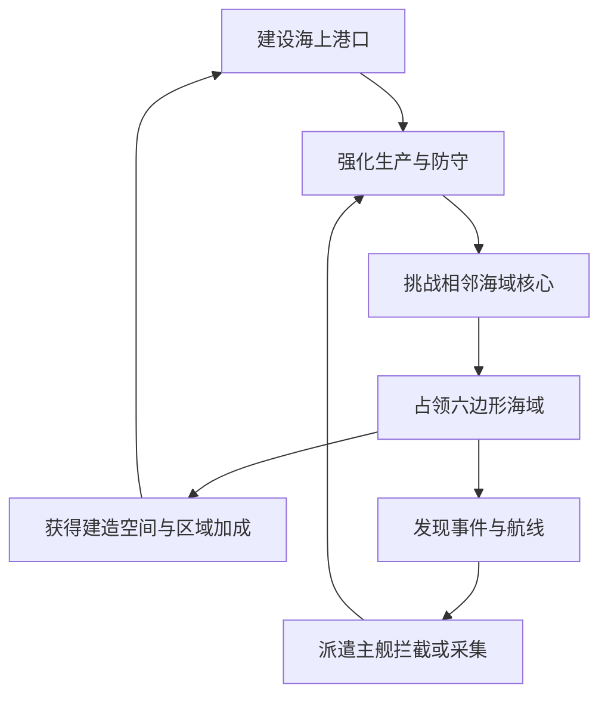
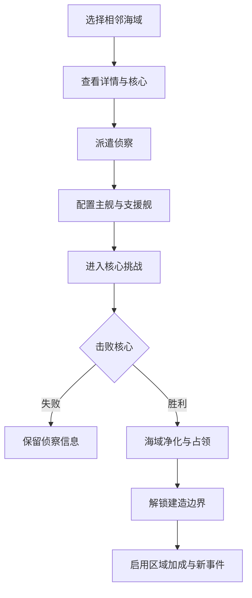

# 《吞吞舰船》海盗生涯：六边形海域扩张、动态航线与大地图设计文档

> 文档版本：V1.0  
> 文档性质：海盗生涯模式增量设计，不修改任何旧文档  
> 对应模式：海盗生涯（长期养成）  
> 核心扩展：六边形海域、领土占领、动态边境来袭、区域加成、地图事件、真实航线拦截、多层级缩放地图  
> 推荐实现环境：Unity 3D  

---

## 0. 增量规则与旧文档关系

本文件是在以下文档基础上的地图玩法重构方案：

- 《吞吞舰船_海盗生涯长期养成与海上港口模式设计文档》
- 《吞吞舰船_海盗生涯防守建筑造船厂与港口成长深化设计文档》

旧文档继续保留为当时版本记录，不进行覆盖修改。

当新旧文档出现冲突时，按以下优先级执行：

1. 世界区域划分由旧版圆形范围改为本文件的六边形海域。
2. 主动冒险不再使用三个固定入口与关卡列表，而是以本文件的地图事件、海域核心和真实航线目标为准。
3. 自动防守敌人的出现位置，以玩家当前领土的动态外边缘为准。
4. 港口建筑、造船厂、防御塔、守卫舰和主舰养成规则继续沿用旧文档。
5. 港口内部建筑仍使用细网格自由搭建，不能把一整块六边形海域误做成一个建筑格。
6. 海域占领不会直接赠送铺满的建筑地基，只会解锁该区域的建造权限、资源权益和战略控制权。
7. 已占领海域不会因为一次自动防守失败而永久丢失，避免离线回来后领土和建筑被清空。

---

## 1. 本次重构目标

旧版海盗生涯拥有海上港口、自动防守和主动出击，但地图仍像一个功能菜单，缺少真实世界感。

本次重构需要解决以下问题：

### 1.1 港口扩建缺少战略边界

旧版以圆形范围限制建造，扩建只体现为“半径变大”，玩家无法清晰理解：

- 哪片海域属于自己。
- 下一步能向哪里扩张。
- 为什么某个方向不能继续搭建。
- 扩张后会增加哪些资源和风险。
- 敌人会从哪里来。

新的六边形海域需要让每次扩张都成为一次明确的领土选择。

### 1.2 自动防守出生方向与实际领土脱节

当港口从中心不断向外延伸后，敌人不能继续固定从初始圆形边缘出生。

新的系统必须：

- 实时识别当前领土外边缘。
- 找出每一条暴露在外海的边。
- 根据防御薄弱位置和区域威胁选择进攻方向。
- 在大地图上提前显示可能来袭的边境。
- 支持单方向、双方向和包围式进攻。

### 1.3 主动冒险不应只是关卡按钮

旧版“海洋生物、海上船只、敌人堡垒”三个固定区域，本质仍然是关卡选择列表。

新的目标是：

- 鱼群真的出现在某块海域。
- 商船、海盗船、运输舰真的沿航线移动。
- 海怪真的在地图上游荡或盘踞。
- 玩家主舰需要航行到目标位置。
- 拦截移动船只必须在其离开前真正接触。
- 战斗结果会改变该区域状态、航线收益或事件后续。

### 1.4 地图缩放后信息需要分层

玩家近距离要摆建筑、看战斗，远距离要看领土和航线。

新的地图必须在滚轮缩放时逐级切换信息，而不是把所有模型、图标和文字同时挤在屏幕上。

---

## 2. 新版海盗生涯的四层循环



四层循环分别为：

1. **港口建设**：在已控制海域内铺设地基、生产、防御和装饰建筑。
2. **领土征服**：挑战相邻海域的核心单位，胜利后取得控制权。
3. **边境防守**：敌人从当前领土暴露边缘发动轮次进攻。
4. **航海活动**：追踪鱼群、航线船只、海怪、遗迹和其他动态事件。

这四层不能彼此割裂：

- 建筑提供出征资源与主舰强化。
- 占领海域提供新的建造空间和产量加成。
- 扩张增加边境长度，也会带来更多防守压力。
- 航海事件提供稀缺资源，反过来支持港口升级。

---

## 3. 世界地图基础结构

## 3.1 两套网格并存

世界同时存在两套网格，但用途完全不同。

| 网格 | 尺度 | 用途 |
| --- | --- | --- |
| 六边形海域网格 | 大尺度 | 领土、挑战、区域加成、事件、威胁、航线 |
| 港口建造网格 | 小尺度 | 地基、建筑、装饰、道路、水道、防御布局 |

必须遵守：

- 六边形不是建筑格。
- 一块六边形海域内部可以容纳大量建造格。
- 建筑可以跨越同一海域内部的小网格连续搭建。
- 建筑跨越六边形边界时，边界两侧都必须属于玩家。
- 海域边界在近距离可以淡化，避免破坏港口整体视觉。
- 进入领土或建造模式时再强化显示边界。

## 3.2 六边形朝向

推荐采用**平顶六边形**：

- 左右方向拥有完整直边。
- 横屏地图中向东西两侧扩张更直观。
- 六个相邻方向容易识别。
- 适合表现横向航线和宽阔海上城市。

六个方向统一命名为：

1. 东
2. 东北
3. 西北
4. 西
5. 西南
6. 东南

UI、程序、策划和关卡配置必须使用同一套方向命名。

## 3.3 坐标

推荐使用轴向坐标：

```text
HexCoord(q, r)
```

第三个隐含坐标：

```text
s = -q - r
```

六个相邻坐标：

```text
东：     (q + 1, r)
东北：   (q + 1, r - 1)
西北：   (q,     r - 1)
西：     (q - 1, r)
西南：   (q - 1, r + 1)
东南：   (q,     r + 1)
```

所有海域存档、寻路、距离、边境和迷雾计算都以坐标为准，不使用显示对象名称做逻辑判断。

## 3.4 推荐尺寸

首版建议：

| 参数 | 建议值 |
| --- | ---: |
| 六边形中心到顶点距离 | 140～180米 |
| 单块海域最大可建面积 | 六边形面积的65%～75% |
| 建筑基础格 | 2米或2.5米 |
| 边界安全带 | 6～10米 |
| 区域核心战斗缓冲带 | 20～30米 |

最终尺寸应以以下体验校准：

- 初始海域足够完成前30分钟建设。
- 占领第二块海域后，空间增长必须明显。
- 玩家不能用三四块地基就跨过整块海域。
- 主舰从一侧航行到另一侧需要可感知时间。
- 中景镜头下能同时看清中心海域和六个相邻海域。

---

## 4. 海域状态

每块海域只能处于一个主状态，并可附带多个次级状态。

## 4.1 主状态

| 状态 | 含义 | 玩家操作 |
| --- | --- | --- |
| 未知 | 完全处于迷雾中 | 不可选择 |
| 已发现 | 已看见基本轮廓和类型 | 可查看简略信息 |
| 可挑战 | 与玩家领土相邻 | 可侦察、挑战核心 |
| 挑战中 | 玩家正在攻打核心 | 不可重复发起 |
| 已占领 | 属于玩家 | 可建造、采集、部署 |
| 争夺中 | 特殊大型入侵暂时压制 | 可防守，建筑不永久消失 |
| 封锁 | 被世界Boss、风暴或剧情暂时阻断 | 满足条件后解锁 |

## 4.2 次级状态

次级状态可以叠加：

- 正在发生鱼群事件
- 存在移动航线
- 存在海怪
- 资源富集
- 风暴
- 浓雾
- 海盗活跃
- 商贸繁荣
- 防守警戒
- 建筑施工中
- 主舰位于此处
- 守卫舰队巡逻

## 4.3 初始状态

游戏开始时：

- 玩家位于坐标 `(0, 0)` 的中心海域。
- 中心海域默认已占领。
- 六个相邻海域默认已发现，其中2～3块立即可挑战。
- 其余更远海域处于迷雾状态。
- 首次占领任意相邻海域后，继续揭开它外侧的相邻区域。

这样玩家不会一开始看到无穷无尽的六边形，也不会失去扩张方向。

---

## 5. 世界生成与区域分布

## 5.1 地图形式

长期养成模式推荐使用“有限大世界 + 赛季扩展”：

- 首版世界半径：中心外6圈。
- 总海域数量：127块。
- 第一阶段开放：中心外3圈，共37块。
- 港口等级提升或章节推进后继续解除外圈迷雾。
- 后续版本可添加新的地图群岛，而不是无限生成。

半径为 `N` 的六边形地图总格数：

```text
TotalHex = 1 + 3 × N × (N + 1)
```

示例：

| 外圈数 | 总海域 |
| ---: | ---: |
| 1 | 7 |
| 2 | 19 |
| 3 | 37 |
| 4 | 61 |
| 5 | 91 |
| 6 | 127 |

## 5.2 环带难度

海域基础难度由距离中心的环带决定：

```text
Ring = (abs(q) + abs(r) + abs(s)) / 2
```

建议：

| 环带 | 推荐港口阶段 | 核心威胁 | 主要内容 |
| ---: | --- | --- | --- |
| 0 | 新手 | 无 | 玩家初始港口 |
| 1 | 港口1～3级 | 低～中 | 基础资源、教学核心 |
| 2 | 港口3～5级 | 中 | 首批海怪、商路、稀有材料 |
| 3 | 港口5～7级 | 中～高 | 复合核心、风暴、重甲舰 |
| 4 | 港口7～9级 | 高 | 大型要塞、巨兽、战略资源 |
| 5 | 港口9～10级 | 很高 | 阵营旗舰、危险航线 |
| 6 | 长期终局 | 极高 | 世界Boss、赛季核心 |

环带只决定基础范围，不应让所有同圈海域完全相同。

最终威胁：

```text
FinalThreat =
RingBaseThreat
× BiomeThreatMultiplier
× CoreTypeMultiplier
× WorldChapterMultiplier
```

## 5.3 手工规则与随机组合

推荐：

- 中心和第一圈完全手工配置，保证新手体验。
- 第二、三圈使用手工模板随机排列。
- 外圈使用“海域类型 + 核心 +事件池 + 航线池”组合。
- 关键剧情、世界Boss和大型商路固定位置。
- 同一存档生成后保存种子，不能每次进入改变海域。

---

## 6. 领土扩张规则

## 6.1 可挑战条件

一块海域只有同时满足以下条件才可挑战：

1. 与至少一块玩家已占领海域共享完整边。
2. 已被侦察或不需要特殊侦察。
3. 不处于剧情封锁。
4. 玩家拥有可出征主舰。
5. 满足最低远征补给。
6. 没有另一场核心挑战正在进行。

仅角点接触不算相邻，不能跨角挑战。

## 6.2 扩张流程



## 6.3 侦察

第一次挑战中高等级海域前需要侦察。

侦察可以显示：

- 核心类型
- 核心等级
- 主要敌人
- 特殊环境
- 推荐武器
- 区域加成
- 预计首次占领奖励
- 可能出现的航线
- 相邻未知海域数量

侦察方式：

| 方式 | 成本 | 时间 | 信息完整度 |
| --- | ---: | ---: | --- |
| 瞭望塔远望 | 无或很低 | 较慢 | 基础 |
| 派遣侦察艇 | 食物、燃料 | 中等 | 较完整 |
| 主舰亲自靠近 | 无额外成本 | 玩家操作 | 完整 |
| 情报商购买 | 金币 | 立即 | 完整 |

首圈不强制等待侦察，避免拖慢开局。

## 6.4 挑战失败

失败后：

- 不扣除已占领领土。
- 不清除侦察信息。
- 核心恢复至满状态。
- 返还30%未消耗远征补给。
- 显示失败原因：火力不足、承伤不足、机动不足、未处理召唤物或未破坏模块。
- 可以立即重新配置舰船后再次挑战。
- 每日首次连续失败3次后，提供临时侦察增益或推荐克制卡，不直接降低核心等级。

## 6.5 占领完成

核心被击败后，海域进入短暂“净化/接管”阶段：

1. 敌对单位撤退或投降。
2. 核心残骸生成战利品。
3. 玩家旗帜或控制信标建立。
4. 六边形边框由敌对色转为玩家色。
5. 与相邻己方海域之间的边界淡出。
6. 外侧新边境亮起。
7. 新发现海域解除迷雾。
8. 区域加成开始生效。
9. 建造权限开启。

接管演出建议控制在5～8秒，可跳过。

---

## 7. 海域核心挑战

海域核心是领土占领的最终目标，必须比普通地图事件更难。

核心不是单纯“清光所有小怪”，而是一个有明确主目标的战斗。

## 7.1 核心类型总览

| 核心 | 战斗定位 | 主要机制 | 占领主题 |
| --- | --- | --- | --- |
| 海盗港口 | 固定要塞 | 炮塔、船坞、增援 | 夺取敌方设施 |
| 海盗主舰 | 移动旗舰 | 护航、转向炮击、逃逸 | 舰队决战 |
| 盘踞海怪 | 巨型生物 | 部位、潜水、召唤 | 清除生态威胁 |
| 鲸群首领 | 高速大型生物 | 冲撞、迁徙、护幼 | 控制渔场 |
| 浮动堡垒 | 重装建筑群 | 多阶段拆模块 | 攻城 |
| 幽灵船 | 异常敌舰 | 隐身、分身、诅咒区 | 解除迷雾 |
| 风暴核心 | 环境Boss | 雷击、旋涡、风墙 | 稳定气候 |
| 商会封锁舰 | 精英舰队 | 阵型、维修、撤退 | 打通航路 |
| 机械采掘平台 | 工业要塞 | 无人机、护盾、采矿臂 | 夺取矿区 |
| 深海巢穴 | 固定生物巢 | 持续孵化、触须区、甲壳 | 清除繁殖源 |

## 7.2 海盗港口核心

结构：

- 外围挡板
- 2～4座差异化防御塔
- 一个增援船坞
- 核心指挥楼
- 一条可切断的弹药线路

胜利条件：

- 摧毁核心指挥楼。

可选战术：

- 先毁船坞，阻止增援。
- 切断弹药库，使炮塔射速下降。
- 从防御薄弱边绕后。
- 正面强攻，但承受最高火力。

占领后：

- 残存平台可转化为一次性建筑材料。
- 有概率解锁防御塔蓝图。
- 该海域更容易出现商船与海盗航线。

## 7.3 海怪核心

阶段：

1. 海怪在水面攻击，暴露弱点。
2. 生命降至65%后潜水，在海域内移动。
3. 通过水波、气泡和声呐判断出现位置。
4. 生命降至30%后进入狂暴，制造范围危险区。

胜利条件：

- 击败主体。

占领后：

- 解锁渔业或海兽资源加成。
- 可能留下海怪骨架装饰。
- 后续出现普通海兽事件，而不再重复出现同一核心。

## 7.4 主舰核心

特点：

- 核心会在本海域持续移动。
- 拥有护航舰和支援舰。
- 生命较低时会向外边缘逃跑。
- 若逃出海域，本次挑战失败，但保留已侦察配置。

胜利条件：

- 在核心逃离前将其击沉或迫使投降。

建议增加：

- 击毁推进器可降低逃跑速度。
- 击毁通讯塔可阻止召唤第二批护航。
- 击毁武器模块降低持续压力。

## 7.5 核心难度标准

相邻新海域核心推荐：

- 推荐战力约为玩家当前主舰战力的105%～125%。
- 通过克制、驾驶和模块击破可以用略低战力通关。
- 纯自动战斗需要更高战力。
- 核心战平均时长90～180秒。
- 外圈大型核心可延长至3～5分钟。

核心不能通过无限刷小怪稳定获得资源，避免玩家不击败核心反复刷取。

---

## 8. 占领后的建造扩展

## 8.1 建造权限

占领海域后：

- 该六边形内部建造格解锁。
- 相邻己方海域之间允许连接地基。
- 区域外边缘保留海面和战斗缓冲带。
- 区域内部仍需要玩家实际铺设浮木、木筏、钢制平台等地基。
- 没有地基的水面不能直接放置普通建筑。

## 8.2 跨海域连接

建筑地基跨越两块己方海域时：

- 自动识别双方均已占领。
- 边界线在建造模式中以虚线显示。
- 地基预览不因逻辑边界中断。
- 同一连续地基结构可以跨多个己方海域保存。
- 承重、供电、弹药和道路仍按实际连接关系计算。

如果目标海域未占领：

- 预览变为红色。
- 边界出现敌对锁链或迷雾墙提示。
- 显示“击败该海域核心后可继续扩建”。
- 点击边界可直接打开该海域详情。

## 8.3 边界安全带

已占领海域的外边缘保留6～10米安全带：

- 普通生产建筑不可贴边摆放。
- 防御挡板、炮塔、水雷和瞭望设施可以进入部分安全带。
- 为敌人出现、水面表现和航行保留空间。
- 防止建筑模型越界进入未占领海域。

## 8.4 区域建造容量

不建议直接用“每块海域只能造X座建筑”的硬上限。

更合适的限制来自：

- 可铺设面积
- 地基承重
- 人口与工人
- 供电与弹药
- 水道占用
- 港口繁荣等级
- 防守暴露边长度

海域可提供轻度“区域规划槽”：

- 每块海域可以指定一个区域职能。
- 职能不限制建筑类型，只提供温和加成。

可选职能：

| 职能 | 加成 |
| --- | --- |
| 渔业区 | 捕鱼与鱼肉加工效率提高 |
| 工业区 | 建材与金属加工提高 |
| 居住区 | 房屋容量与幸福度提高 |
| 军事区 | 防御建筑供弹和维修提高 |
| 船坞区 | 造船、修船和守卫舰补给提高 |
| 商业区 | 商船停靠与金币收益提高 |

同一块海域24小时内免费改一次职能，之后再次修改需要少量金币，避免频繁切换刷收益。

---

## 9. 领土边境的动态判定

## 9.1 边境海域

若一块已占领海域至少有一个相邻坐标未被玩家占领，则它是边境海域。

```text
FrontierHex =
OwnedHex AND
Exists NeighborHex WHERE NeighborHex is not Owned
```

## 9.2 暴露边

每一块边境海域可以拥有1～5条暴露边。

```text
ExposedEdge =
OwnedHex Side
whose adjacent hex is not Owned
```

完整领土外轮廓由所有暴露边组成。

敌人的入侵生成位置不能只读取“边境海域中心”，必须读取具体暴露边。

## 9.3 内部空洞

玩家可能围住一块尚未占领海域，形成内部空洞。

规则：

- 被玩家领土完全包围的未占领海域仍不属于玩家。
- 该区域的核心仍需击败。
- 普通外海入侵不从内部空洞生成。
- 内部空洞可生成“潜伏海怪”“海盗内巢”等特殊事件。
- 完成内部核心后，可以消除内部威胁并连通建造区。

## 9.4 飞地

正常占领只能挑战相邻海域，因此不会自然产生不相连飞地。

如果剧情、传送门或特殊据点允许获得远方海域：

- 该海域标记为前哨领地。
- 可以部署有限建筑。
- 不可与主港共享完整供给，除非建立航线。
- 不计入主港连续建造范围。
- 敌人可以从其所有暴露边单独进攻。

首版不建议开放飞地，先保证连续领土逻辑稳定。

---

## 10. 动态轮次来袭

## 10.1 来袭位置生成流程

每次轮次准备时执行：

1. 收集所有玩家已占领海域。
2. 计算所有暴露边。
3. 排除不可生成边。
4. 为剩余边计算进攻权重。
5. 选择一个或多个来袭边。
6. 在边外生成敌方集结区。
7. 生成通往港口目标的进攻路线。
8. 提前在大地图和近景HUD上显示警告。

## 10.2 不可生成边

以下边暂时排除：

- 正在播放核心挑战的海域。
- 主舰正在通过且会造成严重冲突的狭窄航道。
- 被剧情安全保护的边。
- 最近一轮刚遭受攻击且仍处于保护时间。
- 缺少有效水面路径的异常位置。
- 摄像机或场景流式加载尚未准备完成的边。

## 10.3 进攻权重

建议公式：

```text
AttackEdgeWeight =
BaseWeight
× RegionalThreat
× WeakDefenseFactor
× ExpansionPressure
× VarietyFactor
× RecentAttackCooldown
```

含义：

- `RegionalThreat`：相邻敌对海域越危险，权重越高。
- `WeakDefenseFactor`：防守越薄弱，敌人越倾向攻击。
- `ExpansionPressure`：新占领边境更容易触发试探性进攻。
- `VarietyFactor`：避免总从同一方向来。
- `RecentAttackCooldown`：刚被攻击的边权重下降。

必须设置弱点利用上限。

敌人可以偏向薄弱处，但不能连续10轮只打同一处，导致玩家被迫把全部建筑堆在一个方向。

## 10.4 防御薄弱度

薄弱度可由以下数据组成：

```text
DefenseScore =
TowerEffectivePower
+ GuardShipPower
+ BarrierDurability
+ RepairCoverage
+ PlayerMainShipSupport
```

边缘附近的防御贡献更高，远处建筑按路径与射程衰减。

## 10.5 敌人生成点

敌人生成点位于暴露边外侧：

- 距边界20～40米。
- 保证不在玩家建筑视野中心突然出现。
- 先显示远方船影、烟雾、海浪或海怪背鳍。
- 进入战斗范围后再启用完整AI和碰撞。
- 大型Boss需要更远的演出距离。

## 10.6 轮次类型

| 类型 | 来袭边数量 | 特点 |
| --- | ---: | --- |
| 试探袭击 | 1 | 小型单位，时间短 |
| 标准轮次 | 1 | 常规敌人组合 |
| 双线夹击 | 2 | 两条相距较远的边同时出现 |
| 连续突袭 | 2～3 | 分批从不同方向出现 |
| 海兽迁徙 | 1～2 | 生物群穿越领土 |
| 火力封锁 | 1 | 远程舰停留边外炮击 |
| 登陆破坏 | 1 | 小艇靠近并投放破坏者 |
| Boss轮次 | 1～2 | Boss主方向 + 小型牵制方向 |

## 10.7 双线进攻限制

满足以下条件才解锁：

- 玩家已占领至少7块海域。
- 至少存在两个相距2格以上的边境方向。
- 港口拥有两组以上防御区或守卫编队。
- 最近两轮没有双线进攻。

双线进攻的总战力不能简单翻倍：

```text
每条线路约为标准轮次战力的55%～70%
```

## 10.8 轮次失败

失败后：

- 领土不会永久丢失。
- 受损建筑进入维修状态。
- 被突破的边标记为“危险边境”。
- 下一次自动重复仍刷最高已通关轮次。
- 玩家可查看路径、承伤点、漏怪类型和防御盲区。
- 危险边境在下一次正式挑战前获得短暂预警时间加成。

---

## 11. 边境防守区域

## 11.1 防区

玩家可以把连续的暴露边设为一个防区。

防区用途：

- 分配守卫舰编队。
- 设置防御塔统一索敌策略。
- 查看该方向战力。
- 设置轮次警报。
- 保存防守预设。

默认防区：

- 北部防区
- 东部防区
- 南部防区
- 西部防区

随着领土变得不规则，玩家可以重命名：

- 鲸骨湾
- 东侧商路
- 风暴角
- 旧船坞外海

## 11.2 防区战力显示

每个防区显示：

- 暴露边数量
- 覆盖炮塔
- 守卫舰数量
- 挡板耐久
- 火力类型
- 对小型效率
- 对重甲效率
- 对海兽效率
- 维修覆盖
- 预计可应对轮次

当某防区明显不足时，不只显示红色数字，还要给出原因：

- 缺少快速拦截
- 缺少反重甲
- 缺少近距离封锁
- 无维修覆盖
- 航道过宽
- 炮塔射界被建筑遮挡

---

## 12. 海域加成系统

## 12.1 加成设计原则

区域加成必须满足：

- 看地图就能理解主要价值。
- 鼓励玩家选择扩张方向。
- 不要求玩家频繁搬迁全部建筑。
- 不让单个稀有区域决定整个存档成败。
- 同类加成存在递减，避免只占一种海域。
- 部分加成为本地加成，部分为全领土战略加成。

## 12.2 三类加成

| 类型 | 生效范围 | 示例 |
| --- | --- | --- |
| 本地生产加成 | 仅该海域内建筑 | 本海域木材工坊产量+25% |
| 领土基础加成 | 占领后全局生效 | 全港口鱼产量+5% |
| 条件战略加成 | 满足布局或事件条件 | 航线经过本区时贸易收益+15% |

## 12.3 同类递减

同类型全局加成建议：

```text
第1块：100%效果
第2块：70%效果
第3块：45%效果
第4块及以后：25%效果
```

本地加成不递减，因为玩家需要在对应海域实际建设。

## 12.4 海域类型

| 海域类型 | 本地加成 | 全局或战略加成 | 主要风险 |
| --- | --- | --- | --- |
| 漂流木海 | 木材回收+30% | 地基建造成本-3% | 易燃残骸 |
| 丰饶渔场 | 捕鱼+35% | 食物产量+4% | 鲨鱼群 |
| 深水渔场 | 高级鱼类+30% | 海兽事件奖励+5% | 大型海兽 |
| 鲸落海域 | 骨材、鲸油+40% | 海兽研究速度+5% | 腐食生物 |
| 珊瑚浅海 | 装饰材料+35% | 港口繁荣获取+4% | 航道狭窄 |
| 浮矿带 | 金属采集+30% | 金属仓储+5% | 机械采掘敌人 |
| 沉船墓场 | 废料与零件+35% | 舰船维修成本-3% | 幽灵船 |
| 商路交汇 | 商业建筑+25% | 航线收益+8% | 海盗劫掠 |
| 走私暗湾 | 稀有交易刷新+20% | 黑市价格-5% | 治安下降 |
| 平静内海 | 居住与幸福度+20% | 离线生产稳定性+5% | 资源较少 |
| 季风海域 | 风力设施+40% | 舰船航行速度+2% | 周期风暴 |
| 雷暴海域 | 电力产出+35% | 雷电武器伤害+3% | 雷击 |
| 浓雾海域 | 隐蔽建筑+25% | 敌方远程命中-2% | 侦察困难 |
| 火油海面 | 燃料加工+35% | 加速燃料上限+3% | 易爆 |
| 暖流带 | 鱼类与航速+15% | 主舰出征时间-3% | 生物迁徙 |
| 寒流带 | 冷藏与保存+30% | 食物储存上限+5% | 结冰减速 |
| 海盗旧据点 | 军事建筑升级+15% | 海盗蓝图掉率+5% | 袭击频繁 |
| 古代遗迹海 | 研究建筑+25% | 稀有核心发现率+3% | 遗迹守卫 |
| 巨浪海域 | 防波设施+30% | 冲撞抗性+3% | 建筑受浪 |
| 旋涡区 | 特殊研究+30% | 事件刷新+5% | 航行危险 |
| 浮岛花园 | 居住、装饰+30% | 幸福度上限+3 | 防守空间少 |
| 军舰坟场 | 武器零件+35% | 守卫舰制造成本-3% | 弹药爆炸 |
| 自由贸易海 | 金币建筑+25% | 商船停靠概率+8% | 高价值目标 |
| 禁航深渊 | 无常规生产 | 世界Boss奖励+10% | 极高威胁 |

## 12.5 区域等级

占领后海域可以通过建设和活动提升开发等级：

| 等级 | 条件示例 | 效果 |
| ---: | --- | --- |
| 0 未开发 | 刚占领 | 只提供控制权 |
| 1 前哨 | 建立控制信标与基础地基 | 解锁本地加成50% |
| 2 聚落 | 建筑达到一定繁荣 | 本地加成100% |
| 3 专区 | 指定区域职能并完成工程 | 解锁战略加成 |
| 4 核心区 | 高级建筑与完整供给 | 加成强化、事件品质提高 |
| 5 地标区 | 完成专属地标 | 获得独特外观与长期效果 |

区域开发让旧海域仍有成长价值，不会占领后就失去意义。

---

## 13. 海域详情

缩小到大地图后，点击任意海域打开详情面板。

## 13.1 已占领海域详情

显示：

- 海域名称
- 坐标
- 海域类型
- 开发等级
- 区域职能
- 当前建筑数量
- 人口与工人
- 本地产量
- 本地加成
- 全局加成
- 防区归属
- 防御战力
- 暴露边数量
- 当前事件
- 航线
- 驻守舰队
- 主舰是否位于此处

按钮：

- 聚焦海域
- 进入建造
- 查看防区
- 派遣舰队
- 设置区域职能
- 查看生产

## 13.2 可挑战海域详情

显示：

- 已知海域类型
- 区域核心
- 威胁等级
- 特殊环境
- 主要敌人
- 推荐战力
- 推荐武器
- 首次占领奖励
- 占领后加成
- 可解锁相邻区域
- 侦察完整度

按钮：

- 侦察
- 挑战核心
- 标记为目标
- 比较相邻海域

## 13.3 未知海域详情

只显示：

- 迷雾轮廓
- 大致风险
- 需要的侦察条件
- 可能的海域类别图标

不能提前泄露核心和完整奖励。

---

## 14. 地图事件系统

旧版航海地图副本入口全部替换为地图上的事件实体。

事件必须具备：

- 真实地图位置
- 出现时间
- 持续时间
- 移动或静止状态
- 推荐战力
- 派遣条件
- 奖励
- 结束结果

## 14.1 事件分类

| 分类 | 示例 | 是否移动 |
| --- | --- | --- |
| 资源事件 | 大量海鱼、漂流木、浮矿、鲸落 | 否或缓慢 |
| 敌对事件 | 海盗巡逻、海怪游荡、劫掠舰队 | 是 |
| 航线事件 | 商船、运输船、军舰、走私船 | 是 |
| 探索事件 | 沉船遗迹、漂流瓶、迷雾信号 | 否 |
| 环境事件 | 风暴、旋涡、雷暴、浓雾 | 缓慢移动 |
| 防守事件 | 边境侦察、敌军集结、封锁 | 否或接近领土 |
| 商贸事件 | 流动商队、维修船、拍卖船 | 是 |
| 世界事件 | 黄金巨鲸、幽灵舰队、移动堡垒 | 是 |

## 14.2 事件品质

| 品质 | 颜色 | 持续时间 | 奖励 |
| --- | --- | ---: | --- |
| 普通 | 白/灰 | 10～30分钟 | 基础 |
| 稀有 | 蓝 | 20～45分钟 | 较高 |
| 精英 | 紫 | 30～60分钟 | 高 |
| 传奇 | 金 | 1～3小时 | 独特 |
| 世界 | 红/橙 | 章节或每日 | 极高 |

地图图标必须同时使用形状和颜色区分，不能只依赖颜色。

---

## 15. 资源事件

## 15.1 大量海鱼出没

地图表现：

- 水面出现密集鱼影。
- 海鸟盘旋。
- 六边形内显示鱼群图标和剩余时间。
- 近景可看到鱼群实际移动。

玩家行为：

- 派遣主舰、捕鱼船或守卫舰前往。
- 到达事件范围后开始捕捞。
- 捕捞过程中可能吸引鲨鱼或海兽。
- 玩家可以选择提前撤离并保留已获得资源。

事件分支：

| 分支 | 特点 |
| --- | --- |
| 普通鱼群 | 安全，基础食物 |
| 珍稀鱼群 | 收益高，需要更好捕鱼设备 |
| 鲨鱼伴生 | 捕捞中触发战斗 |
| 巨鲸追随 | 有概率转化为巨鲸事件 |
| 污染鱼群 | 需要净化，否则降低食物质量 |

## 15.2 漂流木潮

- 大量浮木沿洋流移动。
- 工程船或主舰可收集。
- 越晚到达，浮木越分散。
- 风暴环境会提高数量，也会增加航行难度。

## 15.3 浮矿喷涌

- 海底短暂喷出金属矿和晶体。
- 需要采集船停留作业。
- 作业噪声会吸引机械敌人或海怪。
- 可选择“快速开采”或“安全开采”。

## 15.4 鲸落

- 静止在海底或水面的巨型资源点。
- 提供鲸油、骨材、稀有生物材料。
- 周围持续刷新腐食生物。
- 开采越久，威胁越高。

---

## 16. 真实航线系统

## 16.1 航线不是装饰

每条航线由以下数据组成：

- 起点
- 终点
- 中间航点
- 航线类型
- 航行方向
- 船只生成周期
- 船只阵营
- 船只速度
- 护航强度
- 货物类型
- 风险等级
- 当前通行状态

船只必须沿航线实际移动，不能只在地图上播放无逻辑动画。

## 16.2 航线类型

| 航线 | 常见目标 | 主要收益 | 风险 |
| --- | --- | --- | --- |
| 近海渔运线 | 渔船、冷藏船 | 食物、鱼肉 | 低 |
| 木材运输线 | 木筏、工程船 | 木材、建材 | 低～中 |
| 商贸线 | 商船、护航船 | 金币、商品 | 中 |
| 金属运输线 | 矿船、驳船 | 金属、零件 | 中 |
| 燃料运输线 | 油料船 | 燃料、爆炸材料 | 高爆风险 |
| 军用补给线 | 军舰、补给舰 | 武器零件、蓝图 | 高 |
| 海盗走私线 | 快艇、走私船 | 稀有商品 | 速度快 |
| 奴隶/俘虏线 | 敌对运输舰 | 船员、声望 | 护航强 |
| 幽灵航线 | 幽灵船 | 异常材料 | 特殊机制 |
| 巨兽迁徙线 | 鲸群、海兽 | 生物材料 | 非船只 |

## 16.3 航线可见度

航线分为：

- 未知航线：完全不可见。
- 传闻航线：只显示大致区域和时间。
- 已侦察航线：显示路径、方向和船只类型。
- 已控制航线：显示完整班次、收益和威胁。

提升可见度的方法：

- 占领航线经过的海域。
- 建造瞭望塔或声呐站。
- 派侦察船跟踪。
- 购买情报。
- 捕获航海图。

---

## 17. 航线船只的真实拦截

## 17.1 拦截核心规则

玩家不能点击船只后直接进入战斗。

必须完成：

1. 选择地图上的移动船只。
2. 查看其速度、方向和预计离开时间。
3. 选择一个拦截位置。
4. 派遣主舰或舰队航向拦截点。
5. 玩家舰船与目标进入接触半径。
6. 才触发对应战斗。

## 17.2 拦截预测

地图提供预计交汇点：

```text
PlayerETA = PlayerPathDistance / PlayerMapSpeed
TargetETA = TargetRouteDistanceToPoint / TargetMapSpeed
```

交汇状态：

| 状态 | 表现 |
| --- | --- |
| 稳定拦截 | 绿色，玩家提前5秒以上到达 |
| 勉强拦截 | 黄色，时间差在±5秒 |
| 无法赶上 | 红色，目标先离开 |
| 路线受阻 | 灰色，风暴或敌对海域阻挡 |

玩家仍可以选择勉强拦截，但必须承担失败风险。

## 17.3 接触判定

战略地图接触半径由舰船体型决定：

```text
ContactRadius =
PlayerMapRadius
+ TargetMapRadius
+ InterceptTolerance
```

建议：

- 普通小船容错半径较小。
- 大型商队和舰队容错半径较大。
- 浓雾会降低接触半径。
- 声呐和侦察船可提高接触半径。
- 不能只让两个图标像素完全重叠才算接触。

## 17.4 战斗触发

接触后：

- 时间短暂减速。
- 镜头聚焦双方。
- 显示目标名称、货物和护航强度。
- 玩家选择“进入战斗”或“放弃接触”。
- 敌对高警戒目标可能直接先手攻击。

进入战斗时继承：

- 双方相对方向
- 初始距离
- 玩家当前生命与燃料
- 护航舰数量
- 天气
- 海域环境
- 是否成功伏击

## 17.5 伏击

若玩家提前到达拦截点并停留：

- 获得伏击状态。
- 战斗初始敌方侦察范围降低。
- 玩家第一次攻击伤害或暴击提高。
- 可以选择更有利的初始方向。

若玩家晚到并从后方追赶：

- 敌人可能获得警戒状态。
- 快船会继续尝试逃离。
- 战斗边缘生成逃逸出口。

## 17.6 错过目标

如果目标离开地图：

- 事件标记为“已错过”，不是战斗失败。
- 不扣除主舰耐久。
- 已消耗的航行燃料不返还。
- 地图显示目标最终离开方向。
- 情报等级足够时可预测下一班船。

这样航线具有真实时间感，但不会产生过强失败惩罚。

## 17.7 追击

部分目标错过交汇点后仍可追击：

- 玩家速度高于目标。
- 目标尚未离开世界边界。
- 玩家剩余燃料充足。

追击会重新计算第二个交汇点。

高速走私船和宝箱船可以把“是否追得上”作为主要玩法。

---

## 18. 主舰地图航行

## 18.1 主舰位置持久化

主舰在大地图上拥有真实位置：

- 港口停泊
- 海域内航行
- 前往事件
- 等待拦截
- 战斗中
- 返航
- 维修中

不能在不同挑战之间瞬间传送。

## 18.2 航行方式

玩家可选择：

- 点击目的地自动航行。
- 连续设置多个航点。
- 进入近景后手动驾驶。
- 设置自动返航条件。

自动航行会避开：

- 未侦察危险区
- 强风暴
- 禁航深渊
- 敌对核心警戒区
- 旋涡

玩家可以强制穿越，但需要二次确认。

## 18.3 航行消耗

地图航行主要消耗：

- 食物补给
- 燃料
- 时间

建议不要让普通短距离移动过于昂贵：

- 己方领土内移动成本很低。
- 相邻海域事件成本较低。
- 跨多个海域远征才明显消耗。
- 港口研究、暖流和补给舰可降低成本。

## 18.4 返航条件

可设置：

- 生命低于30%自动返航。
- 燃料低于20%自动返航。
- 货舱达到90%自动返航。
- 完成当前目标后自动返航。
- 遇到高于自身150%战力的敌人时绕行。

自动返航不能代替玩家主动驾驶战斗，只负责战略地图移动。

---

## 19. 事件与主舰、守卫舰、功能船的差异

不是所有地图事件都必须让主舰亲自处理。

| 舰船 | 适合任务 | 限制 |
| --- | --- | --- |
| 玩家主舰 | 核心、强敌、拦截、复杂事件 | 同时只能执行一个任务 |
| 捕鱼船 | 鱼群、鲸落、食物事件 | 战斗弱 |
| 工程船 | 漂流木、浮矿、遗迹打捞 | 需要护航 |
| 侦察艇 | 揭开迷雾、追踪航线 | 货舱小 |
| 护航舰 | 保护采集船、控制航路 | 收集效率低 |
| 商船 | 自动贸易 | 容易被劫掠 |
| 补给舰 | 远征补给、修理 | 价值高 |

主舰必须参与：

- 海域核心挑战
- 世界Boss
- 高级敌对舰队
- 需要手动驾驶的特殊剧情

普通资源事件可派功能船自动处理，让长期养成不会被重复操作拖累。

---

## 20. 地图事件导演

## 20.1 目标

事件导演负责：

- 控制事件数量。
- 防止所有事件挤在玩家港口旁。
- 根据玩家缺少资源提供适度帮助。
- 维持不同类型事件轮换。
- 生成真实移动目标。
- 避免重要事件与Boss轮次完全重叠。

## 20.2 并发数量

建议按已发现海域数量动态调整：

| 已发现海域 | 普通事件 | 移动航线目标 | 高价值事件 |
| ---: | ---: | ---: | ---: |
| 7～12 | 2～3 | 1 | 0～1 |
| 13～24 | 3～5 | 1～2 | 1 |
| 25～40 | 5～7 | 2～3 | 1～2 |
| 41以上 | 6～9 | 3～4 | 2 |

地图上不需要每块海域都有事件。

留白能让高价值事件更醒目。

## 20.3 缺口补偿

当玩家某资源长期低于安全值时：

- 木材不足：提高漂流木潮权重。
- 食物不足：提高近海鱼群权重。
- 金属不足：提高浮矿或运输线权重。
- 金币不足：提高商船、赏金目标权重。
- 主舰受损：提高维修船或补给事件权重。

补偿只提高出现概率，不直接把资源送进仓库。

## 20.4 防刷取

- 同一事件类型连续出现3次后权重下降。
- 低风险事件奖励随重复完成轻微递减。
- 高价值航线拥有班次冷却。
- 玩家放弃事件不立即刷新新事件。
- 修改系统时间不能推进事件。
- 离线结算使用服务器时间或可靠存档时间校验。

---

## 21. 地图缩放层级

滚轮缩放不是单纯改变摄像机高度，而是切换信息层级。

## 21.1 五级视图

| 级别 | 名称 | 主要内容 |
| ---: | --- | --- |
| L0 | 建筑近景 | 单个建筑、船员、地基、道路、生产 |
| L1 | 港口战术视图 | 多片港口、防御射界、敌人、守卫舰 |
| L2 | 海域视图 | 当前六边形与相邻海域、事件、主舰 |
| L3 | 区域战略图 | 多块六边形、边境、加成、航线 |
| L4 | 世界大地图 | 全部已发现海域、核心、模式与世界事件 |

## 21.2 信息显示规则

### L0 建筑近景

显示：

- 建筑模型
- 生产状态
- 船员
- 建造格
- 道路与供给
- 单体血条
- 建筑交互按钮

隐藏：

- 大多数六边形文字
- 远方普通事件图标
- 全局航线细节

### L1 港口战术视图

显示：

- 建筑功能图标
- 防御射界
- 防区
- 敌人进攻路线
- 守卫舰编队
- 暴露边警戒

### L2 海域视图

显示：

- 当前海域边框
- 六个相邻海域
- 海域核心
- 本地事件
- 主舰与功能船
- 航线船只

建筑切换为简化模型，不再显示船员。

### L3 区域战略图

显示：

- 六边形颜色与图标
- 领土连续范围
- 区域加成
- 威胁
- 主要航线
- 移动目标
- 轮次来袭方向

建筑只显示重要地标：

- 港口核心
- 造船厂
- 世界地标
- 防区战力图标

### L4 世界大地图

显示：

- 六边形整体布局
- 每块区域的主图标
- 所有核心位置
- 世界Boss
- 主要模式与活动位置
- 主舰位置
- 主要航线
- 章节边界

普通建筑、船员、炮弹、普通小船和低价值事件全部隐藏。

## 21.3 缩放阈值

阈值应使用滞后区间，避免滚轮停在边界时反复闪烁。

示例：

```text
L2 → L3：缩放值超过0.62
L3 → L2：缩放值低于0.56
```

每一级切换使用0.15～0.25秒淡入淡出。

## 21.4 缩放中心

滚轮缩放优先以鼠标指向位置为中心：

- 鼠标指向某海域并放大时，镜头向该海域靠近。
- 鼠标位于空白处时，以屏幕中心缩放。
- 双击海域可快速进入L2。
- 双击港口核心可快速进入L0或L1。
- 按`Home`或界面按钮回到玩家港口。

## 21.5 大地图自动进入

当缩放达到L3/L4时：

- 普通3D海面逐渐简化。
- 六边形覆盖层增强。
- 区块主色和边框变清晰。
- 地图详情UI出现。
- 音效切换为更安静的海图氛围。
- 暂不暂停游戏，但可设置大地图中战斗速度降低至50%。

如果玩家正在手动战斗，滚轮不能直接进入世界地图；需要先退出战斗操控或打开战术暂停。

---

## 22. 大地图显示模式

右侧提供地图模式切换：

| 模式 | 显示重点 |
| --- | --- |
| 领土 | 玩家、敌对、未知、可挑战区域 |
| 资源 | 木材、鱼、金属、燃料、稀有资源 |
| 生产 | 各区域产量、仓储、工人 |
| 防御 | 边境、防区、薄弱边、来袭方向 |
| 威胁 | 敌对核心、海怪、风暴、海盗活跃度 |
| 航线 | 航路、班次、移动船只、拦截点 |
| 事件 | 鱼群、遗迹、商人、世界活动 |
| 建造 | 已解锁建造区、地基连接和不可建边界 |

默认进入大地图时使用“领土模式”。

模式切换只改变信息图层，不能改变世界实际状态。

---

## 23. 六边形地图视觉规则

## 23.1 边框

| 状态 | 边框 |
| --- | --- |
| 玩家领土内部相邻边 | 隐藏或极淡 |
| 玩家外边境 | 蓝绿高亮 |
| 可挑战敌对边 | 红橙脉冲 |
| 未知迷雾边 | 灰黑虚线 |
| 正在来袭边 | 红色箭头与波纹 |
| 选中海域 | 金色或白色粗边 |
| 航线经过边 | 使用航线颜色细线 |

## 23.2 区块填充

区块底色只作为半透明信息层：

- 不能完全盖住海面和地形。
- 近景透明度低。
- 大地图透明度高。
- 使用纹理图标辅助色盲识别。

示例：

- 鱼产：鱼鳞纹
- 木材：木纹
- 金属：矿点纹
- 风暴：闪电纹
- 商贸：航线纹

## 23.3 海域主图标

每块海域最多显示：

- 一个海域类型主图标
- 一个核心或事件主图标
- 最多两个状态角标

不能把所有资源图标平铺在六边形中心。

点击后再在详情面板中显示完整信息。

## 23.4 聚合

缩放到L4时：

- 同一海域内多个小事件聚合成“事件×3”。
- 多艘同航线商船聚合为船队图标。
- 多个建筑完成提示聚合到区域图标。
- 多方向小型警告聚合为威胁等级。

---

## 24. 大地图界面布局

## 24.1 顶部

显示：

- 港口等级
- 金币
- 食物
- 木材
- 建材
- 金属
- 燃料
- 稀有核心
- 当前世界时间

## 24.2 左侧

显示可折叠列表：

- 当前主线目标
- 可挑战海域
- 即将到来的轮次
- 高价值事件
- 主舰任务
- 功能船派遣

## 24.3 中央地图

显示：

- 六边形区域
- 领土
- 航线
- 事件
- 移动船只
- 主舰
- 来袭方向

## 24.4 右侧

显示：

- 地图模式按钮
- 筛选器
- 图例
- 选中海域详情
- 选中航线或目标详情

## 24.5 底部

显示：

- 当前缩放级别
- 比例尺
- 主舰快速定位
- 港口快速定位
- 舰队列表
- 时间速度
- 世界地图/港口视图切换

## 24.6 筛选器

玩家可筛选：

- 只看可挑战海域
- 只看资源事件
- 只看移动船只
- 只看高品质事件
- 只看需要处理的警告
- 只看主舰可赶到的目标
- 隐藏已完成事件

筛选状态需要记忆。

---

## 25. 来袭HUD

## 25.1 大地图预警

轮次准备阶段显示：

- 来袭倒计时
- 来袭海域
- 具体暴露边
- 敌人类型预览
- 推荐防御类型
- 预计敌方战力
- 当前防区战力
- 主舰赶回时间

## 25.2 近景预警

进入L0～L2后：

- 屏幕边缘出现方向箭头。
- 海面远方出现船影或海兽背鳍。
- 来袭边界显示红色波纹。
- 防区名称和倒计时悬浮。
- 点击箭头可聚焦来袭边。

## 25.3 多线来袭

多线来袭时：

- 顶部显示两条独立进度。
- 不同方向使用A、B标记，而不是仅靠颜色。
- 显示每条线剩余敌人和精英单位。
- 点击A/B可快速切换镜头。
- 主舰当前位置与两个方向的预计到达时间同时显示。

## 25.4 防守结束

战报按防区拆分：

- 来袭方向
- 击杀数量
- 漏过数量
- 最高承伤建筑
- 输出最高防御塔
- 守卫舰损伤
- 建筑维修成本
- 薄弱环节

---

## 26. 海域核心挑战HUD

显示：

- 海域名称
- 核心名称
- 核心总生命
- 模块生命
- 阶段
- 逃逸倒计时
- 增援倒计时
- 环境危险
- 任务目标

对于港口核心：

- 主目标：摧毁指挥楼
- 可选目标：摧毁船坞、弹药库、通讯塔

对于海怪：

- 主目标：击败主体
- 部位状态：头、鳍、甲壳、尾
- 潜水轨迹提示

胜利后显示：

- 海域已占领
- 新建造面积
- 区域加成
- 首次占领奖励
- 新发现海域
- 新航线

---

## 27. 地图挑战内容池

## 27.1 海洋生物

| 事件 | 玩法 | 奖励 |
| --- | --- | --- |
| 鲨鱼群围猎 | 清理多批高速鲨鱼 | 食物、鲨鱼齿 |
| 剑鱼迁徙 | 在其离开前拦截 | 鱼肉、穿刺材料 |
| 虎鲸家族 | 避免被协同冲撞 | 高级海兽肉 |
| 巨鲸追踪 | 跟踪、削弱、击败 | 鲸油、骨材 |
| 电鳗群 | 避免连锁电击 | 电力材料 |
| 装甲巨蟹 | 击破甲壳弱点 | 甲壳、金属替代材 |
| 深海触影 | 声呐定位潜水敌人 | 异常材料 |
| 黄金巨鲸 | 世界移动Boss | 传奇材料 |

## 27.2 航线船只

| 目标 | 特点 | 奖励 |
| --- | --- | --- |
| 小型商船 | 慢、护航弱 | 金币、商品 |
| 快速走私船 | 极快、容易错过 | 稀有商品 |
| 金属驳船 | 慢、重甲 | 金属、零件 |
| 燃料运输船 | 可爆炸 | 燃料 |
| 军用补给舰 | 护航强 | 武器蓝图 |
| 奴隶运输舰 | 需要保护俘虏 | 船员、声望 |
| 宝箱船 | 持续逃跑 | 宝箱 |
| 磁吸船 | 逃跑并吸走附近掉落 | 磁吸道具 |
| 维修舰 | 会维修护航船 | 维修模块 |
| 无人机母船 | 远程释放无人机 | 机械零件 |

## 27.3 敌对据点

| 据点 | 机制 | 奖励 |
| --- | --- | --- |
| 小型海盗哨站 | 基础炮塔 | 木材、金币 |
| 走私仓库 | 限时夺取货物 | 商品、情报 |
| 造船前哨 | 持续制造小艇 | 舰船零件 |
| 鱼雷封锁站 | 水下危险区 | 鱼雷蓝图 |
| 重炮堡垒 | 远距离炮击 | 火炮蓝图 |
| 海兽驯养场 | 舰船与海兽混合 | 生物材料 |
| 商会关卡 | 编队与护盾 | 贸易许可 |
| 幽灵锚地 | 隐身和诅咒 | 异常核心 |

## 27.4 探索事件

- 沉船打捞
- 漂流瓶线索
- 无人空船
- 海底钟声
- 漂浮村落
- 流动黑市
- 失事飞艇
- 古代导航塔
- 海上墓园
- 失联侦察队
- 伪装宝箱
- 求救信号

探索事件可以包含选择，但结果要在地图中留下反馈。

例如救援成功后：

- 解锁船员。
- 发现新航线。
- 降低附近海域迷雾。
- 获得一次折扣交易。

---

## 28. 区域与航线控制

## 28.1 占领航线经过区域

当玩家占领航线经过的大部分海域后，可以建立控制。

控制收益：

- 提前查看班次。
- 商船停靠玩家港口。
- 自动获得通行税或贸易收益。
- 减少海盗袭击。
- 开启护航任务。

## 28.2 劫掠与贸易选择

对中立商船可选择：

- 贸易
- 护航
- 收税
- 劫掠
- 放行

影响：

| 行为 | 短期收益 | 长期影响 |
| --- | --- | --- |
| 贸易 | 稳定商品 | 商会关系提高 |
| 护航 | 金币与声望 | 航线更繁荣 |
| 收税 | 持续小额收益 | 需要控制海域 |
| 劫掠 | 大量即时资源 | 商路减少、敌对舰增加 |
| 放行 | 无直接收益 | 保持中立 |

海盗生涯可以允许劫掠，但不能让劫掠永远优于经营。

## 28.3 航线繁荣度

航线繁荣度受以下因素影响：

- 玩家控制区域数量
- 海盗威胁
- 护航完成次数
- 劫掠次数
- 风暴
- 商业建筑

繁荣度提高：

- 班次更频繁。
- 高级商船出现。
- 港口停靠收益增加。

繁荣度降低：

- 航线减少。
- 商船改道。
- 海盗与走私船增加。

---

## 29. 扩张风险与收益

## 29.1 边境长度

占领更多海域不应只有正收益。

每新增一块海域可能：

- 增加建造面积。
- 增加资源与加成。
- 发现新航线。
- 增加暴露边或减少暴露边。

例如：

- 向外凸出占领一块海域，可能新增3条暴露边。
- 填补凹口占领一块海域，可能减少2条暴露边。
- 填补内部空洞，可能不增加任何外边境。

因此玩家会在“抢资源”和“让领土更好防守”之间选择。

## 29.2 紧凑度

可计算领土紧凑度：

```text
Compactness =
MinimumPossiblePerimeterForArea
/ CurrentExposedEdgeCount
```

紧凑度只用于提示与轻度加成：

- 紧凑领土：防区调度更快。
- 狭长领土：航线触达更远，但防守压力更大。

不能用紧凑度强迫玩家只能建成圆形。

## 29.3 扩张建议

选择相邻海域时显示比较：

| 项目 | 海域A | 海域B | 海域C |
| --- | ---: | ---: | ---: |
| 核心威胁 | 中 | 高 | 低 |
| 新增建造面积 | 标准 | 大 | 标准 |
| 暴露边变化 | +2 | +1 | -1 |
| 主要加成 | 木材 | 金属 | 鱼产 |
| 新航线 | 无 | 军用补给线 | 渔运线 |
| 解锁未知区域 | 2 | 3 | 1 |

这样玩家不会只看一个战力数字。

---

## 30. 领土、防守与生产的联动

## 30.1 边境生产风险

边境海域的生产建筑：

- 正常生产，不直接降低效率。
- 来袭时更容易受到战斗波及。
- 可以建设前线仓库减少运输。
- 可以建设撤离码头，在战斗前转移工人。

不要给所有边境建筑永久负面效率，否则玩家会被迫把生产全部塞在中心。

## 30.2 核心区与外围区

建议玩家自然形成：

- 中心海域：港口核心、仓储、主要住宅。
- 中环海域：工业、船厂、生产。
- 外围海域：防御、前哨、特色资源。

但系统不做硬性限制。

## 30.3 供给

跨海域供给继续沿用旧文档的简化供给。

补充规则：

- 相邻己方海域默认允许基础物资流通。
- 连续地基、货运码头或运输船可提高效率。
- 被争夺海域不会完全切断供给，只降低效率。
- 飞地才需要独立航线供给。

---

## 31. 离线规则

## 31.1 离线生产

已占领海域的生产继续结算。

区域加成按离线开始时已生效配置计算。

## 31.2 离线轮次

- 自动防守按已通关轮次模拟。
- 敌人方向仍根据当前暴露边抽取。
- 不会离线永久占领玩家海域。
- 失败后停止继续挑战更高轮次。
- 建筑进入维修状态，不会消失。

## 31.3 离线航线

航线船只继续按时间推进。

规则：

- 未派遣的临时船只可以在离线期间离开。
- 已经派遣拦截的主舰，按预计轨迹结算是否接触。
- 玩家未开启“自动接战”时，接触后双方停留在等待状态，最长保留一定时间。
- 开启自动接战时，使用舰船自动战力模拟。
- 世界Boss不会在玩家离线期间被自动挑战。

## 31.4 离线事件

- 普通短事件可能结束。
- 高价值事件在离线回来时至少保留5～10分钟处理时间。
- 补偿保留每天有次数上限。
- 不允许通过反复离线刷新高品质事件。

## 31.5 离线报告

显示：

- 各海域生产
- 区域加成贡献
- 自动防守次数和方向
- 建筑损伤
- 航线变化
- 完成的派遣
- 错过的普通事件
- 仍可处理的高价值事件

---

## 32. 数值框架

## 32.1 海域核心战力

```text
CorePower =
RingBasePower
× CoreTypeFactor
× BiomeFactor
× ChapterFactor
```

建议环带基础成长：

```text
RingBasePower = StartPower × 1.65 ^ Ring
```

同一环带内部允许±20%变化。

## 32.2 占领奖励

占领奖励由：

- 固定首通奖励
- 核心掉落
- 区域类型奖励
- 环带倍率
- 可选目标完成度

组成。

```text
CaptureReward =
BaseCaptureReward
× 1.55 ^ Ring
× OptionalObjectiveFactor
```

可选目标最高只增加20%～30%，不能让未完成者感觉白打。

## 32.3 区域加成上限

建议单块海域：

- 本地生产加成：15%～40%。
- 全局基础加成：2%～8%。
- 条件战略加成：5%～20%。

大地图中必须同时显示原始值和实际生效值。

## 32.4 轮次战力与边境

不能直接按暴露边数量线性提高敌人总战力。

建议：

```text
WavePower =
ClearedWaveBasePower
× TerritoryProgressFactor
× DifficultyFactor
```

暴露边数量主要影响：

- 可能进攻的方向。
- 双线来袭概率。
- 守卫舰调度难度。

而不是让领土变大后敌人总战力无限倍增。

## 32.5 地图航速

```text
MapSpeed =
BaseShipMapSpeed
× EngineFactor
× WeatherFactor
× RouteFactor
× LoadFactor
```

建议一个普通海域的跨越时间：

- 快艇：15～20秒
- 主舰：25～35秒
- 重型舰：35～50秒
- 工程驳船：45～60秒

大地图可以使用适度加速，但移动船只和玩家舰船必须使用相同时间倍率。

---

## 33. 新手与成长流程

## 33.1 前5分钟

1. 玩家只有中心海域。
2. 教学铺设地基和基础生产建筑。
3. 地图边界以淡线显示。
4. 玩家第一次缩小镜头，看见六个相邻海域。
5. 系统标出一个低威胁丰饶渔场。
6. 玩家完成免费侦察。

目标：

- 理解“建筑格”和“海域格”不是一回事。
- 理解相邻海域才能挑战。

## 33.2 5～15分钟

1. 出现首次小型边境来袭。
2. 来袭从中心海域的一条暴露边生成。
3. 玩家建造基础机枪塔和挡板。
4. 获得第一艘可出征主舰。
5. 挑战第一块相邻海域核心。
6. 占领后建造范围明显扩展。

## 33.3 15～30分钟

1. 新海域开启鱼产加成。
2. 地图出现“大量海鱼”事件。
3. 玩家派主舰或捕鱼船前往。
4. 第一条渔运航线出现。
5. 系统演示船只沿航线移动。
6. 玩家尝试一次简单拦截。

## 33.4 30～60分钟

1. 玩家占领第3～4块海域。
2. 动态边境轮次从新外围出现。
3. 解锁防区。
4. 出现宝箱船或走私船。
5. 玩家学习预判交汇点。
6. 在木材、鱼产和金属海域之间做第一次扩张选择。

## 33.5 第一日

建议达成：

- 占领7～10块海域。
- 建立2个明确防区。
- 控制1条基础航线。
- 完成至少3类地图事件。
- 击败1个中型海域核心。
- 解锁L4世界大地图。

## 33.6 长期

长期目标：

- 向外圈扩张。
- 构建专属海上城市形状。
- 控制战略资源区。
- 建立商路或海盗劫掠网络。
- 完成海域地标。
- 挑战世界Boss。
- 优化边境形状与防区。
- 收集稀有核心、舰船和建筑蓝图。

---

## 34. Unity数据结构

## 34.1 海域定义

```csharp
[CreateAssetMenu]
public class SeaHexDefinition : ScriptableObject
{
    public string hexTypeId;
    public string displayName;
    public Sprite mainIcon;
    public SeaBiomeType biomeType;
    public CoreType defaultCoreType;
    public List<RegionModifierData> possibleModifiers;
    public List<MapEventDefinition> eventPool;
    public List<RouteDefinition> possibleRoutes;
    public float threatMultiplier;
    public Material strategicOverlayMaterial;
}
```

## 34.2 海域运行状态

```csharp
[System.Serializable]
public class SeaHexState
{
    public int q;
    public int r;
    public HexControlState controlState;
    public string definitionId;
    public int developmentLevel;
    public string districtRoleId;
    public bool isScouted;
    public float scoutProgress;
    public bool coreDefeated;
    public List<string> activeEventIds;
    public List<string> routeIds;
    public List<string> stationedFleetIds;
    public int customNameVersion;
}
```

## 34.3 暴露边

```csharp
[System.Serializable]
public struct ExposedHexEdge
{
    public HexCoord ownerHex;
    public HexDirection direction;
    public HexCoord outsideHex;
    public float defenseScore;
    public float attackWeight;
    public string defenseZoneId;
}
```

## 34.4 地图事件

```csharp
[CreateAssetMenu]
public class MapEventDefinition : ScriptableObject
{
    public string eventTypeId;
    public string displayName;
    public MapEventCategory category;
    public EventRarity rarity;
    public bool canMove;
    public float minDuration;
    public float maxDuration;
    public float baseThreat;
    public List<RewardData> rewards;
    public List<string> allowedBiomeTags;
    public GameObject strategicPrefab;
    public GameObject tacticalPrefab;
}
```

## 34.5 事件运行状态

```csharp
[System.Serializable]
public class MapEventState
{
    public string runtimeEventId;
    public string definitionId;
    public HexCoord currentHex;
    public Vector2 localHexPosition;
    public long startTimestamp;
    public long expireTimestamp;
    public EventRuntimeState state;
    public string assignedFleetId;
    public float remainingResource;
    public List<Vector2> movementPath;
}
```

## 34.6 航线

```csharp
[System.Serializable]
public class SeaRouteState
{
    public string routeId;
    public string definitionId;
    public List<RouteWaypointData> waypoints;
    public float prosperity;
    public float playerControl;
    public float pirateThreat;
    public long nextDepartureTimestamp;
    public List<string> activeConvoyIds;
}
```

## 34.7 移动船队

```csharp
[System.Serializable]
public class StrategicConvoyState
{
    public string convoyId;
    public string routeId;
    public string convoyDefinitionId;
    public float routeProgress;
    public float mapSpeed;
    public ConvoyFaction faction;
    public ConvoyAlertState alertState;
    public long departureTimestamp;
    public long expectedExitTimestamp;
    public List<string> shipIds;
    public List<RewardData> cargo;
}
```

## 34.8 主舰战略状态

```csharp
[System.Serializable]
public class MainShipStrategicState
{
    public HexCoord currentHex;
    public Vector2 localHexPosition;
    public StrategicShipState state;
    public List<StrategicWaypoint> waypoints;
    public string targetEventId;
    public string targetConvoyId;
    public float fuel;
    public float supplies;
    public float currentHealth;
    public bool autoReturnEnabled;
}
```

---

## 35. 关键算法

## 35.1 相邻海域

```csharp
public static readonly HexCoord[] NeighborDirections =
{
    new( 1,  0),
    new( 1, -1),
    new( 0, -1),
    new(-1,  0),
    new(-1,  1),
    new( 0,  1)
};
```

## 35.2 可挑战集合

```text
ChallengeableHexes = empty set

for each OwnedHex:
    for each Neighbor of OwnedHex:
        if Neighbor is Discovered
        and Neighbor is not Owned
        and Neighbor is not Blocked:
            add Neighbor to ChallengeableHexes
```

使用集合去重，避免一块海域同时与多个己方海域相邻时重复显示。

## 35.3 暴露边集合

```text
ExposedEdges = empty list

for each OwnedHex:
    for each Direction:
        Neighbor = OwnedHex + Direction
        if Neighbor is not Owned:
            if not IsInternalHoleEdge(OwnedHex, Neighbor):
                add edge
```

内部空洞是否排除，应通过“该未占领连通区能否连接到地图外海”判断，不能只看相邻数量。

## 35.4 外海连通判断

1. 从地图外圈所有未占领海域开始广度优先搜索。
2. 搜索所有相连未占领海域。
3. 被访问区域视为外海。
4. 未被访问且被玩家领土包围的未占领区域视为内部空洞。
5. 普通来袭只从连接外海的暴露边生成。

## 35.5 航线移动

战略层移动使用路径进度，不依赖每帧物理刚体：

```text
RouteProgress +=
MapSpeed × DeltaTime / RouteTotalLength
```

进入L1/L2视图后：

- 根据战略位置生成可见实体。
- 实体沿对应Spline或航点插值。
- 战略位置仍是权威数据。

这样大地图存在几十条船时不需要全部启用完整物理。

## 35.6 拦截点预测

在目标未来路径上采样多个位置：

1. 计算目标到达采样点时间。
2. 对玩家位置执行地图寻路。
3. 计算玩家到达时间。
4. 找出时间差最小且玩家可达的点。
5. 优先选择玩家略早到达的点。

不建议只用无限直线解析交点，因为航线可能弯曲并受海域阻挡。

---

## 36. 系统职责

| 系统 | 职责 |
| --- | --- |
| `SeaHexGridManager` | 坐标、相邻、距离、世界坐标转换 |
| `TerritoryManager` | 占领状态、可挑战集合、建造权限 |
| `BorderEdgeManager` | 暴露边、外海连通、边界轮廓 |
| `InvasionDirector` | 来袭边选择、敌人构成、预警 |
| `SeaCoreChallengeManager` | 核心挑战、胜负、占领结算 |
| `RegionModifierManager` | 本地与全局区域加成 |
| `MapEventDirector` | 事件生成、品质、持续时间、补偿 |
| `SeaRouteManager` | 航线、班次、繁荣、控制 |
| `StrategicShipManager` | 主舰、功能船、移动船队位置 |
| `InterceptPredictionService` | 交汇点、ETA、可达性 |
| `MapLODController` | 缩放级别、对象显隐、UI聚合 |
| `StrategicMapUIController` | 地图模式、详情、筛选、图例 |
| `HexBuildPermissionService` | 跨海域建造检查 |
| `DefenseZoneManager` | 防区、战力、守卫舰分配 |
| `FogOfWarManager` | 迷雾、侦察、航线可见度 |
| `WorldSaveService` | 海域、事件、航线、主舰存档 |

---

## 37. 场景与对象层级

推荐不要为每块海域创建独立Unity Scene。

可使用：

```text
PirateCareerWorld
├── WorldRoot
│   ├── HexGridRoot
│   ├── OceanRoot
│   ├── TerritoryOverlayRoot
│   ├── RouteRoot
│   ├── StrategicEventRoot
│   └── FogRoot
├── PortRoot
│   ├── FoundationRoot
│   ├── BuildingRoot
│   ├── DecorationRoot
│   └── DefenseRoot
├── ShipRoot
│   ├── MainShip
│   ├── GuardShips
│   ├── FunctionShips
│   └── Convoys
├── BattleRoot
│   ├── Enemies
│   ├── Projectiles
│   └── Effects
├── CameraRoot
│   ├── TacticalCamera
│   └── StrategicCamera
└── UIRoot
    ├── PortHUD
    ├── StrategicMapHUD
    ├── RegionDetailPanel
    ├── RouteDetailPanel
    ├── InvasionHUD
    └── EventHUD
```

地图较大时：

- 按海域或3×3海域块进行内容流式加载。
- 建筑数据始终保存在逻辑层。
- 只实例化摄像机附近建筑。
- L3/L4使用简化地标和图标。

---

## 38. 性能规则

## 38.1 六边形覆盖

- 不为每块六边形创建独立Canvas。
- 使用合并Mesh、GPU Instancing或单一地图渲染层。
- 只有选中和警告海域使用高频动画。
- 内部己方边界不生成完整发光特效。

## 38.2 战略船只

- L3/L4只更新二维战略位置。
- 不启用Rigidbody、复杂Collider和战斗AI。
- 接近摄像机或进入战斗时再升级为完整实体。
- 同航线低价值船队可聚合显示。

## 38.3 航线

- 航线Spline只保存关键点。
- 远景用简化线条。
- 不对不可见航线逐帧刷新UI。
- ETA每0.25～0.5秒更新一次即可。

## 38.4 地图事件

- 事件逻辑按时间戳推进。
- 非可见事件不实例化3D对象。
- 移动事件使用分段插值。
- 到期事件批量清理。

## 38.5 边境

- 只在领土变化时完整重算外边缘。
- 建筑变化只局部更新防御分数。
- 来袭准备阶段读取缓存暴露边。
- 不要每帧对所有海域执行外海连通搜索。

---

## 39. 存档

必须保存：

- 世界种子
- 海域坐标与定义
- 海域控制状态
- 侦察状态
- 核心击败状态
- 区域开发等级
- 区域职能
- 建筑归属海域
- 防区
- 事件运行状态
- 航线
- 航线繁荣与控制
- 移动船队
- 主舰位置与任务
- 功能船派遣
- 迷雾
- 世界时间
- 上次边境来袭方向
- 地图筛选与缩放偏好

不能只保存“玩家占领海域数量”，必须保存具体坐标集合。

---

## 40. 开发阶段

## 阶段1：六边形领土原型

实现：

- 19块测试海域
- 中心海域已占领
- 相邻判断
- 迷雾
- 点击详情
- 可挑战高亮
- 占领后改色

验收：

- 任何占领形状都能正确计算相邻区域。
- 不能跨角挑战。

## 阶段2：建造边界联动

实现：

- 小建造格与六边形权限共存
- 跨己方海域连续搭建
- 未占领边界阻挡
- 边界提示

验收：

- 建筑不会因为跨己方六边形边界而中断。
- 不会在未占领海域偷建。

## 阶段3：动态边境来袭

实现：

- 暴露边计算
- 外海连通
- 来袭边选择
- 单方向轮次
- 方向HUD

验收：

- 占领新海域后下一轮出生边正确变化。
- 内部空洞不生成普通敌人。

## 阶段4：海域核心

首版制作：

- 海盗港口核心
- 海盗主舰核心
- 海怪核心

实现占领结算、加成和新迷雾揭开。

## 阶段5：地图事件

首版制作：

- 大量海鱼
- 漂流木潮
- 沉船打捞
- 鲨鱼群
- 流动商人

## 阶段6：真实航线

实现：

- 一条商贸线
- 一条渔运线
- 船只真实移动
- ETA
- 拦截点
- 接触触发战斗
- 错过和追击

## 阶段7：多层级地图

实现L0～L4：

- 滚轮缩放
- LOD切换
- 地图模式
- 区域详情
- 聚合图标

## 阶段8：长期系统

实现：

- 航线繁荣
- 区域开发等级
- 防区
- 双线来袭
- 离线派遣
- 世界事件

---

## 41. 第一版最小可玩内容

## 41.1 地图

- 19块六边形海域
- 7种海域类型
- 2圈迷雾
- 领土模式
- 资源模式
- 防御模式
- 航线模式

## 41.2 核心

- 海盗港口
- 海盗主舰
- 盘踞海怪

## 41.3 区域加成

- 木材
- 鱼产
- 金属
- 商贸
- 维修
- 电力
- 研究

## 41.4 地图事件

- 海鱼出没
- 漂流木
- 鲨鱼群
- 沉船
- 商人
- 宝箱船
- 磁吸船
- 金属运输舰

## 41.5 航线

- 渔运线
- 商贸线
- 金属运输线

## 41.6 来袭

- 单边标准轮次
- 新占领边试探进攻
- Boss轮次
- 动态方向提示

首版先保证：

- 领土扩张有意义。
- 新建造区真的可用。
- 敌人从正确外边缘出现。
- 移动船只必须追上才能战斗。
- 缩小后能清晰阅读地图。

---

## 42. 验收清单

### 六边形领土

- [ ] 玩家从中心海域开始。
- [ ] 只能挑战共享完整边的相邻海域。
- [ ] 角点接触不算相邻。
- [ ] 占领后正确揭开新的相邻迷雾。
- [ ] 领土可以形成任意连续形状。
- [ ] 占领记录按坐标保存。

### 建造扩展

- [ ] 海域内仍使用细网格搭建。
- [ ] 六边形不是单个建筑格。
- [ ] 两块己方海域之间可以连续铺地基。
- [ ] 未占领海域不能建造。
- [ ] 点击锁定边界可打开目标海域详情。
- [ ] 外边缘保留合理战斗缓冲带。

### 核心挑战

- [ ] 每块可占领海域拥有明确核心。
- [ ] 港口、海怪和主舰核心玩法不同。
- [ ] 核心明显难于普通事件。
- [ ] 失败不会失去已有领土。
- [ ] 胜利后加成与建造权限立即正确启用。
- [ ] 新边境正确刷新。

### 动态边境

- [ ] 所有暴露边能被准确识别。
- [ ] 内部己方边不会被当成出生边。
- [ ] 内部空洞不生成普通外海轮次。
- [ ] 占领新海域后出生方向动态变化。
- [ ] 敌人不会生成在玩家建筑内部。
- [ ] 来袭方向提前显示。
- [ ] 薄弱边权重有效但不会连续被无限针对。
- [ ] 双线来袭只在玩家具备应对能力后出现。

### 区域加成

- [ ] 海域类型在地图上清楚可辨。
- [ ] 本地加成只作用于对应海域。
- [ ] 全局同类加成有递减。
- [ ] 详情显示原始值与实际值。
- [ ] 玩家可以比较不同扩张方向。
- [ ] 区域开发等级能带来持续成长。

### 地图事件

- [ ] 鱼群、漂流木等出现在真实海域位置。
- [ ] 事件有持续时间和结束结果。
- [ ] 事件数量不会过多覆盖地图。
- [ ] 资源短缺补偿只提高事件概率。
- [ ] 高品质事件有清晰提示。
- [ ] 功能船可处理普通资源事件。

### 真实航线

- [ ] 船只沿航线实际移动。
- [ ] 玩家可以查看方向、速度和离开时间。
- [ ] 系统能预测拦截点。
- [ ] 玩家舰船必须与目标进入接触半径。
- [ ] 点击目标不会直接进入战斗。
- [ ] 错过目标后不会虚空触发战斗。
- [ ] 符合条件时可以继续追击。
- [ ] 战斗继承方向、天气和护航信息。

### 地图缩放

- [ ] 滚轮可以从建筑近景缩放到世界大地图。
- [ ] 各级视图显示不同信息。
- [ ] L4只显示六边形布局和战略内容。
- [ ] 缩放阈值不会反复闪烁。
- [ ] 缩放以鼠标位置为中心。
- [ ] 双击海域可以快速聚焦。
- [ ] 大量图标会自动聚合。
- [ ] 地图模式和筛选状态会保存。

### UI

- [ ] 已占领、可挑战、未知、来袭状态不仅靠颜色区分。
- [ ] 每块六边形主界面不会堆满文字和图标。
- [ ] 点击海域能查看完整详情。
- [ ] 多线来袭可快速切换方向。
- [ ] 主舰位置和预计到达时间清晰。
- [ ] 高价值移动目标的剩余时间清晰。

### 离线与存档

- [ ] 离线防守不会永久丢失领土。
- [ ] 已派遣舰船按战略轨迹结算。
- [ ] 未派遣普通事件可以自然结束。
- [ ] 高价值事件拥有有限返场保护。
- [ ] 修改系统时间不能无限刷新事件。
- [ ] 世界种子、海域坐标、航线和舰船位置全部正确恢复。

---

## 43. 最终体验目标

新版海盗生涯的地图不再是三个副本按钮，而是一个会持续变化的海上世界。

玩家应该清晰感受到：

- 中央是自己亲手搭建的海上港口。
- 港口周围每一块六边形海域都有明确价值。
- 击败强力核心后，领土真的向外扩张。
- 新占领海域既带来生产加成，也改变边境和防守方向。
- 敌人会从当前真实外边缘来袭。
- 鱼群、海怪、宝箱船和商队都在海图上真实活动。
- 想拦截一艘船，需要观察航线、判断速度并提前赶到。
- 缩近时能经营一座海上城市，缩远时能看到自己的海上势力版图。

最终应形成：

```text
建设港口
→ 强化主舰与舰队
→ 挑战相邻核心
→ 占领新海域
→ 扩建城市并获得区域加成
→ 防守新的动态边境
→ 控制航线和地图事件
→ 向更危险的外海持续扩张
```

这套结构让“建造、自动防守、主动战斗、长期养成和航海探索”全部发生在同一张世界地图上。
