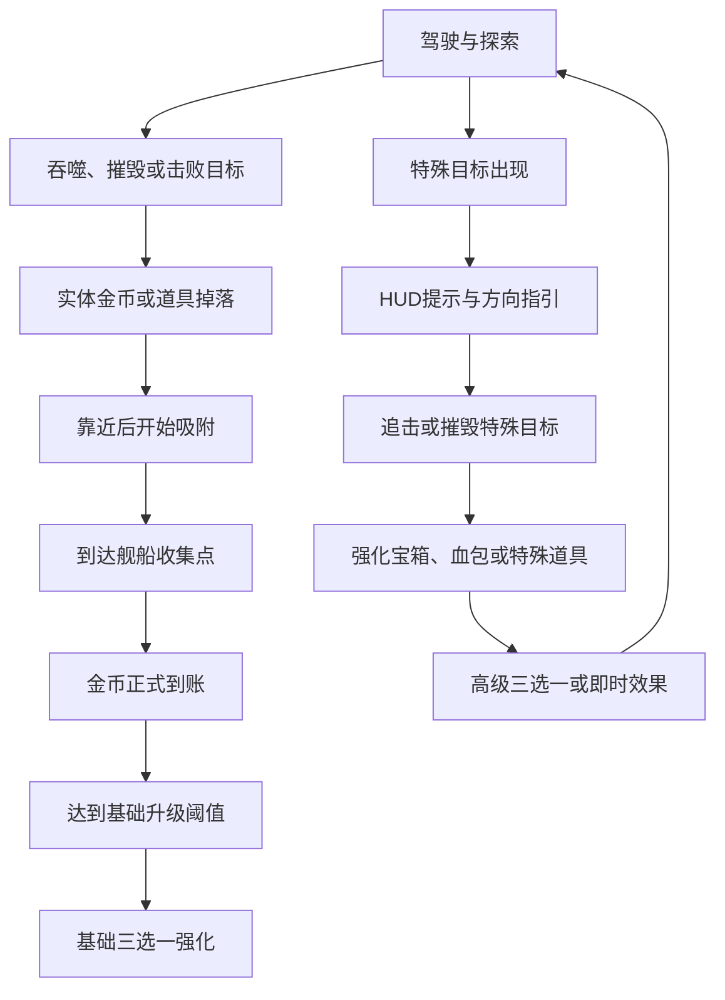
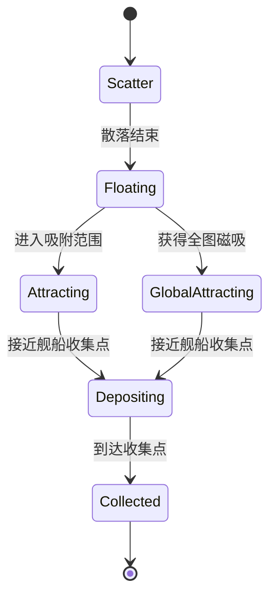

# 《吞吞舰船》实体掉落、高级强化与特殊事件系统设计文档

> 文档版本：V1.0  
> 对应模式：肉鸽远征  
> 文档性质：独立增量设计，不修改或覆盖旧文档文件  
> 规则优先级：涉及金币获得、强化宝箱、特殊目标、低血救援与提示 HUD 时，以本文件为最新规则  
> 配套系统：四武器装配、主动技能、三选一基础强化、加速燃料

---

## 1. 本次扩展目标

本次扩展主要解决四个问题：

1. 将金币从“击杀后直接增加数字”改成完整的实体掉落与吸附流程。
2. 在金币触发的基础三选一之外，增加由强化宝箱触发的高级三选一。
3. 增加追逐目标、救援目标、生产建筑和特殊道具，让海域中出现更多临时目标。
4. 增加特殊目标提示 HUD，让玩家能发现、追踪、成功击败或目送目标逃走。

扩展后的单局循环为：



---

## 2. 奖励层级重新划分

局内奖励分为四个层级：

| 层级 | 获得方式 | 主要内容 | 作用 |
| --- | --- | --- | --- |
| 常规掉落 | 吞噬、击杀、摧毁 | 实体金币 | 推动基础升级进度 |
| 恢复掉落 | 血包箱、血包船、修理设施 | 生命恢复 | 帮助玩家继续战斗 |
| 特殊道具 | 磁吸船、燃料船等 | 全图磁吸、燃料核心等 | 短期改变资源或战斗节奏 |
| 高级奖励 | 强化宝箱、特殊建筑、稀有事件 | 高级三选一 | 改变武器机制和构筑方向 |

### 2.1 基础强化与高级强化的区别

| 项目 | 基础三选一 | 高级三选一 |
| --- | --- | --- |
| 触发来源 | 金币达到升级阈值 | 吸收强化宝箱 |
| 出现频率 | 高 | 低 |
| 主要内容 | 船体数值、武器伤害、射速、范围、燃料等 | 点燃、眩晕、穿透、连锁、留下区域等机制变化 |
| 是否可重复 | 多数可以重复 | 多数唯一或仅可强化一次 |
| 构筑影响 | 稳定成长 | 改变玩法和组合方式 |
| 是否消耗金币 | 不额外消耗 | 不消耗金币 |

高级强化不能只是“伤害再增加 20%”。它应该让玩家明显改变驾驶路线、技能释放顺序或目标选择。

---

## 3. 实体金币掉落系统

## 3.1 最新金币规则

以下行为不会直接增加玩家金币：

- 击败敌舰
- 摧毁海上建筑
- 摧毁可破坏环境物
- 吞噬资源或敌人
- 完成特殊目标

这些行为只负责生成实体金币。金币必须经过以下流程才会计入玩家持有数量：

```text
生成 → 向外散落 → 漂浮等待 → 玩家靠近 → 吸附飞行 → 到达舰船 → 金币到账
```

## 3.2 金币状态机



只有进入 `Collected` 状态后才调用金币增加逻辑。

## 3.3 金币面额

为减少同屏对象数量，金币使用不同面额：

| 类型 | 单枚价值 | 视觉 |
| --- | ---: | --- |
| 小金币 | 1 | 小型铜金色硬币 |
| 中金币 | 5 | 更亮、更厚的金币 |
| 大金币 | 20 | 发光金币或小型钱袋 |
| 金币堆 | 50 | 宝箱碎片包裹的金币堆 |

掉落逻辑优先使用较大面额拆分总价值。例如总价值 37，生成 1 枚大金币、3 枚中金币和 2 枚小金币，而不是生成 37 个对象。

## 3.4 常规掉落参考

| 来源 | 总金币价值 | 掉落形式 |
| --- | ---: | --- |
| 浮木、鱼群、小型资源 | 1～2 | 1～2 枚小金币 |
| 货箱、木筏 | 3～6 | 小金币与中金币 |
| 小型敌舰 | 6～10 | 1 枚中金币 + 小金币 |
| 炮艇 | 12～18 | 中金币为主 |
| 武装商船 | 22～35 | 大金币 + 中金币 |
| 精英舰船 | 35～60 | 大金币、金币堆 |
| 普通可破坏建筑 | 8～20 | 从建筑中心散落 |
| 造船厂 | 60～100 | 多方向大量散落 |
| Boss | 150～250 | 分阶段爆出，结算前自动吸附 |

具体数值仍需跟随基础升级阈值调整，但“实体掉落—吸附—到账”的流程不变。

## 3.5 生成与散落

- 目标死亡、摧毁或完成吞噬动画后生成金币。
- 金币从奖励来源中心向周围 1.5～4m 随机散落。
- 散落阶段持续 0.25～0.5 秒。
- 散落时使用轻微抛物线，落在水面后上下漂浮。
- 同一批金币不要全部向玩家方向飞出，避免看起来像已经自动获得。
- 吞噬目标的金币从船首入口附近重新向外弹出，强调“吞噬后获得战利品”。

## 3.6 普通吸附

| 参数 | 初始值 |
| --- | ---: |
| 基础吸附半径 | 6m |
| 起始吸附速度 | 5m/s |
| 最大吸附速度 | 24m/s |
| 吸附加速度 | 35m/s² |
| 舰船收集点距离 | 0.6m |

吸附规则：

- 金币在散落阶段不能立即吸附，防止刚出现就消失。
- 进入吸附范围后锁定当前玩家舰船。
- 金币沿弧线飞向舰船甲板上的 `LootDepositPoint`。
- 吸附过程中不再与环境碰撞。
- 舰船持续移动时，金币追踪实时收集点，而不是原来的位置。
- 到达收集点时播放音效、缩小消失，并增加金币数值。
- 多枚金币连续到达时，音效提高音调但限制播放频率。

## 3.7 金币到账表现

金币到达舰船后：

1. `CurrencyManager.AddCoins(value)`。
2. 金币 HUD 数字滚动增加，而不是瞬间跳变。
3. 基础升级进度条同步增长。
4. 金币图标产生一次轻微缩放。
5. 如果达到升级阈值，等待当前金币批次到账结束或等待最多 0.25 秒后打开三选一。

这样可以避免第一枚金币刚到账就暂停游戏，导致同批金币停在半空。

## 3.8 金币不会自动消失

为了保证全地图磁吸道具有意义，未收集金币不按普通掉落物的短时间寿命直接销毁。

性能处理方式：

- 相近金币在漂浮 1 秒后允许合并面额。
- 远离玩家且离屏的金币转为轻量级 `VirtualCoinPile` 数据。
- 玩家接近或触发全图磁吸时重新实体化。
- 单个金币堆最大保存价值 50，超过后拆成多个堆。
- 关卡结束时统一清理。

## 3.9 金币合并

- 每 1 秒检查一次附近 2.5m 内的同类漂浮金币。
- 最多把 8 个金币对象合并成一个高价值对象。
- 合并只改变表现对象数量，总价值必须完全保留。
- 已进入吸附状态的金币不再参与合并。
- 玩家视野中心附近的金币延迟合并，避免看见硬币突然消失。

## 3.10 死亡与结算

- 玩家沉没后，尚未到达舰船的金币不计入本局已获得金币。
- Boss 死亡进入胜利阶段时，场上所有金币自动触发一次结算磁吸。
- 胜利结算等待最多 2.5 秒，让金币飞入舰船；超时后把已经锁定的金币直接结算。
- 失败结算不进行自动收集。

---

## 4. 强化宝箱

## 4.1 宝箱定位

强化宝箱是一种漂浮在水面的高级奖励载体。它不会增加普通金币进度，而是直接触发一次高级三选一。

主要来源：

- 宝箱船
- 造船厂
- 精英护航队
- 稀有漂浮遗迹
- 伪装宝箱事件
- Boss 阶段奖励

## 4.2 宝箱收集流程

```text
特殊目标被击败
→ 强化宝箱落入水面
→ 玩家靠近
→ 宝箱吸附到舰船甲板
→ 宝箱打开动画
→ 暂停战斗
→ 弹出高级三选一
→ 选择一项
→ 应用机制强化
→ 恢复战斗
```

宝箱必须到达舰船后才打开。玩家只经过宝箱附近但没有完成吸附时，不弹出选择界面。

## 4.3 宝箱吸附参数

| 参数 | 初始值 |
| --- | ---: |
| 吸附半径 | 7m |
| 吸附速度 | 8→20m/s |
| 漂浮提示光柱 | 40m 内可见 |
| 地图标记持续 | 宝箱被收集前 |

## 4.4 多宝箱排队

如果多个宝箱几乎同时到达舰船：

- 第一个宝箱立即打开高级三选一。
- 其他宝箱进入 `PendingChestQueue`。
- 玩家完成当前选择并恢复游戏 0.3 秒后，再打开下一个。
- HUD 显示“待开启强化宝箱 ×N”。
- 不允许叠加多个全屏选择界面。

## 4.5 高级强化抽取规则

每个强化宝箱生成 3 张不同的高级强化卡：

- 至少 2 张与当前四种攻击手段或技能直接兼容。
- 最多 1 张纯生存或资源强化。
- 已获得的唯一强化不再出现。
- 互斥强化不能同时获得。
- 不满足武器标签要求的强化不进入候选池。
- 三张卡不能全部属于同一种机制，例如不能都是点燃类。
- 如果有效池不足，使用通用高级强化补足。

## 4.6 强化兼容标签

```text
Projectile       炮弹、机炮弹、鱼叉等实体投射物
Explosive        导弹、鱼雷、炸弹等范围爆炸
RapidFire        船员机炮、旋转速射炮
Collision        冲撞前锥
Deployable       漂浮炸弹、火区等布置物
Area             爆炸、声波、雷暴、火区
Drone            无人机
Control          鱼叉、声波、减速
ActiveSkill      所有主动技能
Boost            加速系统
Loot             金币、宝箱、吸附
```

高级强化卡通过标签判断是否适用，并在卡面明确显示受影响武器。

---

## 5. 高级强化库：投射物与炮弹

| 高级强化 | 适用标签 | 效果 | 限制 |
| --- | --- | --- | --- |
| 燃烧弹药 | Projectile | 炮弹命中后点燃敌人 3 秒，每秒造成该次直接伤害的 12% | 同一武器的点燃只刷新时间，不无限叠层 |
| 冰冷弹芯 | Projectile | 命中减速 25%，持续 2.5 秒；连续命中 5 次后短暂冻结普通敌人 0.7 秒 | 与燃烧弹药互斥 |
| 贯穿弹体 | Projectile | 投射物穿过第一个目标继续飞行，后续伤害降低 25% | 爆炸本体不重复触发 |
| 跳弹结构 | Projectile | 命中后向 7m 内另一个目标弹射一次，造成 45% 伤害 | 每发最多弹射一次 |
| 裂片弹头 | Projectile, Explosive | 爆炸后射出 5 枚碎片，每枚造成原伤害 10% | 同一目标最多被 2 枚碎片命中 |
| 追猎校准 | Projectile | 投射物获得轻微方向修正，但最大转向角有限 | 鱼雷和导弹仍可躲避，不变成必中 |
| 双发装填 | Projectile | 每第 5 次普通攻击额外发射一次 65% 伤害的复制攻击 | 技能攻击不计数 |
| 处决弹药 | Projectile | 对生命低于 20% 的普通敌人伤害 +60%，对 Boss +15% | 不直接秒杀 Boss |
| 标记弹 | Projectile | 首次命中标记目标 5 秒，其他武器攻击该目标伤害 +10% | 同一目标不叠加多个标记 |
| 逆向弹道 | Projectile | 投射物未命中并到达最大距离后，向玩家方向返回一次 | 返回弹不会伤害玩家 |

---

## 6. 高级强化库：爆炸与区域

| 高级强化 | 适用标签 | 效果 | 限制 |
| --- | --- | --- | --- |
| 燃烧海面 | Explosive, Area | 爆炸后留下 4 秒燃烧区域，每秒造成爆炸伤害的 10% | 同源火区重叠最多按 2 层计算 |
| 震荡爆破 | Explosive | 爆炸中心的普通敌人眩晕 1 秒，精英 0.35 秒 | Boss 只减速 15% 持续 1 秒 |
| 内爆引信 | Explosive | 爆炸前 0.35 秒把小型敌人向中心拉近 2.5m | 对 Boss 无牵引 |
| 连环爆炸 | Explosive | 爆炸击杀敌人时产生一次 45% 伤害的次级爆炸 | 次级爆炸不能再次触发连环爆炸 |
| 核心增压 | Explosive | 爆炸中心 35% 区域伤害提高至 145%，外圈不变 | 强化站位要求 |
| 扩散冲击 | Explosive, Area | 范围 +25%，但基础伤害 -10% | 适合清群构筑 |
| 延迟二爆 | Explosive | 首次爆炸 0.8 秒后在原地发生 35% 伤害的第二次爆炸 | 同目标可以被两次命中 |
| 破甲震波 | Explosive, Area | 命中后降低敌人 15% 护甲，持续 5 秒 | 同效果只刷新持续时间 |
| 海浪传导 | Area | 范围攻击命中水面后向外扩散一圈 25% 伤害余波 | 每次攻击只扩散一次 |
| 暴击爆心 | Explosive | 爆炸中心可以暴击，基础暴击率 20%，暴击伤害 170% | 外圈不能暴击 |

---

## 7. 高级强化库：冲撞与控制

| 高级强化 | 适用标签 | 效果 | 限制 |
| --- | --- | --- | --- |
| 震晕撞角 | Collision | 有效冲撞使普通敌人眩晕 1.2 秒、精英 0.4 秒 | 同一目标 3 秒内只触发一次；Boss 不眩晕 |
| 冲击余震 | Collision | 冲撞点产生 4m 冲击波，造成撞击伤害的 45% | 同一敌人不同时吃主撞与完整余震 |
| 破阵穿行 | Collision | 撞毁小型敌人后 2 秒内速度损失降低 70% | 只对小型目标生效 |
| 重甲船首 | Collision | 有效冲撞后获得最大生命 8% 的护盾，持续 4 秒 | 6 秒内最多触发一次 |
| 猎杀撞击 | Collision | 对被减速、眩晕或标记的目标冲撞伤害 +35% | 鼓励武器联动 |
| 残骸爆散 | Collision | 冲撞击杀敌人时向周围射出残骸，造成范围伤害 | 每 0.5 秒最多触发一次 |
| 控制增伤 | Control | 被击退、牵引或减速的敌人 3 秒内受到爆炸伤害 +15% | 只刷新持续时间 |
| 反复震荡 | Control, Area | 同一敌人被不同控制效果命中时产生 20 点额外伤害 | 每目标 1 秒冷却 |

---

## 8. 高级强化库：速射、船员与无人机

| 高级强化 | 适用标签 | 效果 | 限制 |
| --- | --- | --- | --- |
| 压制射击 | RapidFire | 连续命中同一目标 8 次后，使其伤害降低 15%，持续 3 秒 | Boss 降低为 6% |
| 曳光校准 | RapidFire | 连续攻击同一目标时，每秒命中率和伤害 +4%，最多 20% | 切换目标后清空 |
| 弹药风暴 | RapidFire | 每第 20 发触发一次 180% 伤害的强化弹 | 不由技能额外复制触发 |
| 击杀转火 | RapidFire | 击杀目标后 3 秒内攻击频率 +30% | 不重复叠加，只刷新时间 |
| 船员掠夺手 | RapidFire, Loot | 船员击杀敌人时额外掉落 1 枚小金币，30% 概率触发 | 每秒最多额外掉落 2 枚 |
| 无人机炸弹 | Drone | 每架无人机每 6 秒投下一枚小型炸弹 | 临时技能无人机不触发 |
| 护航屏障 | Drone | 无人机返回舰船附近时为玩家恢复少量护盾 | 每架 8 秒冷却 |
| 蜂群标记 | Drone | 3 架以上无人机攻击同一目标时使其进入 12% 易伤 | 无人机离开后延迟 1 秒消失 |

---

## 9. 高级强化库：技能、移动与资源

| 高级强化 | 适用标签 | 效果 | 限制 |
| --- | --- | --- | --- |
| 技能回响 | ActiveSkill | 主动技能结束 1.2 秒后复制一次 30% 强度的核心效果 | 召唤类改为延长 20%，不重复召唤完整单位 |
| 交替装填 | ActiveSkill | 使用一个技能后，其他三个技能各减少 2 秒冷却 | 3 秒内最多触发一次 |
| 战术充能 | ActiveSkill | 击败精英或特殊目标后，冷却最长的技能恢复 35% | 同一目标只触发一次 |
| 危急超载 | ActiveSkill | 生命低于 25% 时立即完成一个随机技能冷却 | 每局一次 |
| 瞄准静滞 | ActiveSkill | 区域技能进入瞄准后，0.25 倍时间最长延长至 3 秒 | 不影响 Boss 技能预警计时下限 |
| 超速尾焰 | Boost, Area | 加速时船尾留下 2 秒伤害尾流 | 同一目标每 0.5 秒最多受伤一次 |
| 掠夺推进 | Boost, Loot | 收集金币时恢复少量加速燃料，每 10 金币恢复 1 点 | 不能超过燃料上限 |
| 完美点火 | Boost | 满燃料启动加速后的前 2 秒速度倍率额外 +15% | 每次加速只触发一次 |
| 高速装填 | Boost | 持续加速 2 秒后，普通武器冷却速度提高 20% | 停止加速立即结束 |
| 金币护航 | Loot | 每收集 50 金币获得最大生命 6% 护盾，持续 6 秒 | 不能反复刷新超过 12% |
| 宝藏嗅觉 | Loot | 特殊宝箱、宝箱船和漂浮宝箱的提示距离 +40% | 不改变生成数量 |
| 强力磁场 | Loot | 普通金币吸附半径 +60%，吸附速度 +35% | 不等同于全图磁吸 |

---

## 10. 高级强化互斥与限制

以下强化建议设置互斥组：

| 互斥组 | 强化 |
| --- | --- |
| ProjectileElement | 燃烧弹药、冰冷弹芯 |
| ProjectilePath | 贯穿弹体、逆向弹道 |
| ExplosionShape | 核心增压、扩散冲击 |
| RamDefense | 重甲船首、纯伤害型高级撞角进化，后续扩展 |

互斥不代表整套构筑只能有一种元素。不同武器以后可以分别附着不同元素，但同一全局高级强化不能同时让所有投射物既燃烧又冻结。

高级强化默认只获取一次。需要进一步成长时，应设计对应的“进阶版宝箱强化”，而不是重复获得同一张卡堆数值。

---

## 11. 漂浮血包箱

## 11.1 类型

| 类型 | 治疗量 | 吸附半径 | 视觉 |
| --- | ---: | ---: | --- |
| 小型血包箱 | 最大生命 12% | 6m | 小型白红补给箱 |
| 大型血包箱 | 最大生命 30% | 7m | 大型发光修理箱 |
| 紧急维修箱 | 最大生命 50% | 8m | 稀有金属箱，出现较少 |

## 11.2 收集规则

- 玩家生命低于 100% 时才主动吸附。
- 满血时靠近不会自动浪费，箱子显示“生命已满”。
- 一旦开始吸附，血包会飞向舰船维修点。
- 到达舰船后才恢复生命。
- 恢复量不能超过最大生命。
- 如果吸附途中玩家已经被其他效果回满，血包仍会到达并恢复 0，不转换为金币。
- 该情况较少，后续可通过“溢出治疗转护盾”的高级强化利用。

## 11.3 掉落来源

- 普通敌舰低概率掉落小型血包箱。
- 精英敌舰中等概率掉落小型或大型血包箱。
- 血包船必定掉落恢复箱。
- 修理浮台被激活后持续提供恢复。
- Boss 阶段转换时可固定生成一个小型血包，降低连续阶段压力。

---

## 12. 宝箱船

## 12.1 定位

低攻击性、高价值、持续逃跑的限时追逐目标。

### 基础行为

- 出现后优先远离玩家。
- 航向朝地图中较安全的外圈移动。
- 不主动攻击，受到伤害后释放烟雾或漂浮障碍。
- 速度略高于玩家普通航速，但低于玩家加速航速。
- 出现后存在 55 秒，接近逃离边界时显示倒计时。

### 基础参数

| 参数 | 初始建议 |
| --- | ---: |
| 生命 | 当前分钟数 ×45 + 140 |
| 速度 | 玩家基础最大速度的 1.08 倍 |
| 转向 | 中等 |
| 存在时间 | 55 秒 |
| 普通金币 | 25～40 |
| 核心掉落 | 1 个强化宝箱 |

### 击败奖励

- 掉落实体金币。
- 掉落一个悬浮强化宝箱。
- 小概率额外掉落小型血包箱。

## 12.2 出现间隔

- 首次出现：开局 90～130 秒。
- 后续间隔：150～210 秒随机。
- 同时最多存在 1 艘。
- Boss 正式出现后暂停刷新。
- 已有未收集强化宝箱时仍可刷新宝箱船，但不会连续 30 秒内出现两次。

---

## 13. 造船厂

## 13.1 定位

固定在海上的生产型敌方建筑，会不断制造小型船。玩家不摧毁它，附近敌人压力会持续增加；摧毁后获得高级奖励。

### 基础行为

- 每 10～14 秒生产一艘小型船。
- 造船厂所属小型船同时最多 4 艘。
- 达到上限后停止生产，直到已有单位死亡。
- 受到攻击时缩短下一次生产时间 20%，但不能低于 6 秒。
- 周围可以有 2 个防御炮台，Demo 可后续加入。

### 基础参数

| 参数 | 初始建议 |
| --- | ---: |
| 生命 | 480 + 当前分钟数 ×60 |
| 护甲 | 中等 |
| 生产间隔 | 12 秒 |
| 生产上限 | 4 艘 |
| 金币掉落 | 60～100 |
| 核心掉落 | 1 个强化宝箱 |

## 13.2 摧毁表现

1. 停止生产。
2. 船坞结构分段爆炸。
3. 大量实体金币从不同建筑区域散落。
4. 强化宝箱从主建筑中弹出并落入水面。
5. 尚存的生产小船失去增援，但不会立即死亡。

## 13.3 生成方式

- 可以在地图生成时固定放置 1～2 座。
- 也可以在第 2～4 分钟由事件导演激活远处船厂。
- 船厂激活时显示世界方向提示，但不设置严格逃跑倒计时。
- 已经存在一座活动造船厂时，不再生成第二座，除非地图规模扩大。

---

## 14. 磁吸船

## 14.1 定位

高机动特殊目标。击败后掉落全图磁吸道具，让本地图所有尚未收集的金币向玩家舰船飞来。

### 基础行为

- 持续逃离玩家。
- 速度比宝箱船略快，但转弯较差。
- 周期性释放短暂干扰，使玩家普通金币吸附半径降低 30%，持续 2 秒。
- 自身不掉强化宝箱，主要奖励是全图磁吸。

### 基础参数

| 参数 | 初始建议 |
| --- | ---: |
| 生命 | 当前分钟数 ×40 + 130 |
| 速度 | 玩家基础最大速度的 1.12 倍 |
| 存在时间 | 50 秒 |
| 普通金币 | 10～20 |
| 核心掉落 | 1 个全图磁吸道具 |

## 14.2 全图磁吸道具

玩家靠近道具后，道具先吸附到舰船。到达舰船后启动全图磁吸：

1. 查询 `CoinRegistry` 中所有实体金币和虚拟金币堆。
2. 虚拟金币在地图原位置重新生成简化飞行表现，或直接按区域批次生成金币流。
3. 金币按距离分成多个波次飞向玩家，避免同一帧全部生成。
4. 最近金币立即吸附，远处金币在 0.2～2.5 秒内依次启动。
5. 每枚金币仍需到达舰船后才正式到账。
6. HUD 显示“全海域金币回收中”。

### 性能规则

- 单帧最多启动 30 个金币飞行对象。
- 超过表现上限的远处金币按价值合并为金币流。
- 全图磁吸过程最长 4 秒。
- 最后 0.5 秒仍未完成的极远虚拟金币可以直接生成在摄像机外侧，再飞入舰船。
- 总价值必须与 `CoinRegistry` 记录完全一致。

## 14.3 出现间隔

- 首次出现：开局 180～240 秒。
- 后续间隔：240～330 秒。
- 5～8 分钟 Demo 通常出现 1 次，较长关卡可以出现 2 次。
- 同时最多存在 1 艘。
- 场上金币总价值低于 30 时不刷新，避免奖励没有意义。

---

## 15. 血包船

## 15.1 定位

玩家低血时由动态救援系统生成的追逐目标。玩家必须根据 HUD 方向追上并击败它，才能获得恢复资源。

### 基础行为

- 不主动攻击。
- 速度约为玩家普通最大速度的 90%～100%，确保低血玩家不用耗尽全部燃料也能追上。
- 逃跑路线避开高密度敌群。
- 存在时间 65 秒，比宝箱船更宽松。
- 船体使用明显红白医疗标记。

### 掉落

- 必定掉落 1 个大型血包箱。
- 额外掉落 2～4 个小型血包箱。
- 不掉落强化宝箱。
- 默认不掉落金币，防止玩家故意压低血量刷经济。

## 15.2 低血刷新条件

同时满足以下条件时才进入候选：

- 当前生命 ≤35%。
- 低血状态持续至少 6 秒。
- 玩家周围 35m 内没有大型血包箱。
- 场上不存在血包船。
- 距离上一次血包船出现至少 120 秒。
- 当前不是胜利、失败或强制剧情状态。

刷新后，玩家生命恢复到 60%以上才重置本轮低血触发资格。避免血量在 34%～36% 间波动导致反复生成。

## 15.3 防刷取规则

- 每局最多生成 2 艘低血救援船。
- 第二次生成时只掉落 1 个大型和 1 个小型血包。
- 玩家主动撞环境把自己降到低血仍可触发救援，但无金币可刷。
- Boss 战中如果允许刷新，只在 Boss 阶段转换或场上安全窗口刷新。

---

## 16. 更多特殊内容

## 16.1 燃料运输船

### 行为

- 中速逃跑，船尾拖着发光燃料罐。
- 受到火焰或爆炸伤害时可能提前爆炸，对周围敌我都造成伤害。
- 提前爆炸仍掉落燃料核心，但核心数量减少。

### 掉落：推进核心

- 到达舰船后立即恢复 70% 最大加速燃料。
- 之后 8 秒燃料消耗降低 40%。
- 燃料已满时仍可获得后半段减耗效果。

### 出现条件

- 玩家燃料低于 25% 且近期频繁使用加速时提高刷新权重。
- 每 150 秒最多出现一次。

## 16.2 修理浮台

- 固定漂浮设施，不需要摧毁。
- 玩家进入 8m 范围并保持低速 2 秒后启动修理。
- 每秒恢复最大生命 4%，最多恢复 30%。
- 修理期间浮台会发光并吸引附近敌人。
- 使用完毕后关闭，不再重复恢复。
- 玩家可以选择冒险停船修理，形成风险决策。

## 16.3 武装宝藏护航队

- 由 1 艘载宝船和 2～4 艘护卫舰组成。
- 载宝船逃跑，护卫舰主动阻挡玩家。
- 只击败护卫舰不会掉强化宝箱。
- 载宝船被击败后掉落大量金币和 1 个强化宝箱。
- 如果先摧毁全部护卫，载宝船速度降低 20%。

## 16.4 漂浮金库

- 固定在水面的厚重金库箱。
- 不能直接吸附，需要通过武器攻击或有效冲撞破坏外壳。
- 外壳具有较高生命但不反击。
- 开启后掉落大量实体金币，小概率掉落强化宝箱。
- 金库周围可能存在水雷或伏击敌舰。

## 16.5 伪装宝箱船

- 外观看起来像普通宝箱船。
- 玩家接近或打掉 50% 生命时展开武器，变成精英战斗舰。
- 击败后掉落 1 个强化宝箱和额外金币。
- HUD 使用略有异常的宝箱图标，为观察仔细的玩家提供提示。

## 16.6 沉船遗迹

- 海面漂浮一片大型残骸区。
- 玩家可以吞噬小残骸并获得金币。
- 中央残骸需要持续攻击后打开。
- 可能掉落金币、血包、燃料核心或强化宝箱。
- 每个遗迹在生成时确定奖励，不允许反复读取随机结果刷取。

## 16.7 风暴采集船

- 在小型雷暴区域中缓慢航行。
- 玩家追击时需要躲避周期雷击。
- 击败后掉落“风暴核心”：立即完成雷电类武器技能冷却；没有雷电武器时，改为随机完成一个技能冷却并恢复燃料。
- 只有玩家装配雷暴武器或关卡进入中后期时提高出现权重。

## 16.8 黄金巨鲸

- 稀有中立生物，不主动攻击。
- 受到攻击后高速逃跑并周期性掉落少量金币。
- 击败后掉落大量金币，但不会掉高级强化。
- 玩家也可以只追逐一段距离收集沿途金币，不一定必须击杀。
- 每局最多出现一次，作为纯经济惊喜事件。

## 16.9 海盗补给信标

- 摧毁信标前，周围敌人攻击频率提高 15%。
- 摧毁后掉落金币，并在周围生成 1 个小型血包和少量燃料。
- 信标本身没有逃跑行为，适合作为敌群中的优先目标。

## 16.10 爆炸油料船

- 速度慢、生命低、持续靠近敌人密集区。
- 被摧毁时产生巨大无阵营爆炸，可同时伤害敌人与玩家。
- 不掉金币或只掉少量金币，主要价值是借其爆炸清理敌群。
- HUD 不提供全图提示，只在玩家视野内标记危险范围。

---

## 17. 特殊目标分类

| 分类 | 内容 | 是否逃跑 | 主要奖励 |
| --- | --- | --- | --- |
| 追逐奖励 | 宝箱船、磁吸船、燃料运输船、黄金巨鲸 | 是 | 宝箱、磁吸、燃料、金币 |
| 低血救援 | 血包船 | 是，但速度较低 | 血包 |
| 固定威胁 | 造船厂、补给信标 | 否 | 宝箱、金币、恢复 |
| 风险奖励 | 护航队、伪装宝箱、风暴采集船 | 部分 | 高级强化、特殊核心 |
| 探索资源 | 漂浮金库、沉船遗迹、修理浮台 | 否 | 混合奖励 |
| 战术物体 | 爆炸油料船 | 慢速移动 | 环境爆炸 |

---

## 18. 特殊事件导演

## 18.1 系统职责

`SpecialEventDirector` 负责：

- 按时间窗口选择特殊目标。
- 检查玩家生命、燃料、场上金币和当前难度。
- 避免多个高价值目标同时出现。
- 控制特殊目标出生位置和逃跑方向。
- 通知 HUD 创建提示和方向指引。
- 记录成功、失败和本局出现次数。

## 18.2 并发限制

- 同时最多 1 个限时追逐目标。
- 同时最多 1 个低血救援目标。
- 同时最多 1 个大型固定特殊建筑。
- 追逐目标与低血救援可以同时存在，但 HUD 必须区分优先级。
- Boss 出现前 20 秒不再刷新普通追逐目标。
- Boss 战中默认暂停宝箱船、磁吸船和黄金巨鲸。

## 18.3 推荐时间表

| 时间 | 候选事件 |
| --- | --- |
| 0:00～1:00 | 普通资源、小型血包、沉船碎片 |
| 1:00～2:15 | 首艘宝箱船、漂浮金库 |
| 2:00～3:30 | 造船厂、燃料运输船、护航队 |
| 3:00～4:30 | 磁吸船、伪装宝箱、风暴采集船 |
| 4:00～Boss 前 | 第二次宝箱船、黄金巨鲸、补给信标 |
| 任意时间低血 | 血包船或修理浮台，提高优先级 |

## 18.4 出生位置

- 出生在摄像机外 40～70m。
- 不能出生在玩家船头 15m 内。
- 不能出生在地图边界外或大型障碍内部。
- 逃跑目标出生时，必须至少有一条可通向地图内部的安全路线。
- 血包船优先出生在敌人密度较低的一侧。
- 特殊目标出生后 1 秒内获得短暂无碰撞保护，防止与其他单位重叠爆炸。

## 18.5 随机与保底

- 所有时间间隔加入随机浮动，避免每局固定背时间。
- 开局 150 秒内至少出现一次高级奖励机会。
- 玩家 4 分钟仍未获得强化宝箱时，提高宝箱船或造船厂权重。
- 玩家低血救援独立于普通事件权重，不被倒霉随机完全阻止。
- 同一事件连续出现两次后降低权重，增加单局变化。

---

## 19. 特殊目标提示 HUD

## 19.1 提示层级

特殊目标提示由四部分组成：

1. 出现横幅
2. 屏幕边缘方向箭头
3. 世界空间标记
4. 特殊目标列表

## 19.2 出现横幅

目标出现时在顶部中央显示 2.5～3 秒：

```text
[宝箱图标] 宝箱船出现！
追上它，夺取高级强化宝箱。
```

不同目标示例：

- `磁吸船出现！击败它，回收全海域金币。`
- `发现敌方造船厂！摧毁它，停止增援。`
- `舰体严重受损！医疗补给船已被发现。`
- `燃料运输船出现！夺取推进核心。`

横幅不能遮挡 Boss 血条。Boss 存在时特殊提示下移或改为侧边提示。

## 19.3 屏幕边缘方向箭头

当特殊目标在屏幕外时显示：

- 目标图标
- 指向目标的箭头
- 与玩家的距离
- 目标剩余时间或逃离倒计时
- 目标生命简化环，可选

箭头沿屏幕安全区边缘移动，不能跑到刘海、超宽屏边缘或暂停按钮下方。

## 19.4 世界空间标记

- 目标上方显示图标和名称。
- 远距离时显示垂直光柱或烟雾信号。
- 宝箱船使用金色。
- 磁吸船使用蓝紫色。
- 血包船使用红白色。
- 造船厂使用橙红色威胁标记。
- 标记不能被普通伤害数字遮挡。

## 19.5 特殊目标列表

屏幕左侧或右侧显示最多 3 个活动目标：

```text
特殊目标
├── 医疗补给船  42秒  95m
├── 磁吸船      31秒  130m
└── 造船厂      无时限 160m
```

超过 3 个时按优先级隐藏低级目标，但世界标记仍可存在。

## 19.6 HUD 优先级

| 优先级 | 事件 |
| ---: | --- |
| 100 | 低血救援船、即将逃离的目标 |
| 90 | Boss 关键阶段提示 |
| 80 | 磁吸船、强化宝箱即将消失，若设置寿命 |
| 70 | 宝箱船、护航队 |
| 60 | 造船厂、补给信标 |
| 50 | 燃料船、风暴采集船 |
| 40 | 金库、遗迹、修理浮台 |

Boss 提示和低血提示可以同时存在，但音效不能重叠播放。高优先级音效会压低普通提示音。

## 19.7 成功与失败提示

### 成功

- `宝箱船已击沉！强化宝箱已掉落。`
- `磁吸核心已掉落，前往回收。`
- `造船厂已摧毁，敌方增援停止。`

### 目标逃跑

- `宝箱船已逃离。`
- `磁吸船脱离海域。`

失败提示只显示 2 秒，不弹确认框，不打断战斗。

### 掉落未收集

特殊目标被击败后，HUD 追踪对象从“目标船”切换为“掉落物”：

```text
宝箱船 → 强化宝箱
磁吸船 → 磁吸核心
血包船 → 大型血包箱
```

这样玩家击败目标后不会因为驶过头而找不到奖励。

---

## 20. 低血状态 HUD

## 20.1 低血分级

| 生命比例 | 状态 | HUD |
| --- | --- | --- |
| 50%～100% | 正常 | 无额外提示 |
| 30%～50% | 受损 | 生命条轻微闪烁、船体冒烟 |
| 15%～30% | 危险 | 屏幕边缘轻微红色脉冲，提示恢复来源 |
| 0%～15% | 临界 | 更强警报，但限制频率，方向箭头强化 |

## 20.2 血包船引导

当血包船刷新时：

1. 播放一次无线电或提示音。
2. 顶部显示“医疗补给船已出现”。
3. 屏幕边缘出现红白箭头。
4. 显示距离和存在倒计时。
5. 如果玩家朝相反方向航行超过 5 秒，箭头短暂放大一次。
6. 目标进入屏幕后，边缘箭头切换为世界标记。

不使用持续语音催促，避免玩家在 Boss 战中感到烦躁。

## 20.3 已有恢复物时

如果场上已经存在大型血包：

- 优先指向最近的大型血包，而不是立即刷新血包船。
- 如果血包距离超过 120m 或被危险区域包围，仍可生成血包船。
- HUD 文案改为“附近发现维修补给”。

---

## 21. 特殊道具

## 21.1 磁吸核心

- 全图金币吸附。
- 不吸附血包、强化宝箱和其他特殊道具。
- 不直接把金币数字一次性加到 HUD，仍展示分批飞入和到账。

## 21.2 推进核心

- 恢复燃料并短时降低消耗。
- 到达舰船时立即生效。
- HUD 显示剩余增益时间。

## 21.3 应急修理核心

- 由稀有医疗目标掉落。
- 立即恢复 25% 最大生命。
- 之后 10 秒每秒恢复 2%，受到伤害不会中断。

## 21.4 临时护盾核心

- 提供最大生命 20% 护盾，持续 12 秒。
- 护盾优先承受伤害。
- 不恢复真实生命。

## 21.5 技能充能核心

- 完成当前冷却最长的两个主动技能 50% 冷却。
- 已经准备完成的技能不作为目标。
- 所有技能都已准备时，改为获得 10 秒技能伤害 +15%。

---

## 22. 掉落物公共规则

所有可吸附掉落物实现统一接口：

```csharp
public interface IAttractablePickup
{
    PickupType PickupType { get; }
    bool CanAttract(PlayerShip player);
    void BeginAttract(PlayerShip player);
    void OnArrive(PlayerShip player);
}
```

### 22.1 公共状态

```text
Spawned
Scatter
Floating
Attracting
Arrived
Consumed
```

### 22.2 防重复结算

- `BeginAttract` 只能从 Floating 进入一次。
- 到达时先把状态改为 Arrived，再执行奖励。
- 对象回收前不能再次触发碰撞。
- 每个掉落物有唯一 `PickupInstanceId`。
- 存档或场景恢复时已消费 ID 不重新生成。

### 22.3 吸附优先级

当多个掉落物同时靠近：

1. 血包，前提是玩家缺血
2. 强化宝箱
3. 特殊核心
4. 大面额金币
5. 小面额金币

优先级只影响表现启动顺序，不阻止其他物品吸附。

---

## 23. Unity 数据结构

## 23.1 掉落表

```text
LootTableDefinition
├── LootTableId
├── Entries[]
│   ├── PickupDefinition
│   ├── Weight
│   ├── MinCount
│   ├── MaxCount
│   ├── Guaranteed
│   └── Conditions
└── CoinValueRange
```

## 23.2 高级强化定义

```text
AdvancedUpgradeDefinition
├── UpgradeId
├── DisplayName
├── Description
├── Icon
├── RequiredTags[]
├── ExcludedTags[]
├── ExclusiveGroupId
├── IsUnique
├── Weight
├── EffectData
└── VFXReference
```

## 23.3 特殊事件定义

```text
SpecialEventDefinition
├── EventId
├── DisplayName
├── EventType
├── SpawnTimeWindow
├── RepeatCooldownRange
├── MaxPerRun
├── ConcurrentGroup
├── PlayerStateConditions
├── SpawnPrefab
├── RewardTable
├── HudPriority
├── TimeLimit
└── BossPhasePolicy
```

## 23.4 金币注册数据

```text
CoinRegistry
├── ActiveCoinPickups
├── VirtualCoinPiles
├── TotalUncollectedValue
├── RegisterCoin
├── MergeCoins
├── VirtualizeFarCoins
└── StartGlobalAttract
```

---

## 24. 主要脚本职责

| 脚本 | 职责 |
| --- | --- |
| `LootDropper` | 根据来源和掉落表生成金币、血包、宝箱与核心 |
| `CoinPickup` | 金币散落、漂浮、吸附、到账和回收 |
| `CoinRegistry` | 记录实体与虚拟金币、合并、全图磁吸 |
| `PickupAttractor` | 检测玩家附近可吸附物并按优先级启动 |
| `HealthPackPickup` | 缺血判断、吸附与生命恢复 |
| `UpgradeChestPickup` | 宝箱吸附、排队和高级三选一触发 |
| `AdvancedUpgradeDraft` | 兼容过滤、互斥过滤和三卡生成 |
| `SpecialEventDirector` | 时间、玩家状态和并发事件管理 |
| `SpecialTargetController` | 特殊船逃跑、限时、奖励和完成事件 |
| `ShipyardSpawner` | 造船厂生产上限和归属单位管理 |
| `LowHealthRescueSystem` | 低血检测、救援资格和防刷取 |
| `GlobalMagnetController` | 分批启动全图金币吸附 |
| `SpecialTargetHUD` | 横幅、方向箭头、世界标记和目标列表 |
| `PickupQueueController` | 多个宝箱与特殊奖励的顺序处理 |

---

## 25. 性能规范

## 25.1 必须池化

- 所有面额金币
- 血包箱
- 强化宝箱
- 特殊核心
- 掉落散射特效
- 吸附轨迹
- HUD 世界标记
- 方向箭头

## 25.2 更新频率

- 漂浮金币不需要每帧查找玩家，由玩家吸附器统一检测。
- 远处特殊目标 AI 可降低到每 0.1～0.2 秒更新一次。
- HUD 距离每 0.1 秒刷新，方向箭头可以每帧平滑插值。
- 金币合并和虚拟化每 1 秒分批处理。
- 低血救援条件每 0.5 秒检查一次，不需每帧检查。

## 25.3 同屏建议上限

| 对象 | 表现上限 |
| --- | ---: |
| 实体金币 | 120 |
| 同时吸附金币 | 80 |
| 血包与特殊核心 | 20 |
| 未开启强化宝箱 | 5 |
| 活动特殊目标 HUD | 3 个列表项 + 世界标记 |
| 同时打开三选一 | 1 |

超过上限时优先合并金币，不删除价值。

---

## 26. 数值监控

每局记录：

- 生成金币总价值。
- 实际收集金币价值。
- 未收集金币价值。
- 普通吸附获得与全图磁吸获得的比例。
- 玩家从发现金币到完成收集的平均时间。
- 强化宝箱出现、获得和未拾取数量。
- 每张高级强化的选择率和胜率。
- 宝箱船、磁吸船、血包船的追击成功率。
- 特殊目标平均追击时间。
- 低血救援触发时的玩家生命和最终存活时间。
- 血包溢出治疗比例。

推荐初始目标：

| 指标 | 目标区间 |
| --- | --- |
| 常规金币收集率 | 70%～90% |
| 宝箱船击败率 | 55%～75% |
| 磁吸船击败率 | 45%～65% |
| 血包船击败率 | 70%～90% |
| 强化宝箱每局获得数 | 2～4 个 |
| 高级强化单项选择率 | 不长期低于 8% 或高于 45% |
| 血包溢出比例 | 低于 15% |

---

## 27. 分阶段实现顺序

## 阶段 1：实体金币

- 删除或禁用击杀后直接增加金币的旧逻辑。
- 实现金币生成、散落、漂浮、普通吸附和到账。
- 接入金币 HUD 与基础升级进度。
- 实现金币面额和对象池。

验收：任何来源的金币都必须到达舰船后才增加数量。

## 阶段 2：血包与通用吸附

- 抽象 `IAttractablePickup`。
- 实现大小血包、满血不浪费和恢复反馈。
- 统一金币、血包、宝箱和核心的吸附表现。

## 阶段 3：强化宝箱与高级三选一

- 实现强化宝箱吸附和打开流程。
- 建立高级强化标签、兼容和互斥规则。
- 首批实现 12～18 个机制强化。
- 完成多宝箱排队。

## 阶段 4：首批特殊目标

优先实现：

1. 宝箱船
2. 造船厂
3. 磁吸船
4. 血包船

这四种已经覆盖限时追逐、固定生产、全图资源回收和动态救援。

## 阶段 5：HUD 指引

- 出现横幅
- 屏幕边缘箭头
- 世界标记
- 距离与倒计时
- 成功、逃离和掉落转接提示

## 阶段 6：事件导演与扩展内容

- 实现时间窗口、并发组、随机冷却和保底。
- 加入燃料运输船、护航队、金库、遗迹和修理浮台。
- 最后再加入伪装宝箱、风暴采集船和黄金巨鲸等稀有事件。

---

## 28. 验收清单

### 金币掉落

- [ ] 击败敌人不会直接增加金币。
- [ ] 摧毁建筑不会直接增加金币。
- [ ] 吞噬目标不会直接增加金币。
- [ ] 所有来源都会生成价值正确的实体金币。
- [ ] 金币到达舰船后才增加 HUD 数值。
- [ ] 同一金币不能重复结算。
- [ ] 金币合并前后总价值完全一致。
- [ ] 玩家失败后未到账金币不计入结算。

### 强化宝箱

- [ ] 宝箱到达舰船后才打开高级三选一。
- [ ] 高级强化与基础数值强化有明显区别。
- [ ] 至少两张卡与当前装配兼容。
- [ ] 已获得唯一强化不重复出现。
- [ ] 互斥强化不能同时获得。
- [ ] 多宝箱同时获得时能够依次打开。

### 血包

- [ ] 满血时血包不会自动浪费。
- [ ] 血包到达舰船后才恢复生命。
- [ ] 大小血包有清晰视觉区别。
- [ ] 治疗不超过最大生命。

### 宝箱船

- [ ] 出现时有横幅、箭头和世界标记。
- [ ] 普通航速难以长期追上，加速航行可以追上。
- [ ] 击败后掉落实体金币和强化宝箱。
- [ ] 目标逃跑后正确显示失败提示并清理 HUD。

### 造船厂

- [ ] 按间隔生产小型船。
- [ ] 达到生产上限后停止生产。
- [ ] 摧毁后不再产生单位。
- [ ] 掉落金币和强化宝箱。

### 磁吸船

- [ ] 场上金币价值过低时不会刷新。
- [ ] 击败后掉落磁吸核心。
- [ ] 核心到达舰船后才启动全图磁吸。
- [ ] 实体与虚拟金币都能被正确回收。
- [ ] 全图吸附过程不会产生明显卡顿。
- [ ] 全图磁吸前后金币总价值守恒。

### 低血救援

- [ ] 生命低于阈值并持续一定时间才触发。
- [ ] 已有附近大型血包时优先指引现有血包。
- [ ] 血包船掉落恢复物但不提供可刷金币。
- [ ] 同一低血阶段不会反复刷新。
- [ ] 每局刷新次数受限。

### HUD

- [ ] 多目标同时存在时按优先级显示。
- [ ] 方向箭头始终指向正确目标。
- [ ] 目标进入画面后切换为世界标记。
- [ ] 击败目标后提示自动转向掉落物。
- [ ] Boss 血条不会被特殊目标横幅遮挡。
- [ ] 暂停和三选一界面打开时 HUD 不继续倒计时。

---

## 29. 最小可玩扩展版本

第一轮建议只实现以下内容：

- 实体金币与三种面额
- 普通吸附、金币到账和基础升级进度
- 小型与大型血包箱
- 强化宝箱和 15 个高级强化
- 宝箱船
- 造船厂
- 磁吸船与全图磁吸
- 低血血包船
- 出现横幅、边缘方向箭头、距离和倒计时

第二轮再加入燃料运输船、修理浮台、护航队、漂浮金库、沉船遗迹和稀有事件。

这套扩展完成后，海域不再只是重复吞噬普通资源和攻击普通敌舰。玩家会不断在以下目标之间做选择：

- 继续收集附近金币，还是加速追赶即将逃跑的宝箱船。
- 冒险前往造船厂获取高级强化，还是先清理不断生成的小船。
- 低血时继续输出 Boss，还是跟随提示寻找血包船。
- 立即收集附近掉落，还是击败磁吸船一次性回收全地图金币。

这些临时目标能够让单局路线、资源节奏和构筑成长产生明显变化。
