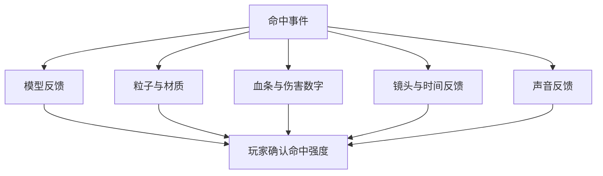

# 《吞吞舰船》战斗视觉反馈、模型表现与 UI 优化方案

> 文档版本：V1.0  
> 对应模式：肉鸽远征  
> 文档性质：独立增量设计，不修改旧文档文件  
> 适用范围：玩家、普通敌人、小型集群、海洋生物、大型敌舰、Boss、战斗 HUD  
> 实现环境：Unity 3D，敌人血条使用 Unity UI `Slider`

---

## 1. 视觉优化目标

本次表现优化需要让玩家在不阅读数值的情况下，也能快速判断：

1. 攻击有没有命中。
2. 这次攻击强不强。
3. 敌人还剩多少生命。
4. 敌人是否可以吞噬。
5. 玩家受到的是普通伤害、重击还是持续伤害。
6. 冲撞是否真正产生了重量感。
7. Boss 是否进入新阶段、弱点被破坏或已经死亡。
8. 当前画面中哪些信息最重要。

视觉反馈分为六个层级：



本文件重点说明模型、UI、VFX 与镜头，声音只描述与视觉同步的必要规则。

---

## 2. 反馈强度分级

所有攻击先划分反馈等级，避免每一颗机炮子弹都触发同样强烈的闪白、缩放和震屏。

| 等级 | 名称 | 示例 | 模型反馈 | UI 反馈 | 镜头反馈 |
| ---: | --- | --- | --- | --- | --- |
| F0 | 轻微命中 | 船员机炮、燃烧 Tick | 小火花，可选弱闪白 | 小伤害数字、血条扣除 | 无震动 |
| F1 | 普通命中 | 普通炮弹、鱼叉 | 明显闪白、小碎片 | 血条残影、伤害数字 | 极轻局部震动，可关闭 |
| F2 | 重型命中 | 鱼雷、导弹、侧舷齐射 | 强闪白、模型轻微缩放 | 血条冲击、较大数字 | 中等震动 |
| F3 | 强力撞击 | 高速冲撞、巨鲸尾拍 | 压缩回弹、位移、冲击波 | 血条大幅损失表现 | 强震动、短促停顿 |
| F4 | 阶段事件 | 模块摧毁、精英死亡 | 局部爆炸、轮廓亮起 | 事件提示 | 定向震动、短镜头强调 |
| F5 | Boss 终结 | Boss 死亡 | 多段爆炸、断裂、沉没 | Boss 条破碎、奖励提示 | 专属镜头演出 |

## 2.1 反馈叠加限制

- F0 不触发镜头震动和模型缩放。
- 同一目标 0.06 秒内多次 F0 命中，合并为一次弱闪白。
- 同一目标 0.12 秒内多次伤害数字可以合并显示。
- F2 及以上可以覆盖正在播放的 F0/F1 反馈。
- 同一帧发生多个镜头震动时不简单相加到无限，使用最大值加少量叠加。
- Boss 死亡演出开始后停止接收普通命中反馈。

---

## 3. 敌人血条总体方案

## 3.1 使用 Unity Slider

敌人生命条使用 Unity UI `Slider`，但不保留滑块 Handle。

推荐两种部署方式：

### 推荐方式：统一 HUD Canvas 管理

- 场景中只保留一个 `EnemyHealthBarCanvas`。
- Canvas 使用 `Screen Space - Camera` 或 `Screen Space - Overlay`。
- `EnemyHealthBarManager` 从对象池分配 Slider 血条。
- 每个血条跟随对应敌人头顶或船体上方的世界坐标。
- 使用 `Camera.WorldToScreenPoint` 转换位置。
- 敌人离开屏幕后隐藏并停止高频更新。

优点：

- 不需要为几十艘小舟分别创建 Canvas。
- 更容易统一缩放、遮挡、排序和对象池。
- 避免大量 Canvas 重建造成 UI 卡顿。

### 备选方式：单敌人 World Space Canvas

只建议用于少量大型敌舰、精英和特殊目标。小型集群不要每个对象挂一套独立 World Space Canvas。

## 3.2 Slider 层级

```text
EnemyHealthBar
├── Background
├── DamageDelayFill
├── Slider
│   ├── Fill Area
│   │   └── Fill
│   └── Handle Slide Area  ← 删除
├── ShieldFill            ← 可选
├── EliteFrame            ← 精英使用
├── DevourStateFrame      ← 可吞噬时使用
├── StatusIconRoot
└── NameAndLevelRoot      ← 中大型敌人才显示
```

## 3.3 Slider 组件设置

| 属性 | 设置 |
| --- | --- |
| Interactable | 关闭 |
| Transition | None |
| Navigation | None |
| Min Value | 0 |
| Max Value | 1 |
| Whole Numbers | 关闭 |
| Direction | Left To Right |
| Value | `CurrentHP / MaxHP` |
| Handle Rect | None |
| Fill Rect | 主生命填充 Image |

删除 `Handle Slide Area` 后，在 Slider 组件中确认 `Handle Rect` 为空。所有血条 Image 的 `Raycast Target` 关闭，避免阻挡鼠标点击和技能区域瞄准。

## 3.4 血条视觉层级

| 敌人类型 | 血条样式 |
| --- | --- |
| T0 小舟、鲨鱼 | 细短血条，无名字；受伤后显示 |
| T1～T2 小中型敌人 | 标准血条，可显示小型状态图标 |
| T3 大型敌舰、生物 | 加宽血条、名字、装甲或模块标识 |
| 精英 | 特殊边框、词缀图标、明显颜色 |
| 特殊目标 | 血条旁显示宝箱、磁吸、医疗等目标图标 |
| Boss | 不使用头顶普通血条，使用顶部固定 Boss 血条 |

---

## 4. 敌人血条显示规则

## 4.1 小型集群

小舟、鲨鱼等数量很多，不能让几十条血条持续占满画面：

- 满血且未被玩家攻击时隐藏。
- 首次受伤后显示 1.5 秒。
- 持续受伤时保持显示。
- 1.5 秒未受伤且恢复满血时淡出。
- 进入可吞噬状态时重新显示，并改为可吞噬颜色。
- 距离镜头过远时隐藏血条，只保留集群方向提示。

## 4.2 中型敌人

- 距离玩家 28m 内显示。
- 被锁定、受伤或处于状态效果时强制显示。
- 离开屏幕时隐藏头顶条，改由必要的屏幕边缘图标表示。

## 4.3 大型敌人与精英

- 进入玩家发现范围后持续显示。
- 距离较远时缩小到最低可读尺寸，不无限缩小。
- 精英血条显示 1～2 个词缀图标。
- 可破坏模块使用独立小条，放在主体血条下方或模型模块附近。

## 4.4 遮挡处理

- 血条锚点位于模型最高点上方 0.5～1.5m。
- 多个血条重叠时进行轻微上下错位。
- 同一集群最多完整显示距离玩家最近的 8 条小型血条。
- 其余小单位受伤时只显示短暂红色刻度或小伤害数字。
- 血条不应穿过顶部阶段 HUD 和底部技能栏的安全区域。

---

## 5. 血条扣血表现

## 5.1 双层血条

使用两层填充：

1. `MainFill`：真实当前生命，受击后快速下降。
2. `DamageDelayFill`：伤害残影，短暂保留旧生命，再延迟追赶。

颜色建议：

- MainFill：红色或敌人阵营主色。
- DamageDelayFill：白色、浅黄或亮红色。
- Background：深色低透明背景。

## 5.2 扣血时间

| 事件 | MainFill | DamageDelayFill |
| --- | --- | --- |
| F0 小伤害 | 0.05 秒内到新值 | 延迟 0.08 秒，0.18 秒追赶 |
| F1 普通伤害 | 0.08 秒到新值 | 延迟 0.12 秒，0.28 秒追赶 |
| F2 重伤害 | 0.1 秒到新值 | 延迟 0.18 秒，0.4 秒追赶 |
| F3 巨额伤害 | 0.12 秒到新值 | 延迟 0.22 秒，0.55 秒追赶，并产生冲击 |

不能让主血条缓慢插值太久，否则玩家无法判断真实剩余生命。

## 5.3 受击冲击动画

敌人受伤时，血条根据伤害比例播放不同反馈：

### 小伤害：低于最大生命 3%

- Fill 亮度提高 0.08 秒。
- 血条整体轻微横向抖动 1～2px。

### 普通伤害：3%～12%

- 血条整体缩放到 1.05，再回到 1。
- 扣除位置产生一个小亮点。
- DamageDelayFill 明显显示损失区间。

### 重伤害：高于 12%

- 血条缩放到 1.1。
- 横向快速抖动 2～4 次。
- 损失区间出现碎裂、切割或爆光表现。
- 伤害数字尺寸更大。

### 单次伤害高于 30%

- 血条边框短暂闪白。
- DamageDelayFill 从损失位置向左碎裂消散。
- 不额外遮挡模型或触发全屏 UI。

## 5.4 血条损失点特效

可以在 Fill 末端增加 `HitSpark`：

- 受击时移动到当前 `MainFill` 末端。
- 播放 0.15 秒小型闪光。
- 重击时向外散出 2～4 个 UI 碎片。
- 快速连续伤害时每 0.1 秒最多播放一次。

## 5.5 治疗表现

敌人被维修单位治疗时：

- MainFill 使用 0.15～0.25 秒增长。
- 增长区间显示绿色或青色治疗残影。
- 血条上浮一个小型绿色恢复数字。
- 如果治疗被打断，治疗光线和血条增长立即停止。

不要用扣血残影颜色表示治疗。

## 5.6 护盾和装甲

### 护盾

- 护盾条放在生命条上方或覆盖在主条外侧。
- 使用蓝色或青色。
- 护盾破裂时播放边框碎裂和短暂电光。

### 装甲

- 装甲不是第二条完整生命条时，可用血条边框刻度表示。
- 可破坏装甲模块使用独立小条。
- 护甲降低状态通过破裂盾牌图标显示，不改变生命条颜色。

---

## 6. 可吞噬状态血条

敌人进入可吞噬状态后，需要比单纯“残血”更明确：

- 血条边框变为金色、青绿色或项目统一的吞噬色。
- 血条左侧出现张口或漩涡图标。
- Fill 产生向舰船方向流动的纹理。
- 模型轮廓轻微脉冲。
- 玩家靠近船首吞噬范围时，血条向船首方向轻微拉伸。
- 小型单位可直接吞噬时，不要求先出现残血状态，但进入船首捕获范围后仍显示短促吞噬提示。

可吞噬状态不能只依赖颜色，要同时使用图标、边框和动画，兼顾色弱玩家。

---

## 7. Boss 血条

## 7.1 层级结构

```text
BossHealthHUD
├── BossName
├── StageLabel
├── BossPortraitOrIcon
├── HealthBackground
├── DamageDelayFill
├── BossSlider
│   └── Fill Area
│       └── Fill
├── PhaseMarkers
├── ArmorOrShieldBar
├── ModuleIcons
├── StatusIconRoot
└── EnrageTimer
```

Boss Slider 同样删除 Handle，并关闭交互与射线检测。

## 7.2 阶段刻度

- 在 70%、40% 等阶段点显示竖向刻度。
- Boss 生命越过阶段刻度时，刻度破碎并触发阶段提示。
- 新阶段开始可以短暂锁住血条 0.3 秒，等待转阶段表现，但不能吞掉玩家已造成的伤害。
- 超出阶段锁的伤害记入待结算伤害，转阶段后继续扣除，或明确设置阶段伤害上限。

## 7.3 Boss 模块

Boss 有导弹舱、飞行甲板、雷暴桅杆等可破坏模块时：

- Boss 血条下方显示模块图标。
- 图标外圈显示模块生命。
- 模块被摧毁后图标破裂、变灰。
- 对应模型区域发生局部爆炸并停止武器功能。

## 7.4 Boss 受击血条表现

- 普通伤害不让整条 Boss 血条持续抖动。
- 每 0.1 秒合并一次小伤害表现。
- 重型主动技能、冲撞和模块摧毁才触发明显血条冲击。
- 单次伤害超过 Boss 最大生命 3% 时显示大型损失残影。
- 暴击或弱点伤害使用独立颜色和图标。

---

## 8. 玩家血条优化

玩家生命条也使用真实生命与延迟伤害残影：

```text
PlayerHealthHUD
├── HullIcon
├── MainHealthFill
├── DamageDelayFill
├── ShieldFill
├── LowHealthPulse
├── CurrentAndMaxText
└── StatusIconRoot
```

## 8.1 玩家扣血表现

- MainFill 快速下降。
- DamageDelayFill 延迟追赶。
- 生命数字短暂变红。
- 伤害来源方向在屏幕边缘显示 0.3～0.6 秒。
- 重击时玩家血条整体缩放 1.08 倍。
- 连续小伤害不会每次让整个 HUD 抖动。

## 8.2 低血表现

| 生命比例 | 表现 |
| --- | --- |
| 50%～100% | 正常 |
| 30%～50% | 血条边缘轻微裂纹，船体冒少量烟 |
| 15%～30% | 血条脉冲、屏幕边缘轻微红色呼吸、船体持续冒烟 |
| 0%～15% | 更明显但低频的危险提示、医疗目标箭头加强 |

屏幕红边不能持续覆盖过重，防止长期低血时影响观察导弹落点和鱼雷尾迹。

## 8.3 治疗

- 血包到达舰船后产生绿色维修波纹。
- 玩家血条先出现绿色目标区间，再用 0.2～0.35 秒补满。
- 大型血包触发船体破损区域熄火、烟雾减少。
- 溢出治疗不播放虚假的大幅增长动画。

---

## 9. 模型闪白系统

## 9.1 基础效果

敌人和玩家受击时，模型材质在极短时间内混合到白色或高亮色：

```text
命中瞬间：HitFlash 0 → 1
短暂停留：0.02～0.04 秒
快速恢复：HitFlash 1 → 0，持续 0.06～0.12 秒
```

推荐材质属性：

```text
_HitFlash       0～1
_HitColor       默认白色
_HitEmission    命中时的额外亮度
```

Shader 中将基础颜色与 `_HitColor` 按 `_HitFlash` 混合，并适度增加 Emission。

## 9.2 不要实例化材质

运行时不要在每次受击时调用 `renderer.material` 创建新材质实例。推荐：

- 启动时缓存所有 Renderer。
- 使用 `MaterialPropertyBlock` 修改 `_HitFlash`。
- 多材质模型统一写入属性块。
- 死亡或回收时恢复为 0。

## 9.3 闪白强度

| 反馈等级 | 峰值 | 持续 |
| --- | ---: | ---: |
| F0 | 0.25 | 0.05 秒 |
| F1 | 0.55 | 0.09 秒 |
| F2 | 0.85 | 0.13 秒 |
| F3 | 1.0 | 0.16 秒，可带第二次弱闪 |
| F4/F5 | 专属曲线 | 按演出控制 |

## 9.4 快速攻击限制

船员机炮、燃烧、电击等高频伤害不能每 Tick 强闪白：

- 同一目标闪白触发间隔最低 0.07 秒。
- 高频攻击在冷却窗口内只提高当前闪白强度，不重新开始完整曲线。
- 持续伤害每 0.3～0.5 秒最多弱闪一次。
- Boss 普通小伤害闪白峰值降低，防止长期变成白色模型。

## 9.5 不同伤害颜色

白色作为统一命中确认，可以叠加极弱的伤害类型颜色：

| 类型 | 辅助色 |
| --- | --- |
| 普通炮弹 | 白色 |
| 爆炸 | 白黄 |
| 火焰 | 橙红 |
| 雷电 | 蓝白 |
| 冰冷 | 青白 |
| 冲撞 | 纯白 + 灰色冲击边缘 |
| 治疗 | 绿色，不使用 HitFlash |

颜色只作为辅助，不要完全替代白色命中亮度。

---

## 10. 玩家受击模型表现

玩家受击也闪白，但还需要区分攻击来源：

- 普通炮弹：局部火花 + 弱闪白。
- 爆炸：强闪白 + 黑烟 + 局部焦痕。
- 冲撞：闪白 + VisualRoot 压缩 + 船体倾斜。
- 雷电：蓝白闪烁 + 电弧沿船体移动。
- 火焰：局部持续燃烧，不每帧闪白。
- 鱼叉：命中位置保留短暂绳索和拉扯反馈。

玩家受击后可以显示 0.15 秒的红色轮廓，但不能让整个模型长期变红。

---

## 11. 冲撞模型缩放反馈

## 11.1 只缩放视觉根节点

模型缩放只作用于：

```text
ShipRoot
├── PhysicsRoot       ← 不缩放
│   ├── Rigidbody
│   └── Colliders
└── VisualRoot        ← 播放压缩和回弹
```

不能直接缩放带有 Rigidbody 和 Collider 的根节点，否则会引起穿插、弹飞和连续碰撞异常。

## 11.2 基础缩放曲线

敌人受到正面撞击时：

```text
0.00s  (1.00, 1.00, 1.00)
0.06s  (0.90, 1.05, 1.08)  压缩并略微横向膨胀
0.13s  (1.04, 0.98, 0.97)  反向回弹
0.22s  (1.00, 1.00, 1.00)  恢复
```

具体缩放轴根据模型本地前向轴调整。

## 11.3 不同体型反馈

| 目标 | 缩放幅度 | 位移/旋转 |
| --- | --- | --- |
| 小舟、鲨鱼 | 10%～16% | 明显弹飞、旋转 |
| 中型敌舰 | 5%～9% | 小幅后退和偏航 |
| 大型敌舰、鲸鱼 | 2%～5% | 局部震动、较小位移 |
| Boss | 0%～2% | 主要使用局部冲击波、部件震动，不整体果冻化 |
| 玩家 | 3%～6% | 根据受到撞击方向倾斜 |

## 11.4 方向性压缩

缩放应尽量符合撞击方向：

- 船头受到撞击：长度方向压缩，宽度略扩张。
- 船侧受到撞击：宽度方向压缩，船体向另一侧倾斜。
- 船尾受到撞击：模型向前轻推，尾部推进特效中断。
- 从上方落下的大型攻击：Y 轴压缩，周围产生水面冲击环。

## 11.5 连续撞击

- 缩放动画未结束时再次发生更强撞击，从当前缩放平滑转向新目标值。
- 不直接叠乘缩放，避免模型越来越小或越来越大。
- 回收到对象池前强制恢复 `(1,1,1)`。

---

## 12. 冲撞综合反馈

一次有效高速冲撞建议同时包含：

1. 接触点火花或木屑/金属碎片。
2. 水面向两侧扩散的冲击波。
3. 目标模型压缩回弹。
4. 玩家模型轻微反冲。
5. 双方速度变化与位移。
6. 伤害数字。
7. 血条大幅残影。
8. 镜头震动。
9. 0.02～0.06 秒短促 Hit Stop。
10. 根据材质播放木船、金属舰或生物的不同撞击音。

低速顶住敌人时只显示挤压水花和轻微摩擦，不重复播放完整冲撞反馈。

---

## 13. Hit Stop 与时间反馈

Hit Stop 是极短时间的视觉强调，不等同于暂停：

| 事件 | 时间缩放 | 持续 |
| --- | ---: | ---: |
| 普通命中 | 不使用 | 0 |
| 重炮命中 | 0.65 | 0.02 秒 |
| 高速冲撞 | 0.2～0.35 | 0.04～0.06 秒 |
| 模块摧毁 | 0.3 | 0.05 秒 |
| Boss 最后一击 | 0.08～0.15 | 0.1～0.18 秒 |

规则：

- UI 动画和镜头 Impulse 使用非缩放时间。
- 高频攻击不使用 Hit Stop。
- 多次 Hit Stop 在短时间内不累计成明显卡顿。
- 0.15 秒内只能触发一次普通 Hit Stop。
- Boss 终结可以覆盖普通限制。

---

## 14. 镜头震动系统

## 14.1 实现建议

使用统一 `CameraShakeManager` 管理震动。若项目使用 Cinemachine，可使用 Impulse；否则使用自定义位置与旋转噪声。

所有震动事件提交：

```text
ShakeRequest
├── SourcePosition
├── Amplitude
├── Frequency
├── Duration
├── RotationAmount
├── FalloffDistance
├── Priority
└── ShakeTag
```

## 14.2 震动参数参考

| 事件 | 强度 | 频率 | 时长 | 旋转 |
| --- | ---: | ---: | ---: | ---: |
| 普通炮弹近处命中 | 0.08 | 18 | 0.08 秒 | 很低 |
| 玩家受到普通炮击 | 0.16 | 20 | 0.12 秒 | 低 |
| 导弹/鱼雷爆炸 | 0.28 | 14 | 0.22 秒 | 中 |
| 玩家高速冲撞 | 0.38 | 12 | 0.28 秒 | 中 |
| 大型舰模块摧毁 | 0.32 | 10 | 0.35 秒 | 中 |
| 巨鲸尾拍 | 0.4 | 9 | 0.4 秒 | 中高 |
| Boss 阶段转换 | 0.45 | 8 | 0.5 秒 | 中高 |
| Boss 最终爆炸 | 0.65 | 7 | 0.8 秒，分段 | 高但平滑 |

强度是相对标尺，实际数值需要根据镜头系统调试。

## 14.3 距离衰减

- 玩家自己受到伤害时不做距离衰减。
- 世界爆炸按震源到玩家距离衰减。
- 超出 35～50m 的普通爆炸不震动。
- Boss 大型阶段事件可以保留最低震动值。

## 14.4 震动叠加

- 同类低级震动 0.1 秒内只保留最强一次。
- 不同震动使用“最大强度 + 其余强度的 20%”合并。
- 最终强度 Clamp 到上限。
- Boss 演出震动具有高优先级，可压制普通炮弹震动。

## 14.5 玩家设置

设置中提供：

- 镜头震动 0～100%。
- 关闭镜头震动时，保留模型、UI 和粒子反馈。
- 低于 30% 时减少旋转震动，优先保留位置震动。
- 可增加“只保留强力事件震动”辅助选项。

---

## 15. 受击方向反馈

玩家受到屏幕外攻击时：

- 屏幕边缘显示短促红色弧形指示。
- 弧形位置对应攻击来源方向。
- 伤害越高，弧形越粗、持续越久。
- 持续伤害只在首次命中时显示方向，不每 Tick 重复。
- 同方向连续攻击合并为一次增强指示。

敌人的受击方向可以通过：

- 模型向受力方向轻微倾斜。
- 碎片和火花沿反方向飞散。
- 水面冲击波偏向受力方向。

---

## 16. 不同攻击手段的命中表现

## 16.1 冲撞前锥

- 船首破浪粒子增大。
- 接触点产生金属、木片或生物水花。
- 目标压缩回弹。
- 目标被推开并出现正面冲击环。
- 高速撞击使用中强镜头震动和短 Hit Stop。
- 撞毁小型单位时模型向两侧弹开或直接被吸入。

## 16.2 垂直发射炮

### 发射

- 发射舱盖打开。
- 导弹垂直喷出并留下烟柱。
- 舰体有很轻的反作用震动。

### 落点

- 水面显示逐渐收缩的预警圈。
- 最后 0.2 秒出现中心高亮。
- 命中后先出现核心爆光，再出现水柱和冲击环。
- 范围边缘使用水浪表现伤害半径。

## 16.3 船员机炮

- 使用短促炮口火光和曳光弹。
- 轻命中只产生小火花，不触发镜头震动。
- 连续命中时血条残影平滑下降。
- 主动技能期间提高曳光密度，但限制粒子数量。

## 16.4 鱼雷

- 水下显示气泡和细长尾迹。
- 接近目标时水面产生轻微隆起。
- 爆炸以水下核心爆光开始，随后形成高水柱。
- 大范围冲击用水面圆环表示。
- 命中大型舰体时局部船体向上抬起。

## 16.5 漂浮炸弹

- 未启用时低亮度闪烁。
- 启用后指示灯变红。
- 敌人进入触发范围时闪烁加快。
- 爆炸产生低矮宽范围水浪，与鱼雷的高水柱区分。
- 连锁起爆时延迟 0.08～0.15 秒逐个传播，不同帧同时全炸。

## 16.6 侧舷火炮

- 每门炮按短间隔依次开火。
- 舰体向开火反方向产生极轻摆动。
- 同侧炮口烟雾沿航迹拖散。
- 全舷技能使用更大的镜头外扩和连续低频震动，不能每发都强震。

## 16.7 捕鲸鱼叉

- 命中点产生嵌入特效。
- 鱼叉绳索从发射器连接目标。
- 牵引时绳索绷紧并抖动。
- 绳索切断时向两侧回弹并快速淡出。

## 16.8 雷暴桅杆

- 电弧必须明确显示弹射顺序。
- 每次弹射亮度逐渐下降。
- 感电目标表面出现短暂电流，不持续强闪白。
- 雷暴技能使用云层阴影、落雷和水面电圈。

## 16.9 焚海喷射器

- 火焰有清晰锥形范围。
- 水面留下燃烧区域和黑烟。
- 燃烧目标不每 Tick 闪白，改用火焰附着和周期橙色脉冲。
- 火区重叠时控制亮度，避免整片画面纯白。

## 16.10 无人机蜂巢

- 无人机出动有甲板灯和起飞轨迹。
- 攻击使用较细的弹道或小型炮火。
- 临时蜂群技能用编队形状区分于常驻无人机。
- 母舰死亡时无人机失控、熄火或坠入水中。

## 16.11 海啸声波炮

- 船首先形成压缩水环。
- 冲击波沿水面扩张，有清晰扇形边界。
- 命中目标时产生轮廓扭曲和后退。
- 不使用大量烟火，突出水波与推力。

---

## 17. 状态效果表现

| 状态 | 模型表现 | UI 图标 | 血条表现 |
| --- | --- | --- | --- |
| 点燃 | 局部火焰、黑烟 | 火焰 | Fill 边缘橙色脉冲 |
| 冰冷 | 青色霜层、尾流变弱 | 雪花 | 血条移动动画变慢 |
| 感电 | 蓝色小电弧 | 闪电 | 边框短促电光 |
| 眩晕 | 旋转星标或震荡环 | 眩晕 | 血条上方倒计时环 |
| 减速 | 船尾阻力水花、淡色链条 | 减速 | 图标显示剩余时间 |
| 易伤 | 破裂轮廓或准星标记 | 破盾 | 血条边框出现裂纹 |
| 护盾 | 半透明护盾轮廓 | 护盾 | 独立蓝色条 |
| 可吞噬 | 吞噬轮廓、向船首流动 | 吞噬 | 专属边框与动态图案 |

状态表现最多同时突出 3 种。更多状态只在 UI 图标列表中显示，模型上按优先级表现，避免模型被多层颜色覆盖。

---

## 18. 伤害数字

## 18.1 类型

| 类型 | 颜色与尺寸 |
| --- | --- |
| 普通伤害 | 白色或浅色，中小字号 |
| 暴击 | 黄色，更大，带冲击缩放 |
| 爆炸伤害 | 橙色，略大 |
| 持续伤害 | 对应元素色，小字号 |
| 冲撞伤害 | 白黄粗体，横向冲击动画 |
| 治疗 | 绿色，加号 |
| 护盾伤害 | 蓝色 |
| 无效/免疫 | 灰色文字或图标，不显示 0 |

## 18.2 合并规则

- 同一攻击实例的多碰撞体伤害只显示一次。
- 机炮对同一目标 0.15 秒内的伤害合并。
- 持续伤害每 0.5 秒合并一次显示。
- 同一位置同时出现超过 5 个数字时自动错位。
- 小型集群可以在单位中心显示，不为每颗子弹生成数字。

## 18.3 动画

```text
出现：0.08 秒从 0.7 缩放到 1.1
回弹：0.08 秒回到 1.0
漂移：向受力方向或上方移动
消失：0.25～0.45 秒淡出
```

重击数字可以产生短促横向拉伸，但不要持续弹跳。

---

## 19. 普通敌人死亡表现

## 19.1 小型木舟

- 受到最后一击时闪白。
- 船体断成 2～4 个简化木片。
- 木片向外弹出并快速落水。
- 水面留下短暂漂浮残骸。
- 实体金币从残骸中散出。

被吞噬时不播放完整爆炸，改为：

- 模型被拉向船首。
- 快速缩小、弯曲或被漩涡遮挡。
- 吞噬完成后金币从玩家船首附近散落。

## 19.2 小型金属舰

- 最后一击产生局部爆炸。
- 船体失去动力滑行 0.3～0.6 秒。
- 产生黑烟并下沉或断裂。
- 金币在正式沉没前散落。

## 19.3 中型敌舰

死亡持续约 1～1.8 秒：

1. 最后一击强闪白。
2. 关键模块爆炸。
3. 船体倾斜、冒烟。
4. 二次小爆炸。
5. 船体下沉或解体。
6. 掉落金币和道具。

## 19.4 大型敌舰

死亡持续约 2～3.5 秒：

- 武器依次失效。
- 甲板多点爆炸。
- 船体断裂或大角度倾斜。
- 水面出现大范围油污、泡沫和冲击环。
- 掉落物从多个部位散出，而不是全部从中心生成。

## 19.5 海洋生物

海洋生物不要完全复用机械爆炸：

- 鲨鱼：翻滚、失去游动、沉入水下或被吞噬。
- 巨鲸：发出水雾、身体倾斜、缓慢下沉，周围形成巨大水波。
- 电鳗：电光逐渐熄灭。
- 装甲鲸：装甲碎片先脱落，再进入生物死亡表现。

整体保持卡通和非血腥，不使用大量血液。

---

## 20. Boss 死亡演出

Boss 死亡必须与普通大型敌人形成明显层级差异，但不能演出过长。

推荐总时长：4.5～7 秒。

## 20.1 Boss 舰船死亡流程

### 0.00～0.20 秒：最终命中

- 关闭 Boss 继续受伤。
- 强闪白。
- 0.1～0.18 秒重型 Hit Stop。
- Boss 血条 Fill 到 0，边框产生裂纹。

### 0.20～1.50 秒：武器失效

- 导弹舱、炮塔、推进器依次爆炸。
- 模块图标依次破碎。
- Boss 移动速度逐渐降低。
- 镜头跟随 Boss，但仍保留玩家位置感。

### 1.50～3.20 秒：船体崩解

- 甲板与船侧发生多点爆炸。
- 船体倾斜、断裂或中部塌陷。
- 水面连续出现冲击波。
- 镜头使用两到三次递增强度震动，而不是持续随机抖动。

### 3.20～4.80 秒：沉没

- 主体缓慢下沉。
- 大量气泡、蒸汽和黑烟。
- 最终爆炸后声音短暂压低。
- Boss 血条破碎淡出。

### 4.00～6.00 秒：奖励与进化核心

- 金币和高级奖励从残骸中散落。
- 进化核心从中心升起。
- 附近金币开始快速吸附。
- 核心飞向玩家后进入舰体进化界面。

## 20.2 Boss 海兽死亡流程

- 最后一击产生强烈水面冲击。
- 生物发出动作停顿，失去攻击姿态。
- 背部装甲、寄生结构或能量器官破裂。
- 身体侧翻或缓慢沉入水中。
- 水面形成大型旋涡和泡沫。
- 进化核心以生物能量或发光结晶形式出现。

不需要让鲸鱼发生机械式连环爆炸，除非它本身附着大量机械武装。

## 20.3 Boss 死亡镜头

- 最后一击时轻微拉近 5%～10%。
- 崩解阶段缓慢拉远，展示 Boss 体积。
- 不强制切换到完全独立的过场相机，避免玩家失去方位。
- 玩家仍能看到自己的舰船和掉落方向。
- 设置中关闭镜头震动时，保留镜头构图变化。

## 20.4 Boss 死亡时的普通敌人

- 停止新敌人生成。
- 现存小型单位进入逃跑、失控或短暂眩晕状态。
- 远处普通投射物逐渐失效。
- 玩家不会在观看 Boss 死亡时被残余鱼雷击杀。
- 演出结束、进化完成后再恢复下一航段。

---

## 21. 玩家死亡表现

玩家死亡需要明确但比 Boss 更短：

1. 生命归零，立即关闭驾驶和技能输入。
2. 模型强闪白后恢复。
3. 推进器熄火、船体失速。
4. 关键模块发生 2～3 次爆炸。
5. 船体倾斜、下沉或停在残骸状态。
6. 镜头缓慢拉远。
7. 失败界面淡入。

推荐 2.5～4 秒。失败界面出现前不要让敌人继续制造大量伤害数字和震屏。

---

## 22. 舰体进化表现

Boss 死亡后选择进化方向时：

- 当前舰船置于画面中央。
- 普通 HUD 淡出，只保留进化选择。
- 选择生命方向：装甲板从两侧展开，船体变宽，绿色或厚重金色能量流动。
- 选择攻击方向：炮架、弹药舱和武器底座展开，红橙能量沿甲板传递。
- 选择移动方向：船尾推进器增加，船体拉长，蓝色尾流提前出现。
- 四种已装配武器重新连接到新挂点。
- 摄像机平滑拉远以展示体型变大。
- 最后显示“吞噬等级 +1”“视野范围提升”“全武器强化”。

模型切换时使用遮罩光效、烟雾或机械展开隐藏瞬时 Prefab 替换。

---

## 23. 环境与水面反馈

## 23.1 航行尾流

- 普通航行：细长双侧尾流。
- 加速航行：尾流变宽、变亮并增加水雾。
- 大型舰体进化后：尾流长度和宽度随模型阶段提高。
- 低速转向：船尾出现弧形水纹。

## 23.2 爆炸水面

不同爆炸使用不同形状：

- 炮弹：小型水花。
- 导弹：中高水柱 + 圆形冲击环。
- 鱼雷：高水柱 + 水下爆光。
- 漂浮炸弹：低矮宽水浪。
- Boss 爆炸：多层冲击环、泡沫和残骸。

## 23.3 船体下沉

- 使用预设下沉曲线，不完全依赖真实浮力。
- 金属舰先倾斜再下沉。
- 木舟快速散架。
- 鲸鱼侧翻后缓慢沉入。
- 下沉到水面以下后关闭昂贵 Renderer 和粒子，再回收对象。

---

## 24. UI 动效统一规范

| UI 事件 | 动画时长 | 表现 |
| --- | ---: | --- |
| 小伤害扣血 | 0.05～0.18 秒 | 快速下降、弱残影 |
| 重伤害扣血 | 0.1～0.55 秒 | 缩放、抖动、长残影 |
| 治疗 | 0.2～0.35 秒 | 绿色预览区间后填充 |
| 状态图标出现 | 0.12 秒 | 0.7→1.1→1.0 |
| 状态图标消失 | 0.15 秒 | 缩小淡出 |
| Boss 阶段切换 | 0.3～0.6 秒 | 刻度破碎、标题提示 |
| 可吞噬状态 | 持续 | 边框呼吸、纹理流动 |
| 特殊目标出现 | 0.25～0.4 秒 | 横幅滑入、方向箭头亮起 |

UI 动画使用非缩放时间，确保 Hit Stop 和暂停期间表现正常。

---

## 25. 美术层级与颜色规范

## 25.1 颜色用途

| 信息 | 建议颜色 |
| --- | --- |
| 敌人生命 | 红色或阵营色 |
| 玩家生命 | 绿色、青绿或项目主色 |
| 伤害残影 | 白黄或亮红 |
| 护盾 | 蓝色 |
| 治疗 | 绿色 |
| 可吞噬 | 金色、青绿色或专属吞噬色 |
| 暴击 | 黄色 |
| 危险预警 | 橙红色 |
| 高级强化 | 紫色或金紫色 |
| Boss | 深红、金色边框或 Boss 专属色 |

## 25.2 不只依赖颜色

- 护盾使用独立条和盾牌图标。
- 可吞噬使用动态图案和吞噬图标。
- 暴击使用更大字体和爆裂形状。
- 危险预警使用形状、频率和方向。
- 色弱模式替换颜色，同时保留所有图形差异。

---

## 26. 可访问性设置

设置界面建议增加：

| 设置 | 选项 |
| --- | --- |
| 模型闪白强度 | 0～100% |
| 镜头震动 | 0～100% |
| 强力事件震动 | 开/关 |
| 屏幕红边 | 关闭、低、中、高 |
| 伤害数字 | 全部、合并、仅重击、关闭 |
| 血条显示 | 自动、始终、仅受伤目标 |
| 状态特效强度 | 低、中、高 |
| 色弱模式 | 关闭、红绿色弱、蓝黄色弱 |

模型闪白设为 0 时仍保留命中粒子、血条残影和伤害数字。

---

## 27. Unity 预制体结构

## 27.1 敌人模型

```text
EnemyRoot
├── PhysicsRoot
│   ├── Rigidbody
│   ├── BodyColliders
│   └── Hurtboxes
├── VisualRoot
│   ├── HullModel
│   ├── WeaponModels
│   ├── DamageDecals
│   └── StatusVFXAnchors
├── UIAnchor
├── VFXAnchors
│   ├── HitPoints
│   ├── ExplosionPoints
│   ├── SmokePoints
│   └── WakePoints
└── AudioRoot
```

## 27.2 血条 Prefab

```text
EnemyHealthBarPrefab
├── CanvasGroup
├── Background
├── DamageDelayFill
├── HealthSlider
│   └── Fill Area
│       └── Fill
├── ShieldFill
├── Frame
├── EliteFrame
├── DevourFrame
├── StatusIcons
├── NameText
└── HitSpark
```

## 27.3 玩家表现

```text
PlayerShip
├── PhysicsRoot
├── VisualRoot
├── HitFlashController
├── ModelImpactAnimator
├── DamageStateVFX
│   ├── LightSmoke
│   ├── HeavySmoke
│   ├── Fire
│   └── Electric
├── WakeVFX
└── CameraImpulseSource
```

---

## 28. 主要脚本职责

| 脚本 | 职责 |
| --- | --- |
| `EnemyHealthBarManager` | 分配、回收和更新可见敌人 Slider 血条 |
| `EnemyHealthBarView` | MainFill、DamageDelayFill、状态与吞噬表现 |
| `BossHealthBarView` | Boss 血条、阶段刻度、模块与狂暴计时 |
| `HealthPresentationController` | 生命变化事件、伤害等级与 UI 动画 |
| `HitFlashController` | MaterialPropertyBlock 闪白和类型颜色 |
| `ModelImpactAnimator` | VisualRoot 压缩、回弹、倾斜和恢复 |
| `HitReactionCoordinator` | 根据 F0～F5 分配模型、UI、VFX 和镜头反馈 |
| `CameraShakeManager` | 震动请求、距离衰减、优先级和上限 |
| `HitStopManager` | 短时间缩放、触发频率和高优先级覆盖 |
| `DamageNumberManager` | 数字对象池、合并、错位和动画 |
| `StatusVFXController` | 点燃、冰冷、感电、眩晕等状态表现 |
| `DeathPresentationController` | 不同体型和种类的死亡流程 |
| `BossDeathSequence` | Boss 多阶段死亡、奖励和进化核心衔接 |
| `WaterImpactVFXPool` | 水花、水柱、冲击环和泡沫对象池 |
| `VisualSettingsController` | 闪白、震动、数字和特效强度设置 |

---

## 29. 事件接口

表现系统不要直接依赖具体武器脚本。伤害系统发送统一事件：

```text
DamagePresentationEvent
├── Target
├── Source
├── DamageAmount
├── DamageRatioToMaxHP
├── DamageType
├── FeedbackLevel
├── HitPosition
├── HitDirection
├── IsCritical
├── IsWeakPoint
├── CausedDeath
└── DamageInstanceId
```

表现协调器根据事件决定：

- 是否闪白。
- 闪白强度。
- 是否缩放。
- 使用哪种粒子。
- 伤害数字是否合并。
- 是否震屏。
- 是否触发 Hit Stop。
- 是否进入死亡流程。

---

## 30. 性能优化

## 30.1 血条

- 使用统一 Canvas 和血条对象池。
- Slider 只在生命变化时更新 Value，不在每帧重复赋相同值。
- 位置只更新可见血条。
- 远距离小型血条隐藏。
- 状态图标数量设置上限。
- 禁用所有血条 Image 的 Raycast Target。

## 30.2 模型闪白

- 使用 MaterialPropertyBlock。
- 缓存 Renderer 和属性 ID。
- 高频伤害合并闪白。
- 对象回收时恢复材质参数。

## 30.3 粒子与残骸

- 命中火花、水花、烟雾、爆炸、伤害数字全部池化。
- 小型残骸限制存活 1～3 秒。
- 大型残骸远离摄像机后提前简化。
- 同一区域大量爆炸时降低次要粒子生成量。

## 30.4 镜头

- 不为每颗机炮子弹创建 Impulse Source。
- 由命中协调器统一提交 ShakeRequest。
- 屏幕外远距离普通爆炸不产生镜头震动。

## 30.5 UI 重建

- 玩家 HUD、Boss HUD、世界血条分别使用独立 Canvas。
- 高频变化的伤害数字与静态 HUD 分开。
- 不要让一个小血条变化导致整个主 HUD Canvas 重建。

---

## 31. 表现预算

| 内容 | 建议上限 |
| --- | ---: |
| 同时可见普通敌人血条 | 20～28 |
| 同时可见小型单位血条 | 8～12 |
| 同时伤害数字 | 35 |
| 同时普通命中特效 | 50 |
| 同时大型爆炸 | 8 |
| 同时持续状态模型特效 | 20 个目标 |
| 同时水面冲击环 | 12 |
| 同时镜头震动请求 | 合并为 1 个最终输出 |

超出预算时优先保留：

1. 玩家受击
2. Boss 技能和死亡
3. 重型主动技能
4. 可吞噬提示
5. 普通炮弹
6. 高频机炮和持续伤害

---

## 32. 分阶段实现顺序

## 阶段 1：血条基础

- 制作无 Handle 的 Slider 血条 Prefab。
- 完成统一 Canvas、跟随、显示和对象池。
- 接入敌人生命事件。
- 完成小型、中型、大型和 Boss 四类样式。

## 阶段 2：扣血残影与伤害数字

- MainFill 与 DamageDelayFill。
- 小伤、重伤和治疗动画。
- 伤害数字分类、合并和对象池。
- 可吞噬状态血条。

## 阶段 3：闪白与模型冲击

- Shader 增加 `_HitFlash`。
- 使用 MaterialPropertyBlock。
- 完成 VisualRoot 缩放、倾斜和恢复。
- 区分小型、中型、大型与 Boss 强度。

## 阶段 4：镜头与 Hit Stop

- 统一 CameraShakeManager。
- 加入距离衰减和震动合并。
- 实现冲撞、鱼雷、导弹和模块摧毁参数。
- 增加玩家设置。

## 阶段 5：武器差异化 VFX

优先完成：

1. 冲撞
2. 鱼雷
3. 垂直导弹
4. 漂浮炸弹
5. 船员机炮
6. 侧舷火炮

随后补充雷电、火焰、鱼叉、无人机和声波。

## 阶段 6：死亡与 Boss 演出

- 小舟、金属舰、生物和大型舰四套死亡模板。
- Boss 舰船死亡序列。
- Boss 海兽死亡序列。
- 奖励掉落与进化核心衔接。

## 阶段 7：性能与辅助设置

- 压测小型集群和大量投射物。
- 调整血条可见上限。
- 完成闪白、震动、数字和红边设置。
- 使用 Unity Profiler 检查 Canvas rebuild、GC 和粒子数量。

---

## 33. 验收清单

### Slider 血条

- [ ] 敌人血条使用 Unity Slider。
- [ ] Handle Slide Area 已删除。
- [ ] Slider 的 Handle Rect 为空。
- [ ] 血条不可交互且不阻挡鼠标射线。
- [ ] 小型敌人满血时不会长期显示大量血条。
- [ ] 敌人离屏后血条正确隐藏。
- [ ] Boss 使用独立顶部血条。

### 扣血表现

- [ ] MainFill 能快速显示真实生命。
- [ ] DamageDelayFill 延迟追赶。
- [ ] 小伤和重伤的 UI 强度不同。
- [ ] 快速机炮伤害不会让血条持续剧烈抖动。
- [ ] 治疗使用独立颜色和增长表现。
- [ ] 可吞噬状态有颜色、图标和动画三种提示。

### 模型闪白

- [ ] 玩家和敌人受击时能够闪白。
- [ ] 高频攻击受到闪白频率限制。
- [ ] Boss 不会因高频攻击长期变成白色。
- [ ] 使用 MaterialPropertyBlock，不反复实例化材质。
- [ ] 对象回收后闪白参数恢复为 0。

### 冲撞反馈

- [ ] 缩放只作用于 VisualRoot。
- [ ] Collider 和 Rigidbody 根节点不缩放。
- [ ] 小型单位压缩和弹飞明显。
- [ ] 大型舰和 Boss 不会表现得像柔软果冻。
- [ ] 同一次持续接触不会反复播放完整撞击表现。
- [ ] 冲撞包含模型、血条、粒子、速度和镜头反馈。

### 镜头

- [ ] 普通机炮命中不触发强震屏。
- [ ] 导弹、鱼雷和冲撞震动层级清晰。
- [ ] 多个震动请求会合并并限制最大值。
- [ ] 远距离爆炸按距离衰减。
- [ ] 设置为 0 后可以完全关闭震动。

### 死亡表现

- [ ] 木舟、金属舰和海洋生物死亡表现不同。
- [ ] 敌人死亡后实体金币正常散落。
- [ ] 吞噬死亡不播放不合适的完整爆炸。
- [ ] 大型敌人有多段死亡而非瞬间消失。
- [ ] Boss 死亡后停止普通攻击和继续受伤。
- [ ] Boss 死亡演出能够衔接金币、进化核心和进化界面。
- [ ] 玩家观看 Boss 死亡时不会被残余投射物击杀。

### 性能

- [ ] 血条、伤害数字和命中特效使用对象池。
- [ ] 大量小舟出现时没有每敌人独立 Canvas 的高开销。
- [ ] 高频伤害不会产生大量 GC。
- [ ] 同屏爆炸过多时能够降低次要特效。
- [ ] HUD Canvas 不因单个血条变化整体重建。

---

## 34. 第一版推荐落地范围

第一版优先实现以下内容，就能显著提高战斗手感：

1. 无 Handle 的敌人 Slider 血条。
2. 主血条 + 延迟伤害残影。
3. 玩家和敌人模型闪白。
4. 小型、中型、大型三档受击强度。
5. 冲撞时只缩放 VisualRoot，并产生压缩回弹。
6. 机炮、炮弹、鱼雷、冲撞四类差异化命中特效。
7. 统一镜头震动管理。
8. 小舟、中型舰、大型舰三套死亡模板。
9. 一套完整 Boss 舰船死亡演出。
10. 闪白与镜头震动强度设置。

第一版完成后，即使暂时不增加新模型，战斗也会从“数值在减少”变成“炮弹真正打在舰体上、冲撞真正产生重量、敌舰真正逐步损坏并沉没”。
