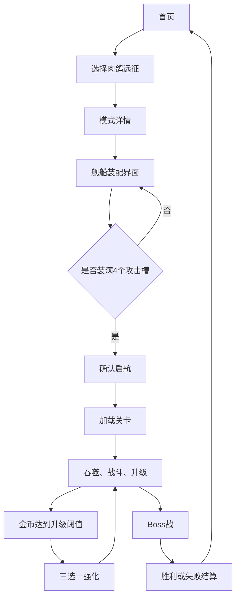

# 《吞吞舰船》肉鸽装配、武器、主动技能与加速系统设计文档

> 文档版本：V1.0  
> 对应模式：肉鸽远征  
> 配套文档：《吞吞舰船》最小可玩 Demo 实现文档、《吞吞舰船》首页、玩法入口与设置系统设计文档  
> 默认引擎：Unity 3D  
> 核心限制：每艘舰船只能装配 4 种攻击手段，每种攻击手段同时提供一种普通攻击和一种主动技能

---

## 1. 本次扩展目标

本次扩展在原有“驾驶—吞噬—战斗—金币升级—Boss”的基础上，增加以下核心内容：

1. 玩家选择“肉鸽远征”后，不再直接进入关卡，而是先进入舰船装配界面。
2. 每艘舰船最多且必须装配 4 种不同攻击手段。
3. 普通攻击以自动攻击、接触触发或航迹布置为主，玩家仍以驾驶和站位为核心操作。
4. 每种攻击手段都拥有一个对应的强力主动技能。
5. 四个已装配武器分别绑定四个技能按键。
6. 局内升级时，根据当前装配的武器生成对应的三选一强化。
7. 增加加速航行按键、加速燃料、恢复延迟和镜头拉远表现。
8. 建立武器公共规则、伤害规则、触发防重、对象池和性能规范。

设计目标不是让玩家同时手动操作四种普通武器，而是：

- 普通武器自动维持战斗节奏。
- 玩家负责驾驶、选择交战角度和规划航线。
- 主动技能负责关键爆发、解围和战术决策。
- 加速负责追击、脱离、抢资源，并与冲撞武器形成组合。

---

## 2. 更新后的完整流程



### 2.1 继续未完成对局

如果后续支持局中存档：

- “继续远征”直接恢复上次的舰船、四武器、强化、技能冷却和燃料状态，不重新进入装配界面。
- “开始新远征”进入装配界面，并在确认启航时覆盖旧对局。

Demo 暂不支持局中存档时，每次开始肉鸽玩法都进入装配界面。

---

## 3. 战斗操作

## 3.1 默认键盘操作

| 输入 | 功能 |
| --- | --- |
| W | 前进、增加油门 |
| S | 减速、倒船 |
| A / D | 左转舵 / 右转舵 |
| Left Shift | 按住进行加速航行 |
| Q | 使用攻击槽 1 的主动技能 |
| E | 使用攻击槽 2 的主动技能 |
| R | 使用攻击槽 3 的主动技能 |
| F | 使用攻击槽 4 的主动技能 |
| 鼠标移动 | 选择区域型技能的目标位置 |
| 鼠标左键 | 确认区域型技能目标 |
| 鼠标右键 / Esc | 取消技能瞄准；未瞄准时打开暂停 |
| Esc | 暂停游戏 |

### 3.2 输入优先级

1. 确认弹窗
2. 升级三选一
3. 技能区域瞄准
4. 暂停菜单
5. 正常驾驶与技能释放

区域技能瞄准期间按 Esc 只取消瞄准，不直接打开暂停菜单。再次按 Esc 才打开暂停。

### 3.3 主动技能按键映射

四个技能按键不直接绑定具体武器名称，而是绑定攻击槽位：

```text
攻击槽 1 → Q
攻击槽 2 → E
攻击槽 3 → R
攻击槽 4 → F
```

玩家可以在装配界面拖动武器卡调整槽位，从而调整技能按键顺序。

---

## 4. 舰船装配界面

## 4.1 界面目标

玩家必须在进入肉鸽关卡前完成以下决策：

- 从已解锁武器中选择 4 种攻击手段。
- 查看每种武器的普通攻击、主动技能和主要战斗标签。
- 安排四种武器对应的 Q/E/R/F 技能顺序。
- 检查舰体挂点冲突。
- 保存当前装配并开始远征。

## 4.2 推荐布局

### 左侧：舰船 3D 预览

- 显示当前舰体和已装配武器模型。
- 支持鼠标拖动旋转、滚轮缩放。
- 鼠标悬停武器卡时，高亮舰船上对应挂点。
- 装配武器时播放模块安装动画。

### 中下方：四个攻击槽

每个槽显示：

- 槽位编号
- 对应技能键 Q/E/R/F
- 武器图标和名称
- 普通攻击类型
- 主动技能图标
- 挂点类型
- 清空或更换按钮

### 右侧：武器库

支持筛选：

- 全部
- 船首
- 甲板
- 侧舷
- 船尾
- 水下
- 船员/无人单位

每张卡显示伤害、攻击间隔、射程、范围、技能冷却和核心标签。

### 右下：详细信息

- 武器完整说明
- 伤害与范围
- 自动索敌规则
- 主动技能说明
- 可出现的强化方向预览
- 与当前装配武器的挂点冲突提示

### 底部按钮

- 返回模式详情
- 推荐装配
- 清空装配
- 确认启航

## 4.3 攻击槽规则

- 每艘船必须装满 4 个攻击槽才可开始。
- Demo 阶段同一种武器不能重复装配。
- 攻击槽是逻辑槽位，决定技能按键，不直接代表模型位置。
- 武器模型根据自己的 `HardpointType` 自动安装在舰体对应挂点。
- 同一独占挂点不能装两种武器，例如两个大型船首武器不能同时装配。
- 冲突武器仍可浏览，但装配按钮显示冲突原因。

## 4.4 舰体挂点

| 挂点 | 数量建议 | 可安装内容 |
| --- | ---: | --- |
| BowHeavy | 1 | 冲撞前锥、焚海喷口、大型声波炮 |
| ForeDeck | 2 | 旋转舰炮、鱼叉炮 |
| MidDeck | 2 | 垂直发射炮、雷暴桅杆 |
| Broadside | 左右各 4 | 侧舷炮组 |
| Stern | 2 | 漂浮炸弹、水雷撒布器 |
| Underwater | 左右各 1 | 鱼雷发射管 |
| CrewStation | 2～6 | 船员机炮 |
| AirDeck | 1 | 无人机蜂巢 |

Demo 可以允许四种武器使用不同类别挂点，减少冲突。正式版本再利用挂点冲突制造构筑取舍。

## 4.5 推荐初始装配

首次进入装配界面时自动提供：

1. 冲撞前锥
2. 船员机炮
3. 侧舷火炮
4. 鱼雷

这套组合同时覆盖正面冲撞、持续射击、侧面输出和远程爆发，方便玩家理解攻击方向差异。

## 4.6 装配数据

```text
RoguelikeLoadout
├── ShipId
├── WeaponSlot1Id
├── WeaponSlot2Id
├── WeaponSlot3Id
├── WeaponSlot4Id
├── SkinId
└── LoadoutVersion
```

装配数据与局内强化分开保存。装配只保存初始武器，不能把上局获得的临时强化带入下一局。

---

## 5. 武器公共规则

## 5.1 普通攻击

- 除冲撞、漂浮炸弹等特殊触发武器外，普通攻击默认自动索敌和自动开火。
- 自动武器只攻击合法目标层。
- 每种武器独立计算射程、角度、攻击间隔和目标优先级。
- 所有普通武器均受暂停、升级选择和结算状态控制。
- 玩家不能通过暂停反复刷新攻击冷却。

## 5.2 主动技能

每种武器必须同时定义：

- 技能名称
- 释放方式
- 冷却时间
- 持续时间或命中次数
- 伤害规则
- 是否需要目标
- 是否允许取消
- 是否受普通武器强化影响
- 技能专属强化

主动技能不消耗额外能量，主要由较长冷却限制。

## 5.3 技能类型

| 类型 | 操作方式 | 示例 |
| --- | --- | --- |
| Instant | 按键立即生效 | 强化冲撞、机炮超载 |
| TargetPoint | 按键进入区域选择，点击确认 | 导弹雨、雷暴区 |
| TargetDirection | 按键后选择方向 | 鱼雷齐射、巨型声波 |
| TargetEnemy | 选择或自动锁定敌人 | 捕鲸锁链、无人机集火 |
| Deploy | 在玩家周围或航迹布置 | 漂浮炸弹阵 |

## 5.4 技能释放保护

- 技能成功生成效果后才进入冷却。
- 区域瞄准取消时不进入冷却。
- 释放瞬间玩家死亡，不返还冷却。
- 技能之间增加 0.2 秒公共输入锁，防止同一帧误触多个技能。
- 技能释放不打断正常驾驶，除非技能明确要求短暂蓄力。
- 瞄准型技能进入 0.25 倍时间流速，最长保持 1.5 秒；超时后恢复正常时间，但仍可继续瞄准。

## 5.5 冷却规则

- HUD 显示剩余秒数和径向遮罩。
- 冷却使用游戏时间，暂停期间停止。
- “技能冷却缩减”默认上限为 40%。
- 持续技能从技能开始时进入冷却，而不是持续结束后才进入冷却。
- 同一技能不能在持续期间再次释放。

---

## 6. 伤害与命中公共规则

## 6.1 伤害类型

| 类型 | 说明 | 典型武器 |
| --- | --- | --- |
| Impact | 物理撞击，受速度和质量影响 | 冲撞前锥 |
| Ballistic | 直接炮弹或机炮伤害 | 船员机炮、侧舷炮 |
| Explosive | 范围爆炸，中心伤害更高 | 导弹、鱼雷、炸弹 |
| Fire | 持续燃烧，可刷新持续时间 | 焚海喷射器 |
| Electric | 可弹射、短暂停顿或感电 | 雷暴桅杆 |
| Control | 推开、减速、牵引或标记 | 鱼叉、声波炮 |

## 6.2 范围伤害衰减

爆炸伤害默认按距离衰减：

```text
中心 0%～35% 半径：100% 伤害
35%～70% 半径：100% 线性降到 70%
70%～100% 半径：70% 线性降到 35%
范围外：0
```

Boss 体型较大时只能结算一次爆炸伤害，不能因为多个碰撞体重复受伤。

## 6.3 伤害实例唯一性

每次攻击生成唯一 `DamageInstanceId`：

- 同一个爆炸实例对同一目标只结算一次。
- 同一枚鱼雷同时触碰多个 Boss 碰撞体，只造成一次伤害。
- 持续范围伤害按固定 Tick 结算，每个 Tick 使用新的子实例编号。
- 所有伤害最终作用于目标根节点的 `DamageReceiver`。

---

## 7. 武器一：冲撞前锥

## 7.1 定位

船首近战、高风险高回报、与加速系统强联动。

### 基础参数

| 参数 | 初始值 |
| --- | ---: |
| 基础伤害 | 30 |
| 最低有效闭合速度 | 3.5 m/s |
| 满额速度参考值 | 12 m/s |
| 单目标触发冷却 | 0.9 秒 |
| 正面有效夹角 | 船首左右各 35° |
| 最大速度伤害倍率 | 2.2 倍 |
| 最大质量倍率 | 1.4 倍 |

## 7.2 撞击伤害公式

只使用玩家冲向目标方向的闭合速度，不直接使用双方速度绝对值：

```text
ToEnemy = Normalize(EnemyPosition - PlayerPosition)
ClosingSpeed = Max(0, Dot(PlayerVelocity - EnemyVelocity, ToEnemy))
SpeedFactor = Clamp(ClosingSpeed / 12, 0, 2.2)
ForwardFactor = Lerp(0.45, 1.0, Clamp01(Dot(PlayerForward, ToEnemy)))
MassFactor = Clamp(Sqrt(PlayerMass / EnemyMass), 0.7, 1.4)

RamDamage = BaseDamage × SpeedFactor × ForwardFactor × MassFactor × BuffFactor
```

规则说明：

- 闭合速度低于 3.5m/s 时不触发前锥伤害，只产生普通挤压和水花反馈。
- 正面撞击伤害最高，擦边撞击会降低伤害。
- 对高速迎面驶来的敌人，闭合速度更高，双方都会承担更大碰撞风险。
- 对体型远大于玩家的 Boss，质量倍率不会低于 0.7，避免完全没有伤害。
- 最终伤害设置单次上限，防止极端物理速度产生异常数值。

## 7.3 避免接触后持续伤害

冲撞伤害只由独立的 `RamHitbox` 触发，不使用船体的 `OnCollisionStay` 持续结算。

完整防重规则：

1. 只在 `OnCollisionEnter` 或前锥触发器首次接触时尝试结算。
2. 为每个目标记录 `LastRamHitTime`。
3. 同一目标 0.9 秒内不能再次受到前锥伤害。
4. 目标与前锥持续接触时，不重新结算。
5. 目标必须离开前锥触发区至少 0.25 秒，才进入“可重新撞击”状态。
6. 再次进入时仍需重新满足最低闭合速度。
7. 多碰撞体敌人统一映射到同一个 `DamageReceiver`，只记录一次。

因此玩家把船头顶在敌人身上不会持续造成撞击伤害；必须脱离并再次加速撞击。

## 7.4 撞击后的速度处理

- 对小型敌人：敌人被推开，玩家保留 75%～90% 前向速度。
- 对同体型敌人：双方产生反冲，玩家保留约 55%～70% 速度。
- 对大型敌人：玩家保留约 30%～50% 速度，并有轻微镜头震动。
- 不能直接把玩家速度归零，否则冲撞构筑会频繁卡在敌人模型上。

## 7.5 主动技能：破浪强袭

- 类型：Instant
- 冷却：30 秒
- 持续：6 秒
- 效果：冲撞伤害 +120%，最低有效速度降至 2.5m/s，撞击后速度保留提高 25%。
- 额外保护：正面受到的碰撞伤害降低 50%，船首高亮并出现破浪特效。
- 与加速联动：技能期间加速燃料消耗降低 20%。

## 7.6 三选一强化池

| 强化卡 | 效果 | 上限 |
| --- | --- | ---: |
| 加重撞角 | 基础冲撞伤害 +25% | 3 |
| 流线船首 | 满额速度参考值降低 10%，更容易打出高倍率 | 2 |
| 贯穿冲击 | 撞击小型敌人后只损失 10% 速度，并可继续撞击下一个目标 | 2 |
| 震荡装药 | 撞击产生 3.5m 冲击波，造成主伤害 40% 的范围伤害 | 2 |
| 掠食修复 | 冲撞击杀恢复 4% 最大生命，每 1 秒最多触发一次 | 2 |
| 强袭延长 | “破浪强袭”持续 +2 秒，技能冷却 -8% | 2 |

---

## 8. 武器二：垂直发射炮

## 8.1 定位

中后甲板远程重火力。普通攻击威力高、范围大、间隔长，但导弹飞行时间长，移动中的玩家和敌人都容易离开落点。

### 基础参数

| 参数 | 初始值 |
| --- | ---: |
| 单发伤害 | 80 |
| 爆炸半径 | 5.5m |
| 攻击间隔 | 8 秒 |
| 最小射程 | 6m |
| 最大射程 | 32m |
| 飞行时间 | 2.2 秒 |
| 落点预警时间 | 0.7 秒 |

## 8.2 普通攻击规则

- 自动选择射程内威胁最高的敌人。
- 发射时锁定目标当时的位置，不持续追踪目标。
- 导弹先垂直升高，再沿抛物线或贝塞尔曲线落向锁定点。
- 落点在最后 0.7 秒显示淡红或橙色预警圈。
- 玩家和敌人都能通过继续移动离开落点。
- 导弹命中水面也会爆炸，不要求直接碰撞船体。

## 8.3 主动技能：饱和导弹雨

- 类型：TargetPoint
- 冷却：42 秒
- 目标范围：以玩家为中心 38m 内选择一个直径 12m 区域。
- 效果：4 秒内落下 12 枚导弹。
- 单枚技能导弹：55 伤害，3.5m 半径。
- 落点规则：70% 分布在目标区内，30% 靠近区内敌人当前位置。
- 同一目标被连续命中时正常受伤，但每 0.15 秒最多承受一枚技能导弹伤害。

## 8.4 三选一强化池

| 强化卡 | 效果 | 上限 |
| --- | --- | ---: |
| 高爆战斗部 | 导弹伤害 +22%，爆炸半径 +8% | 3 |
| 快速装填架 | 普通攻击间隔 -15% | 3 |
| 近炸引信 | 爆炸外圈最低伤害从 35% 提升至 55% | 2 |
| 分裂弹头 | 普通导弹落地后向周围散出 3 枚小弹，各造成 18% 伤害 | 2 |
| 简易预测 | 落点增加目标当前速度 ×0.45 秒的提前量 | 2 |
| 密集轰炸 | 导弹雨 +3 枚导弹，目标区域缩小 8% | 2 |

---

## 9. 武器三：船员机炮

## 9.1 定位

多方向持续火力。每名作战船员拥有独立射击点，伤害低、攻击快，擅长清理小型敌人和补刀。

### 基础参数

| 参数 | 初始值 |
| --- | ---: |
| 初始作战船员 | 2 名 |
| 单发伤害 | 4 |
| 单员攻击间隔 | 0.32 秒 |
| 射程 | 15m |
| 单员射界 | 以座位朝向为中心 150° |
| 最大作战船员 | 6 名 |

## 9.2 普通攻击规则

- 每名作战船员独立选择自己射界内最近的敌人。
- 同一目标可以被多名船员同时攻击。
- 使用射线或高速短弹道，不做昂贵的复杂弹道预测。
- 船员优先攻击小型敌舰、飞行物和残血目标。
- 没有目标时船员回到默认警戒朝向。
- 船员只是武器表现，不在 Demo 中独立受伤或死亡。

## 9.3 主动技能：全员火力压制

- 类型：Instant
- 冷却：32 秒
- 持续：8 秒
- 效果：全部船员攻击间隔 -55%，伤害 +40%，转向速度 +100%。
- 技能期间优先集火玩家附近最高威胁目标。
- 击杀目标后立即切换目标，不产生普通切换停顿。

## 9.4 三选一强化池

| 强化卡 | 效果 | 上限 |
| --- | --- | ---: |
| 扩编战斗班 | 增加 1 名作战船员 | 4 |
| 大口径弹药 | 单发伤害 +25% | 3 |
| 熟练射手 | 攻击间隔 -12%，转向速度 +20% | 3 |
| 交叉火力 | 两名以上船员攻击同一目标时，每多一人伤害 +6% | 2 |
| 处决射击 | 对生命低于 25% 的普通敌人伤害 +45% | 2 |
| 狂热号令 | “全员火力压制”持续 +2 秒，技能伤害再 +15% | 2 |

---

## 10. 武器四：鱼雷

## 10.1 定位

水下直线重型爆发。速度不快、不能急转弯，适合预测敌舰路线或在近距离横切时发射。

### 基础参数

| 参数 | 初始值 |
| --- | ---: |
| 单发伤害 | 115 |
| 爆炸半径 | 6m |
| 攻击间隔 | 10 秒 |
| 移动速度 | 13m/s |
| 最大航程 | 35m |
| 保险距离 | 3m 或 0.4 秒 |
| 转向能力 | 无 |

## 10.2 普通攻击规则

- 自动选择舰船左右前方 60° 区域内的敌人。
- 发射时只确定方向，之后沿水下直线移动。
- 前 0.4 秒处于保险状态，不能被玩家船体或紧贴船身的目标触发。
- 碰到第一个敌方有效目标或大型障碍时爆炸。
- 航程结束时自毁并产生 50% 范围伤害，避免无反馈消失。
- 水面显示淡淡航迹，让玩家和敌人能够判断方向。

## 10.3 主动技能：群鲨齐射

- 类型：TargetDirection
- 冷却：44 秒
- 效果：2.1 秒内连续发射 6 枚鱼雷，每 0.35 秒一枚。
- 排列：中间两枚直线，左右各两枚形成小角度扇形。
- 单枚技能鱼雷：80 伤害，5m 爆炸半径。
- 技能期间仍可转向，因此后续鱼雷方向跟随当前船头变化。

## 10.4 三选一强化池

| 强化卡 | 效果 | 上限 |
| --- | --- | ---: |
| 重型雷头 | 鱼雷伤害 +25% | 3 |
| 增压推进 | 鱼雷速度 +20%，航程 +12% | 3 |
| 磁性引信 | 鱼雷靠近敌人 1.8m 时自动引爆 | 2 |
| 二次爆震 | 爆炸 0.6 秒后产生一次 35% 伤害的小范围爆震 | 2 |
| 猎杀尾迹 | 被鱼雷命中的敌人减速 30%，持续 3 秒 | 2 |
| 狼群战术 | 群鲨齐射 +2 枚鱼雷，发射间隔 -15% | 2 |

---

## 11. 武器五：漂浮炸弹

## 11.1 定位

船尾布置、航迹封锁和追击反制。玩家通过驾驶路线在水面留下危险区域。

### 基础参数

| 参数 | 初始值 |
| --- | ---: |
| 单枚伤害 | 72 |
| 爆炸半径 | 4.5m |
| 投放间隔 | 4.5 秒 |
| 引爆触发半径 | 1.5m |
| 布置后启用时间 | 0.8 秒 |
| 存在时间 | 22 秒 |
| 同时存在上限 | 8 枚 |

## 11.2 普通攻击规则

- 每次攻击从船尾投放一枚炸弹，短暂漂移后固定悬浮在水面。
- 布置后的 0.8 秒内不会引爆，避免刚放下就被紧贴玩家的敌人触发。
- 敌人进入触发半径后立即爆炸。
- 炸弹被敌方炮弹命中时也可提前爆炸。
- 超出存在上限时，最旧炸弹进入 0.5 秒闪烁后安全失效，不产生伤害。
- 玩家和友方单位不会触发自己的炸弹。

## 11.3 主动技能：死亡航迹

- 类型：Deploy
- 冷却：38 秒
- 持续投放：3 秒
- 效果：沿玩家航迹快速撒落 12 枚小型炸弹。
- 单枚伤害：48，爆炸半径 3.5m。
- 布阵形状：左右交错，避免全部重叠在一条直线上。
- 技能炸弹独立使用上限 12，不挤掉普通炸弹。

## 11.4 三选一强化池

| 强化卡 | 效果 | 上限 |
| --- | --- | ---: |
| 高能装药 | 炸弹伤害 +22%，范围 +6% | 3 |
| 自动撒布器 | 投放间隔 -18% | 3 |
| 隐蔽浮标 | 敌人接近至 2.5m 前，炸弹预警亮度降低 | 1 |
| 连锁起爆 | 爆炸会引爆 5m 内其他炸弹；被连锁炸弹伤害降低 20% | 1 |
| 黏性燃料 | 爆炸区域留下 4 秒减速水域，减速 25% | 2 |
| 密集布雷 | 死亡航迹 +4 枚炸弹，技能炸弹存在时间 +6 秒 | 2 |

---

## 12. 新增武器六：侧舷火炮

## 12.1 定位

舰船标志性中距离侧面爆发。需要玩家让敌人进入左舷或右舷射界。

### 基础参数

| 参数 | 初始值 |
| --- | ---: |
| 每侧炮数 | 4 门 |
| 单炮伤害 | 18 |
| 齐射间隔 | 2.8 秒 |
| 射程 | 20m |
| 单侧射界 | 100° |
| 炮弹速度 | 24m/s |

## 12.2 主动技能：全舷轰鸣

- 类型：Instant
- 冷却：34 秒
- 效果：左右两舷连续进行 3 轮齐射，每轮间隔 0.45 秒。
- 技能炮弹附带 2.5m 小范围爆炸，伤害为普通炮弹的 90%。
- 没有目标的一侧仍向当前侧面方向射击，形成弹幕和区域压制。

## 12.3 三选一强化池

| 强化卡 | 效果 | 上限 |
| --- | --- | ---: |
| 加装炮位 | 左右各增加 1 门炮 | 3 |
| 重装火药 | 单炮伤害 +20% | 3 |
| 交错装填 | 齐射间隔 -14% | 3 |
| 破甲炮弹 | 对精英和 Boss 伤害 +20% | 2 |
| 跳弹 | 炮弹命中后向附近目标弹射一次，造成 35% 伤害 | 2 |
| 震天齐射 | 全舷轰鸣增加 1 轮齐射，技能爆炸范围 +15% | 2 |

---

## 13. 新增武器七：旋转速射舰炮

## 13.1 定位

360°稳定单体输出，弥补其他方向型武器的火力空档。

### 基础参数

| 参数 | 初始值 |
| --- | ---: |
| 单发伤害 | 8 |
| 攻击间隔 | 0.18 秒 |
| 射程 | 18m |
| 连续射击过热时间 | 4 秒 |
| 冷却时间 | 1.5 秒 |

## 13.2 主动技能：炮管超载

- 类型：Instant
- 冷却：30 秒
- 持续：8 秒
- 效果：不会过热，攻击间隔 -40%，子弹穿透 2 个目标，伤害 +25%。

## 13.3 三选一强化池

| 强化卡 | 效果 | 上限 |
| --- | --- | ---: |
| 加长炮管 | 伤害 +18%，射程 +8% | 3 |
| 液冷装置 | 过热时间 +35%，冷却时间 -15% | 3 |
| 双联炮座 | 每次发射两枚子弹，单枚伤害变为 65% | 1 |
| 锁定校准 | 持续攻击同一目标每秒增伤 6%，最多 30% | 2 |
| 穿甲弹链 | 每第 8 发子弹穿透并造成 180% 伤害 | 2 |
| 极限超载 | 炮管超载持续 +2 秒，技能穿透数 +1 | 2 |

---

## 14. 新增武器八：捕鲸鱼叉

## 14.1 定位

中距离控制、标记和辅助集火。对小型敌人产生牵引，对大型敌人产生减速和易伤。

### 基础参数

| 参数 | 初始值 |
| --- | ---: |
| 命中伤害 | 36 |
| 攻击间隔 | 4.8 秒 |
| 射程 | 22m |
| 小型敌人牵引距离 | 4m |
| 大型敌人减速 | 25%，持续 2.5 秒 |

## 14.2 主动技能：捕鲸锁链

- 类型：TargetEnemy
- 冷却：40 秒
- 效果：向目标及附近敌人发射最多 5 根重型鱼叉。
- 普通敌人：被拉向中心并眩晕 1.5 秒。
- 精英/Boss：不被强拉，改为减速 50% 并受到伤害 +25%，持续 6 秒。

## 14.3 三选一强化池

| 强化卡 | 效果 | 上限 |
| --- | --- | ---: |
| 倒钩刃 | 鱼叉伤害 +25% | 3 |
| 强力绞盘 | 牵引距离 +30%，大型目标减速 +8% | 2 |
| 快速收索 | 攻击间隔 -18% | 3 |
| 流血创口 | 鱼叉命中后 4 秒内造成总计 40% 额外伤害 | 2 |
| 猎物标记 | 被鱼叉命中的目标 4 秒内受到全武器伤害 +10% | 2 |
| 巨兽束缚 | 捕鲸锁链持续 +2 秒，对 Boss 易伤再 +8% | 2 |

---

## 15. 新增武器九：雷暴桅杆

## 15.1 定位

中距离群体弹射武器，对密集小型敌人表现突出。

### 基础参数

| 参数 | 初始值 |
| --- | ---: |
| 首目标伤害 | 28 |
| 弹射次数 | 3 次 |
| 每次弹射伤害倍率 | 前一次的 72% |
| 攻击间隔 | 2.3 秒 |
| 射程 | 17m |
| 弹射距离 | 6m |

## 15.2 主动技能：移动雷暴

- 类型：Instant
- 冷却：42 秒
- 持续：10 秒
- 效果：以玩家为中心形成雷暴区，每 0.6 秒劈击范围内一个目标。
- 单次伤害：32；命中后向一个附近目标弹射 70% 伤害。
- 同一敌人不会连续承受两次主雷击，除非范围内只有一个目标。

## 15.3 三选一强化池

| 强化卡 | 效果 | 上限 |
| --- | --- | ---: |
| 强化线圈 | 首目标伤害 +22% | 3 |
| 分叉电弧 | 弹射次数 +1 | 3 |
| 超导海水 | 弹射距离 +25%，伤害衰减降低 8% | 2 |
| 感电 | 命中使目标受到机炮和炮弹伤害 +8%，持续 3 秒 | 2 |
| 电涌 | 每第 4 次攻击不进入普通冷却 | 2 |
| 风暴核心 | 移动雷暴持续 +2 秒，雷击间隔 -10% | 2 |

---

## 16. 新增武器十：焚海喷射器

## 16.1 定位

船首近距离持续范围伤害，在追击和穿过敌群时制造燃烧水域。

### 基础参数

| 参数 | 初始值 |
| --- | ---: |
| 喷射距离 | 9m |
| 锥形角度 | 55° |
| 伤害 Tick | 每 0.25 秒 5 点 |
| 额外燃烧 | 2 秒，共 12 点 |
| 启停周期 | 射击 2.5 秒，冷却 1.5 秒 |

## 16.2 持续伤害防重

- 喷射范围每 0.25 秒生成一个新的伤害 Tick。
- 同一 Tick 对同一目标只结算一次。
- 燃烧状态重复命中只刷新持续时间，不无限叠层。
- 强化后允许叠层时必须明确最大层数。

## 16.3 主动技能：燃烧海域

- 类型：TargetPoint
- 冷却：38 秒
- 效果：在目标位置生成半径 10m 的燃烧水域，持续 8 秒。
- 范围内敌人每秒受到 22 点火焰伤害并减速 20%。
- 玩家可以安全穿过自己的燃烧水域。

## 16.4 三选一强化池

| 强化卡 | 效果 | 上限 |
| --- | --- | ---: |
| 高压喷口 | 喷射距离 +18%，锥角 +6° | 3 |
| 黏稠燃油 | 燃烧持续时间 +1.5 秒 | 3 |
| 高温配方 | 喷射与燃烧伤害 +20% | 3 |
| 火势蔓延 | 燃烧敌人死亡时留下 3m 火区，持续 3 秒 | 2 |
| 熔甲 | 连续燃烧 2 秒后，使目标护甲降低 15% | 2 |
| 烈焰汪洋 | 燃烧海域半径 +20%，持续 +2 秒 | 2 |

---

## 17. 新增武器十一：无人机蜂巢

## 17.1 定位

自动追踪、跨方向持续输出。适合不想频繁调整射界的稳定构筑。

### 基础参数

| 参数 | 初始值 |
| --- | ---: |
| 初始无人机 | 2 架 |
| 单发伤害 | 6 |
| 单机攻击间隔 | 0.65 秒 |
| 作战半径 | 玩家周围 20m |
| 最大常驻无人机 | 5 架 |

## 17.2 普通攻击规则

- 无人机在玩家周围盘旋，自动接近目标但不离开作战半径。
- Demo 中无人机不承受伤害，避免增加回收和补充复杂度。
- 无目标时返回舰船附近编队。
- 无人机只是武器子单位，不占敌人碰撞和寻路预算。

## 17.3 主动技能：蜂群出击

- 类型：TargetEnemy 或自动锁定
- 冷却：46 秒
- 持续：10 秒
- 效果：额外释放 8 架临时无人机，集中攻击目标及其附近敌人。
- 临时无人机单发伤害 7，攻击间隔 0.55 秒。
- 目标死亡后自动转移到最近敌人。

## 17.4 三选一强化池

| 强化卡 | 效果 | 上限 |
| --- | --- | ---: |
| 扩充机库 | 常驻无人机 +1 | 3 |
| 武装升级 | 无人机伤害 +22% | 3 |
| 快速机动 | 作战半径 +15%，切换目标速度 +30% | 2 |
| 爆破无人机 | 每第 10 次命中产生 2.5m 爆炸，造成 30 点伤害 | 2 |
| 护航协议 | 无人机靠近玩家时，玩家受到伤害降低 2%/架，最多 8% | 2 |
| 全巢出动 | 蜂群出击 +3 架临时无人机，持续 +2 秒 | 2 |

---

## 18. 新增武器十二：海啸声波炮

## 18.1 定位

船首中近距离控制武器，产生锥形冲击波，推开敌人并打断部分冲锋。

### 基础参数

| 参数 | 初始值 |
| --- | ---: |
| 单次伤害 | 42 |
| 攻击间隔 | 5 秒 |
| 范围 | 12m |
| 锥角 | 70° |
| 普通敌人击退 | 4m |
| Boss 击退 | 0，改为短暂减速 |

## 18.2 主动技能：三重海啸

- 类型：TargetDirection
- 冷却：44 秒
- 效果：向目标方向连续释放 3 道大型扩散波，每道间隔 0.6 秒。
- 单道伤害：75，范围 22m，锥角 85°。
- 第一波强击退，第二波减速，第三波对已被命中的目标额外造成 35% 伤害。

## 18.3 三选一强化池

| 强化卡 | 效果 | 上限 |
| --- | --- | ---: |
| 增压音舱 | 声波伤害 +22% | 3 |
| 广域共振 | 范围 +15%，锥角 +8° | 3 |
| 余波 | 普通声波 0.5 秒后产生一次 30% 伤害的小余波 | 2 |
| 破浪排斥 | 对冲锋中的敌人伤害 +40%，击退 +35% | 2 |
| 共振裂甲 | 命中后目标受到爆炸伤害 +12%，持续 4 秒 | 2 |
| 海啸不息 | 三重海啸增加第 4 道波，技能冷却 -8% | 2 |

---

## 19. 武器总览与构筑定位

| 武器 | 主要方向 | 普通攻击频率 | 主动技能 | 操作重点 |
| --- | --- | --- | --- | --- |
| 冲撞前锥 | 正面近战 | 由碰撞决定 | 强化冲撞 | 加速、脱离、再次撞击 |
| 垂直发射炮 | 远程范围 | 很慢 | 区域导弹雨 | 预判敌群位置 |
| 船员机炮 | 多方向持续 | 很快 | 全员超载 | 保持敌人在近中距离 |
| 鱼雷 | 直线爆发 | 很慢 | 多雷齐射 | 预测航线 |
| 漂浮炸弹 | 船尾布置 | 中等 | 大片布雷 | 规划自己的航迹 |
| 侧舷火炮 | 侧面爆发 | 中等 | 全舷多轮齐射 | 横向经过敌人 |
| 旋转速射炮 | 全向单体 | 很快 | 无过热穿透 | 稳定追踪精英 |
| 捕鲸鱼叉 | 控制辅助 | 较慢 | 群体束缚与易伤 | 控制关键目标 |
| 雷暴桅杆 | 群体弹射 | 中等 | 移动雷暴 | 冲入密集敌群 |
| 焚海喷射器 | 前方持续范围 | 持续 | 燃烧区域 | 近距离追击 |
| 无人机蜂巢 | 自动追踪 | 快 | 蜂群集火 | 保持作战半径 |
| 海啸声波炮 | 前方控制 | 较慢 | 多重巨浪 | 推开、解围、打断 |

### 19.1 推荐构筑示例

#### 破浪冲锋流

- 冲撞前锥
- 船员机炮
- 海啸声波炮
- 捕鲸鱼叉

玩法：鱼叉减速目标，开启强化冲撞，加速撞入敌群，再用声波推开并重新拉开距离。

#### 航迹陷阱流

- 漂浮炸弹
- 鱼雷
- 垂直发射炮
- 捕鲸鱼叉

玩法：利用炸弹封锁路线，鱼叉限制敌人，导弹和鱼雷攻击被迫改变航线的目标。

#### 自动火力流

- 船员机炮
- 旋转速射炮
- 无人机蜂巢
- 雷暴桅杆

玩法：几乎不依赖固定射界，专注驾驶、吞噬和躲避，适合新玩家。

#### 重型侧舷流

- 侧舷火炮
- 鱼雷
- 垂直发射炮
- 漂浮炸弹

玩法：绕敌舰横向航行，侧舷齐射后投放炸弹脱离，再用鱼雷和导弹打击追击者。

---

## 20. 局内三选一强化系统

## 20.1 强化来源

升级卡只从以下池中生成：

1. 当前已装配的 4 种武器强化。
2. 主动技能通用强化。
3. 舰体、生存、吞噬和移动强化。
4. 加速燃料强化。

未装配武器的专属强化绝不会出现。

## 20.2 三选一抽取规则

每次升级生成 3 张不重复卡牌：

- 60% 权重：武器专属强化。
- 15% 权重：技能通用强化。
- 15% 权重：舰体与生存强化。
- 10% 权重：移动与燃料强化。

保护规则：

- 每组三选一至少包含 2 张与已装备武器直接相关的卡。
- 同一武器连续 3 次升级未出现时，下次提高其权重。
- 已达上限的卡不再出现。
- 三张卡不能是完全相同的效果类型。
- 玩家生命低于 30% 时，至少有 25% 概率出现修复或防御选项，但不强制每次保底。
- Boss 出现后仍可升级，但不会弹出需要更换武器的卡。

## 20.3 通用技能强化

| 强化卡 | 效果 | 上限 |
| --- | --- | ---: |
| 快速备战 | 全部主动技能冷却 -8% | 4 |
| 过载弹药 | 全部主动技能伤害 +15% | 3 |
| 延长指令 | 持续型主动技能持续时间 +15% | 3 |
| 战术预备 | 每次进入新阶段时，随机完成一个技能 35% 冷却 | 2 |
| 连携作战 | 使用一个技能后，其他技能减少 1.5 秒冷却；每 3 秒限一次 | 2 |
| 绝境启动 | 生命低于 25% 时立即完成一个随机技能冷却；每局一次 | 1 |

## 20.4 舰体与生存强化

| 强化卡 | 效果 | 上限 |
| --- | --- | ---: |
| 扩建舰体 | 最大生命 +25，体积 +5% | 4 |
| 应急修补 | 立即恢复 35% 最大生命 | 无限，降低出现权重 |
| 复合装甲 | 受到的普通炮弹伤害 -8% | 3 |
| 防爆隔舱 | 受到的爆炸伤害 -10% | 3 |
| 掠夺修复 | 吞噬大型目标恢复 3% 最大生命 | 2 |
| 威胁感知 | 高伤害落点预警提前 0.35 秒显示 | 1 |

## 20.5 移动与燃料强化

| 强化卡 | 效果 | 上限 |
| --- | --- | ---: |
| 扩容燃料舱 | 最大加速燃料 +20% | 3 |
| 高效推进 | 加速燃料消耗 -12% | 3 |
| 回收涡轮 | 燃料恢复速度 +18% | 3 |
| 紧急点火 | 燃料低于 15% 时仍可额外加速 1 秒，每 20 秒一次 | 1 |
| 高速舵面 | 加速状态下转向效率 +15% | 2 |
| 尾流护盾 | 加速时受到伤害降低 8% | 2 |

---

## 21. 加速航行系统

## 21.1 设计目标

加速不是短促闪避，而是一段相对充足的高速航行资源：

- 可以用于追击逃跑的商船。
- 可以快速脱离导弹落点和 Boss 范围攻击。
- 可以帮助冲撞构筑积累闭合速度。
- 燃料总量较多，允许玩家连续使用数秒。
- 燃料恢复较慢，避免全程保持加速。

## 21.2 基础参数

| 参数 | 初始值 |
| --- | ---: |
| 最大燃料 | 120 |
| 每秒消耗 | 16 |
| 满燃料连续加速 | 7.5 秒 |
| 停止后的恢复延迟 | 2.5 秒 |
| 每秒恢复 | 4 |
| 空燃料恢复至满 | 30 秒，不含恢复延迟 |
| 最大速度倍率 | 1.65 倍 |
| 加速度倍率 | 1.4 倍 |
| 转向效率 | 普通状态的 85% |
| 启动所需最低燃料 | 8 |
| 低燃料警戒值 | 20% |

## 21.3 使用规则

- 按住 Left Shift 且舰船前进输入大于 0 时启动。
- 倒船时不能使用加速。
- 燃料低于 8 时无法新启动。
- 已经处于加速状态时可以消耗到 0。
- 松开按键或燃料耗尽后结束加速。
- 结束后等待 2.5 秒才开始恢复。
- 恢复过程中再次加速会立即停止恢复并重新计算延迟。
- 暂停、升级选择和结算期间不消耗也不恢复。

## 21.4 镜头表现

| 状态 | 镜头距离 | 视野与表现 |
| --- | --- | --- |
| 普通航行 | 22m | 标准跟随 |
| 加速启动 | 22→28m，0.35 秒 | 镜头平滑拉远 |
| 持续加速 | 28m | 前瞻增加 35%，边缘轻微速度线 |
| 加速结束 | 28→22m，0.55 秒 | 缓慢回收，避免镜头抽动 |

如果舰体升级导致基础镜头距离增加，加速距离使用“基础距离 +6m”，而不是固定回到 22m。

## 21.5 视觉与声音

- 船尾水花和尾流长度明显增加。
- 引擎或推进结构发光。
- 开始加速时播放短促启动音。
- 持续阶段提升风声和水流声。
- 燃料低于 20% 时进度条变橙并播放一次提示音。
- 燃料耗尽时播放熄火音，不反复报警。

## 21.6 加速与冲撞联动

- 冲撞使用实际闭合速度计算，不直接判断“是否正在加速”。
- 加速自然提高冲撞伤害，但仍受角度、质量和单次伤害上限限制。
- 强化冲撞技能可以降低燃料消耗，但不能生成额外燃料。
- 撞到大型目标后仍按照碰撞规则损失速度，防止无限高速顶住 Boss。

## 21.7 加速燃料 UI

位置建议：HUD 下方偏左或舰船速度表附近。

组成：

- 燃料背景槽
- 当前燃料填充
- 恢复延迟遮罩
- 加速图标
- `Shift` 按键提示
- 低燃料警戒线

状态颜色：

- 60%～100%：青蓝或明亮颜色
- 20%～60%：正常主色
- 0%～20%：橙色
- 0：灰色并显示恢复状态

恢复延迟期间，进度条不增长，但使用从左向右扫过的细线表示“即将开始恢复”。

---

## 22. 战斗 HUD

## 22.1 四技能栏

屏幕下方中央显示四个技能槽：

```text
[Q 武器1技能] [E 武器2技能] [R 武器3技能] [F 武器4技能]
```

每个槽包含：

- 武器技能图标
- 对应按键
- 冷却径向遮罩
- 剩余秒数
- 技能准备完成高亮
- 无合法目标提示
- 技能强化等级小标记

## 22.2 普通攻击状态

不需要为每个普通攻击单独显示大按钮，但技能槽边缘可以显示：

- 白色：普通武器待机
- 黄色：已经锁定目标
- 红色短闪：无法攻击或挂点被阻挡
- 蓝色流动：主动技能持续中

## 22.3 区域技能瞄准

- 显示最大施法范围圆。
- 鼠标位置显示技能落点范围。
- 合法位置为蓝/绿，不合法位置为红。
- 显示预计命中的敌人数，只作为辅助，不保证实际命中。
- 超出范围时将落点吸附在最大范围边缘。
- 左键确认，右键或 Esc 取消。

## 22.4 燃料和技能的视觉层级

- 燃料条负责持续资源，位置靠近速度信息。
- 技能栏负责离散冷却，放在中央。
- 不要把燃料做成第五个技能槽，避免玩家误认为它是一次性技能。

---

## 23. Unity 数据结构

## 23.1 武器定义

```csharp
[CreateAssetMenu]
public class WeaponDefinition : ScriptableObject
{
    public string weaponId;
    public string displayName;
    public Sprite icon;
    public GameObject modulePrefab;
    public HardpointType hardpointType;
    public WeaponTargetingType targetingType;
    public WeaponTag[] tags;
    public WeaponBaseStats baseStats;
    public ActiveSkillDefinition activeSkill;
    public UpgradeDefinition[] upgradePool;
}
```

## 23.2 主动技能定义

```csharp
[CreateAssetMenu]
public class ActiveSkillDefinition : ScriptableObject
{
    public string skillId;
    public string displayName;
    public Sprite icon;
    public SkillCastType castType;
    public float cooldown;
    public float castRange;
    public float areaRadius;
    public float duration;
    public GameObject previewPrefab;
    public GameObject effectPrefab;
}
```

## 23.3 运行时槽位

```text
RuntimeWeaponSlot
├── SlotIndex
├── InputActionReference
├── WeaponDefinition
├── WeaponRuntimeInstance
├── SkillRuntimeInstance
├── CurrentCooldown
└── AppliedUpgrades
```

## 23.4 加速配置

```text
BoostConfig
├── MaxFuel
├── DrainPerSecond
├── RegenDelay
├── RegenPerSecond
├── SpeedMultiplier
├── AccelerationMultiplier
├── TurnMultiplier
├── MinimumStartFuel
└── CameraDistanceBonus
```

---

## 24. 主要脚本职责

| 脚本 | 职责 |
| --- | --- |
| `LoadoutScreenController` | 装配界面状态、筛选、四槽校验和启航 |
| `ShipHardpointController` | 查找挂点、检查冲突、安装武器模型 |
| `WeaponSlotController` | 管理一个攻击槽的武器、技能和输入 |
| `AutoWeaponController` | 普通攻击索敌、射界、冷却和开火 |
| `ActiveSkillController` | 技能输入、瞄准、释放和冷却 |
| `SkillTargetingController` | 点、方向、敌人目标的预览与确认 |
| `DamageService` | 统一伤害实例、防重、范围衰减和事件 |
| `RamController` | 前锥检测、闭合速度、单目标重撞解锁 |
| `BallisticProjectile` | 抛物线/贝塞尔导弹轨迹和落点爆炸 |
| `TorpedoProjectile` | 水下直线移动、保险距离和范围爆炸 |
| `MineController` | 布置、启用、触发、连锁和寿命 |
| `CrewWeaponController` | 作战船员射界、独立目标和机炮射击 |
| `BoostController` | 燃料、消耗、恢复、速度倍率和状态事件 |
| `BoostHUDController` | 燃料条、延迟、警戒和按键提示 |
| `CombatHUDController` | 四技能槽和武器状态 |
| `UpgradeDraftController` | 根据装配生成三选一强化 |

---

## 25. 索敌与性能规范

## 25.1 统一目标注册

- 所有敌人注册到 `TargetRegistry`。
- 玩家附近使用分区、空间哈希或范围触发器获得候选列表。
- 不允许每种武器各自执行 `FindObjectsOfType`。
- 普通武器索敌频率 5～10 次/秒即可。
- 船员机炮可以共享候选列表，每名船员只做角度和优先级计算。

## 25.2 对象池

必须进入对象池的对象：

- 机炮子弹
- 侧舷炮弹
- 导弹
- 鱼雷
- 漂浮炸弹
- 爆炸与水花
- 无人机
- 伤害数字
- 技能范围表现

## 25.3 上限控制

| 对象 | 建议同屏上限 |
| --- | ---: |
| 普通炮弹 | 120 |
| 机炮弹/射线表现 | 160 |
| 导弹 | 40 |
| 鱼雷 | 24 |
| 普通漂浮炸弹 | 每玩家 8 |
| 技能漂浮炸弹 | 每玩家 12 |
| 无人机 | 常驻 5 + 技能 8 |
| 同时范围预警 | 20 |

达到表现上限时优先合并视觉或回收最旧的非关键对象，不能让新技能完全无法生成。

---

## 26. 数值调试指标

每局记录以下数据：

- 四种武器的总伤害和伤害占比。
- 每种主动技能的释放次数、命中数和伤害。
- 技能空放率。
- 冲撞平均闭合速度和重复触发拦截次数。
- 导弹、鱼雷的命中率。
- 漂浮炸弹平均存在时长和触发率。
- 加速使用总时长。
- 燃料处于满值、低值和空值的时间占比。
- 玩家因技能瞄准停留的平均时间。

目标区间：

| 指标 | 初始目标 |
| --- | --- |
| 单个武器伤害占比 | 15%～35%，不应长期超过 50% |
| VLS 普通导弹命中率 | 35%～55% |
| 鱼雷普通命中率 | 30%～50% |
| 漂浮炸弹触发率 | 45%～70% |
| 主动技能每局释放次数 | 每种 2～5 次 |
| 加速使用时间占比 | 15%～30% |
| 燃料完全耗尽次数 | 每局 1～4 次 |

---

## 27. 分阶段实现顺序

## 阶段 1：四槽装配框架

- 增加肉鸽模式后的装配界面。
- 完成四槽、武器卡、详情和技能键显示。
- 完成挂点安装和冲突校验。
- 将装配带入战斗场景。

验收：四个槽位顺序与战斗 HUD 的 Q/E/R/F 完全一致。

## 阶段 2：统一武器与技能框架

- 建立 `WeaponDefinition` 和 `ActiveSkillDefinition`。
- 实现自动索敌、攻击冷却和四技能输入。
- 实现 Instant、TargetPoint、TargetDirection 三种技能类型。
- 完成技能 HUD 和冷却。

## 阶段 3：首批五武器

按以下顺序实现：

1. 船员机炮
2. 漂浮炸弹
3. 鱼雷
4. 垂直发射炮
5. 冲撞前锥

冲撞最后实现，是因为需要先有稳定的物理移动、敌人碰撞和统一伤害防重。

## 阶段 4：加速系统

- 完成燃料消耗、恢复延迟和恢复。
- 接入舰船速度与加速度倍率。
- 完成镜头拉远、尾流、音效和燃料 UI。
- 验证冲撞闭合速度与加速联动。

## 阶段 5：三选一强化

- 每个首批武器先实现 3 张核心强化。
- 接入只生成已装配武器强化的规则。
- 完成满级过滤、连续未出现补偿和通用卡。
- 验证强化能正确修改运行时实例，不污染基础配置。

## 阶段 6：新增武器

建议扩充顺序：

1. 侧舷火炮
2. 旋转速射舰炮
3. 捕鲸鱼叉
4. 雷暴桅杆
5. 海啸声波炮
6. 焚海喷射器
7. 无人机蜂巢

先实现射击与控制类，再做持续区域和子单位，降低系统同时变复杂的风险。

---

## 28. 验收清单

### 装配

- [ ] 选择肉鸽模式后进入装配界面，而不是直接加载关卡。
- [ ] 未装满 4 个攻击手段时不能启航。
- [ ] 同一武器在 Demo 阶段不能重复装配。
- [ ] 挂点冲突有明确原因提示。
- [ ] 拖动槽位后 Q/E/R/F 映射同步变化。
- [ ] 返回首页再进入时保留上一次初始装配。

### 主动技能

- [ ] 四个已装配武器都有独立技能。
- [ ] Q/E/R/F 与 HUD 顺序一致。
- [ ] 取消区域瞄准不会消耗技能冷却。
- [ ] 暂停期间技能冷却停止。
- [ ] 技能释放后可以继续驾驶。
- [ ] 技能无合法目标时有提示，不静默浪费冷却。

### 冲撞前锥

- [ ] 低速顶住敌人不会持续造成伤害。
- [ ] 同一次接触只结算一次。
- [ ] 多碰撞体敌人不会重复受伤。
- [ ] 脱离后重新加速可以再次造成伤害。
- [ ] 正面高速撞击高于擦边低速撞击。
- [ ] 加速提高伤害但不会突破伤害上限。

### 垂直发射炮

- [ ] 导弹使用发射时落点，不无限追踪敌人。
- [ ] 玩家和敌人都能驶出预警区。
- [ ] 导弹落水仍然爆炸。
- [ ] 导弹雨不会对同一目标因多碰撞体重复伤害。

### 船员机炮

- [ ] 每名船员只攻击自己的合法射界。
- [ ] 多船员可以集火同一目标。
- [ ] 技能结束后攻击间隔正确恢复。
- [ ] 大量小型敌人出现时没有明显索敌卡顿。

### 鱼雷

- [ ] 发射后沿水下直线移动。
- [ ] 保险阶段不会立刻碰到玩家自身。
- [ ] 航程结束能够自毁并回收。
- [ ] 多发技能鱼雷不会互相碰撞。

### 漂浮炸弹

- [ ] 炸弹布置后有启用延迟。
- [ ] 玩家不会触发自己的炸弹。
- [ ] 达到上限后最旧炸弹安全失效。
- [ ] 连锁爆炸不会重复伤害或无限递归。

### 三选一强化

- [ ] 只出现当前四武器的专属强化。
- [ ] 已满级卡不会再次出现。
- [ ] 强化普通攻击和主动技能时数值正确。
- [ ] 重新开始新一局不会保留旧局强化。
- [ ] 三张卡不存在完全相同效果。

### 加速

- [ ] Shift 按住时消耗燃料并提高速度。
- [ ] 倒船时不能启动。
- [ ] 停止后经过恢复延迟才恢复。
- [ ] 暂停期间不消耗也不恢复。
- [ ] 加速时镜头平滑拉远，结束后平滑恢复。
- [ ] 低燃料和燃料耗尽有一次性提示。
- [ ] 连续启停不会让镜头抖动或突破最大速度。

---

## 29. Demo 最小落地版本

如果需要尽快验证，不必一次做完 12 种武器。第一轮可玩版本建议包含：

- 1 个装配界面
- 4 个攻击槽和 Q/E/R/F 技能
- 5 种首批武器：冲撞前锥、垂直发射炮、船员机炮、鱼雷、漂浮炸弹
- 每种武器 1 个主动技能
- 每种武器先实现 3 张核心强化
- 6 张通用强化
- Shift 加速和完整燃料 UI
- 1 套推荐装配

第二轮再加入侧舷火炮、鱼叉、雷暴、无人机等扩展武器。

第一轮验证重点不是武器数量，而是以下三点：

1. 四种自动武器加四个主动技能是否会让操作过载。
2. 装配选择是否能形成明显不同的驾驶路线和交战角度。
3. 加速、冲撞、布雷、鱼雷和导弹之间是否能产生自然的组合玩法。

只要这三个问题成立，后续增加武器、舰体和海盗模式都会有稳定的战斗基础。
