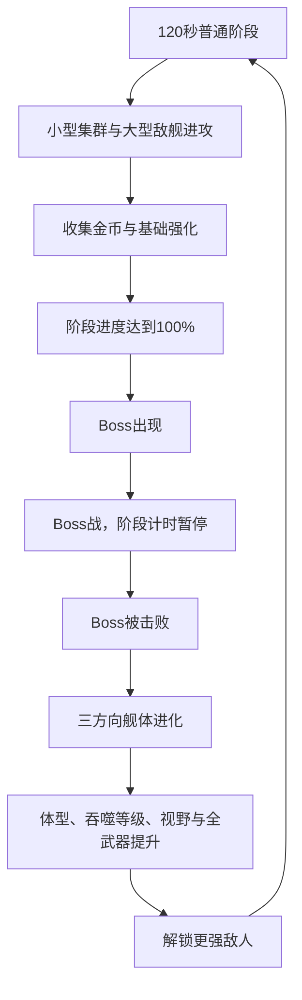

# 《吞吞舰船》敌人生态、两分钟阶段与 Boss 进化系统设计文档

> 文档版本：V1.0  
> 对应模式：肉鸽远征  
> 文档性质：独立增量设计，不修改旧文档文件  
> 最新规则：涉及敌人类型、阶段节奏、Boss 出现、船体变大、吞噬等级和视野成长时，以本文件为准  
> 推荐首版单局：5 个普通阶段 + 5 场 Boss，基础时长约 10 分钟，Boss 战时间另计

---

## 1. 本次设计目标

本次扩展解决以下问题：

1. 增加能成群进攻、可以被轻易吞噬的小型单位。
2. 增加鲨鱼群、鲸鱼等海洋生物敌人，丰富敌人轮廓和移动方式。
3. 增加装配冲撞、导弹、机炮、鱼雷、炸弹、鱼叉、雷电、无人机等武器的大型敌舰。
4. 将单局划分为清晰的 120 秒阶段，每个阶段结束后出现 Boss。
5. 击败 Boss 后固定触发一次舰体三方向进化。
6. 将船体变大、吞噬等级提升和视野扩大从普通三选一中移除。
7. 舰体进化后解锁更强的敌人和更高威胁的组合进攻。
8. 增加能够显示阶段、Boss 倒计时、敌人解锁与舰体进化的 HUD。

新的核心节奏为：



---

## 2. “每 2 分钟出现 Boss”的准确规则

## 2.1 阶段计时方式

“每 2 分钟出现 Boss”定义为：

- 每个普通战斗阶段固定持续 120 秒。
- 120 秒倒计时结束时停止普通阶段计时并生成 Boss。
- Boss 存活期间不推进下一阶段的 120 秒倒计时。
- 击败 Boss、完成进化选择后，下一阶段从 0:00 重新开始。
- 因此不会出现上一只 Boss 未击败，下一只 Boss 又按绝对时间生成的问题。

## 2.2 标准单局结构

| 阶段 | 普通阶段 | Boss | 进化后舰体等级 |
| --- | ---: | --- | ---: |
| 航段 1 | 0:00～2:00 | Boss 1 | 舰体 Lv.2 |
| 航段 2 | 0:00～2:00 | Boss 2 | 舰体 Lv.3 |
| 航段 3 | 0:00～2:00 | Boss 3 | 舰体 Lv.4 |
| 航段 4 | 0:00～2:00 | Boss 4 | 舰体 Lv.5 |
| 航段 5 | 0:00～2:00 | 最终 Boss | 舰体 Lv.6，进入胜利结算 |

普通阶段合计 10 分钟。假设每场 Boss 战持续 40～80 秒，完整单局约 13～16 分钟。

如果希望单局更短，可以使用 4 个航段；如果后续做无尽模式，则击败第 5 个 Boss 后继续循环高级航段。

## 2.3 Boss 超时

- Boss 出现 75 秒后进入一级狂暴：攻击频率 +15%。
- Boss 出现 120 秒后进入二级狂暴：伤害 +20%、额外召唤小型单位。
- 不生成下一只 Boss。
- 狂暴只增加战斗压力，不无限提高移动速度，避免玩家永远无法追上。

---

## 3. 敌人威胁层级

| 层级 | 名称 | 特点 | 能否直接吞噬 |
| ---: | --- | --- | --- |
| T0 | 微型单位 | 小舟、小型冲撞舟、鱼群 | 可以，满足吞噬等级即可满血吞噬 |
| T1 | 小型单位 | 武装快艇、鲨鱼、爆破筏 | 舰体等级足够时可直接吞噬或低血吞噬 |
| T2 | 中型单位 | 炮艇、鱼雷艇、布雷舰、虎鲨 | 通常需降至 30% 生命以下 |
| T3 | 大型单位 | 巡洋舰、导弹舰、鲸鱼、造船母舰 | 通常需降至 15% 生命以下 |
| T4 | 巨型单位 | 战列舰、航母、远古鲸、海上堡垒 | 不能直接吞噬活体，只能在击败后吞噬残骸 |
| T5 | Boss | 阶段首领 | 战斗中不可吞噬，击败后吸收进化核心 |

## 3.1 小型单位吞噬规则

小舟、冲撞舟、普通鲨鱼等集群单位的主要定位之一，就是让玩家主动冲入敌群吞噬：

- `EnemyDevourTier <= PlayerDevourLevel` 时，T0 单位满血也能被船首直接吞噬。
- 被船首吞噬触发区捕获后，立即关闭攻击、碰撞和队形逻辑。
- 经过 0.15～0.3 秒吸入动画后消失并掉落实体金币。
- 吞噬过程不会直接增加金币，金币仍需飞出、吸附并到达舰船后到账。
- 小型冲撞舟如果从船侧或船尾撞到玩家，仍可先造成冲撞伤害；只有进入船首吞噬区才会被安全吞噬。

## 3.2 中大型单位吞噬规则

```text
T1：吞噬等级足够时可满血吞噬；否则生命低于50%才可吞噬
T2：吞噬等级足够且生命低于30%才可吞噬
T3：吞噬等级足够且生命低于15%才可吞噬
T4：活体不可吞噬，击败后残骸可吞噬
T5：Boss战中不可吞噬，死亡后只吸收进化核心
```

目标进入可吞噬状态后：

- 生命条边框变为可吞噬颜色。
- 船体或生物出现破损、虚弱特效。
- 靠近船首时出现吸入方向提示。

---

## 4. 小型集群单位

小型单位不能只作为血量很低的普通敌人。它们应该通过数量、队形和攻击方向制造压力，同时成为玩家的吞噬资源。

## 4.1 小舟

### 定位

最基础的远程集群单位，以 5～12 艘为一组从玩家一侧接近。

### 行为

- 进入 10～14m 距离后减速。
- 朝玩家发射单体投射物。
- 发射后横向散开，避免全部堆在同一点。
- 单舟攻击弱，但集体齐射会形成明显弹幕。
- 玩家转向冲入队形可以连续吞噬。

### 初始参数

| 参数 | 数值 |
| --- | ---: |
| 生命 | 8 |
| 速度 | 8.5m/s |
| 单发伤害 | 3 |
| 攻击间隔 | 2.6 秒 |
| 射程 | 13m |
| 编队数量 | 5～12 |
| 吞噬层级 | T0 |

### 集体攻击

- 不让所有小舟在同一帧开火。
- 队长发出齐射信号后，各单位在 0～0.7 秒内依次发射。
- 这样能形成可以观察和躲避的弹幕波，而不是瞬间结算大量伤害。

## 4.2 小型冲撞舟

### 定位

高速冲锋单位，单体脆弱，成群从玩家前方或侧前方发动撞击。

### 行为

1. 在 18～24m 外进入锁定状态。
2. 船头闪光并显示短暂冲撞预警线。
3. 0.7 秒后向预测位置高速直冲。
4. 冲锋期间转向能力很弱。
5. 撞击、冲过目标或被吞噬后结束冲锋。

### 初始参数

| 参数 | 数值 |
| --- | ---: |
| 生命 | 10 |
| 普通速度 | 7m/s |
| 冲锋速度 | 16m/s |
| 撞击伤害 | 8 |
| 冲锋冷却 | 5 秒 |
| 编队数量 | 4～9 |
| 吞噬层级 | T0 |

### 防连续伤害

- 冲撞舟每次冲锋生成一个独立冲撞实例。
- 同一次接触只能对玩家结算一次。
- 撞到玩家后立即进入失控状态并弹开。
- `OnCollisionStay` 不造成持续伤害。

## 4.3 火箭小舟

- 6～10 艘成群出现。
- 停在较远距离发射速度较慢的小火箭。
- 火箭有明显烟迹，可被玩家转向躲避。
- 单舟生命 9，攻击间隔 4 秒。
- 适合从航段 2 开始刷新。

## 4.4 爆破筏

- 携带火药桶主动靠近玩家。
- 船体持续闪烁，接近 2.5m 后开始 0.8 秒引爆倒计时。
- 玩家可提前击破，使其原地爆炸并伤害附近敌人。
- 被船首成功吞噬时火药被压制，不发生爆炸。
- 形成“吞噬比射击更安全”的小型单位。

## 4.5 撒网舟

- 以 3～6 艘为一组从侧面靠近。
- 向玩家前方投出漂浮渔网区域。
- 玩家经过渔网时速度降低 25%，持续 2 秒。
- 渔网可以被冲撞前锥、火焰或爆炸清除。
- 撒网舟本身伤害低，主要协助冲撞舟和炮艇命中。

## 4.6 烟雾舟

- 向水面投放持续 4 秒的烟雾。
- 烟雾内敌人更难被自动武器锁定，但近距离仍可攻击。
- 玩家进入烟雾不会失去操控，只降低视野清晰度和远程索敌距离。
- 烟雾舟通常混在其他小舟队伍中。

## 4.7 维修小艇

- 不直接攻击玩家。
- 跟随中大型敌舰，每秒为目标恢复少量生命。
- 受到攻击后逃向队伍后方。
- 生命很低，可以被快速吞噬。
- 玩家需要优先冲入敌阵处理它。

## 4.8 护盾小艇

- 3 艘组成三角阵，为阵内小型单位提供 20% 远程减伤。
- 护盾不能防止吞噬和冲撞。
- 击破任意一艘会在护盾上形成缺口。
- 从航段 3 开始刷新。

## 4.9 鱼叉小舟

- 发射轻型鱼叉，短暂降低玩家转向速度。
- 多艘鱼叉小舟命中时效果不叠加，只刷新持续时间。
- 适合与冲撞舟从不同方向组合。

## 4.10 信号小舟

- 每 8 秒呼叫一组 3～5 艘小舟增援。
- 自身没有攻击能力，持续远离玩家。
- 每艘信号小舟最多呼叫两次。
- 吞噬后掉落略多金币。

---

## 5. 小型单位编队

| 编队 | 构成 | 战术 |
| --- | --- | --- |
| 扇形齐射 | 8～12 艘小舟 | 从正面展开并分批发射 |
| 双翼冲锋 | 左右各 3～5 艘冲撞舟 | 从两侧夹击，逼迫玩家选择吞噬方向 |
| 网与矛 | 2 艘撒网舟 + 5 艘冲撞舟 | 先减速，再冲撞 |
| 烟幕炮击 | 2 艘烟雾舟 + 6 艘火箭小舟 | 隐藏远程单位位置 |
| 修理护航 | 1 艘维修艇 + 1 艘中型舰 + 4 艘小舟 | 保护核心舰船 |
| 爆破浪潮 | 6～10 艘爆破筏 | 从宽正面逼近，可被提前引爆连锁清场 |
| 召援队 | 1 艘信号小舟 + 5 艘小舟 | 不及时处理会越来越多 |

## 5.1 集群控制器

小型单位使用 `SwarmCoordinator` 共享：

- 队形中心
- 进攻方向
- 齐射时间
- 冲锋批次
- 最大同时攻击数量
- 队伍目标

不让每只小舟独立做全局寻路和目标决策。

## 5.2 同时攻击上限

为了保持可读性：

- 同一小舟编队同时发射的远程单位不超过 6 个。
- 同一冲撞编队同时进入最终冲锋的单位不超过 4 个。
- 其他单位排队等待 0.3～0.8 秒再进攻。
- 高难度主要增加批次频率和组合，而不是让 20 艘单位同帧命中。

---

## 6. 海洋动物敌人

海洋生物与舰船敌人的主要区别：

- 转向更灵活。
- 不完全遵守侧舷武器逻辑。
- 可以潜入水下或突然跃出。
- 不掉机械宝箱，主要掉金币、血包和生物强化材料表现。
- 仍使用统一伤害、吞噬和实体掉落系统。

## 6.1 鲨鱼群

### 定位

海洋版小型集群单位，围绕玩家游动后分批撕咬。

### 行为

- 6～15 条组成鱼群。
- 绕玩家外圈游动，随机选择 2～4 条发起扑咬。
- 扑咬后穿过玩家附近，再回到群体。
- 进入船首吞噬区会被轻易吞噬。
- 玩家低血时攻击频率提高 15%，表现“闻到血腥味”。

## 6.2 锤头鲨

- 中小型冲撞生物。
- 从侧面高速撞击，造成冲撞和短暂转向干扰。
- 冲撞失败后有较长硬直，是吞噬机会。
- 通常 3～6 条成群出现。

## 6.3 剑鱼群

- 直线高速穿刺单位。
- 攻击前露出水面形成长预警轨迹。
- 穿刺后不会立即转向，玩家可从后方吞噬。
- 适合从航段 2 开始加入。

## 6.4 电鳗群

- 多条电鳗在玩家附近形成电链。
- 两条以上处于合适距离时连接电弧，玩家穿过电弧会受到伤害。
- 吞噬或击杀其中一条即可破坏电链。
- 从航段 3 开始刷新。

## 6.5 虎鲸猎群

- 由 1 条首领虎鲸和 3～5 条幼年虎鲸组成。
- 首领从侧面撞击，幼鲸从后方追赶。
- 首领会发出声波，使幼鲸同步冲锋。
- 幼鲸可吞噬，首领需要降至低血。

## 6.6 巨型鲸鱼

### 定位

大型移动障碍和范围攻击单位，体型明显大于普通敌舰。

### 行为

- 缓慢巡游，不持续追着玩家转向。
- 靠近时用尾部拍击，产生扇形水浪。
- 周期性下潜，在预警区域重新浮出。
- 浮出水面时对区域内单位造成伤害和击退。
- 生命低于 30% 后进入惊慌状态，移动速度提高。

### 吞噬

- 活体巨鲸属于 T3，只有玩家吞噬等级足够且鲸鱼生命低于 15% 时才能吞噬。
- 更高阶鲸鱼和 Boss 鲸不能活体吞噬。

## 6.7 装甲鲸

- 背部附着岩石、沉船残骸和金属甲片。
- 正面和背部减伤较高，腹部与尾部为弱点。
- 撞击会掉落部分装甲碎片和少量金币。
- 适合从航段 3 开始作为大型精英出现。

## 6.8 喷潮鲸

- 从气孔喷射高压水柱。
- 水柱先显示移动预警线，再横向扫过区域。
- 被水柱命中会受到伤害并降低转向效率。
- 玩家贴近鲸鱼侧面可以避开远端扫射。

## 6.9 深海巨蟹

- 贴近水面的重甲生物。
- 正面甲壳高减伤，侧面钳子进行夹击。
- 周期性投出小型寄生蟹群。
- 击破两侧钳子会降低攻击能力，但主体仍需击败。

## 6.10 漩涡鳐

- 大型鳐鱼在水下游动，制造缓慢移动的小漩涡。
- 漩涡牵引玩家、金币和小型单位。
- 玩家可以利用漩涡把小敌人聚在一起后使用范围武器。
- 击败后掉落较多燃料恢复道具的概率提高。

---

## 7. 中型敌舰

## 7.1 机炮快艇

- 装配船员机炮或旋转速射炮。
- 保持 10～14m 距离绕玩家航行。
- 持续伤害低，但会不断压低玩家生命。
- 通常 2～4 艘配合出现。

## 7.2 冲撞快艇

- 装配强化冲撞前锥。
- 先拉开距离，再使用加速发动冲撞。
- 冲撞预警明显，撞空后燃料耗尽并短暂停顿。
- 船侧防御较弱。

## 7.3 鱼雷艇

- 与玩家保持中距离横向航行。
- 每 8～10 秒发射一到两枚直线鱼雷。
- 鱼雷具有清晰水下尾迹。
- 玩家靠近时优先逃跑，不擅长近战。

## 7.4 布雷艇

- 在玩家预计航线上布置漂浮炸弹。
- 被追击时沿船尾连续投放。
- 自身火力较弱，主要改变玩家航线。
- 死亡时不会立即引爆全部己方炸弹，炸弹在 3 秒后失效。

## 7.5 火箭炮艇

- 装配小型垂直发射炮。
- 锁定玩家当前区域，发射 2～3 枚长飞行时间导弹。
- 多艘炮艇会错开发射，避免落点完全重叠。
- 近距离缺乏反击能力。

## 7.6 鱼叉猎船

- 使用捕鲸鱼叉减速玩家。
- 命中后尝试让其他冲撞舰或鱼雷艇完成攻击。
- 单独出现威胁有限，组合战中优先级高。

## 7.7 火焰突击船

- 船首装配焚海喷射器。
- 尝试从玩家后侧接近并持续喷火。
- 会留下短暂燃烧航迹。
- 船尾装甲较弱，玩家可反向绕行攻击。

## 7.8 雷电侦察舰

- 装配小型雷暴桅杆。
- 攻击可以在玩家和附近友方单位之间弹射。
- 玩家吞噬周围小单位可以减少它的弹射价值。
- 通常与小舟群同时出现。

## 7.9 护盾护卫舰

- 为 10m 内其他敌舰提供 15% 伤害减免。
- 护盾舰自身输出较低。
- 护盾被范围爆炸命中多次会短暂过载关闭。
- 从航段 3 开始加入舰队组合。

## 7.10 维修护卫舰

- 为附近生命最低的敌舰持续修理。
- 受到玩家主动技能命中后中断修理 2 秒。
- 会躲在大型舰体另一侧。

## 7.11 声波驱逐艇

- 使用海啸声波炮推开玩家。
- 主要防止玩家贴近吞噬后排敌人。
- 攻击前船首积蓄明显水波。

## 7.12 无人机侦察艇

- 搭载 2～3 架小型无人机。
- 无人机优先攻击玩家后方和侧面。
- 母舰被击败后，无人机失去控制并在 2 秒后坠毁。

---

## 8. 大型敌舰

## 8.1 重型冲角舰

- 巨大船首冲角和厚重正面装甲。
- 加速冲锋距离长、转向慢。
- 撞空后需要较长时间重新调整。
- 船尾推进器是弱点。

## 8.2 导弹巡洋舰

- 中后甲板装配多组垂直发射系统。
- 同时标记 3～5 个落点。
- 玩家必须持续改变航向，而不是只离开一个圆圈。
- 近距离由少量机炮保护。

## 8.3 鱼雷巡洋舰

- 左右水下各有多组鱼雷管。
- 横向经过玩家时发射扇形鱼雷。
- 船头和船尾为相对安全方向。
- 船体较长，转弯半径大。

## 8.4 布雷母舰

- 周期性在大片区域布置炸弹阵。
- 会召唤 2 艘布雷艇协助。
- 玩家可利用连锁爆炸反伤母舰。
- 击败母舰后未触发炸弹逐渐失效。

## 8.5 侧舷战列舰

- 左右两侧拥有大量火炮。
- 试图与玩家保持平行并进行侧舷齐射。
- 船首和船尾输出较低。
- 是玩家学习“不要与大型舰平行对炮”的敌人。

## 8.6 火焰破浪舰

- 船首喷火、船尾留下燃烧海域。
- 喜欢沿弧线切过玩家路线。
- 受到冰冷或水浪控制时火焰持续时间下降。

## 8.7 雷暴指挥舰

- 大型雷暴桅杆周期性建立雷电区域。
- 周围小型单位越多，电弧越密集。
- 桅杆是可破坏子部件，摧毁后雷电能力停止。

## 8.8 无人机航母

- 持续派出攻击无人机和爆破无人机。
- 同时存在的无人机有上限。
- 飞行甲板为弱点，受到爆炸伤害会延长下一轮出动时间。
- 母舰自身移动慢。

## 8.9 捕鲸控制舰

- 多组重型鱼叉限制玩家移动。
- 会把玩家朝布雷区或其他大型敌舰方向牵引。
- 鱼叉绳索可以被持续伤害或冲撞切断。

## 8.10 海上造船母舰

- 移动版造船厂。
- 每隔一段时间释放小舟和冲撞舟编队。
- 生产舱可以被单独破坏。
- 主体被击败后掉落大量金币和较高概率强化宝箱。

## 8.11 装甲补给舰

- 为大型舰队提供维修和临时护盾。
- 自身躲在队伍中后方。
- 击败后掉落血包或燃料核心。
- 会成为高价值优先目标。

## 8.12 海上堡垒舰

- 体型巨大、速度极慢，拥有多个可破坏武器模块。
- 炮台、导弹舱、护盾设备分别有独立生命。
- 主体生命与模块生命分开。
- 可以作为航段 4～5 的精英或小 Boss。

---

## 9. 精英词缀

同一种中大型敌人可以通过精英词缀产生变化：

| 词缀 | 效果 | 视觉 |
| --- | --- | --- |
| 强袭 | 移速 +12%，冲撞与近战伤害 +20% | 红色尾流 |
| 重甲 | 最大生命 +40%，速度 -8% | 额外装甲板 |
| 狂热 | 生命低于 40% 时攻击频率 +35% | 闪烁红光 |
| 再生 | 脱离受击 4 秒后缓慢恢复生命 | 绿色修理光 |
| 爆裂 | 死亡时产生敌我均可受伤的爆炸 | 火药桶标记 |
| 指挥 | 周围小型单位攻击间隔 -15% | 旗帜或信号灯 |
| 磁扰 | 降低附近玩家金币吸附速度 | 紫色磁场 |
| 风暴 | 周期性在附近产生小型雷击区 | 蓝色电弧 |

规则：

- 航段 1 不生成精英词缀。
- 航段 2 低概率生成 1 个词缀。
- 航段 3～4 可生成 1～2 个词缀。
- 航段 5 精英可拥有 2 个词缀。
- Boss 使用独立设计，不直接随机堆叠普通精英词缀。

---

## 10. Boss 池

每个航段从对应 Boss 池中选择一只，避免每局固定顺序。

## 10.1 航段 1 Boss

### 冲角海盗王

- 大型冲撞舰。
- 技能：三次连续冲锋、召唤冲撞舟、正面冲击波。
- 弱点：冲锋撞空后船尾推进器暴露。

### 白脊老鲸

- 巨型鲸鱼。
- 技能：尾拍、下潜浮出、召唤鲨鱼群。
- 弱点：浮出水面后的侧腹。

## 10.2 航段 2 Boss

### 火药驳船

- 大型漂浮炸弹和侧舷炮 Boss。
- 技能：环形布雷、引爆指定炸弹、两侧齐射。
- 玩家可以提前引爆部分炸弹清出安全区域。

### 锤头鲨母

- 召唤锤头鲨群并发动大范围侧撞。
- 头部正面减伤，侧后方较弱。
- 生命低于 50% 后冲撞频率提高。

## 10.3 航段 3 Boss

### 导弹审判舰

- 多组垂直发射炮。
- 技能：移动导弹幕、十字落点、延迟饱和轰炸。
- 可破坏两个导弹舱，降低弹幕密度。

### 雷鸣巨鲸

- 背部附着雷电装置或天然发电器官。
- 技能：雷电链、圆形雷区、下潜后电爆浮出。
- 玩家吞噬周围小单位可减少雷电链跳跃。

## 10.4 航段 4 Boss

### 蜂巢航母

- 释放大量无人机与爆破机。
- 技能：蜂群集火、无人机墙、甲板轰炸。
- 摧毁左右飞行甲板可减少召唤数量。

### 深海装甲鲸

- 背部覆盖沉船和钢甲。
- 技能：装甲冲撞、残骸投掷、巨浪尾拍。
- 需要先破坏部分装甲才能有效攻击核心部位。

## 10.5 最终 Boss

### 吞海旗舰

- 集合冲撞、侧舷炮、导弹和鱼雷的巨型旗舰。
- 第一阶段：侧舷齐射和小舟护航。
- 第二阶段：导弹、鱼雷和布雷组合。
- 第三阶段：船首打开巨型吞噬结构，追逐玩家并吞噬场上小单位恢复生命。
- 多个武器模块可以被单独摧毁。

### 深渊利维坦

- 巨型海洋生物最终 Boss。
- 第一阶段：鲨鱼群、触发式漩涡和尾拍。
- 第二阶段：下潜穿行、海啸和吞噬小型单位。
- 第三阶段：持续追击，身体不同部位依次暴露弱点。
- 不是静止打桩 Boss，需要玩家持续驾驶。

---

## 11. Boss 通用规则

## 11.1 出现流程

1. 阶段进度达到 120 秒。
2. 停止普通敌人新增 3 秒。
3. 清理或驱散距离玩家过远的普通小型单位。
4. 屏幕顶部提示“强大目标正在接近”。
5. 镜头轻微拉远并指向 Boss 方向。
6. Boss 从屏幕外进入。
7. 显示 Boss 名称、阶段和长生命条。

现存普通敌人不会全部瞬间消失，但同屏保留量限制在当前上限的 40%，避免 Boss 开场过度混乱。

## 11.2 Boss 奖励

- 大量实体金币。
- 1 个舰体进化核心。
- 高阶段 Boss 可以额外掉落强化宝箱。
- Boss 死亡后，附近金币进入快速吸附，但仍需到达舰船才到账。

## 11.3 进化触发时机

Boss 死亡后按以下顺序：

```text
Boss死亡演出
→ 进化核心出现
→ 附近金币快速吸附，最多等待2秒
→ 进化核心飞入玩家舰船
→ 世界暂停
→ 打开三方向舰体进化
→ 播放舰体变化
→ 开启下一航段
```

舰体进化不是普通强化宝箱，不与普通三选一或高级三选一排队混在一起。其优先级最高。

---

## 12. Boss 后三方向舰体进化

每次击败 Boss 固定出现三个方向：

1. 生命方向：堡垒舰体
2. 攻击方向：军火舰体
3. 移动方向：破浪舰体

三个选项都让所有基础属性少量成长，但被选择方向获得显著额外提升。

## 12.1 所有进化共有提升

每次选择任何方向都获得：

| 属性 | 固定提升 |
| --- | ---: |
| 舰体视觉尺寸 | 提升约 10%～14%，使用预制进化模型 |
| 吞噬等级 | +1 |
| 最大生命 | +8% |
| 所有普通攻击伤害 | +6% |
| 所有主动技能伤害或效果 | +6% |
| 最大移动速度 | +3% |
| 加速度 | +3% |
| 基础视野半径 | +3m |
| 摄像机基础距离 | +2.5～3.5m，按舰体模型调整 |
| 金币与掉落物吸附半径 | +0.4m |

因此选择生命方向时攻击和移速仍会少量提升；选择攻击方向时生命和移速也不会完全停止成长。

## 12.2 堡垒舰体

### 额外提升

- 最大生命额外 +25%。
- 当前生命按新增最大生命的 60% 进行补充。
- 受到的所有伤害降低 4%。
- 冲撞反作用伤害降低 20%。
- 舰体宽度和装甲厚度明显增加。

### 连续选择

| 次数 | 新增特征 |
| ---: | --- |
| 1 | 船侧增加装甲板和防撞结构 |
| 2 | 甲板增加装甲舱，低血烟雾延后出现 |
| 3 | 受到高额伤害时获得短暂护盾，每 15 秒一次 |
| 4 | 舰体成为重型海上堡垒，进一步降低范围伤害 |

## 12.3 军火舰体

### 额外提升

- 所有普通攻击伤害额外 +18%。
- 所有主动技能伤害或效果额外 +15%。
- 普通武器冷却 -5%。
- 主动技能冷却 -3%。
- 武器模型、炮口和发射结构明显扩大，但攻击槽仍保持 4 个。

### 连续选择

| 次数 | 新增特征 |
| ---: | --- |
| 1 | 武器外观升级，炮口特效增强 |
| 2 | 每种普通武器获得少量范围或投射物速度提升 |
| 3 | 使用主动技能后该武器普通攻击立即完成一次装填 |
| 4 | 舰体成为巨型军火平台，所有技能获得额外强化表现 |

## 12.4 破浪舰体

### 额外提升

- 最大移动速度额外 +15%。
- 加速度额外 +20%。
- 转向效率 +8%。
- 最大加速燃料 +15%。
- 加速状态燃料消耗 -8%。
- 舰体变得更长、更流线，推进器和尾流明显增强。

### 连续选择

| 次数 | 新增特征 |
| ---: | --- |
| 1 | 增加推进器和破浪结构 |
| 2 | 加速结束后保留 2 秒 10% 速度加成 |
| 3 | 加速期间受到伤害降低 8% |
| 4 | 舰体成为高速巨舰，加速启动不再需要最低燃料，但仍会耗尽 |

## 12.5 混合选择

玩家可以每次选择不同方向，例如：

- 生命 → 攻击 → 攻击 → 移动
- 移动 → 移动 → 生命 → 攻击

舰体外观由“当前最高进化方向 + 次高方向部件”组合：

- 主方向决定船体轮廓。
- 次方向决定装甲、炮架或推进器附加件。
- 不需要为所有排列制作完全独立模型，可使用基础舰体阶段 + 三类可激活模块组合。

---

## 13. 舰体变大实现规则

## 13.1 不直接连续缩放 Transform

不建议每次进化简单执行 `transform.localScale *= 1.12`，因为会带来：

- 碰撞体穿插。
- 武器挂点错位。
- 船体转弯半径和质量异常。
- 吞噬区、尾流和摄像机无法准确配置。

推荐为每个舰体等级准备进化配置：

```text
ShipEvolutionStage
├── VisualPrefab
├── BodyColliderProfile
├── Mass
├── TurnRadiusModifier
├── CameraDistance
├── ViewRadius
├── SpawnSafeRadius
├── DevourTriggerProfile
├── LootDepositPoint
├── WeaponHardpoints
└── VFXScaleProfile
```

## 13.2 舰体等级参考

| 舰体等级 | 相对长度 | 吞噬等级 | 基础视野增量 | 敌人解锁 |
| ---: | ---: | ---: | ---: | --- |
| Lv.1 | 100% | 1 | 0m | T0～T1 |
| Lv.2 | 112% | 2 | +3m | T1～T2 |
| Lv.3 | 126% | 3 | +6m | T2、少量 T3 |
| Lv.4 | 142% | 4 | +9m | T3、大型生物 |
| Lv.5 | 160% | 5 | +12m | T3～T4、巨型舰队 |
| Lv.6 | 180% | 6 | +15m | 最终与无尽敌人 |

视觉体积可以明显增加，但物理碰撞体增幅略小于视觉模型，避免大舰频繁卡住小型单位和障碍。

## 13.3 质量与操控补偿

舰体变大后不应自然变得越来越笨重到无法游玩：

- 质量会提高，冲撞小型敌人更有优势。
- 基础转弯半径略微增加。
- 每次进化提供少量转向补偿。
- 破浪舰体获得更多操控补偿。
- 地图障碍间距必须按最大舰体尺寸设计。

---

## 14. 视野与摄像机成长

## 14.1 视野范围

“视野范围”包含三项：

1. 摄像机能看到的海域范围。
2. 敌人和特殊目标在 HUD 上被发现的范围。
3. 自动武器候选目标传感范围。

三者不能完全使用同一个数值：

| 项目 | 初始值 | 每次进化 |
| --- | ---: | ---: |
| 摄像机基础距离 | 22m | +2.5～3.5m |
| 敌人发现半径 | 35m | +4m |
| 特殊目标发现半径 | 45m | +5m |
| 自动武器候选传感器 | 最大武器射程 +5m | 随武器射程，不强制扩大攻击距离 |

舰体变大后，玩家能看到更大的敌群和更远的事件，但武器不会因为镜头拉远就自动获得超远射程。

## 14.2 摄像机拉远

- 进化选择后用 0.8～1.2 秒平滑拉远。
- 先展示舰体扩大，再恢复正常跟随。
- 加速状态仍在当前基础距离上额外拉远约 6m。
- 最大镜头距离设置上限，防止连续移动进化让单位变得过小。
- 高等级舰体适当提高摄像机俯视角，保持前方可见距离。

## 14.3 敌人生成圈

摄像机拉远后，敌人出生位置必须同步外移：

```text
SpawnRadius = CurrentCameraVisibleRadius + 15～25m
```

避免舰体升级后玩家直接看到敌人凭空生成。

---

## 15. 从基础三选一中移除体型成长

最新规则：

- 基础金币三选一不再出现“体型变大”。
- 基础金币三选一不再直接提升吞噬等级。
- 基础金币三选一不再直接扩大摄像机视野。
- 舰体外观等级只由击败 Boss 后的进化触发。

可以保留但不改变体型的基础强化：

| 替代强化 | 效果 |
| --- | --- |
| 舱壁加固 | 最大生命 +固定值或百分比，不改变模型尺寸 |
| 复合装甲 | 降低特定类型伤害 |
| 应急维修 | 立即恢复生命 |
| 武器改良 | 提高当前武器数值 |
| 燃料扩容 | 提高加速燃料，不改变舰体体积 |
| 磁场增幅 | 提高普通吸附范围，不改变视野 |

高级强化宝箱也不直接提供舰体体型和吞噬等级，避免绕过 Boss 进化节奏。

---

## 16. 航段敌人解锁

## 16.1 航段 1：弱小海域

### 主要敌人

- 小舟
- 小型冲撞舟
- 爆破筏
- 鲨鱼群
- 少量机炮快艇

### 教学目标

- 理解小型单位可以直接吞噬。
- 学会面对成群投射物和分批冲锋。
- 在第一次 Boss 前完成至少两次基础强化。

### 建议同屏

- 小型单位 10～20
- 中型单位 0～2

## 16.2 航段 2：武装猎场

### 新增敌人

- 火箭小舟
- 撒网舟
- 剑鱼群
- 鱼雷艇
- 布雷艇
- 火箭炮艇

### 新压力

- 航线被渔网、鱼雷和炸弹限制。
- 玩家需要使用加速调整位置。
- 开始出现多兵种组合。

## 16.3 航段 3：舰队海域

### 新增敌人

- 护盾小艇
- 维修小艇
- 电鳗群
- 虎鲸猎群
- 鱼叉猎船
- 雷电侦察舰
- 护盾护卫舰
- 少量大型巡洋舰

### 新压力

- 敌人开始有修理、护盾和控制配合。
- 不再适合只攻击最近目标。
- 玩家舰体变大后可以吞噬更多前排小单位，打开攻击核心舰的路线。

## 16.4 航段 4：巨舰与海兽

### 新增敌人

- 巨型鲸鱼
- 装甲鲸
- 导弹巡洋舰
- 鱼雷巡洋舰
- 侧舷战列舰
- 无人机航母
- 布雷母舰

### 新压力

- 大范围攻击和多个落点同时出现。
- 巨型敌人本身成为移动障碍。
- 需要破坏武器模块和利用弱点。

## 16.5 航段 5：终末海域

### 新增敌人

- 海上造船母舰
- 海上堡垒舰
- 捕鲸控制舰
- 雷暴指挥舰
- 深海巨蟹
- 漩涡鳐
- 双词缀精英舰

### 新压力

- 多个大型单位组成完整舰队。
- 小型单位仍然大量出现，为玩家提供吞噬、金币和连锁爆炸机会。
- 最终 Boss 前出现一轮高强度混合舰队。

---

## 17. 敌人数值成长

## 17.1 航段倍率

| 航段 | 生命倍率 | 伤害倍率 | 速度倍率 | 金币倍率 | 小型集群规模 |
| ---: | ---: | ---: | ---: | ---: | ---: |
| 1 | 1.00 | 1.00 | 1.00 | 1.00 | 1.00 |
| 2 | 1.45 | 1.25 | 1.03 | 1.20 | 1.20 |
| 3 | 2.05 | 1.58 | 1.06 | 1.45 | 1.45 |
| 4 | 2.85 | 2.00 | 1.09 | 1.75 | 1.70 |
| 5 | 3.90 | 2.55 | 1.12 | 2.10 | 2.00 |

速度成长必须远低于生命和伤害成长，避免高航段所有敌人都能无条件追上玩家。

## 17.2 动态威胁修正

敌人强度主要由航段决定，不直接完全跟随玩家构筑强度。但可以进行轻微修正：

- 玩家平均输出显著高于目标区间时，下一波增加 10%～15% 敌人预算。
- 玩家生命长期低于 35% 时，减少下一波冲撞单位数量。
- 玩家连续快速击败两个精英时，提高下一次精英词缀概率。
- 动态修正不能改变 Boss 基础机制，只能微调生命或增援数量。

---

## 18. 波次与威胁预算

## 18.1 威胁点参考

| 单位 | 威胁点 |
| --- | ---: |
| 小舟 | 1 |
| 小型冲撞舟 | 1.5 |
| 爆破筏 | 2 |
| 鲨鱼 | 1.2 |
| 中型攻击舰 | 6～10 |
| 支援舰 | 8～12 |
| 大型巡洋舰 | 22～35 |
| 大型海洋生物 | 20～35 |
| 精英词缀 | 原单位 ×1.3～1.6 |

## 18.2 每航段预算

| 航段 | 同时威胁预算 | 小型单位上限 | 大型单位上限 |
| ---: | ---: | ---: | ---: |
| 1 | 20 | 20 | 0 |
| 2 | 34 | 28 | 1 |
| 3 | 50 | 36 | 2 |
| 4 | 72 | 44 | 3 |
| 5 | 95 | 55 | 4 |

“上限”不是每时每刻都填满，而是防止极端随机导致不可读。

## 18.3 波次结构

每个 120 秒普通阶段拆成四个 30 秒小节：

| 小节 | 内容 |
| --- | --- |
| 0～30 秒 | 进入新航段，展示新敌人，压力较低 |
| 30～60 秒 | 第一组兵种组合 |
| 60～90 秒 | 特殊事件或精英单位，压力提高 |
| 90～120 秒 | Boss 前高潮波，随后停止新增 |

---

## 19. 时间进度 HUD

## 19.1 顶部阶段条

顶部中央显示当前航段的 120 秒进度：

```text
航段 3　舰队海域
[0:00 ━━━━━ 0:30 ━━━━━ 1:00 ━━━━━ 1:30 ━━━━━ 2:00 BOSS]
下一首领：雷鸣巨鲸　01:18
```

组成：

- 当前航段编号与名称
- 当前进度条
- 已经过时间或剩余时间
- 30、60、90 秒小节刻度
- 120 秒 Boss 图标
- 下一 Boss 名称或未知剪影
- 当前舰体等级

## 19.2 进度颜色

| 时间 | 颜色与表现 |
| --- | --- |
| 0～60 秒 | 正常蓝色或主色 |
| 60～90 秒 | 逐渐变亮 |
| 90～110 秒 | 橙色，提示强敌接近 |
| 110～120 秒 | 红橙脉冲，Boss 图标发光 |
| Boss 战 | 阶段条收起，切换 Boss 血条 |

## 19.3 Boss 预警

- 剩余 30 秒：Boss 图标出现，提示名称或剪影。
- 剩余 10 秒：播放一次低沉警报。
- 剩余 3 秒：数字倒计时 3、2、1。
- 进度达到终点后，不再刷新普通敌人。
- Boss 正式入场时切换为 Boss HUD。

不要每秒播放倒计时音，只在最后 3 秒播放。

## 19.4 Boss HUD

顶部显示：

- Boss 名称
- 当前生命条
- 阶段分界点
- 可破坏模块图标
- 狂暴计时
- `击败后可进行舰体进化` 提示

Boss 血条下方保留一个小型航段标记，例如：`航段 3 首领`。

## 19.5 舰体进化轨迹

HUD 左上或阶段详情面板显示当前进化历史：

```text
舰体 Lv.4
堡垒 ×1　军火 ×2　破浪 ×0
吞噬等级 4
```

使用三个不同图标，不需要常驻显示全部数值。鼠标悬停或暂停时显示详细加成。

## 19.6 新敌人解锁提示

进入新航段后，第一次出现新敌人时显示 2 秒小提示：

```text
新敌人：鱼雷艇
直线鱼雷伤害极高，观察水下尾迹。
```

规则：

- 同一航段最多连续展示 2 个新敌人提示。
- 其他新敌人加入图鉴提示队列，不连续遮挡战斗。
- Boss 战期间不弹普通新敌人教学。

## 19.7 小型集群提示

小型单位大规模进攻时，不为每个单位显示边缘箭头。只显示一个集群图标：

```text
[冲撞舟群 ×8] → 右前方
```

队伍进入屏幕后，集群箭头淡出，保留必要的冲锋预警。

## 19.8 HUD 信息优先级

| 优先级 | 信息 |
| ---: | --- |
| 100 | Boss 致命技能、玩家临界生命 |
| 95 | 舰体进化选择 |
| 90 | Boss 出现与最后 3 秒倒计时 |
| 80 | 低血救援方向 |
| 70 | 特殊目标即将逃离 |
| 60 | 新航段、新敌人提示 |
| 50 | 小型集群来袭 |
| 40 | 常规金币和掉落提示 |

高优先级信息出现时，低优先级横幅排队或改为小图标，不能互相覆盖。

---

## 20. Boss 进化界面

## 20.1 布局

中央横向排列三张大型进化卡：

1. 堡垒舰体
2. 军火舰体
3. 破浪舰体

背景显示当前舰船 3D 模型。悬停不同选项时即时预览：

- 舰体轮廓变化
- 装甲、炮架或推进器变化
- 主要数值提升
- 所有方向固定获得的共同成长

## 20.2 卡片内容

每张卡必须明确分成两部分：

```text
所有进化共同获得
体型、吞噬等级、视野、少量生命/攻击/速度

本方向额外获得
大量生命 / 大量攻击 / 大量移动
```

避免玩家误以为选择攻击方向就完全不增加生命和体型。

## 20.3 选择表现

1. 选择卡片。
2. 卡片化为对应颜色能量进入舰船。
3. 舰船旧模型局部拆解或被光效覆盖。
4. 新舰体阶段模型逐步显现。
5. 摄像机拉远，展示尺寸变化。
6. 四个已装配武器重新安装到新挂点。
7. 显示“吞噬等级 +1”和新敌人解锁预告。
8. 恢复 HUD，进入下一航段。

完整过程建议 2.5～4 秒，可以按键加速，但不能完全跳过模型切换和数据应用。

---

## 21. 敌人武器装配规则

大型敌舰使用与玩家相同的武器语言，但不是直接复制玩家完整系统：

- 敌人普通武器遵守相同弹道、爆炸和预警规则。
- 敌人不使用 Q/E/R/F，而由 AI 根据战术状态释放强力技能。
- 敌人技能拥有更明显预警和较长前摇。
- 同屏多个大型敌人不能同时释放全屏级技能。
- 敌人武器模块可以根据舰种成为可破坏部件。

## 21.1 舰种装配示例

| 舰种 | 攻击手段 1 | 攻击手段 2 | 攻击手段 3 | 攻击手段 4 |
| --- | --- | --- | --- | --- |
| 冲撞快艇 | 冲撞前锥 | 船员机炮 | 无 | 无 |
| 火箭炮艇 | 小型垂直发射炮 | 船员机炮 | 无 | 无 |
| 鱼雷巡洋舰 | 左鱼雷 | 右鱼雷 | 旋转舰炮 | 声波炮 |
| 侧舷战列舰 | 左侧舷炮 | 右侧舷炮 | 船员机炮 | 漂浮炸弹 |
| 导弹巡洋舰 | 垂直发射炮 | 旋转舰炮 | 无人机 | 鱼叉 |
| 无人机航母 | 无人机蜂巢 | 船员机炮 | 导弹 | 护盾设备 |
| 捕鲸控制舰 | 重型鱼叉 | 声波炮 | 漂浮炸弹 | 机炮 |
| 海上堡垒舰 | 侧舷炮 | 导弹 | 鱼雷 | 雷暴桅杆 |

普通中型敌舰不必强行装满 4 个攻击手段。四槽限制主要用于玩家构筑和高级敌舰。

---

## 22. AI 战术组合

## 22.1 控制与冲撞

```text
撒网舟/鱼叉舰减速
→ 冲撞舟或重型冲角舰锁定
→ 玩家转向或加速脱离
```

## 22.2 布雷与鱼雷

```text
布雷艇封锁后方
→ 鱼雷艇从侧面发射
→ 玩家不能只持续倒退
```

## 22.3 护盾与维修

```text
护盾舰保护攻击舰
→ 维修艇躲在后排修理
→ 玩家吞噬前排小舟，切入后排
```

## 22.4 小舟与雷电

```text
大量小舟包围
→ 雷电舰利用单位进行弹射
→ 玩家优先吞噬小舟，削弱电链
```

## 22.5 大舰与动物

```text
巨鲸尾拍改变玩家航向
→ 侧舷战列舰完成齐射
→ 鲨鱼群追击低血玩家
```

每波最多同时使用两种核心组合，避免所有控制效果一起出现。

---

## 23. Unity 数据结构

## 23.1 敌人定义

```text
EnemyDefinition
├── EnemyId
├── DisplayName
├── EnemyCategory
├── ThreatTier
├── ThreatCost
├── DevourTier
├── DevourHealthThreshold
├── BaseStats
├── MovementProfile
├── WeaponLoadout
├── AbilityDefinitions
├── LootTable
├── SpawnTags
└── HudProfile
```

## 23.2 集群定义

```text
SwarmDefinition
├── SwarmId
├── MemberDefinitions[]
├── MinCount
├── MaxCount
├── FormationType
├── VolleySettings
├── ChargeBatchSettings
├── ThreatCost
└── AllowedStages
```

## 23.3 航段定义

```text
StageDefinition
├── StageIndex
├── DisplayName
├── NormalDuration
├── EnemyPools[]
├── FormationPools[]
├── ThreatBudgetCurve
├── EliteChance
├── SpecialEventWeights
├── BossPool[]
├── NewEnemyIntros[]
└── EnvironmentProfile
```

## 23.4 进化定义

```text
ShipEvolutionDefinition
├── EvolutionType
├── StageIndex
├── CommonStatGrowth
├── MajorStatGrowth
├── DevourLevelIncrease
├── ViewIncrease
├── CameraProfile
├── HullVisualProfile
├── HardpointProfile
└── UnlockEffects
```

---

## 24. 主要脚本职责

| 脚本 | 职责 |
| --- | --- |
| `StageDirector` | 120 秒航段、四个小节、Boss 切换和下一阶段 |
| `ThreatBudgetSpawner` | 根据威胁点选择单位、编队和刷新数量 |
| `SwarmCoordinator` | 小型单位编队、齐射、冲锋批次和共享目标 |
| `EnemyShipAI` | 中大型舰船移动、武器角度和技能状态 |
| `SeaCreatureAI` | 鲨鱼、鲸鱼等生物移动与攻击 |
| `DevourEligibility` | 威胁层级、生命阈值和吞噬状态 |
| `BossController` | Boss 阶段、模块、狂暴和奖励 |
| `ShipEvolutionController` | 三方向选择、属性应用、模型与挂点替换 |
| `ShipEvolutionPreview` | 进化界面中的舰体预览 |
| `StageHUDController` | 航段条、倒计时、Boss 预告和小节刻度 |
| `BossHUDController` | Boss 血条、模块、阶段和狂暴计时 |
| `EnemyIntroHUD` | 新敌人首次出现说明 |
| `CameraEvolutionController` | 舰体变大后的视野、俯角与加速距离 |
| `SpawnRadiusController` | 根据当前镜头范围调整安全出生圈 |

---

## 25. 性能规范

## 25.1 小型单位

- 小舟和鲨鱼使用简化碰撞体。
- 远距离集群共享低频 AI 更新。
- 只有接近玩家和准备攻击的单位才使用高频转向。
- 小舟投射物、冲锋预警、吞噬特效全部池化。
- 离屏远距离小型单位可使用简化移动，不运行完整武器瞄准。

## 25.2 同屏表现上限

| 对象 | 建议上限 |
| --- | ---: |
| 小型敌人 | 55 |
| 中型敌舰 | 10 |
| 大型敌舰/生物 | 4 |
| Boss | 1 |
| 小型敌方投射物 | 160 |
| 大型预警区域 | 20 |
| 敌方无人机 | 24 |

超出威胁预算时延迟下一波，而不是直接生成后立刻回收。

## 25.3 大型多模块敌人

- 武器模块使用独立生命，但共享根节点伤害注册。
- 范围爆炸对主体和同一模块分别结算，但不能因多个主体碰撞体重复伤害。
- 模块被摧毁后关闭对应武器和表现，不销毁整艘船。
- Boss 模块数量首版控制在 2～4 个。

---

## 26. 数值监控

每局记录：

- 各航段实际持续时间。
- Boss 战持续时间与狂暴触发比例。
- 每种小型单位的生成、吞噬和击杀数量。
- 玩家因冲撞舟、投射小舟和大型舰船受到的伤害占比。
- 每种敌人对玩家造成伤害、存活时间和金币贡献。
- 各 Boss 击败率。
- 三种进化方向的选择率、连续选择率和胜率。
- 舰体等级提升后的摄像机可读性。
- 玩家吞噬等级与实际可吞噬目标数量。
- 同屏峰值单位数和 CPU 时间。

推荐目标：

| 指标 | 目标区间 |
| --- | --- |
| T0 小型单位被吞噬比例 | 40%～70% |
| 航段 1 Boss 击败率 | 85%～95% |
| 航段 3 Boss 击败率 | 60%～80% |
| 最终 Boss 击败率 | 35%～60% |
| 单次 Boss 战时间 | 40～90 秒 |
| 三进化方向选择率 | 单项不长期低于 20% 或高于 55% |
| Boss 二级狂暴触发率 | 低于 15% |

---

## 27. 分阶段实现顺序

## 阶段 1：120 秒航段框架

- 实现航段倒计时和四个 30 秒小节。
- 120 秒后停止普通刷新并生成 Boss。
- Boss 战期间暂停阶段计时。
- Boss 死亡后进入下一航段。

## 阶段 2：首批小型单位

优先实现：

1. 小舟
2. 小型冲撞舟
3. 爆破筏
4. 鲨鱼群

完成集群控制器、齐射批次、冲锋批次和满血吞噬。

## 阶段 3：Boss 进化

- 实现三个固定进化方向。
- 所有方向获得共同成长。
- 完成体型阶段模型、吞噬等级和视野提升。
- 从基础三选一生成池中排除体型、吞噬等级和视野卡。

## 阶段 4：中型敌舰

优先实现：

1. 鱼雷艇
2. 布雷艇
3. 火箭炮艇
4. 鱼叉猎船
5. 护盾护卫舰

验证玩家已有武器在敌人手中的预警和反制方式。

## 阶段 5：首批 Boss

- 冲角海盗王
- 白脊老鲸
- 火药驳船
- 导弹审判舰
- 吞海旗舰

每个 Boss 首版先完成两个核心技能和一个增援行为，再扩展复杂阶段。

## 阶段 6：大型舰与高级海兽

- 导弹巡洋舰
- 侧舷战列舰
- 无人机航母
- 巨型鲸鱼
- 装甲鲸
- 海上堡垒舰

## 阶段 7：HUD 与可读性

- 阶段条
- Boss 倒计时
- 新敌人提示
- 集群方向提示
- Boss 模块 HUD
- 进化历史

---

## 28. 验收清单

### 小型单位

- [ ] 小舟以集群出现并分批发射投射物。
- [ ] 小型冲撞舟有明确预警且同次接触只伤害一次。
- [ ] T0 单位满足吞噬等级时可以满血吞噬。
- [ ] 吞噬后生成实体金币，不直接增加金币。
- [ ] 同时大量出现时仍能看清主要进攻方向。
- [ ] 小型单位不会全部在同一帧发动攻击。

### 海洋生物

- [ ] 鲨鱼群的绕行与扑咬区别于小舟移动。
- [ ] 鲨鱼和剑鱼等小型生物可以吞噬。
- [ ] 巨型鲸鱼的尾拍、下潜和浮出有清晰预警。
- [ ] 大型生物的多碰撞体不会重复承受同一爆炸伤害。

### 大型敌舰

- [ ] 敌人使用导弹、鱼雷、布雷等武器时遵守玩家能理解的规则。
- [ ] 大型技能有足够预警。
- [ ] 可破坏武器模块被摧毁后对应攻击停止。
- [ ] 同屏大型敌人不会同时释放多个全屏技能。

### 阶段流程

- [ ] 普通阶段准确持续 120 秒。
- [ ] 30、60、90 秒小节正确触发。
- [ ] 120 秒后停止普通敌人新增并生成 Boss。
- [ ] Boss 存活期间下一阶段计时不会推进。
- [ ] Boss 未击败时不会生成下一只 Boss。
- [ ] Boss 被击败并完成进化后才开始下一航段。

### 舰体进化

- [ ] 击败 Boss 后固定出现生命、攻击、移动三个方向。
- [ ] 选择任意方向时其他属性仍少量提升。
- [ ] 每次进化舰体模型明显变大。
- [ ] 每次进化吞噬等级 +1。
- [ ] 每次进化所有已装配攻击手段都会变强。
- [ ] 进化后视野和摄像机正确拉远。
- [ ] 武器挂点、碰撞体、吞噬区和掉落收集点正确切换。
- [ ] 连续选择同一方向和混合选择都能正确显示外观。

### 基础三选一

- [ ] 不再出现增加舰体体型的卡。
- [ ] 不再出现直接增加吞噬等级的卡。
- [ ] 不再出现直接增加摄像机视野的卡。
- [ ] 生命强化只改变数值，不改变船体模型尺寸。

### HUD

- [ ] 顶部清晰显示当前航段和 Boss 剩余时间。
- [ ] 进度条包含 30、60、90、120 秒刻度。
- [ ] 最后 10 秒有明确但不过度频繁的警报。
- [ ] Boss 出现后阶段条正确切换为 Boss HUD。
- [ ] 新敌人第一次出现时提供简短反制提示。
- [ ] 集群敌人使用一个整体方向标记，不显示几十个箭头。
- [ ] Boss、低血救援和特殊事件提示不会互相遮挡。

---

## 29. 第一版推荐内容

为了尽快完成可玩验证，第一版不需要一次实现所有敌人。建议包含：

### 小型单位

- 小舟
- 小型冲撞舟
- 爆破筏
- 鲨鱼群

### 中型敌舰

- 机炮快艇
- 鱼雷艇
- 布雷艇
- 火箭炮艇
- 护盾护卫舰

### 大型敌人

- 侧舷战列舰
- 导弹巡洋舰
- 巨型鲸鱼
- 无人机航母

### Boss

- 冲角海盗王
- 白脊老鲸
- 火药驳船
- 导弹审判舰
- 吞海旗舰

### 系统

- 5 个 120 秒航段
- Boss 战期间暂停阶段计时
- 三方向舰体进化
- 6 个舰体等级配置
- 吞噬等级随 Boss 提升
- 视野和摄像机随舰体提升
- 完整时间进度 HUD

这套内容已经能形成明显的成长感：玩家最初只能吞噬小舟和鲨鱼；击败每个 Boss 后，舰体明显扩大、视野变远、武器整体增强，并开始面对鱼雷舰、导弹巡洋舰、航母、巨鲸和海上堡垒。最终从一艘小型吞噬船成长为可以冲入大型舰队的巨型战争舰。
