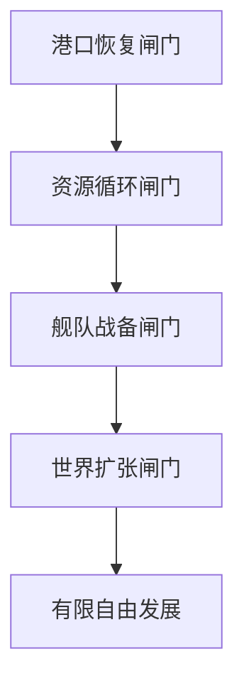

# 《吞吞舰船》新手引导、前期限制、分阶段解锁与首小时流程完整设计文档

> 文档版本：V1.0  
> 对应模式：海盗生涯长期养成  
> 文档性质：独立增量设计，不覆盖旧文档  
> 核心目标：让玩家在首小时内依次学会港口建造、资源获取、舰船升级、英雄搭载、军港保障、基础防守与海域占领  
> 推荐实现环境：Unity 3D  

---

# 第一部分：文档定位与继承规则

## 1. 本文解决的问题

当前系统已经包含港口建造、真实泊位、生产船、英雄主舰、守卫舰、方形海域扩建、防守战损和占领战等大量内容，但如果开局同时开放，会出现：

- 建筑数量太多，玩家不知道先建什么。
- 地图过早开放，玩家跳过港口教学直接乱跑。
- 资源来源过多，玩家只看到数字变化，不理解资源链。
- 舰船升级、英雄搭载、装备、技能和港口服务同时出现。
- 军港、防御塔和守卫舰尚未建好，敌人已经开始入侵。
- 玩家不知道军港、泊位、弹药和舰船重生之间的关系。
- 首场战斗结束太快，无法体现防线、守卫舰和英雄技能的价值。
- 关键材料被误用后，主线建造被卡死。
- 建造等待时间打断教学节奏。
- 引导标记过多，玩家只会机械点击，不理解系统因果。

本文把前期体验重构为：

> 先恢复港口，随后建立真实资源循环；再完成主舰与英雄整备；等轻型军港和基础防线全部建成后，才开启第一场防守；防守成功后，才允许向外占领海域。

## 2. 继续保留的既有规则

- 世界采用方形小海域，不再以六边形海域作为新版扩张规则。
- 起始领土为中心3×3个48米领海方格。
- 领海方格、生产区格、建筑基础格继续按48米、12米、2米三级网格对齐。
- 生产区本身不阻挡航行，地基、码头、炮塔、墙体等实体正常阻挡。
- 功能船必须真实完成出航、作业、装载、返港和卸货，资源才进入仓库。
- 主舰必须真实航行，不瞬移参加战斗。
- 每艘主舰由1名船长和4名作战英雄组成。
- 船长位只生效属性与被动，不释放普攻和主动技能。
- 四个作战位才对应普攻、主动技能和Q/E/R/F战斗能力。
- 守卫舰必须依赖军港完成补弹、维修和重新出航。
- 港口防守中地基与建筑可以被击毁，战后保留原布局并结算战损。
- 标准占领战仍采用接敌、主战、增援、变局、控制点和接管的完整过程。

## 3. 本文对旧前期流程的调整

以下内容以本文为准：

1. 开局不再先清理敌人，再开始港口建设。
2. 开局进入“新手和平保护”，正式敌人和入侵事件暂不生成。
3. 玩家必须先完成港口核心、地基、仓库、渔业码头和第一次卸货。
4. 完成资源闭环后，才开放主舰升级与英雄搭载教学。
5. 完成轻型军港、守卫艇、岸防炮塔和浮木挡板后，才解除和平保护。
6. 首场防守结束前，不开放自由海域占领。
7. 首场防守完成后，才开放相邻方格侦察和第一次小格接管。
8. 第一小时的关键建筑使用短时施工，不使用长时间等待。
9. 教学所需资源受到主线保护，不能因误操作彻底消耗。
10. 商城、抽奖、复杂装备、固定挑战和高阶生产不会在基础教学中出现。

---

# 第二部分：新手体验目标

## 4. 玩家在首小时必须真正理解的内容

首小时结束时，玩家应能用自己的话解释：

1. 建筑只能放在有效地基和己方可建造区域。
2. 码头旁必须留出泊位、进出航道和回转水域。
3. 捕鱼区不会直接产出库存，捕鱼船返港卸货后才入账。
4. 主舰升级需要资源、对应设施和短时整备。
5. 船长位与作战英雄位作用不同。
6. 英雄搭载到作战位后，舰船才获得该英雄的普攻和主动能力。
7. 船厂制造舰船，军港负责停靠、补给、维修和重新出航。
8. 炮塔负责区域火力，守卫艇负责移动拦截，主舰负责主动处理高威胁目标。
9. 地基与建筑会在防守中受损，布局和防线位置会影响战损。
10. 占领新海域不是点击领奖，而是侦察、接敌、建立信标和完成接管。

## 5. 首小时体验指标

| 指标 | 目标 |
| --- | --- |
| 完成港口核心恢复 | 3分钟内 |
| 完成第一次有效建造 | 5分钟内 |
| 看见渔船完成真实卸货 | 12分钟内 |
| 完成第一次主舰升级 | 20分钟内 |
| 完成船长任命与作战英雄搭载 | 24分钟内 |
| 建成轻型军港和第一艘守卫艇 | 30分钟内 |
| 建成基础防线 | 35分钟内 |
| 完成首场五波防守 | 45分钟内 |
| 完成第一次相邻方格占领 | 55分钟内 |
| 进入有限自由发展 | 60分钟左右 |

## 6. 设计原则

### 6.1 一次只教一个主要因果

单个任务最多包含：

- 1个主要操作。
- 1个明确目标。
- 1个即时反馈。
- 1句因果解释。

禁止把“建码头、造船、派遣、升级生产区、设置自动航线”放在同一任务里。

### 6.2 先让玩家看见，再让玩家操作

例如捕鱼教学：

1. 先让鱼群在海面明显活动。
2. 再提示划定捕鱼区。
3. 建造码头后让渔船在泊位出现。
4. 玩家点击“出航”。
5. 镜头保持可控，只在边缘提示作业过程。
6. 渔船返港后播放卸货和资源入账。
7. 最后解释“未卸货资源不会进入仓库”。

### 6.3 解锁必须由世界变化证明

不能只弹出“已解锁军港”。

应同时出现：

- 新建筑从损坏状态恢复为可建造蓝图。
- 港务人员对话。
- 建造栏出现新标签。
- 预留泊位轮廓显示。
- 建成后守卫艇真实靠泊。
- 防守警戒灯由灰色变为可用状态。

### 6.4 引导期允许限制，但不能长期替玩家做决定

- 前35分钟：强引导。
- 35～60分钟：半开放引导。
- 首小时后：目标提示为主，不再强制镜头和建造位置。

### 6.5 不用死亡和资源清零教系统

新手可以看到损伤、火灾、地基低血和守卫舰撤退，但首场防守不应造成不可逆失败。

失败用于解释：

- 为什么军港要补给。
- 为什么墙体要留缺口和射界。
- 为什么主舰要处理高威胁单位。
- 为什么建筑受损后需要维修。

---

# 第三部分：四道核心解锁闸门

## 7. 总体闸门结构



## 8. 闸门G1：港口恢复

### 完成条件

- 港口核心修复完成。
- 至少铺设4块临时浮木地基。
- 建成1座基础仓库。
- 主航道未被建造阻塞。

### 完成前开放

- 镜头移动与缩放。
- 主舰低速移动。
- 港口核心交互。
- 临时浮木地基。
- 基础仓库。
- 建造、旋转、确认、取消。

### 完成前关闭

- 敌人生成。
- 防守警报。
- 世界地图。
- 海域占领。
- 舰船升级。
- 英雄详情与编队。
- 船厂、军港、防御塔。
- 商城、抽奖、固定挑战。

## 9. 闸门G2：资源循环

### 完成条件

- 划定第一个2×3生产区格的近海捕鱼区。
- 建成简易渔业码头。
- 第一艘教学捕鱼船完成一次出航。
- 捕鱼船完成作业、返港和卸货。
- 玩家领取加工后的基础肉类。

### 完成后解锁

- 资源库存完整面板。
- 木材堆场。
- 漂木打捞点。
- 英雄主舰船坞修复任务。
- 主舰等级与基础模块页。

## 10. 闸门G3：舰队战备

### 完成条件

- S01万用吞吞舰完成第一次舰体升级。
- 任命H01罗盘艾伦为船长。
- 将H02快枪米娅搭载到第一个作战位。
- 建成轻型军港。
- 制造并部署1艘基础拦截艇。
- 建成1座轻型岸防炮塔。
- 建成3段浮木挡板。
- 完成一次守卫艇补弹演示。
- 港口核心进入“具备基础防卫能力”状态。

### 完成前的和平保护

- 不刷新正式敌舰。
- 不生成港口入侵。
- 不触发资源船伏击。
- 不触发敌对世界事件。
- 地图边缘可出现远景黑帆和侦察鸟，但不会进入战斗。

### 完成后

- 解除绝对和平保护。
- 先触发一场固定的新手五波防守。
- 在首场防守结束前，仍不触发随机入侵。

## 11. 闸门G4：世界扩张

### 完成条件

- 完成首场五波港口防守。
- 修复至少1个受损建筑或地基。
- 守卫艇完成一次返港维修或补给。
- 侦察第一个指定相邻方格。
- 完成第一次E1短冲突或接管任务。
- 放置控制信标并完成接管。

### 完成后

- 开放相邻方格自由侦察。
- 开放有限世界事件。
- 开放H04风帆凯的“追上逃舰”任务。
- 开放基础装备掉落。
- 开放第二个作战英雄位。
- 开放基础日常目标，但不开放全部长期系统。

---

# 第四部分：首小时完整流程总表

## 12. 首小时阶段总览

| 阶段 | 时间 | 核心教学 | 世界状态 | 阶段结果 |
| --- | ---: | --- | --- | --- |
| P0 苏醒港口 | 0～3分钟 | 镜头、移动、交互 | 完全安全 | 修复港口核心 |
| P1 第一块地基 | 3～7分钟 | 建造、旋转、有效区域 | 完全安全 | 建成基础仓库 |
| P2 第一批鱼货 | 7～14分钟 | 生产区、码头、出航、卸货 | 完全安全 | 建立资源闭环 |
| P3 主舰整备 | 14～22分钟 | 舰体升级、模块变化 | 完全安全 | S01升至2级 |
| P4 英雄登舰 | 22～26分钟 | 船长与作战位差异 | 完全安全 | H01/H02完成编成 |
| P5 港口备战 | 26～35分钟 | 军港、守卫艇、防御建筑 | 只出现远景威胁 | 达到基础战备 |
| P6 第一场防守 | 35～45分钟 | 驾驶、集火、技能、防线协作 | 固定五波战斗 | 解锁H03/H05 |
| P7 战后恢复 | 45～49分钟 | 战损、维修、补给 | 安全恢复期 | 理解非永久摧毁 |
| P8 第一次扩张 | 49～57分钟 | 侦察、短冲突、信标接管 | 指定E1事件 | 占领第一格、获得H04 |
| P9 有限自由期 | 57～60分钟 | 自主选择下个目标 | 低威胁开放 | 进入正常成长 |

---

# 第五部分：逐步引导任务

## 13. P0：苏醒港口

### T001 观察受损港口

**触发：** 创建角色并进入海盗生涯。  
**场景：** S01万用吞吞舰停靠在破损的临时栈桥外，中心港口核心熄灭，周围只有少量漂木和鱼群。  
**玩家操作：** 移动镜头、缩放并点击港口核心。  
**引导文字：** “这里会成为你的港口。先让它重新运转。”  
**完成反馈：**

- 港口核心轮廓高亮。
- 舰员在甲板上指向核心。
- 任务栏只显示“检查港口核心”。

**限制：**

- 主舰只能在起始港湾内低速航行。
- 离开范围时出现柔性回航线，不使用空气墙撞停。
- 所有其他系统按钮隐藏。

### T002 回收修复材料

**目标：** 驾驶主舰靠近3组漂浮木料。  
**教学内容：** 靠近后吸附资源；资源先进入主舰临时货舱。  
**表现：**

- 漂木被水流和吸附轨迹拉向主舰。
- 货舱图标从0/3变为3/3。
- 不出现复杂资源列表。

### T003 修复港口核心

**目标：** 返回核心附近并提交3组木料。  
**建造时间：** 5秒。  
**表现：**

- 起重钩吊起木板。
- 船员敲击修补。
- 核心灯由红转黄再转蓝。
- 建造栏、资源栏和任务栏依次亮起。

**奖励：**

- 新手建造包：木材120、基础金属40。
- H01罗盘艾伦进入港口，但暂未正式任命。

## 14. P1：第一块地基

### T004 进入建造模式

**目标：** 点击建造按钮。  
**界面：**

- 只显示“结构”和“仓储”两个分类。
- 结构分类只有临时浮木地基。
- 仓储分类只有基础仓库。
- 未开放分类不显示红点。

### T005 铺设临时浮木地基

**目标：** 在指定岸线附近铺设4块F01临时浮木地基。  
**教学重点：**

- 绿色表示可建造。
- 红色表示碰撞或越界。
- 蓝色虚线表示必须保留的主航道。
- 黄色水域表示未来泊位预留区。

**放置规则：**

- 提供8×8米推荐区域，但允许玩家在其中自由排列。
- 预览自动吸附2米基础格。
- 首次旋转时弹出一次提示。
- 如果遮挡主航道，显示“会阻断舰船进出”，不能确认。

### T006 建造基础仓库

**目标：** 在地基上放置基础仓库。  
**建造时间：** 8秒。  
**等待期间：**

- 玩家可以旋转镜头。
- 显示船员搬运和施工。
- 2秒后提示可点击建筑查看进度。
- 不插入其他系统教学。

**完成反馈：**

- 临时货舱中的剩余资源转入仓库。
- 资源栏第一次完整显示木材、金属、鱼货、肉类和金币。
- 未拥有资源显示0，但高阶材料仍隐藏。

## 15. P2：第一批鱼货

### T007 观察鱼群禀赋

**触发：** G1完成。  
**目标：** 点击起始3×3领土内的高鱼群方格。  
**表现：**

- 海面鱼群明显跃出。
- 禀赋扫描显示“近海鱼群：丰富”。
- 只介绍鱼群禀赋，不同时介绍矿脉、宝藏和贸易。

### T008 划定近海捕鱼区

**目标：** 划定2×3个生产区格。  
**规则：**

- 推荐位置直接覆盖高鱼群区域。
- 捕鱼区本身保持可通航。
- 浮标只在边界和作业点生成。
- 生产区不能覆盖主航道和码头实体位置。

### T009 建造简易渔业码头

**目标：** 在捕鱼区与仓库之间的岸线上建造D01简易渔获码头。  
**教学重点：**

- 码头主体放在地基边缘。
- 泊位必须朝向水面。
- 黄色泊位禁建区内不能放其他建筑。
- 绿色箭头表示进港方向。
- 蓝色箭头表示离港方向。

**首建辅助：**

- 自动推荐唯一合理朝向。
- 若玩家旋转错误，泊位水域变红并解释原因。
- 系统不会直接替玩家确认。

### T010 下水第一艘捕鱼船

**目标：** 点击码头并领取教学捕鱼船。  
**说明：**

- 该船属于剧情修复船，不消耗制造队列。
- 后续功能船必须通过船厂制造。
- 捕鱼船在泊位旁真实下水，不凭空生成在捕鱼区。

### T011 派遣捕鱼船

**目标：** 点击“开始近海捕捞”。  
**镜头规则：**

- 不强制全程跟随。
- 小窗显示“离港—航行—作业—装载—返港”五段状态。
- 玩家可点击状态小窗快速定位捕鱼船。

### T012 等待作业时的小任务

捕鱼船作业约45秒，期间安排两个非阻塞任务：

1. 点击仓库查看容量。
2. 清理码头前的一小组漂浮杂物。

不能在此期间打开另一条复杂教学。

### T013 观察返港卸货

**触发：** 捕鱼船装载完成。  
**目标：** 观察捕鱼船返港并完成卸货。  
**强制表现：**

- 船舱鱼筐 visibly 满载。
- 船体吃水略微加深。
- 接近港口时发出返港鸣笛。
- 码头工人抛缆、吊起鱼筐。
- 鱼货图标从船上流向码头，再进入仓库。
- 资源数字在卸货完成前保持不变。

**关键提示：** “资源装在船上时还不属于仓库，完成卸货后才会入账。”

### T014 第一次加工

**目标：** 将鱼货加工为基础肉类。  
**简化规则：**

- 首次加工在码头附带的临时处理台完成。
- 正式鱼肉工坊稍后解锁。
- 首次加工时间5秒。

**奖励：**

- 肉类80。
- 木材60。
- 基础金属30。
- 解锁英雄主舰船坞修复任务。

## 16. P3：主舰整备

### T015 修复英雄主舰船坞

**目标：** 修复起始区域内损坏的D17英雄主舰船坞。  
**原因说明：** “主舰必须在英雄舰坞完成编成、换装和完整整备。”  
**规则：**

- 船坞位置固定，不要求玩家重新规划XL泊位。
- 玩家仍要确认泊位禁建区和进出航道。
- 修复时间10秒。

### T016 主舰靠泊

**目标：** 驾驶S01万用吞吞舰进入引导航线并完成靠泊。  
**操作简化：**

- 玩家控制到达泊位入口。
- 最后短距离由港务拖船辅助对齐。
- 不要求新手完成精确倒车入库。

### T017 查看舰体升级

**界面只显示：**

- 当前舰体等级。
- 生命。
- 装甲。
- 货舱。
- 转向。
- 本次升级变化。
- 升级所需木材和金属。

**暂时隐藏：**

- 高阶模块。
- 随机词条。
- 舰体进阶。
- 同名副本。
- 复杂专精。
- 六舰总览。

### T018 完成第一次舰体升级

**目标：** 将S01从1级升到2级。  
**推荐消耗：** 木材80、基础金属20。  
**升级变化：**

- 最大生命+10%。
- 基础装甲+5%。
- 开放第1个作战英雄位。
- 甲板增加可见的轻型武器挂点。

**表现：**

- 船坞吊机换装甲板组件。
- 焊花与锤击集中在新增挂点。
- 升级前后使用可旋转对比。
- 完成后主舰鸣笛并显示“可搭载作战英雄”。

## 17. P4：英雄登舰

### T019 任命第一任船长

**获得：** H01罗盘艾伦。  
**目标：** 将H01拖入船长位。  
**界面解释：**

- 船长位位于编成顶部。
- 船长提供航海、指挥和被动效果。
- 船长不会释放普攻与主动技能。

**完成反馈：**

- 舰桥出现H01头像和站位。
- 主舰转向预览值提高。
- 地图事件预警范围被点亮。

### T020 获得第一名作战英雄

**剧情：** 米娅修好了一组双联机枪，要求随舰试射。  
**获得：** H02快枪米娅。  
**目标：** 将H02拖入作战位1。  
**界面解释：**

- 作战位英雄会实际接管舰船武器挂点。
- H02提供双联机枪普攻。
- H02主动技能为“弹幕扫射”。
- 作战位1默认对应Q。

### T021 试射浮标

**目标：**

1. 驾驶主舰驶出船坞。
2. 锁定3个训练浮标。
3. 让H02普攻击毁2个。
4. 手动释放一次Q“弹幕扫射”击毁最后1个。

**训练浮标规则：**

- 不会反击。
- 保持明显扇区排列。
- 技能释放后显示扇形攻击范围。
- 技能命中时显示英雄头像脉冲、挂点接管和结果数字。

**完成后：**

- 解锁轻型军港。
- 港口远处出现黑帆侦察影像，但不会立刻进攻。

## 18. P5：港口备战

### T022 建造轻型军港

**目标：** 建造D13轻型军港。  
**位置要求：**

- 临水。
- 连接己方地基。
- 保留S/M级泊位。
- 不遮挡英雄舰坞航道。

**教学重点：**

- 船厂负责制造。
- 军港负责停靠、补弹、轻修和出航。
- 有船但没有有效军港，舰船会在锚地等待，无法保持战备。

### T023 建造临时小型船台

**目标：** 建造教学版小型船台。  
**说明：**

- 首版只开放“基础拦截艇”蓝图。
- 冲撞舟、炮艇、鱼雷艇和布雷艇后续逐步开放。
- 制造时间15秒。

### T024 制造基础拦截艇

**目标：** 提交资源并等待下水。  
**表现：**

- 船体从骨架逐步拼装。
- 船员推入下水轨道。
- 完成后不是直接加入战场，而是进入军港泊位。

### T025 第一次补弹

**目标：** 点击军港，为基础拦截艇补充弹药。  
**表现：**

- 弹药箱真实搬上船。
- 战备状态从“未整备”变为“可出航”。
- 舰队列表显示生命、弹药、燃料、泊位和状态。

### T026 设置守备区域

**目标：** 将基础拦截艇分配到“外圈拦截区”。  
**可用防区只有：**

- 外圈拦截区。
- 核心护卫区。

左右翼、后排火力和自由巡逻暂不开放。

### T027 建造第一座岸防炮塔

**目标：** 在指定外缘地基上建造轻型岸防炮塔。  
**教学重点：**

- 显示射程和被建筑遮挡的射界。
- 炮塔不能放在泊位禁建区。
- 推荐位置能够覆盖主航道，但不会射穿己方核心。

### T028 建造浮木挡板

**目标：** 建造3段浮木挡板，形成可控入口。  
**禁止：**

- 完全封死主航道。
- 把守卫艇困在港内。
- 把炮塔射界全部挡住。

**说明：** 挡板不是为了把港口围死，而是把敌人引导到炮塔和守卫艇能够交叉攻击的位置。

### T029 战备检查

系统逐项检查：

| 项目 | 合格条件 |
| --- | --- |
| 主舰 | S01等级2、生命100%、H01/H02已搭载 |
| 军港 | 已建成、泊位畅通 |
| 守卫艇 | 已补弹、已分配防区 |
| 炮塔 | 射界覆盖主要入口 |
| 挡板 | 至少3段、未封死航道 |
| 仓库 | 有基础维修资源 |

所有条件完成后，港口核心显示：

> “基础防卫能力已建立。是否启动警戒巡逻？”

玩家点击确认后才解除绝对和平保护。

---

# 第六部分：第一场防守教学

## 19. 首场防守的定位

首场战斗不能只是3艘小船冲过来被一轮技能消灭。

它必须让玩家体验：

- 守卫艇从军港真实出航。
- 敌人被挡板改变路线。
- 炮塔持续提供火力。
- 主舰需要主动拦截高威胁单位。
- H02普攻适合清理小艇。
- H02主动技能适合处理扇区内多个目标。
- 建筑可能受损。
- 战后需要维修和补给。

## 20. 首场防守安全规则

- 推荐时长：6～8分钟。
- 共5个短波次，波次之间休整15～25秒。
- 玩家主舰失去动力时，立即触发拖船救援和本波重试。
- 港口核心生命不会低于10%。
- 教学阶段不结算正式建筑战损资源。
- 被摧毁建筑仍表现为损坏，但首次修复免费。
- 敌人不会攻击尚未解锁的系统。
- 不生成导弹、鱼雷、海怪抓取等高复杂威胁。
- 每波只增加一个新考题。

## 21. 防守准备阶段

### 表现

- 港口灯光由蓝色转为红色。
- 商业和生产船暂停离港。
- 捕鱼船优先返航。
- 军港闸门打开。
- 守卫艇解缆。
- 炮塔转向外海。
- 远处出现黑帆、桅杆和轻微炮声。

### 玩家可操作

- 调整守卫艇防区一次。
- 将主舰移动到推荐待命区。
- 点击炮塔查看射程。
- 检查主舰技能。

## 22. 波次1：侦察小艇

**敌人：** 3艘侦察小舟。  
**目的：** 教玩家锁定、追击和普攻。  
**敌方行为：**

- 沿主航道试探。
- 发现炮塔后分为左右两队。
- 生命低于25%会尝试撤退。

**教学提示：** “小艇正在测量防线，用速射火力快速清理。”  
**完成反馈：**

- H02头像脉冲。
- 守卫艇自动追击其中一艘。
- 炮塔攻击另一艘。
- 玩家理解多个单位各自作战。

## 23. 波次2：冲撞舟

**敌人：** 2艘侦察小舟＋1艘轻型冲撞舟。  
**目的：** 教玩家识别蓄力撞击和保护地基。  
**敌方表现：**

- 冲撞舟寻找起跑点。
- 水面出现狭长红色冲撞走廊。
- 舰首冒烟并逐步加速。

**反制：**

- 玩家可侧向撞击改变其方向。
- 集火使其提前失衡。
- 引导其撞到浮木挡板。

**结果：**

- 挡板受到明显损伤。
- 港口第一次出现“结构受损”提示。
- 暂不要求立刻维修。

## 24. 波次3：轻炮艇

**敌人：** 2艘小舟＋1艘轻炮艇。  
**目的：** 教玩家优先处理远程单位。  
**敌方行为：**

- 炮艇在炮塔射程外沿切线航行。
- 一边拉开距离，一边炮击受损挡板。
- 小舟试图牵制玩家主舰。

**教学提示：** “远程炮艇正在拆除受损防线，越过小舟优先拦截它。”  
**玩家行为：**

- 使用主舰机动靠近炮艇。
- 用Q弹幕扫射清除挡路小舟。
- 迫使炮艇弧形后撤。

## 25. 波次4：双向夹击

**敌人：**

- 正面2艘小舟。
- 侧面2艘小舟。
- 1艘受损维修艇。

**目的：** 教玩家观察战场方向和技能扇区。  
**变化：**

- 侧翼敌人不是凭空刷新，而是从此前远景航线驶入。
- 维修艇会尝试修复低血敌船。
- 守卫艇自动处理正面，玩家主舰处理侧面。

**奖励：** 击毁维修艇后掉落工程工具箱，为H03任务做铺垫。

## 26. 波次5：黑帆突击队长

**敌人：**

- 1艘小型精英指挥艇。
- 2艘冲撞舟。
- 3艘小舟，分两批进入。

**目的：** 完成第一次小型战场闭环。  
**精英能力：**

- 标记炮塔，使小舟短时优先攻击该目标。
- 召回低血小舟形成第二次突击。
- 自身不使用复杂全屏技能。

**战斗过程：**

1. 冲撞舟试图撞开挡板。
2. 小舟压制炮塔。
3. 指挥艇在外侧提供标记。
4. 玩家必须主动突进击毁指挥艇。
5. 指挥艇被毁后敌人士气下降并撤退。

**完成奖励：**

- H05铁钩雷蒙加入港卫候选队列。
- 基础炮术装备箱1个。
- 港卫徽记少量。
- 解锁战后修复任务。

## 27. 首场防守中的动态难度保护

| 检测情况 | 系统处理 |
| --- | --- |
| 玩家生命低于40% | 敌人下一次重击延迟2秒 |
| 玩家连续2次撞墙 | 暂时显示安全转向线 |
| 炮塔在前2波被毁 | 工程船抢修至30%生命 |
| 守卫艇沉没 | 10秒后由军港放出教学备用艇 |
| Q技能一直未释放 | 波次4前暂停刷新并提示一次 |
| 玩家长时间不移动 | 显示推荐拦截点，不自动驾驶 |
| 玩家主动退出 | 保存当前波次，回归后从波次准备阶段继续 |

---

# 第七部分：战后恢复与工程英雄

## 28. T030 查看战损

战斗结束后不立即弹出大量奖励。

先展示：

- 受损挡板冒烟。
- 炮塔转速下降。
- 守卫艇驶回军港。
- 工程船拖走残骸。
- 舰员灭火和检查地基。

战损面板只显示：

- 哪些建筑受损。
- 哪些舰船需要补给。
- 本次教学修复费用为0。
- 正式防守中会按实际损坏结算维修资源。

## 29. T031 修复第一座受损建筑

**目标：** 选择受损挡板并点击“维修”。  
**获得：** H03老锤格鲁。  
**剧情：** H03带领工程组完成抢修。  
**教学：**

- H03是工程作战英雄。
- 搭载到作战位后可提供维修臂普攻与“紧急大修”。
- 船长位价值与作战位技能不同。

## 30. T032 守卫艇返港补给

**目标：** 观察守卫艇进入军港，完成维修和补弹。  
**关键解释：**

- 战斗结束不等于舰船立即满状态。
- 军港泊位和服务吞吐决定恢复速度。
- 后续舰船变多、军港不足时会形成排队。

**此时不开放：**

- 多军港优先级。
- 紧急征用民用泊位。
- 重舰重建。
- 特种弹药。

---

# 第八部分：第一次海域扩张

## 31. 扩张解锁条件

只有完成以下内容，地图按钮才出现：

- 首场五波防守完成。
- 至少修复1个受损建筑。
- 守卫艇完成一次补给。
- 主舰生命恢复至80%以上。

## 32. T033 打开方形海域地图

地图首次只显示：

- 起始3×3领土。
- 一个北侧指定侦察目标。
- 其余相邻格保持迷雾。
- 港口、主舰、捕鱼区和军港图标。

不显示：

- 十二主题板块全貌。
- 固定挑战高难。
- 世界Boss。
- 商路网络。
- 六主舰编制。
- 长期赛季目标。

## 33. T034 侦察相邻方格

**目标：** 派出侦察浮标并等待20秒。  
**侦察结果：**

- 漂木资源中等。
- 发现2艘撤退海盗小舟。
- 发现一个损坏控制信标。
- 推荐战力明确低于当前主舰。

## 34. T035 第一次E1短冲突

**推荐时长：** 90～150秒。  
**敌人：**

- 2艘海盗小舟。
- 1艘低血逃舰。

**过程：**

1. 玩家主舰真实驶出港口。
2. 敌人发现玩家后尝试撤向方格边缘。
3. H02负责清小舟。
4. H03可在受伤时提供修复。
5. 玩家追上逃舰，触发H04风帆凯的剧情。

**获得：** H04风帆凯。  
**说明：** H04暂进入港口待命，第二作战位在接管完成后开放。

## 35. T036 修复并保护控制信标

**目标：**

- 提交少量木材修复信标。
- 在45秒接管期内保护信标。
- 击退最后一组2艘小艇反扑。

**接管表现：**

- 边界线从灰色逐步变为己方颜色。
- 工程浮标展开。
- 港口远景船员发出庆祝信号。
- 新格的漂木禀赋变为可规划内容。

## 36. T037 搭载第二名作战英雄

**目标：** 返回英雄舰坞，将H04放入作战位2。  
**结果：**

- 作战位2对应E。
- 主舰获得轻炮连射和“超速追猎”。
- 引导玩家对比H02清小艇与H04追击逃舰的职责差异。

---

# 第九部分：前期限制与逐步开放

## 37. 系统开放矩阵

| 系统 | 初始 | 第一次卸货后 | 主舰升级后 | 首场防守后 | 首次占领后 | 首小时后 |
| --- | --- | --- | --- | --- | --- | --- |
| 港口核心 | 开放 | 开放 | 开放 | 开放 | 开放 | 开放 |
| 地基/仓库 | 基础 | 基础 | 基础 | 扩展 | 扩展 | 开放 |
| 捕鱼区/渔业码头 | 关闭 | 开放 | 开放 | 开放 | 开放 | 开放 |
| 漂木采集 | 场景拾取 | 场景拾取 | 简易打捞 | 简易打捞 | 生产区 | 开放 |
| 主舰升级 | 关闭 | 开放 | 开放 | 开放 | 开放 | 开放 |
| 英雄编成 | 关闭 | 关闭 | 船长＋1作战位 | 2作战位 | 2作战位 | 逐步开放 |
| 船厂 | 关闭 | 关闭 | 教学船台 | 基础船厂 | 基础船厂 | 开放 |
| 军港 | 关闭 | 关闭 | 关闭 | 轻型军港 | 轻型军港 | 逐步开放 |
| 防御建筑 | 关闭 | 关闭 | 关闭 | 炮塔＋挡板 | 炮塔＋挡板 | 逐步开放 |
| 港口防守 | 关闭 | 关闭 | 关闭 | 固定教学战 | 低频正式战 | 正常 |
| 世界地图 | 隐藏 | 隐藏 | 隐藏 | 只读预告 | 指定一格 | 相邻格开放 |
| 固定挑战 | 隐藏 | 隐藏 | 隐藏 | 隐藏 | 预告 | 30～60分钟后 |
| 商店/抽奖 | 隐藏 | 隐藏 | 隐藏 | 隐藏 | 隐藏 | 主线节点后 |
| 装备强化 | 隐藏 | 隐藏 | 隐藏 | 基础换装 | 基础换装 | 逐步开放 |
| 贸易 | 隐藏 | 隐藏 | 隐藏 | 隐藏 | 预告 | 后续任务 |
| 陷阱 | 隐藏 | 隐藏 | 隐藏 | 隐藏 | 隐藏 | 第二次正式防守前 |

## 38. 建筑栏限制

引导期不应展示数十个灰色建筑。

每阶段最多显示：

- 2～4个可建建筑。
- 1个即将解锁建筑预告。
- 其余建筑完全隐藏。

灰色建筑只有在玩家已经理解其前置系统时才显示。

## 39. 资源保护

### 39.1 主线资源保留

系统维护一个隐藏的“主线最低资源线”：

```text
可自由消耗资源 =
当前仓库资源
- 当前主线剩余必需成本
```

如果玩家尝试把主线必需资源用于非关键升级：

- 按钮显示“需要为轻型军港保留20金属”。
- 允许取消，不直接没收资源。
- 引导期不允许把关键资源消耗到无法推进。

### 39.2 教学建造补贴

| 内容 | 补贴 |
| --- | ---: |
| 首4块浮木地基 | 100% |
| 第1座仓库 | 80% |
| 第1座渔业码头 | 80% |
| S01第一次升级 | 70% |
| 第1座轻型军港 | 80% |
| 第1艘守卫艇 | 100% |
| 第1座岸防炮塔 | 100% |
| 第3段以内浮木挡板 | 100% |
| 首场战后修复 | 100% |

补贴通过剧情物资包体现，不标成充值折扣。

## 40. 建造时间限制

| 类型 | 首次教学时间 |
| --- | ---: |
| 地基 | 1～2秒/块 |
| 基础仓库 | 8秒 |
| 渔业码头 | 10秒 |
| 英雄舰坞修复 | 10秒 |
| 主舰第一次升级 | 12秒 |
| 轻型军港 | 12秒 |
| 教学守卫艇 | 15秒 |
| 岸防炮塔 | 8秒 |
| 挡板 | 2秒/段 |
| 首次维修 | 5秒 |

首小时内不使用5分钟以上的真实等待作为主线门槛。

## 41. 地图与航行限制

### 首场防守前

- 主舰活动范围限制在起始3×3领土及外侧缓冲水域。
- 远处海域被浓雾和强浪遮挡。
- 接近边缘时由H01提示“先让港口具备防卫能力”。
- 不使用生硬的透明墙。

### 首次占领后

- 只开放与己方领土正交相邻的方格。
- 斜角方格不能直接占领。
- 固定挑战区只显示轮廓，不开放挑战。
- 玩家最多同时追踪一个扩张目标。

## 42. 战斗限制

首场防守前：

- 不出现敌方伤害。
- 训练浮标不算正式战斗。
- 不生成随机巡逻、伏击或海兽敌对事件。

首场防守后至首次占领前：

- 只允许指定E1短冲突。
- 不生成E2以上世界战斗。

首次占领后至首小时结束：

- 最多同时存在1个低威胁敌对事件。
- 港口随机防守至少延迟20分钟。
- 不出现精英机制、Boss、导弹雨、触手抓取和复杂控制。

---

# 第十部分：英雄与舰船的前期获得安排

## 43. H01～H05首小时获得节奏

| 英雄 | 获得节点 | 教学职责 |
| --- | --- | --- |
| H01罗盘艾伦 | 修复港口核心后任命 | 船长位、航海与指挥 |
| H02快枪米娅 | S01第一次升级后 | 第一个作战位、速射与Q技能 |
| H03老锤格鲁 | 首场防守后修复建筑 | 工程维修、持续作战 |
| H04风帆凯 | 第一次占领时追击逃舰 | 追击、航速和第二作战位 |
| H05铁钩雷蒙 | 首场港口防守第5波 | 炮击与破甲，作为后续换位教学 |

首小时内不强制把H01～H05全部装入同一艘主舰。

玩家先理解：

- 1名船长。
- 2名作战英雄。
- 1名工程候选。
- 1名炮击候选。

作战位3和4在后续主舰等级与任务节点开放。

## 44. S01万用吞吞舰前期升级

| 等级 | 解锁时间 | 核心变化 |
| ---: | --- | --- |
| 1 | 初始 | 基础移动、吸附、临时货舱 |
| 2 | 约18分钟 | 作战位1、轻型挂点、基础装甲 |
| 3 | 首场防守后 | 作战位2、基础装备位 |
| 4 | 第一次板块任务后 | 作战位3、模块选择 |
| 5 | 第一个固定挑战前 | 作战位4、完整新手编成 |

## 45. 第一次升级的限制

- 不允许选择复杂分支。
- 先提供固定的生存与挂点升级。
- 第一次自由三选一放在玩家已经完成首场防守之后。
- 第一次升级不消耗稀有材料。
- 第一次升级不会失败、暴击或随机返还。

---

# 第十一部分：任务表现与UI规则

## 46. 主任务卡

屏幕同一时间只保留一个主要任务：

```text
主任务：建立第一条资源航线
目标：等待捕鱼船返港卸货
状态：返航中  32秒
[定位捕鱼船]
```

可选目标折叠在下方，不抢占主任务视觉层级。

## 47. 引导标记优先级

从高到低：

1. 当前必须操作的世界目标。
2. 当前必须点击的UI按钮。
3. 有效建造位置和禁建原因。
4. 危险预警。
5. 可选奖励。
6. 系统预告。

同屏最多：

- 1个强制手指或箭头。
- 2个世界高亮。
- 1个说明气泡。

## 48. 引导文字规则

每条文本尽量不超过两行。

推荐格式：

- 操作：“把仓库放在刚铺好的地基上。”
- 原因：“没有仓库，返港资源无法长期保存。”
- 结果：“仓库建成，港口可以接收第一批鱼货。”

避免：

- 一次解释多套后期系统。
- 大段世界观打断建造。
- 使用“点击这里”“再点击那里”但不说明原因。

## 49. 建造引导表现

建造预览必须同时显示：

- 建筑实体轮廓。
- 地基占用格。
- 泊位禁建区。
- 航道进出箭头。
- 回转区。
- 炮塔射界或仓储连接。
- 无效原因。

## 50. 英雄编成界面

新手版布局：

```text
          [船长位 H01]

[作战位1 H02] [作战位2 未解锁]
[作战位3 未解锁] [作战位4 未解锁]

右侧：当前选中英雄
普攻 / 标志主动 / 岗位效果
```

船长位与作战位使用不同颜色和图形，不能只靠文字区分。

## 51. 资源入账表现

资源变化分为：

- 船上货物。
- 码头待卸货。
- 仓库库存。

UI不能在作业完成时直接给仓库加数字。

正确过程：

```text
捕鱼船装载 60/60
→ 返港中
→ 等待泊位
→ 卸货 0%～100%
→ 仓库鱼货 +60
```

## 52. 战斗引导HUD

首场防守只显示：

- 主舰生命和装甲。
- H02的Q技能。
- 当前波次。
- 敌人主要方向。
- 炮塔和守卫艇状态。
- 港口核心生命。

隐藏：

- 未开放技能槽。
- 高阶状态统计。
- 元素克制大全。
- 完整战报。
- 伤害排名。

---

# 第十二部分：防发散机制

## 53. 强引导阶段

0～35分钟使用强引导：

- 未需要的系统隐藏。
- 主线建筑不能拆除。
- 关键建筑有推荐建造范围。
- 关键资源受到保留。
- 只能追踪一个主任务。
- 不生成随机敌对事件。

## 54. 半开放阶段

35～60分钟：

- 玩家可以自由移动和调整基础布局。
- 可以更换H02与H03的作战位置。
- 可以增加少量地基和装饰。
- 可以选择先修炮塔还是挡板。
- 第一次占领仍使用指定方格。

## 55. 自由阶段

首小时后：

- 取消强制镜头。
- 取消唯一建造位置。
- 保留任务追踪和推荐目标。
- 新系统以任务节点逐步开放。
- 玩家可以选择资源、战斗或建设优先方向。

## 56. 防止误拆

引导完成前，以下内容不能拆除：

- 港口核心。
- 第一座仓库。
- 第一座渔业码头。
- 英雄主舰船坞。
- 第一座轻型军港。

允许移动的建筑：

- 岸防炮塔。
- 浮木挡板。
- 非关键地基。

移动前必须重新检查航道、泊位和支撑关系。

## 57. 防止长时间偏航

如果玩家超过90秒没有推进主任务：

1. 任务卡轻微呼吸。
2. 相关世界目标出现柔和光柱。
3. H01给出一句原因提示。
4. 再过60秒显示“自动定位”，但不自动执行操作。

禁止每5秒重复弹窗。

---

# 第十三部分：失败、断线与卡死恢复

## 58. 通用恢复原则

- 任务进度按关键步骤保存。
- 已完成建造不回滚。
- 教学奖励只发一次。
- 中途退出不会重复获得英雄。
- 回归后从最近一个可理解的准备状态继续。

## 59. 资源不足

若因异常或版本迁移导致资源不足：

- 自动发放“港口应急物资”补齐主线最低成本。
- 只补缺口，不额外制造可刷取资源。
- 记录恢复原因用于数据分析。

## 60. 建筑位置异常

如果旧存档或碰撞更新导致关键建筑无法使用：

1. 保留玩家原建筑。
2. 生成临时安全施工区。
3. 免费移动关键建筑一次。
4. 重新计算泊位、航道和支撑。
5. 完成后移除临时区域。

## 61. 捕鱼船卡住

恢复顺序：

1. 重新计算局部路径。
2. 退回最近安全航点。
3. 请求港务拖船协助。
4. 重新分配泊位。
5. 最后才将船转移到最近可航行水面。

不能关闭碰撞让捕鱼船穿过建筑。

## 62. 首场防守失败

失败后：

- 回到当前波次准备阶段。
- 主舰和守卫艇恢复至80%状态。
- 本波已消耗技能冷却重置。
- 已理解的前几波不必全部重打。
- 最多失败2次后开启“额外工程支援”。

额外工程支援包括：

- 炮塔射速+15%。
- 挡板恢复30%生命。
- 守卫艇增加1次紧急维修。

不直接弹出付费复活。

## 63. 第一次占领失败

- 玩家主舰拖回港口。
- 指定目标格保持已侦察状态。
- 敌人恢复为教学用低威胁编队。
- 不扣除接管信标材料。
- 提示升级或重新调整英雄，但不要求抽卡。

---

# 第十四部分：首小时后的继续解锁

## 64. 60～90分钟

逐步开放：

- 第3个作战位前置任务。
- 漂木打捞生产区。
- 木材堆场。
- 基础装备替换。
- 第一次自由三选一舰体强化。
- E2标准遭遇。
- 第一个固定挑战区预告。

仍不开放：

- 高难固定挑战。
- 多主舰总览。
- 复杂装备重铸。
- 传奇英雄池强制弹窗。

## 65. 90～180分钟

开放：

- 第2艘守卫舰。
- 炮艇与冲撞舟差异教学。
- 第2座资源码头。
- 基础采矿区。
- 第一种海上陷阱。
- 第一次正式港口防守。
- 正式战损结算。
- 第2主舰席位前置目标。

## 66. 第一日

目标：

- 形成鱼、木、矿三条基础资源线。
- 拥有1艘英雄主舰和2～4艘守卫舰。
- 拥有2类军用舰船。
- 建成外圈基础防线。
- 完成一次E3标准占领战。
- 看到商港系统预告。
- 理解军港拥堵和维修队列。

## 67. 第二主舰开放前

必须确保：

- 玩家至少获得H01～H05。
- H06～H10中至少获得3名。
- 玩家理解船长位不释放技能。
- 玩家至少完成一次英雄换位。
- 玩家至少完成一次舰船返港大修。
- 玩家拥有第二英雄主舰泊位的可规划岸线。

---

# 第十五部分：新手任务奖励

## 68. 奖励原则

- 奖励服务于下一步教学。
- 不在前期发放大量不认识的材料。
- 英雄、舰船和建筑解锁通过具体事件获得。
- 装备奖励必须能立即使用。
- 不让抽卡成为完成基础编成的前提。

## 69. 主要奖励表

| 节点 | 奖励 |
| --- | --- |
| 修复港口核心 | H01、建造资源包 |
| 第一次卸货 | 肉类、木材、金属 |
| S01升至2级 | H02、第1作战位 |
| 完成试射 | 轻型军港蓝图 |
| 建成军港 | 教学守卫艇 |
| 首场防守第4波 | 工程工具箱 |
| 首场防守第5波 | H05、基础炮术箱 |
| 修复第一座建筑 | H03 |
| 占领第一格 | H04、第2作战位 |
| 首小时完成 | E01漂木拓荒自选部位箱 |

---

# 第十六部分：角色对白与情绪节奏

## 70. 对话分工

| 角色 | 引导职责 |
| --- | --- |
| H01罗盘艾伦 | 目标、航行、战况判断 |
| H02快枪米娅 | 武器、锁定、技能 |
| H03老锤格鲁 | 建造、维修、地基 |
| H04风帆凯 | 追击、侦察、海域扩张 |
| H05铁钩雷蒙 | 炮击、破甲、守港经验 |

## 71. 对话规则

- 战斗中单句不超过12个汉字。
- 建造解释不超过两句。
- 同一角色20秒内不连续说3次。
- 重要操作失败时先说明原因，再给解决方法。
- 不让所有角色同时说话。

## 72. 示例对白

### 港口修复

H01：“先点亮核心，其他东西才能运转。”

### 渔船卸货

H01：“看见了吗？靠岸卸完，这批鱼才真正入库。”

### 船长位

H01：“我负责掌舵和判断。真正开火，要看作战位上的人。”

### H02登舰

H02：“机枪接上了。给我一个方向，我负责把小艇扫干净。”

### 军港

H03：“造出船只是第一步。没地方补弹，它出去一趟就得趴窝。”

### 第一场防守

H01：“挡板让它们绕路，炮塔守入口，我们去处理那艘远程炮艇。”

---

# 第十七部分：程序状态与数据结构

## 73. 引导状态机

```text
TutorialState
├── None
├── HarborWakeup
├── CoreRepair
├── FoundationBuild
├── WarehouseBuild
├── FishZoneCreate
├── FishDockBuild
├── FishingVoyage
├── CargoUnload
├── HeroDockRepair
├── ShipUpgrade
├── CaptainAssign
├── CombatHeroAssign
├── TargetPractice
├── MilitaryPortBuild
├── GuardShipBuild
├── DefenseBuild
├── ReadinessCheck
├── FirstDefense
├── PostBattleRepair
├── FirstRecon
├── FirstSkirmish
├── FirstCapture
├── LimitedFreedom
└── Completed
```

## 74. 闸门数据

```text
TutorialGateDefinition
├── GateId
├── RequiredTaskIds[]
├── RequiredWorldStates[]
├── UnlockSystemIds[]
├── LockSystemIds[]
├── PeaceProtectionMode
├── AllowedEnemyTier
├── AllowedRegionIds[]
├── CompletionRewardIds[]
└── FallbackRuleId
```

## 75. 任务数据

```text
TutorialTaskDefinition
├── TaskId
├── PhaseId
├── TriggerConditions[]
├── CompletionConditions[]
├── AllowedActions[]
├── RestrictedActions[]
├── FocusTarget
├── RecommendedArea
├── DialogueSequenceId
├── RewardPackageId
├── SaveCheckpoint
├── TimeoutHintRules[]
└── RecoveryRuleId
```

## 76. 系统权限数据

```text
FeatureUnlockState
├── FeatureId
├── VisibilityState
├── InteractionState
├── UnlockGateId
├── PreviewGateId
├── TutorialVariant
├── NormalVariant
└── UnlockPresentationId
```

可见状态：

- Hidden：完全隐藏。
- Preview：显示预告，不可交互。
- Guided：只开放教学子集。
- Limited：开放基础功能。
- Full：正常开放。

## 77. 和平保护状态

```text
NewPlayerProtection
├── AbsolutePeace
├── ScriptedThreatOnly
├── LowThreatOnly
├── ReducedLoss
└── NormalWorld
```

切换规则：

```text
AbsolutePeace
→ G3完成
→ ScriptedThreatOnly
→ 首场防守完成
→ LowThreatOnly
→ 首次占领且首小时完成
→ ReducedLoss
→ 账号成长节点达成
→ NormalWorld
```

## 78. 存档检查点

必须在以下节点保存：

- 港口核心修复。
- 第一座仓库完成。
- 渔业码头完成。
- 捕鱼船离港。
- 捕鱼船卸货。
- S01升级。
- H01任命。
- H02搭载。
- 轻型军港完成。
- 守卫艇完成补弹。
- 首场防守每波结束。
- 首次占领完成。

---

# 第十八部分：事件调度规则

## 79. 新手期世界事件白名单

### G1前

- 漂木吸附。
- 鱼群跃水。
- 港口维修。

### G2前

- 捕鱼作业。
- 漂浮杂物清理。
- 船员短对话。

### G3前

- 训练浮标。
- 远景黑帆。
- 港务整备。

### 首场防守后

- 指定相邻方格侦察。
- 指定E1短冲突。
- 控制信标反扑。

不在白名单中的敌对事件不得生成。

## 80. 首场防守触发安全条件

除G3完成外，还必须满足：

- 玩家在线且不在菜单。
- 主舰位于港口附近。
- 捕鱼船不在主航道中心。
- 军港出口畅通。
- 所有关键教学角色已加载。
- 当前没有建造拖拽。
- 当前没有奖励弹窗。

如条件不满足，保持“警戒巡逻待确认”，不偷偷开始倒计时。

---

# 第十九部分：数据分析与调优

## 81. 关键埋点

| 埋点 | 目的 |
| --- | --- |
| T001进入至完成时间 | 镜头和核心交互是否清晰 |
| 首次无效建造原因 | 建造规则是否易懂 |
| 码头旋转失败次数 | 泊位朝向是否易懂 |
| 捕鱼船定位按钮使用次数 | 自动作业是否可观察 |
| 卸货过程跳过率 | 资源链表现是否过长 |
| 舰体升级页停留时间 | 信息量是否过大 |
| 船长位误放次数 | 船长与作战位是否清晰 |
| 首场防守各波失败率 | 难度曲线 |
| Q技能首次使用时间 | 技能教学是否有效 |
| 炮艇目标切换时间 | 威胁优先级是否读得懂 |
| 首次占领中断率 | 扩张流程是否过长 |
| 首小时完成率 | 总体流失 |

## 82. 推荐目标值

| 指标 | 推荐目标 |
| --- | ---: |
| 港口核心任务完成率 | ≥98% |
| 第一座仓库建成率 | ≥95% |
| 第一次卸货完成率 | ≥92% |
| 主舰升级完成率 | ≥90% |
| 英雄正确搭载率 | ≥90% |
| 首场防守首次通关率 | 75%～85% |
| 首场防守三次内通关率 | ≥97% |
| 首次占领完成率 | ≥82% |
| 首小时完整流程完成率 | ≥70% |

## 83. 调优判断

- 如果玩家大量卡在码头放置，不降低码头存在感，应优化泊位预览和推荐岸线。
- 如果玩家不理解卸货，不直接提前加资源，应强化船上货物、待卸货和库存三态。
- 如果船长位误用高，应强化视觉差异和即时效果对比。
- 如果首场防守太快，应增加分批进场、撤退和维修艇，不单纯提高生命。
- 如果首场防守太难，优先降低同时威胁数量，不删除预警。
- 如果玩家觉得限制过强，应提前开放装饰、镜头和基础布局调整，不提前开放复杂系统。

---

# 第二十部分：制作优先级

## 84. 阶段A：最小新手闭环

实现：

- 港口核心修复。
- 4块地基。
- 仓库。
- 捕鱼区。
- 渔业码头。
- 捕鱼船真实出航与卸货。
- S01第一次升级。
- H01/H02编成。

验收目标：

- 15～25分钟内完成。
- 全程无正式战斗。
- 玩家能解释资源为什么在卸货后才入账。

## 85. 阶段B：战备闭环

实现：

- 轻型军港。
- 教学守卫艇。
- 补弹与防区。
- 岸防炮塔。
- 浮木挡板。
- 战备检查。

验收目标：

- 军港建成前不会触发正式敌人。
- 守卫艇从军港真实出航。

## 86. 阶段C：首场防守

实现：

- 五波固定敌人。
- 动态难度保护。
- 建筑受损。
- 战后免费修复。
- H03/H05获得。

验收目标：

- 战斗6～8分钟。
- 每波只增加一个主要考题。
- 玩家能感受到防线和军港的实际价值。

## 87. 阶段D：第一次扩张

实现：

- 指定方格侦察。
- E1短冲突。
- 控制信标。
- H04获得。
- 第二作战位。

验收目标：

- 8～12分钟完成。
- 不加载独立战斗场景。
- 敌人、主舰和信标全部在无缝世界中运行。

---

# 第二十一部分：验收清单

## 88. 流程验收

- [ ] 开局没有正式敌人。
- [ ] 港口核心完成前只显示必要功能。
- [ ] 玩家能完成第一块地基和仓库建造。
- [ ] 主航道不能被教学建筑封死。
- [ ] 捕鱼区本身不阻挡航行。
- [ ] 渔业码头必须保留实体泊位。
- [ ] 捕鱼船从码头真实离港。
- [ ] 捕鱼船在作业完成时不会直接给仓库加资源。
- [ ] 只有卸货完成后资源才入账。
- [ ] S01必须在英雄舰坞完成升级。
- [ ] H01被明确教为船长位。
- [ ] 船长位不释放普攻和主动技能。
- [ ] H02被明确教为作战位。
- [ ] H02接管可见武器挂点。
- [ ] 轻型军港建成前不解除和平保护。
- [ ] 守卫艇必须在军港补弹后才能出航。
- [ ] 炮塔、挡板和航道存在有效空间关系。
- [ ] 首场防守由玩家确认后开始。
- [ ] 首场防守包含5个可区分波次。
- [ ] 首场防守持续约6～8分钟。
- [ ] 战斗不是通过无意义高血量延长。
- [ ] 冲撞舟、炮艇和维修艇行为不同。
- [ ] 建筑会受损，但首次战后修复免费。
- [ ] 守卫艇战后真实返港补给。
- [ ] 首场防守后才开放地图扩张。
- [ ] 第一次占领只开放一个指定相邻格。
- [ ] H04通过追击逃舰任务获得。
- [ ] 首次占领后才进入有限自由阶段。

## 89. 防发散验收

- [ ] 前35分钟同时可建建筑不超过4种。
- [ ] 同屏只有1个主要任务。
- [ ] 未开放系统不堆满灰色图标。
- [ ] 关键主线资源不会被误用到无法推进。
- [ ] 关键建筑不能在教学完成前误拆。
- [ ] 玩家卡住时先提供定位和原因，不自动完成任务。
- [ ] 主舰离开起始范围使用世界解释，不使用硬撞墙。
- [ ] 商城和抽奖不会打断基础教学。
- [ ] 固定挑战不会在首次占领前开放。

## 90. 技术验收

- [ ] 每个关键任务均有存档检查点。
- [ ] 教学奖励不能重复领取。
- [ ] 断线后从合理准备状态恢复。
- [ ] 捕鱼船卡住不会穿过建筑。
- [ ] 首场防守失败可从当前波次恢复。
- [ ] 世界事件调度遵守新手白名单。
- [ ] G3完成前敌对生成器保持禁用。
- [ ] 建造完成事件能够可靠推进闸门。
- [ ] 旧存档进入新流程时有资源和布局恢复方案。

---

# 第二十二部分：最终执行摘要

## 91. 首小时最短任务链

```text
修复港口核心
→ 铺地基
→ 建仓库
→ 划捕鱼区
→ 建渔业码头
→ 捕鱼船出航
→ 返港卸货
→ 修复英雄舰坞
→ S01升至2级
→ 任命H01船长
→ 搭载H02作战英雄
→ 训练浮标试射
→ 建轻型军港
→ 造并补给守卫艇
→ 建炮塔和挡板
→ 战备检查
→ 五波港口防守
→ 修复战损并获得H03
→ 守卫艇返港补给
→ 侦察相邻方格
→ E1短冲突
→ 获得H04
→ 修复控制信标
→ 占领第一格
→ 进入有限自由发展
```

## 92. 最核心的限制调整

1. 军港、守卫艇、炮塔和挡板完成前，绝不生成正式敌人。
2. 首场防守完成前，不开放自由海域扩张。
3. 第一次卸货完成前，不开放复杂舰船养成。
4. 第一次主舰升级完成前，不开放完整英雄编成。
5. 前35分钟只显示当前必需的建筑和系统。
6. 教学资源受到保护，不允许误花导致流程死锁。
7. 首场防守有损伤表现，但首次维修免费。
8. 首小时后逐步取消强限制，转为目标引导。

## 93. 结语

这套新手流程的重点，不是让玩家在十分钟内点遍所有按钮，而是让玩家建立几个牢固的因果：

- 我铺地基，是为了让港口真正长出来。
- 我建码头，是为了让船有地方靠泊和卸货。
- 我派功能船，是为了让资源经过真实航行进入港口。
- 我升级主舰并搭载英雄，是为了改变舰船实际战斗能力。
- 我建军港，是为了让守卫舰能够补给、维修和再次出航。
- 我建炮塔与挡板，是为了塑造战场，而不是单纯增加战力数字。
- 我守住港口后，才有资格向外扩张。

玩家完成首小时后，应该已经拥有一座规模不大但真正运转的港口、一艘完成初步升级的英雄主舰、一支能从军港出航的基础守卫力量、两条可理解的资源与成长路线，以及第一次由自己亲手准备并守住的海上防线。
