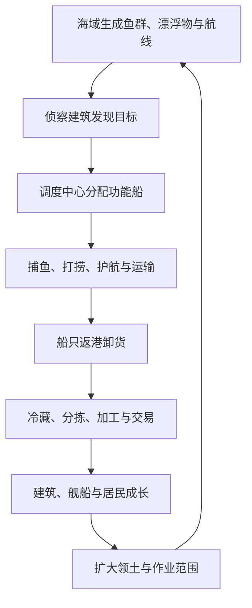
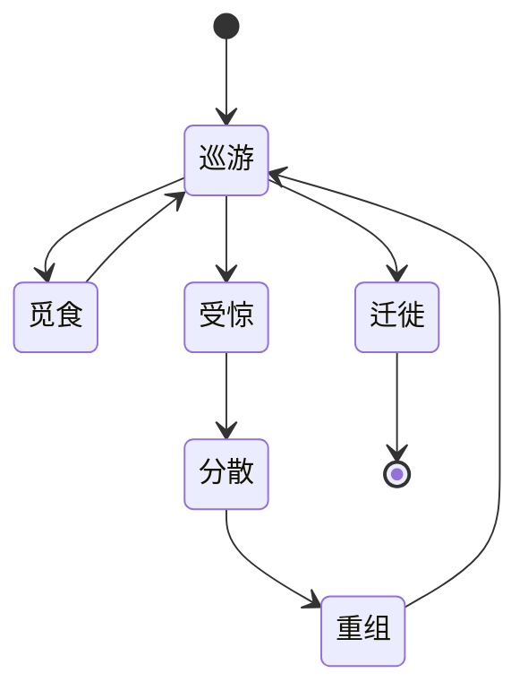
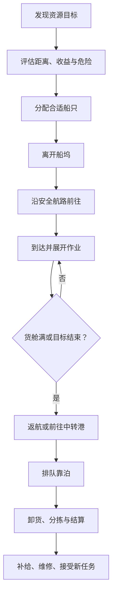

# 《吞吞舰船》海盗生涯：海洋生态、自动采集与港口表现深化设计文档

> 文档版本：V1.1  
> 文档性质：海盗生涯模式增量设计，不修改任何旧文档  
> 对应模式：海盗生涯（长期养成）  
> 核心扩展：动态海洋生态、鱼群与漂浮物、真实船队、功能船自动作业、生态建筑、生产链、港口生活表现、海面视觉表现  
> 推荐实现环境：Unity 3D  

---

## 0. 增量规则与旧文档关系

本文件在以下文档基础上继续深化：

- 《吞吞舰船_海盗生涯长期养成与海上港口模式设计文档》
- 《吞吞舰船_海盗生涯防守建筑造船厂与港口成长深化设计文档》
- 《吞吞舰船_海盗生涯六边形海域扩张动态航线与大地图设计文档》

旧文档继续保留，不进行覆盖修改。

当新旧文档出现描述差异时，按以下规则执行：

1. 六边形海域、领土占领、动态边境和地图缩放继续沿用六边形地图文档。
2. 防御建筑、守卫舰、造船厂制造与港口成长继续沿用建筑深化文档。
3. 本文件新增的鱼群、漂浮物、生态状态、功能船、自动作业和生态建筑，以本文件为准。
4. 旧版地图中的“资源事件”不再全部是临时副本图标；普通鱼群、漂浮物和船队优先表现为海面上真实存在、移动和被作业的对象。
5. 高价值事件仍可由事件导演生成，但必须尽可能落到真实海域位置、真实单位和真实作业过程。
6. 功能船自动采集不会把资源凭空加入仓库，必须完成“离港—航行—作业—装载—返港—卸货”流程。
7. 本系统强调可观察的生态与自动化，不做需要玩家逐船反复点击的重度微操。

---

## 1. 本次深化的核心目标

当前海盗生涯已经拥有港口建造、自动防守、主舰出击、六边形领土和动态航线，但海面仍容易出现以下问题：

- 海洋像一块只承载战斗的蓝色地板。
- 捕鱼建筑只是定时增加数字，看不到鱼从哪里来。
- 打捞、捕鱼和运输缺少真实船只过程。
- 建筑建好后长期静止，港口缺少城市生活感。
- 不同海域只体现在数值加成，视觉和行为差异不明显。
- 商船、渔船、海鸟、鱼群、漂浮物之间没有联系。
- 玩家扩张领土后，没有形成越来越繁忙的海上城市景观。

本次深化要达到六个目标：

1. **海上始终有事情发生**：鱼群迁徙、漂浮物随流移动、船队沿航线经过、海鸟追随鱼群、风暴推动残骸。
2. **资源来自真实过程**：捕鱼船捕获鱼群，打捞船收集漂浮物，运输艇把货物送回港口，仓库真正接收资源。
3. **建筑改变海面生态**：灯塔扩大侦察，人工鱼礁吸引鱼群，冷库延长鲜鱼保存，垃圾处理减少污染，市场提高商船到访。
4. **海域具有性格**：丰饶渔场、漂流木海、商路交汇、风暴带和污染海域拥有不同模型、颜色、单位和声音。
5. **自动化有决策但不繁琐**：玩家设置作业区、优先级和风险阈值，功能船自动完成重复劳动。
6. **港口成长能够被看见**：从一条小筏和一艘小渔船，逐渐变成船只往来、工坊运作、灯火密集的海上都市。

---

## 2. 新版海盗生涯的生态循环



生态循环与战斗循环并行：

- 捕鱼船可能被鲨鱼或海盗骚扰。
- 打捞船可能从残骸中触发敌人、宝箱或污染。
- 商船增加贸易机会，也可能吸引劫掠船队。
- 防守战结束后会产生短期残骸带，打捞船可进行战后清理。
- 玩家过度采集某片海域后，局部资源密度下降，需要轮换作业区或建设生态设施。

---

## 3. 海洋生态的三层模拟

为了兼顾世界感和性能，海洋生态分为三层。

## 3.1 战略层：六边形海域

每块六边形记录：

- 海域类型。
- 基础生态丰度。
- 鱼类构成。
- 漂浮物构成。
- 航线密度。
- 洋流方向与强度。
- 风浪等级。
- 污染度。
- 当前资源存量。
- 资源恢复速度。
- 当前天气。
- 近期采集压力。
- 当前船队和大型事件。

战略层即使不加载近景，也会按时间推进。

## 3.2 战术层：当前与相邻海域

玩家镜头附近的海域显示：

- 真实移动的鱼群。
- 水面漂浮物。
- 捕鱼船、打捞船、运输船和护航船。
- 航线船队。
- 鲨鱼、海豚、鲸类等大型动物。
- 风浪、雨区、鸟群和水面泡沫。

战术层使用简化AI和对象池，不要求每条鱼拥有独立复杂逻辑。

## 3.3 近景表现层：港口与作业点

镜头靠近时额外表现：

- 鱼群水下轮廓、跳鱼和鱼鳞闪光。
- 渔网展开、收网、吊鱼上船。
- 打捞钩、机械臂、绳索和浮桶。
- 船员搬箱、推车、卸鱼、分类残骸。
- 工坊冒烟、传送带、吊机、冷库开门。
- 船体尾流、浪花、碰撞浮动和靠港减速。

近景行为只负责表现，产出仍由统一系统结算，防止动画中断造成资源错误。

---

## 4. 海域生态核心参数

每块海域使用六个易理解参数。

| 参数 | 含义 | 玩家可见表现 |
| --- | --- | --- |
| 丰度 | 普通鱼群和自然资源总体数量 | 鱼群密度、海鸟数量、资源图标 |
| 稀有度 | 珍稀鱼类、宝箱和高级漂浮物概率 | 特殊光点、稀有目标提示 |
| 航运度 | 船队经过频率 | 航线亮度、远处船帆数量 |
| 风浪 | 船速、作业稳定性和漂浮物移动 | 海浪高度、白沫、船体摇摆 |
| 污染 | 降低普通食物品质，增加垃圾和异常生物 | 水色、油膜、垃圾、死鱼 |
| 危险 | 海兽、海盗和环境威胁强度 | 红色威胁标记、巡逻单位 |

## 4.1 资源存量

海域中的鱼群和可再生资源使用存量制：

```text
当前存量 = 上次存量 + 自然恢复 + 迁入 - 捕捞 - 灾害损失
```

建议：

- 存量范围使用0～100。
- 60～100为丰饶。
- 30～59为正常。
- 10～29为稀少。
- 0～9为枯竭保护状态。

## 4.2 生态恢复

恢复速度受以下因素影响：

- 海域类型。
- 相邻海域丰度。
- 当前季节。
- 人工鱼礁和育苗站。
- 污染度。
- 连续捕捞压力。

恢复不要求现实天数，建议让玩家在数小时到一天内能感受到轮换作业的意义。

## 4.3 温和的过度捕捞规则

生态系统不能把玩家惩罚到无法成长：

- 普通食物永远存在最低保底来源。
- 海域枯竭只降低高级鱼群和效率，不会永久损坏。
- 调度中心默认在存量低于20时暂停自动捕鱼。
- 玩家可选择“保护性捕捞”“标准捕捞”“竭泽捕捞”。
- 竭泽捕捞短期产量高，但恢复速度降低，危险鱼群概率上升。
- 系统会推荐轮换到相邻丰饶海域。

---

## 5. 鱼群的表现与玩法分级

鱼群不能全部做成同一种资源点，分为四级。

## 5.1 装饰鱼群

用途：

- 提高海面活力。
- 不可选中。
- 不消耗真实资源存量。
- 靠近船体时自动散开。

示例：

- 银色小鱼群
- 沙丁鱼带
- 飞鱼
- 水面小虾群
- 港内观赏鱼

## 5.2 普通资源鱼群

用途：

- 捕鱼船的主要自动作业目标。
- 数量多、刷新稳定。
- 主要产出生鱼和普通鱼油。

表现：

- 水下移动阴影。
- 水面偶尔翻花。
- 上方只在侦察后显示简洁鱼群标记。
- 捕鱼时鱼群密度逐渐减少。

## 5.3 稀有鱼群

特点：

- 持续时间有限。
- 需要更高级渔具或更高捕鱼等级。
- 可能缓慢跨海域迁徙。
- 可触发主舰护航、限时追踪或竞争捕鱼。

产出：

- 高级食材。
- 珍稀鱼油。
- 鱼鳞材料。
- 装饰标本。
- 船员料理增益。

## 5.4 大型海洋动物

大型动物可以是生态单位、中立事件或敌对目标：

- 海豚群：跟随友方船只，短时提高航速。
- 金枪鱼群：高速移动的高级捕鱼目标。
- 鲨鱼群：会攻击落单小船，可捕获或驱离。
- 虎鲸家族：中立但会保护幼鲸，误伤后敌对。
- 巨鲸：在海域间迁徙，带来小鱼群与观赏收益。
- 受伤鲸鱼：需要救援，可获得声望和长期生态加成。
- 深海巨兽：高危险挑战，不属于普通捕鱼对象。

---

## 6. 鱼类内容池

## 6.1 近海与港区鱼类

| 鱼群 | 行为 | 主要产出 | 特殊表现 |
| --- | --- | --- | --- |
| 沙丁鱼群 | 大规模缓慢移动 | 生鱼 | 海鸟盘旋 |
| 鲭鱼群 | 中速迁徙 | 生鱼、鱼油 | 银色水下闪光 |
| 鲱鱼群 | 靠近浮木聚集 | 生鱼 | 密集翻花 |
| 飞鱼群 | 受惊后跃出水面 | 生鱼 | 连续跳跃 |
| 小虾潮 | 夜间靠近灯光 | 虾肉 | 水面细碎亮点 |
| 蟹笼区 | 固定在浅水结构附近 | 蟹肉 | 浮标上下起伏 |

## 6.2 远海经济鱼类

| 鱼群 | 行为 | 主要产出 | 作业要求 |
| --- | --- | --- | --- |
| 金枪鱼群 | 高速长距离迁徙 | 高级鱼肉 | 快速捕鱼船 |
| 鳕鱼群 | 深水缓慢移动 | 高品质食物 | 声呐与深水网 |
| 旗鱼群 | 分散、速度快 | 稀有食材 | 鱼叉捕鱼船 |
| 乌贼群 | 夜间上浮 | 墨囊、食物 | 夜间灯船 |
| 大虾群 | 受洋流影响明显 | 高级食物 | 拖网船 |
| 珊瑚鱼群 | 围绕鱼礁活动 | 观赏资源 | 保护性捕捞 |

## 6.3 特殊鱼类

| 鱼群 | 玩法 | 产出或影响 |
| --- | --- | --- |
| 金鳞鱼群 | 极少出现，短时停留 | 金币、收藏品 |
| 荧光鱼群 | 夜间明显，跟随雷暴后洋流 | 发光材料 |
| 装甲鱼群 | 普通渔网效率低 | 坚硬鱼鳞 |
| 毒刺鱼群 | 捕鱼有船员受伤风险 | 毒素材料 |
| 污染鱼群 | 需要净化后加工 | 异变组织 |
| 机械鱼群 | 来自失控工厂或遗迹 | 机械零件 |
| 幽灵鱼群 | 浓雾或夜间出现 | 异常材料 |
| 宝箱鱼群 | 围绕沉船和宝箱活动 | 提示隐藏打捞点 |

---

## 7. 鱼群行为系统

## 7.1 基础状态



## 7.2 受惊来源

- 主舰高速经过。
- 炮弹和爆炸落水。
- 捕鱼船开始作业。
- 鲨鱼或大型海兽接近。
- 风暴进入海域。
- 大规模船队穿过。

## 7.3 群体表现

鱼群不逐条做完整AI，而使用“群体中心 + 表现成员”：

- 群体中心负责海域位置、速度和目标。
- 近景生成20～80条可见鱼模型。
- 远景只显示水下阴影、波纹与翻花。
- 成员使用GPU Instancing或合批。
- 鱼群散开时改变队形参数，不执行全局寻路。

## 7.4 迁徙

迁徙由以下条件触发：

- 季节更替。
- 相邻海域丰度更高。
- 当前海域捕捞压力过大。
- 风暴、污染或海怪出现。
- 洋流变化。

迁徙中的鱼群会在大地图上显示移动箭头和预计抵达时间。

---

## 8. 漂浮物生态

漂浮物分为自然资源、文明残骸、稀有目标和危险物。

## 8.1 自然漂浮物

| 漂浮物 | 主要产出 | 特点 |
| --- | --- | --- |
| 零散浮木 | 木材 | 最常见，缓慢随流移动 |
| 漂流木堆 | 大量木材 | 体积大，需要打捞船 |
| 椰子与果箱 | 食物 | 常见于温暖海域 |
| 海藻团 | 海藻、食物 | 可被养殖船收集 |
| 浮石 | 建材 | 风暴或火山海域出现 |
| 琥珀木 | 稀有木材 | 低概率混在木潮中 |

## 8.2 文明残骸

| 漂浮物 | 主要产出 | 可能事件 |
| --- | --- | --- |
| 破碎木箱 | 木材、金币 | 可能为空 |
| 货运箱 | 随机基础资源 | 需要解锁或破拆 |
| 武器箱 | 弹药、武器零件 | 可能爆炸 |
| 油桶 | 燃料 | 遇火爆炸 |
| 破船板 | 木材、金属钉 | 普通打捞 |
| 船锚与铁链 | 金属 | 重型打捞 |
| 漂流行李 | 金币、装饰品 | 增加故事记录 |
| 救生筏 | 船员、任务 | 需要救援 |
| 战后残骸 | 金属、弹药碎片 | 防守战后出现 |
| 沉船浮标 | 指向水下大型残骸 | 开启打捞事件 |

## 8.3 稀有漂浮物

- 漂流宝箱
- 古代密封箱
- 海图筒
- 蓝图箱
- 神秘瓶中信
- 金色船首像
- Boss残骸模块
- 失控机械核心
- 稀有宠物或观赏生物笼
- 可修复的废弃小船

## 8.4 危险漂浮物

- 漂浮水雷
- 爆炸油桶群
- 有毒废液桶
- 带刺海藻团
- 伪装宝箱怪
- 海盗诱饵箱
- 感染残骸
- 雷暴蓄能浮球
- 会吸附船体的黏性垃圾

危险物不会被普通自动打捞策略直接收集。调度中心需要识别后标为：

- 绕行
- 远程摧毁
- 专业处理
- 主舰调查

---

## 9. 漂浮物的移动与聚集

## 9.1 洋流

每块海域拥有主洋流方向：

- 漂浮物沿洋流缓慢移动。
- 相邻海域洋流交汇处容易形成漂流物聚集带。
- 风暴会短时间改变漂浮物速度和方向。
- 防波堤、拦污网和港池会改变近景漂浮物路径。

## 9.2 聚集与合并

为了减少对象数量：

- 相同低价值漂浮物靠近后可合并为资源堆。
- 远景只显示一个资源图标和总量。
- 近景按总量生成有限数量模型。
- 被打捞后模型数量逐步减少。

## 9.3 消失规则

- 普通零散漂浮物持续10～30分钟。
- 高价值箱体持续30～60分钟。
- 玩家已派船前往后，目标至少保留到预计抵达时间后3分钟。
- 风暴可能把未处理目标带离当前海域。
- 离开已发现范围后转为战略层记录，不需要保持场景对象。

---

## 10. 海上船队生态

船队不是只为玩家提供战斗的目标。它们会贸易、捕鱼、运输、巡逻、求救和争夺资源。

## 10.1 民用船队

| 船队 | 行为 | 玩家互动 |
| --- | --- | --- |
| 小型渔船队 | 在渔场停留捕鱼 | 交易、驱赶、保护、劫掠 |
| 远洋捕捞队 | 追踪大型鱼群 | 竞争捕鱼、购买海图 |
| 木材运输队 | 沿航线运输木材 | 贸易、护航、拦截 |
| 食物运输队 | 向港口输送食品 | 购买、保护 |
| 建材船队 | 速度慢、货值高 | 贸易或劫掠 |
| 客运船队 | 运送居民和工人 | 提高人口、救援 |
| 浮动商队 | 在多个港口间移动 | 购买稀有物品 |
| 修理船队 | 在危险航区提供维修 | 付费修理 |

## 10.2 武装与敌对船队

| 船队 | 行为 | 主要威胁 |
| --- | --- | --- |
| 海盗侦察队 | 观察港口和航线 | 提高来袭权重 |
| 劫掠船队 | 追击商船和采集船 | 抢夺货物 |
| 猎鲸舰队 | 追踪大型鲸类 | 破坏海域生态 |
| 私掠舰队 | 只攻击特定阵营 | 关系变化 |
| 封锁舰队 | 停留在海域出口 | 阻断功能船 |
| 奴隶船队 | 押送俘虏 | 救援船员 |
| 军火舰队 | 重武装、高价值 | 武器材料 |
| 清道夫舰队 | 抢夺战后残骸 | 与玩家打捞竞争 |

## 10.3 中立与特殊船队

- 海洋研究船
- 救援船
- 节庆巡游船
- 幽灵船队
- 漂浮村落
- 移动黑市
- 海上拍卖船
- 难民船队
- 传教船队
- 怪物猎人舰队

## 10.4 船队关系

玩家对船队可以：

- 放行
- 交易
- 收税
- 护航
- 救援
- 侦察
- 追踪
- 拦截
- 劫掠

行为会影响：

- 航线繁荣度。
- 海盗声望。
- 商人信任。
- 敌对巡逻频率。
- 港口市场货物。
- 未来船队类型。

---

## 11. 功能船体系

功能船是港口自动化的主要执行者，与玩家主舰和战斗守卫舰分开管理。

## 11.1 功能船分类

| 舰种 | 核心工作 | 弱点 |
| --- | --- | --- |
| 近海捕鱼舟 | 处理近港普通鱼群 | 货舱小、速度慢 |
| 围网捕鱼船 | 捕获大型密集鱼群 | 展网时间长 |
| 拖网捕鱼船 | 持续采集移动鱼群 | 对生态压力高 |
| 鱼叉捕猎船 | 捕获旗鱼和大型目标 | 单体效率高、清群弱 |
| 灯光捕鱼船 | 夜间捕捞乌贼和虾群 | 白天效率低 |
| 冷藏捕鱼船 | 远海长期作业 | 建造成本高 |
| 小型打捞艇 | 收集箱子和零散浮木 | 无法打捞重物 |
| 重型打捞船 | 打捞船锚、残骸和沉船 | 航速慢 |
| 垃圾清理船 | 清除污染与危险废物 | 普通收益低 |
| 工程采集船 | 采集浮矿、修复浮标 | 需要机械部件 |
| 运输驳船 | 在远端仓库与主港间运货 | 需要护航 |
| 补给船 | 为远海功能船补充燃料和维修 | 不直接采集 |
| 侦察快艇 | 提前发现鱼群、航线和危险 | 货舱很小 |
| 护航艇 | 保护功能船 | 增加行动成本 |
| 拖船 | 把大型残骸或废弃船拖回港 | 速度极慢 |
| 救援艇 | 救助落水船员和求救船 | 作业类型专一 |

## 11.2 功能船与守卫舰的区别

| 项目 | 功能船 | 守卫舰 |
| --- | --- | --- |
| 主要职责 | 生产、打捞、运输、侦察 | 防守、护航、战斗 |
| 货舱 | 大 | 小或无 |
| 武装 | 弱或无 | 明确武装 |
| 自动任务 | 资源目标优先 | 威胁目标优先 |
| 制造入口 | 功能船坞或综合船厂 | 军用造船厂 |
| 损伤后处理 | 返港维修 | 可继续战斗或撤退 |

---

## 12. 功能船完整自动作业流程



资源只有在卸货完成后才进入港口仓库。

## 12.1 作业状态

每艘功能船具有以下状态：

1. 停泊
2. 等待任务
3. 离港
4. 前往目标
5. 躲避危险
6. 作业准备
7. 正在采集
8. 货舱已满
9. 返港
10. 等待泊位
11. 卸货
12. 补给
13. 维修
14. 紧急撤离

## 12.2 自动任务分配评分

```text
任务评分 =
资源需求权重
目标品质
单位适配度
距离效率
剩余持续时间
- 危险惩罚
- 航行成本
- 当前拥堵
```

系统优先分配“最合适的空闲船”，而不是永远选择最近船只。

## 12.3 作业中断

以下情况自动中断：

- 船体生命低于撤退阈值。
- 风暴超过船只抗浪等级。
- 敌对单位进入警戒范围且没有护航。
- 目标资源耗尽。
- 货舱装满。
- 港口进入最高级防守警报。
- 玩家手动召回。

---

## 13. 捕鱼作业玩法

## 13.1 围网捕鱼

适合：

- 沙丁鱼、鲭鱼、鲱鱼等密集鱼群。

过程：

1. 捕鱼船绕鱼群移动。
2. 展开弧形渔网。
3. 渔网逐渐合拢。
4. 鱼群尝试向缺口逃逸。
5. 起网并装货。

表现重点：

- 可看见渔网浮标形成包围圈。
- 鱼群密度逐步向中心集中。
- 起网时出现水花和鱼群跳跃。

## 13.2 拖网捕鱼

适合：

- 大范围、缓慢移动的普通鱼群。

特点：

- 持续移动采集。
- 单位时间产量高。
- 燃料消耗高。
- 生态压力高。
- 在礁石区和港内水道不能使用。

## 13.3 鱼叉捕猎

适合：

- 旗鱼、金枪鱼、大型异常鱼。

特点：

- 单次目标价值高。
- 需要瞄准和追逐。
- 自动模式根据命中率结算。
- 近景可显示鱼叉绳拉扯与船体侧倾。

## 13.4 灯光诱捕

适合：

- 乌贼、小虾和夜行鱼群。

特点：

- 夜间效率提高。
- 灯光会吸引装饰鱼群和海鸟。
- 也可能吸引鲨鱼、幽灵鱼或海盗侦察。

## 13.5 保护性捕捞

当海域存量低时：

- 捕鱼船只捕获成熟鱼群。
- 幼鱼群跳过。
- 作业效率下降20%～30%。
- 海域恢复速度提高。
- 可获得“可持续渔业”繁荣加成。

---

## 14. 打捞作业玩法

## 14.1 表面打捞

对象：

- 箱子、浮木、油桶、小型残骸。

过程：

- 船只靠近。
- 机械臂或钩网伸出。
- 目标被拖向船侧。
- 吊装进入货舱。

## 14.2 重型拖曳

对象：

- 船锚、巨大木排、废弃小船、大型残骸。

过程：

- 安装拖缆。
- 缓慢返回打捞码头。
- 拖曳物真实跟随船只移动。
- 到港后使用吊机拆解。

大型目标不直接装进普通货舱。

## 14.3 水下打捞

对象：

- 沉船、海底货箱、古代遗迹模块。

需要：

- 声呐定位。
- 潜水钟或水下机械臂。
- 专业打捞船。
- 足够作业时间。

可能触发：

- 宝箱。
- 海怪苏醒。
- 有毒泄漏。
- 幽灵事件。
- 船员故事。

## 14.4 战后清理

港口防守或主舰战斗结束后：

- 海面保留部分视觉残骸。
- 系统生成一个“战后清理区”。
- 打捞船自动回收木材、金属和弹药碎片。
- 垃圾清理船减少污染。
- 未清理残骸会逐渐漂走，不永久堆积。

战后资源上限按敌人价值计算，不能通过反复碰撞碎片刷取。

---

## 15. 调度中心与自动化规则

## 15.1 调度中心建筑

调度中心负责：

- 发现可执行任务。
- 分配捕鱼船、打捞船和运输船。
- 设置作业范围。
- 设置优先资源。
- 判断是否需要护航。
- 避开危险海域。
- 管理返港与泊位。
- 生成产出和效率报告。

没有调度中心时，功能船只能执行玩家手动指定的单次任务。

## 15.2 自动化等级

| 等级 | 解锁内容 |
| ---: | --- |
| 1 | 单船单目标自动作业 |
| 2 | 自动返航与卸货 |
| 3 | 资源优先级 |
| 4 | 自动轮换鱼场 |
| 5 | 自动请求护航 |
| 6 | 多海域工作区 |
| 7 | 中转港与运输驳船 |
| 8 | 天气避险与预测 |
| 9 | 自动补充损失船只 |
| 10 | 完整舰队排班与生态保护策略 |

## 15.3 作业区

玩家可在地图上创建作业区：

- 港区：只处理当前港口附近。
- 海域：覆盖一个六边形。
- 多海域：选择相邻的2～6块海域。
- 航线带：沿指定航线处理漂浮物或护航。
- 禁止区：任何自动船不得进入。

## 15.4 资源优先级

每类资源可设置：

- 禁止采集
- 低
- 普通
- 高
- 紧急

当仓库低于安全线时，系统可临时提高优先级，但必须在HUD提示原因。

## 15.5 风险策略

| 策略 | 行为 |
| --- | --- |
| 保守 | 只进入安全海域，发现敌人立即返航 |
| 标准 | 可处理低威胁事件，危险时等待护航 |
| 冒险 | 可进入中威胁区，收益提高 |
| 禁区突破 | 只用于玩家指定的高价值目标 |

---

## 16. 护航与救援

## 16.1 自动护航

满足以下条件之一时请求护航：

- 进入危险度高于功能船抗性等级的海域。
- 目标价值达到稀有以上。
- 船只需要拖曳大型残骸。
- 航线上近期发生过劫掠。
- 大鱼群附近存在鲨鱼或海怪。

## 16.2 护航形式

- 单艇护航：保护一艘高价值功能船。
- 小队护航：保护多艘同区域作业船。
- 航线巡逻：在固定路径上循环。
- 临时接应：功能船遇袭后从最近港口出动。

## 16.3 救援

功能船被击败时不直接永久消失：

- 进入失去动力状态。
- 船员发出求救。
- 一段时间内可派救援艇或拖船回收。
- 超时后船体损失，但部分船员可被附近友方救回。
- 自动防守稳定刷取时降低永久损失概率。

---

## 17. 新增生态与采集建筑

## 17.1 侦察类

| 建筑 | 功能 | 视觉表现 |
| --- | --- | --- |
| 简易瞭望台 | 提高近港目标发现范围 | 船员使用望远镜 |
| 声呐站 | 发现水下鱼群和沉船 | 周期性扫描波 |
| 海洋观测塔 | 预测鱼群迁徙与天气 | 风向仪、气球、仪器 |
| 远洋灯塔 | 扩大航线可见度和返港导航 | 昼夜旋转灯束 |
| 信号浮标阵 | 标记作业区与危险区 | 浮标灯按状态变色 |

## 17.2 捕鱼与养殖类

| 建筑 | 功能 | 布局要求 |
| --- | --- | --- |
| 捕鱼码头 | 停靠和卸载捕鱼船 | 必须临水且有出航通道 |
| 渔网工坊 | 提高围网与拖网效率 | 靠近捕鱼码头 |
| 鱼饵工坊 | 提高稀有鱼群吸引概率 | 消耗低级食物 |
| 人工鱼礁 | 提高附近海域恢复与鱼群停留 | 不能密集堆叠 |
| 育苗站 | 提升幼鱼存活与生态恢复 | 需要干净水域 |
| 海藻养殖场 | 稳定食物和工业材料 | 占用开放水面 |
| 贝类养殖架 | 稳定高级食材 | 对风浪敏感 |
| 夜间灯排 | 吸引乌贼和虾群 | 夜间工作，消耗能源 |

## 17.3 打捞与清理类

| 建筑 | 功能 | 视觉表现 |
| --- | --- | --- |
| 打捞码头 | 停靠打捞船、卸载残骸 | 吊机和抓斗 |
| 重型拆解场 | 拆解大型船体和金属残骸 | 切割火花、移动吊臂 |
| 漂浮物拦截网 | 捕获经过港口边缘的低价值漂浮物 | 网面逐渐积累杂物 |
| 垃圾处理站 | 把垃圾转为少量建材并降低污染 | 压缩机和分类带 |
| 危险品处理坞 | 安全处理油桶、水雷和毒桶 | 隔离水池、警示灯 |
| 修复工坊 | 将废弃船、装饰和古物修复 | 脚手架与修复进度 |

## 17.4 储存与加工类

| 建筑 | 功能 |
| --- | --- |
| 鲜鱼卸货台 | 加快捕鱼船卸载 |
| 冷藏仓库 | 延长鲜鱼保存并提高远海收益 |
| 鱼类分拣站 | 自动区分食用鱼、鱼油和稀有材料 |
| 鱼肉加工坊 | 生鱼加工为稳定食物 |
| 鱼油炼制坊 | 鱼脂加工为燃料或工业材料 |
| 熏制工坊 | 低耗能制作耐储存食物 |
| 罐头工坊 | 中后期大量加工并支持远征 |
| 残骸分拣场 | 把混合残骸分为木材、金属和垃圾 |
| 材料回收厂 | 提高残骸资源回收率 |

## 17.5 调度与后勤类

| 建筑 | 功能 |
| --- | --- |
| 功能船坞 | 制造与停放基础功能船 |
| 海事调度中心 | 管理自动任务和工作区 |
| 燃料补给台 | 缩短功能船补给时间 |
| 维修泊位 | 自动修理受损功能船 |
| 运输中转站 | 支持跨海域运货 |
| 护航指挥所 | 自动分配护航舰 |
| 港务信号塔 | 减少靠港排队和碰撞 |
| 海上救援站 | 提高船员与失事船回收率 |

## 17.6 商业与生活类

| 建筑 | 功能 | 生态表现 |
| --- | --- | --- |
| 海鲜市场 | 把高级鱼获转化为金币 | 摊位、顾客、鱼箱 |
| 海上酒馆 | 接收船队传闻和任务 | 夜间灯火、音乐 |
| 船员食堂 | 消耗食物提高工作效率 | 用餐时段有人群 |
| 观鲸平台 | 巨鲸经过时产生繁荣和游客收益 | 望远镜与游客 |
| 海洋博物馆 | 展示稀有鱼、残骸和Boss纪念物 | 收藏品逐渐增加 |
| 商船码头 | 提高友好船队停靠概率 | 货物装卸、旗帜 |
| 海关税务所 | 对受控航线收取费用 | 检查船只、盖章动画 |

---

## 18. 建筑之间的生产链

## 18.1 捕鱼链

```text
鱼群
→ 捕鱼船捕获
→ 捕鱼码头卸货
→ 鱼类分拣站
→ 生鱼 / 稀有鱼 / 鱼脂 / 异常材料
→ 冷藏、加工、交易、收藏或研究
```

## 18.2 打捞链

```text
漂浮物或沉船
→ 打捞船回收
→ 打捞码头卸载
→ 残骸分拣场
→ 木材 / 金属 / 垃圾 / 古物 / 危险品
→ 回收、修复、研究、建造或交易
```

## 18.3 商业链

```text
加工产品
→ 市场或商船码头
→ 等待合适船队
→ 装船交易
→ 金币、声望、航线繁荣或特殊订单
```

## 18.4 生态保护链

```text
垃圾清理 + 污水处理 + 人工鱼礁 + 育苗站
→ 污染下降
→ 海域恢复提高
→ 稀有鱼群和观鲸事件增加
→ 食物、繁荣与收藏收益提高
```

---

## 19. 建筑邻接与布局取舍

生态建筑不能只是放下就全局生效。

## 19.1 推荐邻接

| 组合 | 效果 |
| --- | --- |
| 捕鱼码头 + 鲜鱼卸货台 | 卸货速度提高 |
| 捕鱼码头 + 冷藏仓库 | 鲜鱼损耗降低 |
| 捕鱼码头 + 渔网工坊 | 捕鱼船整备加快 |
| 分拣站 + 鱼肉工坊 | 搬运效率提高 |
| 打捞码头 + 残骸分拣场 | 打捞卸货效率提高 |
| 拆解场 + 金属仓库 | 重型残骸处理加快 |
| 调度中心 + 港务信号塔 | 同时出航数量提高 |
| 商船码头 + 市场 | 船队停靠和交易效率提高 |
| 观鲸平台 + 海洋博物馆 | 观赏事件繁荣收益提高 |

## 19.2 冲突邻接

| 组合 | 影响 |
| --- | --- |
| 垃圾处理站靠近住宅 | 满意度降低 |
| 重型拆解场靠近观景区 | 繁荣收益降低 |
| 油料设施靠近捕鱼区 | 污染风险提高 |
| 高噪声工坊靠近育苗站 | 生态恢复降低 |
| 军事炮塔紧贴商船码头 | 中立船队停靠意愿降低 |

## 19.3 水道需求

- 捕鱼码头需要中小型出航水道。
- 重型打捞码头需要宽水道。
- 商船码头需要转向空间。
- 多个码头共享狭窄出口时会形成排队。
- 港务信号塔只能改善调度，不能让船只穿过建筑。

---

## 20. 港口生态状态

港口拥有四个长期状态：

| 状态 | 来源 | 影响 |
| --- | --- | --- |
| 清洁度 | 垃圾、污水、清理建筑 | 水色、居民满意、鱼群停留 |
| 繁忙度 | 船只往来、生产、市场 | 视觉人流、金币与拥堵 |
| 安全度 | 防御、巡逻、近期遇袭 | 商船到访、工人效率 |
| 景观度 | 装饰、观景、生态设施 | 游客、繁荣和稀有事件 |

## 20.1 港口阶段视觉变化

| 阶段 | 海面与建筑表现 |
| --- | --- |
| 漂流据点 | 少量浮木、破网、一艘小舟、微弱灯火 |
| 海上营地 | 有固定码头、捕鱼船往返、工坊开始冒烟 |
| 木制港镇 | 多条水道、市场摊位、商船偶尔停靠 |
| 武装港口 | 巡逻艇、防御浮标、重型吊机、更多尾流 |
| 海上城市 | 多区灯光、运输驳船、工人搬运、海面繁忙 |
| 浮海城邦 | 多海域中转、定期船队、观景和工业分区明显 |
| 海上王城 | 巨型地标、舰队编组、远洋船持续出入 |

---

## 21. 时间、昼夜、季节与天气

## 21.1 昼夜

昼夜主要改变表现和部分生态，不大幅降低玩家收益。

| 时段 | 生态变化 | 建筑表现 |
| --- | --- | --- |
| 清晨 | 近海鱼群活跃，薄雾 | 渔船集中离港 |
| 白天 | 航线最繁忙 | 市场、工坊与吊机工作 |
| 黄昏 | 海鸟返港，部分鱼群上浮 | 灯塔与路灯逐步点亮 |
| 夜间 | 乌贼、荧光鱼、走私船增加 | 灯船、酒馆、港口灯火明显 |

## 21.2 季节

建议使用短赛季或章节季节，不按现实月份强制等待。

| 季节 | 主要变化 |
| --- | --- |
| 暖流季 | 普通鱼群多，风浪低 |
| 洄游季 | 金枪鱼、鲸类和大型船队增多 |
| 风暴季 | 漂流物多，作业风险高 |
| 寒潮季 | 鳕鱼和深水鱼增多，近海产量下降 |

## 21.3 天气

| 天气 | 生态与作业影响 | 视觉表现 |
| --- | --- | --- |
| 晴朗 | 标准效率 | 高光、清晰水下阴影 |
| 小雨 | 鱼群略活跃 | 雨点、水面涟漪 |
| 浓雾 | 侦察距离降低 | 船灯和轮廓突出 |
| 大风 | 小船航速和稳定性降低 | 白沫、旗帜和绳索摆动 |
| 风暴 | 漂浮物增加、危险提高 | 大浪、雷电、倾斜 |
| 雷暴 | 稀有发光鱼出现 | 水面闪光、电弧 |
| 彩虹雨后 | 观景和稀有事件略提高 | 彩虹、湿润高光 |

## 21.4 天气预报

海洋观测塔提供：

- 当前天气剩余时间。
- 未来一至两个天气趋势。
- 鱼群迁徙概率。
- 功能船风险提示。
- 漂浮物可能聚集方向。

---

## 22. 洋流与航行

## 22.1 洋流影响

- 顺流航行降低燃料消耗并提高速度。
- 逆流降低功能船效率。
- 漂浮物明显受洋流推动。
- 鱼群迁徙会偏向适合的洋流。
- 风暴后的残骸可能沿洋流形成资源带。

## 22.2 洋流可视化

默认不显示满屏箭头。

不同缩放下：

- 近景：泡沫、海藻和漂浮物暗示流向。
- 海域视图：显示稀疏流线。
- 大地图：显示主要洋流带和方向箭头。
- 调度模式：强化顺流、逆流的航行成本。

## 22.3 航线规划

自动调度会综合：

- 距离。
- 洋流。
- 风浪。
- 敌对威胁。
- 友方巡逻区。
- 补给点。
- 港口拥堵。

系统允许绕远但安全，不强制所有船走最短直线。

---

## 23. 动态生态事件

## 23.1 普通事件

- 近港鱼群聚集
- 漂流木带
- 海藻潮
- 小型货箱散落
- 海豚伴航
- 商船停靠申请
- 渔船求购鱼饵
- 战后残骸清理

## 23.2 中级事件

- 金枪鱼洄游
- 鲨鱼追逐鱼群
- 受伤鲸鱼求救
- 货船触礁
- 漂浮油桶泄漏
- 两支渔船争夺鱼场
- 海盗盯上采集船
- 风暴前漂流物聚集
- 远洋船队临时停靠
- 水下沉船信号

## 23.3 高级事件

- 黄金巨鲸迁徙
- 幽灵鱼群穿过浓雾
- 巨型沉船浮出
- 海上移动垃圾岛
- 机械鱼群失控
- 海盗伪装救援船
- 猎鲸舰队追杀鲸群
- 世界级鱼潮
- 风暴眼安全采集区
- 漂浮村落寻求定居
- 海怪袭击商船航线
- 远古海洋观测装置启动

## 23.4 连锁事件

示例一：

```text
发现受伤鲸鱼
→ 派救援船治疗
→ 鲸鱼恢复并迁徙
→ 两小时内经过的海域鱼群恢复提高
→ 观鲸平台出现游客
```

示例二：

```text
防守战产生残骸
→ 未及时清理
→ 污染上升
→ 垃圾鱼和鲨鱼增加
→ 派垃圾清理船处理
→ 回收稀有敌舰模块
```

示例三：

```text
保护商船队
→ 航线繁荣提高
→ 商船码头到访增加
→ 市场订单增多
→ 海盗劫掠事件权重上升
```

---

## 24. 海域类型的生态与视觉差异

| 海域 | 生态重点 | 视觉关键词 | 推荐建筑 |
| --- | --- | --- | --- |
| 平静内海 | 普通鱼、低危险 | 清澈、缓浪、海鸥 | 初级捕鱼码头 |
| 丰饶渔场 | 密集鱼群 | 银色鱼影、鸟群、翻花 | 鱼类分拣站 |
| 深水渔场 | 大型鱼、鲸类 | 深蓝、水下巨影 | 声呐站、鱼叉船 |
| 漂流木海 | 浮木与箱体 | 木堆、海藻、泡沫带 | 打捞码头 |
| 浮矿带 | 金属与矿物 | 暗色浮石、矿光 | 工程采集船 |
| 商路交汇 | 船队密集 | 帆影、航标、尾流 | 商船码头、海关 |
| 风暴边缘 | 残骸多、风险高 | 大浪、乌云、闪电 | 观测塔、重型船坞 |
| 浓雾海 | 幽灵与隐藏事件 | 灰雾、灯光轮廓 | 灯塔、侦察艇 |
| 珊瑚浅海 | 育苗与观赏鱼 | 青绿、珊瑚色斑 | 鱼礁、观鲸平台 |
| 污染海域 | 垃圾与异常鱼 | 油膜、浑水、废桶 | 垃圾处理站 |
| 火油海面 | 燃料、高爆风险 | 彩色油膜、黑烟 | 危险品处理坞 |
| 冰冷洋流 | 鳕鱼、低温 | 冷蓝、薄雾、浮冰 | 冷藏捕鱼船 |
| 鲸群通道 | 巨鲸迁徙 | 喷气水柱、大型影子 | 观鲸平台、救援站 |
| 海盗活跃区 | 高价值残骸 | 破帆、黑旗、火光 | 护航指挥所 |

---

## 25. 海洋场景视觉表现

## 25.1 水面基础层

水面至少包含：

- 大尺度波浪。
- 小尺度法线细浪。
- 风向性波纹。
- 船体交互波。
- 岛状泡沫区。
- 天空和建筑倒影。
- 深浅颜色变化。

不同海域不能只换一个颜色滤镜，应同时改变：

- 波浪幅度。
- 泡沫密度。
- 水下可见度。
- 漂浮物构成。
- 天空与雾。
- 环境音。

## 25.2 船只水面反馈

所有移动船只根据尺寸生成：

- 船首劈浪。
- 两侧白沫。
- 船尾尾流。
- 转向弧形尾迹。
- 加速时更长尾流。
- 停船后逐渐消散的波纹。

功能船作业时：

- 捕鱼船产生圆形或拖网轨迹。
- 打捞船附近有绳索和碎屑。
- 重型拖船尾流更宽、速度更慢。
- 商船队尾流整齐，能看出航线方向。

## 25.3 水下生命

近景使用：

- 鱼群剪影。
- 大型海兽阴影。
- 偶尔上浮的背鳍。
- 海豚跃水。
- 鲸鱼喷气。
- 夜间荧光轨迹。

不要让水下全是细碎模型。大型影子和少量明确动作比堆满小鱼更有体量感。

## 25.4 海鸟

海鸟是重要生态提示：

- 鱼群上方盘旋。
- 捕鱼船返港时跟随。
- 港口垃圾过多时在垃圾站聚集。
- 风暴来临前减少。
- 战后残骸区短暂聚集。

海鸟既增强表现，也帮助玩家发现资源。

---

## 26. 建筑视觉表现

## 26.1 建筑工作状态

每座生产建筑至少有五种清晰状态：

| 状态 | 模型表现 | UI表现 |
| --- | --- | --- |
| 空闲 | 低频待机动作 | 灰色小图标 |
| 工作 | 机械、烟、灯和船员活动 | 进度环 |
| 缺料 | 设备停下、警示灯 | 缺少资源图标 |
| 仓满 | 货箱堆积、出口堵塞 | 仓库已满 |
| 损坏 | 冒烟、火花、破损 | 维修提示 |

## 26.2 捕鱼建筑

- 网具挂在架子上晾晒。
- 鱼箱从码头送入分拣站。
- 冷库门打开时出现冷雾。
- 鱼肉工坊有切割、清洗和包装动作。
- 夜间灯排形成暖色或冷色光带。

## 26.3 打捞建筑

- 吊机旋转并放下抓斗。
- 残骸进入分拣带。
- 金属切割产生火花。
- 大型残骸在拆解期间逐段减少。
- 危险品区使用红灯、围栏和隔离水池。

## 26.4 生活建筑

- 船员上下班形成短时人流。
- 食堂在用餐时间冒出蒸汽。
- 酒馆夜间灯光和音乐更明显。
- 市场根据库存摆出不同货物。
- 观鲸平台在鲸群出现时聚集游客。

## 26.5 建筑升级

升级不能只在面板中增加数字：

- 增加一段栈桥、吊臂或工作台。
- 增加更大的储存箱和管线。
- 灯光数量提高。
- 船员数量和动作增加。
- 功能船停泊位增加。
- 建筑轮廓逐级变得更完整、更专业。

---

## 27. 港口船员与生活表现

## 27.1 船员类型

- 渔民
- 打捞工
- 搬运工
- 机械师
- 港务员
- 商人
- 守卫
- 研究员
- 游客
- 普通居民

## 27.2 生活行为

船员可以执行简化行为：

- 前往工作建筑。
- 搬运箱子。
- 修理船只。
- 在码头挥手接船。
- 在市场停留。
- 去食堂吃饭。
- 在观景区观看鲸鱼。
- 警报时跑向安全区。
- 夜间返回房屋或酒馆。

这些动作不参与资源精确计算，避免寻路问题导致生产停止。

## 27.3 远景简化

- 远景船员隐藏。
- 中景使用低骨骼动画和低频更新。
- 近景才显示完整动作。
- 搬运箱是表现对象，不与真实库存一一绑定。

---

## 28. 玩家交互与可控程度

## 28.1 默认自动

系统默认自动完成：

- 普通鱼群采集。
- 普通漂浮物打捞。
- 返港、卸货和补给。
- 低风险作业区轮换。
- 仓满后暂停。
- 风暴和高威胁撤离。

## 28.2 玩家重点决策

玩家主要决定：

- 建多少功能船。
- 选择哪种船型。
- 哪些海域作为作业区。
- 当前最缺哪类资源。
- 是否保护生态。
- 是否为高价值目标派护航。
- 港口如何布局码头、加工、仓库和水道。
- 商船是贸易、收税还是劫掠。

## 28.3 手动干预

玩家可以：

- 点击目标派遣指定船只。
- 框选多艘船组成临时工作队。
- 设置集结点。
- 召回全部民用船。
- 临时封锁某片海域。
- 将一个目标标为最高优先级。
- 驾驶主舰前往保护或争夺。

---

## 29. 生态与采集HUD

## 29.1 港口主HUD

新增简洁信息：

- 空闲/总功能船数。
- 正在捕鱼、打捞、运输、护航数量。
- 当前预计每小时鱼获。
- 当前预计每小时打捞资源。
- 泊位占用率。
- 近海生态状态。
- 风暴或危险预警。

## 29.2 世界标记

鱼群标记显示：

- 鱼群类型。
- 资源量等级。
- 剩余时间。
- 当前作业船。
- 危险等级。

漂浮物标记显示：

- 资源类别。
- 是否需要专业船只。
- 是否危险。
- 随洋流移动方向。

## 29.3 船只头顶信息

只在选中或异常时显示：

- 当前任务。
- 货舱填充。
- 生命和燃料。
- 返港原因。
- 等待护航。
- 被敌人追击。

普通航行时不为所有船常驻显示血条和文字。

## 29.4 生态覆盖层

地图模式增加：

- 鱼群密度。
- 漂浮物密度。
- 污染。
- 洋流。
- 风浪。
- 船队与航线。
- 功能船作业区。
- 危险度。

## 29.5 自动化面板

左侧：

- 作业区列表。
- 各区船只数量。
- 风险状态。

中央：

- 六边形海域与真实目标。
- 船只路线。
- 禁止区和护航区。

右侧：

- 资源优先级。
- 捕捞策略。
- 风险策略。
- 返航阈值。
- 自动护航。

底部：

- 暂停自动调度。
- 全部召回。
- 新建作业区。
- 保存调度预设。

---

## 30. 提示、警报与信息优先级

## 30.1 最高优先级

- 功能船正在被攻击。
- 巨型风暴即将覆盖作业区。
- 高价值船只失去动力。
- 敌军封锁返港路线。
- 港口防守警报。

## 30.2 高优先级

- 发现世界级鱼潮。
- 发现稀有沉船。
- 友好商船请求救援。
- 污染快速上升。
- 多艘船等待泊位导致拥堵。

## 30.3 普通提示

- 捕鱼船货舱已满。
- 打捞目标完成。
- 稀有鱼获入库。
- 新航线经过。
- 海域存量低，已自动轮换。
- 天气即将变化。

普通提示合并成航海日志，不连续弹窗打断玩家。

---

## 31. 成长与解锁节奏

## 31.1 前5分钟

玩家体验：

1. 港口旁出现一小群普通鱼。
2. 建造简易捕鱼码头。
3. 获得第一艘近海捕鱼舟。
4. 捕鱼舟自动出航、捕鱼和返港。
5. 鱼箱被卸到码头，食物数量增加。
6. 海面出现几块浮木，引导玩家建造小型打捞艇。

目标：让玩家立即理解“资源来自海上的真实单位”。

## 31.2 5～15分钟

- 解锁功能船坞。
- 解锁鲜鱼卸货台和鱼类分拣。
- 开启一个自动作业区。
- 遇到第一次鲨鱼骚扰。
- 派守卫小舟护航。
- 看见第一支中立商船队经过。

## 31.3 15～30分钟

- 建造打捞码头。
- 完成一次战后残骸清理。
- 解锁声呐站。
- 发现水下沉船。
- 学习普通打捞与专业打捞的区别。
- 港口出现较稳定的船只往返。

## 31.4 30～60分钟

- 占领第二或第三块海域。
- 设置第二个作业区。
- 解锁围网捕鱼船、重型打捞船或运输驳船。
- 建造冷藏仓库和残骸分拣场。
- 经历一次天气撤离。
- 处理一次稀有鱼群或船队事件。

## 31.5 第一日

- 建立完整捕鱼生产链。
- 建立完整打捞回收链。
- 控制至少一条航线。
- 拥有4～8艘功能船。
- 形成捕鱼区、工业区、商业区和军用区。
- 解锁人工鱼礁与生态恢复。

## 31.6 长期

- 多海域功能船队轮换。
- 建立中转港与跨海域运输。
- 针对季节调整捕鱼船构成。
- 争夺高价值航线和世界生态事件。
- 通过景观、贸易、工业或军用形成不同港口发展风格。

---

## 32. 功能船升级与养成

功能船不使用与玩家主舰同样复杂的卡牌系统，但需要长期成长。

## 32.1 基础属性

- 航速
- 货舱
- 作业效率
- 燃料
- 船体耐久
- 抗浪等级
- 侦察范围
- 隐蔽度

## 32.2 模块槽

功能船可装配2～4个模块：

- 扩容货舱
- 快速收网器
- 强化拖缆
- 深水声呐
- 冷藏舱
- 节油引擎
- 防鲨装置
- 紧急修理包
- 伪装帆布
- 自动警报器
- 轻型机枪
- 快速卸货接口

## 32.3 专精

每类船拥有两条专精：

例：围网捕鱼船

- 丰收专精：提高单次捕获量和货舱。
- 生态专精：减少存量消耗并提高稀有鱼保留率。

例：打捞船

- 拆解专精：提高金属和建材回收。
- 寻宝专精：提高箱体、蓝图和古物概率。

---

## 33. 资源与数值框架

## 33.1 捕鱼产出

```text
实际鱼获 =
鱼群基础产出
× 船只作业效率
× 海域丰度倍率
× 渔具适配倍率
× 天气倍率
× 船员倍率
× 捕捞策略倍率
```

建议倍率范围：

| 因素 | 低 | 标准 | 高 |
| --- | ---: | ---: | ---: |
| 海域丰度 | 0.5 | 1.0 | 1.5 |
| 渔具适配 | 0.6 | 1.0 | 1.3 |
| 天气 | 0.7 | 1.0 | 1.15 |
| 船员 | 0.8 | 1.0 | 1.25 |

## 33.2 打捞产出

```text
实际回收 =
目标剩余价值
× 打捞工具适配
× 分拣效率
× 船员技能
- 损坏与污染损失
```

## 33.3 航行效率

```text
实际航速 =
基础航速
× 载重倍率
× 风浪倍率
× 洋流倍率
× 船体状态倍率
```

## 33.4 返港阈值

默认：

- 货舱达到90%返港。
- 生命低于40%返港。
- 燃料只够“安全返港距离 × 1.25”时返港。
- 风暴风险超过船只抗浪等级时返港。

玩家可在安全范围内调整。

## 33.5 作业时间建议

| 任务 | 近港 | 相邻海域 | 远海 |
| --- | ---: | ---: | ---: |
| 普通捕鱼 | 1～2分钟 | 3～5分钟 | 6～12分钟 |
| 普通打捞 | 1～3分钟 | 3～6分钟 | 8～15分钟 |
| 重型打捞 | 不适用 | 5～10分钟 | 15～30分钟 |
| 船队护航 | 3～5分钟 | 5～12分钟 | 15～30分钟 |

时间包含航行和作业，最终根据地图实际尺寸校准。

---

## 34. 生态平衡与防刷取

## 34.1 防止无限鱼群

- 同一海域鱼群总产出受存量限制。
- 低存量海域稀有鱼权重下降。
- 事件鱼群有独立奖励上限。
- 离线期间不重复生成并结算同一鱼群。

## 34.2 防止战后残骸刷取

- 残骸总价值由被击败单位结算一次。
- 视觉碎片不单独产生资源。
- 重复加载场景不会重置打捞价值。
- 自动刷低级防守轮次的残骸收益递减并有小时上限。

## 34.3 防止船队拦截刷取

- 每条航线有真实班次和繁荣度。
- 频繁劫掠会减少民用船队并增加武装护航。
- 放行和贸易能逐步恢复繁荣。
- 修改系统时间不能推进班次。

## 34.4 防止自动化失控

- 自动调度遵守仓储上限。
- 资源达到目标库存后降低优先级。
- 没有合适泊位时不继续大量派船。
- 高风险目标默认需要玩家确认或护航。

---

## 35. 离线模拟

离线时不运行真实船只GameObject，使用时间段模拟。

## 35.1 离线结算顺序

```text
读取离线时长
→ 推进天气、洋流与鱼群存量
→ 推进航线船队
→ 结算已出航功能船任务
→ 结算卸货与加工
→ 应用仓储上限
→ 结算损伤、风险和撤退
→ 生成离线报告
```

## 35.2 离线风险

- 标准作业区以期望值结算，不随机让整个船队消失。
- 高风险任务可能受损、提前返航或减少产出。
- 已启用护航的任务降低损伤概率。
- 世界级事件不会在玩家完全不知情时被自动消耗。

## 35.3 离线报告

报告显示：

- 捕鱼总量。
- 打捞总量。
- 稀有物品。
- 各作业区贡献。
- 船只受损和维修。
- 因仓满损失的时间。
- 因天气中断的任务。
- 海域丰度变化。
- 新出现的重要目标。

---

## 36. 地图缩放下的生态显示

## 36.1 L0 建筑近景

显示：

- 鱼模型和水下影子。
- 船员、网具、吊机和箱体。
- 船只尾流和靠港过程。
- 建筑工作状态。

隐藏：

- 远方普通事件图标。
- 大范围洋流箭头。

## 36.2 L1 港口战术视图

显示：

- 港口附近鱼群轮廓。
- 功能船路线。
- 码头拥堵。
- 作业区边界。
- 近港漂浮物。

## 36.3 L2 海域视图

显示：

- 当前与相邻六边形。
- 鱼群、漂浮物和船队聚合图标。
- 洋流流线。
- 功能船位置与预计返港时间。

## 36.4 L3 区域战略图

显示：

- 各海域丰度、污染和危险色阶。
- 主要鱼群迁徙。
- 航线和船队。
- 作业区、禁区和护航区。

## 36.5 L4 世界大地图

显示：

- 高价值生态事件。
- 大型鲸群和世界鱼潮。
- 主要航线船队。
- 海域生态主属性。
- 功能船队的聚合状态。

不显示每一艘小船、每一个木箱或普通鱼群。

---

## 37. Unity数据结构建议

## 37.1 海域生态定义

```csharp
[Serializable]
public class SeaEcologyDefinition
{
    public string seaTypeId;
    public float baseAbundance;
    public float baseRarity;
    public float baseShipping;
    public float basePollution;
    public float baseDanger;
    public List<WeightedFishEntry> fishPool;
    public List<WeightedFloatableEntry> floatablePool;
    public List<WeightedFleetEntry> fleetPool;
}
```

## 37.2 海域生态运行状态

```csharp
[Serializable]
public class SeaEcologyRuntime
{
    public HexCoord coord;
    public float fishStock;
    public float pollution;
    public float harvestPressure;
    public Vector2 currentDirection;
    public float currentStrength;
    public string weatherId;
    public long lastSimulationTimestamp;
    public List<string> activeSchoolIds;
    public List<string> activeFloatableIds;
    public List<string> activeFleetIds;
}
```

## 37.3 鱼群定义

```csharp
[Serializable]
public class FishSchoolDefinition
{
    public string fishSchoolId;
    public FishSchoolCategory category;
    public float moveSpeed;
    public float baseYield;
    public float stockCost;
    public float scareRadius;
    public float duration;
    public List<string> requiredGearTags;
    public List<LootEntry> lootTable;
}
```

## 37.4 功能船定义

```csharp
[Serializable]
public class UtilityShipDefinition
{
    public string shipId;
    public UtilityShipRole role;
    public float moveSpeed;
    public float cargoCapacity;
    public float workRate;
    public float fuelCapacity;
    public float maxHp;
    public int seaResistance;
    public List<string> workTags;
    public List<ModuleSlot> moduleSlots;
}
```

## 37.5 功能船运行状态

```csharp
[Serializable]
public class UtilityShipRuntime
{
    public string instanceId;
    public string shipId;
    public UtilityShipState state;
    public HexCoord currentHex;
    public Vector3 localPosition;
    public string taskId;
    public float cargoAmount;
    public float fuel;
    public float hp;
    public string homeDockId;
    public long stateStartTimestamp;
}
```

## 37.6 自动任务

```csharp
[Serializable]
public class SeaWorkTask
{
    public string taskId;
    public SeaTaskType taskType;
    public HexCoord targetHex;
    public Vector3 targetPosition;
    public string targetRuntimeId;
    public int priority;
    public float danger;
    public float estimatedYield;
    public long expireTimestamp;
    public List<string> requiredTags;
}
```

## 37.7 调度策略

```csharp
[Serializable]
public class DispatchPolicy
{
    public string policyId;
    public List<HexCoord> allowedHexes;
    public List<HexCoord> forbiddenHexes;
    public RiskPolicy riskPolicy;
    public HarvestPolicy harvestPolicy;
    public Dictionary<ResourceType, int> resourcePriority;
    public float returnCargoRatio;
    public float returnHpRatio;
    public bool autoEscort;
}
```

---

## 38. 主要系统职责

| 系统 | 职责 |
| --- | --- |
| `SeaEcologyManager` | 海域丰度、污染、恢复和迁徙 |
| `FishSchoolManager` | 鱼群生成、移动、受惊和采集 |
| `FloatableManager` | 漂浮物、洋流移动、聚合和消失 |
| `FleetEcologyManager` | 中立、敌对和特殊船队 |
| `SeaCurrentManager` | 洋流和航行倍率 |
| `SeaWeatherManager` | 天气、预报和风浪影响 |
| `SeaTaskGenerator` | 把真实目标转为可执行任务 |
| `UtilityShipManager` | 功能船状态与存档 |
| `SeaDispatchManager` | 自动任务评分、分配和轮换 |
| `DockTrafficManager` | 离港、返港、泊位与拥堵 |
| `HarvestResolver` | 捕鱼和打捞产出结算 |
| `PortProcessingManager` | 分拣、加工、储存与交易 |
| `SeaVisualLODManager` | 不同缩放层级的生态表现 |
| `OfflineSeaSimulator` | 离线生态、航行与任务模拟 |

禁止：

- 每艘功能船独立全局扫描所有目标。
- 每个鱼群在`Update`里查找全部船只。
- 每个建筑单独进行时间生产计算。

应由管理器分批更新和缓存空间索引。

---

## 39. 场景对象层级建议

```text
SeaWorldRoot
├── HexEcologyRuntime
├── CurrentVisualRoot
├── WeatherRoot
├── FishSchoolRoot
├── FloatableRoot
├── FleetRoot
├── UtilityShipRoot
├── SeaBirdRoot
├── WaterInteractionRoot
└── SeaVFXPool

PortRoot
├── FoundationRoot
├── BuildingRoot
├── DockRoot
├── WorkerVisualRoot
├── CargoVisualRoot
└── PortVFXPool
```

逻辑根节点与视觉根节点分开，方便远景隐藏表现而不停止战略层模拟。

---

## 40. 性能规则

## 40.1 鱼群

- 同屏高细节鱼群建议不超过8～12群。
- 每群可见成员20～80个，根据距离调整。
- 中远景用阴影贴片、粒子或GPU Instancing。
- 超远景只显示聚合图标。
- 鱼群中心低频更新，成员使用局部动画。

## 40.2 漂浮物

- 小型漂浮物自动合并资源堆。
- 同屏独立可交互漂浮物建议不超过80～120个。
- 纯装饰碎屑不参与碰撞和存档。
- 高价值对象才单独保存位置。

## 40.3 功能船与船队

- 当前海域加载完整模型和避障。
- 相邻海域使用低频位置更新。
- 远海只保存路径进度和时间戳。
- 远景船队聚合为一个领队单位和视觉编队。

## 40.4 建筑与船员

- 静态建筑合批。
- 重复装饰GPU Instancing。
- 船员按镜头距离启停。
- 搬运物为视觉对象池。
- 建筑生产由统一时间系统结算。

## 40.5 水面交互

- 只有镜头附近船只生成高质量动态尾流。
- 远处船只使用简化贴花或粒子尾迹。
- 泡沫和水花统一对象池。
- 不为每条鱼生成真实水体碰撞。

---

## 41. 第一版最小可玩内容

第一版不需要一次实现全部内容，建议包含：

### 海域

- 平静内海
- 丰饶渔场
- 漂流木海
- 商路交汇
- 污染海域
- 风暴边缘

### 鱼群

- 3种装饰鱼群
- 5种普通资源鱼群
- 3种稀有鱼群
- 鲨鱼、海豚、巨鲸3种大型动物

### 漂浮物

- 浮木
- 普通箱
- 货运箱
- 油桶
- 战后残骸
- 救生筏
- 漂流水雷
- 沉船浮标

### 功能船

- 近海捕鱼舟
- 围网捕鱼船
- 小型打捞艇
- 重型打捞船
- 运输驳船
- 侦察快艇
- 护航艇
- 救援艇

### 建筑

- 捕鱼码头
- 打捞码头
- 功能船坞
- 调度中心
- 声呐站
- 鲜鱼卸货台
- 冷藏仓库
- 鱼类分拣站
- 残骸分拣场
- 人工鱼礁
- 商船码头
- 港务信号塔

### 事件

- 普通鱼潮
- 稀有鱼群
- 战后清理
- 鲨鱼骚扰
- 受伤鲸鱼
- 货船触礁
- 风暴撤离
- 商船到访

---

## 42. 开发阶段

## 阶段1：海面基础生态

- 鱼群中心与近景表现。
- 漂浮物生成和洋流移动。
- 基础海鸟和船只尾流。
- 六边形生态参数。

验收目标：

- 不建任何系统时，海面也能看到自然活动。

## 阶段2：捕鱼闭环

- 捕鱼码头。
- 近海捕鱼舟。
- 自动出航、捕鱼、返航、卸货。
- 生鱼进入仓库。

验收目标：

- 玩家能看见完整资源来源，不再定时凭空加鱼。

## 阶段3：打捞闭环

- 普通漂浮物。
- 小型打捞艇。
- 打捞、装货、返港和分拣。
- 战后残骸区。

## 阶段4：调度与作业区

- 自动任务评分。
- 资源优先级。
- 风险策略。
- 作业区和禁止区。
- 货舱、燃料和返航阈值。

## 阶段5：建筑生产链

- 冷藏、分拣、加工、仓储。
- 建筑邻接。
- 码头泊位和拥堵。
- 建筑工作状态表现。

## 阶段6：船队与护航

- 中立商船队。
- 海盗劫掠船队。
- 护航和救援。
- 航线繁荣联动。

## 阶段7：生态变化

- 丰度和恢复。
- 迁徙。
- 污染。
- 人工鱼礁。
- 天气和季节。

## 阶段8：表现深化与长期内容

- 港口船员生活。
- 世界级鱼潮和鲸群。
- 多海域中转。
- 离线模拟。
- 收藏、博物馆和景观玩法。

---

## 43. 验收清单

### 海洋生态

- [ ] 海面近景始终能看到鱼群、鸟群、漂浮物或远船中的至少两类活动。
- [ ] 不同海域的水色、波浪、单位构成和声音有明显差异。
- [ ] 鱼群会巡游、受惊、分散和重组。
- [ ] 漂浮物会随洋流移动。
- [ ] 大型鲸类具有足够体量，不表现成普通鱼群放大版。

### 自动捕鱼

- [ ] 捕鱼船必须真实离港。
- [ ] 捕鱼船会航行到真实鱼群位置。
- [ ] 作业时鱼群和渔具有明确表现。
- [ ] 货舱满后会返港。
- [ ] 只有卸货完成后资源才进入仓库。
- [ ] 海域存量低时自动调度可轮换鱼场。

### 自动打捞

- [ ] 普通打捞和重型拖曳有明显区别。
- [ ] 危险漂浮物不会被普通策略误收。
- [ ] 战后残骸有统一价值上限。
- [ ] 视觉碎片不能重复产生资源。
- [ ] 大型残骸会被拖回拆解场。

### 调度

- [ ] 玩家可以设置作业区和禁止区。
- [ ] 可以设置资源优先级和风险策略。
- [ ] 系统不会把不适配的船派往专业目标。
- [ ] 高危险任务能自动请求护航。
- [ ] 船只受损、缺油或遇到风暴时会安全返港。

### 建筑

- [ ] 捕鱼、打捞、分拣、加工、仓储形成完整链路。
- [ ] 码头必须拥有有效水道和泊位。
- [ ] 建筑有空闲、工作、缺料、仓满和损坏表现。
- [ ] 建筑升级会改变模型和工作表现。
- [ ] 生态建筑能真实改变海域参数或事件概率。

### 港口表现

- [ ] 船只会靠港、排队、卸货和离港。
- [ ] 工坊、吊机、市场和生活区有不同活动。
- [ ] 昼夜改变灯光、人流和部分生态。
- [ ] 港口等级提高后，船流、货物流和灯光密度明显增加。
- [ ] 屏幕不会被头顶图标和常驻文字淹没。

### 地图与HUD

- [ ] 不同缩放层级显示不同生态信息。
- [ ] 大地图不会显示每一条鱼或每一块浮木。
- [ ] 生态、洋流、污染、危险和作业区可独立查看。
- [ ] 重要警报优先，普通完成信息合并到航海日志。
- [ ] 选中功能船能看见任务、货舱、燃料、路径和预计返港时间。

### 离线与性能

- [ ] 离线任务不会依赖场景GameObject运行。
- [ ] 离线报告能说明产出、损伤、仓满和天气中断。
- [ ] 远海鱼群、漂浮物和船队使用战略层模拟。
- [ ] 大量装饰鱼和碎屑不会产生大量独立碰撞。
- [ ] 多艘功能船不会各自每帧扫描全地图目标。

---

## 44. 最终体验目标

玩家第一次进入海盗生涯时，海面上只有零散小鱼、几块浮木和偶尔经过的破旧小船。玩家建起第一座捕鱼码头后，会亲眼看见小舟离港、靠近鱼群、收网、满载返航，并把鱼箱送进工坊。

随着港口扩大：

- 打捞船开始追逐洋流中的货箱和残骸。
- 捕鱼船队按季节轮换渔场。
- 护航艇保护远海作业。
- 商船沿受控航线经过并停靠市场。
- 海鸟追随鱼群，鲸鱼穿越远方海域。
- 风暴把残骸推向防波堤，灯塔在浓雾中指引返港船只。
- 工人搬运货物，吊机拆解船体，冷库和工坊持续运作。

最终，玩家看到的不应只是“在海面上摆满建筑”，而是一座真正依靠海洋生存、生产、贸易、防守和扩张的动态海上城市。海洋本身既是资源、道路和战场，也是持续变化的生态世界；港口越强大，玩家能够观察和影响的海洋活动就越丰富。

---

## 45. V1.1 实施基线与系统落地说明

> 实施基线日期：2026-07-25  
> 本节用途：把前文的完整设计蓝图拆分为“已落地首版”“部分落地”“长期路线图”，并给出当前 Unity 项目中的真实资源、状态和验收依据。  
> 范围约束：V1.1 的完成标准以第 41 节“第一版最小可玩内容”为主；季节、收藏、博物馆和更复杂的产业链仍属于后续版本。

### 45.1 当前首版闭环

当前项目已经形成以下可观察闭环：

1. 已占领海域根据生态状态生成鱼群、动物、漂浮物、危险物、求救目标和中立船只。
2. 船坞内实际拥有且部署的功能船，才会在场景中生成对应实体；不会额外摆放只用于展示的假船。
3. 自动调度根据船型、目标类型、作业区、资源优先级、风险和仓储状态选择目标。
4. 功能船按“停泊—待命—离港—航行—准备—作业—满载—返港—泊位排队—卸货—补给/维修”的状态流转。
5. 作业完成时，货物只进入船舱；只有返港并成功卸货后才写入港口仓库。
6. 仓库已满时保留船上货物，并进入等待泊位/再次卸货流程，不会吞掉资源或继续无限采集。
7. 大型残骸由重型打捞拖船挂缆后真实拖回港口；普通打捞船不能处理大型船体。
8. 高危险目标会申请实体护航；缺油、低耐久、风暴或召回指令会触发安全返港。
9. 港口泊位具有容量、占用和队列；多艘功能船不会在同一泊位瞬间重叠完成卸货。
10. 港口建筑、海域生态和离线报告共同影响产出，而不是由单一计时器凭空增加资源。

### 45.2 已落地功能船目录

| 船型 ID | 显示名称 | 任务类型 | 主要目标 | 货舱定位 | 首版差异 |
| --- | --- | --- | --- | --- | --- |
| `fishing_boat` | 近海渔船 | 捕鱼 | 普通鱼群、稀有鱼群 | 36 | 低成本近海循环 |
| `seine_boat` | 围网捕鱼船 | 捕鱼 | 普通鱼群、稀有鱼群 | 58 | 围网模型、更高单次捕捞量 |
| `salvage_launch` | 小型打捞艇 | 打捞 | 浮木、货箱、油桶、小型战斗残骸、沉船浮标 | 32 | 高速处理小型目标 |
| `salvage_tug` | 重型打捞拖船 | 打捞 | 普通打捞目标、大型船体残骸 | 82 | 绞盘、拖架、真实拖曳，危险任务请求护航 |
| `cargo_sloop` | 沿海货船 | 运输 | 漂流货物、航线货箱、浮木 | 48 | 沿海物资周转 |
| `transport_barge` | 运输驳船 | 运输 | 大批货箱、战后物资、油桶、沉船浮标 | 92 | 大货舱、集装箱和吊机模型 |
| `scout_cutter` | 侦察快艇 | 侦察 | 稀有鱼群、危险物、鲨鱼、求救目标、沉船浮标 | 18 | 标记真实目标，使重要目标在远景更易识别 |
| `rescue_launch` | 海上救援艇 | 救援 | 救生筏、受伤鲸类 | 28 | 完成救援后返港交接并结算 |
| `escort_cutter` | 功能船护航艇 | 护航 | 高风险功能船航次 | 不采集 | 独立实体伴航，降低受损概率 |

功能船解锁仍受造船厂等级和冒险进度约束。所有船型均由造船目录生成可编辑预制体，外观差异不是运行时临时替换颜色。

### 45.3 已落地生态实体

当前 `SeaEcologyKind` 覆盖：

- 装饰鱼、普通鱼群、稀有鱼群；
- 浮木、货箱、油桶、战斗残骸、大型船体残骸、沉船浮标；
- 漂流水雷等危险物；
- 海豚、鲸、鲨鱼、受伤鲸、海鸟；
- 救生筏、中立小船和敌对巡逻船。

首版鱼群已经提供三组装饰鱼表现、五组普通鱼表现和三组稀有鱼表现。颜色、体型和名称由实体变体配置决定，采集和调度仍使用统一的生态类型，避免为纯视觉差异制造大量独立逻辑。

以下新增目标均拥有独立可编辑预制体：

| 生态目标 | 预制体 | 玩法用途 |
| --- | --- | --- |
| 鲨鱼 | `EcologyShark.prefab` | 追逐主舰、近身造成风险、侦察标记 |
| 救生筏 | `EcologyLiferaft.prefab` | 主舰手动救援或救援艇自动响应 |
| 油桶 | `EcologyOilDrum.prefab` | 可回收金属废料，同时体现污染海域 |
| 战斗残骸 | `EcologyBattleWreck.prefab` | 打捞/运输目标，支撑战后清理事件 |
| 沉船浮标 | `EcologyWreckBuoy.prefab` | 侦察、轻打捞和运输目标 |
| 受伤鲸 | `EcologyInjuredWhale.prefab` | 救援艇目标，成功后改善局部生态 |

### 45.4 船型与目标兼容规则

调度系统必须先通过兼容性过滤，再计算距离和价值评分：

| 目标 | 捕鱼船 | 轻打捞 | 重型拖船 | 运输船 | 侦察艇 | 救援艇 |
| --- | --- | --- | --- | --- | --- | --- |
| 普通/稀有鱼群 | 可作业 | 不可 | 不可 | 不可 | 稀有鱼群可标记 | 不可 |
| 浮木、货箱 | 不可 | 可 | 可 | 可 | 不可 | 不可 |
| 油桶、战斗残骸、沉船浮标 | 不可 | 可 | 可 | 可 | 浮标可标记 | 不可 |
| 大型船体残骸 | 不可 | 不可 | 可拖曳 | 不可 | 不可 | 不可 |
| 水雷、鲨鱼 | 不可 | 不可 | 不可 | 不可 | 可侦察 | 不可 |
| 救生筏、受伤鲸 | 不可 | 不可 | 不可 | 不可 | 可发现 | 可救援 |

危险目标不会因为距离近而被普通自动采集误选。侦察只改变目标的发现状态，不会把目标删除；救援会真实结束求救目标并触发重新生成周期。

### 45.5 港口建筑与实际作用

首版已接入以下生态和港务建筑：

- 捕鱼码头、卸鱼台、冷库、鱼货分拣、鱼类加工；
- 打捞码头、残骸分拣、材料工坊；
- 功能船坞、维修泊位、商船码头、港务信号塔；
- 人工鱼礁、声呐站、海洋观测站；
- 护航指挥所、贸易市场。

建筑效果不只显示在说明文字中：

- 码头和功能船坞增加真实泊位；
- 卸鱼台和相关设施提高卸货速度；
- 维修泊位缩短受损船只维修时间；
- 声呐和观测设施提高生态发现能力；
- 商船码头和信号塔提高港口航运效率；
- 人工鱼礁提高鱼群恢复并降低污染；
- 护航设施提高危险航次的安全能力；
- 仓储建筑决定船只是否能完成卸货。

港口建筑拥有空闲、工作、警告、货物和维修等活动表现。港口成长阶段会改变活动密度、灯光和环境表现，远景缩放时自动降低细节密度。

### 45.6 新增动态事件

战略事件资源已经从 8 类扩展为 13 类，并生成独立 `ScriptableObject` 配置。与本次生态深化直接相关的事件包括：

- 大量海鱼；
- 漂流木潮；
- 鲨鱼群围猎；
- 沉船打捞；
- 稀有鱼群洄游；
- 战后海域清理；
- 受伤鲸群；
- 货船搁浅；
- 风暴紧急撤离；
- 流动商人。

普通生态目标优先作为当前 3D 海域中的真实对象出现。战略事件负责提高价值、持续时间、风险和奖励，不把所有生态内容重新退化为二维图标或独立战斗场景。

### 45.7 离线模拟规则

离线结算不运行场景 `GameObject`，但遵循与在线相同的约束：

1. 读取实际部署的功能船和护航舰。
2. 读取捕鱼/打捞优先级、最低鱼群存量、自动护航和风暴策略。
3. 计算有效作业时间、泊位吞吐、卸货效率和天气折损。
4. 先检查目标存量，再检查仓储容量。
5. 结算捕鱼、打捞、运输、侦察和救援航次。
6. 高风险航次可能造成船只受损并写入持久化维修数量。
7. 离线报告列出捕鱼、打捞、运输、侦察、救援、护航、天气中断、仓满和受损维修。

离线模式是在线过程的战略层近似，不会生成不可追溯的无限资源；鱼群存量、漂浮物存量、污染和作业压力仍会被更新。

### 45.8 HUD 与刷新规则

海务调度面板当前展示：

- 功能船总数、空闲数量和返港数量；
- 捕鱼、打捞、运输、侦察、救援的实际船数；
- 每小时预估捕鱼、打捞和运输吞吐；
- 泊位容量、占用率和排队数量；
- 当前海域鱼群、污染、洋流、天气和作业压力；
- 最近三条航海日志；
- 自动化、资源优先级、最低鱼群存量、风暴策略和自动护航设置。

面板只在玩家打开指挥中心建筑详情时显示。文本、Slider 和按钮使用差异刷新；单个数值变化不会触发舰队、海图或港口建筑结构重建。

### 45.9 缩放与性能基线

- L0～L1 保留鱼群、漂浮物、功能船和建筑活动的近景表现。
- L2 降低普通装饰目标更新频率，保留作业船、稀有目标、危险和事件。
- L3～L4 主要保留重要目标、已侦察目标、船队与世界锚定 HUD，不逐条显示装饰鱼。
- 生态对象使用集中式控制器和分帧/定时更新；不为每条装饰鱼运行独立完整 AI。
- 功能船目标由统一调度筛选，不允许每艘船在每一帧扫描全部目标。
- UI 采用脏标记和字段差异更新；资源变化只刷新对应资源显示。

### 45.10 V1.1 验收状态

| 验收域 | 状态 | 说明 |
| --- | --- | --- |
| 真实生态实体 | 已完成首版 | 18 类生态目标，含鱼群、动物、漂浮物、危险、救援和船只 |
| 自动捕鱼 | 已完成首版 | 已验证离港、真实目标、作业、返港、卸货后入库 |
| 轻/重打捞 | 已完成首版 | 普通回收与大型残骸拖曳分离 |
| 运输、侦察、救援 | 已完成首版 | 独立船型、任务、目标、返港和离线航次 |
| 风险与护航 | 已完成首版 | 危险过滤、实体护航、缺油/受损/风暴返港 |
| 泊位与港口活动 | 已完成首版 | 排队、卸货、补给、维修和建筑活动表现 |
| 生态建筑 | 已完成首版 | 恢复、污染、侦察、吞吐、维修和航运加成 |
| 离线结算 | 已完成首版 | 产出、仓满、天气、受损、护航和各类航次报告 |
| L0～L4 表现与差异刷新 | 已完成首版 | 重要目标远景保留，结构与数值刷新分离 |
| 季节、完整声音生态 | 路线图 | 前文规则保留，后续统一接入季节和音频系统 |
| 船员深度生活 AI | 部分落地 | 已有港口活动表现，个体日程与职业关系后续扩展 |
| 收藏、博物馆、生态图鉴 | 路线图 | 不纳入 V1.1 首版完成标准 |

### 45.11 Unity 资源与维护入口

主要实现入口：

- `SeaWorldEcologyController`：生态实体、在线功能船状态机、目标兼容、拖曳、救援和侦察。
- `StrategicSeaWorldSystem`：海域生态状态、调度策略、建筑倍率、离线模拟和报告。
- `PortShipyardSystem` / `PortShipCatalog`：功能船定义、解锁、实际拥有与部署数据。
- `PortActivityController` / `PortAtmosphereController`：港口活动、昼夜、成长阶段和远景简化。
- `SeaOperationsHUD`：指挥中心内的海务调度界面。
- `PirateCareerPrefabBuilder`：船、生态、建筑、HUD、事件和场景配置的统一预制体生成入口。

所有模型表现和 UI 仍以预制体为维护单位。修改生成规则后，应重新执行预制体生成器，并运行项目验证与海盗生涯场景烟测，防止目录、配置和运行时实例之间失配。

### 45.12 自动化验证基线

V1.1 自动化验证至少覆盖：

- 所有生态/港务建筑和 9 类功能相关船型存在；
- 每类民用功能船的任务类型与货舱配置正确；
- 13 类战略事件资源已生成；
- 生态预制体映射完整；
- 8 艘民用功能船可同时作为真实场景实体生成；
- 捕鱼完整闭环不提前入库；
- 重型残骸真实拖回港口；
- 缺油安全返港、仓满背压和实体护航；
- 离线捕鱼、打捞、运输、侦察、救援、天气和损伤结算；
- 单个资源变化不触发舰队、世界海图或港口建筑结构重建；
- 3D 世界海图、连续缩放、动态航线、地图事件、主舰控制和真实边境战斗无回归。
