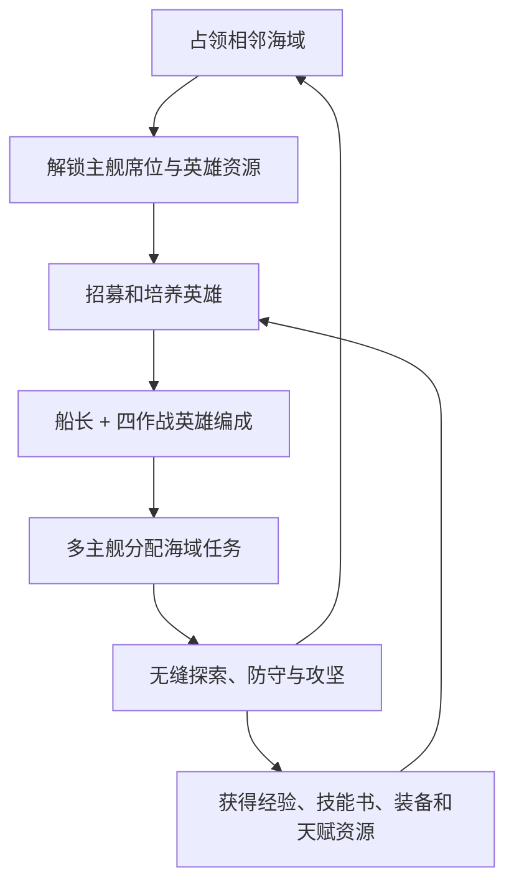
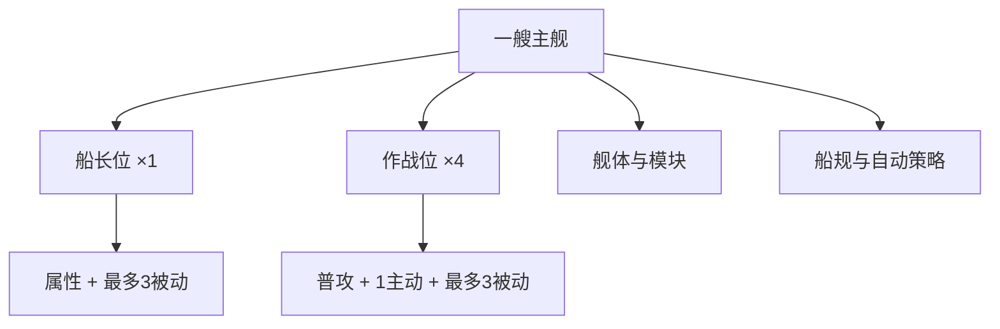

# 《吞吞舰船》海盗生涯：英雄船舰、多主舰、角色养成与 UI 完整设计文档

> 文档版本：V1.0  
> 文档性质：海盗生涯模式增量设计，不修改任何旧文档  
> 对应模式：海盗生涯（长期养成）  
> 核心扩展：英雄船舰、船长位、四作战英雄位、最多六艘主舰、角色升级、技能、天赋、装备、舰队编成、角色与舰船 UI  
> 推荐实现环境：Unity 3D，PC 键鼠优先，结构预留移动端  
> 核心原则：能力来自角色、舰体决定载体、岗位决定能力是否生效、多主舰扩展长期阵容、所有舰船继续存在于同一张无缝海域地图

---

## 0. 本文档与旧系统的关系

本文件在以下既有规则上继续扩展：

- 海盗生涯长期养成与海上港口。
- 防守建筑、造船厂、守卫舰和功能船。
- 六边形海域占领、动态边境和地图缩放。
- 相邻海域无缝探索、战斗与核心攻坚。
- 海洋生态、自动捕鱼、打捞和真实船队。

旧文档继续保留，不进行覆盖修改。出现冲突时按以下规则执行：

1. 旧版“单一玩家主舰”改为本文件的“最多六艘英雄主舰”。
2. 旧版主舰“四个攻击槽”整体迁移为“四个作战英雄位”。
3. 旧版主舰主动技能迁移为对应英雄的主动技能，不再单独养成一套舰船技能。
4. 旧版永久强化卡中属于人物能力的内容，迁移为英雄被动、技能、天赋或装备词条。
5. 属于舰体结构的永久强化卡，保留为舰体模块、船规或核心改装，不与英雄技能重复。
6. 玩家同一时间仍然只能直接操控一艘主舰。
7. 其他主舰继续在同一张地图内真实执行巡逻、防守、护航、拦截、采集保护和攻坚支援。
8. 任何主舰战斗都不进入二级战斗场景，不传送、不清场、不加空气墙。
9. 守卫舰、功能船与英雄主舰是三套不同单位，不相互替代。

---

## 1. 改造目标

### 1.1 旧系统的问题

旧版只有一艘主舰，长期成长主要集中在舰体、四个攻击槽和强化卡，容易出现：

- 一艘船养满以后，可扩展内容不足。
- 新增技能只能继续堆在同一艘船上。
- 玩家缺少收集和培养角色的长期目标。
- 不同玩法只是在更换武器预设，阵容变化不明显。
- 占领新海域主要增加建造面积和资源，缺少足够强的长期奖励。
- 港口、海域、主舰和人物之间缺少清晰的情感连接。

### 1.2 新系统的目标

新英雄船舰体系需要让长期成长形成五条互相支撑的主线：

1. **收集英雄**：获得不同攻击、控制、支援和指挥英雄。
2. **培养英雄**：升级、学习技能、配置天赋、打造装备。
3. **搭配主舰**：一名船长加四名作战英雄组成一艘主舰阵容。
4. **扩张舰队**：占领海域后逐步解锁最多六艘主舰。
5. **经营世界**：把不同主舰派往领土边境、航线、生态区和争夺海域。

### 1.3 一句话玩法

玩家通过占领六边形海域扩展自己的海上王国，招募和培养英雄，将一名英雄任命为船长、四名英雄配置到作战岗位，组成不同定位的英雄主舰舰队；玩家可直接驾驶其中一艘，其余主舰在同一张海域地图中自动巡逻、防守、护航、拦截和支援。

---

## 2. 核心循环



玩家每次成长都应至少推动以下一项：

- 新英雄进入阵容。
- 旧英雄解锁新技能或新被动。
- 一艘主舰形成新流派。
- 一个海域获得常驻主舰保护。
- 舰队可以同时处理更多地图事件。
- 玩家能以新的战术挑战更强的海域核心。

---

## 3. 统一名词

| 名词 | 定义 |
| --- | --- |
| 英雄 | 可升级、学习技能、点天赋、穿装备并分配到主舰岗位的角色 |
| 主舰 | 玩家长期培养、可直接操控、可装配五名英雄的核心舰船 |
| 舰长位 | 每艘主舰唯一的主驾驶岗位，仅生效属性和最多三个被动 |
| 作战位 | 每艘主舰四个战斗岗位，可释放英雄普攻、主动技能和被动 |
| 舰组 | 一艘主舰、一名船长和四名作战英雄组成的完整战斗单位 |
| 舰队 | 玩家当前拥有的全部主舰、守卫舰和功能船集合 |
| 旗舰 | 玩家当前直接控制或指定为主要指挥对象的主舰 |
| 普攻 | 英雄在作战位时持续执行的基础攻击 |
| 主动技能 | 英雄在作战位时装配并显示在战斗 HUD 上的可释放技能 |
| 被动技能 | 英雄最多装配三个，满足岗位条件后持续或触发生效 |
| 舰体模块 | 属于舰船本身的装甲、推进、仓储、能源和结构改装 |
| 船规 | 作用于整艘主舰的有限舰体策略，承接部分旧永久强化卡 |
| 预设 | 保存主舰、英雄岗位、技能、装备、天赋方案和自动战斗策略的组合 |

禁止在 UI 和配置中混用“船员槽、角色槽、攻击槽、技能槽”等旧称。新版统一使用：

- 船长位。
- 作战位 1～4。
- 主动技能装配。
- 被动技能装配。
- 舰体模块。

---

## 4. 一艘主舰的完整结构

每艘主舰固定拥有：

- 1 个船长位。
- 4 个作战位。
- 1 套舰体基础属性。
- 1 套舰体模块。
- 1 套船规。
- 1 套自动战斗策略。
- 1 个舰组预设集合。



### 4.1 船长位规则

船长位是主驾驶岗位，必须严格遵守：

- 船长无法释放自身普攻。
- 船长无法释放任何主动技能。
- 船长主动技能按钮不会出现在战斗 HUD。
- 船长最多装配三个被动技能，三个被动均可生效。
- 船长基础属性会计入舰船最终属性。
- 标注“仅作战位”的被动在船长位不生效。
- 标注“仅船长位”的被动在作战位不生效。
- 标注“通用岗位”的被动在两种岗位均可生效。
- 船长不能同时占用同一艘船的作战位。

船长位的价值来自：

- 更强的全舰属性贡献。
- 航行、索敌、维修、收益和舰队协同被动。
- 改变自动战斗行为的指挥型被动。
- 为四名作战英雄提供条件或联动。

### 4.2 作战位规则

每艘主舰有四个作战位：

- 作战位中的英雄会执行自身普攻。
- 每名英雄只能装配一个当前主动技能。
- 每名英雄最多装配三个被动技能。
- 四名英雄的主动技能分别映射到四个 HUD 技能按钮。
- 四名英雄的普攻可以并行工作。
- 英雄基础属性计入舰船最终属性。
- 同一名英雄不能同时配置到多个主舰。
- 作战位顺序不限制职业，但会决定 HUD 顺序、技能快捷键和默认攻击挂点。

推荐默认映射：

| 作战位 | 默认快捷键 | 默认挂点倾向 | UI位置 |
| --- | --- | --- | --- |
| 作战位1 | Q | 舰首或主炮 | HUD左一 |
| 作战位2 | E | 左舷或副炮 | HUD左二 |
| 作战位3 | R | 右舷或副炮 | HUD右二 |
| 作战位4 | F | 舰尾、支援或特殊装置 | HUD右一 |

挂点倾向不是职业限制。玩家更换英雄时，系统根据该英雄攻击类型选择兼容的表现挂点；若舰体没有专用挂点，使用标准通用挂点。

### 4.3 空岗位

- 船长位不能为空；没有船长时主舰不可出航。
- 作战位可以暂时为空。
- 空作战位不会提供属性、普攻、主动技能或被动。
- 新解锁主舰允许以“船长 + 1名作战英雄”最低编制出航。
- 推荐战力和任务风险必须根据实际空位计算。

---

## 5. 英雄能力结构

每名英雄由以下内容组成：

| 层级 | 内容 | 是否可更换 |
| --- | --- | --- |
| 身份 | 名称、阵营、职业、故事、外观 | 否 |
| 基础属性 | 生命贡献、火力、护甲、操舰、技术、感知 | 随成长提高 |
| 普攻 | 英雄的基础攻击方式 | 不直接更换，可由装备改变参数 |
| 主动技能库 | 建议3个主动技能 | 战前装配1个 |
| 被动技能库 | 建议6～8个被动 | 最多装配3个 |
| 天赋树 | 三条成长分支 | 可重置 |
| 装备 | 六个装备部位 | 可更换 |
| 岗位适性 | 船长、炮击、鱼雷、近战、工程、支援等 | 固定或成长 |

### 5.1 首版单英雄推荐内容量

每名完整英雄建议至少拥有：

- 1 个独特普攻。
- 3 个主动技能。
- 6 个普通被动。
- 2 个高阶被动。
- 1 套三分支天赋树。
- 1 个专属装备或专属装备词条。
- 1 套船长位推荐方案。
- 2 套作战位推荐方案。

首版若制作量有限，可先按以下最低规格上线：

- 1 个普攻。
- 2 个主动技能。
- 4 个被动技能。
- 12～15个天赋节点。
- 1 个专属装备效果。

### 5.2 英雄职业标签

职业标签用于筛选和推荐，不强制限制岗位：

| 标签 | 核心职责 |
| --- | --- |
| 炮击 | 远程炮弹、范围爆炸、破甲 |
| 速射 | 高频攻击、清理小型单位、叠层 |
| 鱼雷 | 对大型舰、追踪、水下攻击 |
| 冲撞 | 近距离爆发、位移、击退 |
| 燃烧 | 持续伤害、封锁水道 |
| 雷电 | 弹射、感电、群体控制 |
| 控制 | 减速、牵引、眩晕、标记 |
| 工程 | 维修、护盾、过热管理 |
| 召唤 | 无人机、小艇、炮台或生物伙伴 |
| 航海 | 速度、转向、索敌、拦截 |
| 掠夺 | 战利品、登船、打捞、奖励 |
| 指挥 | 全舰加成、AI策略、舰队协同 |

---

## 6. 普攻系统

### 6.1 普攻来源

新版主舰不再拥有脱离英雄的四套永久普通攻击。每个作战英雄提供自己的普攻：

```text
作战英雄
→ 决定攻击方式
→ 调用主舰兼容挂点
→ 使用英雄火力、装备和技能参数
→ 在主舰模型上发射
```

### 6.2 普攻类型

| 普攻类型 | 行为 | 适合英雄 |
| --- | --- | --- |
| 舰炮 | 装填后高伤炮弹 | 炮击 |
| 机枪 | 自动锁定并高频射击 | 速射 |
| 鱼雷 | 低频追踪大型目标 | 鱼雷 |
| 喷火 | 近距离扇形持续攻击 | 燃烧 |
| 鱼叉 | 命中后减速或牵引 | 控制、猎兽 |
| 雷电线圈 | 在近距离目标间弹射 | 雷电 |
| 冲撞装置 | 接触或蓄力撞击 | 冲撞 |
| 无人机 | 召唤无人机自动攻击 | 召唤 |
| 维修射线 | 自动修复友方目标 | 工程 |
| 声呐脉冲 | 低伤标记与破隐 | 航海、控制 |

### 6.3 手动与自动

默认规则：

- 玩家主要控制主舰移动、朝向、目标与主动技能。
- 四名作战英雄的普攻默认自动执行。
- 玩家可为每名英雄设置“自动普攻开关”。
- 需要蓄力或冲撞的特殊普攻，可设置为“跟随主攻击键”。
- 自动模式使用英雄自己的索敌策略。
- 手动锁定目标时，能攻击该目标的英雄优先集火。

### 6.4 攻击范围与射界

- 英雄普攻必须遵守真实射程和射界。
- 左右舷挂点受到船体朝向影响。
- 鱼雷不能穿过己方港口建筑。
- 维修攻击只选择友方单位。
- 无兼容目标时英雄保持待机，不虚假播放攻击动画。

---

## 7. 主动技能系统

### 7.1 装配规则

- 每名英雄可以学会多个主动技能。
- 出战前只能装配一个主动技能。
- 船长位即使装配了主动技能，战斗中也不会生效。
- 作战位中的主动技能显示在 HUD 对应英雄头像旁。
- 战斗中不能临时更换主动技能。
- 脱离战斗后可以在主舰预设界面免费更换。

### 7.2 主动技能类型

| 类型 | 示例 | 主要规则 |
| --- | --- | --- |
| 直接伤害 | 重炮齐射、鱼雷风暴 | 受火力、技能倍率和目标护甲影响 |
| 持续伤害 | 燃烧海面、电弧区 | 有持续时间和叠加上限 |
| 位移 | 冲锋、急转、短推进 | 不能把主舰传送出地图 |
| 控制 | 牵引、减速、击退、眩晕 | Boss按抗性缩短效果 |
| 防御 | 护盾、减伤、拦截弹幕 | 有持续时间或容量 |
| 维修 | 紧急修理、灭火、排水 | 不能无限维持 |
| 召唤 | 无人机、冲撞艇、诱饵 | 有同时存在上限 |
| 指挥 | 集火、炮塔同步、舰队加速 | 需要有效友方目标 |
| 掠夺 | 登船钩、快速打捞 | 只在对应目标状态下可用 |

### 7.3 资源与冷却

首版建议使用“独立冷却 + 少量全舰能源”：

- 每个主动技能有独立冷却。
- 强力技能额外消耗全舰能源。
- 普通技能可以只使用冷却。
- 全舰能源由舰体、工程英雄、装备和港口补给影响。
- 能源不足时技能按钮显示缺口，不进入假冷却。
- 不使用四套不同的蓝条，避免 HUD 过度复杂。

### 7.4 自动释放策略

每个主动技能可配置：

- 从不自动释放。
- 冷却结束立即释放。
- 仅精英/Boss释放。
- 目标数量达到阈值时释放。
- 自身生命低于阈值时释放。
- 友方生命低于阈值时释放。
- 玩家标记目标后释放。
- 保留一次，不消耗最后一层充能。

---

## 8. 被动技能系统

### 8.1 装配上限

- 每名英雄最多装配三个被动技能。
- 船长位最多生效三个。
- 作战位最多生效三个。
- 装配第四个时必须先替换已有被动。
- 天赋节点、装备词条和舰体模块不占用被动技能槽，但拥有各自上限。

### 8.2 岗位标签

| 标签 | 船长位 | 作战位 |
| --- | ---: | ---: |
| 通用 | 生效 | 生效 |
| 船长 | 生效 | 不生效 |
| 作战 | 不生效 | 生效 |
| 炮击/鱼雷/工程等职业条件 | 满足额外条件才生效 | 满足额外条件才生效 |

装配界面必须在技能卡上直接显示岗位标签，不允许玩家装好后才发现无效。

### 8.3 被动类别

- 属性型：提高生命、火力、护甲、速度、感知。
- 触发型：暴击、受击、击杀、低血、破盾时触发。
- 条件型：面对海兽、舰船、建筑、Boss时强化。
- 联动型：与燃烧、感电、标记、护盾等状态联动。
- 船长型：改变全舰或 AI 行为。
- 经济型：增加打捞、捕鱼、航线、掠夺收益。
- 地图型：提高侦察、航速、拦截、撤离和事件发现。

### 8.4 同类叠加

为了避免五名英雄被动无限堆叠：

- 同名被动不能在同一舰组重复生效。
- 相同标签的纯数值加成可以叠加，但超过软上限后递减。
- 同一触发事件的额外投射物、召唤物和范围爆炸有全舰触发频率上限。
- “唯一”被动整艘舰只允许一个。
- 冲突技能在编成界面显示黄色警告，并给出实际保留效果。

推荐递减公式：

```text
最终同类加成 =
前40%按100%计入
40%～80%部分按50%计入
80%以上部分按25%计入
```

---

## 9. 原有舰船技能的迁移规则

旧版四个攻击槽和舰船技能必须迁移，不允许玩家已获得内容直接消失。

### 9.1 迁移原则

| 旧内容 | 新归属 |
| --- | --- |
| 普通舰炮 | 炮击英雄的普攻 |
| 机枪 | 速射英雄的普攻 |
| 鱼雷 | 鱼雷英雄的普攻或主动 |
| 喷火 | 燃烧英雄的普攻或主动 |
| 冲撞 | 冲撞英雄的普攻机制或主动 |
| 护盾 | 工程/防御英雄的主动 |
| 维修 | 工程英雄的主动或被动 |
| 雷电 | 雷电英雄的普攻或主动 |
| 无人机 | 召唤英雄的普攻或主动 |
| 水雷 | 爆破英雄的主动 |
| 声呐 | 航海英雄的主动或被动 |
| 掠夺加成 | 掠夺英雄被动、天赋或装备词条 |
| 舰体生命/推进强化 | 舰体模块或船规 |

### 9.2 已有进度补偿

旧技能拥有等级时：

1. 解锁对应英雄或英雄招募任务。
2. 技能等级转换为该英雄技能熟练度。
3. 超出新技能等级上限的部分转换为通用技能点。
4. 旧卡牌碎片根据归属转换为英雄碎片、技能手册或舰体研究点。
5. 已保存预设自动生成“迁移预设”，不会覆盖玩家其他方案。

### 9.3 不迁移为英雄的内容

以下内容继续属于舰体：

- 舰体最大生命。
- 基础装甲。
- 基础速度、转向和加速。
- 基础能源和能源恢复。
- 货舱、补给、吞噬容量。
- 武器表现挂点数量。
- 舰体碰撞体积。
- 船体被动结构，如防撞船首、双层舱壁。

---

## 10. 英雄属性体系

### 10.1 六项核心属性

| 属性 | 英雄作用 | 转换后的舰船作用 |
| --- | --- | --- |
| 体魄 | 个人生存、负伤抗性 | 舰船生命与抗冲击贡献 |
| 火力 | 普攻和伤害技能 | 普攻伤害、技能强度 |
| 防护 | 减伤与异常抵抗 | 护甲、护盾和减伤贡献 |
| 操舰 | 航行、转向、冲撞 | 速度、转向、加速度 |
| 技术 | 维修、能源、召唤 | 冷却、维修、能源恢复 |
| 感知 | 索敌、暴击、侦察 | 暴击、射程、地图发现 |

### 10.2 属性计入原则

船舰最终属性由舰体和五名英雄共同组成：

```text
舰船最终属性 =
舰体基础属性
+ 舰体模块属性
+ 船长属性贡献
+ 四名作战英雄属性贡献
+ 装备、技能、天赋和海域修正
```

所有已编入舰组的英雄都会贡献属性，不能只计算当前释放技能的英雄。

### 10.3 岗位转换率

为了让船长与作战英雄有不同价值，使用公开可见的岗位转换率：

| 属性类别 | 船长位 | 作战位 |
| --- | ---: | ---: |
| 生命、防护 | 100% | 70% |
| 操舰、感知 | 100% | 70% |
| 火力 | 50% | 100% |
| 技术 | 100% | 85% |

说明：

- 船长更擅长把综合能力转化为全舰属性。
- 作战英雄的火力完整计入。
- 岗位转换率必须显示在属性详情中。
- 特定天赋可以小幅改变转换率，但不能超过120%。

### 10.4 推荐基础公式

```text
最终生命 =
(舰体生命 + 模块生命 + Σ英雄体魄贡献)
× (1 + 生命百分比加成)

最终普攻伤害 =
英雄普攻基础值
× (1 + 对应英雄火力系数)
× (1 + 全舰火力加成)
× 技能与装备修正

最终技能伤害 =
技能基础值
+ 对应英雄火力/技术加成
× 技能等级倍率
× 全舰技能修正

最终速度 =
舰体基础速度
× (1 + 操舰贡献 + 推进模块 + 海况修正)
```

不要只计算一个“英雄总战力”后直接乘给舰船。每项真实属性必须可以展开追溯来源。

### 10.5 属性详情追溯

点击任意最终属性可展开：

```text
最大生命 18,420
├── 舰体基础           10,000
├── 装甲模块            2,400
├── 船长·铁钩雷蒙       1,620
├── 作战英雄贡献        2,160
├── 天赋与装备          1,140
└── 海域/港口加成       1,100
```

---

## 11. 英雄定位与阵容流派

### 11.1 标准舰组结构

新手推荐阵容：

- 1名综合型船长。
- 2名输出英雄。
- 1名控制或航海英雄。
- 1名工程或防御英雄。

系统可以推荐，但不能强制职业数量。

### 11.2 典型流派

| 流派 | 船长倾向 | 作战英雄组合 | 适用玩法 |
| --- | --- | --- | --- |
| 舰炮齐射 | 火力/装填 | 炮击×2、破甲、工程 | 堡垒攻坚 |
| 高频速射 | 暴击/索敌 | 速射×2、雷电、支援 | 小艇集群 |
| 鱼雷猎杀 | 感知/航速 | 鱼雷×2、控制、声呐 | 大型舰和Boss |
| 火海封锁 | 持续伤害 | 燃烧×2、控制、维修 | 水道防守 |
| 冲撞掠夺 | 操舰/收益 | 冲撞×2、登船、工程 | 商船拦截 |
| 雷暴连锁 | 技术/异常 | 雷电×2、标记、能源 | 密集金属舰 |
| 无人机航母 | 技术/召唤 | 召唤×2、维修、控制 | 持续作战 |
| 不沉堡垒 | 防护/维修 | 护盾、维修、嘲讽、炮击 | 港口防守 |
| 高速侦猎 | 航速/感知 | 航海×2、速射、鱼雷 | 航线拦截 |
| 生态护航 | 航海/收益 | 控制、维修、声呐、护盾 | 捕鱼打捞护航 |

### 11.3 阵容克制提示

出航前显示：

- 对小型单位能力。
- 对大型单位能力。
- 对建筑能力。
- 生存与维修。
- 控制与拦截。
- 航速与追击。
- 生态/掠夺/打捞收益。

不只显示一个总战力，避免高战力阵容在错误目标上失效。

---

## 12. 主舰数量与海域解锁

### 12.1 最大数量

- 玩家初始拥有1艘主舰。
- 每首次占领一块新的相邻海域，解锁1个主舰席位。
- 最多拥有6艘英雄主舰。
- 因此玩家占领5块新海域后达到6艘上限。
- 后续继续占领海域不再增加主舰数量，改为提供舰体蓝图、英雄资源、区域加成和舰队容量成长。

### 12.2 解锁不等于直接送满编舰组

占领海域后获得：

1. 一个新的主舰席位。
2. 一次新舰体选择或对应舰体修复任务。
3. 一个基础船长候选或英雄招募线索。
4. 主舰船坞的新停泊位建造权限。

新主舰需要完成短流程才能出航：

```text
占领海域
→ 现场接管或发现残舰
→ 选择/修复舰体
→ 任命船长
→ 至少配置1名作战英雄
→ 补给与下水
```

该流程应在5～10分钟内完成，不能让玩家获得奖励后长时间无法使用。

### 12.3 六艘主舰成长节奏

| 主舰 | 解锁条件 | 主要教学与用途 |
| --- | --- | --- |
| 1号舰 | 初始 | 直接操控、基础英雄编成 |
| 2号舰 | 占领第1块新海域 | 双线任务、港口防守与主动出击分离 |
| 3号舰 | 占领第2块新海域 | 航线拦截和功能船护航 |
| 4号舰 | 占领第3块新海域 | 多边境驻防和针对性流派 |
| 5号舰 | 占领第4块新海域 | 高危海域远征和协同攻坚 |
| 6号舰 | 占领第5块新海域 | 完整舰队、多线世界事件和终局调度 |

### 12.4 主舰不可永久丢失

- 主舰生命归零后进入“失去动力”状态。
- 可被拖船、救援舰或其他主舰救回。
- 超时未救援会自动回到最近已占领海域，但维修时间和资源成本提高。
- 英雄进入负伤或疲劳状态，不会永久死亡。
- 自动刷取已通关内容时不产生永久舰体损失。

---

## 13. 六艘主舰的舰体差异

主舰席位不应只是复制六艘相同船。建议首版提供以下舰体原型，玩家解锁席位时从已获得蓝图中选择：

| 舰体原型 | 核心优势 | 代价 | 推荐英雄 |
| --- | --- | --- | --- |
| 万用吞吞舰 | 均衡、吞噬与装配兼容 | 无突出极值 | 任意新手阵容 |
| 重甲堡垒舰 | 高生命、护甲、模块耐久 | 慢、转向差 | 炮击、工程、护盾 |
| 高速猎潮舰 | 高速、转向、拦截 | 脆、能源低 | 鱼雷、速射、航海 |
| 侧舷火力舰 | 作战位普攻强化、齐射 | 正面火力较弱 | 炮击、燃烧 |
| 无人机母舰 | 召唤上限、维修与支援 | 本体爆发低 | 召唤、工程、控制 |
| 巨口掠夺舰 | 冲撞、吞噬、战利品 | 需要近身、风险高 | 冲撞、掠夺、维修 |
| 雷暴实验舰 | 能源、异常、范围输出 | 对绝缘目标较弱 | 雷电、技术 |
| 远洋指挥舰 | 航线、侦察、友军协同 | 单舰伤害低 | 指挥、航海、支援 |

玩家最多拥有六艘，但舰体原型可以多于六种。舰体更换规则：

- 主舰席位和舰体不是永久绑定。
- 在主舰船坞中可以进行舰体换装。
- 换装需要主舰处于港口且不在维修。
- 英雄编成、技能和装备保留。
- 不兼容的舰体模块自动进入仓库。

---

## 14. 多主舰在无缝地图中的玩法

### 14.1 控制权

- 玩家同一时间直接控制一艘主舰。
- 其他主舰由 AI 执行玩家下达的任务。
- 切换主控主舰只切换镜头、输入和 HUD。
- 舰船不会因切换控制权而瞬移。
- 当前主舰在战斗中时，玩家仍可切换到另一艘，但原舰转入当前自动策略。
- 远距离主舰切换时镜头先拉到大地图，再落到目标舰，避免空间跳变难以理解。

### 14.2 主舰任务

| 任务 | 行为 |
| --- | --- |
| 港口驻防 | 停泊或巡逻主港，参加自动防守 |
| 边境驻守 | 在指定暴露边附近巡逻 |
| 海域巡逻 | 在一个已占领六边形内清理低威胁 |
| 航线拦截 | 前往预计交汇点拦截真实移动船队 |
| 功能船护航 | 跟随捕鱼、打捞或运输船 |
| 远征侦察 | 揭开相邻海域活动与敌方据点 |
| 核心攻坚 | 参与相邻海域核心战 |
| 紧急支援 | 前往另一主舰或港口受袭位置 |
| 恢复整备 | 返回船坞补给、维修、恢复英雄状态 |
| 待命 | 保持当前位置并响应指令 |

### 14.3 多舰协同

同一海域允许多艘主舰协同，但需限制收益和操作复杂度：

- 玩家直接控制1艘。
- 最多2艘其他主舰作为 AI 支援进入同一核心战。
- 支援舰根据战力增加敌方增援或核心机制强度，避免无脑六舰碾压。
- 多舰参战提高容错和战术可能，不简单把奖励乘以舰数。
- 每艘舰仍独立计算生命、能源、英雄技能和撤退。

### 14.4 舰队指令

玩家可对主舰下达：

- 跟随旗舰。
- 保持左翼/右翼。
- 前方侦察。
- 保护指定主舰。
- 保护功能船。
- 集火标记目标。
- 优先拆除模块。
- 拦截高速目标。
- 保持距离。
- 低血撤退。
- 固守浮标。
- 不追出指定海域。

### 14.5 自动处理与离线模拟

不在镜头附近的主舰：

- 使用相同阵容、属性和任务状态进行战略层模拟。
- 进入镜头范围时还原为相同位置、生命、冷却、目标与航线。
- 不允许远景满血、拉近后重新生成。
- 主动技能按自动释放策略结算。
- 高风险核心攻坚默认不自动发起，除非玩家明确授权。

---

## 15. 英雄获取系统

### 15.1 获取来源

英雄来源需要与世界玩法绑定：

- 占领海域后的投降、救援或招募。
- 海盗酒馆定期刷新。
- 拯救被困船队或漂流筏。
- 击败海域核心后触发角色故事。
- 航线声望和商会关系奖励。
- 特殊海怪事件。
- 港口任务、长期成就和章节任务。
- 英雄碎片、招募契约或专属信物。

### 15.2 获取原则

- 核心功能英雄不能完全依赖低概率随机。
- 新手前60分钟必须获得至少5名可组成完整舰组的英雄。
- 解锁第二艘主舰前，至少额外提供2～3名候选英雄。
- 每种基础职责至少有一名稳定获取英雄。
- 重复获得同一英雄转化为英雄信物，用于突破或兑换通用资源。

### 15.3 英雄品质

建议品质只影响成长上限和初始完整度，不决定角色是否可用：

| 品质 | 定位 |
| --- | --- |
| 普通 | 简单明确、低培养成本 |
| 优良 | 有基础技能联动 |
| 稀有 | 完整流派角色 |
| 史诗 | 改变阵容机制 |
| 传奇 | 高投入、独特机制，不应全面碾压 |

普通英雄也可以通过突破进入后期，只是机制较简单。

---

## 16. 角色升级系统

### 16.1 等级与经验

- 英雄初始等级1。
- 推荐首版等级上限60。
- 参加战斗、护航、巡逻、远征和港口岗位均可获得经验。
- 未参战但编入舰组的英雄获得完整或较高比例经验。
- 低等级英雄随高等级舰组出战时获得追赶经验。
- 已满级英雄获得的溢出经验转为少量训练点。

### 16.2 等级阶段

| 等级 | 阶段 | 主要解锁 |
| ---: | --- | --- |
| 1～10 | 新手 | 普攻、首个主动、首个被动、基础装备 |
| 11～20 | 熟练 | 第二主动、第二被动槽、第一层天赋 |
| 21～30 | 专精 | 第三主动、第三被动槽、专属装备线索 |
| 31～40 | 精英 | 高阶被动、第二天赋分支深层 |
| 41～50 | 大师 | 技能强化节点、装备高阶词条 |
| 51～60 | 传奇 | 终极天赋、外观、角色故事终章 |

被动槽建议：

- Lv.1：1个。
- Lv.15：2个。
- Lv.25：3个。

为了符合“每名英雄最多3个被动”，后续不再增加第四槽。

### 16.3 突破

每10级需要一次突破：

- 消耗金币、英雄信物、职业材料和海域资源。
- 解锁下一个等级上限。
- 提高基础属性。
- 解锁技能或天赋层级。
- 不以突破失败或随机降级消耗玩家资源。

### 16.4 追赶机制

为了支持最多六艘主舰和大量英雄：

- 新英雄等级低于账号最高英雄10级以上时，训练经验提高。
- 训练室可把英雄快速提升到账号基准等级的70%～80%。
- 已培养英雄的等级资源可部分无损转移给未培养英雄，每周有免费次数。
- 第二艘主舰解锁后开放“一键补足基础等级”。
- 第四艘主舰解锁后开放“舰队训练队列”。

---

## 17. 技能解锁、学习与装配

### 17.1 技能状态

每个技能有以下状态：

1. 未发现。
2. 已发现但未满足学习条件。
3. 可学习。
4. 已学习。
5. 已装配。
6. 可升级。
7. 已满级。

### 17.2 解锁条件

技能可通过以下方式解锁：

- 英雄等级。
- 英雄突破。
- 专属任务。
- 技能书或职业手册。
- 海域核心掉落。
- 战斗学院研究。
- 与其他英雄的羁绊事件。
- 特定天赋节点。

### 17.3 学习消耗

- 基础技能消耗技能点和金币。
- 高阶技能额外需要职业手册。
- 专属技能通过剧情或专属物品解锁。
- 已解锁技能不因洗点或更换装备消失。

### 17.4 技能等级

建议主动与被动技能最高5级：

| 等级 | 成长原则 |
| ---: | --- |
| 1 | 开放完整机制 |
| 2 | 提高基础数值 |
| 3 | 提高持续时间、范围或效率 |
| 4 | 提高数值并降低冷却 |
| 5 | 增加一个明确但可控的强化分支 |

不能把关键机制拖到最高级才开放。首次学会时就应能感受到技能身份。

### 17.5 技能熟练度

- 英雄使用普攻或主动技能可获得对应熟练度。
- 熟练度达到阈值后减少一部分升级材料。
- 自动战斗也能获得熟练度，但每日有合理上限。
- 熟练度不直接无限加伤，避免挂机时长碾压。

### 17.6 技能装配界面规则

主动技能区：

- 显示全部已学主动。
- 只能选择一个装配。
- 比较伤害、冷却、能源、范围和标签。
- 船长位显示“当前岗位禁用主动技能”。

被动技能区：

- 三个固定槽位。
- 显示岗位标签。
- 显示冲突和叠加情况。
- 点击“推荐”可根据当前舰组与目标生成方案。
- 系统推荐不得自动覆盖玩家锁定槽位。

---

## 18. 天赋点获取与天赋树

### 18.1 天赋点来源

推荐总量：

- 英雄每2级获得1点。
- 每次突破额外获得1点。
- 专属角色任务奖励2～3点。
- 首版60级英雄最终约35～40点。

不通过装备随机掉落天赋点，避免核心成长受运气控制。

### 18.2 三条天赋分支

每名英雄拥有三条主题明确的分支：

1. **普攻/输出分支**：强化自身攻击方式。
2. **主动/机制分支**：改变技能范围、冷却、状态或召唤。
3. **岗位/生存分支**：船长能力、全舰贡献、生存或收益。

### 18.3 节点类型

| 节点 | 功能 |
| --- | --- |
| 小节点 | 单项数值成长 |
| 中节点 | 条件触发或属性转换 |
| 分支节点 | 二选一改变玩法 |
| 核心节点 | 明确改变技能或普攻机制 |
| 终极节点 | 形成完整流派，不单纯加大数值 |

### 18.4 分支互斥

- 关键分支节点可以二选一。
- 二选一之后可通过洗点更换。
- 终极节点需要在对应分支投入足够点数。
- 玩家可以混点，但不能在满级时拿完所有核心节点。

### 18.5 重置规则

- 港口内可免费预览，不立即消耗。
- 确认重置消耗少量金币或天赋重置券。
- 每周提供至少一次免费重置。
- 新获得英雄前7天或Lv.20前可免费重置。
- 预设保存天赋方案，切换预设时自动检查点数。

### 18.6 天赋树可读性

每个节点必须显示：

- 当前等级和上限。
- 精确数值变化。
- 前置节点。
- 生效岗位。
- 影响的普攻或技能。
- 与当前装备/技能的联动标签。
- 点亮后的舰船属性变化。

---

## 19. 装备系统

### 19.1 六个装备部位

| 部位 | 主要属性 | 可能改变 |
| --- | --- | --- |
| 主武器 | 火力、攻击速度、暴击 | 普攻弹道、伤害类型、射程 |
| 防具 | 体魄、防护、异常抗性 | 英雄与舰船耐久贡献 |
| 手套 | 装填、暴击、技能速度 | 普攻节奏、触发效率 |
| 靴具 | 操舰、闪避、行动效率 | 舰船速度、转向、冲撞 |
| 航海工具 | 技术、感知、能源 | 索敌、冷却、维修、侦察 |
| 饰品 | 流派词条、收益、特殊触发 | 构筑核心或岗位强化 |

### 19.2 装备品质

| 品质 | 基础词条 | 随机词条 | 特殊词条 |
| --- | ---: | ---: | ---: |
| 普通 | 1 | 0～1 | 0 |
| 优良 | 1 | 1～2 | 0 |
| 稀有 | 1 | 2～3 | 0～1 |
| 史诗 | 1 | 3～4 | 1 |
| 传奇 | 1 | 3～4 | 1个独特效果 |

### 19.3 随机属性池

随机词条分为：

- 基础属性：体魄、火力、防护、操舰、技术、感知。
- 战斗属性：暴击、暴伤、攻击速度、技能强度、冷却、状态命中。
- 生存属性：护盾、维修、减伤、抗暴、异常抗性。
- 类型属性：炮击、鱼雷、燃烧、雷电、召唤等标签强化。
- 岗位属性：船长转换率、作战位火力、全舰能源。
- 地图属性：航速、侦察、拦截、打捞、捕鱼、掠夺。

### 19.4 词条有效性规则

- 主武器不出现完全无关的纯生产词条。
- 工程英雄装备不应大量生成只强化冲撞的词条。
- 装备掉落根据英雄职业只做轻度倾向，不完全锁死。
- 同一装备最多有一个高价值收益词条。
- 传奇独特效果不能只提供更高百分比。
- 被当前英雄完全无法触发的词条显示灰色原因。

### 19.5 装备升级

推荐强化等级上限为+15：

- +1～+5：基础材料。
- +6～+10：高级材料。
- +11～+15：稀有海域材料。
- 强化只提升基础属性，不随机失败、不降级。
- 更换装备时可100%继承强化经验，仅收取少量金币。
- 分解装备返还大部分强化材料。

### 19.6 随机词条重铸

- 每次只能选择一个词条重铸。
- 可锁定其他词条。
- 锁定数量越多，消耗越高。
- 重铸前显示可能出现的词条池和范围。
- 可保留原结果，不强制覆盖。
- 设定保底次数，避免长期无法获得目标词条。

### 19.7 装备精炼

- 稀有及以上装备可提升随机词条数值。
- 精炼有明确进度，不使用连续失败降级。
- 同一装备达到阶段后必定提升一个最低词条。
- 传奇装备通过专属材料解锁独特效果强化。

### 19.8 套装

首版建议2件和4件套：

- 2件套提供稳定基础效果。
- 4件套提供玩法机制。
- 不做6件强制全套，保留混搭空间。
- 套装效果必须显示影响哪些英雄技能与全舰属性。

### 19.9 装备来源

- 相邻海域敌人和核心。
- 港口防守Boss。
- 航线拦截与敌舰残骸。
- 海怪与生态事件。
- 锻造工坊。
- 商队、黑市和声望商店。
- 角色专属任务。

---

## 20. 英雄状态、负伤与恢复

### 20.1 状态

英雄可能处于：

- 空闲。
- 已编入舰组。
- 出航中。
- 自动巡逻。
- 港口岗位。
- 训练中。
- 负伤。
- 疲劳。
- 任务锁定。

### 20.2 负伤

- 主舰失去动力或战斗失败时，英雄可能负伤。
- 负伤不影响永久属性，只在恢复前降低部分贡献。
- 医务室、诊所和医疗英雄缩短恢复时间。
- 玩家可把负伤英雄换下，不强制等待。
- 自动刷已通关低风险内容时，负伤概率极低或为零。

### 20.3 疲劳

疲劳用于鼓励多舰轮换，但不能惩罚正常游玩：

- 连续高危远征逐步积累疲劳。
- 普通巡逻、港口防守和离线任务疲劳较低。
- 疲劳只影响少量属性和收益。
- 返回港口、食堂、酒馆和宿舍可快速恢复。
- 新手期与剧情战不受疲劳限制。

---

## 21. 主舰搭配系统总览

新版主舰搭配页面不是旧版“四个武器槽”的换皮，而是完整管理：

- 当前选择的主舰。
- 舰体与舰体模块。
- 船长。
- 四名作战英雄。
- 每名英雄的主动和被动技能。
- 英雄装备与天赋摘要。
- 舰组属性与流派评价。
- 自动战斗策略。
- 舰组预设。
- 当前地图位置和任务状态。

### 21.1 主舰搭配操作闭环

```text
选择主舰
→ 查看当前任务与舰体
→ 任命船长
→ 配置四名作战英雄
→ 检查主动/被动/装备/天赋
→ 查看真实属性变化
→ 设置自动战斗策略
→ 保存舰组预设
→ 出航或派遣
```

### 21.2 编成合法性

保存前检查：

- 是否存在船长。
- 英雄是否已被其他主舰占用。
- 英雄是否负伤或任务锁定。
- 主动技能是否已学习。
- 被动是否符合当前岗位。
- 舰体是否兼容英雄普攻表现。
- 同名唯一被动是否冲突。
- 是否缺少最低补给。

不合法内容不能静默失效，必须在对应槽位显示原因。

### 21.3 英雄占用规则

- 一名英雄同一时间只能属于一个主舰舰组。
- 把已占用英雄拖入新主舰时，弹出来源主舰。
- 玩家可选择“调动英雄”或“取消”。
- 调动会使原舰对应岗位变空。
- 处于战斗、远征或高危任务中的英雄不能远程调动。
- 返回港口后允许一键完成已排队的调动。

---

## 22. 舰组预设

### 22.1 预设内容

每个主舰预设保存：

- 舰体。
- 舰体模块。
- 船规。
- 船长。
- 四名作战英雄。
- 英雄主动技能。
- 英雄被动技能。
- 英雄天赋方案。
- 英雄装备方案。
- 技能自动释放策略。
- 舰队 AI 命令。

### 22.2 预设数量

- 每艘主舰初始3套预设。
- 港口管理局升级后最多8套。
- 提供“港口防守、海怪、舰船、堡垒、护航”默认模板。
- 玩家可自定义名称、颜色和图标。

### 22.3 切换限制

- 港口内可免费完整切换。
- 非战斗状态可切换技能和策略，但不能凭空更换不在船上的英雄与装备。
- 战斗中不能切换预设。
- 正在航行时可排队“返港后切换”。
- 预设引用被其他主舰占用的英雄时，显示冲突，不自动抢人。

---

## 23. 船规与舰体模块

为了保留舰船本身的成长空间，英雄系统不能吞掉所有舰体玩法。

### 23.1 舰体模块

模块建议分为：

- 装甲模块。
- 推进模块。
- 能源模块。
- 感知模块。
- 货舱模块。
- 吞噬模块。
- 维修模块。
- 特殊结构模块。

模块改变舰体属性或结构，不提供具体英雄主动技能。

### 23.2 船规

每艘主舰最多装配2～4条船规，用来承接旧强化卡中全舰策略部分：

| 船规 | 示例效果 |
| --- | --- |
| 集中火力 | 锁定目标后，四名作战英雄提高对该目标伤害 |
| 保守航行 | 自动模式低血更早撤退，维修成本降低 |
| 掠夺优先 | 优先攻击运输与残血目标，战利品提高 |
| 港口守卫 | 在已占领海域内提高防护和维修 |
| 远洋续航 | 降低补给消耗，提高远程任务持续时间 |
| 生态保护 | 自动作战避免攻击受保护生物，提高护航收益 |

船规不能与英雄被动重复出完全相同的数值叠层。

---

## 24. 六艘主舰的长期分工

六艘主舰不是六套必须全部手动精细操作的队伍。系统应允许玩家形成清晰分工：

| 主舰用途 | 推荐常驻位置 | 推荐阵容 |
| --- | --- | --- |
| 玩家旗舰 | 当前活跃海域 | 综合或玩家偏好 |
| 港口守备舰 | 海心指挥台附近 | 防护、维修、范围攻击 |
| 边境巡逻舰 | 薄弱暴露边 | 速射、控制、航海 |
| 航线猎手舰 | 商贸航道 | 高速、鱼雷、掠夺 |
| 生态护航舰 | 渔场、打捞区 | 护盾、维修、声呐 |
| 攻坚舰 | 相邻敌对海域 | 炮击、破甲、持续输出 |

这些只是预设，不强制一舰一职。

### 24.1 地图任务容量

- 每艘主舰同时只执行一个主任务。
- 可附带一个响应规则，例如“附近功能船遇袭时支援”。
- 跨越多个海域的任务需要真实航行时间。
- 燃料、补给和英雄疲劳会影响任务持续时间。
- 主舰任务结束后可以返港、原地待命或继续下一个队列任务。

### 24.2 任务队列

港口指挥台升级后解锁：

- 最多3条任务队列。
- 巡逻完成后自动返港。
- 护航完成后接管附近打捞任务。
- 资源低于阈值时自动取消远征。
- 海域进入高危警报时自动回撤到指定边境。

高危核心攻坚和中立船队劫掠默认不进入自动队列。

---

## 25. 与六边形海域扩张的结合

### 25.1 主舰席位奖励

前五次占领新海域时，领土扩张奖励中明确显示：

```text
新海域已占领
├── 解锁建造权限
├── 获得区域加成
├── 解锁新的事件与航线
└── 主舰席位 2/6
```

达到6艘后改为：

```text
主舰席位已达上限 6/6
本次获得：舰体研究点 / 英雄信物 / 舰队指挥容量
```

### 25.2 主舰与海域常驻

玩家可以把主舰指定为某海域的常驻舰：

- 提高该海域防守响应速度。
- 提高当地功能船安全度。
- 根据船长被动提供区域加成。
- 主舰离开后常驻加成暂停。
- 同一海域可停留多舰，但只有最高的同类区域加成生效。

### 25.3 边境来袭

当轮次敌人从动态暴露边出现：

- 最近的主舰自动收到警报。
- 港口守备舰按策略决定是否出动。
- 玩家可在战前调动最多指定数量的主舰。
- 主舰需要真实抵达来袭边，不瞬移参加。
- 未及时抵达时可以在战斗中途作为增援进入。

### 25.4 相邻海域攻坚

攻坚准备页面直接覆盖在当前地图上：

- 显示核心、据点和补给线。
- 选择先锋主舰。
- 选择0～2艘支援主舰。
- 预览航线和抵达时间。
- 预览英雄疲劳、补给和任务冲突。
- 点击“集结”后主舰真实航向集合点。
- 所有舰船抵达后，玩家可手动发起或直接接战。

---

## 26. 港口建筑与英雄体系

### 26.1 新增或改造建筑

| 建筑 | 功能 |
| --- | --- |
| 英雄招募所 | 刷新招募、查看线索、处理英雄信物 |
| 舰队训练馆 | 英雄训练、追赶经验、技能熟练 |
| 战斗学院 | 学习通用技能、研究职业手册 |
| 舰长议事厅 | 解锁船长被动、舰队策略和船规 |
| 装备锻造坊 | 制造、强化、重铸和分解装备 |
| 天赋研究室 | 免费预览、重置天赋和保存方案 |
| 英雄宿舍 | 提高疲劳恢复并展示空闲英雄 |
| 海盗诊所 | 治疗负伤英雄 |
| 主舰船坞 | 主舰停泊、换装、维修和编成 |
| 舰队指挥中心 | 六艘主舰地图任务与队列管理 |

### 26.2 建筑表现

- 招募所门前出现候选英雄和公告板。
- 训练馆能看到英雄练习、装填、打靶或操舵。
- 锻造坊展示装备模型、火花和工匠。
- 船坞内可看到对应主舰和当前编成英雄登舰。
- 负伤英雄会在诊所或宿舍出现。
- 主舰出航时，五名英雄以简化队列登舰。
- 主舰返航后英雄离舰进入港口生活 AI。

英雄不能只存在于菜单头像中。

---

## 27. 新手英雄与主舰成长流程

### 27.1 前10分钟

1. 玩家拥有1号基础主舰。
2. 获得第一名固定船长。
3. 获得两名作战英雄。
4. 教学明确船长不能攻击和释放主动。
5. 把两名作战英雄拖入作战位。
6. 在第一次港口防守中看到两套英雄普攻。
7. 解锁第一个英雄主动技能。

### 27.2 10～30分钟

- 获得第四和第五名英雄，组成完整舰组。
- 解锁第二个被动槽。
- 完成第一次技能装配。
- 获得第一件带随机词条的装备。
- 完成一次装备强化。
- 在舰船界面查看属性来源。

### 27.3 30～60分钟

- 占领第一块相邻海域。
- 解锁2号主舰席位。
- 从两种舰体中选择一艘。
- 把部分英雄调到2号舰。
- 系统赠送或引导招募2～3名新英雄，避免两舰大量空位。
- 1号舰主动探索，2号舰驻守港口或护航。

### 27.4 第一天

- 解锁英雄天赋树。
- 完成一次天赋分支选择。
- 学会第二个主动技能并替换测试。
- 开始打造两套不同舰组。
- 获得第一件稀有或套装装备。
- 完成一次双主舰协同攻坚。

### 27.5 第一周

- 拥有3～4艘主舰。
- 形成至少三种不同战斗定位。
- 解锁舰队任务队列。
- 开始处理多边境、航线和生态护航。
- 培养首名Lv.30以上核心英雄。
- 完成一套完整2件或4件装备效果。

---

## 28. 成长资源与经济

### 28.1 新资源

| 资源 | 来源 | 用途 |
| --- | --- | --- |
| 英雄经验 | 战斗、任务、训练 | 角色升级 |
| 英雄信物 | 重复英雄、专属任务 | 英雄突破 |
| 技能点 | 升级、训练、任务 | 学习和升级技能 |
| 职业手册 | 海域核心、学院、商店 | 高阶技能 |
| 天赋点 | 等级、突破、角色任务 | 点亮天赋 |
| 强化材料 | 敌舰、打捞、锻造 | 装备强化 |
| 重铸零件 | 分解装备、Boss | 随机词条重铸 |
| 舰体研究点 | 海域占领、核心、旧卡迁移 | 舰体模块和船规 |

### 28.2 资源控制

- 不为每个英雄单独设计一种通用升级货币。
- 英雄信物可以专属，但需要有通用替代资源。
- 技能升级和装备强化共享部分世界材料，形成海域玩法需求。
- 舰体资源与英雄资源分开，避免所有成长争抢同一种稀有核心。
- 日常稳定获得基础材料，首通和高危事件提供高阶材料。

### 28.3 卡关引导

失败结算根据真实问题给出建议：

| 问题 | 引导 |
| --- | --- |
| 小型敌人过多 | 推荐速射、雷电、范围主动 |
| Boss打不动 | 推荐炮击、鱼雷、破甲天赋 |
| 生存不足 | 推荐船长防护被动、工程英雄和防具 |
| 追不上航线目标 | 推荐操舰、航海英雄、推进模块 |
| 技能频率低 | 推荐技术、能源模块、冷却装备 |
| 功能船频繁遇袭 | 推荐护航舰组和边境常驻 |

系统只提供跳转和推荐，不自动替玩家改装。

---

## 29. UI 信息架构

新版核心入口：

```text
港口主界面
├── 舰队
│   ├── 六艘主舰总览
│   ├── 主舰搭配
│   ├── 舰队任务
│   └── 舰组预设
├── 英雄
│   ├── 英雄列表
│   ├── 角色详情
│   ├── 技能
│   ├── 天赋
│   └── 装备
├── 海域地图
├── 港口建造
├── 自动防守
├── 造船厂
└── 仓库/任务/设置
```

“舰队”负责回答：

- 哪艘船在哪里？
- 这艘船由谁组成？
- 当前执行什么任务？
- 如何更换舰组和预设？

“英雄”负责回答：

- 这个角色拥有什么？
- 如何升级、学技能、点天赋和换装备？
- 他适合船长还是作战位？
- 他当前被哪艘主舰占用？

不要在两个页面中重复放置完整的技能、天赋和装备编辑器。

---

## 30. 六主舰总览界面

### 30.1 页面目标

玩家在5秒内看懂：

- 当前拥有几艘主舰。
- 每艘舰的位置。
- 当前船长和流派。
- 当前任务与剩余时间。
- 生命、补给、疲劳和风险。
- 哪艘是当前直接控制舰。

### 30.2 推荐布局

```text
┌──────────────────────────────────────────────────────────────────┐
│ 舰队总览  主舰 4/6   可用3  战斗中1  维修中0  [大地图] [一键整备] │
├──────────────────────────────────────────────────────────────────┤
│ [1号旗舰卡] [2号守备舰卡] [3号猎潮舰卡]                         │
│ [4号护航舰卡] [5号未解锁]   [6号未解锁]                         │
├──────────────────────────────────────────────────────────────────┤
│ 当前选中主舰：3号猎潮舰                                         │
│ 舰体模型 | 船长+四英雄 | 当前任务 | 路线 | 属性摘要 | 风险        │
│ [聚焦地图] [切换控制] [编辑舰组] [召回] [任务设置] [查看战报]     │
└──────────────────────────────────────────────────────────────────┘
```

### 30.3 主舰卡片

每张卡显示：

- 编号和自定义名称。
- 舰体头像。
- 船长头像。
- 四名作战英雄小头像。
- 当前海域名称和六边形坐标。
- 当前任务。
- 舰船生命和能源。
- 英雄疲劳/负伤警告。
- 当前流派标签。
- 主控、自动、战斗、返航、维修等状态。

### 30.4 未解锁卡片

显示：

- `主舰席位 4/6`。
- `再占领1块海域解锁`。
- 下一主舰可选舰体预览。
- 不显示虚假的付费或时间锁。

---

## 31. 新的主舰搭配界面

### 31.1 参考分辨率

以1920×1080横屏为设计基准，安全区内布局：

- 顶部：主舰切换、预设、状态和返回。
- 左侧：3D主舰及舰体模块。
- 中部：船长位和四作战位。
- 右侧：英雄候选列表或当前槽位详情。
- 底部：属性对比、阵容评价和出航按钮。

### 31.2 页面布局

```text
┌─────────────────────────────────────────────────────────────────────┐
│ [1号] [2号] [3号] [4号] [5号] [6号]  预设:堡垒攻坚  [保存] [另存] │
├───────────────────┬──────────────────────────────┬──────────────────┤
│ 3D主舰             │ 舰组岗位                     │ 英雄候选          │
│ 旋转/缩放          │        [船长]                │ 搜索/筛选/排序     │
│ 舰体模块           │ [作战1][作战2][作战3][作战4]│ 英雄卡片列表       │
│ 船规               │ 技能与被动摘要               │ 当前占用与状态     │
├───────────────────┴──────────────────────────────┴──────────────────┤
│ 生命 火力 防护 航速 控制 维修 追击 破城 | 冲突警告 | [自动策略][出航]│
└─────────────────────────────────────────────────────────────────────┘
```

### 31.3 船长位卡片

必须显示：

- “船长位”明显标题。
- 英雄头像、等级、品质。
- 三个被动槽。
- 属性贡献摘要。
- 主动技能和普攻以灰色显示，并标记“船长位不生效”。
- 当前全舰影响。
- 更换按钮。

不能让玩家误以为船长的主动技能会出现。

### 31.4 作战位卡片

每张显示：

- 英雄头像与等级。
- 普攻类型图标。
- 当前装配主动技能。
- 三个被动槽。
- 岗位适性。
- 对舰船属性贡献。
- 快捷键 Q/E/R/F。
- 空位时的推荐英雄类型。

### 31.5 候选英雄列表

筛选：

- 全部。
- 船长推荐。
- 作战推荐。
- 炮击、速射、鱼雷、工程等职业。
- 空闲。
- 已占用。
- 负伤。
- 可升级。
- 有新装备。

排序：

- 推荐度。
- 等级。
- 品质。
- 战力。
- 当前舰组提升。
- 获取时间。

### 31.6 拖放与点击

- 英雄可拖入岗位。
- 点击空位后再点击英雄也可完成装配。
- 拖到已有人岗位时显示交换预览。
- 从其他主舰调人时先显示来源。
- 右键英雄打开简化详情。
- 双击英雄进入完整角色界面。

### 31.7 属性对比

拖动英雄悬停在岗位时实时显示：

```text
替换：炮手阿钉 → 雷枪洛娅
全舰生命       18,420 → 17,960  -460
持续火力        2,840 → 3,260  +420
群体能力          B   → A
Boss破甲          A   → B
能源压力         72%  → 91%    警告
```

必须同时显示获得与失去的能力标签。

---

## 32. 新的角色界面

### 32.1 页面结构

```text
角色详情
├── 总览
├── 升级/突破
├── 技能
├── 天赋
├── 装备
├── 属性详情
├── 故事/羁绊
└── 外观
```

### 32.2 推荐布局

左侧：

- 角色3D模型或高质量立绘。
- 旋转、缩放和待机动作。
- 当前主舰与岗位。
- 快速切换上一/下一角色。

中部：

- 名称、职业、等级、经验。
- 六项核心属性。
- 普攻、主动、三个被动。
- 当前天赋方案。
- 六个装备槽。

右侧：

- 当前分页详细内容。
- 升级材料。
- 前后数值对比。
- 推荐标签和来源跳转。

底部：

- 升级。
- 一键升级。
- 任命船长。
- 配置到作战位。
- 查看所属主舰。
- 保存方案。

### 32.3 角色卡片

角色列表卡必须显示：

- 头像。
- 名称。
- 等级。
- 品质。
- 职业标签。
- 当前主舰编号和岗位。
- 负伤、疲劳、可升级状态。
- 当前主要流派图标。

禁止只用颜色区分品质，必须同时有文字或边框结构。

### 32.4 角色总览

总览页重点回答：

- 这个英雄是什么定位？
- 适合船长还是作战？
- 当前普攻是什么？
- 当前主动和三个被动是什么？
- 对当前主舰贡献了多少？
- 下一步最值得升级什么？

---

## 33. 技能界面

### 33.1 布局

左侧：

- 普攻卡。
- 主动技能列表。
- 被动技能列表。
- 已装配标识。

中间：

- 技能图标和演示动画。
- 精确描述。
- 等级成长。
- 标签、范围、冷却、能源。

右侧：

- 学习条件。
- 升级材料。
- 前后数值对比。
- 相关天赋和装备。

底部：

- 学习。
- 升级。
- 装配主动。
- 装配到被动槽1/2/3。
- 查看获取方式。

### 33.2 描述规范

技能描述分为四层：

1. 一句话定位。
2. 当前效果。
3. 关键数值。
4. 标签与特殊规则。

示例：

```text
雷链过载
向锁定目标释放高压电弧，并在附近敌人间弹射。

造成 420% 火力的雷电伤害，最多弹射4次。
每次弹射伤害降低15%，并施加2层感电。

冷却：14秒   能源：25
标签：雷电 / 弹射 / 感电 / 群体
```

### 33.3 无效状态

如果英雄当前在船长位：

- 页面顶部显示“当前为船长，普攻与主动技能不参与战斗”。
- 主动技能仍可学习和升级。
- 装配按钮允许保存未来作战预设，但明确当前不生效。

---

## 34. 天赋界面

### 34.1 视觉结构

- 三条分支从角色徽记向外展开。
- 每条分支使用不同图形轮廓和颜色。
- 只用颜色不足以区分，需配合图标和分支名称。
- 当前可点节点高亮呼吸。
- 不可点节点显示具体前置条件。
- 互斥节点之间使用明显分叉线。

### 34.2 顶部信息

- 当前天赋点。
- 已投入点数。
- 当前方案名称。
- 生效岗位。
- 预览模式。
- 重置按钮。

### 34.3 预览模式

- 玩家可连续预点多个节点。
- 属性面板实时显示变化。
- 点击确认后才消耗点数。
- 离开页面前提示未确认修改。
- 预览不改变当前出战状态。

### 34.4 与技能联动

点击技能强化节点时：

- 右侧同步显示被影响技能。
- 使用前后对比演示。
- 显示影响的是伤害、范围、次数、状态还是行为。
- 若该技能未学习，提供跳转但不阻止点亮合理前置。

---

## 35. 装备界面

### 35.1 布局

左侧：

- 角色模型。
- 六个装备槽围绕角色。
- 套装效果摘要。

中部：

- 背包装备列表。
- 部位、品质、等级、标签筛选。
- 锁定、收藏、可强化标记。

右侧：

- 当前装备与候选装备对比。
- 基础词条、随机词条、特殊词条。
- 对英雄和全舰的实际影响。

底部：

- 装备。
- 强化。
- 重铸。
- 精炼。
- 分解。
- 锁定。

### 35.2 对比规范

装备对比必须区分：

- 英雄自身属性变化。
- 英雄普攻/技能变化。
- 舰船最终属性变化。
- 舰组流派标签变化。
- 套装启用或失效。

示例：

```text
火力             +82
雷电伤害         +12%
技能冷却         -3%
全舰能源恢复     +1.8/秒
失去：鱼雷套装(2)
获得：雷暴套装(2)
```

### 35.3 随机词条可读性

- 词条名称固定用色，不同页面保持一致。
- 数值品质用小刻度条或范围显示。
- 鼠标悬停显示可能范围，如 `8.2% / 6%～10%`。
- 无法生效的词条灰化并解释原因。
- 不用大量“战力+300”取代具体变化。

---

## 36. 地图中的六主舰 UI

### 36.1 L0～L4显示

| 缩放层级 | 主舰显示 |
| --- | --- |
| L0 港口近景 | 完整模型、英雄登舰/离舰、生命和任务小标 |
| L1 港区战术 | 模型、编号、船长头像、状态条 |
| L2 海域视图 | 简化模型或高辨识图标、任务路线 |
| L3 区域地图 | 主舰徽记、所在六边形、任务和警报 |
| L4 世界大图 | 编号图标、舰队状态、跨区路线 |

### 36.2 屏幕边缘状态栏

建议左侧或底部固定显示最多六艘主舰：

```text
[1 旗舰 85%] [2 驻防 100%] [3 拦截 62%] [4 返航] [5 锁] [6 锁]
```

每个状态块显示：

- 舰号和小头像。
- 生命。
- 当前状态。
- 警报。
- 技能就绪概览。

点击：

- 单击：地图聚焦。
- 双击：切换直接控制。
- 右键：打开快捷命令轮盘。

### 36.3 路线显示

- 主舰任务路线使用舰号对应颜色。
- 路线箭头显示方向。
- 预计抵达时间显示在线段中点。
- 冲突或高危路段变为警戒纹理。
- 多条路线重叠时自动偏移，不完全盖住。

---

## 37. 战斗 HUD

### 37.1 核心 HUD

```text
┌ 舰船生命 / 护盾 / 能源 / 速度 ┐
│ 船长头像 + 3个被动状态         │
│                                │
│ Q英雄1  E英雄2  R英雄3  F英雄4 │
│ 头像    头像    头像    头像    │
│ 主动CD  主动CD  主动CD  主动CD │
│ 普攻态  普攻态  普攻态  普攻态 │
└ 目标、标记、任务与舰队指令 ┘
```

### 37.2 船长 HUD

船长只显示：

- 头像。
- 三个被动图标。
- 触发状态。
- 舰长负伤或失效警告。

不显示可点击主动技能按钮，避免误导。

### 37.3 作战英雄 HUD

每名作战英雄显示：

- 头像和快捷键。
- 主动技能图标。
- 冷却遮罩。
- 能源不足状态。
- 充能层数。
- 普攻开火/过热/无目标状态。
- 被控制、负伤或岗位失效提示。

### 37.4 多主舰战斗

支援主舰显示简化卡片：

- 舰号。
- 生命。
- 当前指令。
- 集火/撤退快捷命令。
- 不显示其四个完整英雄技能，避免 HUD 爆炸。

玩家切换控制后，完整 HUD 平滑替换为目标主舰的舰组。

### 37.5 技能释放反馈

- 按键后立即有按钮压下和英雄头像反馈。
- 无效释放显示原因：无目标、能源不足、距离不足、岗位禁用。
- 冷却完成有轻微高亮和音效。
- 船长被动触发时在船长头像旁短暂弹出，不占中央画面。
- 高频被动合并显示，避免连续弹字。

---

## 38. 自动战斗策略界面

### 38.1 全舰策略

- 激进追击。
- 标准交战。
- 保守撤退。
- 固守区域。
- 保护功能船。
- 保护港口核心。
- 优先拆模块。
- 优先精英/Boss。
- 不攻击中立单位。

### 38.2 单英雄策略

每个作战英雄可设置：

- 索敌优先级。
- 普攻自动开关。
- 主动技能自动条件。
- 保留能源阈值。
- 是否攻击受保护生物。
- 是否追击出指定区域。

### 38.3 船长策略

船长被动可修改策略选项，例如：

- 更早撤退。
- 更远侦察。
- 更强集火。
- 自动救援。
- 优先保护受损舰。

UI中应把“船长被动带来的新选项”用小型船长徽记标记。

---

## 39. 通知、红点与信息优先级

### 39.1 高优先级

- 主舰遭遇高危敌人。
- 主舰失去动力。
- 船长位为空。
- 相邻海域核心战正在发生。
- 边境来袭且没有主舰响应。
- 英雄负伤导致舰组战力大幅下降。

### 39.2 中优先级

- 新技能可学习。
- 天赋点未使用。
- 装备可显著提升。
- 主舰任务完成。
- 舰体维修完成。
- 新主舰席位解锁。

### 39.3 低优先级

- 普通装备可强化。
- 英雄可进行小幅升级。
- 训练队列完成。
- 预设可优化。

### 39.4 红点规则

- 同一原因只在最靠近入口的一层显示一次。
- 玩家查看后消除，不能每天重复出现相同教学红点。
- “有材料但玩家不想升级”不应永久红点。
- 可在设置中关闭低优先级红点。

---

## 40. UI 视觉与交互规范

### 40.1 信息层级

一级信息：

- 角色或主舰名称。
- 当前岗位。
- 当前任务。
- 生命和核心战斗状态。

二级信息：

- 主动、被动、装备、天赋。
- 属性变化。
- 流派与克制。

三级信息：

- 公式来源。
- 随机范围。
- 技能成长表。
- 详细日志。

不能在主界面一次展示所有三级信息。

### 40.2 颜色和图形

建议标签体系：

| 类别 | 颜色倾向 | 图形 |
| --- | --- | --- |
| 火力 | 暖红/橙 | 炮口、爆炸 |
| 防护 | 蓝灰 | 盾牌、装甲 |
| 操舰 | 青绿 | 舵、推进箭头 |
| 技术 | 紫蓝 | 齿轮、能源 |
| 感知 | 金黄 | 望远镜、雷达 |
| 收益 | 绿色/金色 | 箱子、金币 |

颜色必须配合图标和文字，不依赖颜色单独传达。

### 40.3 框体层级

- 页面主框：承载整个系统。
- 功能分页框：技能、天赋、装备等。
- 岗位框：船长位、作战位。
- 信息卡：英雄、装备、技能。
- 提示条：警告、冲突、推荐。

同层级框体保持一致圆角、边缘厚度和阴影强度。

### 40.4 动效

- 英雄装入岗位：卡片轻微缩放并落位。
- 船长任命：船长框亮起舰长徽记。
- 作战英雄激活：对应舰体挂点短暂高亮。
- 属性提升：变化数值向上浮动，不整页闪烁。
- 冲突：相关两个槽位轻微左右摇动。
- 主舰切换：顶部舰号滑动，3D模型淡入替换。
- 技能装配：图标沿短路径进入 HUD 预览槽。

### 40.5 长文本与自适应

- 技能详情区允许垂直滚动。
- 角色故事与机制说明不挤压核心属性。
- 卡片内描述最多2～3行，超出显示省略并悬停展开。
- 随机词条数量变化时，装备详情背景自动延长。
- 所有弹窗保留顶部标题、中心内容和底部按钮三个稳定区域。

---

## 41. 键鼠与快捷操作

### 41.1 默认快捷键

| 操作 | 默认键 |
| --- | --- |
| 作战英雄主动1～4 | Q / E / R / F |
| 主攻击锁定/特殊普攻 | 鼠标左键 |
| 切换目标 | Tab |
| 舰队指令轮盘 | G |
| 大地图 | M |
| 舰队总览 | V |
| 角色界面 | C |
| 主舰搭配 | B |
| 自动/手动驾驶 | T |
| 切换下一主舰 | ` 或自定义 |

所有按键允许自定义。

### 41.2 列表操作

- Ctrl点击多选装备。
- Shift点击连续选择。
- 右键打开快捷菜单。
- 双击装备。
- 拖动调整作战位和技能槽。
- 鼠标滚轮缩放3D模型或海域地图。
- 在地图上滚轮继续沿用L0～L4缩放规则。

---

## 42. 示例英雄原型

以下用于验证系统覆盖面，不要求作为最终角色名称。

| 英雄 | 普攻 | 主动示例 | 船长被动倾向 | 作战定位 |
| --- | --- | --- | --- | --- |
| 铁钩雷蒙 | 重型舰炮 | 破甲齐射 | 全舰装填、对核心标记 | 堡垒攻坚 |
| 快枪米娅 | 双联机枪 | 弹幕扫射 | 索敌与小艇预警 | 清群 |
| 潮眼伊森 | 追踪鱼雷 | 深水鱼雷阵 | 航线预测、Boss感知 | 反大型 |
| 火炉贝拉 | 喷火器 | 燃烧油海 | 防火、燃料效率 | 近距封锁 |
| 雷牙诺亚 | 电弧线圈 | 雷链过载 | 能源恢复、感电延长 | 群体异常 |
| 老锤格鲁 | 维修臂 | 紧急大修 | 维修、低血撤退 | 工程支援 |
| 盾娘艾妲 | 护盾投射 | 全舰护盾 | 防护转换、守区 | 防御 |
| 风帆凯 | 轻炮连射 | 超速追猎 | 航速、转向、拦截 | 高速追击 |
| 鲸歌洛洛 | 声呐脉冲 | 巨兽安抚 | 生态、海兽预警 | 控制/护航 |
| 黑旗桑德 | 登船弩 | 掠夺钩锁 | 战利品、投降概率 | 掠夺 |
| 蜂巢博士 | 无人机 | 蜂群部署 | 召唤上限、整备 | 召唤 |
| 爆桶塔克 | 爆破弹 | 连锁水雷 | 危险物识别 | 爆破控制 |

每名英雄都应同时有船长价值和作战价值，但两种岗位的优势不同。

---

## 43. 数值平衡框架

### 43.1 战力构成

战力只做匹配参考：

```text
舰组参考战力 =
舰体评分
+ 五名英雄属性评分
+ 四套普攻评分
+ 四个主动评分
+ 生效被动评分
+ 装备与天赋评分
+ 舰体模块评分
```

不计入：

- 纯装饰。
- 当前无法生效的被动。
- 不适用于目标类型的经济加成。

### 43.2 英雄贡献比例建议

一艘完整舰组的长期战力来源建议：

| 来源 | 占比区间 |
| --- | ---: |
| 舰体与模块 | 30%～40% |
| 英雄等级与基础属性 | 20%～25% |
| 普攻与技能 | 15%～20% |
| 天赋 | 8%～12% |
| 装备 | 15%～20% |

避免装备或单一英雄占据全部强度。

### 43.3 船长与作战位价值

- 船长贡献应约占完整舰组总价值的15%～20%。
- 四名作战英雄合计约占45%～55%。
- 舰体与其他系统承担剩余部分。
- 船长不能因无法主动攻击而成为“只放最高稀有度角色”的简单选择。
- 船长被动和操舰、技术、感知应产生可见战术差异。

### 43.4 多舰战斗平衡

第二、第三支援主舰加入核心战时：

- 敌方生命小幅提高。
- 敌方增援或模块机制增加。
- 不直接按舰数线性翻倍。
- 支援舰提供战术空间和容错。
- 首通奖励不因带更多舰而减少。
- 重复刷取收益不按舰数重复结算。

---

## 44. 数据结构建议

### 44.1 HeroDefinition

```csharp
HeroDefinition
{
    string HeroId;
    string DisplayName;
    HeroRarity Rarity;
    HeroRoleTag[] RoleTags;
    HeroBaseStats BaseStats;
    string BasicAttackId;
    string[] ActiveSkillPool;
    string[] PassiveSkillPool;
    string TalentTreeId;
    string ExclusiveEquipmentId;
    SlotAffinity SlotAffinity;
}
```

### 44.2 HeroRuntimeData

```csharp
HeroRuntimeData
{
    string HeroId;
    int Level;
    int Exp;
    int BreakthroughTier;
    int SkillPoints;
    int TalentPoints;
    string EquippedActiveSkillId;
    string[] EquippedPassiveSkillIds; // Max 3
    string TalentPresetId;
    string[] EquipmentInstanceIds;
    HeroCondition Condition;
    string AssignedMainShipId;
    HeroSlotType AssignedSlot;
}
```

### 44.3 MainShipRuntimeData

```csharp
MainShipRuntimeData
{
    string MainShipId;
    int FleetIndex; // 1..6
    string CustomName;
    string HullId;
    string CaptainHeroId;
    string[] CombatHeroIds; // Length 4
    string[] HullModuleIds;
    string[] ShipRuleIds;
    string ActivePresetId;
    HexCoord CurrentHex;
    Vector3 WorldPosition;
    MainShipTask CurrentTask;
    MainShipCombatPolicy CombatPolicy;
    float CurrentHp;
    float CurrentEnergy;
    MainShipState State;
}
```

### 44.4 SkillDefinition

```csharp
SkillDefinition
{
    string SkillId;
    SkillKind Kind; // Basic, Active, Passive
    SlotRequirement SlotRequirement;
    SkillTag[] Tags;
    int MaxLevel;
    float Cooldown;
    float EnergyCost;
    TargetRule TargetRule;
    EffectDefinition[] Effects;
    string[] ConflictTags;
    string[] UpgradeBranchIds;
}
```

### 44.5 EquipmentInstance

```csharp
EquipmentInstance
{
    string InstanceId;
    string DefinitionId;
    EquipmentSlot Slot;
    EquipmentRarity Rarity;
    int EnhanceLevel;
    AffixRoll[] Affixes;
    string SetId;
    bool IsLocked;
    string EquippedHeroId;
}
```

### 44.6 FleetPresetData

```csharp
FleetPresetData
{
    string PresetId;
    string MainShipId;
    string HullId;
    string CaptainHeroId;
    string[] CombatHeroIds;
    HeroLoadoutSnapshot[] HeroLoadouts;
    string[] HullModuleIds;
    string[] ShipRuleIds;
    MainShipCombatPolicy CombatPolicy;
}
```

---

## 45. Unity 系统职责

| 系统 | 职责 |
| --- | --- |
| HeroRosterService | 英雄拥有、等级、突破、状态和分配 |
| HeroSkillService | 技能解锁、学习、升级和装配校验 |
| HeroTalentService | 天赋点、预览、确认、重置和预设 |
| EquipmentService | 装备生成、强化、重铸、精炼和穿戴 |
| MainShipRosterService | 最多六艘主舰的解锁、状态和席位 |
| ShipFormationService | 船长与四作战位编成、冲突检查 |
| ShipStatCalculator | 舰体、英雄、技能、装备和海域属性汇总 |
| ShipAbilityRuntime | 四名作战英雄普攻与主动技能运行 |
| FleetTaskService | 主舰任务、路径、队列和抵达 |
| FleetWorldSimulation | 远景/离线主舰战略模拟 |
| FleetControlRouter | 玩家主控舰切换、输入和HUD重绑定 |
| LoadoutPresetService | 舰组预设保存、冲突和切换 |
| FleetUIController | 舰队总览、地图状态和调度 |
| HeroUIController | 角色、技能、天赋和装备页面 |

### 45.1 属性计算顺序

推荐固定顺序：

1. 读取舰体基础值。
2. 加入舰体模块固定值。
3. 计算五名英雄当前基础属性。
4. 按岗位转换率计入舰船。
5. 应用装备固定值和百分比。
6. 应用技能、天赋、船规。
7. 应用港口、海域、天气和任务修正。
8. 应用战斗中的临时Buff/Debuff。
9. 输出最终属性和来源列表。

### 45.2 事件接口

建议统一事件：

```text
OnHeroAssigned
OnHeroRemoved
OnCaptainChanged
OnCombatSlotChanged
OnHeroLoadoutChanged
OnTalentConfirmed
OnEquipmentChanged
OnMainShipUnlocked
OnMainShipTaskChanged
OnMainShipControlChanged
OnShipStatsRecalculated
OnMainShipDisabled
```

UI、存档、任务和教程监听事件，不直接互相强耦合。

---

## 46. UI 预制体层级建议

### 46.1 主舰搭配页

```text
MainShipLoadoutPage
├── TopBar
│   ├── MainShipTabs
│   ├── PresetDropdown
│   ├── SaveButton
│   └── CloseButton
├── HullPanel
│   ├── ShipPreview
│   ├── HullModuleSlots
│   └── ShipRuleSlots
├── FormationPanel
│   ├── CaptainSlot
│   ├── CombatSlot_01
│   ├── CombatSlot_02
│   ├── CombatSlot_03
│   └── CombatSlot_04
├── HeroCandidatePanel
│   ├── FilterBar
│   ├── SortDropdown
│   └── HeroScrollList
├── ComparisonPanel
├── WarningPanel
└── BottomActionBar
```

### 46.2 角色详情页

```text
HeroDetailPage
├── HeroNavigation
├── HeroPreviewPanel
├── HeroSummaryPanel
├── PageTabs
│   ├── OverviewTab
│   ├── UpgradeTab
│   ├── SkillTab
│   ├── TalentTab
│   ├── EquipmentTab
│   └── StoryTab
├── DetailContentRoot
└── BottomActionBar
```

### 46.3 战斗英雄 HUD

```text
HeroCombatHUD
├── CaptainStatus
│   ├── Portrait
│   └── PassiveIcons
├── CombatHeroSlot_01
├── CombatHeroSlot_02
├── CombatHeroSlot_03
├── CombatHeroSlot_04
├── ShipResourceBars
├── TargetPanel
└── SupportShipPanel
```

### 46.4 列表性能

- 英雄、装备和技能长列表使用虚拟化滚动。
- 卡片对象池复用。
- 头像与图标使用图集。
- 3D预览模型单独使用Preview Scene或受控RenderTexture。
- 不为六艘主舰同时渲染六个实时3D预览。
- 属性变化批量计算，拖动悬停时使用缓存快照。

---

## 47. 存档规则

必须保存：

- 英雄拥有状态、等级、经验、突破。
- 已学习技能、技能等级与熟练度。
- 当前主动和三个被动。
- 天赋点、节点与预设。
- 装备实例、随机词条、强化与穿戴。
- 六艘主舰的解锁、舰体、位置、任务和状态。
- 船长与四作战位。
- 舰体模块、船规和舰组预设。
- 主控主舰。
- 自动战斗策略。
- 负伤、疲劳和恢复时间。
- 离线模拟起始快照。

### 47.1 数据兼容

- 存档版本号必须提升。
- 旧四攻击槽数据保留原始备份字段。
- 首次读取旧存档时执行一次迁移。
- 迁移失败时回退到旧数据并生成错误日志，不覆盖原存档。
- 迁移结果展示给玩家，列出解锁英雄、技能点和舰体研究点。

---

## 48. 开发阶段

### 阶段1：单舰英雄化

- 船长位。
- 四作战位。
- 英雄普攻和一个主动。
- 三个被动槽。
- 英雄属性计入舰船。
- 新战斗HUD。

### 阶段2：角色成长

- 等级、经验、突破。
- 技能学习与升级。
- 天赋树。
- 六部位装备。
- 角色详情UI。

### 阶段3：旧系统迁移

- 四攻击槽迁移。
- 旧主动技能迁移。
- 永久卡分类迁移。
- 存档升级与补偿。

### 阶段4：多主舰

- 主舰席位1～6。
- 海域占领解锁。
- 主舰总览。
- 主控切换。
- 世界位置与任务状态。

### 阶段5：无缝舰队任务

- 驻防、巡逻、护航、拦截、支援。
- 真实航线与抵达时间。
- 远景模拟和近景还原。
- 多舰协同攻坚。

### 阶段6：完整装备经济

- 随机词条。
- 强化继承。
- 重铸、精炼和套装。
- 锻造坊和掉落规则。

### 阶段7：表现与港口生活

- 英雄登舰、离舰。
- 训练、诊所、宿舍、锻造表现。
- 六主舰港口停泊与出航。
- UI动效和战斗反馈。

### 阶段8：平衡与长期内容

- 12～18名首版英雄。
- 6～8种舰体原型。
- 10种以上舰组流派。
- 海域核心与英雄掉落联动。
- 第一周和长期成长校准。

---

## 49. 首版内容量建议

可玩的首版建议：

- 主舰上限6艘，实际前期可解锁3～4艘。
- 12名英雄，覆盖12类基础职责。
- 每名英雄2个主动、4个普通被动。
- 每名英雄12～15个天赋节点。
- 6个装备部位。
- 6套基础装备套装。
- 4种主舰舰体原型。
- 8条船规。
- 5种舰组预设模板。
- 5类主舰地图任务。
- 完整舰队总览、主舰搭配、角色、技能、天赋、装备和战斗HUD。

后续扩展：

- 新英雄。
- 新舰体。
- 新技能分支。
- 新专属装备。
- 新套装。
- 新船规。
- 新海域角色故事。

---

## 50. 验收清单

### 50.1 岗位规则

- [ ] 每艘主舰只有1个船长位和4个作战位。
- [ ] 船长无法释放普攻。
- [ ] 船长无法释放主动技能。
- [ ] 船长最多3个被动生效。
- [ ] 作战英雄可释放普攻和1个主动。
- [ ] 作战英雄最多3个被动生效。
- [ ] 同一英雄不能同时属于多艘主舰。
- [ ] 岗位不适用技能会明确标记。

### 50.2 属性

- [ ] 舰体与五名英雄属性共同计入舰船。
- [ ] 岗位转换率可见。
- [ ] 属性可展开查看来源。
- [ ] 更换英雄显示真实属性对比。
- [ ] 无效被动不计入战力。
- [ ] 多个同类被动按叠加规则处理。

### 50.3 多主舰

- [ ] 初始1艘主舰。
- [ ] 每占领一块新海域解锁1个主舰席位。
- [ ] 最多6艘。
- [ ] 占领5块新海域后达到上限。
- [ ] 玩家同时只直接操控1艘。
- [ ] 切换控制不会传送舰船。
- [ ] 其他主舰在同一地图持续执行任务。
- [ ] 远景转近景保持位置、生命和任务。
- [ ] 主舰失去动力后不会永久删除。

### 50.4 角色成长

- [ ] 角色可以升级和突破。
- [ ] 技能可以解锁、学习、升级和装配。
- [ ] 主动只能装配1个。
- [ ] 被动最多装配3个。
- [ ] 天赋点来源明确。
- [ ] 天赋可以预览、确认和重置。
- [ ] 装备可以强化、重铸、精炼和分解。
- [ ] 强化经验可继承。
- [ ] 随机词条池可查看。

### 50.5 UI

- [ ] 六主舰总览能在5秒内看懂状态。
- [ ] 主舰搭配页清楚区分船长和作战位。
- [ ] 船长主动技能在HUD中不显示。
- [ ] 四名作战英雄对应Q/E/R/F。
- [ ] 角色页面可快速查看所属主舰和岗位。
- [ ] 技能、天赋和装备页面不互相重复堆叠。
- [ ] 地图L0～L4正确显示主舰。
- [ ] 支援舰使用简化HUD。
- [ ] 长文本和随机词条不会撑出框体。
- [ ] 红点可关闭且不会永久重复。

### 50.6 旧内容迁移

- [ ] 原四攻击槽转换为英雄能力。
- [ ] 原主动技能转换为英雄技能。
- [ ] 原舰体卡保留为舰体模块或船规。
- [ ] 原人物类强化迁移为技能、天赋或装备。
- [ ] 已有等级和碎片得到等价转换。
- [ ] 迁移前保留旧存档备份。

### 50.7 无缝世界

- [ ] 主舰出航、巡逻、拦截和攻坚均发生在当前地图。
- [ ] 不进入二级战斗场景。
- [ ] 不通过切换主舰传送。
- [ ] 主舰需要真实航行到战区。
- [ ] 多舰支援真实抵达并进入战斗。
- [ ] 离线结算能回放主要事件与损伤。

---

## 51. 最终核心规则摘要

1. 一艘主舰由“舰体 + 一名船长 + 四名作战英雄”组成。
2. 船长只贡献属性和最多三个被动，不能普攻、不能释放主动技能。
3. 四名作战英雄各自提供普攻、一个装配主动和最多三个被动。
4. 原来的四个舰船攻击/技能槽全部迁移为四名英雄能力，不再保留重复养成。
5. 舰船最终属性由舰体、模块和五名英雄共同计算。
6. 玩家初始拥有一艘主舰，每占领一块新海域解锁一艘，最多六艘。
7. 玩家同一时间只直接控制一艘，其余主舰在同一无缝地图中执行真实任务。
8. 新系统的长期成长由英雄等级、技能、天赋、装备、舰体和多舰调度共同组成。
9. 舰队页面负责“船在哪里、由谁组成、执行什么任务”，角色页面负责“角色如何成长”。
10. 所有关键数值都必须可追溯，不允许只显示一个模糊战力。

---

## 52. 实现附录（2026-07-25）

本轮已按本文档完成首版可运行实现，并将英雄船舰体系接入海盗生涯现有的同一张 3D 世界地图。实现没有新建普通冒险战斗场景；只有肉鸽模式继续使用独立地图。

### 52.1 内容与数据

- 首版已配置 12 名英雄、84 个技能、4 种主舰舰体、8 个舰体模块、8 条船规、6 套装备套装与 5 种舰组模板。
- 每名英雄包含 1 个普攻、2 个主动、4 个被动和 15 个天赋节点；每棵天赋树包含 3 条分支、6 个二选一节点和 3 个终极节点。
- 每艘主舰固定为 1 个船长位与 4 个作战位。船长只贡献属性和岗位适用的被动，作战位分别映射 Q、E、R、F 主动技能。
- 被动槽在 Lv.1、Lv.15、Lv.25 分阶段开放；主动 2 和后续被动按等级解锁；角色等级受十级突破节点限制。
- 被动效果按舰队统一入口结算，包含岗位适用检查、同名去重和 40%/80% 软上限衰减。
- 装备已形成锻造、穿戴、强化至 +15、重铸候选保留或替换、精炼、分解与强化继承闭环。

主要运行实现：

- `Assets/Scripts/PirateCareer/HeroFleetData.cs`
- `Assets/Scripts/PirateCareer/HeroFleetSystem.cs`
- `Assets/Scripts/PirateCareer/StrategicWorldEncounterController.cs`
- `Assets/Scripts/PirateCareer/HeroFleetWorldController.cs`

### 52.2 多主舰与无缝任务

- 初始 1 个主舰席位，随新海域占领逐步开放，最多 6 艘。
- 六艘主舰均保留真实世界坐标、生命、补给、任务队列与当前状态；切换控制权不修改舰船坐标。
- 已实现巡逻、驻防、护航、支援、边境警戒、维修恢复等同图任务的排队、航行、抵达、作业和结算。
- 已实现跟随旗舰、附近功能船求援、保护受损主舰、高危边境响应与低补给返港等自动响应规则；响应产生真实任务，不瞬移、不切场。
- L0～L4 均显示六主舰世界标记；近景与远景共享同一份状态。

### 52.3 UI 与交互

- 已实现舰队总览、主舰搭配、角色、技能、天赋、装备、策略七个页面。
- 主舰搭配支持英雄卡拖拽到船长位或 Q/E/R/F 作战位，拖动时显示替换对象和真实战力差值。
- 地图边缘状态条持续显示六艘主舰的生命、任务、状态和可用技能，点击会聚焦该舰真实位置。
- 战斗 HUD 显示船长被动、四作战英雄、独立主动冷却、实体投射物与支援舰简化状态。
- 红点分为高、中、低优先级；低优先级可关闭，同原因通知查看后不会永久重复。
- 长文本按换行估算高度并使用裁切/滚动规则，避免描述和随机词条撑出框体。
- 舰组预设会保存舰体、模块、船规、船长、四作战位、英雄主动/被动、天赋、装备、英雄自动策略、舰队策略和自动响应规则。

主要 UI 实现：

- `Assets/Scripts/PirateCareer/HeroFleetHUD.cs`
- `Assets/Scripts/PirateCareer/HeroFormationDragHandle.cs`
- `Assets/Scripts/PirateCareer/HeroFleetWorldController.cs`
- `Assets/Resources/PirateCareer/HeroFleet/Prefabs`

### 52.4 存档与迁移

- 海盗生涯存档版本提升至 9，英雄舰队子数据版本提升至 3。
- 旧四攻击槽、武器等级、永久卡星级与碎片会保留原始备份，并转换为英雄、技能、熟练度、代币和舰体研究点。
- 迁移摘要会记录解锁和补偿结果，供角色页面查看。
- 迁移在内存副本上执行；主存档失败时尝试 `.bak`，失败文件不会被覆盖。
- 旧版仅保存舰组编成的预设仍可使用，应用时不会错误清空英雄现有装备。

### 52.5 配置资产修复

英雄、技能、舰体、模块、船规和套装已拆分为与 Unity 类型同名的独立 `ScriptableObject` 脚本文件，并重新生成全部配置资产。当前共 122 个定义资产，`m_Script: {fileID: 0}` 数量为 0：

- 英雄 12
- 技能 84
- 舰体 4
- 模块 8
- 船规 8
- 装备套装 6

### 52.6 自动验收结果

以下无截图自动测试已通过：

- 完整项目验证：场景接入、建造、造船、离线、防守、海域、任务、迁移与英雄体系。
- 英雄舰队专项：15 节点天赋树、完整预设、L0～L4 标记、自动响应、装备闭环、多主舰实体和 Q/E/R/F 实体技能。
- 造船厂回归：生产、库存船展示、部署、实体攻击与战后维修。
- 战略海图回归：当前 3D 场景连续缩放、19 块海域、动态航线、世界 HUD、生态、指挥台入口和边境敌袭。
- 普通冒险回归：海兽、舰船突袭和堡垒攻坚均在当前世界生成实体敌人、结算进度与奖励。
- 场景切换与战斗回归：敌人、血条、守卫、投射物、掉落和指挥镜头均通过。

本附录对应第 50.1～50.7 节的首版功能验收；最终画面构图、手感和平衡仍以编辑器内人工试玩结果为准。
