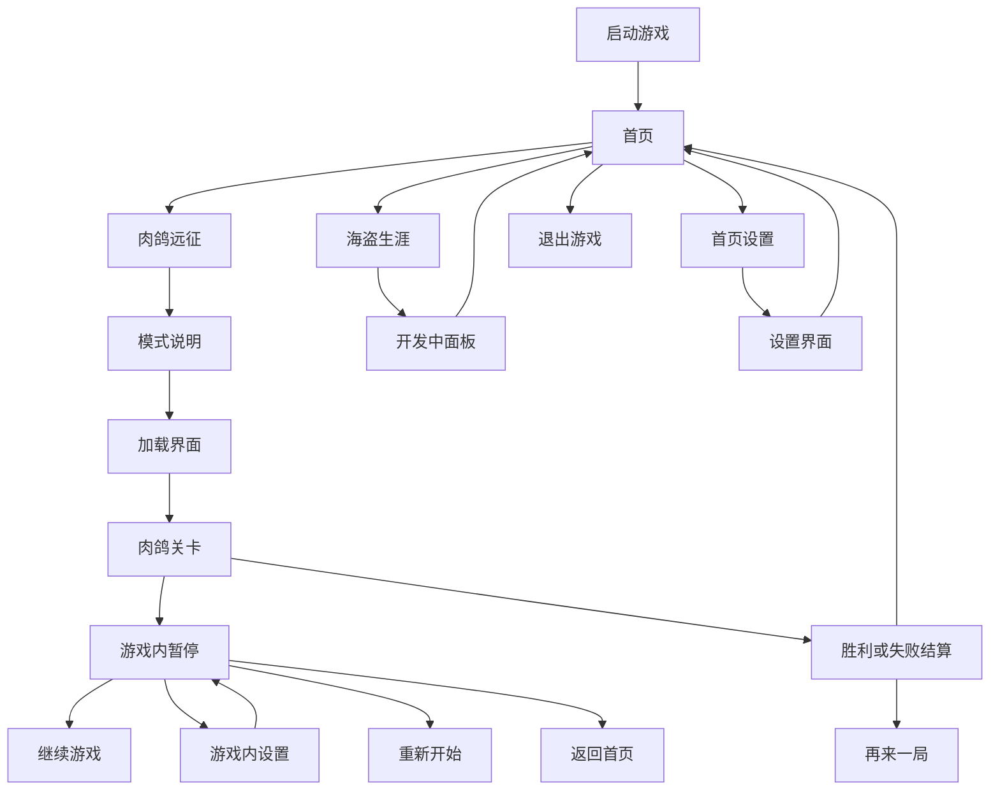
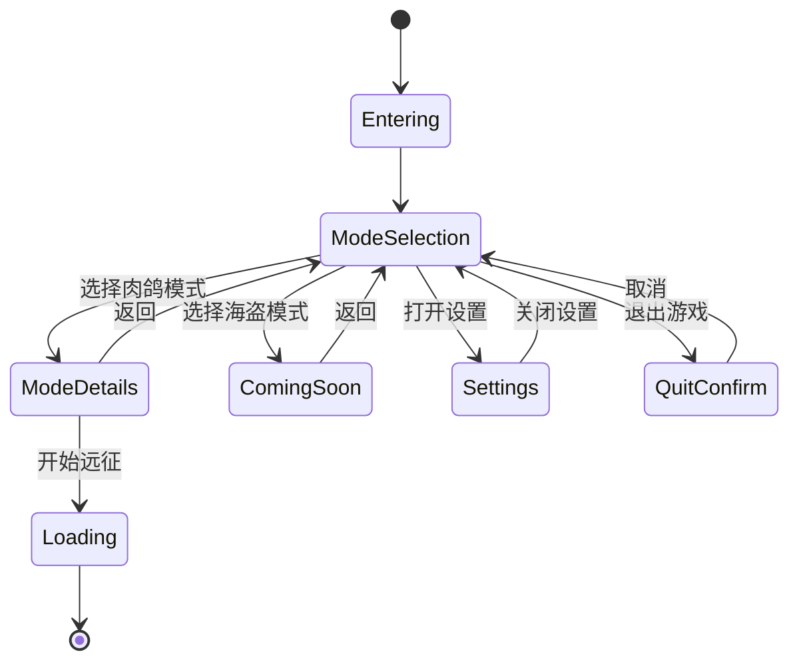

# 《吞吞舰船》首页、玩法入口与设置系统设计文档

> 文档版本：V1.0  
> 配套文档：《吞吞舰船》最小可玩 Demo 实现文档  
> 适用阶段：最小可玩 Demo～正式版本前期  
> 默认引擎：Unity 3D  
> 默认输入：键盘鼠标，预留手柄与移动端适配

---

## 1. 本次设计目标

在现有“吞噬资源—击败敌舰—金币升级—挑战 Boss”的肉鸽玩法之外，建立完整的游戏外层框架：

1. 制作一个能够体现《吞吞舰船》题材和核心卖点的首页。
2. 将当前已经实现的玩法正式命名为“肉鸽玩法”，并在首页提供独立入口。
3. 增加“海盗玩法”入口，当前只提供按钮和开发中说明，不进入实际关卡。
4. 首页增加设置入口。
5. 游戏内增加暂停与设置入口。
6. 设置中包含声音、画面、按键、操控、游戏等分类。
7. 设置界面提供退出功能，并根据首页或游戏内的进入环境给出正确的退出选项。
8. 所有设置能够即时预览、保存、恢复默认，并处理按键冲突。

本次只扩展外层框架，不修改肉鸽玩法的核心战斗循环，也不提前设计海盗玩法的具体系统。

---

## 2. 游戏模式定义

## 2.1 肉鸽玩法

### 定位

当前已经规划的核心模式，也是 Demo 阶段唯一可以正式游玩的模式。

### 首页显示名称

**肉鸽远征**

### 一句话描述

驾驶吞噬舰穿越危险海域，掠夺资源、强化舰体，并在不断升级的敌舰围攻中击沉最终旗舰。

### 模式入口信息

| 字段 | 内容 |
| --- | --- |
| 模式状态 | 可游玩 |
| 状态标签 | `当前开放` |
| 主按钮文字 | `开始远征` |
| 有存档时 | `继续远征` |
| 辅助信息 | 单人、5～8 分钟、局内成长、Boss 战 |
| 主视觉 | 玩家舰船高速航行，左右侧舷齐射，周围有金币和可吞噬目标 |

### 点击行为

无未完成存档时：

1. 点击模式卡。
2. 模式卡放大并打开简要说明面板。
3. 玩家点击“开始远征”。
4. 进入短暂加载页面。
5. 进入肉鸽关卡。

有未完成存档时：

1. 主按钮改为“继续远征”。
2. 说明面板内同时提供“继续远征”和“开始新远征”。
3. 选择开始新远征时弹出覆盖确认。

Demo 如果暂时不支持局中存档，可以取消“继续远征”，每次均显示“开始远征”。界面结构仍预留该能力。

## 2.2 海盗玩法

### 定位

未来新玩法的预告入口。本阶段不制作任何海盗玩法关卡、数值、存档和系统。

### 首页显示名称

**海盗生涯**

### 一句话描述

组建属于自己的海盗舰队，在群岛之间展开掠夺、交易与争霸。

这句话只是氛围预告，不代表当前版本已经确定具体玩法。

### 模式入口信息

| 字段 | 内容 |
| --- | --- |
| 模式状态 | 未开放 |
| 状态标签 | `开发中` |
| 按钮文字 | `查看详情` |
| 是否可点击 | 可以 |
| 是否加载关卡 | 不可以 |
| 主视觉 | 海盗旗、舰队剪影、远处群岛，整体压暗或加锁定遮罩 |

### 点击行为

不建议把海盗入口做成完全无响应的灰色按钮。点击后打开“玩法预告面板”：

- 标题：海盗生涯
- 状态：正在开发
- 描述：新的舰队冒险正在筹备中，后续版本开放。
- 按钮：返回

当前不提供预约、联网公告、倒计时和虚假开放时间。

## 2.3 模式扩展规则

模式入口使用数据驱动，而不是在首页脚本中写死：

```text
GameModeDefinition
├── ModeId
├── DisplayName
├── ShortDescription
├── FeatureTags
├── CoverImage
├── Status
├── SceneName
├── SortOrder
└── IsVisible
```

推荐状态枚举：

```csharp
public enum GameModeStatus
{
    Available,
    ComingSoon,
    Locked,
    Maintenance
}
```

这样后续新增无尽模式、挑战模式、舰队战等入口时，只需要增加配置和对应场景。

---

## 3. 整体界面流程



---

## 4. 首页设计

## 4.1 首页功能构成

首页分为三个层级：

1. 品牌层：游戏 Logo、版本号、背景演出。
2. 核心模式层：肉鸽远征、海盗生涯两张大型模式卡。
3. 系统功能层：设置、退出游戏。

首页不要再添加商店、图鉴、船坞、签到等尚未实现的按钮，避免玩家误以为这些系统已经可用。

## 4.2 推荐布局

### 画面中心

横向排列两张大型模式卡：

- 左侧或中央主位：肉鸽远征，占更大面积，颜色明亮。
- 右侧次位：海盗生涯，尺寸略小或视觉压暗，带“开发中”标签。

肉鸽入口必须是首页视觉焦点，进入首页后默认选中。

### 左上区域

- 游戏 Logo：《吞吞舰船》
- Logo 下方可放一句短标语：`吞下海域，壮大旗舰。`

### 右上区域

- 设置按钮：齿轮图标 + “设置”文字。
- 按钮需要有清晰的悬停和选中状态。

### 左下区域

- 当前版本号，例如 `Demo 0.1.0`。
- 可选：构建编号，只在开发版本显示。

### 右下区域

- 退出游戏按钮。
- 视觉优先级低于模式入口和设置。

## 4.3 首页背景

建议采用实时 3D 港湾或海面背景：

- 玩家基础舰船停靠在画面一侧，船体随水面轻微起伏。
- 海面有缓慢波纹、漂浮木箱、海鸥或远处舰船剪影。
- 摄像机进行非常缓慢的横向移动。
- 选择“肉鸽远征”时，背景转为开阔海域和战斗氛围。
- 选择“海盗生涯”时，背景转向群岛、海盗旗或舰队剪影。

最小 Demo 可以只使用一张静态或轻微动态背景图，但前景按钮布局和状态逻辑必须完整。

## 4.4 首页模式卡组成

```text
ModeCard
├── CoverImage
├── GradientMask
├── StatusTag
├── ModeTitle
├── ShortDescription
├── FeatureTags
├── PrimaryButton
├── LockOrComingSoonMask
└── SelectionEffect
```

每张模式卡至少显示：

- 模式名称
- 一句简短说明
- 状态标签
- 主操作按钮
- 2～4 个玩法标签

不要在卡片上堆放长篇规则。完整说明放在点击后的模式详情面板内。

## 4.5 按钮状态规范

| 状态 | 表现 |
| --- | --- |
| Normal | 正常颜色，无额外描边 |
| Hover | 亮度提高，卡片轻微放大至 1.03 倍 |
| Selected | 外框高亮，背景演出切换，标题区域增强 |
| Pressed | 缩小至 0.97 倍并播放按下音效 |
| Disabled | 降低饱和度，不响应点击 |
| ComingSoon | 可以点击查看说明，但不显示成可正式开始 |

“开发中”与“禁用”必须区分：海盗玩法入口能够被选中和点击，只是不会进入游戏。

## 4.6 首页进入动画

推荐顺序：

1. 背景先淡入，持续 0.4 秒。
2. Logo 从上方轻微落下，持续 0.35 秒。
3. 肉鸽模式卡从左侧进入。
4. 海盗模式卡延迟 0.08 秒从右侧进入。
5. 设置和退出按钮最后淡入。

整体动画应在 0.8～1.2 秒内结束，且玩家可以提前点击跳过等待。

---

## 5. 肉鸽模式详情面板

## 5.1 面板内容

- 模式名称：肉鸽远征
- 模式封面
- 核心说明：吞噬资源、击败敌舰、局内升级、挑战旗舰
- 当前记录：最高舰体等级、最快通关时间、最高金币，可在后续接入
- 主按钮：开始远征或继续远征
- 次按钮：返回

## 5.2 开始新游戏

当不存在未完成对局时，点击开始后直接加载关卡。

当存在未完成对局时：

- “继续远征”加载当前对局。
- “开始新远征”弹出确认框。
- 确认文案：`开始新远征将覆盖当前未完成的进度，是否继续？`
- 按钮顺序：取消、确认开始。

## 5.3 加载界面

最小内容：

- 模式名称
- 舰船航行插画或模型
- 加载进度条
- 一条玩法提示，例如：`用船头吞噬弱小目标，让敌舰进入侧舷射界。`

加载完成后至少停留 0.2 秒再淡出，避免画面闪烁。

---

## 6. 游戏内暂停菜单

## 6.1 打开方式

- 键盘：Esc
- 手柄：Start / Menu
- 移动端预留：首页右上角暂停按钮

打开暂停菜单后：

- `Time.timeScale = 0`
- 停止玩家驾驶、敌人 AI、炮弹、刷怪计时和 Boss 计时。
- UI 动画使用非缩放时间。
- 降低背景音乐音量至正常值的 40%～60%。
- 背景增加半透明暗色遮罩和轻微模糊。

## 6.2 一级暂停菜单

从上到下排列：

1. 继续游戏
2. 设置
3. 重新开始
4. 返回首页
5. 退出游戏

### 继续游戏

- 关闭暂停菜单。
- 恢复时间和输入。
- 避免关闭菜单的同一帧继续读取 Esc 或攻击输入。

### 设置

- 进入游戏内设置界面。
- 关闭设置后返回暂停菜单，不直接恢复游戏。

### 重新开始

- 弹出确认框。
- 文案：`重新开始将放弃本局获得的金币和升级，是否继续？`
- 确认后清理本局对象并重新加载关卡。

### 返回首页

- 弹出确认框。
- 文案：`返回首页将结束当前远征，未保存的本局进度会丢失。`
- 如果后续支持局中存档，文案和行为改为“保存并返回”或“放弃并返回”。

### 退出游戏

- 弹出二次确认。
- 文案：`确定要退出《吞吞舰船》吗？`
- 取消后返回暂停菜单。

## 6.3 暂停菜单 HUD 关系

- 暂停菜单打开时隐藏伤害数字、屏幕边缘敌人提示和临时任务提示。
- 玩家生命、金币和当前时间可以在暗化背景中保留，方便玩家查看状态。
- 升级三选一面板打开时不能再打开暂停菜单。
- 结算界面打开后不能再进入暂停菜单。

---

## 7. 设置系统总结构

设置使用统一 Prefab，首页与游戏内复用同一套内容。

推荐分为以下标签页：

1. 声音
2. 画面
3. 按键
4. 操控
5. 游戏

设置界面固定区域：

```text
SettingsPanel
├── TitleBar
│   ├── Title
│   └── CloseButton
├── CategoryTabs
├── ContentViewport
│   └── CurrentCategoryPage
├── BottomActions
│   ├── RestoreDefaultsButton
│   ├── ApplyButton
│   └── BackButton
└── ContextExitArea
    ├── ReturnToMainMenuButton
    └── QuitGameButton
```

## 7.1 首页与游戏内差异

| 功能 | 首页设置 | 游戏内设置 |
| --- | --- | --- |
| 关闭/返回 | 返回首页 | 返回暂停菜单 |
| 返回首页 | 不显示 | 显示 |
| 退出游戏 | 显示 | 显示 |
| 分辨率修改 | 可用 | 可用，但可能弹出确认 |
| 按键修改 | 可用 | 可用 |
| 背景时间 | 首页背景继续播放 | 游戏世界保持暂停 |

---

## 8. 声音设置

## 8.1 设置项

| 设置项 | 范围 | 默认值 | 说明 |
| --- | ---: | ---: | --- |
| 总音量 | 0～100 | 80 | 控制所有声音 |
| 音乐音量 | 0～100 | 70 | 首页、战斗、Boss 音乐 |
| 音效音量 | 0～100 | 80 | 火炮、爆炸、吞噬、碰撞 |
| 环境音量 | 0～100 | 65 | 海浪、风、海鸥、风暴 |
| UI 音量 | 0～100 | 75 | 点击、悬停、升级提示 |
| 静音 | 开/关 | 关 | 临时静音但保留各滑杆数值 |
| 后台播放 | 开/关 | 关 | 失去窗口焦点时是否播放声音 |

## 8.2 交互规则

- 拖动滑杆时即时预览音量。
- 调整音效音量时，每隔 0.2 秒最多播放一次测试音，避免连续噪声。
- 静音不应把各分类数值改成 0。
- 恢复默认只恢复当前标签页，长按或二次确认后可恢复全部设置。
- 使用 Unity `AudioMixer` 分组控制，不直接遍历所有 AudioSource。

推荐混音分组：

```text
Master
├── Music
├── SFX
│   ├── Weapon
│   ├── Impact
│   └── Devour
├── Ambience
└── UI
```

---

## 9. 画面设置

## 9.1 设置项

| 设置项 | 建议选项 | 默认值 |
| --- | --- | --- |
| 显示模式 | 全屏、无边框窗口、窗口 | 无边框窗口 |
| 分辨率 | 读取设备支持列表 | 当前桌面分辨率 |
| 垂直同步 | 关、开 | 开 |
| 帧率上限 | 30、60、120、无限制 | 60 |
| 画质预设 | 低、中、高、自定义 | 高 |
| 阴影质量 | 关、低、中、高 | 中 |
| 特效质量 | 低、中、高 | 高 |
| 水面质量 | 低、中、高 | 中 |
| 抗锯齿 | 关、FXAA、SMAA | SMAA |
| 后处理 | 开、关 | 开 |
| 屏幕震动 | 0～100 | 70 |

## 9.2 应用规则

- 音量和操控设置即时生效。
- 分辨率、显示模式、画质预设可通过“应用”按钮统一生效。
- 修改分辨率后弹出 10 秒确认倒计时。
- 玩家未确认时自动恢复上一组分辨率和显示模式。
- 画质预设变化后允许玩家再修改单项，此时预设显示为“自定义”。

水面质量应主要控制反射、法线层数、泡沫和远景效果，不要让低画质版本完全失去海面识别度。

---

## 10. 按键设置

## 10.1 默认按键

| 操作 | 主按键 | 备用按键 |
| --- | --- | --- |
| 前进/加速 | W | 上方向键 |
| 减速/倒船 | S | 下方向键 |
| 左转舵 | A | 左方向键 |
| 右转舵 | D | 右方向键 |
| 主动技能 | Space | 鼠标侧键 1 |
| 暂停 | Esc | 无 |
| UI 确认 | Enter | Space |
| UI 返回 | Esc | Backspace |

## 10.2 重绑定流程

1. 点击某个操作的按键框。
2. 按键框进入等待状态，显示“请按下新按键”。
3. 玩家按下新按键后检查冲突。
4. 无冲突则立即显示新按键。
5. 有冲突则显示冲突弹窗。

冲突弹窗提供：

- 交换按键
- 取消修改

不建议默认允许两个核心操作使用同一个键。

## 10.3 限制规则

- Esc 始终可以取消重绑定。
- 禁止把系统保留键和纯修饰键设为单独操作键。
- “暂停”和“UI 返回”至少保留一个有效绑定。
- 提供“恢复默认按键”。
- UI 中按键图标应根据最后使用的设备自动切换为键鼠或手柄图标。

推荐使用 Unity Input System 的 `InputActionAsset` 和交互式重绑定，而不是自行监听所有 `KeyCode`。

---

## 11. 操控设置

“按键”决定按什么，“操控”决定舰船和镜头对输入的响应方式，两者必须分开。

## 11.1 设置项

| 设置项 | 范围 | 默认值 | 作用 |
| --- | ---: | ---: | --- |
| 转向灵敏度 | 50～150% | 100% | 调整舵输入强度，不突破最大物理转向上限太多 |
| 油门输入灵敏度 | 50～150% | 100% | 调整加速达到目标值的速度 |
| 摄像机跟随强度 | 50～150% | 100% | 数值高时镜头更紧跟舰船 |
| 摄像机速度前瞻 | 0～100% | 70% | 控制镜头向船头方向偏移量 |
| 镜头震动 | 0～100% | 70% | 与画面页同一配置，不重复保存 |
| 手柄震动 | 开/关 | 开 | 只在手柄连接时显示 |
| 左右转向反转 | 开/关 | 关 | 辅助选项 |
| 按住前进 | 按住、切换 | 按住 | 切换模式可持续保持油门 |
| 自动侧舷开火 | 开/关 | 开 | Demo 核心规则，关闭后武器停止自动射击 |
| 瞄准辅助强度 | 0～100% | 100% | 影响自动武器目标宽容度 |

## 11.2 注意事项

- 转向灵敏度不能让玩家通过设置绕过船体重量和转弯半径设计。
- “自动侧舷开火”默认开启。若关闭，需要显示提示，避免玩家误以为武器失效。
- 摄像机设置改变时，背景预览船应立刻移动，方便玩家观察差异。
- 设置界面不应直接暴露加速度、侧滑系数等开发参数。

---

## 12. 游戏设置与辅助功能

## 12.1 设置项

| 设置项 | 选项 | 默认值 |
| --- | --- | --- |
| 语言 | 简体中文、后续支持语言 | 简体中文 |
| 伤害数字 | 全部、仅暴击、关闭 | 全部 |
| 金币数字 | 开、关 | 开 |
| 教学提示 | 开、关 | 开 |
| 屏幕边缘敌人提示 | 开、关 | 开 |
| 高威胁目标轮廓 | 开、关 | 开 |
| 字体大小 | 小、中、大 | 中 |
| 色弱模式 | 关闭、红绿、蓝黄 | 关闭 |
| 自动暂停 | 失去焦点时开、关 | 开 |

Demo 阶段至少实现：语言占位、伤害数字、教学提示、字体大小和自动暂停。

---

## 13. 退出功能设计

## 13.1 首页退出游戏

入口位置：

- 首页右下角“退出游戏”。
- 首页设置界面底部“退出游戏”。

点击后统一弹出确认框：

```text
确定退出游戏？
当前设置已经保存。

[取消] [退出游戏]
```

## 13.2 游戏内退出

游戏内设置提供两个退出方向：

### 返回首页

- 结束当前对局。
- 释放关卡对象和对象池活动实例。
- 恢复 `Time.timeScale = 1`。
- 加载首页场景。

确认文案：

```text
返回首页将结束当前远征。
本局尚未结算的进度不会保留。

[取消] [返回首页]
```

### 退出游戏

- 直接关闭游戏程序。
- 退出前保存设置和允许保存的统计数据。
- 不保存当前肉鸽局的临时金币和升级，除非后续明确加入局中存档。

确认文案：

```text
确定退出游戏？
当前远征将结束。

[取消] [退出游戏]
```

## 13.3 编辑器与正式包差异

Unity 编辑器中 `Application.Quit()` 不会真正退出，需要在开发环境单独处理停止播放；正式构建只调用正常退出流程。

---

## 14. 设置保存规则

## 14.1 保存时机

- 滑杆、开关和按键修改后先写入内存中的临时设置。
- 点击“应用”或“返回”时保存。
- 关闭游戏前再次保存。
- 程序异常退出时允许损失本次未应用修改。

## 14.2 保存方式

Demo 可使用：

- `PlayerPrefs` 保存简单数值。
- Input System 保存按键重绑定 JSON。

正式版本建议使用独立 `SettingsData.json`：

```text
SettingsData
├── Version
├── AudioSettings
├── DisplaySettings
├── ControlSettings
├── GameplaySettings
└── InputBindingOverrides
```

## 14.3 安全规则

- 配置文件缺失时创建默认配置。
- 配置文件字段缺失时只补缺失字段，不清空全部设置。
- 配置值超出合法范围时进行 Clamp。
- 设置数据版本升级时执行迁移。
- 不把本局金币、生命和升级写入设置文件。

---

## 15. UI 层级结构

## 15.1 首页场景层级

```text
MainMenuScene
├── MainMenuManager
├── BackgroundRoot
│   ├── OceanBackground
│   ├── PlayerShipPreview
│   ├── DistantShips
│   └── AmbientVFX
├── MainCamera
├── EventSystem
└── MainMenuCanvas
    ├── SafeArea
    │   ├── LogoArea
    │   ├── ModeSelectionArea
    │   │   ├── RoguelikeModeCard
    │   │   └── PirateModeCard
    │   ├── TopRightActions
    │   │   └── SettingsButton
    │   ├── BottomLeftInfo
    │   │   └── VersionText
    │   └── BottomRightActions
    │       └── QuitButton
    ├── ModeDetailPanel
    ├── ComingSoonPanel
    ├── SettingsPanel
    ├── ConfirmDialog
    ├── LoadingOverlay
    └── ScreenTransition
```

## 15.2 游戏内 UI 层级

```text
GameCanvas
├── HUD
├── UpgradeSelectionPanel
├── PauseButton_MobileReserved
├── PauseMenu
│   ├── ResumeButton
│   ├── SettingsButton
│   ├── RestartButton
│   ├── ReturnMainMenuButton
│   └── QuitGameButton
├── SettingsPanel
├── ConfirmDialog
├── ResultPanel
└── ScreenTransition
```

设置面板和确认框制作成独立 Prefab，首页与游戏内共用，不复制两套逻辑。

---

## 16. 主要脚本职责

| 脚本 | 职责 |
| --- | --- |
| `MainMenuManager` | 首页状态、模式选择、面板切换和场景进入 |
| `GameModeCard` | 显示模式数据和处理卡片状态 |
| `GameModeDefinition` | 模式名称、描述、封面、状态和场景配置 |
| `PauseMenuController` | 暂停、恢复、重开、返回首页、退出 |
| `SettingsManager` | 加载、暂存、应用、保存和恢复设置 |
| `SettingsPanelController` | 设置标签页和上下文按钮显示 |
| `AudioSettingsController` | AudioMixer 参数与试听反馈 |
| `DisplaySettingsController` | 分辨率、窗口、帧率与画质 |
| `InputRebindController` | 按键重绑定、冲突检查和覆盖保存 |
| `ControlSettingsController` | 舰船输入和摄像机参数倍率 |
| `ConfirmDialogController` | 统一确认弹窗，返回确认结果 |
| `SceneTransitionController` | 淡入淡出和异步场景加载 |
| `UISelectionManager` | 键鼠/手柄切换后的默认焦点与导航 |

不要让按钮直接调用多个全局单例。按钮只通知所属 Controller，由 Controller 决定流程。

---

## 17. 主菜单状态机



任何时刻最多只允许一个主弹窗接收输入。确认框打开后，下面的设置或模式面板必须停止交互。

---

## 18. UI 输入与导航

## 18.1 键鼠

- 鼠标悬停更新选中状态。
- 左键确认。
- Esc 返回上一层或关闭当前弹窗。
- 设置滑杆支持鼠标拖动和方向键微调。

## 18.2 键盘与手柄导航

- 首页默认焦点为“肉鸽远征”。
- 模式卡左右导航。
- 设置标签上下或左右导航保持一致。
- 每个弹窗打开时主动指定默认焦点。
- 弹窗关闭时恢复到之前的按钮，而不是跳回页面第一个按钮。

## 18.3 输入设备切换

- 最后一次有效输入来自鼠标时显示鼠标悬停状态。
- 来自键盘或手柄时显示明确焦点框。
- 切换设备不弹提示，不中断当前页面。
- 手柄断开时显示一次轻提示，并自动允许键鼠继续操作。

---

## 19. 分辨率与安全区

- 主要按 16:9 横屏设计。
- 最低验证分辨率：1280×720。
- 标准验证分辨率：1920×1080。
- 同时验证 16:10、21:9，不允许模式卡被裁切。
- 使用 SafeArea 根节点，为后续移动端异形屏预留。
- 超宽屏只扩展背景，不横向拉散核心按钮。
- 设置内容较多时使用 ScrollRect，底部“应用/返回/退出”区域固定不滚动。

---

## 20. 音效与动画反馈

| 事件 | 音效 | 动画 |
| --- | --- | --- |
| 模式卡悬停 | 轻微木板/水滴音 | 放大、边框亮起 |
| 选择肉鸽模式 | 短促号角 | 卡片前移、背景转向战斗海域 |
| 选择海盗模式 | 海盗旗抖动音 | 遮罩掀开后显示开发中 |
| 普通按钮点击 | 短促确认音 | 0.97 倍按压 |
| 设置滑杆 | 轻微刻度音 | 数值即时变化 |
| 退出警告 | 低沉提示音 | 确认框快速弹出 |
| 开始加载 | 船笛或启航音 | 全屏海浪过渡 |

UI 动效使用统一时长：

- 悬停：0.08～0.12 秒
- 按压：0.06～0.1 秒
- 普通弹窗：0.18～0.25 秒
- 页面切换：0.25～0.4 秒
- 场景淡入淡出：0.35～0.6 秒

---

## 21. 实现顺序

## 阶段 1：首页灰盒

- 创建首页场景。
- 放置 Logo、两张模式卡、设置和退出按钮。
- 完成卡片选择、悬停、点击和返回。
- 肉鸽入口能够加载现有 Demo 场景。
- 海盗入口打开开发中面板。

验收：玩家不需要说明就能分辨哪个模式可玩、哪个仍在开发。

## 阶段 2：暂停和基础退出

- 游戏内按 Esc 暂停。
- 实现继续、设置、重新开始、返回首页、退出游戏。
- 所有破坏当前对局的操作增加确认框。
- 检查退出后时间缩放恢复。

验收：连续进入关卡、返回首页、再次进入不会出现时间停止或 UI 重复。

## 阶段 3：设置框架

- 制作设置通用 Prefab。
- 完成标签页、应用、返回和恢复默认。
- 根据首页/游戏内上下文显示不同退出按钮。
- 完成设置数据加载与保存。

## 阶段 4：声音和画面

- 接入 AudioMixer。
- 实现音量与静音。
- 实现分辨率、窗口模式、帧率和基础画质。
- 完成分辨率倒计时恢复。

## 阶段 5：按键和操控

- 接入 Input System 重绑定。
- 完成冲突检查和默认恢复。
- 将转向、摄像机、震动等配置接入游戏。
- 验证键鼠和手柄 UI 导航。

## 阶段 6：美术和体验打磨

- 替换模式卡和首页背景。
- 添加页面切换、按钮状态、音效和加载过渡。
- 完成不同分辨率和安全区适配。
- 补齐错误处理与无存档状态。

---

## 22. 验收清单

### 首页

- [ ] 启动游戏后默认选中肉鸽远征。
- [ ] 肉鸽玩法明确显示为当前开放。
- [ ] 海盗玩法明确显示为开发中。
- [ ] 点击海盗玩法有说明反馈，但不会加载空场景。
- [ ] 设置和退出游戏按钮容易找到，但不抢模式入口焦点。
- [ ] 返回首页后不会重复播放过长开场动画。

### 肉鸽入口

- [ ] 点击开始可以进入现有肉鸽 Demo。
- [ ] 加载期间不会重复点击并加载多个场景。
- [ ] 有存档与无存档时按钮文字正确。
- [ ] 开始新游戏覆盖旧进度前有确认。

### 暂停

- [ ] Esc 能稳定打开和关闭暂停菜单。
- [ ] 暂停后敌人、炮弹、刷怪和计时均停止。
- [ ] 设置关闭后返回暂停菜单，不直接恢复战斗。
- [ ] 返回首页后 `Time.timeScale` 恢复为 1。
- [ ] 升级选择和结算期间不能重复打开暂停菜单。

### 设置

- [ ] 首页和游戏内使用同一套设置数据。
- [ ] 调整音量时可以即时试听。
- [ ] 重启游戏后设置仍然生效。
- [ ] 恢复默认不会影响游戏存档。
- [ ] 按键冲突会提示，不能静默覆盖。
- [ ] 分辨率未确认时能够自动恢复。
- [ ] 首页设置和游戏内设置都有退出游戏入口。

### 退出

- [ ] 重新开始前有确认。
- [ ] 返回首页前有确认。
- [ ] 退出游戏前有确认。
- [ ] 取消确认后回到正确页面和正确焦点。
- [ ] 退出或返回前保存已应用设置。

### 适配

- [ ] 1280×720 下所有文字和按钮可见。
- [ ] 21:9 下核心 UI 不被拉到屏幕边缘。
- [ ] 键鼠和手柄都能完成全部菜单操作。
- [ ] 不使用鼠标也能从任何子页面返回。

---

## 23. Demo 最终首页应呈现的状态

玩家启动游戏后，首先看到海面与自己的吞噬舰。画面中央有两个清晰的大入口：

- **肉鸽远征**：明亮、动态、标记“当前开放”，点击后可以开始现有玩法。
- **海盗生涯**：带海盗旗和舰队剪影，标记“开发中”，点击后显示玩法正在制作的说明。

右上角可以进入完整设置，右下角可以退出游戏。进入肉鸽关卡后，玩家随时可以通过 Esc 暂停，继续游戏、调整设置、重新开始、返回首页或退出程序。

这个结构已经能够支撑当前最小 Demo，也为后续真正增加海盗玩法和更多模式保留稳定的扩展位置。
