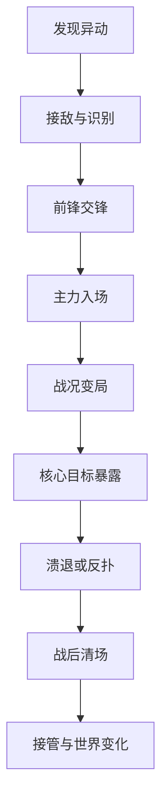

# 《吞吞舰船》世界战斗事件、占领战、增援节奏与战场表现完整重构文档

> 文档版本：V1.0  
> 对应模式：海盗生涯长期世界、方形小海域扩张、板块核心战、港口防守  
> 文档性质：独立增量设计，不修改任何旧文档  
> 核心目标：让地图上的战斗真正形成“舰队交锋过程”，解决敌人少、战斗结束过快、占领地区缺少战场感、事件彼此相似的问题  
> 推荐实现环境：Unity 3D  

---

# 第一部分：本文与旧规则的关系

## 0.1 继续保留的规则

本文继续保留以下既有规则：

- 世界采用35×35个48米领海方格。
- 每5×5个领海方格组成一个主题板块。
- 普通小格负责高频扩张，板块核心负责阶段性大型战斗。
- 初始领土为中心3×3方格。
- 固定挑战区永久存在，不可占领、不可建造。
- 战斗发生在无缝世界，不加载独立战斗场景。
- 水面生产区本身不阻挡航行。
- 地基、码头、炮塔、墙体、残骸等实体参与导航阻挡。
- 舰船使用战略航线、区域路径、局部避碰和船体操舵四层寻路。
- 冲撞舟、炮艇、鱼雷艇、布雷艇、维修艇等继续使用各自战术AI。
- 已有74类敌人、12类精英机制、24只Boss及其攻击方式不重做。
- 敌方W3以上攻击必须有明确告知、预警和稳定反制。
- 功能船、商船、军舰和英雄主舰都需要真实出航、返港、靠泊与补给。
- 港口防守中地基与建筑可以被击毁，战后恢复原布局并结算战损。
- 船长位不释放普攻和主动技能；四个作战英雄继续对应舰船战斗能力。
- 不把战斗延长建立在无意义的超高血量上。

## 0.2 本文正式补充的内容

本文新增并统一：

1. 世界战斗事件强度分级。
2. 占领战的完整阶段结构。
3. 战斗事件导演与敌方兵力预算。
4. 首批接敌、预备队、战区增援和最后反扑。
5. 战斗持续时间、目标击杀时间和场面密度基准。
6. 普通格、战略格、板块核心格的不同战斗长度。
7. 36类可复用世界战斗事件模板。
8. 12个主题板块的专属事件包。
9. 战况变化、撤退、投降、俘获、打捞和接管流程。
10. 炮火、水柱、残骸、燃烧、求援、友军支援等战场表现。
11. HUD、镜头、音效、战报和地图热点。
12. Unity数据结构、状态机、性能LOD和验收标准。

## 0.3 本文解决的核心问题

当前主要问题不是敌人数量不足，而是敌人没有被组织成战斗。

典型问题：

- 敌人在目标附近一次性生成。
- 玩家靠近后一轮英雄技能就全部清除。
- 没有远处舰影、增援航迹、撤退舰和预备队。
- 敌方不会换阵、抢救、补给、拖延或反扑。
- 占领事件只有“杀光附近敌人”一个步骤。
- 战斗结束后海面立刻恢复干净。
- 玩家没有看到敌我两支舰队真正形成战线。
- 大量敌人同时出现时只会拥挤追逐，反而没有战术。
- 为延长战斗直接增加生命，形成站桩刮痧。
- 小格战和板块核心战在体感上只是敌人数值不同。

---

# 第二部分：新版战斗事件体验目标

## 1. 一句话体验

玩家进入敌对海域后，不是清理一堆静止目标，而是逐步卷入一场会集结、交锋、增援、破阵、撤退并留下真实战场痕迹的海上战斗。

## 2. 玩家必须能直接观察到的变化

每场标准战斗至少让玩家看到以下六项中的四项：

- 敌方巡逻或前锋先接敌。
- 远处增援从真实方向驶来。
- 敌舰根据舰种拉距、冲锋、绕侧或布雷。
- 某个战术目标被破坏后敌方阵型发生变化。
- 己方守卫舰或临时盟友加入战斗。
- 受损敌舰撤退、求援、搁浅或投降。
- 海面留下燃烧残骸、漂浮货物、油污与救生艇。
- 工程船和信标船在炮火结束后进场接管。

## 3. 战斗不能只靠加血延长

延长战斗的优先顺序：

```text
多阶段目标
→ 不同方向增援
→ 敌方换阵与撤退
→ 模块/护航关系
→ 环境和航线变化
→ 最后才是适度提高耐久
```

禁止：

- 普通小艇需要连续攻击30秒才死亡。
- 同一波敌人全部获得巨额减伤。
- 玩家造成高伤后敌人临时作弊加血。
- 战斗未达到目标时长就强行锁血。
- 清完敌人后无来源地凭空刷新同一批敌人。
- 通过大量控制让玩家不能行动来拖时间。

## 4. 战斗节奏的三条基本线

每场战斗同时存在：

| 节奏线 | 内容 | 作用 |
| --- | --- | --- |
| 操作节奏 | 转向、躲避、撞击、技能、目标切换 | 保持驾驶参与 |
| 战术节奏 | 破阵、切后排、阻止增援、夺取目标 | 形成阶段变化 |
| 场面节奏 | 舰队进入、炮火增强、残骸累积、敌军溃退 | 形成战争感 |

只有操作节奏，没有战术和场面变化，会变成快速清怪。

---

# 第三部分：世界战斗事件分级

## 5. 六级事件强度

| 等级 | 名称 | 推荐总时长 | 活跃敌人 | 总参与敌人 | 主要用途 |
| ---: | --- | ---: | ---: | ---: | --- |
| E0 | 无战斗接管 | 10～40秒 | 0 | 0 | 平静水面、普通信标 |
| E1 | 短促冲突 | 60～120秒 | 3～6 | 4～10 | 普通巡逻、海兽骚扰 |
| E2 | 标准遭遇 | 2.5～4分钟 | 6～10 | 10～20 | 补给线、救援、资源争夺 |
| E3 | 标准占领战 | 5～8分钟 | 8～14 | 18～36 | 战略设施、敌方据点 |
| E4 | 大型攻坚战 | 8～14分钟 | 10～18 | 30～60 | 船厂、炮港、板块外围核心 |
| E5 | 板块核心战 | 12～20分钟 | 12～20 | 40～90 | 板块控制核心、大型舰队战 |

说明：

- “总参与敌人”包括分批进入、撤退和增援，不等于同屏数量。
- E3以上才要求完整的多阶段战斗。
- 普通小格仍有大量E0和E1，避免扩张全部拖长。
- E5推荐包含Boss，但Boss不是全程唯一目标。

## 5.1 小格接管比例修订

保留旧版“不是每格都打Boss”的原则，调整为：

| 接管类型 | 建议占比 | 典型强度 | 推荐时长 |
| --- | ---: | --- | ---: |
| 平静水面 | 28% | E0 | 10～20秒 |
| 资源勘测 | 22% | E0～E1 | 30～100秒 |
| 小型冲突 | 24% | E1～E2 | 1～4分钟 |
| 战略设施 | 13% | E2～E3 | 3～8分钟 |
| 板块核心外围 | 9% | E3～E4 | 5～12分钟 |
| 剧情或稀有格 | 4% | 可变 | 1～15分钟 |

变化目标：

- 战斗小格从20%提高到24%。
- 战略与核心外围从17%提高到22%。
- 仍保留50%的平静、勘测和轻事件，保证扩张速度。

## 5.2 同一连续游玩段的强度安排

连续接管5个小格时，推荐组合：

```text
E0平静
→ E1短冲突
→ E0/E1勘测
→ E2标准遭遇
→ E3战略占领
```

禁止连续生成：

- 三场E3以上事件。
- 两场完全相同的敌人编队。
- 两场同样以“守住信标”为唯一目标的事件。
- 前一场刚使用雷区，后一场再次以雷区为主机制。

---

# 第四部分：战斗事件统一状态机

## 6. 九阶段事件流程

所有E2以上战斗使用：



| 阶段 | 推荐占比 | 主要作用 |
| --- | ---: | --- |
| 发现异动 | 5% | 让战斗有来源和方向 |
| 接敌与识别 | 8% | 展示敌人职责，不立即满屏 |
| 前锋交锋 | 17% | 第一轮可读战术 |
| 主力入场 | 22% | 形成舰队交锋场面 |
| 战况变局 | 18% | 增援、天气、模块、友军变化 |
| 核心目标暴露 | 18% | 明确收束目标 |
| 溃退或反扑 | 7% | 战果可见，避免突然清空 |
| 战后清场 | 3% | 残骸、打捞、救援 |
| 接管变化 | 2% | 旗帜、边界、工程船 |

## 6.1 E1短冲突简化流程

```text
发现
→ 单一敌人职责教学
→ 1次小变局
→ 溃退或清场
```

E1不需要：

- 大型增援。
- 多点目标。
- Boss阶段。
- 复杂战场机关。

## 6.2 E3标准占领强制内容

每场E3至少包含：

1. 一个外围敌人编队。
2. 一个实体战术目标。
3. 一批有来源的增援。
4. 一次战况变化。
5. 一个可被玩家主动加速的收束条件。
6. 接管信标或工程船的可见进场。

## 6.3 E4与E5强制内容

每场E4/E5至少包含：

- 两条可选择的进攻路线。
- 两个可破坏的敌方能力来源。
- 一次己方支援或临时盟友事件。
- 两次不同类型的敌军增援。
- 一次敌军重整或阶段反扑。
- 一个大型单位、精英或Boss。
- 一个明确的战后世界改变。

---

# 第五部分：战斗事件导演

## 7. `WorldCombatEventDirector`职责

事件导演负责：

- 选择事件模板。
- 计算敌方兵力预算。
- 分配首批、主力、预备队和追击队。
- 预约攻击危险点。
- 选择增援来源与入场路线。
- 控制同屏敌人和特效预算。
- 监控玩家输出是否导致战斗过快或过慢。
- 触发战况变局，但不临时作弊改变敌人属性。
- 安排撤退、投降、俘获和战后清场。
- 把远景代理转换为近景真实单位。

## 8. 事件导演与攻击导演的关系

| 系统 | 管理范围 |
| --- | --- |
| `WorldCombatEventDirector` | 整场战斗阶段、兵力和事件 |
| `EnemyAttackDirector` | 当前同屏敌人的攻击许可与危险预算 |
| `FleetTacticalCoordinator` | 编队、目标分配、侧翼、撤退 |
| `SeamlessEncounterManager` | 软战区、参与者、脱战、跨格增援 |
| `RegionCaptureManager` | 占领进度、信标、工程船、边界变化 |

事件导演不能直接命令所有敌人使用技能；它只提供阶段意图和职责需求。

## 9. 战斗强度曲线

标准E3强度：

```text
20% 发现
→ 45% 前锋交锋
→ 70% 主力入场
→ 55% 短暂重整
→ 85% 战况变局
→ 100% 核心反扑
→ 40% 溃退
→ 0% 清场
```

原则：

- 高峰之间必须有6～15秒可感知的转场或输出窗口。
- 低谷不是完全没有敌人，而是重击减少、敌军换阵或受损撤退。
- E3以上不能从头到尾保持同一敌人数和同一攻击频率。

## 10. 防止战斗过快的合法方法

当玩家高爆发导致阶段过快时，下一阶段可以：

- 提前让已经存在的预备队入场。
- 让指挥舰停止撤离并组织反扑。
- 开放新的实体炮台或船坞出口。
- 让大型舰解除停泊并加入战斗。
- 把原本远处巡逻队改道支援。
- 让幸存敌舰收拢为防御阵型。

不允许：

- 已死亡敌人原地复活。
- 凭空生成与世界无关的敌人。
- 给剩余敌人瞬间增加最大生命。
- 临时提高玩家无法看见的减伤。
- 锁住核心血条等待时间结束。

## 11. 防止战斗过慢

若玩家长时间无法推进：

- 敌方重击频率下降10%～20%。
- 暴露一个次要弱点或可破坏弹药仓。
- 己方侦察给出目标建议。
- 远处守卫舰提供一次支援齐射。
- 敌方维修资源耗尽，维修能力自然停止。
- 允许玩家撤退并保留已摧毁外围设施。

不自动降低：

- 敌人当前生命。
- Boss已释放技能的伤害。
- 已经选择的难度等级。

---

# 第六部分：敌方兵力结构

## 12. 一场战斗的五层兵力

| 层级 | 占总预算 | 作用 | 常见单位 |
| --- | ---: | --- | --- |
| 警戒前锋 | 10%～15% | 发现、拖延、报信 | 哨船、侦察艇、小鲨群 |
| 战斗主力 | 35%～45% | 构成主要交锋 | 炮艇、冲撞艇、鱼雷艇 |
| 战术支援 | 10%～20% | 维修、护盾、烟雾、牵引 | 维修艇、护盾艇、鱼叉舰 |
| 区域预备队 | 20%～30% | 第二阶段增援 | 船厂小舟、大型舰、猎群 |
| 指挥/核心 | 10%～20% | 阶段收束 | 指挥舰、精英、大型海怪 |

## 12.1 敌人不能只是数量堆积

每个编队必须有：

- 一个主要威胁。
- 一个配合关系。
- 一个玩家优先目标。
- 一条可观察的阵型变化。

示例：

```text
2艘撒网舟在前方封路
+ 4艘冲撞舟从两翼申请冲锋走廊
+ 1艘信号舟在后方呼援
```

玩家可以：

- 先毁信号舟减少下一批敌人。
- 清网后拉出冲撞走廊。
- 引导冲撞舟撞击同伴。

## 13. 同屏单位密度

推荐近景完整AI上限：

| 事件等级 | 小型 | 中型 | 大型/Boss | 己方舰 | 总活跃战斗单位 |
| ---: | ---: | ---: | ---: | ---: | ---: |
| E1 | 3～6 | 0～1 | 0 | 1～3 | 5～10 |
| E2 | 5～9 | 1～3 | 0～1 | 2～5 | 9～16 |
| E3 | 6～11 | 2～4 | 0～1 | 3～7 | 12～22 |
| E4 | 7～12 | 3～6 | 1～2 | 4～9 | 16～28 |
| E5 | 8～14 | 4～7 | 1～3 | 5～12 | 20～34 |

说明：

- 超出近景上限的敌人以远景航迹、简化舰影或战略代理存在。
- 只有获得入场令牌后才转换为完整AI。
- 玩家能看到远处还有敌人，但不会让CPU同时模拟全部炮弹和寻路。

## 14. 敌方入场队列

预备队状态：

```text
远景存在
→ 接到支援信号
→ 选择航线
→ 远景航行
→ 进入战区可见范围
→ 编队展开
→ 获得攻击许可
```

增援必须来自：

- 敌方船厂。
- 板块核心泊位。
- 相邻敌对方格。
- 正在运行的巡逻航线。
- 海怪巢穴。
- 水下潜伏点。
- 世界边缘的阵营舰队。

不得在玩家镜头边缘无来源地瞬间生成。

---

# 第七部分：目标击杀时间与耐久规则

## 15. 单位目标击杀时间

以同阶段正常装配、单主舰持续有效输出计算：

| 单位 | 目标击杀时间 |
| --- | ---: |
| 可吞噬微型单位 | 0.5～2秒 |
| 普通小舟 | 4～8秒 |
| 强化小舟 | 7～12秒 |
| 中型敌舰 | 15～28秒 |
| 支援舰 | 12～22秒 |
| 大型敌舰 | 35～70秒 |
| 精英舰 | 55～110秒 |
| 板块核心单阶段 | 60～150秒 |
| Boss完整战 | 4～9分钟 |

多人或多舰集火时，击杀可更快，但事件通过新目标和阵型变化继续推进。

## 15.1 小型敌人的价值

小型敌人不靠生命制造存在感，而通过：

- 成群航迹。
- 分批齐射。
- 冲撞走廊。
- 护送、侦察、报信。
- 爆破、撒网、拾荒。
- 被吞噬后的资源与连锁反馈。

小型敌人应快速死亡，但它们的队形和行为要让玩家看见。

## 15.2 中大型敌人的耐久来源

耐久优先来自：

- 舰首、侧舷、舰尾不同受击面。
- 可破坏武器模块。
- 护卫舰提供的外部保护。
- 维修舰有限的维修库存。
- 大型船体分舱。
- 阶段性失衡与弱点窗口。

不使用长期全身无敌。

## 16. 维修和护盾限制

为避免战斗无限拖延：

- 普通维修艇每场只有2～4次完整维修库存。
- 护盾艇被击破节点后需要8～15秒重连。
- 大型补给舰维修库存耗尽后转为普通火力舰。
- Boss回复必须来自可破坏来源。
- 同一目标每20秒最多接受一次强维修。
- 玩家能从外观和UI看见剩余维修能力。

---

# 第八部分：增援、撤退与反扑

## 17. 增援触发类型

| 类型 | 触发 | 玩家可阻止方式 |
| --- | --- | --- |
| 无线电增援 | 信号舟完成呼叫 | 击毁信号舟、干扰通讯 |
| 船厂增援 | 船厂生产周期完成 | 摧毁生产舱、封锁出口 |
| 航线增援 | 巡逻队改道 | 伏击航线、切断浮标 |
| 核心预备队 | 核心生命/控制力阈值 | 提前侦察并破坏泊位 |
| 海兽呼群 | 鲸鸣、血迹、巢穴警报 | 打断叫声、清除诱饵 |
| 相邻区域支援 | 高警戒持续一定时间 | 快速完成目标、切通讯 |

## 17.1 增援的可见时间

| 距离 | 提前显示 |
| --- | ---: |
| 近距离泊位 | 5～10秒 |
| 当前方格边缘 | 8～15秒 |
| 相邻方格 | 15～35秒 |
| 远程世界舰队 | 30～90秒 |

显示内容：

- 方向。
- 舰队轮廓。
- 预计抵达时间。
- 已知舰种。
- 增援来源。
- 是否可拦截。

## 18. 敌方撤退

敌人不应全部战斗到沉没。

撤退条件：

- 指挥单位死亡。
- 编队损失超过55%～75%。
- 维修库存耗尽。
- 核心设施被夺取。
- 逃生航线仍存在。
- 敌方性格允许撤退。

撤退行为：

- 烟雾舟掩护。
- 健康舰断后。
- 受损舰排在中间。
- 拾荒艇尝试带走重要货物。
- 指挥舰可能留下水雷。
- 海兽脱离后潜入深水。

玩家选择：

- 放任撤退，快速接管。
- 追击获取额外奖励。
- 切断路线迫使投降。
- 优先救援失去动力的己方船。

## 19. 最后反扑

E3以上战斗不必每场都有狂暴，但可从以下选择一项：

- 核心指挥舰解除锚定。
- 船厂把未完成舰体作为爆破筏推出。
- 敌人引爆弹药仓制造撤退火线。
- 大型海兽被炮火惊醒并攻击双方。
- 敌方精英带残部楔形冲锋。
- 残余炮塔切换为手动过载射击。
- 风暴改变安全航线。

最后反扑持续20～60秒，必须有明确结束条件。

---

# 第九部分：领土占领战完整重构

## 20. 占领不是击杀计数

占领成功需要完成：

```text
敌方战斗能力被压制
+ 控制目标被夺取或摧毁
+ 接管信标完成部署
+ 供给路径仍然连通
```

只击沉敌舰但未控制信标、船坞或指挥塔，不立即改变领土。

## 21. 标准占领战七阶段

### 21.1 阶段一：边界接触

时长：20～45秒。

内容：

- 瞭望塔或侦察艇发现玩家。
- 敌方前锋从巡逻路线转向。
- 战区边缘出现警报信号。
- 玩家识别主要设施和增援方向。

目的：

- 给玩家建立空间认知。
- 不让敌人直接在舰首出现。

### 21.2 阶段二：清除前锋

时长：45～90秒。

敌人：

- 3～6艘小舟。
- 0～2艘中型舰。
- 只突出一个主要机制。

完成方式：

- 击溃前锋。
- 击毁报信船。
- 绕过前锋潜入。
- 引开敌人让工程船通过。

### 21.3 阶段三：建立前线

时长：25～60秒。

玩家选择：

- 部署临时补给浮标。
- 设置集结点。
- 让炮艇形成战列。
- 派冲撞舟进入一侧缺口。
- 呼叫边境炮台支援。

敌方：

- 主力从泊位解缆。
- 炮塔转向。
- 布雷艇开始封锁主要航线。

### 21.4 阶段四：舰队主战

时长：90～180秒。

至少包含：

- 一支主力编队。
- 一个战术支援单位。
- 一个可破坏设施。
- 一条可绕行或突破的路线。

典型组合：

```text
前排：冲撞艇×3
中排：机炮艇×4
侧翼：鱼雷艇×2
后排：维修艇×1、信号舟×1
```

### 21.5 阶段五：战况变局

时长：45～120秒。

随机选择一项主变局：

- 增援从另一侧进入。
- 敌方大型舰脱离船坞。
- 海兽冲入战场。
- 天气改变射界和航线。
- 己方临时盟友抵达。
- 炮塔弹药耗尽，暴露补给目标。
- 玩家先前摧毁的外围设施产生削弱效果。

### 21.6 阶段六：夺取控制点

时长：45～120秒。

控制点可以是：

- 指挥浮台。
- 通讯塔。
- 船厂控制室。
- 锚链核心。
- 海怪巢穴。
- 雷暴导塔。
- 港口旗舰。

玩家需要：

- 摧毁防护模块。
- 保护接管船靠近。
- 在控制半径内压制敌人。
- 击败指挥单位。

占领读条不能单独存在，必须有实体接管动作。

### 21.7 阶段七：溃退与接管

时长：30～75秒。

表现：

- 敌旗降下。
- 残存敌舰选择逃跑或投降。
- 炮塔停止旋转。
- 己方工程船进入。
- 信标浮出并展开。
- 边界光带沿四向供给路径延伸。
- 打捞船等待战斗安全确认。

## 22. 标准E3占领战时间线示例

目标：夺取一处敌方浮动前哨。

| 时间 | 战况 |
| ---: | --- |
| 0:00～0:30 | 远处烟柱、警报灯、2艘哨船确认玩家 |
| 0:30～1:20 | 4艘小舟＋1艘信号舟前锋交战 |
| 1:20～1:45 | 玩家建立集结点，敌方船坞开门 |
| 1:45～3:20 | 冲撞艇、炮艇、维修艇组成主战编队 |
| 3:20～3:45 | 双方短暂换阵，受损敌舰撤向船坞 |
| 3:45～5:00 | 一艘重炮舰加入；玩家可摧毁弹药浮台 |
| 5:00～6:10 | 指挥舰解除锚定，带残部反扑 |
| 6:10～6:50 | 接管船靠近控制塔，玩家守住半径 |
| 6:50～7:30 | 敌军溃退、旗帜更换、工程船进场 |

这7分30秒中，不要求玩家持续射击；换阵、航行、弱点输出和接管共同构成过程。

---

# 第十部分：不同规模的占领事件

## 23. E1边境小冲突

敌人：

- 3～5个同职责单位。
- 最多1个支援单位。

变化：

- 一次报信或一次小规模增援。
- 敌人损失过半后撤退。

推荐模板：

- 鲨鱼群驱赶。
- 海盗哨船。
- 漂浮水雷清除。
- 拾荒艇抢夺。
- 敌方侦察艇追逐。

## 24. E2标准遭遇

结构：

```text
前锋4～6
→ 主力4～8
→ 精英/支援1
→ 撤退或目标完成
```

至少一个非击杀目标：

- 保护功能船。
- 阻止信号发出。
- 夺回货物。
- 拖走失去动力舰。
- 截断补给。
- 摧毁布雷控制器。

## 25. E4大型攻坚

两条进攻路线示例：

| 路线 | 优势 | 风险 |
| --- | --- | --- |
| 正面航道 | 距离短，可用重舰 | 岸炮和雷区密集 |
| 侧面浅礁 | 可绕过主炮 | 大舰难通过，海兽活跃 |
| 补给航线 | 能先毁维修仓 | 容易被巡逻发现 |

E4战斗应允许玩家提前侦察并削弱：

- 摧毁船厂后总增援减少25%～40%。
- 切断弹药补给后重炮冷却增加20%。
- 救援中立船队后获得2～4艘临时友军。
- 建立前线浮标后己方返战时间缩短20%。

## 26. E5板块核心战

建议结构：

```text
外围舰队战 2～4分钟
→ 拆除两项核心能力 2～4分钟
→ Boss/旗舰阶段一 2～3分钟
→ 战区变局与增援 1～2分钟
→ Boss/旗舰阶段二 2～4分钟
→ 溃退、投降或净化 1～2分钟
```

板块核心战不能：

- 一开场直接显示Boss完整血条并让全部敌人围攻。
- Boss死后瞬间清除所有小兵和残骸。
- 让外围行动毫无作用。
- 用无限增援强迫玩家只打Boss。

---

# 第十一部分：世界战斗事件库

## 27. 巡逻与边境事件

### EV01 巡逻队交叉

- 两支敌方巡逻队在航线上交汇。
- 玩家可等待其分开、先伏击后队或制造误伤。
- 一支队伍受袭后，另一支需真实转向支援。
- 适合E1～E2。

### EV02 搜捕舰队

- 玩家高警戒后，敌舰沿最后目击航线搜索。
- 搜捕舰使用扇形路线，不直接知道玩家位置。
- 玩家可关灯、穿雾、伏击信号舟或反向袭击核心。
- 适合E2～E3。

### EV03 边界试探

- 敌方小艇靠近己方新占领格。
- 先侦察地基和炮塔，再决定撤离或呼叫冲撞舰。
- 玩家快速处理可避免升级为港口防守。

### EV04 复仇舰长

- 曾经逃脱的敌舰长带着针对性编队回来。
- 其编队根据上次战斗结果调整一次战术。
- 击败后掉落战报、涂装或专属模块。

## 28. 补给与航线事件

### EV05 弹药船伏击

- 弹药船有前导侦察、两侧护卫和后方断后舰。
- 遭袭后不站桩，会向最近军港逃跑。
- 击毁弹药舱可能大爆炸；俘获则提供更多资源。

### EV06 维修舰队截断

- 维修舰正前往板块核心。
- 保护单位会轮流拖延，维修舰优先脱离。
- 成功拦截后，未来核心战失去模块回复。

### EV07 商路劫掠混战

- 海盗、商船护卫和玩家形成三方战斗。
- 玩家可护商、劫掠或等待双方消耗。
- 商船是否存活会改变后续贸易关系。

### EV08 移动军火库

- 大型驳船携带火药、鱼雷和水雷。
- 敌人会把它当作移动补给点。
- 玩家可逐舱破坏，制造多次局部爆炸。

## 29. 前哨与设施事件

### EV09 浮动瞭望站

- 瞭望塔、机炮、信号浮标、小码头组成小型据点。
- 先毁信号浮标可减少增援。
- 直接撞塔会使其倾斜并失去一侧视野。

### EV10 增援船厂

- 船厂内部可见未完成的小舟。
- 每30～50秒推出一批2～4艘小艇。
- 破坏生产舱后停止对应舰种。
- 船厂被击破后产生可打捞舰体部件。

### EV11 岸炮封锁线

- 2～4座炮塔形成交叉射界。
- 敌方护卫舰会把玩家推入炮线。
- 玩家可利用大型敌舰或导弹误伤炮塔。

### EV12 通讯塔争夺

- 通讯塔周期呼叫相邻方格支援。
- 玩家接管后可反向标记敌军。
- 接管船必须靠近，主舰负责保护。

## 30. 资源与生产事件

### EV13 鱼潮争夺

- 鱼潮吸引捕鱼船、鲨群、海盗偷捕艇。
- 炮火会驱散鱼群，盲目范围攻击降低最终收益。
- 玩家可保护鱼群、赶走敌人或快速捕捞。

### EV14 浮矿抢采

- 敌我采矿船围绕若干矿点作业。
- 重炮会击碎矿点并生成漂浮矿物。
- 采矿船满载后尝试撤离，形成追击段。

### EV15 沉船打捞争夺

- 大型沉船周围先有拾荒艇。
- 打捞到中段时惊醒海怪或释放幽灵残骸。
- 战斗结束后重型打捞船才可安全进场。

### EV16 远洋捕捞队求援

- 玩家捕鱼船满载返航时遭遇猎群或海盗。
- 捕鱼船沿真实返港路线逃跑。
- 守卫舰先接敌，主舰可中途拦截。
- 货物是否完整影响最终入账。

## 31. 护航、救援与追击事件

### EV17 失去动力舰救援

- 目标舰漂向礁石、雷区或敌对边界。
- 工程船拖缆建立需要8～15秒。
- 敌方冲撞船试图撞断拖缆。
- 玩家可先清场或边拖边战。

### EV18 商船队护航

- 商船有不同速度和转弯半径。
- 敌人优先攻击落队船。
- 玩家需要用护卫舰拦截、用炮船控制远距火力。
- 终点必须真实靠泊商港才完成。

### EV19 情报船追逐

- 目标沿预设航线逃向相邻敌区。
- 击破推进器可减速。
- 护卫会布雷和释放烟雾。
- 追击可跨越1～3个方格。

### EV20 俘虏船队营救

- 俘虏船混在敌方编队中，不能使用无差别爆炸。
- 先击破登船锁和拖缆。
- 获救船员会操作一艘临时炮艇加入战斗。

## 32. 环境战斗事件

### EV21 风暴舰队战

- 风暴带移动穿过战区。
- 雷击先显示水面导电点。
- 远程导弹精度下降，冲撞和近战价值提高。
- 双方可能短暂分离后再次接敌。

### EV22 浓雾伏击

- 敌我视野都受限。
- 炮口火光、尾流和声音成为主要识别。
- 声呐可短时揭露目标。
- W3以上预警仍保留，不用浓雾隐藏致命攻击。

### EV23 漩涡战区

- 漩涡缓慢移动，改变鱼雷和漂浮物航线。
- 玩家可借漩涡聚集小敌人。
- 大舰通过时需要提前规划切线。

### EV24 冰裂追逐

- 冰墙不断形成和破裂。
- 敌方剑鱼从冰下穿刺。
- 冲撞舰可撞开临时通道，但会失衡。

## 33. 海兽与生态事件

### EV25 鲨群血潮

- 第一批鲨鱼攻击受损船。
- 炮火和沉船吸引第二批猎群。
- 玩家可清除血迹诱饵或快速拖走受损船。

### EV26 鲸群护航战

- 捕鲸船从两翼发射鱼叉。
- 玩家需要切断绳索并保护幼鲸。
- 狂暴鲸可能误伤双方。
- 可选择击杀、驱赶或净化。

### EV27 章鱼巢穴清理

- 幼年触腕兽从多个气泡点刺击。
- 击破卵囊减少后续触手。
- 母体出现前存在明显水下阴影和撤退窗口。

### EV28 巨兽迁徙冲突

- 巨兽并非初始敌对。
- 敌方尝试用声呐和诱饵将巨兽引向玩家。
- 玩家可破坏诱导装置，让巨兽攻击敌方据点。

## 34. 大型阵营战事件

### EV29 两军交战

- 两个NPC阵营在真实航线上发生战斗。
- 玩家选择支援一方、攻击双方或打捞残骸。
- 敌我识别和奖励根据选择变化。

### EV30 海上封锁突破

- 敌方以重舰、雷区和炮塔形成三层封锁。
- 玩家可强冲、侧绕或先截补给。
- 突破后不是直接胜利，还需关闭封锁指挥塔。

### EV31 舰队集结点突袭

- 多艘敌舰尚未完成编队。
- 玩家快速突袭可在其展开前造成优势。
- 若拖延，敌人形成宽线战列并获得完整火力。

### EV32 敌方旗舰巡航

- 旗舰带护航队沿多个方格移动。
- 战斗空间会随舰队移动，不锁死在一个圆形区域。
- 玩家可以逐步削弱护航，再选择决战位置。

## 35. 防守与反攻事件

### EV33 接管信标反扑

- 玩家刚放置信标，敌方预备队从相邻格返回。
- 工程船会中止部署并寻找掩护。
- 玩家击退反扑后接管速度提升。

### EV34 新领土清剿

- 残余敌舰藏在礁石、残骸或雾区。
- 不需要全部击沉，可迫使其投降或撤离。
- 清剿结果影响该格早期治安和商路。

### EV35 敌军夺回战

- 敌方先攻击边境信标和地基，而非只追主舰。
- 守卫舰按港口防区出航。
- 若信标被压制，该格进入“受压制”而非永久丢失。

### EV36 大规模港口防守

- 敌人分为扫雷、破墙、拆基、切军港和核心突击五类。
- 分阶段从不同边境线进入。
- 建筑和地基被毁会真实影响当场服务。
- 战后恢复原布局并按既有公式结算战损。

---

# 第十二部分：事件链与连续世界故事

## 36. 事件不能全部独立刷新

高价值事件应由前一事件结果产生。

示例一：

```text
发现补给船
→ 跟踪补给航线
→ 找到增援船厂
→ 突袭船厂
→ 板块核心失去增援
→ 发起占领战
```

示例二：

```text
捕鱼船遇袭
→ 追踪海盗
→ 救出被俘船员
→ 获得秘密浅礁航线
→ 从侧面进入炮港
```

示例三：

```text
风暴后残骸带
→ 打捞发现敌方信号器
→ 复仇舰队锁定玩家港口
→ 边境试探
→ 大规模反攻
```

## 37. 事件结果必须改变后续战斗

| 前置结果 | 后续影响 |
| --- | --- |
| 信号舟逃脱 | 增援提前10～20秒 |
| 弹药船被毁 | 重炮射速降低20% |
| 维修舰被截 | 核心不再回复模块 |
| 船厂被毁 | 总增援预算减少25%～40% |
| 中立船被救 | 获得临时友军或情报 |
| 鲸群被保护 | 海兽不再主动攻击玩家 |
| 敌舰长逃脱 | 后续生成复仇事件 |
| 玩家损失过重 | 敌方警戒提高，己方支援恢复较慢 |

---

# 第十三部分：12个主题板块专属战斗事件包

## 38. 漂木浅湾

战场特征：

- 漂木带遮挡小型炮弹。
- 小舟和鲨群数量较多。
- 大型敌人较少。

推荐事件：

- 漂木巡逻伏击。
- 鲨群驱散。
- 浮木场争夺。
- 维修艇护航前哨。
- 礁背海龟误入战线。

占领核心：

- 前锋小舟分批齐射。
- 冲撞舟从漂木缺口穿出。
- 最终指挥艇带维修艇反扑。

## 39. 黑帆航路

战场特征：

- 航线密集。
- 海盗增援和舰队战最丰富。
- 冲撞、鱼叉、火箭、爆破形成组合。

推荐事件：

- 军火船伏击。
- 海上造船母舰追击。
- 舰队集结点突袭。
- 黑帆旗舰巡航。
- 登船劫掠救援。

占领核心：

- 先打护航与船厂。
- 中段重型冲角舰加入。
- 后段侧舷战列舰与指挥舰形成宽线战列。

## 40. 盐雾礁群

战场特征：

- 浓雾、礁石和狭窄航道。
- 撒网、声波、剑鱼与乌贼配合。

推荐事件：

- 雾中巡逻交叉。
- 雷区与渔网清除。
- 剑鱼群穿刺战。
- 乌贼巢穴清理。
- 声呐站争夺。

占领核心：

- 玩家先建立声呐覆盖。
- 墨雾中出现多条假航迹。
- 核心阶段以声波推位和剑鱼穿刺收束。

## 41. 雷云海沟

战场特征：

- 电链节点、磁雷和雷暴。
- 小单位数量会增强雷电威胁。

推荐事件：

- 电鳗节点清理。
- 磁雷布设艇追击。
- 接地锚争夺。
- 雷暴指挥舰护航。
- 风暴中的功能船救援。

占领核心：

- 前段清除导电小艇。
- 中段摧毁两座接地锚。
- 后段雷鸣巨鲸或雷暴指挥舰反扑。

## 42. 沉钟遗迹

战场特征：

- 真实残骸参与攻击。
- 声波和节奏明确。
- 战斗后残骸密度高。

推荐事件：

- 残骸唤灵舰拦截。
- 沉船打捞争夺。
- 锚魂拖船封路。
- 无声巡逻。
- 墓舰合唱前哨。

占领核心：

- 清理可复苏残骸。
- 按节奏摧毁音叉塔。
- 百舷墓舰以历史残骸形成最后齐射。

## 43. 鲸歌洋流

战场特征：

- 中立、狂暴和敌对单位混合。
- 捕鲸船与海兽互相影响。

推荐事件：

- 鲸群护航。
- 捕鲸舰队伏击。
- 狂暴鲸净化。
- 幼鲸救援。
- 鲨群血潮。

占领核心：

- 重点不是杀光鲸鱼。
- 玩家先拆鱼叉、切断诱导声呐。
- 可通过净化获得鲸群协助撞击敌舰。

## 44. 熔油群岛

战场特征：

- 油火会改变航线。
- 爆炸可连锁，也会破坏资源。

推荐事件：

- 油罐运输艇伏击。
- 消防艇护航。
- 炼油管线破坏。
- 风暴引燃危机。
- 爆破筏浪潮。

占领核心：

- 先切断输油管。
- 中段敌军试图用消防艇恢复火力。
- 后段炼油督战舰过热反扑。

## 45. 寒潮裂海

战场特征：

- 冰墙既是障碍也是掩体。
- 剑鱼和破冰兽改变通道。

推荐事件：

- 冰裂追逐。
- 冻结维修舰拦截。
- 破冰门攻坚。
- 被困商船救援。
- 冰下剑鱼巢穴。

占领核心：

- 两条通道交替冻结。
- 玩家诱导敌方冲撞破冰。
- 最后利用脱落冰块阻挡重击。

## 46. 亡船墓场

战场特征：

- 敌人从真实残骸获得攻击源。
- 拾荒、拖船和幽灵舰形成移动障碍。

推荐事件：

- 拾荒艇抢夺。
- 断桅幽灵舟航迹战。
- 大型沉船打捞争夺。
- 残骸封路清理。
- 墓舰巡航。

占领核心：

- 先减少可复苏残骸。
- 中段锚魂拖船把残骸拖入炮线。
- 后段墓舰合唱并生成一次历史齐射。

## 47. 赤潮禁区

战场特征：

- 污染、寄生和净化区域。
- 范围攻击需要考虑污染扩散。

推荐事件：

- 水母净化链。
- 孢子鲸救援。
- 寄生蟹清除。
- 污染功能船拖救。
- 培育舰截断。

占领核心：

- 建立净化浮标。
- 保护浮标抵御两批寄生群。
- 击破培养囊后核心失去回复。

## 48. 星落深渊

战场特征：

- 半潜、鱼雷、测绘和星磁落点。
- 敌人从远处修正玩家航线。

推荐事件：

- 情报鱼追踪。
- 潜猎舰伏击。
- 无人机母舰拦截。
- 漩涡战区。
- 深海灯塔争夺。

占领核心：

- 先摧毁观测镜或声呐鳍。
- 中段鱼雷艇从两翼进入。
- 后段大型潜猎舰上浮并暴露压载舱。

## 49. 王冠风暴眼

战场特征：

- 终局多舰分工。
- 导弹、雷电、无人机和补给单位并存。

推荐事件：

- 导弹巡洋舰编队。
- 无人机航母护航。
- 装甲补给舰截断。
- 风暴王冠多点争夺。
- 海上堡垒舰巡航。

占领核心：

- 外围先拆两座王冠塔。
- 中段多方向舰队主战。
- 后段导弹审判舰或吞海旗舰进入。
- 所有W4/W5攻击继续遵守危险预算。

---

# 第十四部分：己方舰队与建筑参与

## 50. 己方支援来源

| 来源 | 进入方式 | 战斗作用 |
| --- | --- | --- |
| 随行守卫舰 | 与主舰共同出航 | 主体战斗编队 |
| 边境巡逻舰 | 从最近防区赶来 | 拦截首批增援 |
| 军港预备队 | 完成补给后出航 | 中段替换受损舰 |
| 英雄主舰 | 从真实所在港口出航 | 大型战斗支援 |
| 临时盟友 | 从事件现场加入 | 特定战术能力 |
| 边境炮台 | 仅在实际射程内 | 支援齐射 |
| 工程船 | 战斗后段进场 | 信标、修理、拖航 |

## 51. 舰种在占领战中的职责

| 舰种 | 默认职责 |
| --- | --- |
| 冲撞舟 | 破阵、撞断绳索、打断蓄力 |
| 炮艇 | 保持距离、侧舷持续火力 |
| 鱼雷艇 | 绕侧攻击大型舰和设施 |
| 布雷艇 | 封锁敌方增援和撤退线 |
| 护卫舰 | 保护工程船和主舰侧翼 |
| 维修艇 | 在战线后方抢修，库存有限 |
| 补给艇 | 中场补弹，不在炮火中心停留 |
| 英雄主舰 | 处理关键目标与Boss机制 |

## 52. 港口保障影响战斗

占领战前显示：

- 可出战舰数量。
- 弹药和维修储备。
- 军港拥堵。
- 英雄主舰是否完成整备。
- 预计第一批支援抵达时间。

港口不足的真实后果：

- 沉没守卫舰替补更慢。
- 维修艇库存较少。
- 第二批支援延迟。
- 远征补给上限降低。

不会直接把已经出战舰船的基础属性无提示砍掉。

---

# 第十五部分：战场空间与自然寻路

## 53. 战场不是圆形竞技场

软战区根据以下内容动态生成：

- 当前主要目标。
- 敌我舰队位置。
- 航道和建筑。
- 增援方向。
- 撤退路线。
- 环境危险。

战区可以缓慢移动，适用于：

- 追击运输船。
- 旗舰巡航。
- 鲸群迁徙。
- 跨格舰队战。

## 54. 战区空间分层

| 区域 | 作用 |
| --- | --- |
| 接敌区 | 首批交锋和警戒 |
| 主战区 | 舰队展开、主要火力 |
| 侧翼区 | 鱼雷、冲撞、绕后 |
| 支援区 | 维修、补给、工程船 |
| 增援入口 | 从真实航线进入 |
| 撤退出口 | 敌我受损舰离开 |
| 核心区 | 设施、指挥舰、Boss |

## 55. 建筑与生产区

- 生产区水面可通航，但密集浮标会增加轻微视觉避让代价。
- 地基、炮台、码头、吊机、墙体和残骸正常阻挡。
- 敌舰无法到达时会选择拆墙、炮击地基或换路线。
- 禁止通过关闭碰撞让增援穿过已建造区域。
- 大型增援若主航道不足，会停在外海以远程火力支援，不强行进港。

## 56. 防止舰船挤成一团

- 每个目标有最大攻击者数量。
- 冲撞舰必须申请冲锋走廊。
- 炮艇使用切线战术点。
- 鱼雷艇选择侧翼发射线。
- 维修艇不能占据前排战术点。
- 狭窄航道自动改纵队。
- 大型舰进入时小艇让出回转区。

---

# 第十六部分：战场表现规则

## 57. 战斗开始前

玩家应看到：

- 远处舰影和烟柱。
- 炮塔转向。
- 敌舰解缆离泊。
- 信号旗或警报灯。
- 海鸟惊飞。
- 商船和功能船改变航线。
- 水面出现加速尾流。

禁止：

- 敌人突然从空水面淡入。
- 所有敌人静止等待玩家进入圆圈。

## 58. 舰队主战表现

必须形成三个景深：

| 层次 | 表现 |
| --- | --- |
| 近景 | 玩家主舰、关键敌人、技能与危险区 |
| 中景 | 友军交锋、冲撞、鱼雷、维修束、撤退舰 |
| 远景 | 增援舰影、岸炮火光、导弹烟柱、燃烧设施 |

远景战斗可以使用简化炮火，不进行逐发完整判定。

## 59. 炮火和命中

- 机炮使用分段曳光，不每发都生成高亮线。
- 重炮发射必须有炮口火光、后坐和低频声。
- 炮弹落水形成水柱并短暂遮挡局部视野。
- 命中船体区分木屑、火花、装甲凹陷和模块爆炸。
- 大型齐射后保留1～2秒烟雾，但不能遮住下一次致命预警。

## 60. 船体损伤

| 生命阶段 | 表现 |
| --- | --- |
| 75%～100% | 少量弹痕、设备正常 |
| 45%～75% | 局部烟、甲板杂物、偶发火花 |
| 20%～45% | 持续烟柱、船体倾斜、部分挂点停转 |
| 0%～20% | 明火、进水、速度下降、船员撤离 |
| 失去动力 | 漂移、求援、可拖航或俘获 |
| 沉没 | 分段下沉、残骸与漂浮物 |

不是所有0生命单位立即爆炸。

## 61. 冲撞表现

- 冲锋前发动机增压、舰首压低、尾流加粗。
- 命中时根据速度差产生船体偏转。
- 小舟可被撞翻或吞噬。
- 大舰命中产生局部凹陷、甲板震动和船员气泡。
- 撞空后必须滑行、失衡或撞入场景。

## 62. 增援入场表现

- 地图边缘先出现方向标和预计抵达。
- 远处先出现桅杆、烟柱、灯光或水下阴影。
- 舰队以纵队进入，再按战术展开。
- 指挥舰发出旗语后各舰分散。
- 不在进入画面的第一帧立即释放重击。
- 新增援获得2～5秒接敌准备，但不获得无敌冲脸。

## 63. 敌军溃退表现

- 指挥旗落下或无线电中断。
- 敌方火力从齐射变为零散射击。
- 烟雾舟释放撤退烟幕。
- 受损舰尝试拖带友军。
- 小舟可能弃船进入救生艇。
- 投降舰升起白旗并停止武器。

## 64. 战后海面

保留：

- 小型残骸5～10分钟。
- 大型残骸10～30分钟或缓慢下沉。
- 漂浮金币、货箱和模块碎片。
- 油污、火焰、断桅和救生艇。
- 打捞船、工程船和清道夫船队。

战后不立刻：

- 清空所有弹痕和烟雾。
- 让生态恢复到战前。
- 把敌我舰船瞬移回港。

---

# 第十七部分：镜头、音频与场面导演

## 65. 镜头原则

- 玩家操控主舰时不强制切走。
- 增援首次入场可轻微外扩镜头0.5～1秒。
- 大型舰解除锚定使用屏幕边缘构图，不播放长过场。
- 关键设施爆炸可触发0.08～0.15秒短暂停顿。
- 同时发生多个大事件时只强调优先级最高者。
- Boss登场演出不超过4～7秒，并允许玩家保持操舵。

## 66. 镜头优先级

1. 玩家主舰致命威胁。
2. Boss阶段必杀。
3. 占领控制点即将失败。
4. 大型增援入场。
5. 关键设施或模块摧毁。
6. 己方重要舰失去动力。
7. 普通敌舰沉没。

## 67. 音频层级

战斗音频分为：

- 近景武器。
- 中景舰队炮火。
- 远景战争氛围。
- 船员与无线电。
- 环境风浪。

规则：

- 远景炮火使用聚合事件，不为每发炮弹播放完整声音。
- 0.1秒内多个爆炸合并低频峰值。
- W3以上攻击保留专属起手声。
- 增援方向通过无线电和远处汽笛告知。
- 敌军溃退后音乐降低一层，而不是瞬间停止。

## 68. 战斗音乐结构

| 阶段 | 音乐 |
| --- | --- |
| 发现异动 | 低频脉冲、稀疏打击 |
| 前锋交锋 | 加入节奏层 |
| 主力入场 | 完整战斗层 |
| 短暂重整 | 保留低音和环境炮火 |
| 核心反扑 | 加入高压主题层 |
| 溃退 | 去除高频打击 |
| 接管 | 阵营主题转为胜利变奏 |

---

# 第十八部分：HUD与信息层

## 69. 战斗HUD必须显示

- 当前事件名称。
- 当前阶段目标。
- 敌我战力趋势。
- 已知增援方向和抵达时间。
- 核心设施与可破坏模块。
- 当前占领/压制状态。
- 己方支援范围。
- 撤退边界和脱战计时。
- 战区环境危险。

## 70. 敌我战力趋势

不显示精确作弊预测，只显示：

- 我方占优。
- 势均力敌。
- 敌方增援中。
- 我方战线动摇。
- 敌军开始溃退。

趋势根据：

- 活跃单位战力。
- 预备队。
- 关键设施。
- 维修与弹药库存。
- 当前阶段目标。

## 71. 增援提示

屏幕边缘显示：

```text
东北方向
敌方增援 00:18
已知：冲撞艇×3、维修艇×1
来源：增援船厂
可拦截
```

玩家点击后：

- 镜头不强制跳转。
- 地图标记增援航线。
- 可派遣拦截艇或布雷艇。

## 72. 战况日志

记录：

- “信号舟完成呼援”。
- “敌方船厂开始第二批下水”。
- “维修仓被摧毁，敌方无法恢复模块”。
- “己方第二巡逻队抵达”。
- “敌军指挥舰正在撤退”。
- “接管工程船已进入战区”。

重要信息使用语义结果，不刷屏显示每次伤害。

## 73. 占领战结束界面

不打开独立全屏结算。

使用侧栏战报：

- 战斗持续时间。
- 击溃敌舰。
- 投降/俘获敌舰。
- 己方失去动力舰。
- 摧毁的关键设施。
- 保留的设施。
- 战利品与待打捞资源。
- 新领土价值。
- 敌方逃离方向。

---

# 第十九部分：奖励、战损与战后玩法

## 74. 奖励不只来自击杀

| 行为 | 奖励 |
| --- | --- |
| 击毁前锋 | 金币、普通零件 |
| 阻止呼援 | 情报、降低增援 |
| 俘获补给船 | 大量补给和货物 |
| 保护设施 | 接管后降低修复成本 |
| 迫使投降 | 船员、舰体蓝图、声望 |
| 救援中立舰 | 关系、临时盟友 |
| 追击指挥舰 | 精英掉落、后续警戒降低 |
| 战后打捞 | 木材、金属、装备材料 |
| 完整占领 | 扩建许可、控制权、生产权限 |

## 75. 快速胜利与完整胜利

| 结果 | 条件 | 特点 |
| --- | --- | --- |
| 快速压制 | 核心被夺取，敌军撤离 | 时间短，追击奖励较少 |
| 完整歼灭 | 主力和指挥舰均被击败 | 战利品多，战损可能更高 |
| 俘获胜利 | 切断撤退并迫使投降 | 船员和舰体收益高 |
| 生态净化 | 完成净化而非击杀巨兽 | 生态与关系收益 |
| 设施保全 | 关键生产设施未被毁 | 占领后更快投入使用 |

玩家不需要每场都追求全清。

## 76. 己方舰船损失

- 主舰失败后拖回最近救援点。
- 守卫舰可能受损、失去动力或沉没。
- 失去动力舰保留一段现场救援时间。
- 沉没舰进入军港重建队列。
- 港口泊位和维修吞吐决定重返战场速度。
- E3以上远征撤退时保留已摧毁的永久外围设施。

## 77. 敌方设施保留

占领后：

- 未被摧毁的通用设施可修复接管。
- 阵营专属武器先进入锁定状态，需要研究后使用。
- 危险弹药仓由工程船清理。
- 船厂可转为前线维修点或拆解材料。
- 核心地标保留阵营战斗痕迹和纪念装饰。

---

# 第二十部分：动态难度与重复游玩

## 78. 难度变化来源

重复事件通过以下变化：

- 增援来源不同。
- 舰种编队不同。
- 进攻路线不同。
- 天气与洋流不同。
- 中立单位是否存在。
- 玩家此前是否摧毁外围设施。
- 敌方警戒和控制力。
- 复仇舰长和精英机制。
- 玩家港口与支援距离。

不通过：

- 同一事件只把敌人生命翻倍。
- 偷读玩家战力临时提高属性。
- 删除致命技能预警。

## 79. 战斗目标时长适配

系统记录：

- 首批敌人清除时间。
- 中型舰平均击杀时间。
- 玩家受到的W3以上命中次数。
- 主舰剩余生命。
- 己方舰队损失。
- 阶段完成速度。

这些数据用于下一场事件选择：

- 更复杂的编队。
- 更早或更晚的预备队。
- 更多非击杀目标。
- 不同精英机制。

不用于当前战斗中动态加血。

## 80. 连续战斗疲劳保护

- 完成E4/E5后，附近事件池优先生成E0～E2。
- 连续两次主舰低血结束战斗，提供救援或补给事件。
- 15分钟内最多主动触发一场E5。
- 玩家可以标记大型战斗，回港整备后再来。
- 世界事件持续时间会为玩家保留合理准备窗口。

---

# 第二十一部分：远景模拟与跨格战斗

## 81. 远景战斗代理

玩家不在近景时，舰队以战斗组模拟：

```text
CombatGroupPower
× RoleCounter
× SupplyState
× FormationState
× EnvironmentModifier
```

远景模拟输出：

- 单位受损比例。
- 阵型变化。
- 航线位移。
- 是否呼援。
- 是否撤退。
- 是否留下残骸。

玩家拉近时：

- 根据代理状态生成真实单位。
- 保留受损、弹药、阵型和目标。
- 不把远景结果重置成满血新战斗。

## 82. 跨格增援

- 相邻敌方格可向战斗派遣巡逻队。
- 支援必须沿四层导航真实航行。
- 被玩家控制的航道会增加支援时间。
- 雷区、风暴、拥堵和封锁都会改变路线。
- 固定挑战格不参与普通领土增援。

## 83. 玩家离开战区

离开后：

- 敌人不立刻瞬移复位。
- 前锋追击至合理边界。
- 核心主力回到设施附近重整。
- 受损敌舰进入维修或撤退。
- 警戒保持一段时间。
- 已摧毁的永久外围设施不恢复。

---

# 第二十二部分：Unity数据结构

## 84. 世界战斗事件定义

```csharp
[System.Serializable]
public class WorldCombatEventDefinition
{
    public string EventId;
    public string DisplayName;
    public CombatEventTier Tier;
    public List<string> ThemeTags;
    public float TargetDurationMin;
    public float TargetDurationMax;
    public int ForceBudget;
    public int MaxActiveUnits;
    public List<CombatPhaseDefinition> Phases;
    public List<ReinforcementGroupDefinition> Reinforcements;
    public List<WorldObjectiveDefinition> Objectives;
    public List<string> AllowedMutations;
    public RewardProfile RewardProfile;
}
```

## 85. 战斗阶段定义

```csharp
[System.Serializable]
public class CombatPhaseDefinition
{
    public string PhaseId;
    public string DisplayName;
    public float MinDuration;
    public float MaxDuration;
    public List<string> EntryConditions;
    public List<string> CompletionConditions;
    public List<string> RequiredThreatRoles;
    public int ActiveThreatBudget;
    public int AttackDangerBudget;
    public List<string> WorldChangesOnEnter;
    public List<string> WorldChangesOnComplete;
}
```

## 86. 兵力组定义

```csharp
[System.Serializable]
public class CombatForceGroupDefinition
{
    public string GroupId;
    public ForceLayer Layer;
    public string SourceWorldEntityId;
    public List<ShipSpawnEntry> Ships;
    public string FormationId;
    public string EntryRouteId;
    public string TacticalIntent;
    public bool CanRetreat;
    public bool CanSurrender;
    public float Morale;
}
```

## 87. 增援定义

```csharp
[System.Serializable]
public class ReinforcementGroupDefinition
{
    public string ReinforcementId;
    public string SourceEntityId;
    public List<string> TriggerConditions;
    public float EarliestArrival;
    public float LatestArrival;
    public string RoutePolicy;
    public string FormationId;
    public bool CanBeIntercepted;
    public string CancelObjectiveId;
}
```

## 88. 事件运行数据

```csharp
public class WorldCombatEventRuntime
{
    public string EventInstanceId;
    public string DefinitionId;
    public SquareCoord OriginTile;
    public CombatEventState State;
    public int CurrentPhaseIndex;
    public float PhaseElapsed;
    public float BattleIntensity;
    public float EnemyMorale;
    public float FriendlyMorale;
    public List<string> ActiveEntityIds;
    public List<string> ReserveGroupIds;
    public List<string> CompletedObjectiveIds;
    public List<string> DestroyedPersistentEntityIds;
    public List<string> RetreatingEntityIds;
}
```

## 89. 战场痕迹数据

```csharp
[System.Serializable]
public class BattlefieldTraceData
{
    public string TraceId;
    public TraceType Type;
    public Vector3 WorldPosition;
    public Vector3 DriftVelocity;
    public float SpawnWorldTime;
    public float Lifetime;
    public string SourceEntityId;
    public bool IsSalvageable;
    public LootTableReference LootTable;
}
```

---

# 第二十三部分：关键逻辑伪代码

## 90. 事件阶段推进

```text
UpdateCombatEvent(event):
    RefreshParticipants(event)
    RefreshObjectiveState(event)
    RefreshMorale(event)
    RefreshBattleIntensity(event)

    phase = event.CurrentPhase

    if phase.CompletionConditionsMet:
        CompletePhaseWorldChanges()
        EnterNextPhase()
        ScheduleValidReinforcements()
        return

    if phase.ExceedsMaxDuration:
        TriggerStallResolution()

    if ActiveUnitsBelowTarget:
        AdmitVisibleReserveGroup()

    if DangerBudgetAvailable:
        EnemyAttackDirector.RefreshPermits()
```

## 91. 增援选择

```text
SelectReinforcement(event):
    candidates =
        ExistingWorldGroups
        where Group.CanReach(event.SoftBattleZone)
        and Group.SourceStillExists
        and Group.NotAlreadyCommitted

    score =
        RoleNeed
        × TravelTimeFactor
        × SourcePriority
        × RegionAlert
        × RouteSafety

    choose highest score group
    reserve route
    show arrival information
```

## 92. 敌方士气

```text
EnemyMorale =
BaseMorale
- CommanderDestroyed
- CasualtyRatio
- SupplyLost
- CoreCaptured
- RetreatRouteBlocked
+ ReinforcementVisible
+ RepairSupportActive
+ PlayerFlagshipLowHealth
```

士气阈值：

| 士气 | 行为 |
| ---: | --- |
| 70～100 | 保持战术计划 |
| 40～69 | 收拢阵型、减少冒险 |
| 20～39 | 支援舰先撤、主力断后 |
| 1～19 | 全面溃退或投降判定 |
| 0 | 停止有组织抵抗 |

Boss和狂暴海兽不一定使用投降，但仍使用阶段失衡和撤离逻辑。

## 93. 入场令牌

```text
RequestActiveSlot(group):
    if CurrentActiveUnits + group.Size > EventMaxActive:
        keep group as visible distant reserve
        choose holding route
        return WAIT

    if NavigationCorridorBlocked:
        choose alternate route
        or provide distant fire support
        return REROUTE

    grant active slots
    convert proxies to full ships
    delay heavy attack permits for 2 to 5 seconds
```

## 94. 战斗停滞处理

```text
if NoObjectiveProgress > 45 seconds:
    highlight one tactical opportunity

if NoObjectiveProgress > 75 seconds:
    enemy finite repair stock begins to exhaust
    friendly support request becomes available

if NoObjectiveProgress > 120 seconds:
    open retreat-with-progress option
    do not secretly reduce enemy health
```

---

# 第二十四部分：性能与LOD规范

## 95. AI更新频率

| 对象 | 更新频率 |
| --- | ---: |
| 玩家附近关键敌人 | 10～20Hz决策，物理按固定帧 |
| 中景普通敌舰 | 5～10Hz决策 |
| 远景可见舰队 | 1～2Hz代理 |
| 相邻格战略舰队 | 0.2～1Hz |
| 远距离世界舰队 | 事件刻度更新 |

## 96. 投射物与特效上限

推荐同屏：

- 完整物理炮弹：80～140。
- 简化曳光：120～220。
- 完整鱼雷：12～24。
- 完整导弹：16～30。
- 高质量水柱：12。
- 高质量爆炸：8。
- 简化远景爆炸：20。
- 持续危险区：8～14。
- 完整烟柱：10。
- 简化远景烟柱：20。

超过预算时：

- 合并机炮曳光。
- 远景齐射使用聚合判定。
- 水柱降低粒子数量。
- 非关键残骸使用代理网格。
- 不删除W3以上攻击预警。

## 97. 残骸管理

- 小碎片对象池化。
- 远处残骸合并为战场痕迹代理。
- 可打捞物保留独立身份。
- 航道关键残骸保留碰撞。
- 非关键残骸逐步降低碰撞和更新频率。
- 战斗结束后按世界时间清理，不按镜头离开立即销毁。

---

# 第二十五部分：首版内容与开发顺序

## 98. 首版推荐事件量

首版不必一次制作36类全部变体。

建议首批：

| 类型 | 数量 |
| --- | ---: |
| E1短冲突 | 4 |
| E2标准遭遇 | 6 |
| E3标准占领 | 4 |
| E4大型攻坚 | 2 |
| E5板块核心 | 1 |
| 防守/反攻 | 2 |
| 环境变体 | 3 |
| 总模板 | 22 |

通过敌人编队、环境和路线变化形成更多组合。

## 99. 第一批纵向样板

推荐先制作“黑帆浮动前哨占领战”：

- 两艘哨船。
- 信号舟与第一批小舟。
- 冲撞、炮击、维修三职责主力。
- 一个增援船厂。
- 一艘重炮指挥舰。
- 一次侧翼增援。
- 接管工程船。
- 敌军撤退与投降。
- 战后残骸和打捞。

该样板能够同时验证：

- 战斗时长。
- 增援来源。
- 编队AI。
- 航道和建筑寻路。
- 敌方士气。
- 接管表现。
- 战后世界变化。

## 100. 开发阶段

### 阶段一：事件状态机

- E1和E2。
- 首批、主力、撤退。
- 基础HUD。

### 阶段二：标准占领战

- E3七阶段。
- 实体控制点。
- 工程船接管。
- 增援来源。

### 阶段三：舰队场面

- 远景舰影。
- 入场纵队和战术展开。
- 中远景炮火。
- 残骸与撤退。

### 阶段四：战略目标

- 船厂、通讯塔、弹药仓。
- 前置事件削弱核心。
- 投降和俘获。

### 阶段五：大型攻坚

- E4双路线。
- 大型舰和精英。
- 己方支援。

### 阶段六：板块核心

- E5多段舰队战。
- Boss接入。
- 板块接管与世界变化。

### 阶段七：主题事件包

- 12板块差异。
- 环境、海兽和阵营组合。

### 阶段八：远景模拟

- 战斗组代理。
- 跨格增援。
- 拉近恢复真实战场。

---

# 第二十六部分：量化验收标准

## 101. 战斗时长

- E1中位时长不低于60秒，不高于150秒。
- E2中位时长为2.5～4分钟。
- E3中位时长为5～8分钟。
- E4中位时长为8～14分钟。
- E5中位时长为12～20分钟。
- 战斗时长来自阶段和目标，不来自普通敌人高血量。

## 102. 战场密度

- E3战斗中至少有两次不同方向的兵力进入。
- E3战斗至少出现一次明显换阵或撤退。
- E4/E5至少有一支远景舰队在玩家可见范围航行入场。
- 同屏高质量单位不超过性能预算。
- 玩家能辨认主要威胁、支援单位和核心目标。

## 103. 敌人行为

- 冲撞舟会申请冲锋走廊并真实撞击。
- 炮艇会保持距离并切线航行。
- 鱼雷艇会绕侧寻找发射线。
- 布雷艇会封锁预测航线。
- 维修艇会处于后排且维修库存有限。
- 受损敌舰会撤退、求援、投降或失去动力。
- 敌舰不会为追击穿过已建造区域。

## 104. 增援

- 所有E2以上增援拥有世界来源。
- 玩家至少提前5秒得到近距离增援告知。
- 玩家可通过摧毁来源、截断航线或快速完成目标减少部分增援。
- 超出活跃单位上限的舰队保持远景代理。
- 增援入场后不会第一帧立即释放W3以上攻击。

## 105. 占领

- 击杀全部敌人不等于自动占领。
- 接管必须有实体信标、工程船或控制设施。
- 占领后边界、旗帜、舰船行为和工程活动发生变化。
- 固定挑战格不会进入占领流程。
- 供给路径断开时不能完成永久接管。

## 106. 战斗表现

- 战斗前能看到至少一种预兆。
- 主战阶段同时具有近景、中景和远景活动。
- 大型命中有水柱、冲击、船体反馈和声音。
- 战后残骸不会瞬间消失。
- 敌军溃退有旗语、烟幕、航迹和零散断后火力。
- 多个爆炸不会掩盖下一次致命预警。

## 107. 公平与可读性

- W3以上攻击继续遵守已有预警标准。
- 同屏危险预算继续生效。
- 大型技能期间不会叠加无解封路。
- 事件不会因未达到目标时长而锁血。
- 高难不会删除关键预警。
- 普通小格不会全部升级为长时间战斗。

## 108. 世界一致性

- 生产区仍可航行穿过。
- 实体建筑和残骸正常参与导航。
- 功能船资源仍需返港卸货后入账。
- 港口泊位和服务吞吐真实影响支援速度。
- 防守建筑战后恢复旧布局并结算战损。
- 已有英雄、敌人、Boss和主舰规则不被改写。

---

# 第二十七部分：最终执行结论

新版事件系统的核心不是“再生成更多敌人”，而是把现有敌人组织成有来源、有阶段、有阵型、有增援、有撤退和有战后痕迹的战斗。

正式执行标准：

1. 普通小格继续保持快速扩张节奏。
2. E2以上事件不再把全部敌人一次性堆在目标点。
3. E3占领战必须包含前锋、主力、变局、控制点和接管。
4. E4/E5必须形成真正的多舰队战与远景增援。
5. 增援来自真实船厂、航线、泊位、巢穴或相邻区域。
6. 受损舰会撤退、求援、投降或失去动力。
7. 战斗通过目标、阵型和场地变化延长，不靠无意义高血量。
8. 战后残骸、火焰、救援、打捞与工程接管继续存在于世界。
9. 玩家能从炮火、尾流、舰影、声音和HUD理解战况变化。
10. 占领成功必须让玩家看见一片敌对水域真正变成自己的领土。

