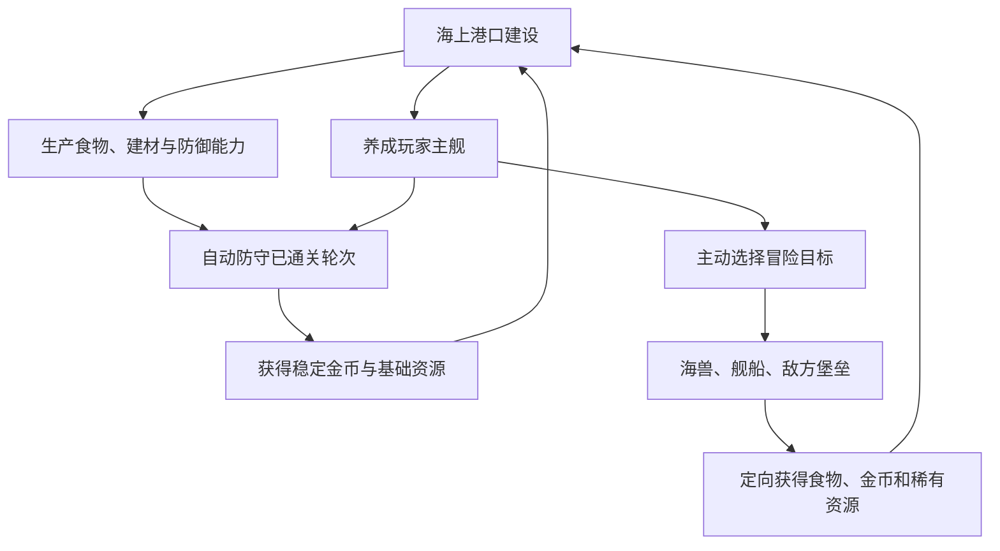
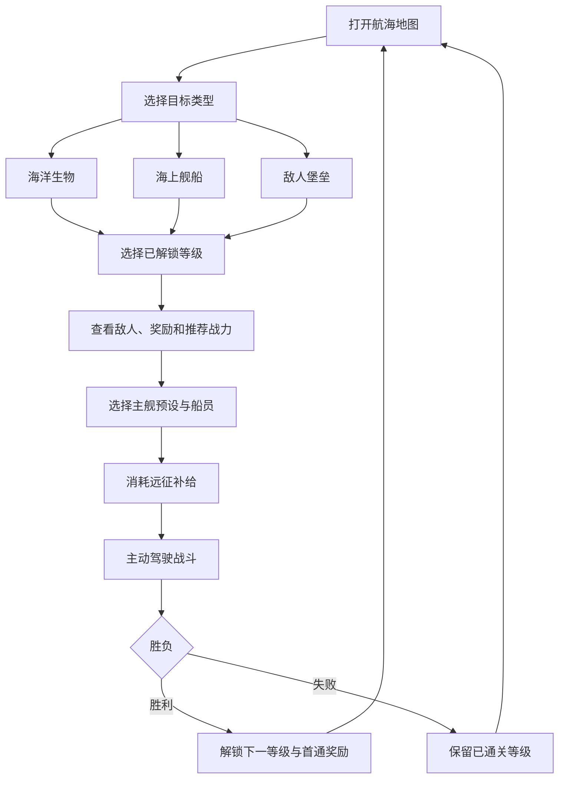

# 《吞吞舰船》海盗生涯：长期养成与海上港口模式设计文档

> 文档版本：V1.0  
> 模式名称：海盗生涯  
> 模式定位：海上港口建设 + 挂机防守 + 主动出海 + 永久舰船养成  
> 文档性质：独立模式总案，不修改肉鸽模式及其他旧文档  
> 推荐平台：Unity 3D，优先支持 PC 键鼠，结构预留移动端  
> 核心原则：港口长期存在、养成永久保留、挂机能够稳定成长、主动游玩提升获取效率

---

## 1. 模式定位

## 1.1 一句话玩法

玩家在没有陆地的海面上，从一小片浮木平台开始，向东西南北自由扩建自己的水上城市；建造生产、防御、居住和装饰设施，抵御周期性来袭的敌舰，并驾驶永久养成的主舰主动出海猎杀海兽、劫掠舰船和攻打敌方堡垒。

## 1.2 与肉鸽远征的区别

| 项目 | 肉鸽远征 | 海盗生涯 |
| --- | --- | --- |
| 核心周期 | 单局 10～20 分钟 | 长期持续养成 |
| 舰船成长 | 局内随机强化，结束后重置 | 永久属性、卡牌、装备和舰体升级 |
| 建造 | 无或极少 | 自由扩建海上港口 |
| 战斗 | 连续闯关和 Boss | 港口自动防守 + 主动选择目标 |
| 失败 | 结束本局 | 不清档，回到已通关轮次积累资源 |
| 资源 | 单局金币和强化 | 金币、食物、木材、建材、金属、稀有材料 |
| 在线要求 | 以主动游玩为主 | 在线与离线均可成长 |
| 策略重点 | 临时构筑组合 | 港口布局、生产链、永久舰船配置 |

## 1.3 三层核心循环



三层循环相互支撑：

- 港口生产为舰船出海提供补给。
- 自动防守提供稳定的挂机收益。
- 主动出海定向解决当前最缺少的资源。
- 主舰成长后能帮助港口挑战更高轮次。
- 更高轮次和更高级冒险解锁新的建筑与舰船养成内容。

---

## 2. 长期成长结构

玩家长期发展的四条主线：

1. 港口规模：地基面积、建筑数量、装饰度、仓储和人口。
2. 港口实力：炮塔、防御挡板、维修、守卫舰和防守轮次。
3. 主舰实力：舰体、武器、永久强化卡、船员和主动技能。
4. 冒险进度：海洋生物、海上舰船、敌方堡垒三条独立等级线。

## 2.1 港口等级

港口等级由核心建筑“海心指挥台”控制：

| 指挥台等级 | 港口阶段 | 主要解锁 |
| ---: | --- | --- |
| 1 | 漂流据点 | 浮木地基、简易房屋、捕鱼点、基础炮台 |
| 2 | 海上营地 | 建材工坊、仓库、防御挡板、主舰船坞 |
| 3 | 木制港镇 | 鱼肉工坊、市场、速射炮、自动防守 Boss |
| 4 | 武装港口 | 加固地基、鱼雷台、维修码头、主动攻打堡垒 |
| 5 | 海上城市 | 大型房屋、铸造工坊、导弹塔、护卫船厂 |
| 6 | 海盗要塞 | 钢制平台、雷暴塔、布雷区、精英舰船卡牌 |
| 7 | 浮海城邦 | 多区域港口、贸易站、大型造船厂 |
| 8 | 海上王城 | 巨型炮塔、堡垒挡板、稀有生产链 |
| 9 | 海洋霸权 | 舰队指挥、传奇卡牌、远洋高阶冒险 |
| 10 | 吞海帝港 | 终局建筑、无尽防守、巨型旗舰养成 |

升级海心指挥台需要：

- 防守轮次达到要求。
- 三类主动冒险中至少两类达到指定等级。
- 港口繁荣度达到要求。
- 消耗金币、建材和稀有核心。

---

## 3. 海上港口建造规则

## 3.1 完全建立在海上

港口没有岸边、山体或固定陆地：

- 所有建筑必须建在人工地基上。
- 港口可以向东、西、南、北持续扩展。
- 玩家可以搭建长条港口、方形堡垒、多个功能区或不规则水上城市。
- 水面空隙可以保留为航道、港池、捕鱼区和主舰出入口。
- 建筑不能直接悬空建在水面上，特殊浮标类设施除外。

## 3.2 网格

推荐使用正方形网格：

| 参数 | 推荐值 |
| --- | ---: |
| 单格尺寸 | 2m × 2m |
| 基础地基 | 1×1 格 |
| 小型建筑 | 1×1、1×2 |
| 中型建筑 | 2×2、2×3 |
| 大型建筑 | 3×3、4×4 |
| 建筑旋转 | 每次 90° |
| 初始核心平台 | 6×6 格 |

“横向、纵向搭建”在首版中指海平面上的 X/Z 两个方向。首版不做复杂多层楼板；后续可以增加上层甲板和高塔，但不能阻塞基础港口建设。

## 3.3 结构连接

- 新地基必须与现有地基四边之一相连。
- 斜角接触不算有效结构连接。
- 所有地基最终必须能沿相邻关系连接到海心指挥台。
- 被完全隔开的地基区域不能建造。
- 桥梁和栈道可以跨越 1～3 格水面连接两个平台区。
- 拆除连接节点前，系统预览哪些区域会失去结构连接。

## 3.4 承重

采用数据化承重，不做真实浮力模拟：

```text
区域可用承重 = 地基提供的承重总量
区域已用承重 = 建筑重量 + 防御设施重量 + 装饰重量
```

放置建筑必须满足：

- 建筑占用格全部存在有效地基。
- 所属连接区域承重足够。
- 不与其他建筑碰撞。
- 建筑的特殊朝向要求成立。
- 港口等级和蓝图已解锁。

## 3.5 稳定区域

相邻地基会组成结构区域：

- 小范围细长结构稳定度较低。
- 2×2 以上连片平台获得稳定度加成。
- 加固连接件可以提高狭长栈桥承重。
- 大型建筑要求一定数量的连续加固地基。
- 稳定度不足时不是建筑自动倒塌，而是禁止确认放置。

## 3.6 建造交互

```text
进入建造模式
→ 选择分类
→ 选择地基或建筑
→ 鼠标显示半透明预览
→ 移动到网格位置
→ 绿色表示可建，红色表示不可建
→ R旋转
→ 左键确认
→ 右键取消
```

建造预览必须显示：

- 占用格。
- 朝向。
- 出入口。
- 攻击扇区或生产范围。
- 承重变化。
- 建造消耗。
- 不可建造原因。

## 3.7 移动与拆除

- 非战斗状态可以移动建筑。
- 移动不消耗资源，但建造中的建筑不能移动。
- 拆除普通建筑返还 80% 基础建造材料。
- 拆除装饰返还 100%，鼓励调整美观。
- 已消耗的升级材料按 50%～70%返还。
- 自动防守进行时禁止大范围移动关键防御建筑。
- 拆除海心指挥台不允许执行，只能升级或更换外观。

---

## 4. 地基类建筑

## 4.1 基础地基

| 建筑 | 占地 | 功能 | 定位 |
| --- | ---: | --- | --- |
| 简易浮木地基 | 1×1 | 低成本、低承重 | 开局扩张 |
| 宽木筏地基 | 2×2 | 承重较高 | 放置普通工坊 |
| 加固木台 | 1×1 | 提高承重和战斗耐久 | 中期常用 |
| 连接栈道 | 1×2 | 连接不同功能区 | 保留水道 |
| 转角栈道 | L形 | 改变通路方向 | 不规则布局 |
| 浮桶地基 | 1×1 | 低重量、建造快 | 临时扩张 |
| 石质浮台 | 2×2 | 高承重、速度慢、耐久高 | 大型建筑 |
| 钢制浮台 | 2×2 | 极高承重、防火 | 后期军用区 |
| 巨舰甲板地基 | 3×3 | 使用旧舰体作为平台 | 高级特色建筑 |
| 防浪外围平台 | 1×2 | 降低附近建筑受到的冲撞伤害 | 外圈防护 |

## 4.2 特殊连接

| 建筑 | 功能 |
| --- | --- |
| 浮桥 | 跨越 1 格水面 |
| 加长浮桥 | 跨越 2～3 格水面，需要两端固定 |
| 重型连接梁 | 提高狭长区域承重 |
| 活动吊桥 | 平时连接，主舰通过时打开 |
| 水上闸门 | 控制敌人和友方小船进入内港 |
| 外围锚链 | 增加区域稳定度和战斗耐久 |

## 4.3 地基战斗规则

- 地基拥有战斗生命，但不会永久丢失。
- 生命归零时进入“失效”状态：上方建筑停止工作，模型出现破损和下沉表现。
- 战斗结束后自动进入维修。
- 玩家不会因挂机失败而永久失去布局和建筑。
- 若海心指挥台在战斗中被摧毁，判定本轮防守失败。

---

## 5. 装饰与美观建筑

装饰不仅用于美观，也提供少量繁荣度、居民满意度或区域主题分数。加成应该轻，不迫使玩家把港口塞满装饰。

## 5.1 植物

| 装饰 | 占地 | 效果 |
| --- | ---: | --- |
| 盆栽小树 | 1×1 | 增加少量美观度 |
| 海风棕榈 | 1×1 | 提升居住区满意度 |
| 浮岛花圃 | 1×2 | 提高附近房屋繁荣度 |
| 海藻观景池 | 2×2 | 提升游客和市场收益 |
| 果树平台 | 2×2 | 装饰并少量生产食物 |

## 5.2 雕像与标志

| 装饰 | 功能 |
| --- | --- |
| 海盗船长雕像 | 提高港口威望 |
| 巨鲸雕像 | 海兽冒险纪念物 |
| 沉船纪念碑 | 提高防守建筑少量士气 |
| 金币喷泉 | 提高市场区繁荣度 |
| 舰首战利品墙 | 展示击败过的 Boss |
| 海盗旗塔 | 显示港口旗帜和自定义颜色 |

## 5.3 生活装饰

- 木桌与长椅
- 吊床区
- 路灯
- 火盆
- 晾鱼架
- 小型观景台
- 帆布遮阳棚
- 酒桶堆
- 货箱堆
- 渔网架
- 路标
- 木制拱门

## 5.4 装饰规则

- 装饰可以旋转和自由移动。
- 大部分装饰只占很少承重。
- 战斗中装饰被击毁只影响当场表现，不影响核心功能。
- 战后免费恢复装饰外观。
- 同一种装饰大量重复时，繁荣度收益递减。

---

## 6. 基础生存建筑

## 6.1 房屋

| 建筑 | 人口 | 功能 |
| --- | ---: | --- |
| 简易棚屋 | +2 | 开局人口 |
| 木制宿舍 | +6 | 提供工人 |
| 船员公寓 | +12 | 提高船员恢复效率 |
| 海上住宅楼 | +24 | 中后期人口 |
| 舰队宿舍 | +16 | 提高守卫舰和主舰船员上限 |

人口不会真实死亡。食物不足时：

- 生产效率逐渐降到最低 50%。
- 主舰远征补给成本提高。
- 居民满意度下降。
- 不会清空人口或摧毁建筑。

## 6.2 食物建筑

| 建筑 | 功能 |
| --- | --- |
| 简易捕鱼点 | 定时获得生鱼 |
| 自动捕鱼网 | 持续获得生鱼，需要工人 |
| 鱼肉工坊 | 生鱼加工为鱼肉 |
| 熏鱼房 | 鱼肉加工为耐储存口粮 |
| 海鲜厨房 | 制作居民食物和远征补给 |
| 海藻养殖池 | 稳定生产少量食物 |
| 鲸油处理坊 | 海兽材料加工为油料和高级口粮 |
| 冷藏仓 | 提高食物储存上限，降低离线损耗 |

## 6.3 医疗与生活

| 建筑 | 功能 |
| --- | --- |
| 简易医务室 | 缩短主舰战后修理时间 |
| 海盗诊所 | 提高船员状态恢复 |
| 淡水收集器 | 产生生活用水，作为高级生产加成 |
| 海水净化坊 | 稳定生产淡水 |
| 公共食堂 | 降低港口食物消耗 |
| 海盗酒馆 | 提升满意度，刷新可招募船员 |
| 澡堂浮台 | 提升附近住宅效率 |

---

## 7. 生产类建筑

## 7.1 木材与建材

| 建筑 | 输入 | 输出 |
| --- | --- | --- |
| 漂流物打捞台 | 时间 | 废木、少量金属 |
| 木材整理场 | 废木 | 木材 |
| 建材工坊 | 木材 + 金币 | 建材 |
| 加固构件厂 | 建材 + 金属 | 加固构件 |
| 防水材料坊 | 鱼油 + 木材 | 防水建材 |
| 大型结构厂 | 建材 + 金属 + 稀有材料 | 巨型建筑部件 |

## 7.2 金属与机械

| 建筑 | 输入 | 输出 |
| --- | --- | --- |
| 废铁拆解台 | 舰船残骸 | 金属碎片 |
| 熔炼炉 | 金属碎片 + 燃料 | 金属锭 |
| 机械工坊 | 金属锭 + 建材 | 机械部件 |
| 火炮工坊 | 金属 + 金币 | 防御武器升级材料 |
| 舰船部件厂 | 机械部件 + 蓝图 | 主舰升级部件 |
| 精密装配厂 | 高级金属 + 稀有核心 | 传奇舰船材料 |

## 7.3 经济与仓储

| 建筑 | 功能 |
| --- | --- |
| 小型仓库 | 提高木材和建材上限 |
| 食物仓库 | 提高食物上限 |
| 金属仓库 | 提高金属上限 |
| 海盗金库 | 提高金币上限和防守奖励保存上限 |
| 贸易市场 | 定时用一种基础资源换取另一种 |
| 黑市码头 | 刷新稀有材料、卡牌碎片和蓝图 |
| 远洋贸易站 | 进行长时间派遣，返回大量资源 |
| 拍卖浮台 | 出售多余材料，获得金币 |

## 7.4 工人分配

生产建筑需要工人：

- 房屋提供人口。
- 玩家在“港口人员”页面分配工人。
- 无工人建筑暂停生产。
- 工人不足时可以使用“自动分配”。
- 自动分配优先级：食物 → 建材 →维修 → 金属 →贸易。
- 玩家可以锁定某个建筑的工人数，避免自动调整。

---

## 8. 功能与公共建筑

| 建筑 | 功能 |
| --- | --- |
| 海心指挥台 | 港口核心、等级、建造半径、防守失败目标 |
| 瞭望塔 | 提前显示下一轮敌人方向和类型 |
| 航海地图室 | 解锁主动冒险地图和目标情报 |
| 海盗议事厅 | 提供港口全局政策 |
| 任务公告板 | 生成日常和长期任务 |
| 图纸研究室 | 研究建筑和武器蓝图 |
| 气象塔 | 显示风暴和特殊海况，降低天气负面效果 |
| 信号塔 | 提高守卫舰响应和防御射程 |
| 船员招募所 | 刷新不同品质船员 |
| 战斗学院 | 永久提升港口防御单位经验 |
| 航海学院 | 提升主舰冒险收益 |
| 港口管理局 | 保存布局预设、区域命名和统计信息 |

## 8.1 港口政策

海盗议事厅可选择一个当前政策：

| 政策 | 加成 | 代价 |
| --- | --- | --- |
| 全力捕鱼 | 食物产量 +25% | 建材产量 -10% |
| 扩建浪潮 | 地基建造消耗 -15% | 防御建筑伤害 -8% |
| 战时戒备 | 防御伤害 +20% | 生产效率 -12% |
| 远洋掠夺 | 主动冒险奖励 +15% | 自动防守金币 -8% |
| 稳定经营 | 所有基础生产 +8% | 无额外特化 |

政策更换有冷却，不能在战斗中切换。

---

## 9. 战斗与防御建筑

## 9.1 防御挡板

| 建筑 | 功能 |
| --- | --- |
| 浮木挡板 | 低成本阻挡小舟 |
| 加固木墙 | 提高耐久，保护内侧建筑 |
| 铁甲挡板 | 抵抗炮弹和冲撞 |
| 尖刺防撞墙 | 对冲撞敌人造成反伤 |
| 吸能挡板 | 降低爆炸伤害 |
| 活动闸门 | 友方船通过时打开 |
| 防鱼网 | 阻止鲨鱼和小型生物进入内港 |
| 外围防波堤 | 减少水浪、尾拍和声波伤害 |

## 9.2 炮塔

| 建筑 | 攻击特点 |
| --- | --- |
| 简易弩炮 | 攻速慢、成本低 |
| 单管火炮 | 中等射程和单体伤害 |
| 双联火炮 | 稳定物理输出 |
| 速射机炮塔 | 对付小舟和鲨鱼群 |
| 重型岸炮塔 | 极远射程、高伤害、转向慢 |
| 爆炸迫击炮 | 抛物线范围攻击 |
| 垂直导弹塔 | 超远范围、长飞行时间 |
| 鱼雷发射台 | 只能建在临水边缘 |
| 雷暴塔 | 对密集敌人弹射 |
| 火焰喷射塔 | 近距离扇形攻击 |
| 声波驱离塔 | 推开冲撞敌人 |
| 捕鲸鱼叉塔 | 减速大型单位 |

## 9.3 陷阱与区域防御

| 建筑 | 功能 |
| --- | --- |
| 漂浮水雷区 | 敌人进入后爆炸 |
| 渔网减速区 | 降低小型单位速度 |
| 燃烧油区 | 点燃经过敌人 |
| 电网浮标 | 在多个浮标间形成电弧 |
| 诱饵浮标 | 吸引部分敌人攻击 |
| 爆炸油桶阵 | 可被玩家或炮塔提前引爆 |
| 磁力减速浮标 | 降低敌舰移动和转向 |

## 9.4 修理与支援

| 建筑 | 功能 |
| --- | --- |
| 修理塔 | 战斗中修复附近建筑 |
| 消防塔 | 熄灭建筑燃烧 |
| 护盾发生器 | 为附近建筑提供临时护盾 |
| 弹药补给站 | 提高附近炮塔攻击频率 |
| 瞄准指挥塔 | 提高附近炮塔射程和命中 |
| 医疗补给台 | 修复加入防守的玩家主舰 |

## 9.5 船厂与守卫舰

| 建筑 | 功能 |
| --- | --- |
| 小舟船厂 | 自动派出拦截小舟 |
| 冲撞艇船厂 | 派出一次性冲撞艇 |
| 炮艇船厂 | 派出远程炮艇 |
| 鱼雷艇船厂 | 派出反大型舰单位 |
| 维修艇船厂 | 派出维修支援艇 |
| 大型守卫船坞 | 部署永久港口守卫舰 |

守卫船不会永久死亡：

- 战斗中被击沉后退出本轮。
- 战后进入维修倒计时。
- 维修完成后重新参加下一次防守。

---

## 10. 港口布局策略

## 10.1 功能分区

推荐支持玩家自行形成：

- 居住区
- 食物生产区
- 建材工业区
- 军事防御区
- 船坞区
- 市场与装饰区
- 内港水道
- 外圈防波堤

## 10.2 建筑邻接

部分建筑获得邻接加成：

| 组合 | 效果 |
| --- | --- |
| 房屋靠近食堂 | 食物消耗降低 |
| 鱼肉工坊靠近捕鱼点 | 搬运时间降低 |
| 建材工坊靠近仓库 | 生产效率提高 |
| 炮塔靠近弹药站 | 攻击频率提高 |
| 修理塔覆盖挡板 | 战斗续航提高 |
| 市场靠近装饰区 | 金币收益提高 |
| 船厂靠近机械工坊 | 守卫舰维修加快 |

邻接加成不应超过总效率的 20%～30%，否则玩家会被迫只使用固定布局。

## 10.3 攻击方向

自动防守敌人从港口外围多个方向接近：

- 炮塔需要有清晰射界。
- 大型炮塔不能被高建筑完全遮挡。
- 鱼雷台必须朝向外侧水域。
- 船厂需要连续水道让守卫舰离港。
- 挡板用于改变敌人路线，但不能把所有水路完全封死。
- 敌人会优先攻击最近的防御目标，也会寻找通向海心指挥台的路线。

## 10.4 港口核心失败条件

本轮防守失败条件：

- 海心指挥台生命归零。
- Boss 完成特定破坏目标。
- 战斗超过最大时间且敌人仍未被消灭。

其他建筑被摧毁不会立刻失败。

---

## 11. 资源体系

## 11.1 核心资源

| 资源 | 主要来源 | 主要用途 |
| --- | --- | --- |
| 金币 | 自动防守、劫掠舰船、市场 | 通用升级、交易、建筑维护 |
| 生鱼 | 捕鱼建筑、海洋生物冒险 | 食物加工 |
| 食物 | 鱼肉工坊、厨房 | 人口、远征补给 |
| 废木 | 打捞、敌舰残骸 | 木材加工 |
| 木材 | 木材整理场 | 地基、房屋、基础建筑 |
| 建材 | 建材工坊 | 中高级建筑和升级 |
| 金属碎片 | 舰船冒险、防守掉落 | 金属加工 |
| 金属锭 | 熔炼炉 | 武器、防御和主舰部件 |
| 机械部件 | 机械工坊 | 船厂、炮塔、舰船养成 |
| 海兽材料 | 海洋生物冒险 | 食物、特殊卡牌和装备 |
| 稀有核心 | 敌方堡垒、Boss | 高级建筑、舰体突破 |
| 蓝图 | 堡垒首通、研究 | 解锁建筑与舰船部件 |

## 11.2 资源存储

- 每种实体资源有仓储上限。
- 达到上限后生产暂停，不直接销毁。
- 金币使用金库提高上限。
- 离线结算先计算生产，再受仓储上限限制。
- 玩家上线时明确显示哪些资源因仓库已满而停止。

## 11.3 资源转换

低级资源不能在后期完全失去价值：

```text
废木 → 木材 → 建材 → 加固构件
金属碎片 → 金属锭 → 机械部件 → 精密部件
生鱼 → 鱼肉 → 口粮 → 高级补给
海兽材料 → 油料/食物/特殊舰船卡牌材料
```

市场允许低效率转换，防止单一资源长期溢出。

---

## 12. 生产与挂机

## 12.1 在线生产

建筑按固定周期产出：

```text
实际产量 =
基础产量
× 建筑等级倍率
× 工人效率
× 邻接加成
× 港口政策
× 满意度修正
```

## 12.2 离线生产

- 默认离线收益上限 12 小时。
- 升级仓库、灯塔或港口管理局可提高到 18～24 小时。
- 离线期间不播放逐场战斗，只进行结果模拟。
- 离线不会造成永久建筑损坏。
- 上线时弹出离线报告。

## 12.3 离线报告

```text
离线 8小时24分钟

港口生产
金币 +12,450
食物 +3,200
木材 +1,860
建材 +720

自动防守
完成 101 次第28轮防守
获得金币 +8,080
获得金属碎片 +390

仓库已满
木材生产暂停 1小时12分钟
```

---

## 13. 自动战斗总体规则

## 13.1 自动防守定位

自动战斗是稳定挂机收益系统：

- 敌人按固定间隔攻击港口。
- 港口建筑、守卫舰和玩家主舰自动或实时参与。
- 已通关轮次可以反复自动刷取。
- 未通关的下一轮必须由玩家手动发起挑战。
- 失败不会降低已通关轮次。

## 13.2 轮次状态

```text
HighestClearedStage     最高已通关轮次
FarmingStage            当前自动刷取轮次
NextChallengeStage      下一挑战轮次
```

默认：

```text
FarmingStage = HighestClearedStage
NextChallengeStage = HighestClearedStage + 1
```

玩家可以把自动刷取轮次调整到更低的已通关关卡，以选择不同掉落。

## 13.3 自动防守间隔

推荐：

- 每 5 分钟结算一次自动防守。
- 在线停留在港口时，可以观看实时战斗。
- 不在港口场景或离线时，使用结果模拟。
- 每个普通防守战持续约 45～90 秒表现时间。
- 玩家可以关闭实时观看，直接在战报中领取。

## 13.4 基础轮次与 Boss 轮次

| 轮次 | 类型 |
| ---: | --- |
| 1～4 | 普通轮次 |
| 5 | Boss 轮次 |
| 6～9 | 普通轮次 |
| 10 | Boss 轮次 |

每 5 轮出现一个 Boss。Boss 轮首次通关解锁：

- 新建筑蓝图
- 新舰船卡牌
- 新主动冒险区域
- 港口指挥台升级条件

## 13.5 重复刷取

已通关轮次进入“稳定防守版本”：

- 敌人生命和伤害为首次挑战的 90%～95%。
- 基础奖励为首次通关奖励的常规部分。
- 不重复获得首通蓝图和稀有核心。
- 港口布局大幅变弱后仍可能失败。
- 连续失败两次后自动降低到前一个已通关轮次，并提示玩家。

## 13.6 手动挑战下一轮

点击“挑战下一轮”：

1. 显示敌人构成和进攻方向。
2. 显示推荐港口防御值和主舰战力。
3. 玩家可以调整建筑、维修和主舰配置。
4. 点击开始后进入实时战斗。
5. 玩家可以亲自操控主舰。
6. 胜利后提高 `HighestClearedStage`。
7. 失败后继续自动刷原来的已通关轮次。

## 13.7 战斗损坏

建筑不会永久消失：

- 战斗内拥有临时生命。
- 战斗结束后保留损坏度。
- 自动消耗少量木材、建材进行维修。
- 资源不足时维修速度降低，不删除建筑。
- 玩家可以点击“立即维修”消耗金币加速。
- 已通关关卡挂机模拟时使用低损耗规则，避免离线资源被维修完全吃光。

---

## 14. 港口防守战场

## 14.1 战斗范围

- 以海心指挥台为中心生成防守战斗边界。
- 港口布局保持玩家真实搭建结果。
- 外围保留足够水域供敌舰和玩家主舰航行。
- 敌人从 1～3 个进攻扇区出现。
- 进攻方向每轮变化，但瞭望塔可提前显示。

## 14.2 敌人目标优先级

基础规则：

1. 挡住路径的防御挡板。
2. 正在攻击自己的炮塔。
3. 船厂和支援建筑。
4. 生产建筑。
5. 海心指挥台。

特殊敌人：

- 冲撞舰优先挡板和核心路线。
- 导弹舰优先远程炮塔与船厂。
- 小舟群攻击外围建筑。
- 爆破艇寻找高密度建筑区。
- Boss 具有独立攻击目标。

## 14.3 玩家主舰加入

在线实时防守时，玩家可以控制主舰：

- 从主舰船坞出发。
- 使用永久装配的武器和技能。
- 可以拦截敌人、保护薄弱方向。
- 可以获得战斗参与奖励。
- 主舰沉没后退出本轮，港口防御继续。
- 主舰沉没不会导致港口直接失败。

## 14.4 自动控制主舰

玩家不手动操作时可开启主舰自动作战：

- 守卫海心指挥台。
- 优先攻击进入港口内部的敌人。
- 生命低于 30% 时退向维修码头。
- 不使用高风险冲撞技能，除非玩家在设置中允许。

---

## 15. 自动防守奖励

## 15.1 常规奖励

| 奖励 | 普通轮 | Boss轮 |
| --- | --- | --- |
| 金币 | 主要 | 大量 |
| 废木 | 少量 | 中量 |
| 金属碎片 | 少量 | 中量 |
| 食物 | 低概率 | 中量 |
| 建筑经验 | 有 | 大量 |
| 稀有核心 | 无或极低 | 首通必得、重复低概率 |
| 蓝图 | 无 | 首通获得 |

## 15.2 奖励公式

```text
自动防守金币 =
轮次基础金币
× 港口收益加成
× 重复刷取倍率
× 离线效率
```

首通奖励与重复奖励分开配置，不能只使用一个倍率。

## 15.3 战报

每次防守记录：

- 战斗轮次
- 胜负
- 主要敌人
- 港口承受伤害
- 伤害最高的炮塔
- 主舰是否参战
- 获得资源
- 损坏建筑和维修时间

战报最多保存最近 30～50 条。

---

## 16. 主舰长期养成

海盗生涯中的主舰独立于肉鸽远征存档：

- 永久等级
- 永久舰体
- 永久武器
- 永久强化卡
- 船员
- 装备与模块
- 冒险记录

## 16.1 主舰养成界面

```text
主舰养成
├── 舰体
├── 四个攻击槽
├── 永久强化卡
├── 船员
├── 装备
├── 属性详情
├── 预设方案
└── 外观
```

左侧显示 3D 舰船；右侧显示当前分页；底部显示综合属性和战斗力。

## 16.2 舰体升级

| 内容 | 作用 |
| --- | --- |
| 舰体等级 | 提高基础生命、承重和模块等级上限 |
| 舰体突破 | 消耗稀有核心，解锁新外观和能力 |
| 装甲等级 | 提高生命和减伤 |
| 推进等级 | 提高速度、加速度和燃料 |
| 指挥等级 | 提高船员和卡牌容量 |
| 武器底座等级 | 提高武器升级上限 |

## 16.3 四个攻击槽

主舰仍可装配四种攻击手段，但规则与肉鸽局内成长分开：

- 武器永久解锁和升级。
- 主动技能永久升级。
- 不在战斗中随机更换武器。
- 出海前可以保存多个装配预设。
- 防守、海兽、船只、堡垒可以使用不同预设。

## 16.4 永久强化卡

永久卡类似肉鸽卡牌的效果语言，但不会在战斗结束后消失。

卡牌分为：

1. 舰体卡
2. 火力卡
3. 移动卡
4. 资源卡
5. 防守协同卡
6. 冒险专精卡

## 16.5 卡牌槽位

- 初始 4 个卡牌槽。
- 舰体和指挥等级提升后最多 10～12 个。
- 同名卡可以升星，但不能重复装备。
- 部分高阶卡占用 2 个容量点。
- 卡牌可以免费卸下，鼓励针对目标调整。

---

## 17. 永久强化卡示例

## 17.1 舰体卡

| 卡牌 | 效果 |
| --- | --- |
| 加固舱壁 | 最大生命提高 |
| 复合装甲 | 降低炮弹伤害 |
| 防爆隔舱 | 降低范围爆炸伤害 |
| 紧急水泵 | 低血时持续恢复 |
| 维修无人机 | 脱战后恢复生命 |
| 防撞骨架 | 降低冲撞反作用伤害 |
| 应急护盾 | 生命低于阈值获得护盾 |
| 海兽皮层 | 降低生物攻击伤害 |

## 17.2 火力卡

| 卡牌 | 效果 |
| --- | --- |
| 强装火药 | 所有普通攻击伤害提高 |
| 快速装填 | 普通武器冷却缩短 |
| 技能增幅器 | 主动技能效果提高 |
| 弱点校准 | 对 Boss 和模块伤害提高 |
| 燃烧弹药 | 投射物附加短暂燃烧 |
| 破甲弹头 | 命中降低目标护甲 |
| 爆心强化 | 爆炸中心伤害提高 |
| 舰队杀手 | 对大型舰体伤害提高 |

## 17.3 移动卡

| 卡牌 | 效果 |
| --- | --- |
| 高效推进 | 最大速度提高 |
| 燃料扩容 | 加速燃料上限提高 |
| 回收涡轮 | 燃料恢复加快 |
| 高速舵面 | 转向效率提高 |
| 破浪船首 | 受到水浪减速降低 |
| 紧急点火 | 低燃料时获得一次短加速 |
| 战术脱离 | 低血时提高移动速度 |
| 追猎推进 | 接近逃跑目标时速度提高 |

## 17.4 资源卡

| 卡牌 | 效果 |
| --- | --- |
| 海兽剥取 | 海洋生物食物掉落提高 |
| 金币磁场 | 舰船金币吸附范围提高 |
| 残骸回收 | 舰船冒险金属掉落提高 |
| 高效补给 | 主动冒险食物成本降低 |
| 宝箱雷达 | 提高特殊奖励发现率 |
| 远洋仓 | 提高单次冒险携带上限 |
| 战利品分类 | 提高稀有材料掉率 |
| 节约维修 | 降低主舰修理资源 |

## 17.5 防守协同卡

| 卡牌 | 效果 |
| --- | --- |
| 港口守护者 | 主舰在港口战斗时伤害提高 |
| 炮塔校准 | 主舰标记目标后炮塔伤害提高 |
| 紧急补给 | 靠近维修塔时恢复速度提高 |
| 舰队指挥 | 守卫舰伤害和生命提高 |
| 核心护卫 | 靠近海心指挥台时获得减伤 |
| 联合齐射 | 主舰技能使附近炮塔立即装填 |

## 17.6 冒险专精卡

| 卡牌 | 效果 |
| --- | --- |
| 猎鲸人 | 对大型海洋生物伤害提高 |
| 劫掠者 | 对运输船和宝箱船奖励提高 |
| 破城者 | 对敌方建筑和挡板伤害提高 |
| 鱼雷预警 | 更早显示敌方鱼雷 |
| 海图专家 | 主动冒险特殊事件概率提高 |
| 首领猎手 | 首次挑战 Boss 时获得伤害加成 |

---

## 18. 卡牌获取与成长

## 18.1 来源

- 自动防守 Boss 首通
- 三类主动冒险
- 图纸研究室
- 黑市码头
- 长期任务
- 港口成就
- 特殊海域事件

## 18.2 品质

| 品质 | 特点 |
| --- | --- |
| 普通 | 单一基础属性 |
| 优良 | 更高数值或两个小属性 |
| 稀有 | 明确流派效果 |
| 史诗 | 改变战斗机制 |
| 传奇 | 强力构筑核心，有装备限制 |

## 18.3 升星

- 重复卡转化为卡牌碎片。
- 消耗碎片和金币升星。
- 升星主要提高数值，不每星增加新机制。
- 关键机制在首次获得卡牌时就开放。
- 满星后重复碎片可转换为通用研究点。

---

## 19. 船员系统

## 19.1 船员类型

| 职业 | 作用 |
| --- | --- |
| 船长 | 提供全舰加成和主动指令 |
| 炮手 | 提高对应武器伤害和装填 |
| 驾驶员 | 提高速度、转向和燃料 |
| 工程师 | 提高修理和护盾 |
| 掠夺手 | 提高战利品 |
| 厨师 | 降低出海食物消耗 |
| 领航员 | 提高特殊事件发现 |

## 19.2 船员养成

- 船员具有等级、品质和一个专长。
- 参加防守和主动冒险获得经验。
- 船员不会永久死亡。
- 主舰沉没后进入疲劳，短时间属性降低。
- 酒馆和诊所可以加速恢复。

首版可以只做“船员提供被动属性”，暂不做独立船员战斗。

---

## 20. 主动出击总体流程



## 20.1 远征补给

主动冒险消耗食物制作的“远征补给”：

- 不使用纯等待恢复的体力条。
- 玩家可以通过港口生产食物继续出海。
- 高级冒险消耗更多补给。
- 失败返还 30%～50%未消耗补给。
- 这样生产建筑与主动玩法形成直接关系。

## 20.2 等级规则

三种冒险各自保存进度：

```text
SeaCreatureLevel
ShipRaidLevel
FortressAssaultLevel
```

- 击败当前最高等级后解锁下一级。
- 已通关等级可以重复挑战。
- 玩家可以挑战任何已解锁等级。
- 首通有额外奖励。
- 失败不会降低等级。
- 每 5 级出现一个 Boss 或特殊关卡。

---

## 21. 海洋生物冒险

## 21.1 主要奖励

- 生鱼
- 海兽肉
- 鲸油
- 甲壳
- 海兽骨
- 海兽类永久强化卡

## 21.2 关卡类型

| 类型 | 目标 |
| --- | --- |
| 鲨鱼猎场 | 击败多批鲨鱼群 |
| 剑鱼迁徙 | 拦截高速剑鱼 |
| 虎鲸围猎 | 击败虎鲸家族 |
| 巨蟹巢穴 | 击破甲壳与幼蟹 |
| 巨鲸追踪 | 追赶并击败大型鲸鱼 |
| 深海异兽 | 高级 Boss 战 |

## 21.3 玩法特点

- 敌人移动灵活。
- 小型生物数量多。
- 大型生物拥有明显部位和攻击预警。
- 食物收益最高，金币收益较低。
- 猎鲸人、声波、鱼叉和持续伤害构筑更有优势。

## 21.4 等级示例

| 等级 | 内容 | 首通 |
| ---: | --- | --- |
| 1 | 小型鲨鱼群 | 解锁海兽肉加工 |
| 5 | 锤头鲨首领 | 猎鲸人卡牌 |
| 10 | 虎鲸家族 | 高级鱼肉工坊蓝图 |
| 15 | 装甲巨鲸 | 鲸油处理坊 |
| 20 | 深海巨兽 | 稀有海兽核心 |

---

## 22. 海上船只冒险

## 22.1 主要奖励

- 金币
- 废木
- 金属碎片
- 机械部件
- 舰船武器卡牌
- 运输箱与贸易物资

## 22.2 关卡类型

| 类型 | 目标 |
| --- | --- |
| 商船追击 | 在目标逃走前击沉 |
| 护航劫掠 | 击败护卫后摧毁运输舰 |
| 海盗伏击 | 对抗多方向小型舰队 |
| 军火运输 | 躲避爆炸货物并夺取军火 |
| 舰队决斗 | 与大型武装舰正面作战 |
| 宝藏船队 | 多波限时追击 |

## 22.3 玩法特点

- 金币获取效率最高。
- 敌人武器类型丰富。
- 经常需要加速追逐。
- 运输船、宝箱船和护卫舰组合出现。
- 劫掠者、移动和单体爆发构筑更有优势。

## 22.4 等级示例

| 等级 | 内容 | 首通 |
| ---: | --- | --- |
| 1 | 无护卫商船 | 解锁贸易市场 |
| 5 | 小型护航队 | 劫掠者卡牌 |
| 10 | 军火运输舰 | 火炮工坊蓝图 |
| 15 | 重型宝藏船队 | 黑市码头 |
| 20 | 皇家舰队 | 稀有舰船蓝图 |

---

## 23. 敌人堡垒冒险

## 23.1 主要奖励

- 稀有核心
- 建筑蓝图
- 高级建材
- 精密机械部件
- 史诗、传奇卡牌
- 港口指挥台升级材料

## 23.2 关卡类型

| 类型 | 目标 |
| --- | --- |
| 前哨站 | 摧毁核心炮塔 |
| 海上工厂 | 摧毁生产设施 |
| 武装船坞 | 阻止持续造船并摧毁船厂 |
| 防御堡垒 | 突破挡板、雷区和多层炮塔 |
| 双核心城 | 分别摧毁两个功能区域 |
| 巨型海上要塞 | 多阶段 Boss 堡垒 |

## 23.3 玩法特点

- 关卡时间最长。
- 敌人建筑不会移动，但防线复杂。
- 会持续产生守卫舰。
- 玩家需要选择先摧毁炮塔、船厂、维修还是核心。
- 稀有资源收益最高。
- 破城者、范围伤害和生存构筑更有优势。

## 23.4 等级示例

| 等级 | 内容 | 首通 |
| ---: | --- | --- |
| 1 | 木制前哨 | 加固地基蓝图 |
| 5 | 武装船坞 | 鱼雷防御台 |
| 10 | 铁甲堡垒 | 钢制浮台 |
| 15 | 导弹海城 | 垂直导弹塔 |
| 20 | 海盗王城 | 传奇核心与高级指挥台材料 |

---

## 24. 主动冒险失败和重复

失败后：

- 不降低已通关等级。
- 获得少量战斗参与资源。
- 返还部分未消耗补给。
- 显示失败原因：生存不足、火力不足、追击速度不足、堡垒拆除效率不足。
- 推荐相关建筑、卡牌或主舰模块。

重复已通关等级：

- 获得正常基础资源。
- 首通蓝图和固定卡牌不重复。
- 稀有材料使用概率掉落。
- 可以扫荡低于当前最高等级一定范围的关卡。

## 24.1 扫荡

建议规则：

- 当前类型最高通关等级比目标高 5 级后解锁扫荡。
- 扫荡消耗相同补给。
- 奖励为手动完成的 80%～90%。
- 稀有首领材料不能完全依赖扫荡，保留一定主动战斗价值。

---

## 25. 冒险地图界面

主界面显示海图与三个大型区域：

```text
海洋生物区
当前：Lv.12
主要奖励：食物、海兽材料

海上船只区
当前：Lv.15
主要奖励：金币、金属

敌方堡垒区
当前：Lv.8
主要奖励：蓝图、稀有核心
```

选择区域后显示：

- 当前等级和下一等级
- 敌人预览
- 特殊机制
- 推荐战力
- 推荐武器标签
- 普通奖励
- 首通奖励
- 补给消耗
- 历史最佳时间
- 挑战、重复挑战或扫荡按钮

---

## 26. 港口主界面

## 26.1 HUD

顶部：

- 港口等级
- 金币
- 食物
- 木材
- 建材
- 金属
- 稀有核心

左侧：

- 当前任务
- 自动防守倒计时
- 建筑生产完成提示
- 船员与人口状态

右侧：

- 建造
- 港口管理
- 主舰养成
- 航海地图
- 自动防守
- 战报

底部：

- 建造分类栏
- 当前选中建筑信息
- 区域和承重信息

## 26.2 港口状态条

显示：

- 人口：已用/上限
- 食物供给
- 工人数
- 仓储占用
- 港口繁荣度
- 防御评分
- 下一轮自动防守时间

---

## 27. 建造模式 UI

## 27.1 分类

1. 地基
2. 生存
3. 生产
4. 仓储
5. 公共
6. 防御
7. 船厂
8. 装饰
9. 道路与连接

## 27.2 建筑卡

显示：

- 图标
- 名称
- 等级
- 占地
- 重量
- 建造时间
- 资源消耗
- 产出或战斗能力
- 解锁条件

## 27.3 放置提示

不可建造时给出明确原因：

- 缺少地基
- 承重不足
- 与建筑重叠
- 必须临水
- 缺少道路或水道
- 超出建造范围
- 缺少资源
- 指挥台等级不足
- 蓝图未解锁

---

## 28. 自动防守界面

显示：

- 当前最高通关轮次
- 当前自动刷取轮次
- 下一挑战轮次
- 下一次自动防守倒计时
- 敌人构成
- Boss 轮次进度
- 港口防御评分
- 主舰是否加入
- 自动战斗开关
- 离线防守上限
- 最近战报

按钮：

- 观看当前防守
- 挑战下一轮
- 调整刷取轮次
- 一键维修
- 调整防御阵容
- 查看奖励

---

## 29. 主舰养成界面

## 29.1 布局

左侧：

- 3D 主舰
- 旋转和缩放
- 模型上的武器挂点

中间：

- 舰体等级
- 四武器槽
- 船员位置
- 装备槽

右侧分页：

- 属性
- 强化卡
- 武器
- 船员
- 突破
- 外观

底部：

- 当前战斗力
- 防守战力
- 海兽专精
- 劫掠专精
- 破城专精
- 保存预设

## 29.2 属性对比

更换卡牌或装备时显示：

```text
生命      12,400 → 13,260  +860
普通伤害  1,830  → 1,760   -70
速度      14.2   → 15.1    +0.9
食物收益  +10%   → +22%    +12%
```

战斗力只能辅助，不应隐藏实际属性变化。

---

## 30. 新手流程

## 30.1 前 5 分钟

1. 玩家获得 6×6 初始平台。
2. 建造 4 块浮木地基。
3. 建造简易捕鱼点。
4. 建造一间棚屋。
5. 建造木材整理场。
6. 建造第一门简易火炮。
7. 第一次自动防守出现 3～5 艘小舟。
8. 玩家获得金币和废木。

## 30.2 5～15 分钟

- 解锁鱼肉工坊。
- 解锁建材工坊。
- 建造第一座仓库。
- 扩张到第二个功能区。
- 完成第 2～4 轮防守。
- 解锁主舰船坞。
- 主舰加入一次港口防守。

## 30.3 15～30 分钟

- 挑战第 5 轮 Boss。
- 获得第一张永久强化卡。
- 解锁航海地图。
- 完成海洋生物 Lv.1。
- 获得食物并升级捕鱼生产。
- 完成海上船只 Lv.1。
- 获得金币与金属。

## 30.4 30～60 分钟

- 解锁敌方堡垒 Lv.1。
- 获得第一张建筑蓝图。
- 建造鱼雷防御或船厂。
- 开始形成居住、生产和防御分区。
- 设置自动刷取已通关轮次。

---

## 31. 每日与长期目标

## 31.1 每日短循环

- 收取生产。
- 查看离线防守报告。
- 补充或调整工人。
- 进行 2～4 次主动冒险。
- 挑战一次下一防守轮次。
- 升级一座建筑或一张卡牌。

## 31.2 周期目标

- 完成指定等级的三类冒险。
- 击败新的防守 Boss。
- 扩建一定数量地基。
- 达到新的繁荣度。
- 解锁新的港口区域主题。
- 完成大型堡垒首通。

## 31.3 长期追求

- 建造巨型、布局自由且美观的海上城市。
- 收集完整建筑图鉴。
- 培养多个主舰装配预设。
- 推进无尽自动防守。
- 挑战高等级主动冒险。
- 收集传奇强化卡和船员。
- 解锁港口外观主题和 Boss 战利品装饰。

---

## 32. 卡关保护

## 32.1 自动防守卡关

玩家挑战下一轮失败后：

- 自动防守继续刷最高已通关轮次。
- 明确显示距离推荐防御值的差距。
- 推荐提升最薄弱的炮塔、挡板、维修或主舰。
- 重复刷取可以稳定获得所需基础资源。
- 每连续失败 3 次，下一次挑战获得 5%临时鼓舞，最高 15%，胜利后清除。

## 32.2 主动冒险卡关

- 可以刷上一等级。
- 可以切换到另外两种资源线。
- 市场允许低效率换取缺失资源。
- 失败返还部分补给。
- 系统根据失败原因推荐卡牌和武器，而不只显示“战斗力不足”。

## 32.3 生产卡关

- 基础捕鱼、木材和建材不依赖稀有掉落。
- 关键建筑首次建造材料通过任务保底。
- 仓库满时明确提示。
- 工人不足时提供自动分配。

---

## 33. 数值框架

## 33.1 建筑升级

```text
建筑升级消耗 = 基础消耗 × 1.55^(等级-1)
建筑产出 = 基础产出 × 1.32^(等级-1)
建筑战斗属性 = 基础属性 × 1.38^(等级-1)
```

具体指数需要测试。产出成长低于消耗成长，通过解锁高级建筑替代无限升级同一低级建筑。

## 33.2 自动防守敌人成长

```text
普通敌人生命 = 基础生命 × 1.11^(轮次-1)
普通敌人伤害 = 基础伤害 × 1.085^(轮次-1)
Boss生命额外 × 4～8
Boss伤害额外 × 1.5～2.2
```

每 10～20 轮切换新的敌人池，不能只增长数字。

## 33.3 自动防守奖励

```text
基础金币 = 100 × 1.095^(轮次-1)
基础材料 = 材料基数 × 1.07^(轮次-1)
```

Boss 首通提供跳跃式奖励；重复刷取保持稳定，不无限指数膨胀。

## 33.4 主动冒险等级

三类冒险使用独立倍率：

- 海兽：数量和生命成长更明显。
- 舰船：伤害、速度和武器组合成长。
- 堡垒：建筑数量、模块和生产增援成长。

---

## 34. 离线战斗模拟

## 34.1 模拟输入

- 港口防御评分
- 建筑类型和等级
- 主舰是否留守
- 当前刷取轮次
- 已通关稳定倍率
- 建筑当前维修状态

## 34.2 结果

离线模拟不需要运行真实物理：

```text
胜率评分 =
有效防御能力
÷ 当前轮次需求
```

已通关稳定轮：

- 评分 ≥1.0：正常胜利。
- 评分 0.85～1.0：胜利但维修消耗增加。
- 评分低于 0.85：可能失败并自动降级刷取。

未通关轮次永远不在离线状态自动挑战。

## 34.3 防止离线惩罚

- 离线失败不摧毁建筑。
- 不扣除大量资源。
- 只损失该次潜在奖励和少量维修时间。
- 连续失败后自动降低轮次。
- 上线报告说明原因。

---

## 35. 港口战斗表现

- 敌人从远处海面出现。
- 瞭望塔发出警报。
- 炮塔转向、装填、开火。
- 船厂闸门打开，守卫舰出动。
- 挡板受击出现破损，但战后恢复。
- 建筑生命使用世界 Slider，无滑块 Handle。
- 关键建筑被攻击时 HUD 指示方向。
- 玩家主舰进入港口时，附近炮塔和船员给予欢迎或战斗反馈。
- Boss 出现时镜头拉远，显示港口全景与进攻方向。

---

## 36. Unity 场景与系统结构

## 36.1 场景建议

```text
PirateCareer_Port
├── PortGameManager
├── GridSystem
├── BuildSystem
├── PortSimulation
├── ProductionSystem
├── WorkerSystem
├── AutoDefenseSystem
├── OfflineProgression
├── PlayerShipDock
├── WaterAndEnvironment
├── RuntimeBuildings
├── RuntimeShips
├── CombatSpawnPoints
├── MainCamera
└── PortCanvas
```

主动冒险使用独立战斗场景或同一战斗框架的不同地图配置。

## 36.2 建筑数据

```text
BuildingDefinition
├── BuildingId
├── DisplayName
├── Category
├── Size
├── Weight
├── FoundationRequirement
├── PlacementRules
├── BuildCost
├── BuildTime
├── WorkerSlots
├── ProductionRecipe
├── CombatStats
├── AdjacencyEffects
├── UnlockConditions
├── UpgradeLevels
└── Prefab
```

## 36.3 港口保存

```text
PortSaveData
├── SaveVersion
├── CommandCenterLevel
├── GridOrigin
├── FoundationInstances[]
├── BuildingInstances[]
├── DecorationInstances[]
├── Inventory
├── Population
├── WorkerAssignments
├── ProductionStates
├── HighestDefenseStage
├── FarmingStage
├── AdventureProgress
├── PlayerShipProgress
├── CrewData
├── CardCollection
├── LastOfflineTimestamp
└── TutorialProgress
```

建筑实例保存：

- 唯一 ID
- 建筑定义 ID
- 网格坐标
- 旋转
- 等级
- 当前生产
- 工人
- 维修状态
- 外观皮肤

---

## 37. 主要脚本职责

| 脚本 | 职责 |
| --- | --- |
| `PortGridManager` | 网格、占用、连接和区域 |
| `BuildModeController` | 选择、预览、旋转、确认和取消 |
| `PlacementValidator` | 地基、承重、临水、碰撞和解锁检查 |
| `FoundationNetwork` | 连接海心指挥台和承重区域 |
| `PortSaveManager` | 港口布局、养成和版本迁移 |
| `ProductionManager` | 配方、时间、仓储和离线产出 |
| `WorkerAssignmentManager` | 人口和工人分配 |
| `PortDefenseManager` | 实时港口防守流程 |
| `AutoBattleSimulator` | 离线和非观看防守结果模拟 |
| `DefenseStageManager` | 已通关、刷取和下一挑战轮次 |
| `BuildingCombatController` | 建筑生命、失效和维修 |
| `GuardShipManager` | 守卫舰出动、死亡和维修 |
| `CareerShipProgression` | 主舰永久等级、突破和属性 |
| `PermanentCardManager` | 卡牌收集、升星、槽位和预设 |
| `CrewManager` | 船员招募、经验、疲劳和分配 |
| `AdventureMapManager` | 三类冒险等级、奖励和关卡 |
| `OfflineRewardCalculator` | 离线时长、产出、防守和仓储 |
| `PortHUDController` | 资源、生产、防守、任务和警报 |

---

## 38. 性能与技术原则

## 38.1 港口建筑

- 静态建筑按区域合批。
- 装饰物使用 GPU Instancing。
- 远距离建筑使用 LOD。
- 不给每个生产建筑运行独立 Update。
- 生产由统一管理器按时间戳计算。
- 建筑范围效果使用区域缓存，不每帧全场查找。

## 38.2 自动战斗

- 小舟、炮弹、金币、特效使用对象池。
- 离线不实例化任何战斗对象。
- 不观看的在线自动战斗也可以使用快速模拟。
- 只有玩家选择“观看”时运行完整物理战斗。

## 38.3 UI

- 建筑信息、血条和伤害数字池化。
- 港口大量建筑不持续显示名称。
- 只显示选中建筑、受攻击关键建筑和当前生产完成提示。
- 生产图标合并，不让整个港口布满气泡。

---

## 39. 实现阶段

## 阶段 1：港口建造原型

- 海面与 6×6 初始平台。
- 1×1 浮木地基。
- X/Z 四方向扩建。
- 网格吸附、旋转、移动、拆除。
- 建筑占用和连接检查。

## 阶段 2：基础生产

- 捕鱼点。
- 鱼肉工坊。
- 木材整理场。
- 建材工坊。
- 棚屋。
- 仓库。
- 时间生产和离线计算。

## 阶段 3：基础防守

- 海心指挥台。
- 简易火炮。
- 防御挡板。
- 小舟和冲撞舟攻击港口。
- 建筑临时生命与战后维修。
- 自动刷取最高已通关轮次。

## 阶段 4：主舰加入

- 主舰船坞。
- 玩家实时操控主舰参加防守。
- 自动控制主舰。
- 主舰永久属性和四武器预设。

## 阶段 5：主动冒险

- 海洋生物 Lv.1～5。
- 海上船只 Lv.1～5。
- 敌方堡垒 Lv.1～5。
- 首通、重复挑战和补给消耗。

## 阶段 6：长期养成

- 永久强化卡。
- 船员。
- 建筑升级。
- 港口等级。
- 防守 Boss。
- 蓝图和稀有核心。

## 阶段 7：内容扩展

- 更多建筑。
- 守卫舰船厂。
- 市场和黑市。
- 港口政策。
- 装饰与繁荣度。
- 更高冒险等级和无尽防守。

---

## 40. 第一版最小可玩内容

第一版不需要一次实现全部长期系统，建议范围：

### 建造

- 3 种地基
- 棚屋
- 捕鱼点
- 鱼肉工坊
- 木材整理场
- 建材工坊
- 仓库
- 海心指挥台
- 简易火炮
- 防御挡板
- 主舰船坞
- 8～12 种装饰

### 自动战斗

- 10 个轮次
- 第 5、10 轮为 Boss
- 最高已通关轮次自动刷取
- 手动挑战下一轮
- 实时观看与结果模拟
- 基础战报

### 主舰

- 1 个永久舰体
- 4 个攻击槽
- 12 张永久强化卡
- 3 套装配预设
- 参加港口防守

### 主动冒险

- 海洋生物 Lv.1～5
- 海上船只 Lv.1～5
- 敌方堡垒 Lv.1～5
- 三类独立进度
- 首通与重复奖励

### 长期系统

- 港口等级 1～3
- 金币、食物、木材、建材、金属、稀有核心
- 8 小时离线收益上限，后续升级至 12 小时以上
- 建筑战后维修
- 基础任务和新手引导

---

## 41. 验收清单

### 海上建造

- [ ] 所有普通建筑必须建立在地基上。
- [ ] 地基可以向东、西、南、北扩展。
- [ ] 建筑可以 90°旋转。
- [ ] 放置预览明确显示可建和不可建。
- [ ] 结构必须连接海心指挥台。
- [ ] 大型建筑会检查地基和承重。
- [ ] 玩家可以移动和拆除建筑。
- [ ] 拆除连接节点前会提示受影响区域。

### 生产

- [ ] 捕鱼、木材、建材和房屋形成基础循环。
- [ ] 工人不足时建筑暂停或降效。
- [ ] 仓库满后停止生产并提示。
- [ ] 离线生产不需要运行真实场景。
- [ ] 离线报告显示产量和仓库限制。

### 自动防守

- [ ] 敌人按间隔攻击港口。
- [ ] 每 5 轮出现 Boss。
- [ ] 已通关轮次可以自动重复。
- [ ] 未通关下一轮不会被离线自动挑战。
- [ ] 失败后继续刷最高已通关轮次。
- [ ] 玩家可以手动挑战下一轮。
- [ ] 建筑不会永久消失。
- [ ] 战后维修消耗和时间明确。

### 主舰

- [ ] 主舰可以参加港口实时防守。
- [ ] 主舰可以切换自动和手动控制。
- [ ] 主舰沉没不直接导致港口失败。
- [ ] 舰体、武器和卡牌永久保存。
- [ ] 海盗生涯养成与肉鸽远征存档分开。
- [ ] 可以保存针对不同冒险的配置预设。

### 主动冒险

- [ ] 海兽、舰船、堡垒拥有独立等级。
- [ ] 通关上一级才能挑战下一级。
- [ ] 已通关等级可以重复挑战。
- [ ] 海兽主要获得食物。
- [ ] 舰船主要获得金币和金属。
- [ ] 堡垒主要获得稀有资源和蓝图。
- [ ] 失败不降低进度。
- [ ] 失败返还部分补给并显示改进建议。

### UI

- [ ] 港口主界面能快速进入建造、防守、主舰和冒险。
- [ ] 建造卡显示占地、承重、消耗和解锁条件。
- [ ] 自动防守页面显示刷取轮次和下一挑战。
- [ ] 主舰页面显示真实属性变化，不只显示战力。
- [ ] 冒险地图清晰显示三种资源方向。
- [ ] 离线报告能说明资源来源与仓库溢出。

---

## 42. 模式最终体验

玩家第一次进入海盗生涯时，只有一片简陋的浮木平台、一间棚屋、一个捕鱼点和一门小炮。随着自动防守和主动出海，玩家逐步向四周扩建：

- 把捕鱼区建在港口外缘。
- 把住宅、食堂和装饰组成生活区。
- 把木材、建材、金属工坊组成工业区。
- 用防波堤、炮塔、鱼雷台和船厂建立外围防线。
- 在内港停放自己永久培养的主舰和守卫舰。

即使暂时打不过下一轮，港口仍会反复防守已经通关的轮次，稳定获得金币和基础材料。玩家可以继续扩建、升级炮塔、调整布局，或者驾驶主舰主动出海：

- 缺食物就猎杀海洋生物。
- 缺金币和金属就劫掠海上舰队。
- 缺蓝图和稀有核心就攻打敌方堡垒。

最终，玩家从一小片漂流木筏，发展成拥有生产、人口、防御、舰队、贸易和巨型主舰的完整海上城市。这就是海盗生涯模式最核心的长期成长体验。

---

## 43. 第一版实现状态（2026-07-23）

当前项目已按“第一版最小可玩内容”完成长期成长闭环：

- 新增 `PirateCareer_Port` 港口场景，并接入首页模式卡与 Build Settings。
- 默认港口包含 6×6 浮木地基、海心指挥台、棚屋、捕鱼点和简易火炮。
- 支持 2 米网格吸附、四边扩建、90°旋转、承重、临水、唯一建筑、移动、拆除和结构连通性保护。
- 支持工人、人口、生产配方、仓储上限、建筑升级、自动维修和 8 小时离线生产。
- 支持每 5 分钟自动防守、首通挑战、已通关轮次刷取、每 5 轮 Boss、失败鼓舞、战报和离线结果模拟。
- 支持永久主舰舰体、四武器槽、12 张永久强化卡和 3 套独立预设。
- 支持海兽、舰船、堡垒三条独立冒险进度，以及首通、重复、扫荡、定向奖励、失败返还和改进建议。
- 使用独立 JSON 存档 `pirate_career_save.json`，不与肉鸽装配存档共用数据。
- 港口 HUD 已提供资源与仓储、港口状态、建造、防守、主舰、航海地图、战报、离线报告和建筑详情操作。

第一版暂未实现以下实时战斗表现，当前使用数值结果模拟保证长期循环完整：

- 玩家实时操控主舰参加港口防守。
- 主舰自动/手动控制切换、沉没与返航表现。
- 海兽、舰船、堡垒的独立实时战斗场景。
- 防守敌舰、炮弹和港口受击的物理对象与演出。

这些内容作为后续实时战斗阶段扩展，现有 `PortDefenseSystem`、`CareerShipProgression` 和 `CareerAdventureSystem` 已保留数据与调用边界。
