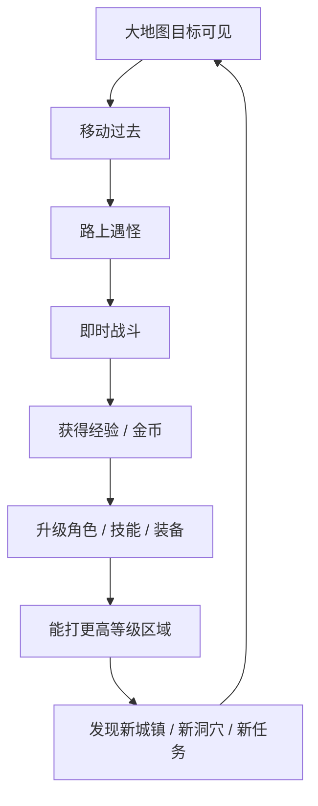
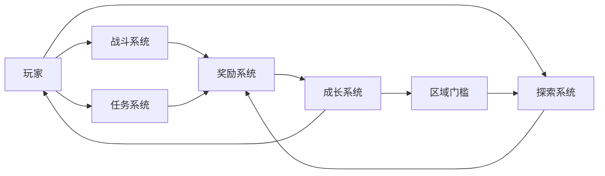
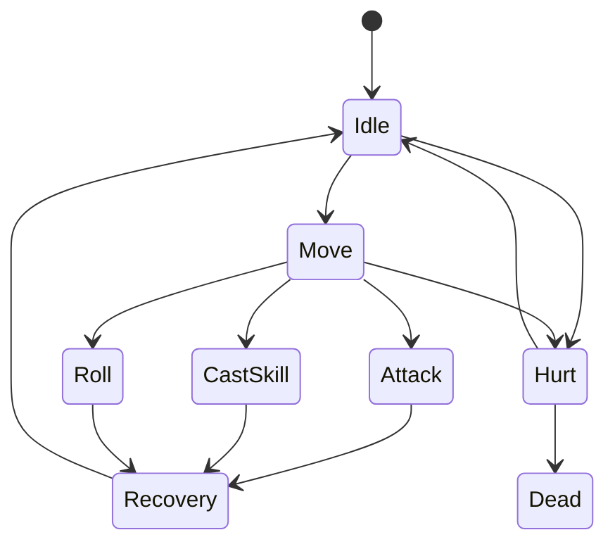
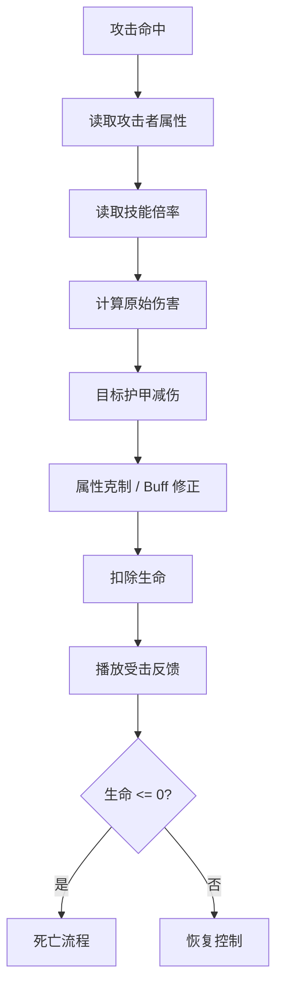
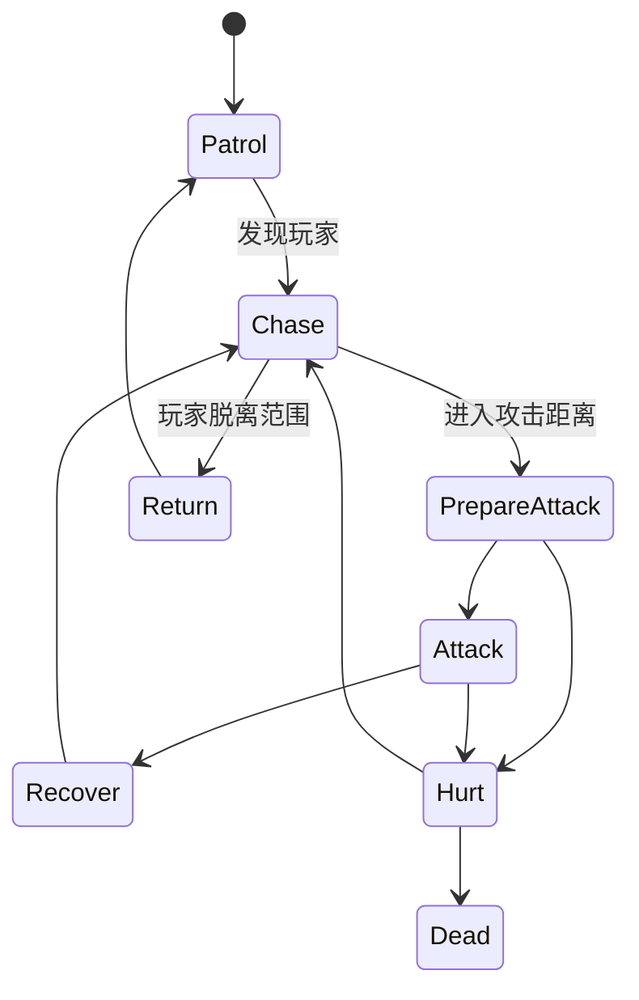
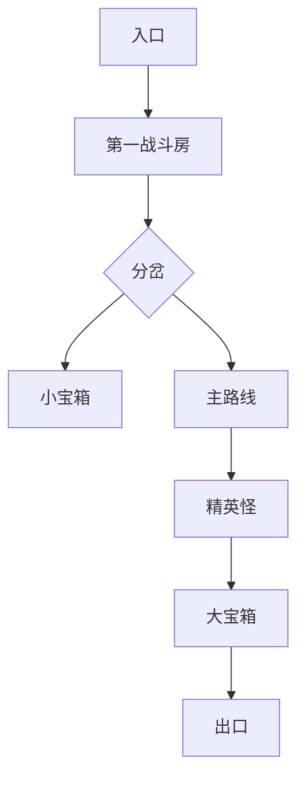

# 轻量开放世界 ARPG 设计拆解与开发目录

> 参考对象：《Cat Quest / 猫咪斗恶龙》  
> 文档目标：拆解其“设计方法”和“系统结构”，用于制作一款合法的同类型精神续作。  
> 推荐项目方向：《小熊勇者大陆》 / 《狗狗骑士传》 / 《兔兔魔法王国》  
> 文档类型：设计向 GDD + 系统拆解 + 开发目录 + 数据表模板  
> 版本：v1.0  
> 日期：2026-05-13

---

## 目录

1. [文档定位与版权边界](#1-文档定位与版权边界)
2. [参考游戏的设计本质](#2-参考游戏的设计本质)
3. [目标产品定位](#3-目标产品定位)
4. [核心设计支柱](#4-核心设计支柱)
5. [玩家体验循环](#5-玩家体验循环)
6. [游戏整体结构](#6-游戏整体结构)
7. [玩家操作设计](#7-玩家操作设计)
8. [战斗系统设计](#8-战斗系统设计)
9. [敌人系统设计](#9-敌人系统设计)
10. [Boss 系统设计](#10-boss-系统设计)
11. [角色属性与成长](#11-角色属性与成长)
12. [装备系统设计](#12-装备系统设计)
13. [技能系统设计](#13-技能系统设计)
14. [世界地图设计](#14-世界地图设计)
15. [地下城 / 洞穴设计](#15-地下城--洞穴设计)
16. [任务系统设计](#16-任务系统设计)
17. [经济系统设计](#17-经济系统设计)
18. [探索与能力解锁](#18-探索与能力解锁)
19. [UI / UX 设计](#19-ui--ux-设计)
20. [美术方向设计](#20-美术方向设计)
21. [音频与反馈设计](#21-音频与反馈设计)
22. [存档与进度系统](#22-存档与进度系统)
23. [终局与二周目设计](#23-终局与二周目设计)
24. [数据表设计](#24-数据表设计)
25. [开发目录结构](#25-开发目录结构)
26. [开发里程碑](#26-开发里程碑)
27. [MVP 内容规划](#27-mvp-内容规划)
28. [设计检查清单](#28-设计检查清单)
29. [风险与规避](#29-风险与规避)
30. [参考资料](#30-参考资料)

---

# 1. 文档定位与版权边界

本文件不是为了制作《Cat Quest》的仿冒版本，而是为了提炼它的玩法结构，并设计一款具有相似体验节奏的原创轻量开放世界 ARPG。

## 1.1 可以学习的内容

可以学习的是“设计模式”：

- 2D 俯视角开放世界。
- 即时制轻动作战斗。
- 普攻、翻滚、技能的三段式战斗操作。
- 地图上高密度目标点。
- 城镇、洞穴、任务、宝箱、装备、技能商店的组合。
- 短副本、短任务、短升级反馈。
- 装备刷取与重复装备升级。
- 区域等级门槛。
- 轻松、可爱、低压力的 RPG 包装。

## 1.2 不应该复制的内容

不能复制或高度近似复刻：

- 原游戏名称、Logo、宣传语。
- 原有猫咪主角设定、角色名、地名、王国名。
- 原地图轮廓、城镇位置、副本名字。
- 原剧情文本和对话梗。
- 原技能名称、装备名称、怪物名称。
- 原 UI 图形、美术素材、音效、音乐。
- 原作具体任务链、任务文本、NPC 名称。

## 1.3 合法复刻建议

建议做成原创题材：

| 方向 | 推荐度 | 说明 |
|---|---:|---|
| 小熊勇者大陆 | 高 | 与猫咪 IP 区分明显，可爱、童话、商业化友好 |
| 狗狗骑士传 | 高 | 与 Cat Quest II 的猫狗战争要避开，建议不做猫狗对立 |
| 兔兔魔法王国 | 中高 | 更偏女性向、休闲向 |
| 狐狸冒险岛 | 中 | 灵巧、魔法、探索感好 |
| 仓鼠地下王国 | 中 | 可爱但世界观展开略受限 |

本文后续默认以 **《小熊勇者大陆》** 作为原创示例。

---

# 2. 参考游戏的设计本质

《Cat Quest》的官方定位是 2D Open World RPG。它的体验重点不是复杂的 RPG 数值，也不是硬核动作，而是把“开放世界 RPG”压缩成高密度、低摩擦、短反馈的轻量体验。

## 2.1 设计本质一句话

> 用最少的操作、最短的任务、最高密度的地图目标，让玩家持续获得“我发现了东西、我打过了怪、我变强了”的轻 RPG 快乐。

## 2.2 它真正厉害的地方

不是单个系统复杂，而是系统之间咬合非常紧：



## 2.3 体验关键词

- 短。
- 快。
- 清楚。
- 可爱。
- 目标永远在视野附近。
- 失败惩罚低。
- 成长反馈频繁。
- 战斗以识别预警和走位为主。
- 探索以“看见目标 → 过去验证”为主。

---

# 3. 目标产品定位

## 3.1 产品类型

```text
2D 俯视角开放世界轻 ARPG
```

## 3.2 推荐平台

| 平台 | 推荐度 | 原因 |
|---|---:|---|
| Steam PC | 高 | 适合先做买断测试，开发验证成本低 |
| 移动端 | 高 | 短任务、短战斗、轻 RPG 很适合移动端 |
| Switch / 掌机 | 中高 | 轻量开放世界与手柄操作适配好 |

## 3.3 目标用户

| 用户类型 | 需求 |
|---|---|
| 休闲 RPG 玩家 | 想要轻松变强，不想看复杂系统 |
| 可爱画风玩家 | 被角色、美术、地图吸引 |
| 探索型玩家 | 喜欢地图上到处有洞穴、宝箱、任务 |
| 轻动作玩家 | 喜欢翻滚躲技能，但不想硬核受苦 |
| 收集玩家 | 喜欢装备、技能、区域完成度 |

## 3.4 产品卖点

建议原创项目卖点写成：

> 一款可爱动物勇者题材的 2D 开放世界动作 RPG。玩家将在童话大陆中探索城镇、洞穴、森林、雪山和火山，学习魔法、收集装备、挑战 Boss，并一步步解锁新的探索能力。

## 3.5 差异化方向

为了和参考游戏拉开距离，建议加入至少 2 个差异化点：

| 差异化点 | 说明 |
|---|---|
| 伙伴系统 | 主角可以带 1 个动物伙伴，伙伴提供被动技能 |
| 地图事件 | 野外随机出现商人、被困 NPC、小 Boss、宝箱雨 |
| 装备词条 | 装备有随机小词条，增强刷装乐趣 |
| 轻肉鸽洞穴 | 部分洞穴有随机房间和随机祝福 |
| 家园 / 营地 | 城镇升级、装饰、功能 NPC 解锁 |
| 魔法组合 | 火 + 风 = 火旋风，冰 + 雷 = 麻痹 |

---

# 4. 核心设计支柱

## 4.1 支柱一：地图即菜单

玩家不应该总是在 UI 菜单里选关，而是直接在大地图上看到目标。

设计要求：

- 地图上直接显示城镇、洞穴、怪物、任务点、宝箱、区域等级。
- 地名可以直接写在地图上，但不要照搬原作风格。
- 玩家从任何位置看出去，最好 5~10 秒内能看到一个兴趣点。
- 低等级区域和高等级区域相邻，让玩家产生“以后再来”的记忆点。

## 4.2 支柱二：战斗只保留最爽的判断

战斗不追求复杂连招，而追求：

- 看见敌人预警。
- 翻滚躲开。
- 抓后摇反击。
- 放技能清场。

设计要求：

- 所有敌方高伤害攻击必须有预警。
- 普攻要短平快。
- 技能要有明显范围和反馈。
- 翻滚要可靠，不能拖泥带水。

## 4.3 支柱三：三分钟一个完整奖励循环

一个普通玩家每 3 分钟应完成一次小闭环：

```text
发现目标 → 战斗 → 开宝箱 / 完成任务 → 获得奖励 → 角色变强
```

## 4.4 支柱四：成长简单但可搭配

属性不要做太多，但装备和技能要能组合出不同打法。

基础流派：

- 物理近战。
- 魔法爆发。
- 高血坦克。
- 治疗续航。
- 高风险高输出。

## 4.5 支柱五：低挫败感

玩家失败后不要严重惩罚。

建议：

- 死亡回最近城镇。
- 不掉装备。
- 不掉经验。
- 可少量掉金币，或完全不掉。
- 死亡界面提示推荐等级、推荐装备、推荐技能。

---

# 5. 玩家体验循环

## 5.1 30 秒微循环

```text
看到怪物 / 宝箱 / 洞穴 / NPC
→ 移动过去
→ 交互或战斗
→ 获得即时反馈
```

## 5.2 3 分钟小循环

```text
接任务
→ 前往目标点
→ 路上打 2~3 波怪
→ 完成目标
→ 交任务
→ 获得经验、金币、装备
```

## 5.3 15 分钟中循环

```text
探索一个区域
→ 完成 2~3 个支线
→ 打 1 个洞穴
→ 升 1~2 级
→ 解锁一个新技能或强化装备
```

## 5.4 60 分钟大循环

```text
进入新区域
→ 解锁城镇
→ 完成主线节点
→ 打区域 Boss
→ 获得关键能力
→ 开启新区域
```

---

# 6. 游戏整体结构

## 6.1 系统总览



## 6.2 主要系统列表

| 系统 | 作用 | MVP 必做 |
|---|---|---:|
| 移动系统 | 玩家走位、探索 | 是 |
| 普攻系统 | 基础输出 | 是 |
| 翻滚系统 | 躲避敌方攻击 | 是 |
| 技能系统 | 魔法输出、治疗、控制 | 是 |
| 敌人 AI | 追踪、预警、攻击 | 是 |
| 任务系统 | 推动主线和支线 | 是 |
| 大地图系统 | 开放世界探索 | 是 |
| 副本系统 | 短洞穴玩法 | 是 |
| 装备系统 | 成长和刷取 | 是 |
| 商店系统 | 金币消耗 | 是 |
| 存档系统 | 进度保存 | 是 |
| 二周目系统 | 终局延长 | 否 |
| 伙伴系统 | 差异化 | 可选 |
| 家园系统 | 差异化 | 可选 |

---

# 7. 玩家操作设计

## 7.1 移动端操作

| 区域 | 控件 | 说明 |
|---|---|---|
| 左下 | 虚拟摇杆 | 控制移动方向 |
| 右下大按钮 | 普攻 | 连续点击普攻 |
| 右下小按钮 | 翻滚 | 朝移动方向翻滚 |
| 右侧环形按钮 | 技能 1~4 | 点击释放技能 |
| 中下 | 交互按钮 | 靠近 NPC / 宝箱 / 入口时出现 |
| 右上 | 小地图 / 地图按钮 | 打开地图 |
| 左上 | 角色状态 | HP、MP、等级 |

## 7.2 PC 操作

| 操作 | 按键 |
|---|---|
| 移动 | WASD |
| 普攻 | 鼠标左键 / J |
| 翻滚 | Space |
| 技能 | Q / E / R / F |
| 交互 | E / F |
| 背包 | I |
| 地图 | M |
| 任务 | L |
| 暂停 | Esc |

## 7.3 手柄操作

| 操作 | 按键 |
|---|---|
| 移动 | 左摇杆 |
| 普攻 | X / Square |
| 翻滚 | B / Circle |
| 技能 | 肩键组合 / 右侧四键 |
| 交互 | A / Cross |
| 地图 | Select |

---

# 8. 战斗系统设计

## 8.1 战斗体验目标

战斗应该让玩家觉得：

- 我看得懂敌人要干什么。
- 我能靠走位和翻滚躲开。
- 我抓住机会反击很爽。
- 技能清怪很有反馈。
- 被打是因为我没躲，而不是系统不公平。

## 8.2 战斗状态机



## 8.3 普攻规则

| 项目 | 推荐值 |
|---|---:|
| 攻击范围 | 角色前方 90° 扇形 |
| 攻击距离 | 1.2~1.8 米 |
| 前摇 | 0.08~0.15 秒 |
| 命中帧 | 0.1 秒 |
| 后摇 | 0.2~0.35 秒 |
| 连击段数 | MVP 先做 1 段，后续 3 段 |
| 是否可移动取消 | 后摇后半段可取消 |

## 8.4 翻滚规则

| 项目 | 推荐值 |
|---|---:|
| 翻滚距离 | 2.5~3.5 米 |
| 翻滚时间 | 0.35~0.45 秒 |
| 冷却 | 0.8~1.2 秒 |
| 无敌时间 | 0.2~0.3 秒 |
| 方向 | 优先摇杆方向，没有输入则朝面向方向 |

翻滚必须做到：

```text
按下立即有反应
中途不能卡地形
结束后能快速恢复控制
躲避成功要有音效或小特效
```

## 8.5 敌人攻击预警

所有危险攻击都应该遵循：

```text
锁定玩家
→ 停顿
→ 地面显示攻击范围
→ 延迟 0.5~1 秒
→ 造成伤害
→ 后摇
```

攻击预警表现：

| 攻击类型 | 预警形状 |
|---|---|
| 近战挥砍 | 扇形 |
| 冲撞 | 长条矩形 |
| 火球 | 直线轨迹 |
| 陨石 | 圆形区域 |
| 毒圈 | 圆形持续区域 |
| 激光 | 细长矩形，先细后粗 |

## 8.6 伤害结算流程



## 8.7 基础伤害公式

### 物理伤害

```text
PhysicalDamage = PlayerAttack * SkillPhysicalScale + WeaponBonus
```

### 魔法伤害

```text
MagicDamage = SkillBaseDamage + PlayerMagic * SkillMagicScale
```

### 护甲减伤

```text
FinalDamage = RawDamage * 100 / (100 + Armor)
```

### 暴击，可选

```text
If Random < CritRate:
    FinalDamage *= CritDamage
```

MVP 可以先不做暴击，避免数值复杂。

---

# 9. 敌人系统设计

## 9.1 敌人设计目标

敌人不是为了堆数量，而是为了教会玩家不同动作判断。

| 敌人类型 | 教学目的 |
|---|---|
| 近战怪 | 学会保持距离和普攻反击 |
| 冲撞怪 | 学会看长条预警翻滚 |
| 远程怪 | 学会横向移动 |
| 法师怪 | 学会离开圆形危险区 |
| 飞行怪 | 学会快速处理追踪压力 |
| 盾牌怪 | 学会绕背或用魔法 |
| 自爆怪 | 学会拉开距离 |
| 精英怪 | 学会组合处理 |

## 9.2 普通敌人 AI 状态机



## 9.3 敌人参数模板

| 参数 | 说明 |
|---|---|
| EnemyID | 敌人 ID |
| Level | 等级 |
| HP | 生命 |
| Attack | 攻击 |
| Armor | 护甲 |
| MoveSpeed | 移动速度 |
| DetectRange | 发现范围 |
| AttackRange | 攻击范围 |
| AttackCooldown | 攻击冷却 |
| WarningTime | 预警时间 |
| ExpReward | 经验奖励 |
| GoldReward | 金币奖励 |
| DropTableID | 掉落表 |
| AIType | AI 类型 |

## 9.4 敌人等级与区域

| 区域 | 敌人等级 | 敌人组合 |
|---|---:|---|
| 新手草原 | 1~5 | 近战怪、史莱姆类 |
| 南部森林 | 5~15 | 近战 + 远程 |
| 沼泽 | 15~25 | 毒圈、减速、飞行怪 |
| 沙漠 | 25~35 | 冲撞、远程、精英怪 |
| 雪山 | 35~50 | 冰冻、范围法师 |
| 火山 | 50~65 | 火圈、爆炸、自爆怪 |
| 黑暗岛 | 65+ | 混合精英、Boss 变体 |

---

# 10. Boss 系统设计

## 10.1 Boss 战目标

Boss 应该是区域学习内容的考试。

例如：

| 区域 | 前面教的东西 | Boss 考的东西 |
|---|---|---|
| 草原 | 近战、翻滚 | 大范围挥砍 + 冲撞 |
| 森林 | 远程躲避 | 弹幕 + 召唤小怪 |
| 沼泽 | 持续区域 | 毒池 + 安全区移动 |
| 雪山 | 冰冻控制 | 减速 + 大范围冰爆 |
| 火山 | 爆炸预警 | 连续火圈 + 岩浆线 |

## 10.2 Boss 阶段结构

```text
阶段 1：普通攻击，展示核心招式
阶段 2：血量低于 70%，加入新招式
阶段 3：血量低于 35%，提高频率或组合招式
击败：掉落关键装备 / 能力 / 主线道具
```

## 10.3 Boss 技能模板

| 技能 | 预警 | 规避方式 |
|---|---|---|
| 三连挥砍 | 扇形红区 | 贴身绕背 / 翻滚 |
| 直线冲撞 | 长条红区 | 横向移动 |
| 召唤小怪 | 地面召唤圈 | 快速清怪 |
| 圆形爆炸 | 大圆红区 | 离开范围 |
| 追踪火球 | 弹道提示 | 持续移动 |
| 全屏大招 | 安全区提示 | 进入安全区 |

---

# 11. 角色属性与成长

## 11.1 玩家属性

| 属性 | 作用 |
|---|---|
| Level | 等级，决定基础成长 |
| EXP | 当前经验 |
| Gold | 金币 |
| HP | 生命 |
| MP / Mana | 法力 |
| Attack | 物理攻击 |
| Magic | 魔法强度 |
| Armor | 护甲 |
| MoveSpeed | 移动速度 |
| RollDistance | 翻滚距离 |
| RollCooldown | 翻滚冷却 |
| CritRate | 暴击率，可选 |
| CritDamage | 暴击伤害，可选 |

## 11.2 升级经验公式

```text
NeedExp(Level) = 50 + Level * Level * 20
```

## 11.3 基础属性成长

```text
BaseHP = 100 + Level * 20
BaseMP = 50 + Level * 2
BaseAttack = 10 + Level * 2
BaseMagic = 10 + Level * 2
BaseArmor = Level * 0.5
```

## 11.4 成长节奏

| 等级段 | 玩家体验 | 解锁内容 |
|---|---|---|
| 1~5 | 学会移动、攻击、翻滚 | 火焰技能、第一件装备 |
| 5~15 | 开始刷洞穴 | 技能商店、铁匠铺 |
| 15~30 | 地图展开 | 第二大区域、控制技能 |
| 30~50 | 形成流派 | 高品质装备、区域 Boss |
| 50~70 | 高级探索 | 飞行 / 水上能力 |
| 70+ | 终局挑战 | 隐藏洞穴、二周目、挑战词条 |

---

# 12. 装备系统设计

## 12.1 装备定位

装备承担三个作用：

1. 提升数值。
2. 支持流派。
3. 作为洞穴和宝箱的主要奖励。

## 12.2 基础装备槽位

MVP 先做三个槽位：

| 槽位 | 作用 |
|---|---|
| 武器 | 主要提升 Attack 或 Magic |
| 头部 | 提供流派属性，如魔法、暴击、MP |
| 身体 | 提供 HP、Armor、防御类属性 |

完整版可以扩展：

| 槽位 | 作用 |
|---|---|
| 饰品 1 | 特殊被动 |
| 饰品 2 | 特殊被动 |
| 伙伴装备 | 伙伴加成 |
| 符文 | 技能改造 |

## 12.3 装备品质

| 品质 | 颜色 | 掉落频率 | 特点 |
|---|---|---:|---|
| 普通 | 白 | 高 | 基础数值 |
| 优秀 | 绿 | 中高 | 单项属性突出 |
| 稀有 | 蓝 | 中 | 有副属性 |
| 史诗 | 紫 | 低 | 有被动效果 |
| 传说 | 橙 | 很低 | 改变玩法 |
| 神器 | 红 | 极低 | 终局目标 |

## 12.4 装备流派

| 流派 | 武器 | 头部 | 身体 | 玩法 |
|---|---|---|---|---|
| 战士 | 高攻击剑 | 攻击头盔 | 护甲 | 近身输出 |
| 法师 | 法杖 | 魔法帽 | 法袍 | 技能爆发 |
| 坦克 | 重锤 | 生命头盔 | 重甲 | 高容错 |
| 游侠 | 短刃 | 速度头巾 | 轻甲 | 快速普攻 |
| 诅咒 | 暗刃 | 诅咒冠 | 暗甲 | 低血高伤 |
| 治疗 | 圣杖 | 生命冠 | 圣袍 | 回复续航 |

## 12.5 装备升级

推荐使用“重复装备升级 + 金币强化”的混合方案。

### 重复装备升级

```text
获得已经拥有的装备
→ 该装备等级 +1
→ 属性提升
```

优点：

- 宝箱永远有价值。
- 重复掉落不恶心。
- 不需要复杂材料。

### 金币强化

```text
消耗金币
→ 选择装备
→ 装备等级 +1
```

升级价格：

```text
UpgradeCost = EquipmentLevel^2 * QualityMultiplier
```

| 品质 | 倍率 |
|---|---:|
| 普通 | 10 |
| 优秀 | 15 |
| 稀有 | 25 |
| 史诗 | 40 |
| 传说 | 70 |
| 神器 | 100 |

---

# 13. 技能系统设计

## 13.1 技能定位

技能承担四个作用：

1. 战斗爆发。
2. 范围清怪。
3. 控制敌人。
4. 提供流派差异。

## 13.2 技能槽位

MVP：

```text
最多装备 3 个技能
```

完整版：

```text
最多装备 4 个技能
技能可以升级到 10 级
技能可通过神殿 / 商店 / 主线解锁
```

## 13.3 技能类型

| 类型 | 示例技能 | 作用 |
|---|---|---|
| 近身范围 | 火环术 | 清理围攻敌人 |
| 直线攻击 | 雷枪术 | 打远程怪 / Boss |
| 圆形爆发 | 星陨术 | 高伤害大招 |
| 治疗 | 生命印记 | 提升容错 |
| 控制 | 冰霜爆 | 减速 / 冻结 |
| 陷阱 | 地刺符文 | 卡位 / 持续伤害 |
| 强化 | 野性怒吼 | 提升普攻输出 |

## 13.4 技能升级规则

| 升级项 | 增长方式 |
|---|---|
| 伤害 | 每级 +10%~15% |
| 治疗 | 每级 +8%~12% |
| 范围 | 每 3 级小幅提升 |
| 冷却 | 高等级减少少量冷却 |
| 消耗 | 不建议随等级提高太多 |

## 13.5 技能数据字段

```text
SkillID
Name
Icon
UnlockCondition
ElementType
ManaCost
Cooldown
CastTime
Range
Radius
BaseDamage
PhysicalScale
MagicScale
Duration
StatusEffectID
VFXPrefab
SFX
Description
```

---

# 14. 世界地图设计

## 14.1 地图设计目标

大地图要像一个“可以走进去的关卡选择界面”。

玩家应该不断产生这些念头：

- 那边有个洞，我想进去看看。
- 那个怪等级太高，我以后再来。
- 那个宝箱好像被河挡住了。
- 那个城镇应该能接新任务。
- 那个岛以后是不是能飞过去。

## 14.2 区域规划

| 区域 | 等级 | 主题 | 主要玩法 |
|---|---:|---|---|
| 蜂蜜草原 | 1~5 | 新手草原 | 教学、第一城镇 |
| 蘑菇森林 | 5~15 | 森林 | 远程怪、支线任务 |
| 荆棘沼泽 | 15~25 | 沼泽 | 毒圈、减速、隐藏路 |
| 风沙峡谷 | 25~35 | 沙漠 | 冲撞怪、强风地形 |
| 雪糖山脉 | 35~50 | 雪山 | 冰冻、滑行地面 |
| 熔心火山 | 50~65 | 火山 | 爆炸、岩浆封锁 |
| 星落群岛 | 65~80 | 岛屿 | 水上 / 飞行能力 |
| 黑月王城 | 80+ | 终局 | 高级 Boss、最终战 |

## 14.3 地图兴趣点密度

推荐密度：

```text
每 5~10 秒看到一个兴趣点
每 30 秒能产生一次交互
每 2~3 分钟完成一次奖励
每 10~15 分钟解锁一个新地点
```

## 14.4 地图点位类型

| 点位 | 功能 |
|---|---|
| 城镇 | 任务、商店、存档、安全区 |
| 洞穴 | 短副本、宝箱、装备 |
| 神殿 | 技能解锁 / 升级 |
| 铁匠铺 | 装备强化 |
| 野外 Boss | 区域挑战 |
| 隐藏宝箱 | 探索奖励 |
| 封锁道路 | 能力门槛 |
| 高等级怪区 | 数值软门槛 |
| 传送点 | 后期减少跑图成本 |

## 14.5 区域引导方式

不用太多文字，靠地图结构引导：

- 道路颜色。
- 怪物等级标识。
- 任务箭头。
- 城镇灯光。
- 洞穴入口发光。
- 河流、山脉、黑雾阻挡。
- 可见但不可达的宝箱。

---

# 15. 地下城 / 洞穴设计

## 15.1 洞穴定位

洞穴是游戏的短副本，也是装备和宝箱的主要产出点。

## 15.2 洞穴时长

| 类型 | 时长 | 内容 |
|---|---:|---|
| 微型洞穴 | 1~2 分钟 | 2 波怪 + 1 宝箱 |
| 普通洞穴 | 3~5 分钟 | 4~6 波怪 + 2 宝箱 |
| 遗迹洞穴 | 5~8 分钟 | 机关 + 精英怪 + 稀有宝箱 |
| Boss 洞穴 | 6~10 分钟 | 小怪铺垫 + Boss |
| 隐藏洞穴 | 1~5 分钟 | 解谜或高等级奖励 |

## 15.3 基础结构模板



## 15.4 洞穴设计规则

每个洞穴只强调一个主题：

| 洞穴主题 | 内容 |
|---|---|
| 近战训练洞 | 大量近战怪，低难度 |
| 远程弹幕洞 | 远程怪 + 掩体 |
| 毒沼洞 | 地面持续伤害 |
| 冲撞洞 | 长条预警和走位 |
| 冰霜洞 | 减速、冻结 |
| 宝箱洞 | 少怪，多奖励 |
| 精英洞 | 少量强怪 |
| Boss 洞 | 区域挑战 |

## 15.5 洞穴完成度

洞穴入口显示：

```text
推荐等级：Lv.15
宝箱：1/2
完成：未完成 / 已完成
特殊奖励：未知 / 已获得
```

完成度用于驱动收集玩家回访。

---

# 16. 任务系统设计

## 16.1 任务设计目标

任务不应很长。任务应该像地图上的一个短故事节点。

要求：

- 单个普通任务 3~8 分钟完成。
- 任务目标最多 3 步。
- 文本短，角色鲜明。
- 奖励明确。
- 每个城镇有 2~5 个任务。

## 16.2 任务类型

| 类型 | 说明 |
|---|---|
| 主线任务 | 推进剧情、解锁区域、解锁能力 |
| 支线任务 | 提供经验、金币、装备和世界观 |
| 连锁任务 | 同一个 NPC 的多阶段故事 |
| 区域任务 | 解决该区域问题 |
| 洞穴任务 | 进入指定洞穴取回物品 |
| 击杀任务 | 打败怪物或 Boss |
| 收集任务 | 收集材料或任务物品 |
| 调查任务 | 到达地点触发剧情 |
| 解锁任务 | 解锁技能、商店、铁匠、传送点 |

## 16.3 任务结构

```text
接取对话
→ 目标说明
→ 地图标记
→ 完成目标
→ 返回 NPC
→ 奖励结算
→ 解锁后续
```

## 16.4 任务目标组件化

任务目标应该做成组件，方便组合：

```text
TalkToNPC
KillEnemy
CollectItem
EnterDungeon
OpenChest
ReachLocation
DefeatBoss
TriggerCutscene
ReturnToNPC
UnlockAbility
```

## 16.5 示例任务链

### 主线：蜂蜜村危机

| 步骤 | 内容 |
|---|---|
| 1 | 村长请求玩家调查蜂蜜田的怪物 |
| 2 | 击败 3 只蜂蜜史莱姆 |
| 3 | 进入蜂巢洞穴 |
| 4 | 击败蜂后 Boss |
| 5 | 获得“风之斗篷”，解锁短距离滑翔 |

### 支线：丢失的午餐盒

| 步骤 | 内容 |
|---|---|
| 1 | 小熊学生丢了午餐盒 |
| 2 | 前往蘑菇林找到午餐盒 |
| 3 | 被宝箱怪袭击 |
| 4 | 回去交任务，获得头部装备 |

---

# 17. 经济系统设计

## 17.1 货币

MVP 只做一种货币：金币。

完整版可加入：

| 货币 | 用途 |
|---|---|
| 金币 | 技能升级、装备强化、商店购买 |
| 星尘 | 高级技能、神器升级 |
| 区域徽章 | 区域商店兑换 |
| 挑战币 | 二周目 / 挑战模式奖励 |

## 17.2 金币来源

| 来源 | 比例 |
|---|---:|
| 怪物掉落 | 30% |
| 任务奖励 | 30% |
| 宝箱 | 25% |
| 出售装备 | 10% |
| 隐藏探索 | 5% |

## 17.3 金币消耗

| 消耗 | 比例 |
|---|---:|
| 技能升级 | 35% |
| 装备强化 | 35% |
| 商店购买 | 20% |
| 传送 / 服务 | 5% |
| 外观 | 5% |

## 17.4 价格曲线

技能升级：

```text
SkillUpgradeCost = 100 * SkillLevel^1.6
```

装备升级：

```text
EquipmentUpgradeCost = 20 * EquipmentLevel^2 * QualityMultiplier
```

商店装备：

```text
ShopPrice = BasePrice * QualityMultiplier * RegionMultiplier
```

---

# 18. 探索与能力解锁

## 18.1 能力门设计

能力门让玩家记住地图，并形成回访目标。

| 能力 | 阻挡物 | 作用 |
|---|---|---|
| 水上行走 | 河流 / 湖泊 | 开启岛屿区域 |
| 滑翔 | 断崖 / 山谷 | 开启高地宝箱 |
| 破魔 | 魔法门 | 开启遗迹 |
| 火焰抗性 | 岩浆地面 | 开启火山深处 |
| 冰霜抗性 | 暴风雪 | 开启雪山深处 |
| 黑雾驱散 | 黑暗区域 | 开启终局地图 |

## 18.2 解锁节奏

| 时间点 | 解锁能力 |
|---|---|
| 30 分钟 | 基础技能商店 |
| 60 分钟 | 第一项移动能力 |
| 2 小时 | 传送点 |
| 3 小时 | 水上移动 |
| 5 小时 | 飞行 / 滑翔 |
| 8 小时 | 黑雾驱散 / 终局区域 |

---

# 19. UI / UX 设计

## 19.1 UI 总原则

- 文字少。
- 按钮大。
- 图标清楚。
- 颜色区分明显。
- 反馈弹跳明显。
- 不做复杂 MMO 面板。
- 任何功能最多 2 层菜单到达。

## 19.2 HUD 布局

```text
左上：头像、等级、HP、MP
中上：当前任务目标
右上：小地图、地图按钮
左下：虚拟摇杆
右下：普攻、翻滚、技能按钮
中下：交互按钮
中央：伤害数字、获得奖励、升级提示
```

## 19.3 HUD 元素

| 元素 | 说明 |
|---|---|
| HP 条 | 红色，受击时震动 |
| MP 条 | 蓝色，技能释放时减少 |
| 任务追踪 | 显示 1 条当前任务 |
| 方向箭头 | 指向任务目标 |
| 小地图 | 显示附近洞穴、城镇、任务 |
| 技能按钮 | 显示冷却、法力不足状态 |
| 交互按钮 | 靠近对象才出现 |

## 19.4 主要界面

| 界面 | 功能 |
|---|---|
| 主菜单 | 开始、继续、设置、退出 |
| 存档选择 | 多存档 |
| 背包界面 | 查看装备、道具 |
| 装备界面 | 装备穿戴和属性对比 |
| 技能界面 | 技能装备、升级 |
| 地图界面 | 查看区域、洞穴完成度、任务点 |
| 任务日志 | 主线、支线、已完成任务 |
| 商店界面 | 购买技能、装备、道具 |
| 铁匠界面 | 强化装备 |
| 对话界面 | NPC 对话和任务接取 |
| 死亡界面 | 复活、提示推荐等级 |

## 19.5 装备界面 UX

装备界面应突出三个信息：

```text
当前穿戴
属性变化
流派影响
```

装备对比样式：

```text
攻击 +12 ↑
生命 -20 ↓
魔法 +8 ↑
特殊：技能伤害 +10%
```

## 19.6 技能按钮状态

| 状态 | 表现 |
|---|---|
| 可释放 | 正常高亮 |
| 冷却中 | 灰色遮罩 + 倒计时 |
| 法力不足 | 蓝色不足提示 / 轻微抖动 |
| 未装备 | 空槽 |
| 长按 | 显示技能说明 |

---

# 20. 美术方向设计

## 20.1 不要照搬的视觉点

不要直接照搬：

- 猫咪主角。
- 地图直接写满猫梗地名的方式。
- 原作城堡、洞穴、地图布局。
- 原作技能图标、装备图标。

## 20.2 推荐原创方向：《小熊勇者大陆》

视觉关键词：

```text
童话绘本
圆润可爱
轻奇幻
低复杂度
高识别度
明亮但不花
地图像玩具沙盘
```

## 20.3 角色风格

主角：

- 小熊勇者。
- 圆头圆耳朵。
- 小披风。
- 武器略夸张。
- 动作幅度大。

NPC：

- 蜂蜜村长。
- 兔子商人。
- 狐狸铁匠。
- 松鼠法师。
- 浣熊冒险家。

敌人：

- 蜂蜜史莱姆。
- 蘑菇怪。
- 荆棘刺猬。
- 沙漠甲虫。
- 雪球怪。
- 火山岩怪。

## 20.4 地图风格

地图像一个可行走的童话沙盘：

- 草地边缘圆润。
- 山脉像玩具积木。
- 河流颜色清澈。
- 洞穴入口夸张发光。
- 城镇建筑可爱且功能明显。

## 20.5 技能特效风格

| 元素 | 表现 |
|---|---|
| 火 | 蜂蜜色 / 橙色，圆润火团 |
| 冰 | 蓝白色，雪花边缘 |
| 雷 | 黄色闪电，短促明亮 |
| 毒 | 绿色泡泡，不要恶心 |
| 治疗 | 绿色叶子 / 金色星星 |
| 暗影 | 紫色烟雾，但保持可爱 |

---

# 21. 音频与反馈设计

## 21.1 音频目标

声音要轻快、短促、可爱，但战斗反馈要有力度。

## 21.2 音效列表

| 类别 | 音效 |
|---|---|
| 玩家 | 脚步、普攻、翻滚、受击、死亡 |
| 技能 | 火、冰、雷、治疗、陷阱、爆炸 |
| 敌人 | 发现、攻击、受击、死亡 |
| UI | 按钮、确认、取消、装备、升级 |
| 奖励 | 金币、经验、宝箱、稀有装备 |
| 场景 | 草地、洞穴、城镇、风雪、岩浆 |

## 21.3 反馈规则

| 行为 | 反馈 |
|---|---|
| 普攻命中 | 命中特效 + 小震屏 + 伤害数字 |
| 翻滚成功躲避 | 短闪光 / 风线 |
| 技能释放 | 范围特效 + 音效 + 按钮冷却 |
| 获得装备 | 弹窗 + 稀有度音效 |
| 升级 | 金光 + 音效 + 属性提示 |
| Boss 登场 | 镜头拉近 + 名字条 |

---

# 22. 存档与进度系统

## 22.1 存档内容

```text
PlayerLevel
CurrentExp
Gold
CurrentHP
CurrentMP
CurrentPosition
CurrentScene
MainQuestProgress
ActiveQuests
CompletedQuests
UnlockedRegions
UnlockedAbilities
UnlockedSkills
SkillLevels
InventoryItems
EquipmentInstances
EquippedItems
OpenedChests
CompletedDungeons
DefeatedBosses
ActivatedTeleportPoints
GameSettings
PlayTime
NewGamePlusState
```

## 22.2 存档时机

| 时机 | 是否自动存档 |
|---|---|
| 完成任务 | 是 |
| 获得装备 | 是 |
| 进入城镇 | 是 |
| 进入 / 离开洞穴 | 是 |
| 击败 Boss | 是 |
| 升级 | 是 |
| 手动保存 | 是 |
| 设置变更 | 是 |

## 22.3 死亡恢复

建议：

```text
死亡后回到最近城镇
HP 恢复 100%
MP 恢复 100%
不损失装备
不损失经验
金币损失 0%~5%，MVP 建议不损失
```

---

# 23. 终局与二周目设计

## 23.1 终局目标

通关后玩家还可以继续：

- 清理未完成洞穴。
- 收集全部装备。
- 强化装备到高等级。
- 打隐藏 Boss。
- 开启新游戏+。
- 挑战限制模式。

## 23.2 新游戏+

规则：

```text
保留角色等级
保留装备
保留技能
重置主线和支线
重置洞穴宝箱
敌人等级整体提升
奖励提升
```

## 23.3 挑战词条

| 词条 | 效果 |
|---|---|
| 等级锁定 | 玩家无法升级 |
| 裸装挑战 | 禁止穿装备 |
| 九命模式 | 全流程只有 9 次死亡机会 |
| 强化怪物 | 敌人伤害和生命提高 |
| 技能禁用 | 只能普攻和翻滚 |
| 低血高伤 | 玩家生命降低，攻击提升 |
| 随机装备 | 宝箱奖励随机化 |

---

# 24. 数据表设计

## 24.1 PlayerLevel.csv

```csv
Level,NeedExp,BaseHP,BaseMP,BaseAttack,BaseMagic,BaseArmor
1,0,100,50,10,10,0
2,130,120,52,12,12,1
3,230,140,54,14,14,2
```

## 24.2 Enemy.csv

```csv
ID,Name,Level,HP,Attack,Armor,MoveSpeed,DetectRange,AttackRange,AttackCooldown,WarningTime,ExpReward,GoldReward,AIType,DropTableID
E001,HoneySlime,1,80,10,0,2.2,5,1.2,2.0,0.6,15,5,Melee,DT001
E002,MushroomShooter,5,110,16,0,1.8,6,5.0,2.5,0.8,35,10,Ranged,DT002
E003,ThornHog,12,220,30,5,3.0,6,3.5,3.0,0.7,80,20,Charge,DT003
```

## 24.3 Skill.csv

```csv
ID,Name,UnlockLevel,ManaCost,Cooldown,CastTime,Range,Radius,BaseDamage,PhysicalScale,MagicScale,Duration,SkillType,StatusEffectID
S001,FireRing,1,20,3,0.1,0,2.5,30,0,1.2,0,AOE,
S002,ThunderLine,5,25,4,0.15,6,0.8,45,0,1.5,0,Line,
S003,HealMark,8,30,8,0.2,0,0,-50,0,1.0,0,Heal,
S004,FrostBurst,12,35,6,0.2,4,2.2,35,0,1.0,2,AOE,Freeze
```

## 24.4 Equipment.csv

```csv
ID,Name,Slot,Quality,BaseHP,BaseMP,BaseAttack,BaseMagic,BaseArmor,PassiveID,MaxLevel,UpgradeType,Icon
EQ001,WoodenSword,Weapon,Common,0,0,5,0,0,,99,Duplicate,icon_sword_001
EQ002,MageLeafHat,Head,Rare,0,20,0,8,0,Passive_ManaRegen,99,Gold,icon_hat_001
EQ003,HoneyArmor,Body,Common,30,0,0,0,5,,99,Duplicate,icon_armor_001
```

## 24.5 Quest.csv

```csv
ID,Title,Type,RequiredLevel,StartNPC,StartCondition,ObjectiveGroupID,RewardExp,RewardGold,RewardItem,UnlockAbility,NextQuest
Q001,HoneyFieldTrouble,Main,1,NPC_VillageChief,None,OBJ_Q001,80,30,EQ001,,Q002
Q002,EnterBeeCave,Main,3,NPC_VillageChief,Q001Completed,OBJ_Q002,150,60,,Glide,Q003
Q101,LostLunchBox,Side,3,NPC_BearKid,None,OBJ_Q101,100,50,EQ002,,
```

## 24.6 QuestObjective.csv

```csv
ObjectiveGroupID,Step,ObjectiveType,TargetID,Count,Description
OBJ_Q001,1,KillEnemy,E001,3,击败蜂蜜史莱姆
OBJ_Q001,2,ReturnToNPC,NPC_VillageChief,1,回去找村长
OBJ_Q002,1,EnterDungeon,D001,1,进入蜂巢洞穴
OBJ_Q002,2,DefeatBoss,BOSS_BeeQueen,1,击败蜂后
```

## 24.7 Dungeon.csv

```csv
ID,Name,RegionID,RecommendedLevel,DungeonType,RoomLayoutID,ChestCount,BossID,RewardTableID,UnlockCondition
D001,BeeCave,R001,3,Normal,LAYOUT_001,2,BOSS_BeeQueen,RT_D001,None
D002,MushroomHole,R002,8,Normal,LAYOUT_002,2,,RT_D002,None
D003,OldForestRuin,R002,15,Ruin,LAYOUT_003,3,BOSS_TreeSpirit,RT_D003,Quest_Q010
```

## 24.8 DropTable.csv

```csv
ID,DropType,TargetID,Weight,MinCount,MaxCount
DT001,Gold,,100,3,8
DT001,Equipment,EQ001,10,1,1
DT002,Gold,,100,8,15
DT002,Equipment,EQ002,8,1,1
```

---

# 25. 开发目录结构

## 25.1 设计文档目录

```text
DesignDocs/
  00_Project/
    00_GameOverview.md
    01_ProductPositioning.md
    02_ReferenceAnalysis.md
    03_CopyrightAvoidance.md
    04_MVPPlan.md

  01_CoreDesign/
    01_CoreLoop.md
    02_PlayerExperience.md
    03_GamePillars.md
    04_ProgressionPacing.md

  02_Combat/
    01_PlayerCombat.md
    02_BasicAttack.md
    03_RollDodge.md
    04_SkillSystem.md
    05_DamageFormula.md
    06_AttackWarning.md
    07_BossCombat.md

  03_Player/
    01_PlayerStats.md
    02_LevelExperience.md
    03_DeathRespawn.md
    04_UnlockAbilities.md

  04_Enemy/
    01_EnemyOverview.md
    02_EnemyAI.md
    03_EnemyTypes.md
    04_EliteEnemies.md
    05_BossDesign.md

  05_World/
    01_WorldMap.md
    02_RegionDesign.md
    03_TownDesign.md
    04_POIDesign.md
    05_WorldGate.md
    06_Teleport.md

  06_Dungeon/
    01_DungeonOverview.md
    02_DungeonLayoutRules.md
    03_RoomTemplates.md
    04_ChestRules.md
    05_DungeonCompletion.md

  07_Quest/
    01_QuestSystem.md
    02_MainQuest.md
    03_SideQuest.md
    04_QuestObjective.md
    05_DialogueRules.md

  08_Equipment/
    01_EquipmentSystem.md
    02_EquipmentSlots.md
    03_EquipmentQuality.md
    04_EquipmentUpgrade.md
    05_EquipmentSets.md

  09_Economy/
    01_Currency.md
    02_Reward.md
    03_Shop.md
    04_Blacksmith.md
    05_PriceCurve.md

  10_UIUX/
    01_HUD.md
    02_InventoryUI.md
    03_EquipmentUI.md
    04_SkillUI.md
    05_QuestUI.md
    06_MapUI.md
    07_ShopUI.md
    08_DialogueUI.md

  11_Art/
    01_ArtDirection.md
    02_CharacterStyle.md
    03_EnemyStyle.md
    04_WorldMapStyle.md
    05_UIStyle.md
    06_VFXStyle.md

  12_Audio/
    01_AudioDirection.md
    02_BGMList.md
    03_SFXList.md

  13_DataTables/
    PlayerLevel.csv
    Enemy.csv
    Skill.csv
    Equipment.csv
    Quest.csv
    QuestObjective.csv
    Dungeon.csv
    DropTable.csv
    Shop.csv

  14_Testing/
    01_CombatTest.md
    02_BalanceTest.md
    03_MapFlowTest.md
    04_NewPlayerTest.md
    05_BugChecklist.md
```

## 25.2 Unity 工程目录

```text
Assets/
  _Game/
    Art/
      Characters/
        Player/
        NPC/
        Enemies/
        Bosses/
      Environment/
        WorldMap/
        Towns/
        Dungeons/
        Props/
      UI/
        HUD/
        Icons/
        Panels/
        Buttons/
        Fonts/
      VFX/
        Skills/
        Hit/
        Loot/
      Animations/

    Audio/
      BGM/
      SFX/
      UI/

    Prefabs/
      Player/
      Enemies/
      Bosses/
      NPC/
      Skills/
      Items/
      Loot/
      UI/
      Map/
      Dungeon/

    Scenes/
      00_Boot/
      01_MainMenu/
      02_WorldMap/
      03_Dungeon/
      04_Test_Combat/
      05_Test_UI/
      06_Test_Dungeon/

    Scripts/
      Core/
        GameManager.cs
        EventBus.cs
        SceneLoader.cs
        SaveManager.cs
        GameConfig.cs

      Data/
        GameDatabase.cs
        DataTableLoader.cs
        PlayerLevelData.cs
        EnemyData.cs
        SkillData.cs
        EquipmentData.cs
        QuestData.cs
        DungeonData.cs
        DropTableData.cs

      Player/
        PlayerController.cs
        PlayerMovement.cs
        PlayerCombat.cs
        PlayerStats.cs
        PlayerRoll.cs
        PlayerSkillCaster.cs
        PlayerInteraction.cs
        PlayerProgression.cs

      Combat/
        DamageSystem.cs
        DamageInfo.cs
        Hitbox.cs
        Hurtbox.cs
        AttackWarning.cs
        Projectile.cs
        AreaEffect.cs
        StatusEffect.cs
        KnockbackSystem.cs

      Skill/
        SkillBase.cs
        SkillRuntime.cs
        SkillManager.cs
        SkillUpgradeSystem.cs
        SkillSlot.cs
        SkillEffectFactory.cs

      Enemy/
        EnemyController.cs
        EnemyStats.cs
        EnemyAI.cs
        EnemyStateMachine.cs
        EnemySpawner.cs
        EnemySkillCaster.cs
        BossController.cs
        BossPhaseController.cs

      Equipment/
        EquipmentData.cs
        EquipmentInstance.cs
        EquipmentManager.cs
        EquipmentUpgradeSystem.cs
        EquipmentPassiveSystem.cs

      Inventory/
        InventoryManager.cs
        ItemData.cs
        LootSystem.cs
        DropTable.cs
        PickupItem.cs

      Quest/
        QuestManager.cs
        QuestRuntime.cs
        QuestObjective.cs
        QuestTracker.cs
        QuestCondition.cs
        QuestRewardSystem.cs

      World/
        WorldMapManager.cs
        RegionManager.cs
        LocationPoint.cs
        WorldGate.cs
        TeleportPoint.cs
        UnlockAbilitySystem.cs
        POIManager.cs

      Dungeon/
        DungeonManager.cs
        DungeonRuntime.cs
        DungeonEntrance.cs
        DungeonExit.cs
        DungeonRoom.cs
        ChestController.cs
        DungeonCompletionTracker.cs

      NPC/
        NPCController.cs
        DialogueData.cs
        DialogueManager.cs
        DialogueCondition.cs

      Shop/
        ShopManager.cs
        ShopData.cs
        ShopItem.cs
        BlacksmithSystem.cs

      UI/
        HUDController.cs
        HPBarUI.cs
        MPBarUI.cs
        SkillButtonUI.cs
        InventoryUI.cs
        EquipmentUI.cs
        SkillUI.cs
        QuestUI.cs
        MapUI.cs
        ShopUI.cs
        DialogueUI.cs
        RewardPopupUI.cs
        DeathUI.cs

      Audio/
        AudioManager.cs
        BGMManager.cs
        SFXManager.cs

      Utils/
        ObjectPool.cs
        Timer.cs
        MathUtils.cs
        DebugCheat.cs

    ScriptableObjects/
      Player/
      Enemies/
      Skills/
      Equipment/
      Items/
      Quests/
      Dungeons/
      Shops/
      Regions/

    DataTables/
      PlayerLevel.csv
      Enemy.csv
      Skill.csv
      Equipment.csv
      Quest.csv
      QuestObjective.csv
      Dungeon.csv
      DropTable.csv
      Shop.csv

    Settings/
      InputActions.inputactions
      Addressables/
      RenderSettings/
```

---

# 26. 开发里程碑

## 26.1 P0：战斗原型，1~2 周

目标：验证战斗手感。

内容：

- 玩家移动。
- 普攻。
- 翻滚。
- 敌人追踪。
- 敌人预警攻击。
- 受击与死亡。
- 经验金币掉落。

验收：

```text
只在测试场景里打怪 10 分钟不无聊。
```

## 26.2 P1：成长闭环，2~3 周

目标：验证“打怪变强”。

内容：

- 玩家等级。
- 经验升级。
- 金币。
- 装备掉落。
- 穿戴装备。
- 技能释放。
- 技能升级。

验收：

```text
玩家能从 Lv1 打到 Lv10，并明显变强。
```

## 26.3 P2：地图闭环，3~4 周

目标：验证开放世界探索。

内容：

- 第一张大地图。
- 1 个城镇。
- 3 个洞穴。
- 任务点。
- 宝箱。
- 区域等级。

验收：

```text
玩家不用教程，也能自然找到任务、洞穴、怪物和奖励。
```

## 26.4 P3：任务闭环，2~3 周

目标：验证 RPG 推进。

内容：

- 1 条主线。
- 5 条支线。
- NPC 对话。
- 任务追踪。
- 任务奖励。

验收：

```text
玩家可以完整完成 30~60 分钟流程。
```

## 26.5 P4：竖切 Demo，4~6 周

目标：可以对外试玩。

内容：

- 3 个区域。
- 1 个 Boss。
- 5 个洞穴。
- 20 件装备。
- 5 个技能。
- 完整 UI。
- 完整存档。

验收：

```text
陌生玩家能独立通关 Demo，且知道后续还有更多区域想玩。
```

---

# 27. MVP 内容规划

## 27.1 30~60 分钟 MVP

| 模块 | 数量 |
|---|---:|
| 大地图 | 1 张 |
| 区域 | 3 个 |
| 城镇 | 1 个 |
| NPC | 5 个 |
| 主线任务 | 3 个 |
| 支线任务 | 5 个 |
| 洞穴 | 5 个 |
| 普通敌人 | 8 种 |
| 精英敌人 | 2 种 |
| Boss | 1 个 |
| 技能 | 5 个 |
| 装备 | 20 件 |
| 宝箱 | 15 个 |

## 27.2 3 小时版本

| 模块 | 数量 |
|---|---:|
| 大地图 | 1 张完整小大陆 |
| 区域 | 5 个 |
| 城镇 | 3 个 |
| 主线任务 | 10 个 |
| 支线任务 | 20 个 |
| 洞穴 | 20 个 |
| 敌人 | 20 种 |
| Boss | 5 个 |
| 技能 | 8 个 |
| 装备 | 60 件 |

## 27.3 8~10 小时版本

| 模块 | 数量 |
|---|---:|
| 区域 | 8 个 |
| 城镇 | 6 个 |
| 主线任务 | 20 个 |
| 支线任务 | 50~70 个 |
| 洞穴 | 50~70 个 |
| 敌人 | 40 种 |
| Boss | 10~15 个 |
| 技能 | 10~12 个 |
| 装备 | 120+ 件 |
| 二周目 | 1 套 |

---

# 28. 设计检查清单

## 28.1 战斗检查

- [ ] 所有敌人强攻击都有预警。
- [ ] 翻滚能稳定躲避预警攻击。
- [ ] 普攻命中反馈清楚。
- [ ] 技能范围清楚。
- [ ] 伤害数字不会遮挡画面。
- [ ] 敌人死亡奖励明显。
- [ ] Boss 招式有阶段变化。

## 28.2 地图检查

- [ ] 玩家 10 秒内能看到兴趣点。
- [ ] 每个区域有城镇或安全点。
- [ ] 高等级区域有清楚等级提示。
- [ ] 洞穴入口明显。
- [ ] 可见但暂时不可达的目标存在。
- [ ] 任务目标方向清楚。

## 28.3 成长检查

- [ ] 玩家每 10~15 分钟至少获得一次明显成长。
- [ ] 重复装备仍然有价值。
- [ ] 金币有稳定消耗点。
- [ ] 技能升级有明显提升。
- [ ] 装备流派差异可感知。

## 28.4 UI 检查

- [ ] HUD 不挡战斗。
- [ ] 技能冷却清楚。
- [ ] 装备对比清楚。
- [ ] 任务目标清楚。
- [ ] 地图标记清楚。
- [ ] 移动端按钮足够大。

## 28.5 新手体验检查

- [ ] 1 分钟内学会移动。
- [ ] 3 分钟内学会攻击和翻滚。
- [ ] 5 分钟内获得第一件装备。
- [ ] 10 分钟内完成第一个任务。
- [ ] 15 分钟内进入第一个洞穴。
- [ ] 30 分钟内打第一个 Boss 或精英怪。

---

# 29. 风险与规避

## 29.1 版权风险

| 风险 | 规避 |
|---|---|
| 主角也是猫勇者 | 改成熊、兔、狐狸等原创动物 |
| 地图结构太像 | 完全重做地图轮廓和区域主题 |
| 技能名相似 | 技能名全部原创 |
| 对话梗相似 | 不使用猫梗、原作谐音梗 |
| UI 太像 | 重做 UI 形状、布局、美术语言 |
| 装备名相似 | 装备名全部原创 |

## 29.2 开发风险

| 风险 | 表现 | 解决 |
|---|---|---|
| 内容量过大 | 洞穴、任务做不完 | 先做 5 个洞穴 MVP |
| 战斗太单薄 | 玩家 10 分钟腻 | 先打磨敌人预警和翻滚 |
| 数值失控 | 玩家过强或过弱 | 数据表驱动，做调试面板 |
| 地图空 | 玩家跑图无聊 | 提高兴趣点密度 |
| UI 太重 | 移动端看不清 | 控制面板层级和按钮数量 |
| 装备没意义 | 玩家只看最高数值 | 增加流派属性和被动 |

## 29.3 设计风险

| 风险 | 解决 |
|---|---|
| 太像参考游戏 | 增加伙伴、家园、随机洞穴等差异化 |
| 太复杂 | MVP 只做核心闭环 |
| 太幼稚 | 美术可爱但 UI 保持精致 |
| 太刷 | 提高任务和探索奖励比例 |

---

# 30. 参考资料

以下资料用于确认参考游戏的公开特征，例如 2D 开放世界、即时战斗、洞穴、任务、装备、技能升级等。设计方案本身为原创改写。

- The Gentlebros - Cat Quest 官方页：<https://thegentlebros.com/catquest/>
- Steam - Cat Quest 商店页：<https://store.steampowered.com/app/593280/Cat_Quest/>
- App Store - Cat Quest：<https://apps.apple.com/us/app/cat-quest/id1148385289>
- Cat Quest Wiki - Spells：<https://cat-quest.fandom.com/wiki/Spells>
- Cat Quest Wiki - Equipment：<https://cat-quest.fandom.com/wiki/Equipment>
- Cat Quest Wiki - Dungeons：<https://cat-quest.fandom.com/wiki/Dungeons>
- Cat Quest Wiki - Mew Game：<https://cat-quest.fandom.com/wiki/Mew_Game_(Cat_Quest_I)>

---

# 附录 A：推荐原创项目一句话方案

## 《小熊勇者大陆》

一款可爱小熊在童话大陆中冒险的 2D 开放世界动作 RPG。玩家通过探索城镇、洞穴和隐藏区域，学习魔法、收集装备、挑战区域 Boss，并逐步解锁滑翔、水上行走、破魔等能力，最终拯救被黑月笼罩的动物王国。

## 核心卖点

```text
可爱动物勇者
轻量开放世界
短洞穴刷装备
即时翻滚战斗
技能与装备流派搭配
高密度地图探索
```

## 首个 Demo 标语

```text
拿起木剑，背上小披风，走进一张会不断冒出惊喜的童话地图。
```

---

# 附录 B：给程序 / Codex 的开发切入提示

可以把下面这段直接给程序或 Codex：

```text
我要制作一款 Unity 2D 俯视角开放世界轻 ARPG。
请先实现一个战斗原型：
1. 玩家 WASD / 虚拟摇杆移动。
2. 玩家可以普攻，攻击前方扇形范围内敌人。
3. 玩家可以朝移动方向翻滚，翻滚有短暂无敌和冷却。
4. 敌人可以发现玩家、追踪玩家、进入攻击距离后停止、显示红色攻击预警范围、延迟后造成伤害。
5. 加入 HP、攻击力、护甲、伤害公式和死亡流程。
6. 怪物死亡后掉落经验和金币。
7. 所有数值用 ScriptableObject 或 CSV 数据表配置。
请按模块化目录创建脚本，不要把逻辑都写在一个 MonoBehaviour 里。
```
